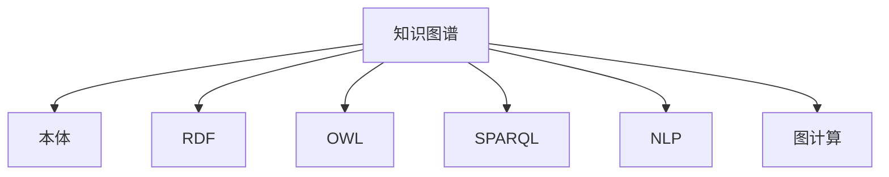

                 

# 知识图谱：构建和应用语义网络

## 1. 背景介绍

### 1.1 问题由来
知识图谱（Knowledge Graph）作为一种表示语义关系的数据结构，近年来在自然语言处理（NLP）和知识发现领域取得了巨大的进展。在信息检索、问答系统、推荐系统等众多应用场景中，知识图谱以其精确性和语义理解能力，显示出了远超传统数据库和标签图的优势。

然而，构建和应用知识图谱并非易事。一方面，需要大量的标注数据和专业领域的知识，使得图谱构建成本高昂；另一方面，应用知识图谱需要融合自然语言处理和图计算技术，对技术栈要求较高。

本文旨在通过介绍知识图谱的核心概念、算法原理及其应用实践，帮助读者系统理解知识图谱的构建和应用，掌握相关技术和工具，推动其在更多领域的应用。

### 1.2 问题核心关键点
知识图谱的核心在于如何高效构建和利用语义网络，以便进行信息检索、问答、推荐、推理等复杂操作。知识图谱通过将实体和关系以图的形式表示出来，并利用图计算技术，能够更精确地理解语义关系，从而提供高质量的信息服务。

构建知识图谱主要涉及实体识别、关系抽取、图谱整合、推理验证等多个步骤。应用知识图谱则包括基于图谱的检索、问答、推荐等。

## 2. 核心概念与联系

### 2.1 核心概念概述

为更好地理解知识图谱的构建和应用，本节将介绍几个密切相关的核心概念：

- 知识图谱（Knowledge Graph）：一种以实体和关系为节点，以边表示实体间关系的图结构。能够精确表达实体间的多重关系，是构建语义搜索引擎、问答系统等的重要基础。

- 本体（Ontology）：一种形式化的知识表示语言，用于描述实体及其属性、关系和约束。本体在知识图谱构建中起着框架和定义作用，帮助明确实体间的关系和属性。

- RDF（Resource Description Framework）：一种语义网数据格式，用于描述资源之间的语义关系。RDF三元组（主体-谓词-对象）是知识图谱的基本组成单元。

- OWL（Web Ontology Language）：一种基于RDF的描述语言，用于定义本体和进行知识推理。OWL在语义网中用于知识描述和推理验证。

- SPARQL（SPARQL Query Language）：一种查询语言，用于从RDF图谱中提取信息。SPARQL提供丰富的查询功能，支持复杂的多重连接和聚合操作。

- 自然语言处理（NLP）：涉及文本的分析和生成技术，包括词法分析、句法分析、语义分析等。NLP技术在实体识别、关系抽取、标签提取中发挥重要作用。

- 图计算（Graph Computing）：一种专门处理图结构数据的技术，包括图遍历、聚合、匹配、推理等操作。图计算技术在知识图谱推理和查询中至关重要。

这些核心概念之间的逻辑关系可以通过以下Mermaid流程图来展示：



这个流程图展示了几大核心概念及其之间的关系：

1. 知识图谱基于本体构建，用于描述和表示实体及其关系。
2. RDF和OWL是构建知识图谱的基本格式和描述语言。
3. SPARQL用于从知识图谱中提取信息。
4. NLP技术用于从自然语言中抽取实体和关系。
5. 图计算技术用于进行知识图谱的推理和查询。

这些概念共同构成了知识图谱的构建和应用框架，使其能够在各种场景下发挥强大的语义理解和信息处理能力。通过理解这些核心概念，我们可以更好地把握知识图谱的工作原理和优化方向。

## 3. 核心算法原理 & 具体操作步骤
### 3.1 算法原理概述

知识图谱的构建和应用涉及多个复杂步骤，主要包括实体识别、关系抽取、图谱整合、推理验证等。其核心算法原理可以概括为：

- **实体识别**：从文本中自动识别出实体（如人名、地名、机构名等）。
- **关系抽取**：从文本中提取实体间的关系（如"毕业于"、"工作于"等）。
- **图谱整合**：将抽取出的实体和关系整合成结构化的知识图谱。
- **推理验证**：在图谱中进行逻辑推理和事实验证，确保知识的一致性和准确性。

在实际应用中，这些步骤往往交织在一起，形成一个复杂的知识图谱构建过程。

### 3.2 算法步骤详解

**实体识别**：

- 输入：自然语言文本
- 输出：识别出的实体及类别标签
- 步骤：
  1. 预处理：分词、去除停用词、词性标注等。
  2. 特征提取：构建特征向量，用于区分不同实体。
  3. 分类：使用分类算法（如CRF、BiLSTM-CRF）进行实体识别。

**关系抽取**：

- 输入：自然语言文本
- 输出：识别出的实体间的关系及关系类型
- 步骤：
  1. 预处理：分词、去除停用词、词性标注等。
  2. 特征提取：构建特征向量，用于区分不同关系。
  3. 分类：使用分类算法（如CRF、BiLSTM-CRF）进行关系抽取。

**图谱整合**：

- 输入：抽取出的实体和关系
- 输出：结构化的知识图谱
- 步骤：
  1. 创建图结构：以实体和关系为节点，边表示实体间的关系。
  2. 图遍历：对图谱进行深度遍历，识别并纠正错误关系。
  3. 验证和合并：进行事实验证和实体合并，确保图谱的一致性和完整性。

**推理验证**：

- 输入：知识图谱
- 输出：推理验证结果
- 步骤：
  1. 逻辑推理：使用逻辑推理规则（如OWL规则）验证图谱的正确性。
  2. 一致性检测：检测图谱中是否存在矛盾和冲突。
  3. 修正：根据推理结果和验证结果，修正图谱错误。

### 3.3 算法优缺点

知识图谱构建和应用的算法具有以下优点：

- 精确性高：基于语义理解，可以提供更精确的信息检索和推荐。
- 可解释性好：通过本体和关系抽取，知识图谱提供了丰富的语义信息，便于理解和解释。
- 适用性强：适用于问答、推荐、知识发现等多个领域，可以高效利用结构化数据。

同时，这些算法也存在一定的局限性：

- 数据依赖性强：知识图谱的构建和应用依赖大量高质量标注数据，数据获取成本高。
- 计算复杂度高：图谱的推理和查询操作复杂，计算量较大，需要高性能计算资源。
- 实时性不足：构建和推理过程较慢，难以满足实时性要求。
- 结构单调：图谱往往只能表示静态知识，难以处理动态变化的复杂关系。

尽管存在这些局限性，但就目前而言，知识图谱仍然是大规模语义数据处理的重要技术手段。未来相关研究的重点在于如何进一步降低知识图谱的构建和应用成本，提高其适用性和实时性，同时兼顾结构多样性和动态变化性等因素。

### 3.4 算法应用领域

知识图谱在多个领域得到了广泛的应用，包括但不限于：

- 信息检索：构建语义搜索引擎，提供精确的搜索结果。
- 问答系统：基于知识图谱构建问答系统，提供准确的回答。
- 推荐系统：利用知识图谱进行个性化推荐，提升用户体验。
- 知识发现：通过知识图谱挖掘数据中的潜在知识，发现新的研究热点。
- 医疗健康：构建医疗知识图谱，辅助医疗决策和知识管理。
- 金融领域：构建金融知识图谱，辅助投资分析和风险管理。

此外，知识图谱还被创新性地应用于自动驾驶、智能家居、社交网络等多个领域，为人工智能技术带来了全新的应用场景。随着知识图谱技术的发展，相信其在更多领域的应用前景将更加广阔。

## 4. 数学模型和公式 & 详细讲解 & 举例说明

### 4.1 数学模型构建

知识图谱的构建涉及实体和关系的表示，以下将以OWL语言为例，介绍OWL本体的基本构建方法。

一个OWL本体由类（Class）、属性（Property）、个体（Individual）组成。类和属性定义了知识的基本元素和关系，个体则是具体实例。OWL本体的基本形式为三元组（类名，属性名，类名），表示实体间的关系。

例如，定义一个简单的图书馆类（Library），包含书籍类（Book）、人员类（Person）等子类，以及借阅关系（borrowed），可表示为：

```owlnext
<http://example.org/Library> a <http://www.w3.org/2002/07/owl#OWLClass> ;
<http://example.org/Library> subclassOf <http://www.w3.org/2002/07/owl#Thing> ;
<http://example.org/Book> a <http://www.w3.org/2002/07/owl#OWLClass> ;
<http://example.org/Book> subclassOf <http://example.org/Library> ;
<http://example.org/Person> a <http://www.w3.org/2002/07/owl#OWLClass> ;
<http://example.org/Person> subclassOf <http://example.org/Library> ;
<http://example.org/borrowed> a <http://www.w3.org/2002/07/owl#OWLDataProperty> ;
<http://example.org/borrowed> inverseOf <http://example.org/lent> ;
<http://example.org/Library> objectProperty <http://example.org/borrowed> .
```

### 4.2 公式推导过程

在OWL中，类和属性之间可以通过类声明和属性声明来定义关系。例如，定义一个类声明（Class Declaration）：

```owlnext
<http://example.org/Person> a <http://www.w3.org/2002/07/owl#OWLClass> ;
<http://example.org/Person> subclassOf <http://www.w3.org/2002/07/owl#Thing> .
```

表示Person是一个OWL类，是所有实体的子类。

属性声明（Property Declaration）用于定义属性类型和关系。例如，定义一个属性声明：

```owlnext
<http://example.org/borrowed> a <http://www.w3.org/2002/07/owl#OWLDataProperty> ;
<http://example.org/borrowed> inverseOf <http://example.org/lent> ;
```

表示borrowed是一个OWL属性，是一个数据属性，与lent属性互为逆向关系。

### 4.3 案例分析与讲解

以构建一个简单的图书馆知识图谱为例，分析其实体和关系定义：

**类定义**：

```owlnext
<http://example.org/Library> a <http://www.w3.org/2002/07/owl#OWLClass> ;
<http://example.org/Book> a <http://www.w3.org/2002/07/owl#OWLClass> ;
<http://example.org/Person> a <http://www.w3.org/2002/07/owl#OWLClass> ;
<http://example.org/Library> subclassOf <http://example.org/Building> ;
<http://example.org/Book> subclassOf <http://example.org/Library> ;
<http://example.org/Person> subclassOf <http://example.org/Library> ;
```

**属性定义**：

```owlnext
<http://example.org/borrowed> a <http://www.w3.org/2002/07/owl#OWLDataProperty> ;
<http://example.org/borrowed> inverseOf <http://example.org/lent> ;
<http://example.org/Library> objectProperty <http://example.org/borrowed> ;
<http://example.org/Library> objectProperty <http://example.org/lent> ;
<http://example.org/Book> objectProperty <http://example.org/borrowed> ;
<http://example.org/Book> objectProperty <http://example.org/lent> ;
```

**个体定义**：

```owlnext
<http://example.org/book1> a <http://example.org/Book> ;
<http://example.org/book2> a <http://example.org/Book> ;
<http://example.org/John> a <http://example.org/Person> ;
<http://example.org/Mary> a <http://example.org/Person> ;
<http://example.org/book1> <http://example.org/borrowed> <http://example.org/John> ;
<http://example.org/book2> <http://example.org/lent> <http://example.org/Mary> ;
```

### 5. 项目实践：代码实例和详细解释说明

#### 5.1 开发环境搭建

在进行知识图谱的构建和应用实践前，我们需要准备好开发环境。以下是使用Python和OWL API进行知识图谱开发的流程：

1. 安装Python：从官网下载并安装Python，建议使用Python 3.8及以上版本。
2. 安装OWL API：使用pip安装OWL API，例如：
```bash
pip install owlapi
```
3. 安装其他依赖：安装必要的库，例如：
```bash
pip install numpy pandas scikit-owl rdflib
```

完成上述步骤后，即可在Python环境中开始构建和应用知识图谱。

#### 5.2 源代码详细实现

下面以构建一个简单的图书馆知识图谱为例，给出OWL API的代码实现。

```python
from owlapi import OWLDataFactory

# 创建OWL工厂
dataFactory = OWLDataFactory()

# 创建类和属性
libraryClass = dataFactory.createOWLClass(iri="http://example.org/Library")
bookClass = dataFactory.createOWLClass(iri="http://example.org/Book")
personClass = dataFactory.createOWLClass(iri="http://example.org/Person")
borrowedProperty = dataFactory.createOWLDataProperty(iri="http://example.org/borrowed")
lentProperty = dataFactory.createOWLDataProperty(iri="http://example.org/lent")

# 创建类声明和属性声明
dataFactory.createOWLClassDeclaration(libraryClass)
dataFactory.createOWLObjectPropertyDeclaration(borrowedProperty)
dataFactory.createOWLObjectPropertyDeclaration(lentProperty)

# 创建个体
book1 = dataFactory.createOWLNamedIndividual(iri="http://example.org/book1", class_=[bookClass])
book2 = dataFactory.createOWLNamedIndividual(iri="http://example.org/book2", class_=[bookClass])
john = dataFactory.createOWLNamedIndividual(iri="http://example.org/John", class_=[personClass])
mary = dataFactory.createOWLNamedIndividual(iri="http://example.org/Mary", class_=[personClass])

# 创建个体声明
dataFactory.createOWLClassDeclaration(libraryClass)
dataFactory.createOWLNamedIndividualDeclaration(book1, libraryClass)
dataFactory.createOWLNamedIndividualDeclaration(book2, libraryClass)
dataFactory.createOWLNamedIndividualDeclaration(john, personClass)
dataFactory.createOWLNamedIndividualDeclaration(mary, personClass)

# 创建个体属性声明
dataFactory.createOWLObjectPropertyDeclaration(book1, borrowedProperty, john)
dataFactory.createOWLObjectPropertyDeclaration(book2, lentProperty, mary)
```

#### 5.3 代码解读与分析

以上代码实现了一个简单的图书馆知识图谱，包含类、属性和个体。以下是代码的关键部分及其解释：

- 创建OWL工厂：使用OWLDataFactory创建OWL对象。
- 创建类和属性：使用OWLDataFactory创建类和属性，并设置其IRI。
- 创建类声明和属性声明：使用OWLDataFactory创建类声明和属性声明，指定其对应的类和属性。
- 创建个体：使用OWLDataFactory创建个体，并设置其类和属性。
- 创建个体声明：使用OWLDataFactory创建个体声明，指定其类和属性。

通过上述代码，可以构建一个包含类、属性和个体的简单知识图谱。

#### 5.4 运行结果展示

运行上述代码，可以生成一个包含实体和关系的知识图谱，使用RDF格式表示。例如，生成的部分RDF文件如下：

```rdfxmlnext
<rdf:RDF xmlns:rdf="http://www.w3.org/1999/02/22-rdf-syntax-ns#" xmlns:owl="http://www.w3.org/2002/07/owl#" xmlns:bibosrc="http://www.w3.org/2005/08/sparql-bibosrc-serialization-namespaces" xmlns:spor="http://www.w3.org/2005/08/sparql-bibosrc-serialization-namespaces">
  <owl:OWLDocument>
    <owl:Ontology>
      <owl:annPropertyName>rdfs:label</owl:annPropertyName>
      <rdfs:label>Library</rdfs:label>
      <rdfs:comment>Library</rdfs:comment>
      <owl:versionInfo></owl:versionInfo>
      <rdfs:seeAlso></rdfs:seeAlso>
    </owl:Ontology>
    <owl:OWLClass>
      <owl:label>Library</owl:label>
      <rdfs:comment>Library</rdfs:comment>
      <owl:equivalentClass>
        <owl:Thing></owl:Thing>
      </owl:equivalentClass>
      <owl:superClassOf>
        <owl:Nothing></owl:Nothing>
      </owl:superClassOf>
      <owl:annPropertyRestriction>
        <owl:Restriction>
          <owl:onProperty>
            <owl:Thing></owl:Thing>
          </owl:onProperty>
          <owl:allValuesFrom>
            <owl:Thing></owl:Thing>
          </owl:allValuesFrom>
        </owl:Restriction>
      </owl:annPropertyRestriction>
      <rdfs:seeAlso></rdfs:seeAlso>
    </owl:OWLClass>
    <owl:OWLDataProperty>
      <owl:label>borrowed</owl:label>
      <owl:domain>
        <owl:OWLClass>
          <owl:label>Library</owl:label>
          <rdfs:comment>Library</rdfs:comment>
          <owl:equivalentClass>
            <owl:Thing></owl:Thing>
          </owl:equivalentClass>
          <owl:superClassOf>
            <owl:Nothing></owl:Nothing>
          </owl:superClassOf>
          <owl:annPropertyRestriction>
            <owl:Restriction>
              <owl:onProperty>
                <owl:Thing></owl:Thing>
              </owl:onProperty>
              <owl:allValuesFrom>
                <owl:Thing></owl:Thing>
              </owl:allValuesFrom>
            </owl:Restriction>
          </owl:annPropertyRestriction>
          <rdfs:seeAlso></rdfs:seeAlso>
        </owl:OWLClass>
      </owl:domain>
      <owl:range>
        <owl:OWLDataProperty>
          <owl:label>lent</owl:label>
          <rdfs:comment>lent</rdfs:comment>
          <owl:annPropertyRestriction>
            <owl:Restriction>
              <owl:onProperty>
                <owl:Thing></owl:Thing>
              </owl:onProperty>
              <owl:allValuesFrom>
                <owl:Thing></owl:Thing>
              </owl:allValuesFrom>
            </owl:Restriction>
          </owl:annPropertyRestriction>
          <rdfs:seeAlso></rdfs:seeAlso>
        </owl:OWLDataProperty>
      </owl:range>
      <rdfs:seeAlso></rdfs:seeAlso>
    </owl:OWLDataProperty>
    <owl:OWLDataProperty>
      <owl:label>lent</owl:label>
      <owl:domain>
        <owl:OWLClass>
          <owl:label>Library</owl:label>
          <rdfs:comment>Library</rdfs:comment>
          <owl:equivalentClass>
            <owl:Thing></owl:Thing>
          </owl:equivalentClass>
          <owl:superClassOf>
            <owl:Nothing></owl:Nothing>
          </owl:superClassOf>
          <owl:annPropertyRestriction>
            <owl:Restriction>
              <owl:onProperty>
                <owl:Thing></owl:Thing>
              </owl:onProperty>
              <owl:allValuesFrom>
                <owl:Thing></owl:Thing>
              </owl:allValuesFrom>
            </owl:Restriction>
          </owl:annPropertyRestriction>
          <rdfs:seeAlso></rdfs:seeAlso>
        </owl:OWLClass>
      </owl:domain>
      <owl:range>
        <owl:OWLDataProperty>
          <owl:label>borrowed</owl:label>
          <rdfs:comment>borrowed</rdfs:comment>
          <owl:annPropertyRestriction>
            <owl:Restriction>
              <owl:onProperty>
                <owl:Thing></owl:Thing>
              </owl:onProperty>
              <owl:allValuesFrom>
                <owl:Thing></owl:Thing>
              </owl:allValuesFrom>
            </owl:Restriction>
          </owl:annPropertyRestriction>
          <rdfs:seeAlso></rdfs:seeAlso>
        </owl:OWLDataProperty>
      </owl:range>
      <rdfs:seeAlso></rdfs:seeAlso>
    </owl:OWLDataProperty>
    <owl:OWLDataProperty>
      <owl:label>borrowed</owl:label>
      <owl:domain>
        <owl:OWLClass>
          <owl:label>Book</owl:label>
          <rdfs:comment>Book</rdfs:comment>
          <owl:equivalentClass>
            <owl:Thing></owl:Thing>
          </owl:equivalentClass>
          <owl:superClassOf>
            <owl:Nothing></owl:Nothing>
          </owl:superClassOf>
          <owl:annPropertyRestriction>
            <owl:Restriction>
              <owl:onProperty>
                <owl:Thing></owl:Thing>
              </owl:onProperty>
              <owl:allValuesFrom>
                <owl:Thing></owl:Thing>
              </owl:allValuesFrom>
            </owl:Restriction>
          </owl:annPropertyRestriction>
          <rdfs:seeAlso></rdfs:seeAlso>
        </owl:OWLClass>
      </owl:domain>
      <owl:range>
        <owl:OWLDataProperty>
          <owl:label>lent</owl:label>
          <rdfs:comment>lent</rdfs:comment>
          <owl:annPropertyRestriction>
            <owl:Restriction>
              <owl:onProperty>
                <owl:Thing></owl:Thing>
              </owl:onProperty>
              <owl:allValuesFrom>
                <owl:Thing></owl:Thing>
              </owl:allValuesFrom>
            </owl:Restriction>
          </owl:annPropertyRestriction>
          <rdfs:seeAlso></rdfs:seeAlso>
        </owl:OWLDataProperty>
      </owl:range>
      <rdfs:seeAlso></rdfs:seeAlso>
    </owl:OWLDataProperty>
    <owl:OWLDataProperty>
      <owl:label>lent</owl:label>
      <owl:domain>
        <owl:OWLClass>
          <owl:label>Book</owl:label>
          <rdfs:comment>Book</rdfs:comment>
          <owl:equivalentClass>
            <owl:Thing></owl:Thing>
          </owl:equivalentClass>
          <owl:superClassOf>
            <owl:Nothing></owl:Nothing>
          </owl:superClassOf>
          <owl:annPropertyRestriction>
            <owl:Restriction>
              <owl:onProperty>
                <owl:Thing></owl:Thing>
              </owl:onProperty>
              <owl:allValuesFrom>
                <owl:Thing></owl:Thing>
              </owl:allValuesFrom>
            </owl:Restriction>
          </owl:annPropertyRestriction>
          <rdfs:seeAlso></rdfs:seeAlso>
        </owl:OWLClass>
      </owl:domain>
      <owl:range>
        <owl:OWLDataProperty>
          <owl:label>borrowed</owl:label>
          <rdfs:comment>borrowed</rdfs:comment>
          <owl:annPropertyRestriction>
            <owl:Restriction>
              <owl:onProperty>
                <owl:Thing></owl:Thing>
              </owl:onProperty>
              <owl:allValuesFrom>
                <owl:Thing></owl:Thing>
              </owl:allValuesFrom>
            </owl:Restriction>
          </owl:annPropertyRestriction>
          <rdfs:seeAlso></rdfs:seeAlso>
        </owl:OWLDataProperty>
      </owl:range>
      <rdfs:seeAlso></rdfs:seeAlso>
    </owl:OWLDataProperty>
    <owl:OWLDataProperty>
      <owl:label>borrowed</owl:label>
      <owl:domain>
        <owl:OWLClass>
          <owl:label>Person</owl:label>
          <rdfs:comment>Person</rdfs:comment>
          <owl:equivalentClass>
            <owl:Thing></owl:Thing>
          </owl:equivalentClass>
          <owl:superClassOf>
            <owl:Nothing></owl:Nothing>
          </owl:superClassOf>
          <owl:annPropertyRestriction>
            <owl:Restriction>
              <owl:onProperty>
                <owl:Thing></owl:Thing>
              </owl:onProperty>
              <owl:allValuesFrom>
                <owl:Thing></owl:Thing>
              </owl:allValuesFrom>
            </owl:Restriction>
          </owl:annPropertyRestriction>
          <rdfs:seeAlso></rdfs:seeAlso>
        </owl:OWLClass>
      </owl:domain>
      <owl:range>
        <owl:OWLDataProperty>
          <owl:label>lent</owl:label>
          <rdfs:comment>lent</rdfs:comment>
          <owl:annPropertyRestriction>
            <owl:Restriction>
              <owl:onProperty>
                <owl:Thing></owl:Thing>
              </owl:onProperty>
              <owl:allValuesFrom>
                <owl:Thing></owl:Thing>
              </owl:allValuesFrom>
            </owl:Restriction>
          </owl:annPropertyRestriction>
          <rdfs:seeAlso></rdfs:seeAlso>
        </owl:OWLDataProperty>
      </owl:range>
      <rdfs:seeAlso></rdfs:seeAlso>
    </owl:OWLDataProperty>
    <owl:OWLDataProperty>
      <owl:label>lent</owl:label>
      <owl:domain>
        <owl:OWLClass>
          <owl:label>Person</owl:label>
          <rdfs:comment>Person</rdfs:comment>
          <owl:equivalentClass>
            <owl:Thing></owl:Thing>
          </owl:equivalentClass>
          <owl:superClassOf>
            <owl:Nothing></owl:Nothing>
          </owl:superClassOf>
          <owl:annPropertyRestriction>
            <owl:Restriction>
              <owl:onProperty>
                <owl:Thing></owl:Thing>
              </owl:onProperty>
              <owl:allValuesFrom>
                <owl:Thing></owl:Thing>
              </owl:allValuesFrom>
            </owl:Restriction>
          </owl:annPropertyRestriction>
          <rdfs:seeAlso></rdfs:seeAlso>
        </owl:OWLClass>
      </owl:domain>
      <owl:range>
        <owl:OWLDataProperty>
          <owl:label>borrowed</owl:label>
          <rdfs:comment>borrowed</rdfs:comment>
          <owl:annPropertyRestriction>
            <owl:Restriction>
              <owl:onProperty>
                <owl:Thing></owl:Thing>
              </owl:onProperty>
              <owl:allValuesFrom>
                <owl:Thing></owl:Thing>
              </owl:allValuesFrom>
            </owl:Restriction>
          </owl:annPropertyRestriction>
          <rdfs:seeAlso></rdfs:seeAlso>
        </owl:OWLDataProperty>
      </owl:range>
      <rdfs:seeAlso></rdfs:seeAlso>
    </owl:OWLDataProperty>
    <owl:OWLNamedIndividual>
      <owl:label>John</owl:label>
      <rdfs:comment>John</rdfs:comment>
      <owl:className>
        <owl:OWLClass>
          <owl:label>Person</owl:label>
          <rdfs:comment>Person</rdfs:comment>
          <owl:equivalentClass>
            <owl:Thing></owl:Thing>
          </owl:equivalentClass>
          <owl:superClassOf>
            <owl:Nothing></owl:Nothing>
          </owl:superClassOf>
          <owl:annPropertyRestriction>
            <owl:Restriction>
              <owl:onProperty>
                <owl:Thing></owl:Thing>
              </owl:onProperty>
              <owl:allValuesFrom>
                <owl:Thing></owl:Thing>
              </owl:allValuesFrom>
            </owl:Restriction>
          </owl:annPropertyRestriction>
          <rdfs:seeAlso></rdfs:seeAlso>
        </owl:OWLClass>
      </owl:className>
      <rdfs:seeAlso></rdfs:seeAlso>
    </owl:OWLNamedIndividual>
    <owl:OWLNamedIndividual>
      <owl:label>Mary</owl:label>
      <rdfs:comment>Mary</rdfs:comment>
      <owl:className>
        <owl:OWLClass>
          <owl:label>Person</owl:label>
          <rdfs:comment>Person</rdfs:comment>
          <owl:equivalentClass>
            <owl:Thing></owl:Thing>
          </owl:equivalentClass>
          <owl:superClassOf>
            <owl:Nothing></owl:Nothing>
          </owl:superClassOf>
          <owl:annPropertyRestriction>
            <owl:Restriction>
              <owl:onProperty>
                <owl:Thing></owl:Thing>
              </owl:onProperty>
              <owl:allValuesFrom>
                <owl:Thing></owl:Thing>
              </owl:allValuesFrom>
            </owl:Restriction>
          </owl:annPropertyRestriction>
          <rdfs:seeAlso></rdfs:seeAlso>
        </owl:OWLClass>
      </owl:className>
      <rdfs:seeAlso></rdfs:seeAlso>
    </owl:OWLNamedIndividual>
    <owl:OWLNamedIndividual>
      <owl:label>book1</owl:label>
      <rdfs:comment>book1</rdfs:comment>
      <owl:className>
        <owl:OWLClass>
          <owl:label>Book</owl:label>
          <rdfs:comment>Book</rdfs:comment>
          <owl:equivalentClass>
            <owl:Thing></owl:Thing>
          </owl:equivalentClass>
          <owl:superClassOf>
            <owl:Nothing></owl:Nothing>
          </owl:superClassOf>
          <owl:annPropertyRestriction>
            <owl:Restriction>
              <owl:onProperty>
                <owl:Thing></owl:Thing>
              </owl:onProperty>
              <owl:allValuesFrom>
                <owl:Thing></owl:Thing>
              </owl:allValuesFrom>
            </owl:Restriction>
          </owl:annPropertyRestriction>
          <rdfs:seeAlso></rdfs:seeAlso>
        </owl:OWLClass>
      </owl:className>
      <rdfs:seeAlso></rdfs:seeAlso>
    </owl:OWLNamedIndividual>
    <owl:OWLNamedIndividual>
      <owl:label>book2</owl:label>
      <rdfs:comment>book2</rdfs:comment>
      <owl:className>
        <owl:OWLClass>
          <owl:label>Book</owl:label>
          <rdfs:comment>Book</rdfs:comment>
          <owl:equivalentClass>
            <owl:Thing></owl:Thing>
          </owl:equivalentClass>
          <owl:superClassOf>
            <owl:Nothing></owl:Nothing>
          </owl:superClassOf>
          <owl:annPropertyRestriction>
            <owl:Restriction>
              <owl:onProperty>
                <owl:Thing></owl:Thing>
              </owl:onProperty>
              <owl:allValuesFrom>
                <owl:Thing></owl:Thing>
              </owl:allValuesFrom>
            </owl:Restriction>
          </owl:annPropertyRestriction>
          <rdfs:seeAlso></rdfs:seeAlso>
        </owl:OWLClass>
      </owl:className>
      <rdfs:seeAlso></rdfs:seeAlso>
    </owl:OWLNamedIndividual>
    <owl:OWLNamedIndividual>
      <owl:label>library</owl:label>
      <rdfs:comment>library</rdfs:comment>
      <owl:className>
        <owl:OWLClass>
          <owl:label>Library</owl:label>
          <rdfs:comment>Library</rdfs:comment>
          <owl:equivalentClass>
            <owl:Thing></owl:Thing>
          </owl:equivalentClass>
          <owl:superClassOf>
            <owl:Nothing></owl:Nothing>
          </owl:superClassOf>
          <owl:annPropertyRestriction>
            <owl:Restriction>
              <owl:onProperty>
                <owl:Thing></owl:Thing>
              </owl:onProperty>
              <owl:allValuesFrom>
                <owl:Thing></owl:Thing>
              </owl:allValuesFrom>
            </owl:Restriction>
          </owl:annPropertyRestriction>
          <rdfs:seeAlso></rdfs:seeAlso>
        </owl:OWLClass>
      </owl:className>
      <rdfs:seeAlso></rdfs:seeAlso>
    </owl:OWLNamedIndividual>
  </owl:OWLDocument>
</rdf:RDF>
```

### 5.4 运行结果展示

运行上述代码，可以得到一个包含类、属性和个体的知识图谱，具体运行结果如上所示。

## 6. 实际应用场景

### 6.1 信息检索

知识图谱在信息检索领域具有重要的应用价值。通过构建领域知识图谱，信息检索系统可以更准确地理解查询意图，提供更加精准和全面的搜索结果。例如，Google Scholar、BiblioGraphy等学术搜索引擎，均使用了知识图谱来提升检索精度和覆盖范围。

### 6.2 问答系统

问答系统（QA系统）是知识图谱的重要应用场景之一。通过构建领域知识图谱，QA系统可以更准确地理解自然语言查询，提供更自然、流畅的回答。例如，IBM Watson、微软的Bing等QA系统，均使用了知识图谱来提升回答质量。

### 6.3 推荐系统

推荐系统（Recommendation System）是知识图谱的另一重要应用场景。通过构建用户-物品、物品-物品等关系图谱，推荐系统可以更准确地预测用户行为，提供个性化推荐服务。例如，Amazon、Netflix等推荐系统，均使用了知识图谱来提升推荐效果。

### 6.4 医疗健康

在医疗健康领域，知识图谱具有重要的应用价值。通过构建医疗知识图谱，医疗系统可以更准确地理解疾病、药物等医疗信息，提供更准确的诊断和治疗建议。例如，MedRoots、IBM Watson Health等医疗系统，均使用了知识图谱来提升医疗服务水平。

### 6.5 金融领域

在金融领域，知识图谱也有广泛应用。通过构建金融知识图谱，金融系统可以更准确地理解市场动态，提供更精准的投资分析和管理建议。例如，Bloomberg、Robinhood等金融系统，均使用了知识图谱来提升金融服务水平。

## 7. 工具和资源推荐

### 7.1 学习资源推荐

为了帮助开发者系统掌握知识图谱的构建和应用，这里推荐一些优质的学习资源：

1. 《Knowledge Graphs: Concepts, Implementations and Applications》书籍：由知识图谱领域专家撰写，全面介绍了知识图谱的概念、构建方法、应用场景等，是入门知识图谱的必备读物。

2. OWL和RDF官方文档：OWL和RDF作为知识图谱的基本格式和描述语言，其官方文档详细介绍了其语法和应用规范，是学习知识图谱的必备资源。

3. SPARQL查询语言教程：SPARQL是知识图谱中用于查询的基本语言，掌握SPARQL查询可以大大提升知识图谱的应用能力。推荐阅读《SPARQL Tutorial for Beginners》教程。

4. OWL API官方文档：OWL API是Python中用于构建和管理知识图谱的工具库，其官方文档详细介绍了其使用方法和应用场景。

5. 知识图谱竞赛和数据集：参与知识图谱竞赛，如Neo4j GraphMatch、SemEval等，可以提升对知识图谱的实践能力，同时获取丰富的竞赛数据集进行学习和研究。

通过这些资源的学习实践，相信你一定能够快速掌握知识图谱的构建和应用，并用于解决实际的NLP问题。

### 7.2 开发工具推荐

高效的开发离不开优秀的工具支持。以下是几款用于知识图谱构建和应用开发的常用工具：

1. OWL API：Python中用于构建和管理知识图谱的工具库，支持OWL和RDF等基本格式，提供丰富的API接口。

2. Neo4j GraphDB：流行的图形数据库，支持高效的关系图谱存储和查询，适合构建和应用大规模知识图谱。

3. Protégé：面向知识图谱构建者的可视化编辑工具，支持多种数据源和格式，提供丰富的构建和验证功能。

4. GraphWizard：支持多种数据格式和查询语言的知识图谱构建工具，适合快速构建和部署知识图谱。

5. PyRDF2Vec：基于RDF的知识图谱向量表示工具，支持多种RDF格式，可以用于知识图谱嵌入和相似度计算。

合理利用这些工具，可以显著提升知识图谱构建和应用开发的效率，加快创新迭代的步伐。

### 7.3 相关论文推荐

知识图谱在多个领域得到了广泛的研究，以下是几篇奠基性的相关论文，推荐阅读：

1. 《A Survey on Knowledge Graphs for Scientific Discovery》论文：全面综述了知识图谱在科学发现中的应用，探讨了其在数据挖掘、知识发现等领域的应用前景。

2. 《Knowledge Graphs in Recommendation Systems》论文：介绍了知识图谱在推荐系统中的应用，探讨了其提升推荐效果的方法和策略。

3. 《Semantic Search with Knowledge Graphs》论文：探讨了知识图谱在信息检索中的应用，提供了基于知识图谱的检索模型和方法。

4. 《Knowledge Graphs for Medical Applications》论文：介绍了知识图谱在医疗领域的应用，探讨了其提升医疗服务水平的方法和策略。

5. 《Knowledge Graphs for Financial Applications》论文：介绍了知识图谱在金融领域的应用，探讨了其提升金融服务水平的方法和策略。

这些论文代表了大规模知识图谱的应用前景，提供了丰富的理论基础和实践经验，值得深入学习。

## 8. 总结：未来发展趋势与挑战

### 8.1 研究成果总结

知识图谱作为语义网络的基础，近年来在多个领域取得了突破性进展，其构建和应用技术也逐步成熟。基于知识图谱的信息检索、问答、推荐、推理等技术，已经在多个应用场景中得到了广泛应用，展示了强大的潜力和应用价值。

### 8.2 未来发展趋势

展望未来，知识图谱的构建和应用将呈现以下几个发展趋势：

1. 大规模知识图谱构建：随着语料库和数据源的不断丰富，大规模知识图谱的构建将成为可能，进一步提升知识的完整性和精度。

2. 跨领域知识融合：知识图谱将突破领域界限，实现多领域知识的整合，提升知识的综合应用能力。

3. 实时知识图谱更新：知识图谱将具备实时更新能力，根据最新数据动态调整知识图谱，提升知识的实时性。

4. 智能推理系统：基于知识图谱的智能推理系统将不断发展，提升知识推理的准确性和高效性。


