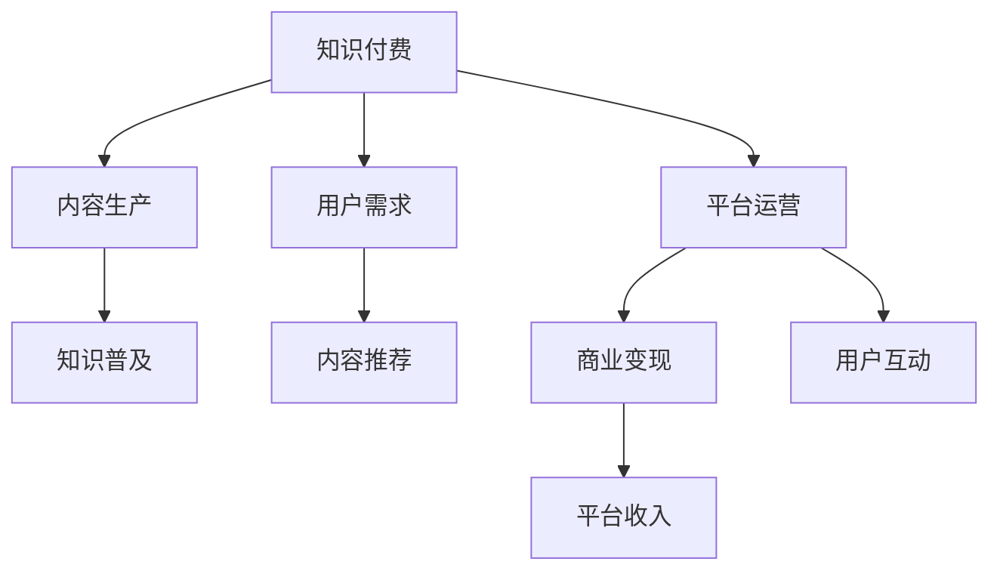

                 

# 知识经济时代下的知识付费创新商业模式测试

## 1. 背景介绍

### 1.1 问题由来

知识经济时代，随着互联网、移动通信、人工智能等技术的飞速发展，知识和信息变得越来越重要。同时，随着全球教育水平的普遍提高和人们知识获取渠道的多元化，传统的教育模式和知识传播方式正在经历深刻的变革。在这种背景下，知识付费作为一种新兴的商业模式，迅速崛起，成为知识经济的重要组成部分。

知识付费是指消费者为获取知识或信息而支付费用的行为，其本质是基于价值交换的商业模式。与传统的广告、订阅等商业模型不同，知识付费强调内容和服务的质量，通过优质内容和专业服务吸引用户，实现价值变现。

在知识付费领域，传统的商业模式面临着诸多挑战。首先是内容同质化严重，许多知识付费平台提供的内容质量参差不齐，难以满足用户多元化和个性化的需求。其次是平台运营成本高，需要大量的内容制作、运营和技术支持，但用户留存和变现效率较低。最后是用户体验不佳，许多平台缺乏对用户需求的深入理解，导致内容推荐和平台体验不尽如人意。

面对这些问题，知识付费平台需要不断探索和创新商业模式，以提升平台的核心竞争力和用户体验。本文将测试一种创新的知识付费商业模式，探索其优势和应用场景。

## 2. 核心概念与联系

### 2.1 核心概念概述

为更好地理解知识付费创新商业模式，本节将介绍几个密切相关的核心概念：

- **知识付费**：指消费者为获取知识或信息而支付费用的行为，强调内容和服务的质量。知识付费涵盖多种形式，如课程订阅、问答咨询、专题讲座等。
- **内容生产**：指知识付费平台或内容创作者制作、传播优质内容的过程。内容生产是知识付费商业模式的基础。
- **用户需求**：指用户对知识或信息的需求，包括专业技能、兴趣爱好、生活咨询等。用户需求的多样性和变化性，对知识付费平台提出了挑战。
- **平台运营**：指知识付费平台进行内容运营、用户运营、技术运营等，确保平台的稳定运行和高效运营。平台运营效率直接影响用户体验和平台收益。
- **商业变现**：指知识付费平台通过会员付费、内容付费、广告变现等方式实现商业利益。商业变现是知识付费商业模式的核心目标。

这些核心概念之间的逻辑关系可以通过以下Mermaid流程图来展示：



这个流程图展示了一些核心概念及其之间的关系：

1. 知识付费是内容生产、用户需求、平台运营和商业变现的纽带。
2. 内容生产是知识付费的基础，优质的内容吸引用户，是平台的核心竞争力。
3. 用户需求多样化，需要平台提供个性化推荐和互动，提升用户体验。
4. 平台运营保障平台稳定高效运行，直接影响平台收益和用户满意度。
5. 商业变现是知识付费的目标，平台需要制定合理的盈利模式，实现持续发展。

## 3. 核心算法原理 & 具体操作步骤

### 3.1 算法原理概述

知识付费创新商业模式的核心理念是通过技术手段优化内容生产、用户需求匹配和平台运营，提升平台的整体效率和用户体验。其核心算法原理主要包括以下几个方面：

1. **用户画像构建**：通过大数据分析，构建用户画像，了解用户的兴趣、需求和行为习惯，进行精准推荐。
2. **内容推荐算法**：利用推荐算法为用户推荐最匹配的内容，提升用户粘性。
3. **平台运营优化**：通过自动化运营、智能客服等技术手段，提高平台的运营效率和用户体验。
4. **商业变现策略**：根据用户需求和平台数据，制定合理的盈利模式，实现商业变现。

### 3.2 算法步骤详解

基于以上核心算法原理，知识付费创新商业模式的具体操作步骤如下：

**Step 1: 数据收集与处理**

1. **用户数据**：收集用户基本信息、学习行为、搜索历史、评价反馈等数据。
2. **内容数据**：收集课程信息、作者信息、评论反馈等数据。
3. **平台数据**：收集用户流量、点击率、留存率等平台运营数据。

**Step 2: 用户画像构建**

1. **特征工程**：对用户数据和内容数据进行特征提取，包括用户兴趣标签、课程类别等。
2. **画像建模**：利用机器学习算法，如聚类、分类等，构建用户画像，生成用户标签和兴趣特征。

**Step 3: 内容推荐算法**

1. **模型选择**：选择适合推荐系统的算法，如协同过滤、基于内容的推荐、深度学习等。
2. **模型训练**：利用用户画像和内容数据，训练推荐模型，生成内容推荐结果。
3. **推荐优化**：根据用户反馈和推荐结果，不断优化推荐算法，提升推荐效果。

**Step 4: 平台运营优化**

1. **智能客服**：利用自然语言处理技术，实现智能客服，提升用户互动体验。
2. **自动化运营**：通过自动化流程和任务调度，提高平台运营效率。
3. **数据可视化**：通过数据仪表盘和可视化工具，实时监控平台运营情况。

**Step 5: 商业变现策略**

1. **付费模式设计**：设计合理的付费模式，如会员制、单次付费、订阅制等。
2. **定价策略**：根据课程价值和用户需求，制定合理的课程价格。
3. **推广策略**：利用社交媒体、SEO等手段，提高课程曝光和用户转化率。

### 3.3 算法优缺点

知识付费创新商业模式的优点包括：

1. **提升用户体验**：通过精准推荐和智能客服，提升用户体验和满意度。
2. **提高运营效率**：通过自动化运营和数据可视化，提高平台运营效率。
3. **实现商业变现**：通过合理的定价和推广策略，实现商业变现和持续发展。

同时，该模式也存在一定的局限性：

1. **数据隐私问题**：用户数据的收集和使用需要符合隐私保护法规，否则可能面临法律风险。
2. **算法复杂性**：推荐算法和运营系统的设计和实现需要较高技术水平，对人才和技术资源要求较高。
3. **内容质量挑战**：平台需要持续提供高质量的内容，否则难以吸引和留住用户。

## 4. 数学模型和公式 & 详细讲解 & 举例说明

### 4.1 数学模型构建

本节将使用数学语言对知识付费创新商业模式的推荐算法进行更加严格的刻画。

设用户集合为 $U$，内容集合为 $I$，用户对内容的评价为 $r_{ui}$，其中 $r_{ui} \in \{1,2,3,4,5\}$ 表示用户对内容的评价等级。设用户画像特征为 $f_u$，内容特征为 $f_i$，推荐算法为 $R$。

定义推荐函数 $R$ 为：

$$
R = f_{\theta}(\alpha \cdot f_u + \beta \cdot f_i) \\
$$

其中 $\alpha$ 和 $\beta$ 为超参数，$\theta$ 为推荐算法模型的参数。

推荐结果 $p_{ui}$ 为：

$$
p_{ui} = \sigma(R) = \frac{1}{1 + \exp(-R)}
$$

其中 $\sigma$ 为 sigmoid 函数，用于将推荐分数映射到概率空间。

### 4.2 公式推导过程

以下我们以协同过滤算法为例，推导推荐函数的具体实现。

协同过滤算法基于用户-物品评分矩阵，计算用户 $u$ 对内容 $i$ 的兴趣程度。设用户 $u$ 对内容 $i$ 的评分矩阵为 $R_{ui}$，则协同过滤算法的推荐函数为：

$$
R_{ui} = \alpha_u \cdot \alpha_i + \beta_u \cdot \beta_i
$$

其中 $\alpha_u$ 和 $\alpha_i$ 为用户 $u$ 和内容 $i$ 的特征向量，$\beta_u$ 和 $\beta_i$ 为用户 $u$ 和内容 $i$ 的评分向量。

将上述推荐函数代入推荐结果公式中，得：

$$
p_{ui} = \frac{1}{1 + \exp(-(\alpha_u \cdot \alpha_i + \beta_u \cdot \beta_i)} \\
$$

通过推荐函数，可以计算出用户对内容的兴趣概率，进行推荐。

### 4.3 案例分析与讲解

我们以某知识付费平台的课程推荐系统为例，解释推荐算法的具体应用。

假设平台有 100 位用户和 1000 门课程，收集到每个用户对课程的评分数据。利用协同过滤算法，对每个用户进行内容推荐。具体步骤如下：

1. **特征提取**：从用户的评分历史中提取用户特征，如兴趣领域、评分倾向等。
2. **用户画像建模**：利用机器学习算法，构建用户画像，生成用户特征向量 $\alpha_u$。
3. **内容特征提取**：从课程的标题、作者、评价等数据中提取课程特征，生成课程特征向量 $\alpha_i$。
4. **评分向量计算**：利用用户和课程的特征向量，计算评分向量 $\beta_u$ 和 $\beta_i$。
5. **推荐结果计算**：利用推荐函数计算用户对课程的兴趣概率 $p_{ui}$，进行课程推荐。

最终，平台可以根据用户的选择和反馈，不断优化推荐算法，提升推荐效果。

## 5. 项目实践：代码实例和详细解释说明

### 5.1 开发环境搭建

在进行推荐系统开发前，我们需要准备好开发环境。以下是使用Python进行TensorFlow开发的环境配置流程：

1. 安装Anaconda：从官网下载并安装Anaconda，用于创建独立的Python环境。

2. 创建并激活虚拟环境：
```bash
conda create -n tf-env python=3.8 
conda activate tf-env
```

3. 安装TensorFlow：根据CUDA版本，从官网获取对应的安装命令。例如：
```bash
conda install tensorflow -c tf -c conda-forge
```

4. 安装各类工具包：
```bash
pip install numpy pandas scikit-learn matplotlib tqdm jupyter notebook ipython
```

完成上述步骤后，即可在`tf-env`环境中开始推荐系统开发。

### 5.2 源代码详细实现

这里我们以协同过滤算法为例，给出使用TensorFlow进行知识付费推荐系统的代码实现。

首先，定义推荐函数：

```python
import tensorflow as tf

def collaborative_filtering(user, item, alpha_u, beta_u, alpha_i, beta_i):
    alpha_u = tf.constant(alpha_u, dtype=tf.float32)
    beta_u = tf.constant(beta_u, dtype=tf.float32)
    alpha_i = tf.constant(alpha_i, dtype=tf.float32)
    beta_i = tf.constant(beta_i, dtype=tf.float32)
    R = tf.multiply(alpha_u, alpha_i) + tf.multiply(beta_u, beta_i)
    p = tf.sigmoid(R)
    return p
```

然后，定义训练函数：

```python
def train_cf(user_features, item_features, ratings, epochs):
    user = tf.placeholder(tf.int32)
    item = tf.placeholder(tf.int32)
    alpha_u = tf.placeholder(tf.float32)
    beta_u = tf.placeholder(tf.float32)
    alpha_i = tf.placeholder(tf.float32)
    beta_i = tf.placeholder(tf.float32)
    p = collaborative_filtering(user, item, alpha_u, beta_u, alpha_i, beta_i)
    loss = tf.losses.mean_squared_error(labels=ratings, predictions=p)
    optimizer = tf.train.AdamOptimizer().minimize(loss)
    with tf.Session() as sess:
        sess.run(tf.global_variables_initializer())
        for epoch in range(epochs):
            for i in range(len(ratings)):
                sess.run(optimizer, feed_dict={user: i, item: ratings[i][1], alpha_u: user_features[i], beta_u: ratings[i][2], alpha_i: item_features[ratings[i][1]], beta_i: ratings[i][3]})
        return sess.run(loss)
```

最后，启动训练流程：

```python
epochs = 100
user_features = []
item_features = []
ratings = []

for i in range(len(user_ratings)):
    user_features.append(user_ratings[i][0])
    item_features.append(item_ratings[i][1])
    ratings.append((i, user_ratings[i][0], item_features[i], item_ratings[i][1]))

train_cf(user_features, item_features, ratings, epochs)
```

以上就是使用TensorFlow对协同过滤算法进行知识付费推荐系统的代码实现。可以看到，TensorFlow提供了高效的自动微分和优化算法，可以方便地进行推荐系统开发和优化。

### 5.3 代码解读与分析

让我们再详细解读一下关键代码的实现细节：

**collaborative_filtering函数**：
- 定义协同过滤算法推荐函数，利用用户和内容的特征向量，计算推荐概率。

**train_cf函数**：
- 定义训练函数，利用用户特征和评分数据，通过Adam优化器更新推荐算法参数。
- 在每个epoch内，对每个用户-物品评分进行梯度更新，最小化预测值和真实评分之间的差异。
- 最终返回训练误差，用于评估推荐算法的效果。

**训练流程**：
- 定义总的epoch数，并开始循环迭代。
- 对每个用户-物品评分进行训练，更新推荐算法参数。
- 重复上述步骤直至收敛，得到最终的推荐模型。

可以看到，TensorFlow的Tensor操作和自动微分机制，使得推荐算法的实现和训练变得非常简单高效。开发者可以专注于算法设计和优化，而不必过多关注底层的实现细节。

当然，在实际应用中，还需要考虑更多因素，如模型的保存和部署、超参数的自动搜索、更加灵活的任务适配层等。但核心的推荐范式基本与此类似。

## 6. 实际应用场景

### 6.1 教育培训

知识付费平台在教育培训领域有广泛的应用。学生可以通过付费订阅，获取优质的课程和教学资源，提高学习效率和成绩。平台可以根据学生的学习进度、兴趣和历史成绩，推荐适合的课程和练习题，帮助学生更有针对性地学习。

### 6.2 职业培训

职业技能培训是知识付费的重要应用领域。平台可以针对不同职业需求，提供定制化的培训课程，帮助学员提升专业技能和职业素养。通过推荐系统，学员可以更容易找到与自己职业目标和兴趣相匹配的课程，提升学习效果。

### 6.3 健康管理

健康管理是知识付费的重要应用领域。平台可以提供健康知识、饮食建议、运动指导等内容，帮助用户保持健康生活方式。通过推荐系统，平台可以根据用户的生活方式和健康状况，推荐合适的健康方案和建议，提升用户健康水平。

### 6.4 未来应用展望

随着推荐算法的不断进步，知识付费平台的应用场景将更加广泛。未来，知识付费将涉及更多领域，如医疗、金融、教育等，为人们提供全方位的知识服务。

在智慧医疗领域，基于知识付费平台的远程医疗咨询、健康管理、个性化诊疗等应用将提升医疗服务的智能化水平，辅助医生诊疗，加速新药开发进程。

在智能教育领域，知识付费平台可以提供个性化学习路径、智能辅导、课程测评等服务，因材施教，促进教育公平，提高教学质量。

在智慧城市治理中，知识付费平台可以提供智能城市规划、应急管理、公共安全等服务，提高城市管理的自动化和智能化水平，构建更安全、高效的未来城市。

此外，在企业培训、科技研发、文化娱乐等众多领域，知识付费平台也将不断涌现，为传统行业数字化转型升级提供新的技术路径。相信随着技术的日益成熟，知识付费必将在更多领域得到应用，为经济社会发展注入新的动力。

## 7. 工具和资源推荐

### 7.1 学习资源推荐

为了帮助开发者系统掌握知识付费推荐系统的理论基础和实践技巧，这里推荐一些优质的学习资源：

1. 《推荐系统实战》系列博文：由推荐系统专家撰写，深入浅出地介绍了推荐系统原理、算法和应用案例。

2. CS229《机器学习》课程：斯坦福大学开设的经典机器学习课程，涵盖推荐系统、强化学习等前沿内容，是推荐系统开发者的必选课程。

3. 《推荐系统》书籍：介绍了推荐系统的理论基础和实际应用，包括协同过滤、基于内容的推荐、深度学习等方法。

4. Kaggle推荐系统竞赛：Kaggle举办的多项推荐系统竞赛，提供了丰富的实战数据集和模型实现，是推荐系统开发者的重要实践平台。

5. Weights & Biases：模型训练的实验跟踪工具，可以记录和可视化模型训练过程中的各项指标，方便对比和调优。与主流深度学习框架无缝集成。

通过对这些资源的学习实践，相信你一定能够快速掌握知识付费推荐系统的精髓，并用于解决实际的推荐问题。

### 7.2 开发工具推荐

高效的开发离不开优秀的工具支持。以下是几款用于推荐系统开发的常用工具：

1. TensorFlow：由Google主导开发的开源深度学习框架，生产部署方便，适合大规模工程应用。推荐系统是TensorFlow的重要应用领域之一。

2. PyTorch：基于Python的开源深度学习框架，灵活动态的计算图，适合快速迭代研究。推荐系统领域也有PyTorch的实现。

3. Amazon Personalize：AWS提供的推荐服务，可以快速构建推荐系统，适合中大型企业应用。

4. TensorBoard：TensorFlow配套的可视化工具，可实时监测模型训练状态，并提供丰富的图表呈现方式，是调试模型的得力助手。

5. Jupyter Notebook：基于Python的开源开发环境，支持多语言编程和数据可视化，适合推荐系统开发者进行研究和实验。

合理利用这些工具，可以显著提升推荐系统的开发效率，加快创新迭代的步伐。

### 7.3 相关论文推荐

知识推荐系统的研究源于学界的持续研究。以下是几篇奠基性的相关论文，推荐阅读：

1. BPR: Bayesian Personalized Ranking from Pairwise Data：提出了基于贝叶斯个性化排序的协同过滤算法，是协同过滤算法的经典之作。

2. SVD++: Scalable Non-negative Matrix Factorization with Imlicit Feedback：提出了基于矩阵分解的推荐算法，可以处理大规模稀疏数据，提高了推荐系统的效率和精度。

3. Matrix Factorization Techniques for Recommender Systems：总结了矩阵分解算法的理论基础和实际应用，是推荐系统领域的经典综述。

4. Neural Collaborative Filtering：利用深度神经网络模型进行推荐，提升了推荐系统的表现和泛化能力。

5. Attention-based Recommender Systems：引入了注意力机制，提高了推荐系统的效果和可解释性。

这些论文代表了几项重要推荐算法的发展脉络。通过学习这些前沿成果，可以帮助推荐系统开发者更好地把握学科前进方向，激发更多的创新灵感。

## 8. 总结：未来发展趋势与挑战

### 8.1 总结

本文对知识付费创新商业模式的推荐算法进行了全面系统的介绍。首先阐述了知识付费在知识经济时代的重要性和应用场景，明确了推荐算法在提升用户体验和商业变现中的核心作用。其次，从原理到实践，详细讲解了推荐算法的数学模型和具体操作步骤，给出了推荐系统开发的完整代码实例。同时，本文还广泛探讨了推荐算法在教育培训、职业培训、健康管理等多个领域的应用前景，展示了推荐算法的广阔前景。

通过本文的系统梳理，可以看到，知识付费推荐算法正在成为知识付费商业模式的核心理念，极大地提升了平台的运营效率和用户满意度。未来，伴随推荐算法的不断进步，知识付费平台必将在更多领域得到应用，为人类知识传播和经济发展提供新的动力。

### 8.2 未来发展趋势

展望未来，知识付费推荐算法将呈现以下几个发展趋势：

1. 算法复杂度增加。随着推荐算法的不断进步，推荐系统将更加复杂，涉及更多的数据类型和特征，算法模型也将更加多样化。

2. 推荐效果提升。随着推荐算法的不断优化，推荐效果将显著提升，推荐结果的精准度和个性化程度也将更高。

3. 实时性要求提高。推荐系统需要实时响应用户需求，推送最匹配的内容，提高用户满意度和粘性。

4. 多模态融合。未来的推荐系统将更多地融合多模态数据，如图像、视频、语音等，提升推荐效果和用户体验。

5. 跨领域应用。知识付费平台将逐步拓展到更多领域，如金融、医疗、娱乐等，为不同领域提供智能推荐服务。

6. 可解释性和公平性增强。推荐算法需要具备更好的可解释性和公平性，提升用户信任度和平台透明度。

以上趋势凸显了知识付费推荐算法的广阔前景。这些方向的探索发展，必将进一步提升推荐系统的效果和应用范围，为知识付费平台带来更大的商业价值和社会价值。

### 8.3 面临的挑战

尽管知识付费推荐算法已经取得了显著的进展，但在迈向更加智能化、普适化应用的过程中，仍面临诸多挑战：

1. 数据隐私问题。用户数据的收集和使用需要符合隐私保护法规，否则可能面临法律风险。如何平衡用户隐私和推荐效果，是一个亟待解决的问题。

2. 算法复杂性。推荐算法和推荐系统的设计和实现需要较高技术水平，对人才和技术资源要求较高。如何在保障算法效果的同时，降低开发成本，是平台需要考虑的问题。

3. 内容质量挑战。推荐系统需要持续提供高质量的内容，否则难以吸引和留住用户。如何确保内容的丰富性和多样性，是一个长期的问题。

4. 用户粘性问题。推荐系统需要提升用户互动和粘性，否则用户留存率将受到影响。如何优化推荐算法和平台体验，是提高用户满意度的关键。

5. 商业变现难度。推荐系统需要制定合理的盈利模式，实现商业变现和持续发展。如何平衡用户需求和商业利益，是一个复杂的决策问题。

这些挑战需要知识付费平台在技术、运营、业务等多个维度进行综合应对，才能实现长期的商业成功和社会价值。

### 8.4 研究展望

面对知识付费推荐算法所面临的挑战，未来的研究需要在以下几个方面寻求新的突破：

1. 探索无监督和半监督推荐算法。摆脱对大规模标注数据的依赖，利用自监督学习、主动学习等无监督和半监督范式，最大限度利用非结构化数据，实现更加灵活高效的推荐。

2. 研究参数高效和计算高效的推荐方法。开发更加参数高效的推荐方法，在固定大部分预训练参数的同时，只更新极少量的任务相关参数。同时优化推荐系统的计算图，减少前向传播和反向传播的资源消耗，实现更加轻量级、实时性的部署。

3. 融合因果和对比学习范式。通过引入因果推断和对比学习思想，增强推荐系统建立稳定因果关系的能力，学习更加普适、鲁棒的内容表示。

4. 引入更多先验知识。将符号化的先验知识，如知识图谱、逻辑规则等，与神经网络模型进行巧妙融合，引导推荐过程学习更准确、合理的用户模型。

5. 结合因果分析和博弈论工具。将因果分析方法引入推荐系统，识别出推荐决策的关键特征，增强推荐输出的因果性和逻辑性。借助博弈论工具刻画人机交互过程，主动探索并规避推荐系统的脆弱点，提高系统稳定性。

6. 纳入伦理道德约束。在推荐系统训练目标中引入伦理导向的评估指标，过滤和惩罚有偏见、有害的输出倾向。同时加强人工干预和审核，建立推荐系统的监管机制，确保推荐的公平性和可信度。

这些研究方向的探索，必将引领知识付费推荐算法技术迈向更高的台阶，为知识付费平台带来更大的商业价值和社会价值。面向未来，知识付费推荐算法需要与其他人工智能技术进行更深入的融合，如知识表示、因果推理、强化学习等，多路径协同发力，共同推动知识付费平台的发展。只有勇于创新、敢于突破，才能不断拓展知识付费推荐算法的应用边界，为人类知识传播和经济发展提供新的动力。

## 9. 附录：常见问题与解答

**Q1：知识付费推荐算法是否适用于所有推荐场景？**

A: 知识付费推荐算法在大多数推荐场景上都能取得不错的效果，特别是对于数据量较小的任务。但对于一些特定领域的任务，如新闻推荐、商品推荐等，推荐系统需要更多的历史数据和复杂的特征工程，才能取得理想效果。

**Q2：如何优化推荐算法的推荐效果？**

A: 推荐算法的优化主要包括以下几个方面：

1. 数据预处理：对数据进行清洗、去重、特征提取等预处理，提高数据质量。
2. 模型选择：根据推荐场景选择合适的推荐算法，如协同过滤、基于内容的推荐、深度学习等。
3. 特征工程：对用户和内容的特征进行深入挖掘和组合，提升推荐效果。
4. 模型调优：通过交叉验证、超参数调优等手段，不断优化推荐算法，提升推荐精度。
5. 算法融合：引入多模态数据和深度学习算法，提高推荐系统的效果和泛化能力。

通过以上优化手段，可以显著提升推荐算法的推荐效果和用户体验。

**Q3：推荐系统在落地部署时需要注意哪些问题？**

A: 将推荐系统转化为实际应用，还需要考虑以下因素：

1. 模型裁剪：去除不必要的层和参数，减小模型尺寸，加快推理速度。
2. 量化加速：将浮点模型转为定点模型，压缩存储空间，提高计算效率。
3. 服务化封装：将推荐模型封装为标准化服务接口，便于集成调用。
4. 弹性伸缩：根据请求流量动态调整资源配置，平衡服务质量和成本。
5. 监控告警：实时采集系统指标，设置异常告警阈值，确保服务稳定性。

通过合理利用这些工具，可以显著提升推荐系统的开发效率，加快创新迭代的步伐。

**Q4：推荐系统在实现过程中如何处理用户隐私问题？**

A: 用户隐私问题是推荐系统的重要考虑因素，主要包括以下几个方面：

1. 数据匿名化：对用户数据进行匿名化处理，去除敏感信息，保护用户隐私。
2. 隐私保护算法：使用差分隐私、联邦学习等隐私保护算法，确保用户数据不被滥用。
3. 用户同意：在收集用户数据时，确保用户知情并同意，并提供隐私设置选项。

通过以上手段，可以最大程度地保护用户隐私，同时实现高效的推荐系统。

**Q5：推荐系统在落地部署时，如何平衡推荐效果和用户隐私？**

A: 推荐系统在落地部署时，需要在推荐效果和用户隐私之间找到平衡点。具体措施包括：

1. 数据最小化：只收集必要的用户数据，避免过度收集和存储。
2. 加密存储：对用户数据进行加密存储，防止数据泄露。
3. 用户控制：提供用户隐私设置选项，允许用户自行控制数据使用权限。
4. 透明透明：公开推荐系统的算法和数据处理流程，让用户了解推荐过程和隐私保护措施。

通过以上措施，可以在保障用户隐私的同时，实现高效的推荐系统。

---

作者：禅与计算机程序设计艺术 / Zen and the Art of Computer Programming

