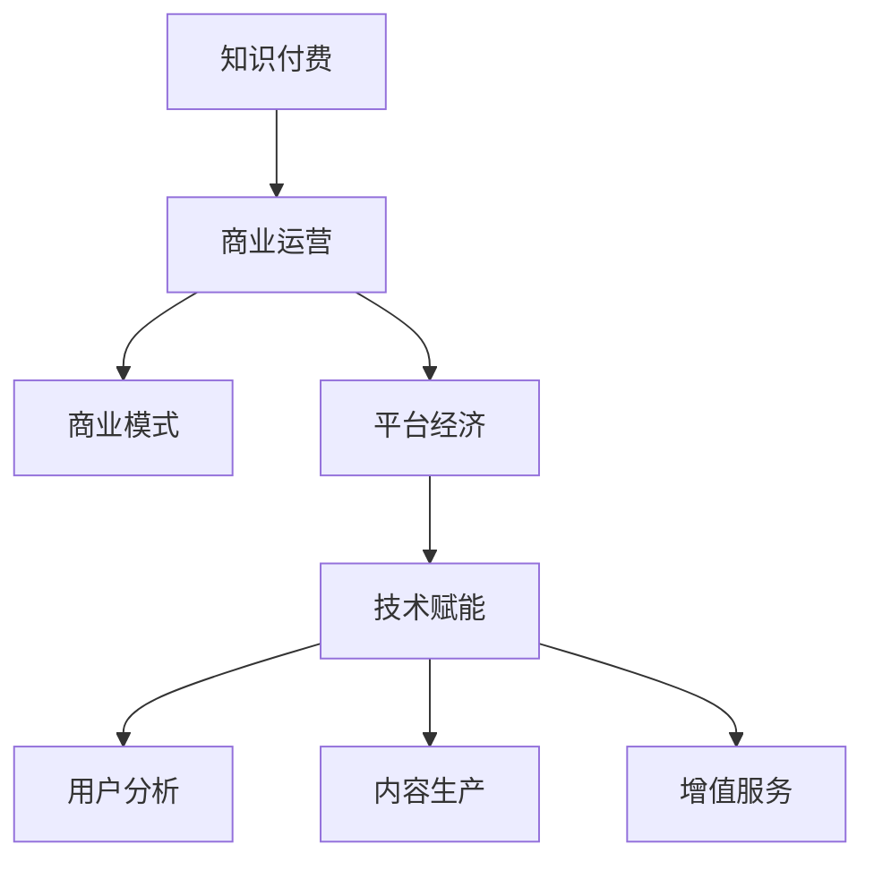

                 

# 知识经济时代下的知识付费创新商业模式运营

> 关键词：知识付费,商业运营,商业模式,平台经济,技术赋能,用户分析,内容生产,增值服务

## 1. 背景介绍

### 1.1 问题由来
在知识经济时代，知识付费成为连接知识供给和需求的重要方式。随着互联网和移动设备的普及，人们获取信息的渠道越来越多样化，对有深度、有价值、系统化的知识需求不断增长。传统的高校教育、出版物传播等知识传播方式已不能完全满足现代社会的知识消费需求，知识付费模式应运而生。

在知识付费模式中，内容创作者（如专家、学者、作家等）通过平台（如得到、微信读书、知乎等）将自己的知识产品（如文章、音频、视频等）进行打包销售，用户支付一定的费用来获取知识和信息。这种方式打破了传统的单向知识传播模式，使得知识的生产、传播和消费更加高效、互动和个性化。

然而，尽管知识付费市场发展迅猛，其商业模式却面临着诸多挑战。用户流失、付费意愿低下、内容同质化等问题严重制约了知识付费行业的健康发展。为解决这些问题，各大知识付费平台纷纷探索创新商业模式，引入新的技术工具，提供更加丰富、优质的内容，打造良好的用户体验。本文将深入探讨知识付费模式下的创新商业模式运营策略，并探讨如何通过技术手段赋能商业模式运营。

## 2. 核心概念与联系

### 2.1 核心概念概述

为了更好地理解知识付费模式的运营策略，我们先介绍几个核心概念：

- **知识付费**：指用户为获取有价值的知识产品而支付费用的模式。知识付费模式打破了传统的高校教育、出版物传播等知识传播方式，使得知识的生产和传播更加高效和互动。

- **商业运营**：指在知识付费模式中，平台如何通过合理的商业运作，实现知识内容的生产和传播，实现商业模式闭环。

- **商业模式**：指平台如何通过合理的商业模式设计，实现知识内容创作、传播、变现的良性循环，维持平台的持续健康发展。

- **平台经济**：指通过互联网平台，实现知识创作者与消费者之间的信息对称和高效交易。平台经济的出现，极大地促进了知识内容的生产和传播。

- **技术赋能**：指通过引入先进的技术手段，提升平台运营效率和用户体验，促进平台的健康发展。

- **用户分析**：指平台通过对用户行为数据的分析，理解用户需求，优化内容推荐，提高用户粘性和满意度。

- **内容生产**：指平台如何通过激励机制、版权保护等措施，鼓励和引导优质内容创作。

- **增值服务**：指平台通过额外的增值服务，提升用户价值和平台收入。

这些核心概念之间的联系可以通过以下Mermaid流程图来展示：



这个流程图展示了知识付费模式的核心概念及其之间的关系：知识付费平台通过商业模式设计，实现内容生产和传播的闭环；通过平台经济，实现信息对称和高效交易；引入技术赋能手段，提升运营效率和用户体验；通过用户分析，优化内容推荐和激励机制；通过内容生产和增值服务，提升用户价值和平台收入。

## 3. 核心算法原理 & 具体操作步骤
### 3.1 算法原理概述

知识付费模式的运营主要围绕内容创作、用户获取、内容传播、用户留存和收入变现五个环节展开。本文重点介绍其中的内容推荐和个性化服务的算法原理和操作步骤。

### 3.2 算法步骤详解

**内容推荐算法**：
1. **数据采集**：采集用户的阅读行为数据，如阅读时长、偏好类型、评论内容等。
2. **用户画像构建**：通过机器学习算法，构建用户的个性化画像，包括兴趣偏好、阅读习惯、用户画像等。
3. **内容特征提取**：提取内容的特征，如标题、摘要、关键词、用户评分等。
4. **相似度计算**：使用余弦相似度等算法，计算用户画像与内容特征之间的相似度。
5. **推荐排序**：根据相似度计算结果，对内容进行排序推荐。

**个性化服务算法**：
1. **用户画像构建**：与内容推荐类似，通过机器学习算法，构建用户的个性化画像。
2. **需求预测**：通过时间序列预测等算法，预测用户对知识内容的需求变化。
3. **个性化定制**：根据用户画像和需求预测，个性化定制内容和推荐，满足用户需求。

### 3.3 算法优缺点

**内容推荐算法**：
- **优点**：通过个性化推荐，提升用户满意度和留存率，增加平台的粘性。
- **缺点**：推荐算法可能会产生过滤泡泡，用户只能看到自己喜欢的内容，导致信息茧房。

**个性化服务算法**：
- **优点**：提升用户体验，提供更加个性化的服务，满足用户的多样化需求。
- **缺点**：个性化定制需要大量的用户数据，存在隐私风险。

### 3.4 算法应用领域

这些算法广泛应用在各类知识付费平台中，如得到、微信读书、知乎、今日头条等。例如，得到平台通过算法推荐，为用户推荐个性化的书籍、音频和视频，提升用户粘性；微信读书通过个性化推荐，提升用户阅读时长；知乎通过用户画像，推荐合适的问答内容等。

## 4. 数学模型和公式 & 详细讲解 & 举例说明

### 4.1 数学模型构建

设用户 $u$ 对内容 $c$ 的评分表示为 $r_{u,c}$，用户 $u$ 阅读内容 $c$ 的时间表示为 $t_{u,c}$，内容 $c$ 的用户评分平均值为 $\mu_c$，内容 $c$ 的评分标准差为 $\sigma_c$。设用户画像为 $p_u$，内容特征为 $f_c$，余弦相似度为 $s(p_u,f_c)$。

**内容推荐模型的目标**是最大化用户满意度的期望，即最大化：

$$
\mathbb{E}[\sum_{c\in C}r_{u,c}f_c] \text{ 对 } s(p_u,f_c)
$$

其中 $C$ 为内容集合，$u$ 为用户集合。

**个性化服务模型的目标**是最大化用户满意度的期望，即最大化：

$$
\mathbb{E}[\sum_{c\in C}r_{u,c}f_c] \text{ 对 } p_u
$$

其中 $C$ 为内容集合，$u$ 为用户集合。

### 4.2 公式推导过程

对于内容推荐算法，使用余弦相似度计算用户画像与内容特征之间的相似度。余弦相似度的计算公式为：

$$
s(p_u,f_c) = \frac{\sum_{i=1}^d p_{u,i}f_{c,i}}{\sqrt{\sum_{i=1}^d p_{u,i}^2} \sqrt{\sum_{i=1}^d f_{c,i}^2}}
$$

其中 $p_{u,i}$ 为用户画像在第 $i$ 维的特征值，$f_{c,i}$ 为内容特征在第 $i$ 维的特征值。

推荐排序公式为：

$$
R_c = s(p_u,f_c) * \sigma_c^2 / \sigma_u
$$

其中 $\sigma_u$ 为用户画像的方差，$\sigma_c$ 为内容特征的方差。

对于个性化服务算法，通过时间序列预测算法（如ARIMA、LSTM等），预测用户需求变化，计算用户画像与需求变化之间的相关性。个性化定制公式为：

$$
\text{个性化推荐} = f_c * \alpha + s(p_u,f_c) * (1-\alpha)
$$

其中 $\alpha$ 为个性化推荐权重，$f_c$ 为内容特征，$s(p_u,f_c)$ 为余弦相似度。

### 4.3 案例分析与讲解

**案例：知乎平台的个性化推荐**

知乎平台通过用户画像和内容特征的余弦相似度计算，实现个性化内容推荐。用户可以通过点赞、评论等方式，生成用户画像；内容通过关键词提取等方式，生成内容特征。根据相似度计算结果，知乎对用户推荐最相关的内容，提升用户体验。

此外，知乎还引入了时间序列预测算法，通过分析用户行为数据，预测用户需求变化。例如，在特定时间段内，用户对特定主题的兴趣可能上升，平台可以提前预判并推荐相关内容，提升用户满意度。

## 5. 项目实践：代码实例和详细解释说明
### 5.1 开发环境搭建

在进行知识付费平台的内容推荐和个性化服务开发时，我们需要准备好开发环境。以下是使用Python进行TensorFlow和Scikit-learn开发的开发环境配置流程：

1. 安装Anaconda：从官网下载并安装Anaconda，用于创建独立的Python环境。

2. 创建并激活虚拟环境：
```bash
conda create -n pytorch-env python=3.8 
conda activate pytorch-env
```

3. 安装TensorFlow和Scikit-learn：
```bash
pip install tensorflow
pip install scikit-learn
```

4. 安装各类工具包：
```bash
pip install numpy pandas scikit-learn matplotlib tqdm jupyter notebook ipython
```

完成上述步骤后，即可在`pytorch-env`环境中开始开发。

### 5.2 源代码详细实现

以下是一个简单的知识付费平台内容推荐系统的实现示例：

```python
import tensorflow as tf
from sklearn.feature_extraction.text import TfidfVectorizer
from sklearn.metrics.pairwise import cosine_similarity

# 数据准备
user_data = {
    'user1': ['深度学习', '自然语言处理', '人工智能'],
    'user2': ['机器学习', '数据分析', 'Python']
}

content_data = {
    'content1': ['深度学习', '自然语言处理', '人工智能'],
    'content2': ['机器学习', '数据分析', 'Python']
}

# 用户画像构建
user_profiles = {}
for user, items in user_data.items():
    tfidf = TfidfVectorizer()
    profile = tfidf.fit_transform(items)
    user_profiles[user] = profile.toarray()

# 内容特征提取
content_profiles = {}
for content, items in content_data.items():
    tfidf = TfidfVectorizer()
    profile = tfidf.fit_transform(items)
    content_profiles[content] = profile.toarray()

# 余弦相似度计算
similarity = cosine_similarity(user_profiles, content_profiles)

# 推荐排序
sorted_contents = {content: score for content, score in zip(content_profiles.keys(), similarity.mean(axis=0))}
sorted_contents = sorted(sorted_contents.items(), key=lambda x: x[1], reverse=True)

# 输出推荐结果
for content, score in sorted_contents:
    print(f'推荐内容: {content}，相似度: {score}')
```

### 5.3 代码解读与分析

让我们再详细解读一下关键代码的实现细节：

**user_data和content_data**：
- 定义了用户画像和内容特征的示例数据。

**user_profiles和content_profiles**：
- 通过TF-IDF算法，将用户画像和内容特征转换为向量形式。

**余弦相似度计算**：
- 使用Scikit-learn库中的cosine_similarity函数，计算用户画像与内容特征之间的相似度。

**推荐排序**：
- 根据相似度计算结果，对内容进行排序推荐。

可以看到，通过简单的代码实现，即可实现内容推荐功能。TensorFlow和Scikit-learn库提供了强大的工具支持，使得模型开发和计算效率大大提升。

## 6. 实际应用场景

### 6.1 智能课程推荐

在智能课程推荐中，知识付费平台通过分析用户的阅读和观看记录，为用户推荐最适合的在线课程。例如，Coursera平台通过推荐算法，为用户推荐与用户兴趣相关的课程，提升用户学习效果和平台粘性。

### 6.2 个性化内容定制

个性化内容定制通过机器学习算法，分析用户行为数据，预测用户需求变化，提供个性化的内容和推荐。例如，得到平台通过个性化服务算法，为用户提供定制化的学习计划和知识推荐，提升用户学习体验和平台收入。

### 6.3 用户画像和行为分析

用户画像和行为分析通过数据挖掘和机器学习算法，构建用户画像，理解用户需求，优化内容推荐，提高用户粘性和满意度。例如，微信读书通过用户画像和行为分析，推荐用户可能感兴趣的书籍和内容，提升用户阅读时长。

### 6.4 未来应用展望

随着数据和算力的不断提升，知识付费平台的内容推荐和个性化服务将变得更加精准和高效。未来的知识付费平台将通过以下方式进行创新：

1. 引入更多维度数据：除了阅读和观看行为数据，还应引入用户评价、社交网络数据、用户属性等更多维度数据，提升推荐准确性。

2. 引入深度学习算法：通过深度学习算法，如卷积神经网络、递归神经网络等，进一步提升推荐效果和预测精度。

3. 引入多模态数据：引入文本、图片、视频等多种模态数据，提升内容的丰富性和推荐的多样性。

4. 引入增强学习算法：通过增强学习算法，优化推荐策略，提升用户满意度和平台收入。

5. 引入社会化推荐算法：通过社会网络分析，引入社会化推荐算法，提升推荐的覆盖面和多样性。

6. 引入交互式推荐系统：通过交互式推荐系统，提升用户的参与度和互动性，实现动态优化。

这些技术的引入，将进一步推动知识付费平台的内容推荐和个性化服务，提升平台的市场竞争力和用户价值。

## 7. 工具和资源推荐
### 7.1 学习资源推荐

为了帮助开发者系统掌握知识付费模式的运营策略，这里推荐一些优质的学习资源：

1. 《知识付费模式研究》系列博文：由知识付费领域专家撰写，深入浅出地介绍了知识付费模式的原理、挑战和创新策略。

2. Coursera《知识付费商业模式》课程：由业内知名专家授课，系统介绍知识付费商业模式，涵盖内容创作、用户获取、内容传播、用户留存和收入变现等多个方面。

3. 《知识付费平台技术实现》书籍：详细讲解知识付费平台的内容推荐、个性化服务、用户分析等核心技术，提供完整的代码实现和案例分析。

4. 知乎《知识付费平台运营指南》：汇集了知识付费平台运营的多篇优秀文章，涵盖平台运营、内容创作、用户分析等多个方面，提供实战经验。

通过对这些资源的学习实践，相信你一定能够快速掌握知识付费模式的运营策略，并用于解决实际的商业问题。

### 7.2 开发工具推荐

高效的开发离不开优秀的工具支持。以下是几款用于知识付费平台开发的常用工具：

1. TensorFlow：基于Python的深度学习框架，灵活且高效，适合复杂模型和大数据处理。

2. PyTorch：基于Python的深度学习框架，易用性和灵活性兼具，适合快速迭代研究和部署。

3. Scikit-learn：基于Python的机器学习库，提供丰富的算法和工具支持，适合数据挖掘和模型训练。

4. Jupyter Notebook：支持Python和其他语言的交互式编程，提供可视化的数据处理和模型展示。

5. Kibana：开源的数据可视化工具，支持多维度数据展示和分析，适合数据监控和可视化。

6. Tableau：商业化数据可视化工具，支持多数据源和复杂数据报表，适合商业数据分析和决策支持。

合理利用这些工具，可以显著提升知识付费平台的内容推荐和个性化服务开发效率，加快创新迭代的步伐。

### 7.3 相关论文推荐

知识付费模式的探索源于学界的持续研究。以下是几篇奠基性的相关论文，推荐阅读：

1. 《基于深度学习的个性化推荐算法研究》：探讨了基于深度学习的个性化推荐算法，提供了算法原理和实现案例。

2. 《知识付费平台用户行为分析与推荐》：分析了知识付费平台的用户行为数据，提出了个性化推荐策略。

3. 《知识付费平台的商业运营模型研究》：系统介绍了知识付费平台的商业运营模型，探讨了运营策略和优化方法。

4. 《知识付费平台的内容推荐与社交网络分析》：探讨了知识付费平台的内容推荐和社交网络分析，提出了推荐算法和优化策略。

5. 《基于增强学习的推荐系统研究》：介绍了基于增强学习的推荐系统，探讨了算法原理和实现案例。

这些论文代表了大数据和深度学习在知识付费平台中的研究进展。通过学习这些前沿成果，可以帮助研究者把握学科前进方向，激发更多的创新灵感。

## 8. 总结：未来发展趋势与挑战
### 8.1 总结

本文对知识付费模式下的商业运营策略进行了全面系统的介绍。首先阐述了知识付费模式的背景和运营的关键环节，明确了内容推荐和个性化服务的重要性。其次，从原理到实践，详细讲解了推荐算法和个性化服务算法的数学模型和操作步骤，提供了代码实例和详细解释说明。同时，本文还探讨了知识付费平台在智能课程推荐、个性化内容定制、用户画像和行为分析等多个实际应用场景中的应用，展示了知识付费模式的广阔前景。最后，本文推荐了相关的学习资源、开发工具和研究论文，力求为读者提供全方位的技术指引。

通过本文的系统梳理，可以看到，知识付费模式正在成为连接知识供给和需求的重要方式，通过内容推荐和个性化服务，提升了用户的满意度和平台的粘性，为知识付费平台带来了巨大的市场潜力。未来，伴随大数据和深度学习技术的进一步发展，知识付费平台的内容推荐和个性化服务将变得更加精准和高效，为知识付费模式的发展注入新的动力。

### 8.2 未来发展趋势

展望未来，知识付费平台的运营策略将呈现以下几个发展趋势：

1. 数据维度不断拓展。随着数据采集和处理技术的进步，平台可以收集更多的用户行为数据，提升推荐模型的准确性。

2. 算法模型不断优化。深度学习算法、增强学习算法等将不断引入，提升推荐效果和用户满意度。

3. 技术工具不断丰富。大数据处理、分布式计算、云服务等技术手段将进一步完善，提升平台的运营效率和用户体验。

4. 平台生态不断完善。通过引入更多合作伙伴，丰富内容供给，提升平台的用户粘性和市场竞争力。

5. 用户体验不断提升。通过个性化服务、社交网络分析等手段，提升用户的参与度和互动性，实现动态优化。

6. 商业变现不断创新。通过广告、增值服务、会员制等多种变现方式，提升平台的收入和市场份额。

这些趋势表明，知识付费平台的内容推荐和个性化服务将迎来更加高效、互动、个性化的运营策略，为知识付费模式的发展注入新的动力。

### 8.3 面临的挑战

尽管知识付费平台的运营策略不断优化，但在迈向更加智能化、普适化应用的过程中，它仍面临着诸多挑战：

1. 数据隐私和安全问题。用户行为数据和个人隐私数据的管理和保护，一直是知识付费平台面临的重大挑战。如何确保用户数据的隐私和安全，防止数据泄露和滥用，将是未来的重要课题。

2. 算法模型的泛化能力。平台需要确保推荐算法和个性化服务算法具备良好的泛化能力，避免过拟合和数据偏差。如何提升算法的泛化能力，确保推荐结果的公正性和多样性，还需进一步研究。

3. 用户留存和流失问题。用户流失是知识付费平台的一大难题。如何通过内容推荐、个性化服务、社交网络分析等手段，提升用户粘性和满意度，防止用户流失，将是平台运营的重要任务。

4. 内容创作的激励机制。内容创作者数量和质量的提升，直接关系到平台的生命力。如何通过激励机制和版权保护，吸引和留住优质内容创作者，是平台运营的关键。

5. 技术工具的落地应用。虽然引入多种先进技术工具，但要实现真正意义上的落地应用，还需进行持续的优化和迭代。如何实现技术工具的高效落地，提升平台的运营效率和用户体验，将是未来的重要方向。

6. 平台生态的协同合作。知识付费平台需要与内容创作者、技术提供商、用户等各方协同合作，实现生态共赢。如何构建良好的平台生态，提升平台的市场竞争力，将是重要的研究课题。

### 8.4 研究展望

面对知识付费平台面临的诸多挑战，未来的研究需要在以下几个方面寻求新的突破：

1. 引入更多维度数据。除了阅读和观看行为数据，还应引入用户评价、社交网络数据、用户属性等更多维度数据，提升推荐准确性。

2. 引入深度学习算法。通过深度学习算法，如卷积神经网络、递归神经网络等，进一步提升推荐效果和预测精度。

3. 引入多模态数据。引入文本、图片、视频等多种模态数据，提升内容的丰富性和推荐的多样性。

4. 引入增强学习算法。通过增强学习算法，优化推荐策略，提升用户满意度和平台收入。

5. 引入社会化推荐算法。通过社会网络分析，引入社会化推荐算法，提升推荐的覆盖面和多样性。

6. 引入交互式推荐系统。通过交互式推荐系统，提升用户的参与度和互动性，实现动态优化。

7. 引入隐私保护机制。通过隐私保护机制，确保用户数据的隐私和安全，防止数据泄露和滥用。

这些研究方向的探索，将推动知识付费平台的运营策略迈向更高的台阶，为知识付费模式的发展注入新的动力。面向未来，知识付费平台需要通过数据、算法、技术、生态等多方面的协同发力，实现更加高效、互动、个性化的运营策略，为用户提供更加优质的知识服务和商业变现。

## 9. 附录：常见问题与解答

**Q1：知识付费平台如何提升用户留存和满意度？**

A: 知识付费平台通过以下几种方式提升用户留存和满意度：
1. 内容推荐：通过个性化推荐，提升用户粘性和满意度。平台可以分析用户的阅读和观看记录，为用户推荐最相关的课程和内容。
2. 个性化服务：通过个性化服务算法，提升用户满意度。平台可以根据用户画像和需求预测，提供个性化的内容推荐和学习计划。
3. 社交网络分析：通过社交网络分析，提升用户粘性和满意度。平台可以分析用户之间的互动关系，推荐相关内容和用户。
4. 用户互动：通过用户互动和反馈，提升用户满意度和粘性。平台可以引入问答、评论、社交功能，提升用户参与度和互动性。

**Q2：知识付费平台如何优化推荐算法和个性化服务算法？**

A: 知识付费平台通过以下几种方式优化推荐算法和个性化服务算法：
1. 引入深度学习算法：通过深度学习算法，提升推荐效果和预测精度。平台可以使用卷积神经网络、递归神经网络等算法，提升推荐模型的准确性。
2. 引入多模态数据：引入文本、图片、视频等多种模态数据，提升内容的丰富性和推荐的多样性。平台可以引入图像和视频等多模态数据，提升推荐效果。
3. 引入增强学习算法：通过增强学习算法，优化推荐策略，提升用户满意度和平台收入。平台可以引入增强学习算法，根据用户反馈和行为数据，优化推荐策略。
4. 引入社交网络分析：通过社交网络分析，提升推荐覆盖面和多样性。平台可以分析用户之间的互动关系，引入社交网络分析算法，优化推荐结果。
5. 引入交互式推荐系统：通过交互式推荐系统，提升用户参与度和互动性，实现动态优化。平台可以引入交互式推荐系统，提升用户参与度和互动性。

**Q3：知识付费平台如何保护用户数据隐私和安全？**

A: 知识付费平台通过以下几种方式保护用户数据隐私和安全：
1. 数据匿名化：平台可以对用户数据进行匿名化处理，防止数据泄露和滥用。平台可以去除敏感信息，保护用户隐私。
2. 数据加密：平台可以对用户数据进行加密处理，防止数据被未授权人员访问和篡改。平台可以使用AES、RSA等加密算法，保护用户数据。
3. 数据访问控制：平台可以采用数据访问控制机制，限制数据的访问权限，防止数据泄露。平台可以采用RBAC、ABAC等访问控制机制，限制数据访问权限。
4. 数据审计：平台可以对数据访问和使用情况进行审计，确保数据的合法使用。平台可以记录数据访问日志，进行审计和监控。
5. 数据合规：平台应遵守相关法律法规，保护用户数据隐私和安全。平台可以遵守GDPR、CCPA等法律法规，保护用户数据隐私和安全。

通过这些措施，知识付费平台可以确保用户数据的隐私和安全，防止数据泄露和滥用，提升用户信任和满意度。

---

作者：禅与计算机程序设计艺术 / Zen and the Art of Computer Programming

