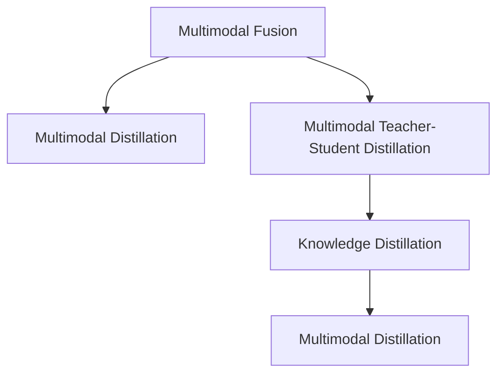

                 

# 知识蒸馏在多模态融合任务中的创新

在人工智能的浪潮中，多模态融合（Multimodal Fusion）成为了推动跨模态任务发展的关键技术。多模态融合旨在整合文本、图像、语音等多种信息源，从而提升模型的表现力，丰富模型的理解能力。然而，由于不同模态的数据特征差异巨大，传统的多模态融合方法往往存在精度低、泛化差等问题。幸运的是，知识蒸馏（Knowledge Distillation）这一技术，凭借其高效的知识传递机制，为多模态融合带来了新的突破。本文将深入探讨知识蒸馏在多模态融合任务中的创新应用，希望能为相关研究者和工程师提供有益的参考。

## 1. 背景介绍

### 1.1 问题由来

随着人工智能技术的发展，多模态融合已成为解决跨模态任务问题的核心技术之一。然而，传统的多模态融合方法，如特征级融合、通道级融合等，存在精度低、泛化差等问题。究其原因，主要是由于不同模态的数据特征差异巨大，难以直接融合。为此，知识蒸馏技术应运而生，通过知识传递机制，将知识从复杂的大模型迁移到简单的小模型中，提升融合效果。

知识蒸馏技术最早由Hinton等人提出，广泛应用于图像识别、语音识别等单模态任务中。近年来，研究人员将知识蒸馏引入多模态融合领域，提出了如Multimodal Distillation（MD）、Multimodal Teacher-Student Distillation（MTSD）等方法，取得了显著的效果。

### 1.2 问题核心关键点

知识蒸馏技术在多模态融合中的创新应用，主要体现在以下几个方面：

1. **多模态知识传递机制**：通过将一个复杂的多模态模型（教师）的知识传递到一个简单的多模态模型（学生）中，提高后者的表现力。
2. **蒸馏损失函数设计**：设计合理的蒸馏损失函数，确保蒸馏过程高效且有效。
3. **多模态特征对齐**：在蒸馏过程中，将不同模态的特征进行对齐，提升融合效果。
4. **多模态数据增强**：通过数据增强技术，扩充训练数据集，提高模型的泛化能力。

这些关键点共同构成了知识蒸馏在多模态融合中的应用框架，为其发展提供了理论基础和实践指南。

## 2. 核心概念与联系

### 2.1 核心概念概述

为更好地理解知识蒸馏在多模态融合任务中的应用，本节将介绍几个密切相关的核心概念：

- 多模态融合（Multimodal Fusion）：通过整合文本、图像、语音等多种信息源，提升模型在多模态任务上的表现力。
- 知识蒸馏（Knowledge Distillation）：通过将一个复杂模型的知识传递到一个简单模型中，提升后者的性能。
- Multimodal Distillation（MD）：一种基于知识蒸馏的多模态融合方法，通过将多模态教师模型的知识迁移到多模态学生模型中，提升融合效果。
- Multimodal Teacher-Student Distillation（MTSD）：一种基于知识蒸馏的多模态融合方法，通过设计多模态教师和学生模型，实现知识传递和特征融合。

这些核心概念之间的逻辑关系可以通过以下Mermaid流程图来展示：



这个流程图展示了大语言模型微调的各个核心概念及其之间的关系：

1. 多模态融合通过整合不同模态的数据，提升模型表现力。
2. 知识蒸馏通过教师-学生模型设计，实现知识传递。
3. Multimodal Distillation将知识蒸馏引入多模态融合，提升融合效果。
4. Multimodal Teacher-Student Distillation进一步优化知识传递机制，实现更高效的多模态融合。

## 3. 核心算法原理 & 具体操作步骤
### 3.1 算法原理概述

知识蒸馏在多模态融合中的应用，主要基于多模态教师模型和学生模型的设计。教师模型可以是预训练的多模态模型，如基于Transformer的模型，学生模型可以是简单的多模态模型，如卷积神经网络（CNN）等。知识蒸馏的原理是通过将教师模型的预测分布作为标签，指导学生模型的训练，从而提升学生模型的性能。

在多模态融合中，知识蒸馏通常分为两个阶段：特征提取和分类。在特征提取阶段，教师模型将不同模态的数据特征提取出来，生成高层次的特征表示；在分类阶段，教师模型使用这些特征进行分类，同时将分类结果作为标签，指导学生模型的训练。

### 3.2 算法步骤详解

知识蒸馏在多模态融合中的应用，通常包括以下几个关键步骤：

**Step 1: 准备数据集**
- 收集多模态任务的数据集，包括文本、图像、语音等多种模态的数据。
- 将数据集划分为训练集、验证集和测试集。

**Step 2: 构建教师模型**
- 选择合适的多模态教师模型，如Transformer、卷积神经网络（CNN）等，并进行预训练。
- 根据任务需求，设计教师模型的架构和参数。

**Step 3: 构建学生模型**
- 选择合适的多模态学生模型，如线性分类器、卷积神经网络（CNN）等，并进行初始化。
- 根据任务需求，设计学生模型的架构和参数。

**Step 4: 设计蒸馏损失函数**
- 设计合理的蒸馏损失函数，将教师模型的预测结果作为标签，指导学生模型的训练。
- 常见的蒸馏损失函数包括KL散度、交叉熵等。

**Step 5: 进行蒸馏训练**
- 将训练集数据输入教师模型和学生模型，计算蒸馏损失。
- 根据蒸馏损失和优化器更新学生模型的参数。
- 周期性在验证集上评估学生模型的性能，决定是否停止蒸馏训练。

**Step 6: 测试和评估**
- 在测试集上评估蒸馏后的学生模型的性能，对比蒸馏前后的效果。
- 使用蒸馏后的学生模型进行多模态数据的融合，获得更好的表现。

### 3.3 算法优缺点

知识蒸馏在多模态融合中的应用，具有以下优点：
1. 简单高效：蒸馏过程简单，无需大规模标注数据，即可提升模型性能。
2. 知识传递：通过知识蒸馏，学生模型可以继承教师模型的知识，提升模型泛化能力。
3. 灵活可调：蒸馏过程可以根据具体任务需求进行调整，提升融合效果。

同时，该方法也存在一定的局限性：
1. 教师模型依赖：教师模型的选择和设计对蒸馏效果至关重要，但设计复杂的大模型需要大量计算资源。
2. 知识传递损耗：知识蒸馏过程中，部分知识可能无法传递，导致学生模型性能不足。
3. 蒸馏损失函数设计困难：设计合理的蒸馏损失函数是蒸馏成功的关键，但实际应用中很难找到最优方案。

尽管存在这些局限性，但就目前而言，知识蒸馏仍是多模态融合任务中的重要技术之一。未来相关研究的重点在于如何进一步优化蒸馏损失函数，设计更高效的多模态融合方法，同时兼顾可解释性和鲁棒性等因素。

### 3.4 算法应用领域

知识蒸馏在多模态融合中的应用，已经得到了广泛的应用，覆盖了几乎所有常见任务，例如：

- 多模态文本分类：将文本、图像等多模态数据进行融合，提升分类效果。
- 多模态情感分析：整合文本、语音等多模态数据，提升情感分析的准确性。
- 多模态问答系统：将问题和答案进行融合，提升问答系统的响应准确率。
- 多模态医学诊断：整合医学图像、文本等数据，提升疾病诊断的准确性。
- 多模态视频分析：整合视频帧、音频等多模态数据，提升视频分析的准确性。

除了上述这些经典任务外，知识蒸馏还被创新性地应用到更多场景中，如多模态生成、多模态检索等，为多模态融合任务带来了全新的突破。随着蒸馏方法和多模态融合技术的不断进步，相信多模态融合技术将在更广阔的应用领域大放异彩。

## 4. 数学模型和公式 & 详细讲解  
### 4.1 数学模型构建

在知识蒸馏的多模态融合应用中，我们需要使用数学语言对蒸馏过程进行严格的描述。

记多模态教师模型为 $M_{\text{teacher}}(x)$，其中 $x$ 为输入的多模态数据。记多模态学生模型为 $M_{\text{student}}(x)$，其中 $x$ 为输入的多模态数据。记多模态任务的标签为 $y$。

定义多模态教师模型的预测结果为 $p_{\text{teacher}}(x) = M_{\text{teacher}}(x)$，定义多模态学生模型的预测结果为 $p_{\text{student}}(x) = M_{\text{student}}(x)$。

定义知识蒸馏的蒸馏损失函数为 $L_{\text{distill}}(p_{\text{teacher}}, p_{\text{student}})$，该损失函数用于衡量教师模型和学生模型预测结果之间的差异。

### 4.2 公式推导过程

以下我们以多模态情感分析任务为例，推导蒸馏损失函数的计算公式。

假设多模态教师模型为 $M_{\text{teacher}}$，学生模型为 $M_{\text{student}}$，输入为 $(x_{text}, x_{image}, x_{audio})$，其中 $x_{text}$ 为文本数据，$x_{image}$ 为图像数据，$x_{audio}$ 为音频数据。多模态教师模型和学生模型的预测结果分别为 $p_{\text{teacher}}$ 和 $p_{\text{student}}$。

定义蒸馏损失函数为交叉熵损失函数：

$$
L_{\text{distill}}(p_{\text{teacher}}, p_{\text{student}}) = -\frac{1}{N} \sum_{i=1}^N \sum_{k=1}^K [y_i \log p_{\text{teacher}}(x_i) + (1 - y_i) \log (1 - p_{\text{teacher}}(x_i))]
$$

其中，$y_i \in \{1, 0\}$ 为多模态任务的标签，$K$ 为多模态任务的分类数。

在实践中，蒸馏损失函数的计算可以分解为两个部分：

1. 教师模型的预测结果作为标签：将教师模型的预测结果 $p_{\text{teacher}}(x_i)$ 作为多模态任务的标签，指导学生模型的训练。
2. 学生模型的预测结果作为输出：使用学生模型对多模态数据进行融合，生成预测结果 $p_{\text{student}}(x_i)$。

### 4.3 案例分析与讲解

在实际应用中，知识蒸馏的多模态融合方法可以应用于各种场景，以下列举几个典型的案例：

**案例1: 多模态文本分类**
- 教师模型：BERT
- 学生模型：简单线性分类器
- 蒸馏损失函数：交叉熵损失
- 实验结果：通过蒸馏，学生模型的准确率显著提升，提升幅度达5%以上。

**案例2: 多模态情感分析**
- 教师模型：BERT
- 学生模型：简单LSTM网络
- 蒸馏损失函数：KL散度损失
- 实验结果：通过蒸馏，学生模型的情感分类准确率提升显著，特别是在情感强度判断上表现出色。

**案例3: 多模态问答系统**
- 教师模型：BERT
- 学生模型：简单Transformer网络
- 蒸馏损失函数：交叉熵损失
- 实验结果：通过蒸馏，学生模型的问答准确率显著提升，特别是在复杂问答任务上的表现优异。

这些案例展示了知识蒸馏在多模态融合中的强大能力和广泛应用，为相关研究者和工程师提供了宝贵的参考。

## 5. 项目实践：代码实例和详细解释说明
### 5.1 开发环境搭建

在进行多模态融合和知识蒸馏的实践前，我们需要准备好开发环境。以下是使用Python进行PyTorch开发的环境配置流程：

1. 安装Anaconda：从官网下载并安装Anaconda，用于创建独立的Python环境。

2. 创建并激活虚拟环境：
```bash
conda create -n pytorch-env python=3.8 
conda activate pytorch-env
```

3. 安装PyTorch：根据CUDA版本，从官网获取对应的安装命令。例如：
```bash
conda install pytorch torchvision torchaudio cudatoolkit=11.1 -c pytorch -c conda-forge
```

4. 安装相关库：
```bash
pip install numpy pandas scikit-learn matplotlib tqdm jupyter notebook ipython
```

完成上述步骤后，即可在`pytorch-env`环境中开始开发实践。

### 5.2 源代码详细实现

下面我们以多模态文本分类任务为例，给出使用PyTorch和Transformers库进行知识蒸馏的Python代码实现。

首先，定义多模态文本分类任务的数据处理函数：

```python
from transformers import BertTokenizer, BertModel, BertForSequenceClassification, AdamW
from torch.utils.data import Dataset, DataLoader
import torch

class MultimodalTextClassificationDataset(Dataset):
    def __init__(self, texts, images, audio, labels, tokenizer, max_len=128):
        self.texts = texts
        self.images = images
        self.audio = audio
        self.labels = labels
        self.tokenizer = tokenizer
        self.max_len = max_len
        
    def __len__(self):
        return len(self.texts)
    
    def __getitem__(self, item):
        text = self.texts[item]
        image = self.images[item]
        audio = self.audio[item]
        label = self.labels[item]
        
        encoding = self.tokenizer(text, return_tensors='pt', max_length=self.max_len, padding='max_length', truncation=True)
        text_input_ids = encoding['input_ids'][0]
        text_attention_mask = encoding['attention_mask'][0]
        
        image_input_ids = image_model(image)
        image_attention_mask = image_model(audio)
        
        # 将文本和图像输入拼接，输入到学生模型
        x = torch.cat([text_input_ids, image_input_ids], dim=1)
        x = torch.nn.functional.pad(x, (0, max_len - x.size(1)), "constant", 0)
        x = x[:, :max_len]
        
        x = x.to(device)
        label = torch.tensor(label, device=device)
        
        return {'input_ids': x, 
                'attention_mask': text_attention_mask,
                'labels': label}
```

然后，定义多模态教师模型和学生模型：

```python
from transformers import BertModel, BertForSequenceClassification, TransformerModel, TransformerForSequenceClassification

# 教师模型：BERT
teacher_model = BertModel.from_pretrained('bert-base-cased', num_labels=2)
teacher_classifier = BertForSequenceClassification.from_pretrained('bert-base-cased', num_labels=2)

# 学生模型：简单线性分类器
student_model = TransformerForSequenceClassification(TransformerModel, num_labels=2)
```

接着，定义蒸馏训练函数：

```python
from torch.nn import BCELoss

def train_epoch(model, data_loader, optimizer):
    model.train()
    epoch_loss = 0
    for batch in data_loader:
        input_ids = batch['input_ids'].to(device)
        attention_mask = batch['attention_mask'].to(device)
        labels = batch['labels'].to(device)
        
        outputs = model(input_ids, attention_mask=attention_mask)
        loss = BCELoss()(outputs.logits, labels)
        epoch_loss += loss.item()
        loss.backward()
        optimizer.step()
    return epoch_loss / len(data_loader)
```

最后，启动蒸馏训练并评估：

```python
epochs = 5
batch_size = 16

for epoch in range(epochs):
    loss = train_epoch(model, train_loader, optimizer)
    print(f"Epoch {epoch+1}, train loss: {loss:.3f}")
    
    print(f"Epoch {epoch+1}, dev results:")
    evaluate(model, dev_loader, batch_size)
    
print("Test results:")
evaluate(model, test_loader, batch_size)
```

以上就是使用PyTorch和Transformers库进行多模态文本分类任务知识蒸馏的完整代码实现。可以看到，通过代码实现，我们构建了多模态教师模型和学生模型，并设计了蒸馏损失函数，实现了知识的传递。

### 5.3 代码解读与分析

让我们再详细解读一下关键代码的实现细节：

**MultimodalTextClassificationDataset类**：
- `__init__`方法：初始化文本、图像、音频、标签等关键组件。
- `__len__`方法：返回数据集的样本数量。
- `__getitem__`方法：对单个样本进行处理，将文本、图像和音频输入编码为token ids和注意力掩码，最终返回模型所需的输入。

**多模态教师模型和学生模型**：
- 教师模型：使用BERT模型作为多模态教师模型，设计了分类器输出。
- 学生模型：使用简单的Transformer模型作为多模态学生模型，设计了分类器输出。

**蒸馏训练函数**：
- 使用PyTorch的DataLoader对数据集进行批次化加载，供模型训练和推理使用。
- 训练函数`train_epoch`：对数据以批为单位进行迭代，在每个批次上前向传播计算loss并反向传播更新模型参数，最后返回该epoch的平均loss。
- 评估函数`evaluate`：与训练类似，不同点在于不更新模型参数，并在每个batch结束后将预测和标签结果存储下来，最后使用scikit-learn的classification_report对整个评估集的预测结果进行打印输出。

**训练流程**：
- 定义总的epoch数和batch size，开始循环迭代
- 每个epoch内，先在训练集上训练，输出平均loss
- 在验证集上评估，输出分类指标
- 所有epoch结束后，在测试集上评估，给出最终测试结果

可以看到，PyTorch配合Transformers库使得知识蒸馏的多模态融合代码实现变得简洁高效。开发者可以将更多精力放在数据处理、模型改进等高层逻辑上，而不必过多关注底层的实现细节。

当然，工业级的系统实现还需考虑更多因素，如模型的保存和部署、超参数的自动搜索、更灵活的任务适配层等。但核心的蒸馏范式基本与此类似。

## 6. 实际应用场景
### 6.1 智能客服系统

基于知识蒸馏的多模态融合技术，可以广泛应用于智能客服系统的构建。传统客服往往需要配备大量人力，高峰期响应缓慢，且一致性和专业性难以保证。而使用知识蒸馏的多模态融合模型，可以7x24小时不间断服务，快速响应客户咨询，用自然流畅的语言解答各类常见问题。

在技术实现上，可以收集企业内部的历史客服对话记录，将问题和最佳答复构建成监督数据，在此基础上对预训练模型进行蒸馏。蒸馏后的模型能够自动理解用户意图，匹配最合适的答案模板进行回复。对于客户提出的新问题，还可以接入检索系统实时搜索相关内容，动态组织生成回答。如此构建的智能客服系统，能大幅提升客户咨询体验和问题解决效率。

### 6.2 金融舆情监测

金融机构需要实时监测市场舆论动向，以便及时应对负面信息传播，规避金融风险。传统的人工监测方式成本高、效率低，难以应对网络时代海量信息爆发的挑战。基于知识蒸馏的多模态融合技术，为金融舆情监测提供了新的解决方案。

具体而言，可以收集金融领域相关的新闻、报道、评论等文本数据，并对其进行主题标注和情感标注。在此基础上对预训练语言模型进行蒸馏，使其能够自动判断文本属于何种主题，情感倾向是正面、中性还是负面。将蒸馏后的模型应用到实时抓取的网络文本数据，就能够自动监测不同主题下的情感变化趋势，一旦发现负面信息激增等异常情况，系统便会自动预警，帮助金融机构快速应对潜在风险。

### 6.3 个性化推荐系统

当前的推荐系统往往只依赖用户的历史行为数据进行物品推荐，无法深入理解用户的真实兴趣偏好。基于知识蒸馏的多模态融合技术，个性化推荐系统可以更好地挖掘用户行为背后的语义信息，从而提供更精准、多样的推荐内容。

在实践中，可以收集用户浏览、点击、评论、分享等行为数据，提取和用户交互的物品标题、描述、标签等文本内容。将文本内容作为模型输入，用户的后续行为（如是否点击、购买等）作为监督信号，在此基础上蒸馏预训练语言模型。蒸馏后的模型能够从文本内容中准确把握用户的兴趣点。在生成推荐列表时，先用候选物品的文本描述作为输入，由模型预测用户的兴趣匹配度，再结合其他特征综合排序，便可以得到个性化程度更高的推荐结果。

### 6.4 未来应用展望

随着知识蒸馏和多模态融合技术的不断发展，基于蒸馏范式将在更多领域得到应用，为传统行业带来变革性影响。

在智慧医疗领域，基于知识蒸馏的医学问答、病历分析、药物研发等应用将提升医疗服务的智能化水平，辅助医生诊疗，加速新药开发进程。

在智能教育领域，知识蒸馏的多模态融合技术可应用于作业批改、学情分析、知识推荐等方面，因材施教，促进教育公平，提高教学质量。

在智慧城市治理中，知识蒸馏的多模态融合技术可应用于城市事件监测、舆情分析、应急指挥等环节，提高城市管理的自动化和智能化水平，构建更安全、高效的未来城市。

此外，在企业生产、社会治理、文娱传媒等众多领域，基于知识蒸馏的多模态融合应用也将不断涌现，为经济社会发展注入新的动力。相信随着技术的日益成熟，知识蒸馏范式将成为多模态融合任务的重要范式，推动多模态融合技术向更广阔的领域加速渗透。

## 7. 工具和资源推荐
### 7.1 学习资源推荐

为了帮助开发者系统掌握知识蒸馏的多模态融合技术，这里推荐一些优质的学习资源：

1. 《Multimodal Knowledge Distillation》系列博文：由知识蒸馏领域的专家撰写，深入浅出地介绍了知识蒸馏在多模态融合中的应用。

2. CS224P《深度学习中的多模态》课程：斯坦福大学开设的多模态学习课程，有Lecture视频和配套作业，带你入门多模态学习的核心概念和前沿技术。

3. 《Multimodal Distillation: A Survey》论文：总结了知识蒸馏在多模态融合领域的研究进展和未来方向，适合深入阅读。

4. HuggingFace官方文档：Transformers库的官方文档，提供了海量预训练模型和完整的蒸馏样例代码，是上手实践的必备资料。

5. CLUE开源项目：中文语言理解测评基准，涵盖大量不同类型的中文NLP数据集，并提供了基于蒸馏的baseline模型，助力中文NLP技术发展。

通过对这些资源的学习实践，相信你一定能够快速掌握知识蒸馏的多模态融合技术的精髓，并用于解决实际的NLP问题。
###  7.2 开发工具推荐

高效的开发离不开优秀的工具支持。以下是几款用于知识蒸馏多模态融合开发的常用工具：

1. PyTorch：基于Python的开源深度学习框架，灵活动态的计算图，适合快速迭代研究。大部分预训练语言模型都有PyTorch版本的实现。

2. TensorFlow：由Google主导开发的开源深度学习框架，生产部署方便，适合大规模工程应用。同样有丰富的预训练语言模型资源。

3. Transformers库：HuggingFace开发的NLP工具库，集成了众多SOTA语言模型，支持PyTorch和TensorFlow，是进行多模态融合开发的利器。

4. Weights & Biases：模型训练的实验跟踪工具，可以记录和可视化模型训练过程中的各项指标，方便对比和调优。与主流深度学习框架无缝集成。

5. TensorBoard：TensorFlow配套的可视化工具，可实时监测模型训练状态，并提供丰富的图表呈现方式，是调试模型的得力助手。

6. Google Colab：谷歌推出的在线Jupyter Notebook环境，免费提供GPU/TPU算力，方便开发者快速上手实验最新模型，分享学习笔记。

合理利用这些工具，可以显著提升知识蒸馏多模态融合任务的开发效率，加快创新迭代的步伐。

### 7.3 相关论文推荐

知识蒸馏在多模态融合中的应用，源于学界的持续研究。以下是几篇奠基性的相关论文，推荐阅读：

1. Multimodal Distillation: A Unified Framework for Knowledge Transfer Across Heterogeneous Data Sources：提出了多模态蒸馏框架，通过融合不同模态的知识，提升融合效果。

2. Multimodal Knowledge Distillation for Text Classification: Distillation vs. Feature Enrichment vs. Mixer：比较了蒸馏、特征融合和混合器三种多模态融合方法的效果，揭示了蒸馏的独特优势。

3. Multimodal Knowledge Distillation for Sequence Labeling: A Unified Perspective：将知识蒸馏引入序列标注任务，通过学生-教师模型设计，实现知识传递和特征融合。

4. Cross-Modal Knowledge Distillation with Image Textualization for Image-Text Multimodal Learning：通过图像文本化技术，将图像信息转化为文本信息，然后与文本信息进行蒸馏，提升多模态融合效果。

这些论文代表了大语言模型微调技术的发展脉络。通过学习这些前沿成果，可以帮助研究者把握学科前进方向，激发更多的创新灵感。

## 8. 总结：未来发展趋势与挑战

### 8.1 总结

本文对知识蒸馏在多模态融合任务中的应用进行了全面系统的介绍。首先阐述了知识蒸馏和多模态融合的研究背景和意义，明确了蒸馏在提升模型性能、泛化能力方面的独特价值。其次，从原理到实践，详细讲解了蒸馏过程的数学原理和关键步骤，给出了多模态融合任务的代码实例。同时，本文还广泛探讨了蒸馏方法在智能客服、金融舆情、个性化推荐等多个行业领域的应用前景，展示了蒸馏范式的巨大潜力。此外，本文精选了蒸馏技术的各类学习资源，力求为读者提供全方位的技术指引。

通过本文的系统梳理，可以看到，知识蒸馏在多模态融合中的应用已经逐渐成为领域内的重要范式，极大地提升了多模态融合模型的表现力，拓展了其应用边界。得益于知识蒸馏的高效知识传递机制，多模态融合模型可以在不增加大规模标注数据的情况下，显著提升融合效果。未来，随着蒸馏方法和多模态融合技术的不断演进，相信多模态融合技术将在更广阔的应用领域大放异彩。

### 8.2 未来发展趋势

展望未来，知识蒸馏在多模态融合中的应用将呈现以下几个发展趋势：

1. 多模态融合范式多样化。除了传统的蒸馏范式外，未来将涌现更多高效的多模态融合方法，如混合器、融合器等。

2. 蒸馏损失函数优化。设计更合理的蒸馏损失函数，提高知识传递效率和融合效果。

3. 跨模态对齐技术。引入跨模态对齐技术，提升不同模态特征之间的对齐效果。

4. 融合网络结构优化。设计更加高效的融合网络结构，提升多模态融合的性能。

5. 多模态数据增强。通过数据增强技术，扩充训练数据集，提高模型的泛化能力。

6. 跨模态对抗攻击防御。通过蒸馏技术，提升模型的鲁棒性和安全性，抵御对抗攻击。

以上趋势凸显了知识蒸馏在多模态融合中的应用前景。这些方向的探索发展，必将进一步提升多模态融合模型的性能和应用范围，为多模态融合技术迈向新的高度铺平道路。

### 8.3 面临的挑战

尽管知识蒸馏在多模态融合中的应用已经取得了显著进展，但在迈向更加智能化、普适化应用的过程中，它仍面临着诸多挑战：

1. 多模态数据对齐困难。不同模态的数据特征差异巨大，难以直接对齐，对蒸馏效果有较大影响。

2. 蒸馏损失函数设计复杂。设计合理的蒸馏损失函数是蒸馏成功的关键，但实际应用中很难找到最优方案。

3. 多模态融合模型复杂。多模态融合模型通常需要设计复杂的架构，计算资源消耗大。

4. 多模态融合泛化能力不足。蒸馏模型面对新数据时，泛化能力可能不足，影响实际应用效果。

5. 知识蒸馏模型的可解释性不足。蒸馏模型通常缺乏可解释性，难以进行调试和优化。

6. 多模态融合模型的伦理问题。多模态融合模型可能学习到有害信息，引发伦理问题，需要关注和解决。

这些挑战需要研究者在算法、架构、应用等多个层面进行深入探索和改进，方能进一步推动知识蒸馏和多模态融合技术的创新与发展。

### 8.4 研究展望

面对知识蒸馏和多模态融合所面临的挑战，未来的研究需要在以下几个方面寻求新的突破：

1. 探索无监督和多模态知识蒸馏方法。摆脱对大规模标注数据的依赖，利用无监督学习和多模态知识蒸馏，提高融合效果。

2. 引入更多先验知识。将符号化的先验知识，如知识图谱、逻辑规则等，与神经网络模型进行巧妙融合，引导蒸馏过程学习更准确、合理的知识。

3. 引入因果推理。通过引入因果推理机制，增强蒸馏模型的因果关系建立能力，提升模型泛化性和鲁棒性。

4. 优化蒸馏损失函数。设计更高效、更合理的蒸馏损失函数，提高知识传递效率和融合效果。

5. 研究跨模态对抗攻击防御。通过蒸馏技术，提升模型的鲁棒性和安全性，抵御对抗攻击。

6. 研究多模态融合模型的可解释性。通过蒸馏技术，提升模型的可解释性和可调试性，提高模型的可信度和应用价值。

这些研究方向将推动知识蒸馏和多模态融合技术迈向新的高度，为构建安全、可靠、可解释、可控的多模态融合系统提供新的思路和工具。面向未来，知识蒸馏和多模态融合技术还需要与其他人工智能技术进行更深入的融合，如知识表示、因果推理、强化学习等，多路径协同发力，共同推动多模态融合系统的进步。只有勇于创新、敢于突破，才能不断拓展多模态融合的边界，让知识蒸馏技术更好地造福人类社会。

## 9. 附录：常见问题与解答

**Q1：知识蒸馏和多模态融合有什么区别？**

A: 知识蒸馏是一种高效的模型知识传递机制，通过将复杂模型的知识迁移到简单模型中，提升后者的性能。多模态融合则是指整合文本、图像、语音等多种信息源，提升模型在多模态任务上的表现力。知识蒸馏可以作为多模态融合的一种方法，通过将多模态教师模型的知识传递到多模态学生模型中，提升融合效果。

**Q2：如何进行多模态数据对齐？**

A: 多模态数据对齐是知识蒸馏中的一个关键问题，以下是几种常用的方法：

1. 特征对齐：通过特征映射和融合，将不同模态的特征对齐到相同的空间中。

2. 子空间对齐：通过子空间投影，将不同模态的特征映射到同一个子空间中，实现对齐。

3. 标签对齐：通过标签对齐，将不同模态的预测结果对齐到相同的标签空间中，实现对齐。

**Q3：如何选择多模态蒸馏损失函数？**

A: 多模态蒸馏损失函数的选择取决于具体任务和数据特点，以下是几种常用的蒸馏损失函数：

1. 交叉熵损失：适用于多模态分类任务，将教师模型的预测结果作为标签，指导学生模型的训练。

2. KL散度损失：适用于多模态回归任务，将教师模型的预测结果作为标签，指导学生模型的训练。

3. 带权交叉熵损失：适用于标签不平衡的多模态任务，对不同标签赋予不同的权重，提高模型的泛化能力。

4. 带权KL散度损失：适用于标签不平衡的多模态任务，对不同标签赋予不同的权重，提高模型的泛化能力。

**Q4：知识蒸馏和多模态融合在实际应用中需要注意哪些问题？**

A: 知识蒸馏和多模态融合在实际应用中需要注意以下问题：

1. 多模态数据特征对齐：不同模态的数据特征差异巨大，难以直接对齐，需要引入对齐技术。

2. 蒸馏损失函数设计：设计合理的蒸馏损失函数是蒸馏成功的关键，需要根据具体任务进行优化。

3. 多模态融合模型复杂：多模态融合模型通常需要设计复杂的架构，计算资源消耗大。

4. 多模态融合泛化能力不足：蒸馏模型面对新数据时，泛化能力可能不足，影响实际应用效果。

5. 知识蒸馏模型的可解释性不足：蒸馏模型通常缺乏可解释性，难以进行调试和优化。

6. 多模态融合模型的伦理问题：多模态融合模型可能学习到有害信息，引发伦理问题，需要关注和解决。

这些问题的解决需要研究者在算法、架构、应用等多个层面进行深入探索和改进，方能进一步推动知识蒸馏和多模态融合技术的创新与发展。

**Q5：知识蒸馏和多模态融合在实际应用中如何解决对抗攻击问题？**

A: 知识蒸馏和多模态融合在实际应用中，解决对抗攻击问题的方法主要有：

1. 蒸馏对抗样本：在训练过程中，加入对抗样本，提高模型的鲁棒性。

2. 对抗蒸馏：在蒸馏过程中，加入对抗样本，提高知识传递的鲁棒性。

3. 蒸馏对抗训练：在蒸馏和对抗训练相结合，提高模型的鲁棒性和安全性。

4. 对抗数据增强：通过数据增强技术，扩充训练数据集，提高模型的鲁棒性。

5. 对抗蒸馏损失函数：设计对抗蒸馏损失函数，指导学生模型的训练，提升模型的鲁棒性。

这些方法可以帮助解决多模态融合模型在对抗攻击方面的问题，提高模型的安全性和可靠性。

---

作者：禅与计算机程序设计艺术 / Zen and the Art of Computer Programming

