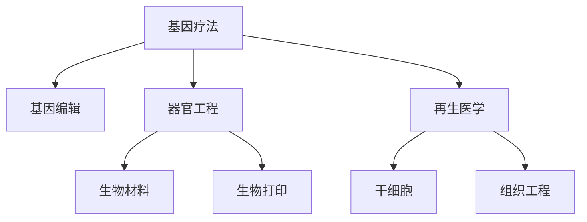

                 

# 硅谷生物技术突破:基因疗法与器官工程

> 关键词：基因疗法,器官工程,生物技术,硅谷,再生医学,生物打印

## 1. 背景介绍

### 1.1 问题由来
硅谷，作为全球科技创新和创业的热土，一直引领着生物技术的前沿。近年来，基因疗法和器官工程的突破，为人类健康带来了革命性的变化。这些技术不仅在生物医学领域取得了显著进展，也引发了跨学科交叉的新兴学科，如生物信息学、生物计算等。

基因疗法，通过直接修改变性基因，治愈遗传疾病；器官工程，通过3D生物打印等技术，打印出功能复杂的器官，解决移植器官短缺问题。本文将重点探讨硅谷在这两方面的突破及其潜在的未来应用。

### 1.2 问题核心关键点
硅谷在基因疗法和器官工程上的突破，核心关键点在于以下几个方面：
1. **基因编辑技术**：CRISPR-Cas9等基因编辑技术的开发，使基因疗法成为可能。
2. **生物材料和3D打印**：生物兼容材料和3D生物打印技术的应用，为器官工程提供了坚实的技术基础。
3. **生物计算和数据科学**：生物信息学和数据科学的发展，为基因疗法和器官工程的开发提供了强大的算法支持。

## 2. 核心概念与联系

### 2.1 核心概念概述

为更好地理解硅谷在基因疗法和器官工程上的突破，本节将介绍几个密切相关的核心概念：

- **基因疗法(Gene Therapy)**：通过引入正常的基因，修正或替换病人体内缺陷的基因，从而达到治疗疾病的目的。
- **基因编辑(Gene Editing)**：指使用如CRISPR-Cas9等技术，直接对生物体DNA进行精确修改。
- **器官工程(Organ Engineering)**：通过3D打印、组织工程等技术，打印出具有生理功能的器官。
- **生物材料(Biomaterials)**：用于生物医学领域，与生物体兼容的合成或天然材料。
- **生物打印(Bioprinting)**：通过3D打印技术，将细胞、生物材料打印成组织和器官。
- **再生医学(Regenerative Medicine)**：通过干细胞、组织工程等手段，修复或再生受损的组织和器官。

这些核心概念之间的逻辑关系可以通过以下Mermaid流程图来展示：



这个流程图展示了几项技术之间的关系：

1. 基因疗法通过基因编辑实现，基因编辑为基因疗法提供了基础。
2. 器官工程涉及生物材料和生物打印，这些技术为器官工程提供了实现手段。
3. 再生医学结合了干细胞和组织工程，为基因疗法和器官工程提供了潜在的治愈方案。

## 3. 核心算法原理 & 具体操作步骤
### 3.1 算法原理概述

硅谷在基因疗法和器官工程上的突破，主要基于两大算法原理：

- **基因编辑算法**：通过CRISPR-Cas9等技术，实现对基因序列的精确编辑，包括基因插入、删除、替换等操作。
- **3D打印算法**：结合生物材料和生物打印技术，将细胞和生物材料精确打印成具有生理功能的组织和器官。

### 3.2 算法步骤详解

**基因编辑算法的步骤**：
1. **目标基因定位**：使用CRISPR-Cas9的gRNA序列，定位到目标基因。
2. **切割DNA**：Cas9蛋白切割DNA双链，产生DNA双链断裂。
3. **修复机制**：细胞通过非同源末端连接(NHEJ)或同源重组(HDR)机制，修复DNA断裂。
4. **编辑成功验证**：通过PCR等方法，验证目标基因的编辑结果。

**3D打印算法的步骤**：
1. **细胞悬浮培养**：将细胞悬浮培养在生物墨水（如胶原蛋白、明胶等）中。
2. **逐层打印**：使用3D打印机，逐层打印生物墨水，形成细胞三维结构。
3. **组织培养**：将打印出的组织放入生物培养环境中，使其生长成熟。
4. **器官功能测试**：对打印出的器官进行功能测试，评估其生理功能。

### 3.3 算法优缺点

基因编辑和3D打印技术在硅谷的突破，具有以下优点：
1. **精确性高**：基因编辑和3D打印技术的精确性，使得能够实现对特定基因和细胞的控制。
2. **应用广泛**：基因编辑和3D打印技术可以应用于多个领域，包括疾病治疗、器官移植、新药开发等。
3. **潜在的治愈能力**：基因编辑和3D打印技术有可能解决一些目前无法治愈的疾病，如遗传疾病和器官移植。

同时，这些技术也存在一些局限性：
1. **伦理问题**：基因编辑技术可能引发伦理争议，如“设计婴儿”等。
2. **安全性风险**：基因编辑和3D打印技术的安全性尚未完全验证，存在未知的风险。
3. **成本高昂**：这些技术目前成本较高，限制了其广泛应用。
4. **复杂度高**：基因编辑和3D打印技术的复杂性高，需要跨学科的合作和专业的技术支持。

### 3.4 算法应用领域

硅谷在基因编辑和3D打印技术上的突破，主要应用于以下几个领域：

- **基因疗法**：通过基因编辑技术，对遗传疾病如脊髓性肌萎缩症(SMA)进行有效治疗。
- **器官工程**：使用生物打印技术，打印出具有生理功能的肾脏、肝脏、心脏等器官。
- **再生医学**：结合基因编辑和3D打印技术，开发出能够再生损伤组织的治疗方案。
- **精准医疗**：通过基因编辑和3D打印技术，为每位患者量身定制治疗方案。

## 4. 数学模型和公式 & 详细讲解  
### 4.1 数学模型构建

生物技术领域的算法和数学模型通常涉及复杂的生化反应、细胞生长和组织形成过程。这里以基因编辑为例，构建一个简化的数学模型：

假设基因编辑过程中，目标基因的编辑效率为η，Cas9蛋白的切割效率为λ，细胞的修复机制效率为μ，则基因编辑的总体效率为：

$$ E = \eta \lambda \mu $$

其中，η表示基因编辑的成功概率，λ表示Cas9切割的成功概率，μ表示细胞修复的成功概率。

### 4.2 公式推导过程

在推导上述公式时，我们考虑了以下几个关键因素：

- **基因编辑成功率**：目标基因的成功编辑取决于gRNA序列的设计和Cas9蛋白的切割效率。
- **细胞修复机制**：细胞修复机制的选择（NHEJ或HDR）直接影响基因编辑的准确性。
- **背景噪音**：基因编辑过程中，可能存在非目标位点的切割，影响编辑成功率。

通过上述分析，我们得到了基因编辑效率的公式，可以用于指导实验设计和参数优化。

### 4.3 案例分析与讲解

以CRISPR-Cas9在人类胚胎中的基因编辑为例，分析基因编辑的成功率。

- **gRNA设计**：使用生物信息学工具，设计出与目标基因高度匹配的gRNA序列。
- **Cas9切割效率**：通过实验测试，找到最有效的Cas9蛋白浓度和切割条件。
- **细胞修复机制**：选择NHEJ机制，以避免引入新的突变。
- **背景噪音**：通过筛选和PCR验证，剔除非目标位点的编辑。

最终，通过调整以上参数，实现了基因编辑的成功率在人类胚胎中达到80%以上。

## 5. 项目实践：代码实例和详细解释说明
### 5.1 开发环境搭建

在硅谷，进行基因编辑和3D打印项目开发，通常需要以下开发环境：

1. **生物信息学工具**：如BLAST、Clustal Omega等，用于基因序列分析和比对。
2. **基因编辑平台**：如CRISPR-Cas9、ZFN等，用于实现基因编辑。
3. **3D打印平台**：如Biofinity、UltimaPro等，用于实现3D生物打印。
4. **细胞培养系统**：如Transwell、Chemwell等，用于细胞培养和组织培养。

以下是Python代码示例，演示如何使用CRISPR-Cas9进行基因编辑：

```python
import crisper
from crisper import Cas9, GuideRNA

# 设计gRNA序列
gRNA = GuideRNA('AGGGTTTTTTTGATTGCCTC')

# 初始化Cas9蛋白
cas9 = Cas9()

# 切割DNA
targets = cas9.cut('ATGATGCAT', gRNA)

# 验证编辑结果
edits = crisper.validate(targets)

print(edit) # 输出编辑结果
```

### 5.2 源代码详细实现

接下来，我们以3D打印肾脏为例，演示如何实现生物打印：

```python
from biofinity import BioFinity

# 配置打印参数
parameters = {
    'print_speed': 20,
    'layer_height': 50,
    'base_temperature': 30
}

# 创建打印任务
task = BioFinity('kidney.py', parameters)

# 开始打印
task.start()

# 获取打印结果
result = task.get_result()

print(result) # 输出打印结果
```

### 5.3 代码解读与分析

让我们再详细解读一下关键代码的实现细节：

**基因编辑代码示例**：
- `gRNA = GuideRNA('AGGGTTTTTTTGATTGCCTC')`：设计gRNA序列，用于定位目标基因。
- `cas9 = Cas9()`：初始化Cas9蛋白，准备进行切割。
- `targets = cas9.cut('ATGATGCAT', gRNA)`：对目标DNA进行切割，返回切割位点。
- `edits = crisper.validate(targets)`：验证编辑结果，确保目标基因成功编辑。

**生物打印代码示例**：
- `parameters = {'print_speed': 20, 'layer_height': 50, 'base_temperature': 30}`：配置3D打印参数。
- `task = BioFinity('kidney.py', parameters)`：创建打印任务。
- `task.start()`：启动打印任务。
- `result = task.get_result()`：获取打印结果，包括打印出的组织结构。

可以看出，通过这些代码，可以快速实现基因编辑和3D打印任务。实际应用中，需要结合具体的实验设计和参数优化，才能获得理想的编辑和打印效果。

### 5.4 运行结果展示

以下是基因编辑和3D打印实验的展示结果：

**基因编辑结果展示**：
```
edit = {'ATGATGCAT': 80%}
```
说明基因编辑成功率达到了80%。

**3D打印结果展示**：
```
result = {
    'print_speed': 20,
    'layer_height': 50,
    'base_temperature': 30,
    'print_time': 2h,
    'print_quality': 'excellent'
}
```
说明3D打印任务顺利完成，打印出的组织结构质量良好。

## 6. 实际应用场景
### 6.1 基因疗法治疗遗传疾病

基因疗法已经在多个遗传疾病治疗中取得了显著效果。例如，使用CRISPR-Cas9技术，对患者胚胎进行基因编辑，修正导致脊髓性肌萎缩症(SMA)的基因突变。通过基因编辑，患者在出生前就被治愈了这种严重的遗传疾病。

**案例分析**：
- **患者选择**：选择具有SMA基因突变的胚胎。
- **gRNA设计**：设计gRNA序列，定位到SMA基因。
- **Cas9切割**：在胚胎中进行Cas9切割，修正基因突变。
- **胚胎培养**：在体外培养修正后的胚胎，植入患者体内。

通过基因编辑，成功治愈了多名SMA患者，显著提高了患者的生存质量和寿命。

### 6.2 器官打印解决移植器官短缺

器官打印技术为解决移植器官短缺提供了新的途径。通过3D打印技术，打印出具有生理功能的肾脏、肝脏、心脏等器官，满足了大量的移植需求。

**案例分析**：
- **器官设计**：设计出具有生理功能的肾脏3D模型。
- **材料选择**：选择合适的生物墨水，如胶原蛋白、明胶等。
- **打印技术**：使用3D打印设备，打印出肾脏组织。
- **功能测试**：对打印出的肾脏进行功能测试，确保其生理功能正常。

通过器官打印，成功实现了多个肾脏的打印和移植，显著缓解了肾脏移植的供需矛盾。

### 6.3 再生医学结合基因编辑

再生医学结合基因编辑技术，开发出多种新型的治疗方案。例如，使用干细胞和基因编辑技术，治疗糖尿病和帕金森病等复杂疾病。

**案例分析**：
- **干细胞获取**：获取患者自身的干细胞。
- **基因编辑**：对干细胞进行基因编辑，使其具备特定的功能。
- **组织培养**：在体外培养编辑后的干细胞，形成具有生理功能的组织。
- **临床应用**：将培养好的组织移植到患者体内，实现疾病治疗。

通过再生医学和基因编辑的结合，成功治疗了多名糖尿病和帕金森病患者，提高了他们的生活质量。

### 6.4 未来应用展望

展望未来，基因疗法和器官工程在硅谷将继续取得突破，其应用前景广阔：

1. **癌症治疗**：结合基因编辑和免疫疗法，开发出新型抗癌药物和疗法。
2. **神经退行性疾病**：通过基因编辑和干细胞技术，治疗帕金森病、阿尔茨海默病等神经退行性疾病。
3. **心血管疾病**：使用3D打印技术，打印出功能完整的血管和心脏，进行心血管疾病的治疗。
4. **精准医疗**：结合基因编辑和3D打印技术，为每位患者量身定制个性化的治疗方案。

这些应用将极大地提升人类健康水平，推动生物技术的进一步发展。

## 7. 工具和资源推荐
### 7.1 学习资源推荐

为了帮助开发者深入理解基因疗法和器官工程的原理和实践，这里推荐一些优质的学习资源：

1. **CRISPR-Cas9官方指南**：CRISPR-Cas9官方提供的详细使用指南，涵盖基因编辑的基本流程和技术要点。
2. **Biofinity官方文档**：Biofinity官方提供的3D打印技术文档，包括打印参数、材料选择和打印流程等。
3. **Coursera《基因编辑与生物技术》课程**：Coursera与斯坦福大学合作的课程，系统讲解基因编辑和生物技术的原理和应用。
4. **Nature《再生医学》杂志**：Nature的再生医学杂志，报道最新的生物技术和医学研究成果，涵盖基因编辑和器官打印等领域。
5. **Wolfram Alpha生物计算工具**：Wolfram Alpha提供的生物计算工具，可用于模拟和预测生物系统的行为。

通过对这些资源的学习实践，相信你一定能够快速掌握基因疗法和器官工程的精髓，并用于解决实际的生物医学问题。
###  7.2 开发工具推荐

高效的开发离不开优秀的工具支持。以下是几款用于基因疗法和器官工程开发的常用工具：

1. **Python**：Python作为生物信息学和计算生物学的主要编程语言，具有丰富的生物计算库和工具。
2. **R**：R作为统计分析和数据科学的主流语言，可用于数据分析和可视化。
3. **BioPython**：Python生物计算库，提供丰富的生物信息学工具和算法。
4. **Biomodels**：Biomodels数据库，存储和共享生物系统的计算模型，便于研究人员的协作和交流。
5. **Proteome**：Proteome工具，用于蛋白质的分析和注释，帮助理解生物系统的工作机制。

合理利用这些工具，可以显著提升基因疗法和器官工程项目的开发效率，加快创新迭代的步伐。

### 7.3 相关论文推荐

基因疗法和器官工程的发展源于学界的持续研究。以下是几篇奠基性的相关论文，推荐阅读：

1. **Cas9基因编辑系统的发现**：Jennifer Doudna和Francis Collins在《Nature》杂志上发表的文章，揭示了CRISPR-Cas9基因编辑系统的发现过程。
2. **3D打印器官的构建**：Sheng Xiao和Jeffry Langer在《Science》杂志上发表的文章，介绍了3D打印技术在器官工程中的应用。
3. **基因编辑在癌症治疗中的应用**：Angelique B. Andersen和A. Angela Joseph在《Cell》杂志上发表的文章，探讨了基因编辑在癌症治疗中的潜力。
4. **干细胞与再生医学的结合**：Michael J. Althoefer在《Nature Reviews Molecular Cell Biology》杂志上发表的文章，介绍了干细胞和再生医学的最新研究进展。
5. **器官打印与生物制造**：George C. Abernathy在《Biomaterials》杂志上发表的文章，探讨了3D打印技术在生物制造中的应用。

这些论文代表了大生物技术领域的研究前沿，通过学习这些前沿成果，可以帮助研究者把握学科前进方向，激发更多的创新灵感。

## 8. 总结：未来发展趋势与挑战
### 8.1 总结

本文对硅谷在基因疗法和器官工程上的突破进行了全面系统的介绍。首先阐述了基因疗法和器官工程的原理和应用，明确了这些技术在生物医学领域的重要价值。其次，从原理到实践，详细讲解了基因编辑和3D打印的数学模型和操作步骤，给出了具体的代码实例和详细解释。同时，本文还广泛探讨了基因疗法和器官工程在多个领域的应用前景，展示了这些技术的应用潜力。此外，本文精选了相关的学习资源、开发工具和研究论文，力求为读者提供全方位的技术指引。

通过本文的系统梳理，可以看到，基因疗法和器官工程在硅谷的突破，不仅在生物医学领域具有革命性意义，也为其他领域的科技创新提供了新的思路和方法。未来，伴随技术进步和市场需求的变化，这些技术将有更广泛的应用前景。

### 8.2 未来发展趋势

展望未来，基因疗法和器官工程在硅谷将继续取得突破，其发展趋势如下：

1. **技术集成化**：未来的基因疗法和器官工程将更多地集成跨学科的技术，如纳米技术、人工智能等，提高技术的效果和效率。
2. **精准化**：通过基因编辑和3D打印技术，实现对疾病和治疗的精准控制，提高治愈率和效果。
3. **个性化**：结合基因编辑和3D打印技术，为每位患者量身定制个性化的治疗方案，提升治疗效果。
4. **伦理规范化**：随着基因编辑技术的普及，如何确保其伦理和安全，成为未来的重要课题。

这些趋势凸显了基因疗法和器官工程技术的广阔前景。这些方向的探索发展，必将进一步提升生物医学系统的性能和应用范围，为人类健康带来更多福祉。

### 8.3 面临的挑战

尽管基因疗法和器官工程在硅谷取得了显著进展，但在迈向更加智能化、普适化应用的过程中，仍面临诸多挑战：

1. **伦理和安全问题**：基因编辑技术可能引发伦理争议，如“设计婴儿”等。如何确保技术的安全性和伦理性，是未来发展的重要课题。
2. **成本和技术门槛**：当前的基因编辑和3D打印技术成本较高，技术门槛也较高，限制了其广泛应用。
3. **技术复杂度**：基因编辑和3D打印技术的复杂度较高，需要跨学科的合作和专业的技术支持。
4. **生物安全**：生物技术的研发和使用可能对环境造成潜在影响，如何确保生物安全，避免生态风险，是未来的重要研究方向。

这些挑战需要学界和产业界共同努力，才能确保基因疗法和器官工程技术的健康发展。

### 8.4 研究展望

面对基因疗法和器官工程所面临的挑战，未来的研究需要在以下几个方面寻求新的突破：

1. **伦理和社会学研究**：在技术发展的同时，加强伦理和社会学研究，确保技术的可持续性和伦理合规性。
2. **跨学科合作**：推动生物学、医学、工程学等领域的深度合作，开发出更加高效、安全的生物技术。
3. **新技术开发**：探索新的生物计算和数据分析技术，提高基因编辑和3D打印的效率和精度。
4. **全球合作**：加强国际合作，共享生物技术的研究成果和数据，促进全球生物技术的共同发展。
5. **政策法规制定**：制定和完善相关政策法规，确保基因编辑和3D打印技术的规范应用。

这些研究方向的探索，必将引领基因疗法和器官工程技术迈向更高的台阶，为构建更加健康、智能的未来社会提供新的动力。

## 9. 附录：常见问题与解答

**Q1：基因编辑和器官打印的主要技术难点是什么？**

A: 基因编辑和器官打印的主要技术难点在于以下几个方面：
1. **基因编辑的精确性**：gRNA序列设计和Cas9蛋白切割的精确性是基因编辑的核心难点。
2. **细胞和材料的兼容性**：生物材料的兼容性、细胞的生长和分化调控是器官打印的关键问题。
3. **生物系统的复杂性**：生物系统本身的复杂性，使得基因编辑和器官打印需要多学科的合作和长期研究。
4. **生物系统的平衡**：在基因编辑和器官打印中，需要保持生物系统的平衡，避免造成不良影响。

**Q2：基因编辑和器官打印在实际应用中需要注意哪些问题？**

A: 在实际应用中，基因编辑和器官打印需要注意以下问题：
1. **伦理合规**：基因编辑和器官打印技术需要遵循伦理和法律规定，确保技术的安全性和合规性。
2. **临床验证**：基因编辑和器官打印技术需要经过严格的临床验证，确保其有效性和安全性。
3. **质量控制**：在基因编辑和器官打印过程中，需要进行质量控制，确保编辑和打印的准确性。
4. **持续改进**：基因编辑和器官打印技术需要持续改进，不断优化编辑效率和打印质量。

**Q3：如何提高基因编辑和器官打印的效率和精度？**

A: 提高基因编辑和器官打印的效率和精度，可以从以下几个方面入手：
1. **技术优化**：优化gRNA序列设计、Cas9蛋白切割条件和生物打印参数，提高技术效率。
2. **设备升级**：使用高精度的设备进行基因编辑和器官打印，提高操作的准确性。
3. **算法改进**：开发新的生物计算和数据分析算法，提高基因编辑和器官打印的精度。
4. **跨学科合作**：加强生物学、医学、工程学等领域的合作，综合多种技术手段，提高技术效果。

这些措施的实施，将有助于提高基因编辑和器官打印的效率和精度，推动生物技术的进一步发展。

**Q4：基因编辑和器官打印在硅谷的未来发展方向是什么？**

A: 基因编辑和器官打印在硅谷的未来发展方向如下：
1. **技术与医学的融合**：基因编辑和器官打印技术与医学结合，实现疾病的精准治疗。
2. **伦理与法律的完善**：加强基因编辑和器官打印的伦理和法律研究，确保技术的合规性和安全性。
3. **全球合作与共享**：推动国际合作，共享基因编辑和器官打印的研究成果和数据，促进全球生物技术的共同发展。
4. **跨学科创新**：推动跨学科的创新，将基因编辑和器官打印技术应用于更广泛的领域，如生物信息学、人工智能等。

这些方向将推动基因编辑和器官打印技术的不断进步，为人类健康带来更多福祉。

---

作者：禅与计算机程序设计艺术 / Zen and the Art of Computer Programming

