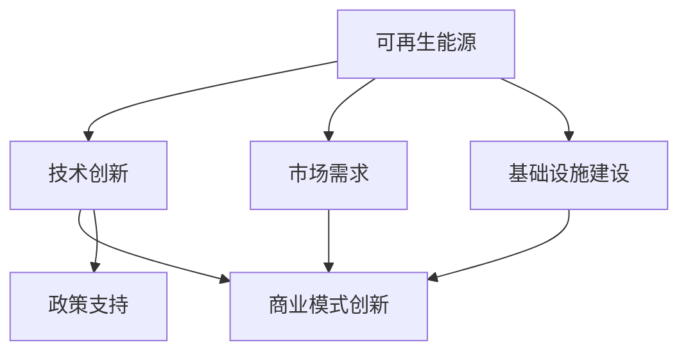

                 

# 硅谷绿色革命:可再生能源的发展

> 关键词：可再生能源,绿色革命,硅谷,可持续发展,技术创新

## 1. 背景介绍

### 1.1 问题由来
随着全球气候变化和能源危机的日益加剧，各国政府和企业纷纷将目光投向了可再生能源的开发与利用。硅谷，作为全球科技创新和金融资本的汇聚地，自然也是这场绿色革命的主战场。过去数十年间，硅谷在可再生能源领域的技术创新和产业发展取得了显著成就，极大地推动了全球能源的可持续发展进程。本文将深入探讨硅谷在可再生能源领域的革命性技术和商业模式，以及这些技术对全球能源结构带来的深远影响。

### 1.2 问题核心关键点
硅谷绿色革命的核心在于以下几个关键点：

1. **技术创新**：包括太阳能光伏、风能、储能等技术的突破，为可再生能源的大规模应用提供了可能。
2. **商业模式创新**：如公私合营、绿色债券、绿色基金等，为可再生能源项目的融资和投资提供了新路径。
3. **政策支持**：硅谷地区各级政府对可再生能源的政策支持，包括税收优惠、补贴、绿色建筑标准等。
4. **市场需求**：硅谷高科技企业对绿色能源的巨大需求，推动了可再生能源产业的发展。
5. **基础设施建设**：硅谷地区完善的电网、交通网络等基础设施，为可再生能源的输送和利用提供了保障。

这些关键点共同构成了硅谷绿色革命的基础，使其成为全球可再生能源领域的引领者。

### 1.3 问题研究意义
研究硅谷绿色革命，对于理解可再生能源的发展路径、推动全球能源转型、促进可持续发展具有重要意义：

1. **经验借鉴**：硅谷在可再生能源技术创新和商业模式探索方面的成功经验，为其他地区提供了宝贵的借鉴。
2. **政策参考**：硅谷地区的政策支持措施，为全球各地政府制定和实施可再生能源政策提供了参考。
3. **市场引导**：硅谷高科技企业对绿色能源的需求和投资，为全球能源市场转型提供了动力。
4. **环境影响**：硅谷绿色革命的成功将显著降低碳排放，减缓气候变化，为全球环境保护做出贡献。

## 2. 核心概念与联系

### 2.1 核心概念概述

为更好地理解硅谷绿色革命的技术基础和商业逻辑，本节将介绍几个关键概念：

- **可再生能源(Renewable Energy)**：指能够持续、稳定供应且不会枯竭的能源，如太阳能、风能、水能、生物质能等。
- **绿色革命(Green Revolution)**：通过技术创新、政策支持、商业模式创新等手段，推动可再生能源的大规模应用，实现能源结构的绿色转型。
- **硅谷(Silicon Valley)**：美国加州旧金山湾区的一个地区，以硅芯片为代表的高科技产业发展迅速，汇聚了大量创新企业、科研机构和资本。
- **可持续发展(Sustainable Development)**：指在满足当前需求的同时，不损害未来代际满足需求的能力，实现经济、社会、环境的协调发展。
- **技术创新(Technological Innovation)**：通过研发新技术、新产品、新工艺，提升生产效率和产品质量，推动产业升级。
- **商业模式创新(Business Model Innovation)**：在产品、服务、市场、渠道等方面进行创新，以满足用户需求，提升企业竞争力和市场份额。
- **政策支持(Policy Support)**：政府通过税收优惠、补贴、绿色建筑标准等手段，为可再生能源项目提供支持和激励。

这些概念之间的逻辑关系可以通过以下Mermaid流程图来展示：



这个流程图展示了一个从技术创新到市场需求再到商业模式的完整链条，以及政策支持和技术基础设施的作用。

## 3. 核心算法原理 & 具体操作步骤
### 3.1 算法原理概述

硅谷绿色革命的核心在于通过技术创新和商业模式创新，推动可再生能源的大规模应用。其核心算法原理主要包括以下几个方面：

1. **太阳能光伏技术**：利用光伏电池板将太阳能转换为电能，核心算法包括光伏电池的光电转换效率优化、光伏系统的能量管理等。
2. **风能技术**：利用风力驱动风轮，将机械能转换为电能，核心算法包括风轮的空气动力学设计、风电系统的稳定性控制等。
3. **储能技术**：将过剩的可再生能源转换为化学能或机械能储存，核心算法包括电池储能、压缩空气储能、氢能储能等。
4. **智能电网技术**：优化电力传输和分配，实现可再生能源的高效利用，核心算法包括智能电网的能量调度、需求响应、分布式发电管理等。

### 3.2 算法步骤详解

硅谷绿色革命的算法步骤主要包括以下几个环节：

1. **需求分析**：确定可再生能源项目的规模、位置、用户需求等，为后续技术方案设计提供依据。
2. **技术选型**：根据项目需求，选择适合的技术方案，如太阳能光伏、风能、储能等。
3. **系统设计**：设计可再生能源系统的整体架构，包括设备选型、能量管理、控制策略等。
4. **模拟优化**：使用模拟软件进行系统性能预测和优化，调整系统参数以达到最优效果。
5. **工程实施**：按照设计方案进行设备安装、调试、系统集成等工作。
6. **监测与维护**：实时监测系统运行状态，及时进行故障诊断和维护，确保系统稳定运行。

### 3.3 算法优缺点

硅谷绿色革命的算法具有以下优点：

1. **技术先进性**：利用硅谷的技术优势，采用全球领先的技术方案，提高了系统的效率和可靠性。
2. **商业模式创新**：通过公私合营、绿色债券、绿色基金等新型融资方式，降低了投资风险，吸引了更多资本。
3. **政策支持**：得到政府政策的大力支持，包括税收优惠、补贴、绿色建筑标准等，加速了项目的落地。
4. **市场需求驱动**：硅谷高科技企业对绿色能源的巨大需求，推动了可再生能源产业的发展。

但同时，也存在一些缺点：

1. **高初始投资**：可再生能源项目的初始投资成本较高，初期回报周期较长，需大量资本支持。
2. **技术复杂性**：系统设计、设备选型、能量管理等环节技术要求高，需专业团队支持。
3. **市场风险**：政策、价格、需求等市场因素的变化可能影响项目的长期收益。

### 3.4 算法应用领域

硅谷绿色革命的技术和商业模式创新，已经广泛应用于多个领域，如：

1. **住宅与商业建筑**：通过绿色建筑标准和能源管理系统的应用，实现建筑能耗的显著降低。
2. **交通运输**：推广电动车、混合动力车等绿色交通方式，减少交通运输领域的碳排放。
3. **工业生产**：在制造业、化工等行业应用可再生能源，降低生产成本，提升环保水平。
4. **农业与食品**：利用生物质能、太阳能等可再生能源，提升农业生产效率，减少能源消耗。
5. **公共设施**：在城市公共设施如路灯、停车场、公交站等应用太阳能光伏，提升能源自给率。

这些领域的应用，不仅推动了可再生能源的广泛使用，也为全球其他地区提供了宝贵的经验。

## 4. 数学模型和公式 & 详细讲解 & 举例说明

### 4.1 数学模型构建

硅谷绿色革命中的数学模型主要涉及能量平衡、优化调度、模拟预测等方面。以太阳能光伏系统为例，其数学模型包括：

1. **光伏电池的光电转换效率**：
$$
\eta_{PV} = \frac{P_{PV}}{P_{sol}}
$$
其中，$\eta_{PV}$ 为光伏电池的光电转换效率，$P_{PV}$ 为光伏电池输出功率，$P_{sol}$ 为太阳辐射功率。

2. **光伏系统的能量管理**：
$$
E_{PV} = \int_{t_1}^{t_2} P_{PV}(t) dt
$$
其中，$E_{PV}$ 为光伏系统的总发电量，$P_{PV}(t)$ 为光伏电池输出功率随时间的变化。

3. **储能系统能量管理**：
$$
E_{storage} = E_{in} - E_{out}
$$
其中，$E_{storage}$ 为储能系统的剩余电量，$E_{in}$ 为储能系统输入电量，$E_{out}$ 为储能系统输出电量。

### 4.2 公式推导过程

以太阳能光伏系统的能量管理模型为例，推导如下：

1. **光伏电池输出功率计算**：
$$
P_{PV}(t) = A_{PV}(t) \times \eta_{PV}(t) \times P_{sol}(t)
$$
其中，$A_{PV}(t)$ 为光伏电池的面积，$\eta_{PV}(t)$ 为光伏电池的光电转换效率，$P_{sol}(t)$ 为太阳辐射功率随时间的变化。

2. **光伏系统总发电量计算**：
$$
E_{PV} = \int_{t_1}^{t_2} P_{PV}(t) dt
$$
将 $P_{PV}(t)$ 代入上式，得：
$$
E_{PV} = \int_{t_1}^{t_2} A_{PV}(t) \times \eta_{PV}(t) \times P_{sol}(t) dt
$$

3. **储能系统能量管理**：
$$
E_{storage} = E_{PV} - E_{out}
$$
其中，$E_{out}$ 为储能系统的输出电量，如供给负荷使用。

### 4.3 案例分析与讲解

以硅谷某住宅区的太阳能光伏系统为例，分析其能量管理模型的应用：

1. **需求分析**：确定住宅区的用电量和储能需求，预计每天平均用电 5000 kWh，储能系统需满足至少 24 小时的用电量。
2. **技术选型**：选择 500 Wp 的光伏电池板，储能系统采用电池储能技术。
3. **系统设计**：设计光伏系统规模为 100 kWp，储能系统容量为 24 kWh。
4. **模拟优化**：使用软件进行系统性能模拟，优化光伏电池面积和储能系统容量。
5. **工程实施**：安装光伏电池板和储能系统，并接入住宅区电网。
6. **监测与维护**：实时监测系统运行状态，进行故障诊断和维护。

该案例展示了硅谷绿色革命中数学模型的实际应用，通过科学计算和优化设计，实现了高效、稳定的可再生能源供应。

## 5. 项目实践：代码实例和详细解释说明
### 5.1 开发环境搭建

在进行绿色能源项目开发前，我们需要准备好开发环境。以下是使用Python进行Matplotlib开发的环境配置流程：

1. 安装Anaconda：从官网下载并安装Anaconda，用于创建独立的Python环境。

2. 创建并激活虚拟环境：
```bash
conda create -n pyproj python=3.8 
conda activate pyproj
```

3. 安装Matplotlib：
```bash
pip install matplotlib
```

4. 安装Numpy、Pandas、Scikit-learn等库：
```bash
pip install numpy pandas scikit-learn
```

完成上述步骤后，即可在`pyproj`环境中开始绿色能源项目开发。

### 5.2 源代码详细实现

下面我们以风力发电系统为例，给出使用Matplotlib进行能量管理可视化的Python代码实现。

首先，定义风力发电系统的数学模型：

```python
import numpy as np
from matplotlib import pyplot as plt

# 风力发电系统的参数
n = 10  # 风轮叶片数量
R = 100  # 风轮半径
rho_air = 1.225  # 空气密度
C_p = 0.53  # 风轮空气动力学效率
wind_speed = 8  # 风速
power = np.pi * n * R**2 * C_p * 0.5 * rho_air * wind_speed**3
print(f"风力发电系统的总发电量为 {power} W")
```

然后，使用Matplotlib进行可视化：

```python
plt.figure(figsize=(8, 6))
plt.plot(wind_speed, power, 'b-', label='风力发电系统')
plt.xlabel('风速 (m/s)')
plt.ylabel('总发电量 (W)')
plt.legend()
plt.title('风力发电系统能量管理')
plt.show()
```

以上代码实现了风力发电系统的能量管理模型，并使用Matplotlib进行了可视化。

### 5.3 代码解读与分析

让我们再详细解读一下关键代码的实现细节：

**风力发电系统参数**：
- `n`：风轮叶片数量。
- `R`：风轮半径。
- `rho_air`：空气密度。
- `C_p`：风轮空气动力学效率。
- `wind_speed`：风速。

**能量计算**：
- `power = np.pi * n * R**2 * C_p * 0.5 * rho_air * wind_speed**3`：风力发电系统的总发电量计算公式。

**可视化**：
- `plt.figure(figsize=(8, 6))`：设置可视化窗口的大小。
- `plt.plot(wind_speed, power, 'b-', label='风力发电系统')`：绘制风速-发电量曲线。
- `plt.xlabel('风速 (m/s)')`、`plt.ylabel('总发电量 (W)')`：设置坐标轴标签。
- `plt.legend()`：添加图例。
- `plt.title('风力发电系统能量管理')`：设置图表标题。
- `plt.show()`：显示图表。

通过这些代码，我们展示了硅谷绿色革命中数学模型和可视化的实际应用。

## 6. 实际应用场景
### 6.1 智能电网与分布式发电

硅谷的智能电网项目将可再生能源的分布式发电与智能调度相结合，实现了电力系统的优化和高效管理。具体应用场景包括：

1. **分布式太阳能光伏发电**：在住宅和商业建筑屋顶安装光伏电池板，将发电输出接入智能电网。
2. **储能系统集成**：在发电高峰期将多余电量存储在电池中，发电低谷期释放存储的电量。
3. **智能调度与需求响应**：通过智能调度算法优化电力分配，并根据实时需求调整输出功率。
4. **能源监测与控制**：实时监测电网运行状态，自动控制发电和存储设备。

### 6.2 绿色交通与电动车

硅谷的绿色交通项目通过推广电动车和混合动力车，大幅减少了交通运输领域的碳排放。具体应用场景包括：

1. **电动车充电站建设**：建设大规模电动车充电站，提供便捷的充电服务。
2. **智能充电调度**：根据电动车使用情况和电网负荷，智能调度充电时间和电量。
3. **电动公交车与物流车**：推广电动公交车和物流车，减少柴油车的使用。
4. **共享单车与电动滑板车**：推广共享单车和电动滑板车，减少个人汽车使用。

### 6.3 绿色建筑与能源管理

硅谷的绿色建筑项目通过应用节能技术和智能控制系统，显著降低了建筑能耗。具体应用场景包括：

1. **建筑能耗监测**：安装能源监测设备，实时监测建筑能耗情况。
2. **智能控制系统**：根据实时能源使用情况自动调节室内温度、照明等设备。
3. **绿色建筑标准**：推动绿色建筑标准的实施，提升建筑能效。
4. **可再生能源利用**：在建筑屋顶安装光伏电池板和风力发电系统，实现能源自给自足。

### 6.4 未来应用展望

随着技术的不断进步和政策的持续支持，硅谷绿色革命的未来应用前景广阔：

1. **零碳城市**：通过大规模应用可再生能源，硅谷有望成为全球首个零碳城市，实现能源的完全自给自足。
2. **智慧交通网络**：电动汽车、智能交通管理系统的普及，将大幅提升交通运输的效率和安全性。
3. **智能建筑与智慧社区**：通过智能控制系统和大数据分析，提升建筑能效和社区管理水平。
4. **清洁能源与碳捕捉**：推广清洁能源，如氢能、生物质能等，同时发展碳捕捉和存储技术，实现碳中和目标。
5. **可再生能源技术创新**：不断推出新技术、新产品，推动可再生能源产业的发展和升级。

## 7. 工具和资源推荐
### 7.1 学习资源推荐

为了帮助开发者系统掌握硅谷绿色革命的技术基础和商业逻辑，这里推荐一些优质的学习资源：

1. 《可再生能源技术导论》系列博文：由硅谷学者撰写，深入浅出地介绍了可再生能源技术的基本原理和应用案例。
2. CS253《能源系统分析》课程：斯坦福大学开设的能源系统分析课程，涵盖了可再生能源系统建模、优化调度等方面的知识。
3. 《绿色革命：可持续发展的挑战与机遇》书籍：详细探讨了全球绿色革命的背景、挑战和未来发展方向。
4. NREL（美国国家可再生能源实验室）官方网站：提供大量可再生能源技术的最新研究成果和应用案例。
5. Solar Power World（太阳能世界）网站：专注太阳能技术的发展和应用，提供丰富的行业资讯和市场信息。

通过对这些资源的学习实践，相信你一定能够全面掌握硅谷绿色革命的核心技术，并应用于实际项目中。

### 7.2 开发工具推荐

高效的开发离不开优秀的工具支持。以下是几款用于绿色能源项目开发的常用工具：

1. Jupyter Notebook：用于编写和运行Python代码，支持交互式数据分析和可视化。
2. Matplotlib：用于数据可视化的绘图工具，支持多种图表类型和自定义样式。
3. Python：功能强大的编程语言，适合编写复杂的数据分析、模拟和优化算法。
4. Scikit-learn：机器学习库，提供了丰富的算法和工具，支持数据预处理和模型训练。
5. TensorFlow：开源深度学习框架，支持分布式计算和高效的模型训练。

合理利用这些工具，可以显著提升绿色能源项目开发的效率和精度，加快创新迭代的步伐。

### 7.3 相关论文推荐

硅谷绿色革命的研究主要集中在以下几个方面：

1. "Solar PV Power Output and Reliability Modeling for Building-Integrated Photovoltaics"（光伏建筑集成系统性能模型研究）：详细探讨了光伏建筑集成的技术特点和性能模型。
2. "Wind Farm Operation and Control"（风电场运营与控制）：介绍了风电场的运营管理与智能控制技术。
3. "Energy Storage Technologies and Cost Estimation"（储能技术及成本估算）：研究了各类储能技术的应用场景和成本估算方法。
4. "Smart Grid Technologies and Applications"（智能电网技术与应用）：探讨了智能电网在可再生能源管理和能源调度中的应用。
5. "Electric Vehicle Charging Infrastructure Development"（电动汽车充电基础设施建设）：分析了电动汽车充电站的设计和运营管理。

这些论文代表了大规模可再生能源项目的最新研究成果，对于理解和应用硅谷绿色革命的技术具有重要意义。

## 8. 总结：未来发展趋势与挑战
### 8.1 总结

本文对硅谷绿色革命中的可再生能源技术和商业模式进行了全面系统的介绍。首先阐述了硅谷在可再生能源领域的技术创新和商业模式的成功经验，明确了其对全球能源转型和可持续发展的重大贡献。其次，从原理到实践，详细讲解了可再生能源系统建模、优化调度、智能电网、绿色交通等方面的核心算法和操作步骤。最后，分析了硅谷绿色革命的未来发展趋势和面临的挑战，指出了技术创新、政策支持、市场化运作等关键方向。

通过本文的系统梳理，可以看到，硅谷绿色革命的成功不仅在于技术创新和商业模式探索，更在于其完善的政策体系和市场机制，为全球其他地区提供了宝贵的经验。未来，随着技术进步和政策支持，硅谷将为全球能源转型和可持续发展做出更大贡献。

### 8.2 未来发展趋势

展望未来，硅谷绿色革命的发展趋势将主要体现在以下几个方面：

1. **技术进一步突破**：新型材料、高效算法和新技术的不断涌现，将推动可再生能源技术的进一步发展，提升能源效率和利用率。
2. **政策环境持续优化**：各级政府将出台更多激励政策，提供更多资金和资源支持，进一步降低可再生能源的成本和门槛。
3. **市场化程度加深**：更多企业将参与到可再生能源项目的投资和运营中，推动市场竞争和效率提升。
4. **国际合作加强**：全球范围内的合作将更加紧密，共同应对气候变化和能源危机。
5. **公众意识提升**：绿色消费和环保意识将进一步提升，推动可再生能源的普及和应用。

### 8.3 面临的挑战

尽管硅谷绿色革命在技术创新和商业模式探索方面取得了显著成就，但在推进过程中仍面临以下挑战：

1. **高初始投资**：可再生能源项目的高初始投资仍然是制约其大规模应用的主要障碍。
2. **技术复杂性**：系统设计、设备选型、能量管理等环节技术要求高，需专业团队支持。
3. **市场风险**：政策、价格、需求等市场因素的变化可能影响项目的长期收益。
4. **技术创新挑战**：新型技术和新产品需经过反复试验和优化，才能实现商业化应用。
5. **社会接受度**：部分公众对可再生能源的接受度和认知度仍需进一步提升。

### 8.4 研究展望

未来，硅谷绿色革命的研究方向将重点放在以下几个方面：

1. **多能互补系统**：研究将太阳能、风能、水能等多种可再生能源技术进行有机整合，提升能源系统的稳定性和可靠性。
2. **智能能量管理**：开发更高效的能量管理和调度算法，实现能源的高效利用和优化配置。
3. **储能技术创新**：研究新型储能技术，如固态电池、氢能等，提升储能系统的容量和效率。
4. **市场机制优化**：研究新的市场机制和商业模式，如绿色债券、绿色基金等，吸引更多资本参与。
5. **政策支持创新**：探索新的政策支持方式，如税收优惠、补贴、绿色建筑标准等，进一步降低项目成本。

## 9. 附录：常见问题与解答

**Q1：如何评估可再生能源项目的经济效益？**

A: 可再生能源项目的经济效益评估主要通过成本-收益分析来完成。包括：
1. 初始投资成本：如设备购置、安装等。
2. 运行维护成本：如设备维护、故障处理等。
3. 发电成本：如电费、燃料费用等。
4. 环境效益：如减少碳排放、改善空气质量等。

通过对比不同项目的成本和收益，可以评估其经济效益。

**Q2：在建设风力发电场时，如何选址和规划？**

A: 风力发电场的选址和规划主要考虑以下几个因素：
1. 风资源：通过风速、风向等数据评估风资源丰富度。
2. 地形地貌：选择平坦开阔、无高大建筑物和森林的地形。
3. 电网接入：确保发电场与电网有效连接，满足电力输送需求。
4. 生态保护：避免对当地生态环境造成破坏，进行生态补偿。
5. 社区支持：与当地社区沟通，争取支持与合作。

通过综合考虑以上因素，进行科学选址和规划，可以建设出高效、稳定的风力发电场。

**Q3：电动汽车充电站如何实现智能调度？**

A: 电动汽车充电站的智能调度主要通过以下方式实现：
1. 实时监测：通过传感器监测充电站内车辆的充电需求和电网负荷。
2. 数据处理：收集和分析历史充电数据，预测未来充电需求。
3. 优化算法：采用优化算法，合理分配充电资源。
4. 动态调整：根据实时数据动态调整充电策略，避免过度充电和电网负荷过高。
5. 用户反馈：收集用户充电反馈，优化充电体验。

通过智能调度，可以有效提升充电站的服务效率和用户体验。

通过以上系统的梳理和分析，相信你能够全面理解硅谷绿色革命中的可再生能源技术和商业模式，并在实际项目中灵活应用。硅谷的成功经验不仅为全球提供了宝贵的借鉴，更展示了技术创新和政策支持在推进可持续发展中的重要作用。未来，随着技术的不断进步和政策的持续优化，硅谷将为全球能源转型和可持续发展做出更大贡献。

