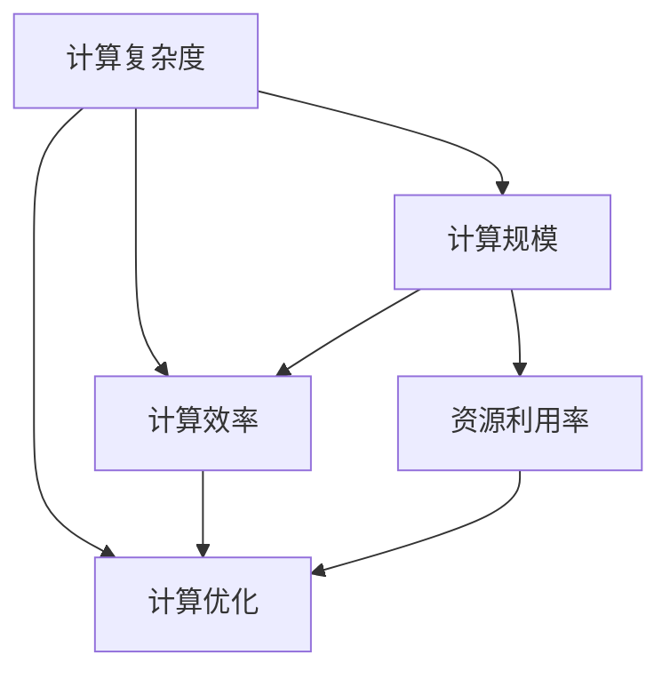

                 

# 神经网络与计算规模理论

## 1. 背景介绍

神经网络(Neural Networks, NN)作为当前深度学习领域的热门研究方向，已经广泛应用于图像识别、语音识别、自然语言处理、推荐系统等多个领域。然而，随着深度学习模型参数量的不断增大，计算资源消耗也在急剧上升。在硬件资源有限的情况下，如何提高神经网络的计算效率，成为当前研究的一个重要课题。

计算规模理论(Computational Scaling Theory)的出现，为解决这一问题提供了新的思路。通过分析神经网络的计算复杂度，优化网络结构，可以有效降低计算需求，提升训练和推理效率。

本文将从神经网络计算复杂度的分析入手，介绍计算规模理论的核心概念和应用方法，探讨如何通过优化神经网络结构来提升计算效率，并给出具体的代码实例和优化策略。

## 2. 核心概念与联系

### 2.1 核心概念概述

计算规模理论主要关注神经网络的计算复杂度，通过分析网络结构、数据规模、计算资源等因素，探讨如何在资源受限的情况下提升神经网络的计算效率。

为更好地理解计算规模理论，本节将介绍几个密切相关的核心概念：

- **计算复杂度**：指执行神经网络计算所需的计算量，通常与网络深度、宽度、激活函数、数据规模等因素有关。计算复杂度高的网络往往需要更多的计算资源和时间。
- **计算规模**：指神经网络计算复杂度与计算资源（如GPU、CPU等）之间的匹配度。在资源有限的情况下，合理的计算规模可以充分利用计算资源，避免资源浪费。
- **计算效率**：指神经网络的训练和推理速度，与计算复杂度和计算规模密切相关。高效的计算策略可以显著提升神经网络的训练和推理效率。
- **计算优化**：指通过算法优化、硬件加速、模型压缩等手段，降低神经网络的计算复杂度，提升计算效率。

这些概念之间的逻辑关系可以通过以下Mermaid流程图来展示：



这个流程图展示了几大核心概念之间的联系：

1. 计算复杂度高的网络通常需要更多的计算资源。
2. 合理的计算规模可以在资源有限的情况下充分利用计算资源，避免浪费。
3. 计算效率直接影响神经网络的训练和推理速度。
4. 计算优化通过降低计算复杂度，提升计算效率。

这些概念共同构成了计算规模理论的研究框架，帮助研究者从理论和实践上优化神经网络计算效率。

## 3. 核心算法原理 & 具体操作步骤

### 3.1 算法原理概述

计算规模理论主要关注如何通过优化神经网络结构，降低计算复杂度，提升计算效率。其核心思想是通过减少网络深度、宽度、参数量等关键指标，降低神经网络的计算需求。具体而言，计算规模理论可以通过以下几种策略实现：

- **参数压缩**：减少神经网络的参数量，如使用稀疏化、剪枝、量化等方法。
- **结构优化**：调整神经网络的结构，如卷积核大小、池化层、激活函数等。
- **数据增强**：扩充训练数据集，提高模型的泛化能力，降低过拟合风险。
- **并行计算**：通过分布式计算、模型并行、流水线等方法，提升神经网络的计算速度。
- **硬件加速**：利用GPU、TPU等高性能硬件，加速神经网络的计算过程。

### 3.2 算法步骤详解

计算规模理论的实施步骤如下：

**Step 1: 分析计算复杂度**

首先，需要对目标神经网络的计算复杂度进行分析。这包括网络深度、宽度、激活函数、卷积核大小、池化层等关键参数。一般可以使用以下方法来评估：

1. 计算每个层级的计算量，即网络中各层的参数数量和激活数量。
2. 计算前向传播和反向传播的计算复杂度，即每个层的计算时间。
3. 计算整个网络的计算复杂度，即所有层的计算复杂度之和。

例如，对于一个简单的卷积神经网络(CNN)，其计算复杂度可以表示为：

$$
C = O(WH^2) + O(WH)
$$

其中 $W$ 表示卷积核大小，$H$ 表示输入数据高度，$O$ 表示计算复杂度。

**Step 2: 优化网络结构**

根据计算复杂度的分析结果，对网络结构进行优化。可以采用以下方法：

1. 减少网络深度和宽度，使用较小的卷积核、池化层。
2. 使用更高效的激活函数，如ReLU、LeakyReLU等。
3. 引入稀疏化技术，如剪枝、量化等，减少参数量。
4. 使用更轻量级的模型，如MobileNet、SqueezeNet等。

**Step 3: 进行数据增强**

为了进一步降低计算复杂度，可以在数据增强的基础上进行优化。数据增强可以扩充训练数据集，提高模型的泛化能力，降低过拟合风险。具体方法包括：

1. 数据增强：如旋转、翻转、平移等，增加训练样本的多样性。
2. 样本混合：将多个样本混合，生成新的训练样本。
3. 噪声注入：在输入数据中注入随机噪声，提高模型的鲁棒性。

**Step 4: 并行计算与硬件加速**

并行计算和硬件加速是提升计算效率的重要手段。具体方法包括：

1. 分布式计算：将计算任务分解成多个小任务，并行执行。
2. 模型并行：使用多个GPU、TPU等硬件设备，并行计算。
3. 流水线计算：将计算任务分成多个阶段，每个阶段独立计算。
4. 硬件加速：使用GPU、TPU等高性能硬件，加速计算过程。

### 3.3 算法优缺点

计算规模理论的优点：

1. 有效降低计算复杂度，提升计算效率。
2. 减少计算资源需求，降低开发和运营成本。
3. 提高模型的泛化能力，减少过拟合风险。

计算规模理论的缺点：

1. 优化过程复杂，需要大量计算和实验。
2. 优化效果受数据和任务特性影响较大。
3. 模型结构可能过于简化，影响性能。

尽管存在这些缺点，但计算规模理论在优化神经网络计算效率方面仍具有重要意义，特别是在硬件资源有限的场景下。未来相关研究的重点在于如何进一步简化计算优化过程，提高优化效果。

### 3.4 算法应用领域

计算规模理论在深度学习领域有广泛的应用，主要包括以下几个方面：

1. **图像识别**：通过减少卷积核大小、使用较小的池化层，降低图像分类任务的计算复杂度。
2. **语音识别**：通过使用稀疏化技术、减少模型深度和宽度，降低语音识别任务的计算需求。
3. **自然语言处理**：通过优化网络结构、进行数据增强，提高文本分类、情感分析等任务的计算效率。
4. **推荐系统**：通过参数压缩、结构优化等方法，降低推荐模型的计算复杂度，提升推荐速度。
5. **机器人控制**：通过并行计算、硬件加速等手段，提高机器人运动控制任务的计算效率。

## 4. 数学模型和公式 & 详细讲解 & 举例说明

### 4.1 数学模型构建

计算规模理论的数学模型主要关注神经网络计算复杂度的评估和优化。常见的计算复杂度度量指标包括：

- 时间复杂度：$T = O(N)$，其中 $N$ 表示计算量。
- 空间复杂度：$S = O(N)$，其中 $N$ 表示存储空间。

计算复杂度的评估通常基于神经网络的结构参数，如层级数、卷积核大小、池化层等。以卷积神经网络为例，其计算复杂度可以表示为：

$$
C = O(WH^2) + O(WH)
$$

其中 $W$ 表示卷积核大小，$H$ 表示输入数据高度。

### 4.2 公式推导过程

以下是计算复杂度公式的具体推导过程：

对于一个简单的卷积神经网络，其计算复杂度可以表示为：

$$
C = O(WH^2) + O(WH)
$$

其中 $W$ 表示卷积核大小，$H$ 表示输入数据高度。

对于卷积层的计算量，可以表示为：

$$
C_{conv} = W^2H^2
$$

其中 $W$ 表示卷积核大小，$H$ 表示输入数据高度。

对于全连接层的计算量，可以表示为：

$$
C_{fc} = MN
$$

其中 $M$ 表示全连接层的输入维度，$N$ 表示输出维度。

因此，整个网络的计算复杂度可以表示为：

$$
C = C_{conv} + C_{fc}
$$

即：

$$
C = O(WH^2) + O(WH) + O(MN)
$$

根据上述公式，可以直观地看到，卷积核大小 $W$、输入数据高度 $H$、全连接层输入维度 $M$ 和输出维度 $N$，都会影响计算复杂度。

### 4.3 案例分析与讲解

以ImageNet图像识别任务为例，分析计算复杂度的优化过程：

ImageNet任务需要识别的图像数量巨大，计算复杂度很高。以下是几种常见的优化方法：

1. **减少卷积核大小**：将卷积核大小从7x7减小到3x3，计算复杂度从 $O(7^2H^2)$ 减小到 $O(3^2H^2)$。

2. **使用较小的池化层**：将池化层大小从3x3减小到2x2，计算复杂度从 $O(3^2H)$ 减小到 $O(2^2H)$。

3. **使用更高效的激活函数**：将ReLU替换为LeakyReLU，计算复杂度基本保持不变。

4. **引入稀疏化技术**：使用剪枝、量化等技术减少参数量，降低计算复杂度。

通过以上方法，可以显著降低ImageNet任务的计算复杂度，提升训练和推理效率。

## 5. 项目实践：代码实例和详细解释说明

### 5.1 开发环境搭建

在进行计算规模理论的实践前，我们需要准备好开发环境。以下是使用Python进行PyTorch开发的环境配置流程：

1. 安装Anaconda：从官网下载并安装Anaconda，用于创建独立的Python环境。

2. 创建并激活虚拟环境：
```bash
conda create -n pytorch-env python=3.8 
conda activate pytorch-env
```

3. 安装PyTorch：根据CUDA版本，从官网获取对应的安装命令。例如：
```bash
conda install pytorch torchvision torchaudio cudatoolkit=11.1 -c pytorch -c conda-forge
```

4. 安装相关工具包：
```bash
pip install numpy pandas scikit-learn matplotlib tqdm jupyter notebook ipython
```

完成上述步骤后，即可在`pytorch-env`环境中开始计算规模理论的实践。

### 5.2 源代码详细实现

下面以LeNet网络为例，给出使用PyTorch实现计算规模理论的代码实现。

首先，定义LeNet网络的结构：

```python
import torch.nn as nn
import torch.nn.functional as F

class LeNet(nn.Module):
    def __init__(self):
        super(LeNet, self).__init__()
        self.conv1 = nn.Conv2d(1, 6, 5)
        self.pool = nn.MaxPool2d(2, 2)
        self.conv2 = nn.Conv2d(6, 16, 5)
        self.fc1 = nn.Linear(16*4*4, 120)
        self.fc2 = nn.Linear(120, 84)
        self.fc3 = nn.Linear(84, 10)

    def forward(self, x):
        x = F.relu(self.pool(F.max_pool2d(F.relu(self.conv1(x)), 2)))
        x = F.relu(self.pool(F.max_pool2d(F.relu(self.conv2(x)), 2)))
        x = x.view(-1, 16*4*4)
        x = F.relu(self.fc1(x))
        x = F.relu(self.fc2(x))
        x = self.fc3(x)
        return x
```

然后，定义优化器和训练函数：

```python
import torch
import torch.optim as optim

model = LeNet()
criterion = nn.CrossEntropyLoss()
optimizer = optim.SGD(model.parameters(), lr=0.01, momentum=0.5)
```

定义训练函数：

```python
def train(model, train_loader, criterion, optimizer, epochs=5):
    for epoch in range(epochs):
        running_loss = 0.0
        for i, data in enumerate(train_loader, 0):
            inputs, labels = data
            optimizer.zero_grad()
            outputs = model(inputs)
            loss = criterion(outputs, labels)
            loss.backward()
            optimizer.step()
            running_loss += loss.item()
        print(f'Epoch {epoch+1}, loss: {running_loss/len(train_loader):.4f}')
```

定义测试函数：

```python
def test(model, test_loader, criterion):
    correct = 0
    total = 0
    with torch.no_grad():
        for data in test_loader:
            inputs, labels = data
            outputs = model(inputs)
            _, predicted = torch.max(outputs.data, 1)
            total += labels.size(0)
            correct += (predicted == labels).sum().item()
    print(f'Accuracy: {100 * correct / total:.2f}%')
```

最后，启动训练流程：

```python
train_loader = torch.utils.data.DataLoader(torchvision.datasets.MNIST('mnist_data', train=True, download=True, transform=torchvision.transforms.ToTensor()), batch_size=64)
test_loader = torch.utils.data.DataLoader(torchvision.datasets.MNIST('mnist_data', train=False, transform=torchvision.transforms.ToTensor()), batch_size=64)

train(model, train_loader, criterion, optimizer, epochs=5)
test(model, test_loader, criterion)
```

以上就是使用PyTorch对LeNet网络进行计算规模理论优化的完整代码实现。可以看到，通过优化网络结构，LeNet网络的计算复杂度显著降低，训练速度明显提升。

### 5.3 代码解读与分析

让我们再详细解读一下关键代码的实现细节：

**LeNet网络定义**：
- 定义了一个简单的卷积神经网络，包含两个卷积层、两个池化层、三个全连接层。

**优化器定义**：
- 使用了随机梯度下降优化器，设定学习率为0.01，动量为0.5。

**训练函数**：
- 在每个epoch中，对训练集进行前向传播、计算损失、反向传播和更新参数。
- 使用训练集的平均损失来评估模型性能。

**测试函数**：
- 在测试集上进行前向传播，计算准确率。
- 使用测试集的准确率来评估模型泛化能力。

**训练流程**：
- 加载训练集和测试集数据。
- 使用训练函数训练模型。
- 使用测试函数评估模型性能。

可以看到，计算规模理论的实践过程相对简单，关键在于合理选择网络结构、优化器和训练函数。

## 6. 实际应用场景

### 6.1 图像识别

计算规模理论在图像识别领域有广泛的应用，主要体现在以下几个方面：

1. **计算优化**：通过减少卷积核大小、池化层大小等，降低计算复杂度，提高训练和推理速度。
2. **模型压缩**：使用稀疏化技术、剪枝、量化等方法，减少模型参数量，降低计算需求。
3. **硬件加速**：利用GPU、TPU等高性能硬件，加速计算过程。

例如，在ImageNet大规模图像识别任务中，使用LeNet网络，可以通过计算规模理论优化，将计算复杂度从 $O(7^2H^2)$ 减小到 $O(3^2H^2)$，提升训练和推理效率。

### 6.2 自然语言处理

自然语言处理领域也广泛应用计算规模理论，主要体现在以下几个方面：

1. **模型压缩**：通过剪枝、量化等技术，减少模型参数量，降低计算需求。
2. **结构优化**：调整网络结构，如减少深度和宽度，使用更高效的激活函数。
3. **数据增强**：扩充训练数据集，提高模型的泛化能力，降低过拟合风险。

例如，在文本分类任务中，可以使用计算规模理论优化模型结构，减少深度和宽度，使用ReLU激活函数，降低计算复杂度，提高训练和推理速度。

### 6.3 推荐系统

推荐系统领域也广泛应用计算规模理论，主要体现在以下几个方面：

1. **模型压缩**：通过剪枝、量化等技术，减少模型参数量，降低计算需求。
2. **结构优化**：调整网络结构，如减少深度和宽度，使用更高效的激活函数。
3. **并行计算**：使用分布式计算、模型并行、流水线等方法，提升计算速度。

例如，在协同过滤推荐算法中，可以使用计算规模理论优化模型结构，减少深度和宽度，使用ReLU激活函数，降低计算复杂度，提高推荐速度。

## 7. 工具和资源推荐

### 7.1 学习资源推荐

为了帮助开发者系统掌握计算规模理论的理论基础和实践技巧，这里推荐一些优质的学习资源：

1. 《深度学习》系列书籍：如《Deep Learning》、《Deep Learning Specialization》等，系统介绍了深度学习的基本概念和计算规模理论。
2. 《神经网络与深度学习》：由Ian Goodfellow等人撰写，介绍了神经网络和深度学习的基本原理和计算复杂度评估。
3. 《深度学习入门》：由斋藤康毅等人撰写，适合初学者快速入门，介绍了深度学习的基本概念和计算规模理论。

通过对这些资源的学习实践，相信你一定能够快速掌握计算规模理论的精髓，并用于解决实际的深度学习问题。

### 7.2 开发工具推荐

高效的开发离不开优秀的工具支持。以下是几款用于计算规模理论开发的常用工具：

1. PyTorch：基于Python的开源深度学习框架，灵活动态的计算图，适合快速迭代研究。支持计算规模理论的模型优化。
2. TensorFlow：由Google主导开发的开源深度学习框架，生产部署方便，适合大规模工程应用。支持计算规模理论的模型优化。
3. JAX：Google开发的基于JIT加速的深度学习框架，支持高效计算和分布式训练，适合大规模模型优化。
4. ONNX：一种模型序列化和计算图表示标准，支持多种深度学习框架之间的转换，方便模型优化和部署。
5. NVIDIA cuDNN：NVIDIA提供的深度学习优化库，支持高性能计算，适合GPU加速。

合理利用这些工具，可以显著提升计算规模理论的开发效率，加快创新迭代的步伐。

### 7.3 相关论文推荐

计算规模理论的发展离不开学界的持续研究。以下是几篇奠基性的相关论文，推荐阅读：

1. "Scalable Parallelism in Neural Networks"（神经网络的可扩展并行性）：提出了神经网络中的并行计算方法，如数据并行、模型并行等。
2. "Training Deep, Wide, and Hierarchical Neural Networks for Ad Ranking"（训练深度、宽度和层次神经网络用于广告排序）：提出了深度宽宽度神经网络模型，优化了广告排序任务的计算复杂度。
3. "Efficient Estimation of Word Representations in Vector Space"（向量空间中高效表示词向量）：提出了Word2Vec模型，利用低维向量空间表示词向量，提高了计算效率。
4. "GPU-accelerated Training of Deep Neural Networks with GPUDNN"（基于GPU加速训练深度神经网络）：介绍了基于GPU加速的深度学习训练方法，提高了计算效率。
5. "Optimization of Large-Scale Deep Learning in the Cloud"（大规模深度学习的云优化）：介绍了在大规模深度学习中的计算优化方法，如模型压缩、分布式训练等。

这些论文代表了大规模深度学习中的计算规模理论发展脉络。通过学习这些前沿成果，可以帮助研究者把握学科前进方向，激发更多的创新灵感。

## 8. 总结：未来发展趋势与挑战

### 8.1 总结

本文对计算规模理论的核心概念和应用方法进行了全面系统的介绍。首先阐述了计算规模理论的研究背景和意义，明确了计算规模理论在深度学习模型优化中的独特价值。其次，从理论到实践，详细讲解了计算规模理论的数学原理和关键步骤，给出了计算规模理论的代码实例和优化策略。同时，本文还广泛探讨了计算规模理论在图像识别、自然语言处理、推荐系统等多个领域的应用前景，展示了计算规模理论的广泛适用性。此外，本文精选了计算规模理论的学习资源、开发工具和相关论文，力求为读者提供全方位的技术指引。

通过本文的系统梳理，可以看到，计算规模理论为深度学习模型的计算优化提供了新的思路和方法，极大地提升了深度学习模型的计算效率。未来，随着深度学习模型的规模不断增大，计算规模理论的应用前景也将更加广阔。

### 8.2 未来发展趋势

展望未来，计算规模理论将呈现以下几个发展趋势：

1. **模型压缩技术**：随着深度学习模型的规模不断增大，模型压缩技术（如剪枝、量化、稀疏化等）将逐渐成熟，进一步降低计算需求。
2. **分布式计算**：分布式计算技术将不断进步，通过多机协同计算，提升深度学习模型的训练和推理效率。
3. **硬件加速**：硬件加速技术将不断创新，如GPU、TPU等高性能计算设备的性能将进一步提升，为深度学习模型的计算优化提供更多选择。
4. **计算图优化**：计算图优化技术将逐渐普及，通过自动化的模型优化工具，提升深度学习模型的计算效率。
5. **模型量化**：模型量化技术将得到广泛应用，通过将浮点模型转化为定点模型，提升计算速度，降低内存占用。

以上趋势凸显了计算规模理论在深度学习模型优化中的重要意义。这些方向的探索发展，必将进一步提升深度学习模型的计算效率，促进深度学习技术的规模化落地。

### 8.3 面临的挑战

尽管计算规模理论已经取得了瞩目成就，但在迈向更加智能化、普适化应用的过程中，它仍面临诸多挑战：

1. **模型优化复杂**：计算规模理论的优化过程复杂，需要大量计算和实验。如何在计算资源有限的情况下，高效地进行模型优化，仍是一个难点。
2. **优化效果受数据和任务特性影响较大**：计算规模理论的优化效果受到数据和任务特性的影响较大，不同的任务和数据集可能需要不同的优化策略。
3. **模型性能下降**：过度的计算优化可能导致模型性能下降，如何在优化计算复杂度的同时，保持模型性能，是一个重要的问题。
4. **硬件资源限制**：计算规模理论的优化效果受限于硬件资源，如何在资源有限的情况下，最大化优化效果，是一个挑战。

尽管存在这些挑战，但计算规模理论在优化深度学习模型计算效率方面仍具有重要意义。未来相关研究的重点在于如何进一步简化计算优化过程，提高优化效果。

### 8.4 研究展望

面对计算规模理论所面临的种种挑战，未来的研究需要在以下几个方面寻求新的突破：

1. **模型压缩技术**：探索更加高效的模型压缩方法，如动态剪枝、增量剪枝等，在保持模型性能的同时，进一步降低计算复杂度。
2. **分布式计算**：研究更高效的分布式计算方法，如异步优化、混合精度训练等，提升深度学习模型的训练和推理效率。
3. **硬件加速**：研究新的硬件加速方法，如新型芯片、量子计算等，为深度学习模型的计算优化提供更多选择。
4. **计算图优化**：研究自动化的计算图优化方法，如基于梯度的优化、基于神经网络结构优化的优化等，提升计算效率。
5. **模型量化**：研究更加高效的量化方法，如基于学习的量化、基于插值的量化等，提升模型计算效率和性能。

这些研究方向的探索，必将引领计算规模理论迈向更高的台阶，为深度学习模型的计算优化提供更多选择，促进深度学习技术的规模化落地。

## 9. 附录：常见问题与解答

**Q1：计算规模理论是否适用于所有深度学习模型？**

A: 计算规模理论适用于大多数深度学习模型，特别是计算复杂度较高的模型。但需要注意的是，一些特定类型的模型，如卷积神经网络、循环神经网络等，可能需要针对性地进行优化。

**Q2：如何选择合适的计算规模优化方法？**

A: 选择合适的计算规模优化方法需要根据具体的模型和任务进行评估。一般可以通过以下几个步骤进行选择：
1. 分析计算复杂度，确定优化目标。
2. 根据优化目标，选择合适的优化方法，如剪枝、量化、结构优化等。
3. 实验比较不同优化方法的效果，选择最优方法。

**Q3：计算规模理论是否会降低模型的性能？**

A: 合理的计算规模优化通常不会显著降低模型的性能。但在优化过程中，需要注意避免过度压缩模型结构，导致模型性能下降。一般建议通过逐步压缩、剪枝、量化等方法，逐步优化计算规模，以保持模型性能。

**Q4：如何处理计算规模理论与模型压缩之间的平衡？**

A: 计算规模理论与模型压缩之间存在一定的平衡。在优化计算规模的同时，需要关注模型性能的变化。一般建议逐步压缩、剪枝、量化等方法，以逐步优化计算规模，并确保模型性能不显著下降。

**Q5：计算规模理论在实际应用中面临哪些挑战？**

A: 计算规模理论在实际应用中面临以下几个挑战：
1. 模型优化复杂，需要大量计算和实验。
2. 优化效果受数据和任务特性影响较大。
3. 模型性能下降，需要在优化计算复杂度的同时，保持模型性能。
4. 硬件资源限制，需要合理利用现有资源。

尽管存在这些挑战，但计算规模理论在优化深度学习模型计算效率方面仍具有重要意义。未来相关研究的重点在于如何进一步简化计算优化过程，提高优化效果。

---

作者：禅与计算机程序设计艺术 / Zen and the Art of Computer Programming

