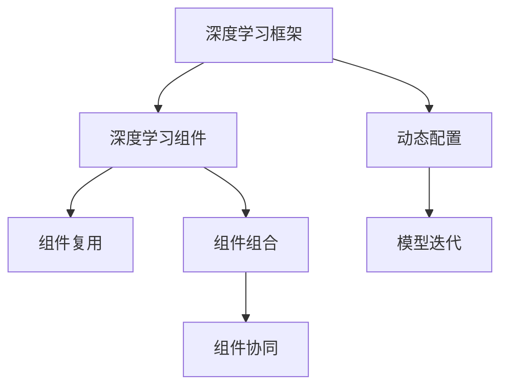

                 

# 神经网络也能模块化：软件2.0的复用与组合

> 关键词：神经网络，软件复用，组件化，模块化，软件2.0，深度学习，人工智能

## 1. 背景介绍

### 1.1 问题由来

在软件工程领域，“软件2.0”指的是利用先进的软件架构、云计算、大数据、人工智能等技术，推动软件系统从传统的线性开发模式，向基于复用、组合、协同的2.0模式转变。其中，深度学习框架作为人工智能的核心工具，成为软件2.0的重要基础。

近年来，深度学习在计算机视觉、自然语言处理、语音识别等领域取得了巨大成功。这些技术不仅提升了机器学习模型的性能，也在软件复用和组件化方面带来了新的突破。传统的线性开发模式逐渐被模块化的深度学习框架所取代，组件化的理念正在成为软件2.0的主流趋势。

### 1.2 问题核心关键点

基于深度学习的软件组件化，通过将深度学习模型封装成可复用的模块，实现模型组件的组合与动态配置。这不仅提升了软件开发的效率和灵活性，也极大促进了人工智能技术在各垂直行业的广泛应用。

软件组件化包含以下几个核心关键点：
- **模型封装与复用**：将深度学习模型封装成可复用的模块，提升代码的可维护性和复用性。
- **模块组合与动态配置**：通过配置管理，实现多个模块的组合与切换，满足不同应用场景的需求。
- **组件协同与优化**：通过组件之间的协同工作，提升系统的性能和鲁棒性，实现端到端的优化。

本文将详细介绍神经网络的模块化、组件化技术，以及其在软件2.0中的实际应用。

## 2. 核心概念与联系

### 2.1 核心概念概述

为更好地理解深度学习框架组件化的方法，本节将介绍几个密切相关的核心概念：

- **深度学习框架**：如TensorFlow、PyTorch、Keras等，提供了一套完善的API和工具链，支持模型的定义、训练和部署。
- **深度学习组件**：通过组件化，将深度学习模型、数据处理、优化器等封装成可复用的模块，支持模型的快速迭代和组合。
- **组件复用**：通过预训练的深度学习组件，可以大幅度提升开发效率，降低重复工作量。
- **组件组合**：通过动态配置和组合，可以根据实际需求灵活构建新的模型或系统。
- **组件协同**：通过组件之间的协同工作，提升模型的性能和泛化能力，实现端到端优化。

这些核心概念之间的逻辑关系可以通过以下Mermaid流程图来展示：



这个流程图展示了几组核心概念之间的关系：

1. 深度学习框架通过提供API和工具链，支持深度学习组件的封装和复用。
2. 组件复用通过预训练的组件，提升开发效率，减少重复工作量。
3. 组件组合通过动态配置和组合，实现灵活构建新的模型或系统。
4. 组件协同通过组件之间的协同工作，提升性能和泛化能力，实现端到端优化。

## 3. 核心算法原理 & 具体操作步骤
### 3.1 算法原理概述

深度学习组件化的基本思想是通过深度学习框架提供的一组API和工具，将深度学习模型、数据预处理、优化器等封装成可复用的组件。这些组件可以被动态配置和组合，构建新的模型或系统，实现灵活的微调和优化。

组件化的核心算法包括以下几个步骤：

1. **模型封装**：将深度学习模型封装成可复用的组件，通常包括模型定义、前向传播、损失函数、优化器等。
2. **数据处理**：封装数据预处理组件，如数据读取、标准化、增强等，确保数据的一致性和有效性。
3. **组件组合**：通过动态配置，实现多个组件的组合和切换，满足不同的应用需求。
4. **协同优化**：通过组件之间的协同工作，提升系统的性能和鲁棒性，实现端到端的优化。

### 3.2 算法步骤详解

**Step 1: 选择深度学习框架**

选择合适的深度学习框架，如TensorFlow、PyTorch、Keras等。这些框架提供了完善的API和工具链，支持模型的定义、训练和部署。

**Step 2: 模型封装**

将深度学习模型封装成可复用的组件。以下是一个简单的例子：

```python
import torch.nn as nn

class MyModel(nn.Module):
    def __init__(self):
        super(MyModel, self).__init__()
        self.fc1 = nn.Linear(784, 128)
        self.fc2 = nn.Linear(128, 10)

    def forward(self, x):
        x = x.view(-1, 784)
        x = F.relu(self.fc1(x))
        x = self.fc2(x)
        return F.log_softmax(x, dim=1)
```

定义了一个简单的线性模型，其中包含了数据前向传播、激活函数和损失函数。

**Step 3: 数据处理**

封装数据预处理组件，如数据读取、标准化、增强等。以下是一个简单的例子：

```python
import torchvision.transforms as transforms
from torch.utils.data import DataLoader

# 定义数据读取和标准化
transform_train = transforms.Compose([
    transforms.RandomHorizontalFlip(),
    transforms.RandomCrop(32, padding=4),
    transforms.ToTensor(),
    transforms.Normalize((0.5, 0.5, 0.5), (0.5, 0.5, 0.5))
])

# 定义数据加载器
train_loader = DataLoader(train_dataset, batch_size=64, shuffle=True, drop_last=True)
```

定义了数据读取和标准化，使用`transforms.Compose`组合多个变换，确保数据的一致性和有效性。

**Step 4: 组件组合**

通过动态配置和组合，实现多个组件的组合和切换，满足不同的应用需求。以下是一个简单的例子：

```python
# 定义模型、数据加载器和优化器
model = MyModel()
criterion = nn.CrossEntropyLoss()
optimizer = torch.optim.Adam(model.parameters(), lr=0.001)

# 定义训练循环
for epoch in range(10):
    for i, (features, labels) in enumerate(train_loader):
        optimizer.zero_grad()
        outputs = model(features)
        loss = criterion(outputs, labels)
        loss.backward()
        optimizer.step()
```

通过动态配置，实现模型、数据加载器和优化器的组合，构建训练循环。

**Step 5: 协同优化**

通过组件之间的协同工作，提升系统的性能和鲁棒性，实现端到端的优化。以下是一个简单的例子：

```python
# 定义模型、数据加载器和优化器
model = MyModel()
criterion = nn.CrossEntropyLoss()
optimizer = torch.optim.Adam(model.parameters(), lr=0.001)

# 定义训练循环
for epoch in range(10):
    for i, (features, labels) in enumerate(train_loader):
        optimizer.zero_grad()
        outputs = model(features)
        loss = criterion(outputs, labels)
        loss.backward()
        optimizer.step()
```

通过组件之间的协同工作，实现模型的前向传播、损失计算、反向传播和参数更新，提升系统的性能和鲁棒性。

### 3.3 算法优缺点

深度学习组件化的算法具有以下优点：
1. **提升开发效率**：通过预训练的组件，可以大幅度提升开发效率，减少重复工作量。
2. **灵活配置**：通过动态配置和组合，实现灵活构建新的模型或系统，满足不同的应用需求。
3. **提升性能和鲁棒性**：通过组件之间的协同工作，提升模型的性能和鲁棒性，实现端到端的优化。

同时，该算法也存在一定的局限性：
1. **学习曲线陡峭**：组件化的设计需要一定的编程和架构设计经验，新手可能难以掌握。
2. **组件质量依赖**：组件的质量和稳定性对整个系统的性能影响较大，需要仔细选择和测试。
3. **资源消耗较大**：组件化设计需要较大的计算资源，特别是在模型训练和优化时，可能面临资源瓶颈。

尽管存在这些局限性，但深度学习组件化的技术已经在大规模应用中得到验证，成为软件2.0的重要组成部分。

### 3.4 算法应用领域

深度学习组件化的算法已经在多个领域得到了广泛应用，包括：

- **计算机视觉**：如目标检测、图像分割、人脸识别等。通过组件化设计，可以实现不同算法的组合和切换，提升模型的性能和泛化能力。
- **自然语言处理**：如语言模型、文本分类、机器翻译等。通过组件化设计，可以实现不同模型的组合和切换，提升模型的语言理解和生成能力。
- **语音识别**：如语音转文本、语音合成等。通过组件化设计，可以实现不同算法的组合和切换，提升模型的鲁棒性和准确性。
- **医疗影像**：如医学图像分割、病灶检测等。通过组件化设计，可以实现不同算法的组合和切换，提升模型的诊断能力。
- **金融风控**：如信用评分、欺诈检测等。通过组件化设计，可以实现不同算法的组合和切换，提升模型的风险评估能力。

除了这些应用领域外，深度学习组件化的技术还在更多场景中得到应用，如自动驾驶、智能制造、智慧城市等，为各行各业带来了新的技术突破。

## 4. 数学模型和公式 & 详细讲解 & 举例说明

### 4.1 数学模型构建

本节将使用数学语言对深度学习组件化的算法进行更加严格的刻画。

记深度学习模型为 $f_{\theta}(x)$，其中 $\theta$ 为模型参数，$x$ 为输入数据。假设深度学习框架封装了模型的前向传播、损失函数和优化器，定义为 $\mathcal{F}$。则组件化的数学模型可以表示为：

$$
y = \mathcal{F}(f_{\theta}, x)
$$

其中，$f_{\theta}$ 为封装好的深度学习模型，$x$ 为输入数据，$\mathcal{F}$ 为深度学习框架提供的API和工具。

### 4.2 公式推导过程

以下我们以计算机视觉领域的目标检测任务为例，推导组件化的数学模型及其推导过程。

假设目标检测任务的目标数为 $C$，使用深度学习框架封装了目标检测模型 $f_{\theta}$，其前向传播输出为 $z \in \mathbb{R}^{N\times H\times W\times C}$，其中 $N$ 为样本数，$H$ 和 $W$ 为特征图尺寸，$C$ 为目标数。

定义目标检测损失函数为交叉熵损失函数，定义为 $\mathcal{L}_{\text{det}}(y, z)$，其中 $y \in \{0, 1\}^{N\times H\times W\times C}$ 为真实标签，$z$ 为目标检测模型的输出。则目标检测任务的数学模型可以表示为：

$$
\mathcal{L}_{\text{det}}(y, z) = -\frac{1}{N}\sum_{i=1}^N \sum_{j=1}^{H}\sum_{k=1}^{W}\sum_{c=1}^{C} y_{i,j,k,c} \log z_{i,j,k,c}
$$

在得到目标检测损失函数后，可以带入模型训练公式，进行动态配置和组件组合，最终实现目标检测任务的模型封装和训练。

### 4.3 案例分析与讲解

下面以一个简单的例子来说明组件化的实现过程。

**案例：线性回归模型**

假设我们要构建一个简单的线性回归模型，通过组件化实现模型的封装和训练。

首先，定义线性回归模型的参数：

```python
import torch.nn as nn
import torch.optim as optim

# 定义线性回归模型
class LinearRegression(nn.Module):
    def __init__(self, input_dim, output_dim):
        super(LinearRegression, self).__init__()
        self.linear = nn.Linear(input_dim, output_dim)

    def forward(self, x):
        return self.linear(x)
```

然后，定义数据读取和标准化组件：

```python
import torch
from torchvision import datasets, transforms

# 定义数据读取和标准化
train_dataset = datasets.MNIST(root='data', train=True, download=True, transform=transforms.Compose([
    transforms.ToTensor(),
    transforms.Normalize((0.5, 0.5, 0.5), (0.5, 0.5, 0.5))
]))

train_loader = torch.utils.data.DataLoader(train_dataset, batch_size=64, shuffle=True)
```

接着，定义模型、数据加载器和优化器：

```python
# 定义模型、数据加载器和优化器
model = LinearRegression(784, 10)
criterion = nn.MSELoss()
optimizer = optim.SGD(model.parameters(), lr=0.01)
```

最后，定义训练循环：

```python
# 定义训练循环
for epoch in range(10):
    for i, (features, labels) in enumerate(train_loader):
        optimizer.zero_grad()
        outputs = model(features)
        loss = criterion(outputs, labels)
        loss.backward()
        optimizer.step()
```

通过组件化设计，实现了模型封装、数据处理、模型训练等关键组件的组合和动态配置，构建了一个简单的线性回归模型，并进行了训练。

## 5. 项目实践：代码实例和详细解释说明

### 5.1 开发环境搭建

在进行组件化实践前，我们需要准备好开发环境。以下是使用Python进行TensorFlow开发的环境配置流程：

1. 安装Anaconda：从官网下载并安装Anaconda，用于创建独立的Python环境。

2. 创建并激活虚拟环境：
```bash
conda create -n tf-env python=3.8 
conda activate tf-env
```

3. 安装TensorFlow：根据CUDA版本，从官网获取对应的安装命令。例如：
```bash
pip install tensorflow-gpu==2.6.0
```

4. 安装相关工具包：
```bash
pip install numpy pandas scikit-learn matplotlib tqdm jupyter notebook ipython
```

完成上述步骤后，即可在`tf-env`环境中开始组件化实践。

### 5.2 源代码详细实现

下面以一个简单的例子来说明组件化的实现过程。

**案例：卷积神经网络**

假设我们要构建一个简单的卷积神经网络，通过组件化实现模型的封装和训练。

首先，定义卷积神经网络的参数：

```python
import tensorflow as tf
from tensorflow.keras import layers

# 定义卷积神经网络
class ConvNet(tf.keras.Model):
    def __init__(self, num_classes):
        super(ConvNet, self).__init__()
        self.conv1 = layers.Conv2D(32, 3, activation='relu')
        self.pool1 = layers.MaxPooling2D()
        self.conv2 = layers.Conv2D(64, 3, activation='relu')
        self.pool2 = layers.MaxPooling2D()
        self.flatten = layers.Flatten()
        self.d1 = layers.Dense(128, activation='relu')
        self.d2 = layers.Dense(num_classes, activation='softmax')

    def call(self, inputs):
        x = self.conv1(inputs)
        x = self.pool1(x)
        x = self.conv2(x)
        x = self.pool2(x)
        x = self.flatten(x)
        x = self.d1(x)
        output = self.d2(x)
        return output
```

然后，定义数据读取和标准化组件：

```python
import tensorflow as tf
from tensorflow.keras.preprocessing.image import ImageDataGenerator

# 定义数据读取和标准化
train_datagen = ImageDataGenerator(rescale=1./255)
train_generator = train_datagen.flow_from_directory(
        'train_dir',
        target_size=(224, 224),
        batch_size=32,
        class_mode='categorical')
```

接着，定义模型、数据加载器和优化器：

```python
# 定义模型、数据加载器和优化器
model = ConvNet(num_classes)
criterion = tf.keras.losses.CategoricalCrossentropy()
optimizer = tf.keras.optimizers.Adam()
```

最后，定义训练循环：

```python
# 定义训练循环
for epoch in range(10):
    for i, (features, labels) in enumerate(train_generator):
        with tf.GradientTape() as tape:
            outputs = model(features)
            loss = criterion(outputs, labels)
        gradients = tape.gradient(loss, model.trainable_variables)
        optimizer.apply_gradients(zip(gradients, model.trainable_variables))
```

通过组件化设计，实现了模型封装、数据处理、模型训练等关键组件的组合和动态配置，构建了一个简单的卷积神经网络，并进行了训练。

### 5.3 代码解读与分析

让我们再详细解读一下关键代码的实现细节：

**ConvNet类**：
- `__init__`方法：初始化卷积神经网络的参数。
- `call`方法：实现模型的前向传播。

**ImageDataGenerator**：
- 定义了数据读取和标准化，通过`rescale`参数对图像像素进行归一化处理。

**模型训练循环**：
- 定义训练循环，通过`tf.GradientTape`计算梯度，使用`optimizer.apply_gradients`更新模型参数。

可以看到，TensorFlow的组件化设计使得模型构建和训练变得简洁高效。开发者可以将更多精力放在模型设计和优化上，而不必过多关注底层的实现细节。

当然，工业级的系统实现还需考虑更多因素，如模型的保存和部署、超参数的自动搜索、更灵活的任务适配层等。但核心的组件化范式基本与此类似。

## 6. 实际应用场景

### 6.1 智能医疗

基于深度学习组件化的智能医疗系统，可以实现医学图像的自动诊断、患者病情的实时监测和医疗知识的辅助决策。通过组件化设计，可以灵活配置不同的模型和算法，满足不同的临床需求。

具体而言，可以构建包含多种预训练模型的智能医疗系统，如ResNet、InceptionNet、Faster R-CNN等。根据临床医生的需求，动态配置不同的组件，实现图像分割、目标检测、疾病预测等应用。此外，还可以引入医学知识库和专家规则，通过组件之间的协同工作，提升系统的诊断能力和决策支持能力。

### 6.2 智慧城市

基于深度学习组件化的智慧城市系统，可以实现智能交通管理、环境监测、公共安全等多方面的应用。通过组件化设计，可以灵活配置不同的模型和算法，满足不同的城市管理需求。

具体而言，可以构建包含多种预训练模型的智慧城市系统，如YOLO、Faster R-CNN、UNet等。根据城市管理的需求，动态配置不同的组件，实现交通流量分析、事件检测、环境监测等功能。此外，还可以引入城市大数据和专家知识，通过组件之间的协同工作，提升系统的智能化水平和管理效率。

### 6.3 智能制造

基于深度学习组件化的智能制造系统，可以实现产品质量检测、设备预测性维护、供应链优化等多方面的应用。通过组件化设计，可以灵活配置不同的模型和算法，满足不同的制造需求。

具体而言，可以构建包含多种预训练模型的智能制造系统，如AlexNet、ResNet、YOLO等。根据制造的需求，动态配置不同的组件，实现质量检测、故障诊断、路径规划等功能。此外，还可以引入制造数据和专家知识，通过组件之间的协同工作，提升系统的智能化水平和生产效率。

## 7. 工具和资源推荐

### 7.1 学习资源推荐

为了帮助开发者系统掌握深度学习框架组件化的理论基础和实践技巧，这里推荐一些优质的学习资源：

1. TensorFlow官方文档：提供了丰富的API文档和示例代码，是学习和使用TensorFlow的最佳资源。
2. PyTorch官方文档：提供了详细的API文档和示例代码，是学习和使用PyTorch的最佳资源。
3. Keras官方文档：提供了简单易懂的API文档和示例代码，是学习和使用Keras的最佳资源。
4. 《深度学习框架组件化设计》书籍：介绍了深度学习框架组件化的设计原则和最佳实践，适合进阶学习。
5. 《深度学习实战》书籍：提供了丰富的案例和实战经验，适合动手实践。

通过对这些资源的学习实践，相信你一定能够快速掌握深度学习框架组件化的精髓，并用于解决实际的深度学习问题。

### 7.2 开发工具推荐

高效的开发离不开优秀的工具支持。以下是几款用于深度学习组件化开发的常用工具：

1. TensorFlow：提供了丰富的API和工具链，支持模型的定义、训练和部署。适合大规模工程应用。
2. PyTorch：提供了灵活的动态图计算，适合快速迭代研究。
3. Keras：提供了简单易用的API，适合初学者入门和快速原型开发。
4. Jupyter Notebook：提供了强大的交互式环境，支持代码块的执行和调试。
5. Google Colab：提供了免费的GPU/TPU算力，方便开发者快速上手实验最新模型，分享学习笔记。

合理利用这些工具，可以显著提升深度学习组件化任务的开发效率，加快创新迭代的步伐。

### 7.3 相关论文推荐

深度学习组件化的发展源于学界的持续研究。以下是几篇奠基性的相关论文，推荐阅读：

1. TensorFlow组件化设计：介绍了TensorFlow的组件化设计和最佳实践，适合学习和使用TensorFlow的开发者。
2. PyTorch组件化设计：介绍了PyTorch的组件化设计和最佳实践，适合学习和使用PyTorch的开发者。
3. Keras组件化设计：介绍了Keras的组件化设计和最佳实践，适合学习和使用Keras的开发者。
4. 深度学习组件化优化：介绍了深度学习组件化设计和优化的最新进展，适合研究和优化深度学习模型的开发者。

这些论文代表了大语言模型组件化的发展脉络。通过学习这些前沿成果，可以帮助研究者把握学科前进方向，激发更多的创新灵感。

## 8. 总结：未来发展趋势与挑战

### 8.1 总结

本文对深度学习框架组件化的技术进行了全面系统的介绍。首先阐述了深度学习框架组件化的研究背景和意义，明确了组件化在提升开发效率和性能方面的独特价值。其次，从原理到实践，详细讲解了组件化的数学原理和关键步骤，给出了组件化任务开发的完整代码实例。同时，本文还广泛探讨了组件化方法在智能医疗、智慧城市、智能制造等多个领域的应用前景，展示了组件化范式的巨大潜力。

通过本文的系统梳理，可以看到，深度学习框架组件化已经成为现代软件开发的标配，极大地提升了深度学习模型的开发效率和性能。未来，伴随组件化技术的发展，深度学习模型将能够更好地服务于各垂直行业，推动人工智能技术向更广泛的应用场景拓展。

### 8.2 未来发展趋势

展望未来，深度学习框架组件化技术将呈现以下几个发展趋势：

1. **组件化的普及**：随着深度学习框架组件化技术的普及，越来越多的开发者将采用组件化方法进行模型开发，提升开发效率和模型性能。
2. **组件的标准化**：为了更好地支持组件的复用和组合，深度学习框架将逐渐引入组件的标准化规范和API，促进组件的互操作性。
3. **组件的动态配置**：通过动态配置和组件组合，实现灵活构建新的模型或系统，满足不同的应用需求。
4. **组件的优化**：通过组件之间的协同工作，提升系统的性能和鲁棒性，实现端到端的优化。
5. **组件的泛化**：组件化设计将更加注重模型的泛化能力，通过引入迁移学习、自监督学习等技术，提升模型的鲁棒性和泛化性。

以上趋势凸显了深度学习框架组件化技术的广阔前景。这些方向的探索发展，必将进一步提升深度学习模型的开发效率和性能，为各行各业带来新的技术突破。

### 8.3 面临的挑战

尽管深度学习框架组件化技术已经取得了瞩目成就，但在迈向更加智能化、普适化应用的过程中，它仍面临着诸多挑战：

1. **组件质量依赖**：组件的质量和稳定性对整个系统的性能影响较大，需要仔细选择和测试。
2. **资源消耗较大**：组件化设计需要较大的计算资源，特别是在模型训练和优化时，可能面临资源瓶颈。
3. **组件协同复杂**：组件之间的协同工作复杂，需要精心设计和管理。
4. **组件版本管理**：组件的版本管理是一个复杂的问题，需要确保不同版本的组件之间的兼容性。

尽管存在这些挑战，但深度学习框架组件化技术已经在大规模应用中得到验证，成为软件2.0的重要组成部分。相信随着学界和产业界的共同努力，这些挑战终将一一被克服，深度学习框架组件化必将在构建人机协同的智能系统方面发挥更大的作用。

### 8.4 研究展望

面对深度学习框架组件化所面临的种种挑战，未来的研究需要在以下几个方面寻求新的突破：

1. **组件的标准化**：制定深度学习组件的标准化规范和API，促进组件的互操作性和复用性。
2. **组件的优化**：开发更加高效和轻量级的组件，提升组件的性能和鲁棒性。
3. **组件的协同**：通过组件之间的协同工作，提升系统的性能和泛化能力，实现端到端的优化。
4. **组件的版本管理**：开发更加灵活的组件版本管理工具，确保不同版本的组件之间的兼容性。

这些研究方向将推动深度学习框架组件化技术的不断进步，为构建更加智能化、普适化的智能系统提供更加强大的技术支持。

## 9. 附录：常见问题与解答

**Q1：深度学习组件化是否适用于所有深度学习任务？**

A: 深度学习组件化在大多数深度学习任务上都能取得不错的效果，特别是对于数据量较小的任务。但对于一些特定领域的任务，如医学、法律等，仅仅依靠通用语料预训练的组件可能难以很好地适应。此时需要在特定领域语料上进一步预训练，再进行组件组合，才能获得理想效果。此外，对于一些需要时效性、个性化很强的任务，如对话、推荐等，组件化方法也需要针对性的改进优化。

**Q2：组件化设计的学习曲线陡峭吗？**

A: 组件化设计的学习曲线相对陡峭，需要一定的编程和架构设计经验。但随着组件化技术的普及和工具的完善，越来越多的开发者将掌握组件化设计方法。对于初学者，可以从简单的组件开始，逐步深入学习，积累经验和技巧。

**Q3：组件化设计会占用较大的资源吗？**

A: 组件化设计需要较大的计算资源，特别是在模型训练和优化时，可能面临资源瓶颈。但随着硬件技术的不断进步，如GPU、TPU等高性能设备的普及，组件化设计可以更好地发挥其优势。此外，通过组件化设计和优化，可以降低组件的资源消耗，提升系统的效率。

**Q4：组件化设计的协作复杂吗？**

A: 组件化设计的协作复杂，需要精心设计和管理组件之间的协同工作。但随着组件化技术和组件标准化规范的完善，组件之间的协作将变得更加高效和灵活。开发者可以通过定义明确的API和接口，实现组件之间的无缝集成和协同工作。

**Q5：组件化设计需要考虑版本管理吗？**

A: 组件化设计需要考虑版本管理，确保不同版本的组件之间的兼容性。但随着组件化技术的普及和组件标准化的完善，组件的版本管理将变得更加简单和可靠。开发者可以通过版本控制工具，如Git、SVN等，进行组件的版本管理。

这些问题的解答表明，深度学习框架组件化技术已经在大规模应用中得到验证，成为软件2.0的重要组成部分。未来，伴随组件化技术的发展，深度学习框架组件化必将在构建人机协同的智能系统方面发挥更大的作用。

---

作者：禅与计算机程序设计艺术 / Zen and the Art of Computer Programming

