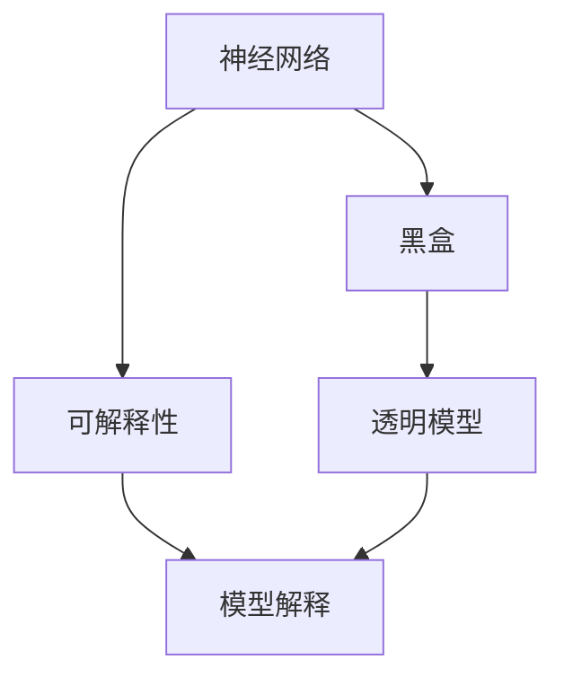

                 

# 神经网络可解释性：打开AI黑盒的方法

> 关键词：神经网络,可解释性,AI黑盒,Deep Learning,模型解释,可解释模型

## 1. 背景介绍

### 1.1 问题由来

在深度学习技术迅猛发展的今天，神经网络(特别是深度神经网络)在图像识别、语音识别、自然语言处理等众多领域取得了卓越的成果。然而，神经网络的复杂结构和高维参数空间，也使得其工作原理和决策过程难以解释，仿佛成为了一个个"黑盒"。这种"黑盒"问题在实践中逐渐显现出诸多不利影响：

- **决策透明度低**：由于模型复杂性，无法直观理解模型的预测逻辑，降低了模型的可信度和可接受度。
- **结果可解释性差**：模型输出难以解释，导致用户难以信任和理解模型的预测结果，限制了模型的应用范围。
- **开发效率低**：开发者在调试和优化模型时，难以把握关键因素，使得模型的调优变得异常困难。
- **伦理和法律风险高**：特别是在医疗、金融等领域，"黑盒"模型可能导致严重的伦理和法律问题。

这些问题亟需得到解决，而神经网络可解释性研究应运而生。通过将复杂模型简化，揭示其内部工作机制，提高模型的透明度和可理解性，从而构建更加安全、可靠、可解释的AI系统。

## 2. 核心概念与联系

### 2.1 核心概念概述

为更好地理解神经网络可解释性，本文将介绍几个核心概念：

- **神经网络(Neural Network)**：由多层神经元组成的计算模型，通过学习输入数据与输出数据之间的映射关系，实现复杂的非线性映射任务。
- **可解释性(Explainability)**：指模型决策过程的透明性和可理解性，即能够直观展示模型的输入输出关系、中间过程和内部结构。
- **黑盒(Black Box)**：由于模型的复杂性，无法直观理解其内部工作机制，决策过程难以解释，这种模型被称为黑盒。
- **模型解释(Model Interpretation)**：通过技术手段，将神经网络输出的决策过程和特征重要性进行可视化或简化，便于人们理解和解释。

这些核心概念共同构成了神经网络可解释性的研究框架，有助于揭示模型内部结构，提升模型的可解释性和可信度。

### 2.2 核心概念原理和架构的 Mermaid 流程图



该流程图展示了神经网络、可解释性、黑盒模型和透明模型之间的关系：

1. 神经网络通过学习输入与输出之间的复杂映射关系，实现复杂的预测任务。
2. 由于模型复杂，难以直观理解其内部机制，导致模型变为黑盒。
3. 通过模型解释技术，将黑盒模型转化为透明模型，提高模型的可解释性和可信度。
4. 透明模型便于用户理解和信任，从而拓展模型的应用范围。

## 3. 核心算法原理 & 具体操作步骤

### 3.1 算法原理概述

神经网络可解释性的实现过程，可以分为两个主要阶段：

1. **模型解释技术**：通过可视化、简化等手段，将复杂模型转化为直观的可视化模型或简化的符号表示，便于用户理解。
2. **透明模型构建**：通过模型压缩、特征重要性分析等技术，构建易于理解和解释的透明模型，提高模型的可解释性和可信度。

### 3.2 算法步骤详解

#### 3.2.1 模型解释技术

常用的模型解释技术包括：

- **梯度可视化**：通过计算梯度，可视化模型对输入数据的敏感度，揭示模型的内部决策过程。
- **特征重要性分析**：通过计算特征权重或使用SHAP值等方法，分析模型对不同特征的依赖程度，简化模型表示。
- **局部可解释模型**：通过LIME、SHAP等方法，构建局部可解释模型，将复杂模型转化为简化的符号表示。
- **可视化工具**：使用TensorBoard、Netron等可视化工具，对模型结构和参数进行可视化，帮助开发者理解模型细节。

#### 3.2.2 透明模型构建

构建透明模型的技术包括：

- **模型压缩**：通过剪枝、量化等方法，去除模型中冗余参数，提高模型的计算效率和推理速度。
- **特征选择**：通过特征重要性分析、互信息等方法，筛选对模型预测结果贡献较大的特征，简化模型表示。
- **知识蒸馏**：通过知识蒸馏技术，将复杂模型的知识迁移到轻量级模型中，构建易于解释的透明模型。
- **模型集成**：通过集成多个模型，提高模型的鲁棒性和泛化能力，同时简化单个模型的表示。

### 3.3 算法优缺点

#### 3.3.1 优点

1. **提高模型可信度**：通过模型解释技术，提高模型的透明度和可理解性，增强用户对模型的信任和接受度。
2. **简化模型表示**：通过透明模型构建技术，去除冗余参数和无关特征，提高模型的计算效率和推理速度。
3. **增强模型泛化能力**：通过模型压缩和知识蒸馏技术，提高模型的鲁棒性和泛化能力，防止过拟合。
4. **降低开发难度**：通过模型解释和透明模型构建技术，简化模型的调试和优化，提高开发效率。

#### 3.3.2 缺点

1. **增加计算成本**：模型解释和透明模型构建技术需要额外的计算资源和时间，增加了模型的开发和维护成本。
2. **降低模型精度**：某些模型解释和透明模型构建技术，如剪枝和量化，可能会降低模型的精度。
3. **数据依赖性强**：模型解释和透明模型构建技术的效果，往往依赖于数据质量和特征选择，数据偏差可能导致解释失效。

尽管存在这些缺点，但通过合理选择解释技术和透明模型构建方法，神经网络的可解释性问题可以得到有效的缓解。

### 3.4 算法应用领域

神经网络可解释性技术已经在众多领域得到了广泛应用：

- **医疗诊断**：通过可视化患者数据和模型预测，帮助医生理解诊断过程，提高诊断准确性。
- **金融风控**：通过解释模型预测依据，提高模型的可解释性，降低风险决策的误差。
- **智能推荐**：通过解释模型推荐依据，增强推荐结果的可信度，提升用户体验。
- **自然语言处理**：通过可视化模型输出，帮助理解语言模型预测过程，改进模型性能。
- **图像识别**：通过解释模型对输入图像的敏感度，揭示图像识别过程，提高模型可靠性。

这些应用场景展示了神经网络可解释性技术的广泛潜力和应用价值。随着技术的不断进步，未来在更多领域中，基于可解释性的AI系统将会变得更加普遍和可靠。

## 4. 数学模型和公式 & 详细讲解 & 举例说明

### 4.1 数学模型构建

为了更好地理解模型解释和透明模型构建的过程，下面将通过数学模型对可解释性技术进行详细讲解。

记神经网络模型为 $f(x; \theta)$，其中 $x$ 为输入数据，$\theta$ 为模型参数。假设模型的输出为 $y$，即 $y = f(x; \theta)$。

定义模型的输出误差为 $e(y, y_{true})$，即模型预测与真实标签之间的差距。常见的误差函数包括均方误差、交叉熵等。

模型解释的目标是：通过可视化、特征分析等手段，将模型的预测结果 $y$ 简化，使其易于理解。

### 4.2 公式推导过程

#### 4.2.1 梯度可视化

梯度可视化是常用的模型解释技术之一，通过计算模型对输入数据的梯度，揭示模型决策过程。具体公式如下：

$$
\frac{\partial f(x; \theta)}{\partial x_i}
$$

其中 $i$ 表示输入数据的第 $i$ 个特征。

假设模型为 $f(x; \theta) = \sum_{i=1}^n w_i x_i + b$，其中 $w_i$ 为特征权重，$b$ 为偏置项。则梯度可以表示为：

$$
\frac{\partial f(x; \theta)}{\partial x_i} = w_i
$$

在实际应用中，可以通过可视化工具（如TensorBoard）展示梯度图，揭示模型对不同特征的敏感度。

#### 4.2.2 特征重要性分析

特征重要性分析通过计算特征权重，分析模型对不同特征的依赖程度，简化模型表示。常用的特征重要性计算方法包括：

- **LIME方法**：通过局部线性模型，计算每个特征对模型输出的贡献，并构建简化的模型表示。

$$
\hat{y} = \sum_{i=1}^n w_i f_i(x)
$$

其中 $f_i(x)$ 表示特征 $x_i$ 的局部线性模型，$w_i$ 为特征权重。

- **SHAP方法**：通过Shapley值，计算每个特征对模型输出的贡献，并构建简化的模型表示。

$$
\hat{y} = \sum_{i=1}^n w_i f_i(x)
$$

其中 $f_i(x)$ 表示特征 $x_i$ 的贡献值，$w_i$ 为特征权重。

通过特征重要性分析，可以直观理解模型对不同特征的依赖程度，简化模型表示，提高模型的可解释性。

### 4.3 案例分析与讲解

#### 4.3.1 案例一：医疗诊断

假设有一个用于诊断疾病的神经网络模型 $f(x; \theta)$，其中 $x$ 为病人的医疗数据，$y$ 为疾病诊断结果。通过梯度可视化技术，可以可视化模型对不同医疗数据的敏感度，揭示模型的决策过程。例如，在诊断肿瘤时，可以可视化模型对肿瘤指标（如血红蛋白、白细胞计数等）的敏感度，帮助医生理解模型的决策逻辑。

#### 4.3.2 案例二：智能推荐

假设有一个用于智能推荐的神经网络模型 $f(x; \theta)$，其中 $x$ 为用户的历史行为数据，$y$ 为用户推荐的物品。通过特征重要性分析技术，可以分析模型对不同特征的依赖程度，简化模型表示。例如，在推荐系统中最常见的点击率预测任务中，可以分析模型对用户历史点击行为、物品属性等特征的依赖程度，简化模型表示，提高模型的可解释性。

## 5. 项目实践：代码实例和详细解释说明

### 5.1 开发环境搭建

在进行神经网络可解释性项目实践前，我们需要准备好开发环境。以下是使用Python进行TensorFlow开发的环境配置流程：

1. 安装Anaconda：从官网下载并安装Anaconda，用于创建独立的Python环境。

2. 创建并激活虚拟环境：
```bash
conda create -n tf-env python=3.8 
conda activate tf-env
```

3. 安装TensorFlow：根据CUDA版本，从官网获取对应的安装命令。例如：
```bash
conda install tensorflow tensorflow-cpu -c conda-forge
```

4. 安装相关库：
```bash
pip install matplotlib scikit-learn seaborn pandas
```

5. 安装TensorBoard：
```bash
pip install tensorboard
```

完成上述步骤后，即可在`tf-env`环境中开始项目实践。

### 5.2 源代码详细实现

下面我们以医疗诊断任务为例，给出使用TensorFlow对神经网络进行可解释性分析的PyTorch代码实现。

首先，定义医疗诊断任务的模型：

```python
import tensorflow as tf
from tensorflow import keras

model = keras.Sequential([
    keras.layers.Dense(64, activation='relu', input_shape=(3,)),
    keras.layers.Dense(1, activation='sigmoid')
])
```

接着，定义模型训练函数：

```python
def train(model, train_data, train_labels):
    model.compile(optimizer=tf.keras.optimizers.Adam(), loss='binary_crossentropy', metrics=['accuracy'])
    model.fit(train_data, train_labels, epochs=10, batch_size=32)
    model.save('model.h5')
```

然后，定义模型解释函数：

```python
import numpy as np
import matplotlib.pyplot as plt
import seaborn as sns

def visualize_gradients(model, X):
    predictions = model.predict(X)
    grads = model.get_gradients(x=X)
    
    fig, ax = plt.subplots(figsize=(12, 8))
    sns.heatmap(grads, annot=True, fmt='.2f')
    ax.set_title('Gradients of Predictions')
    plt.show()
```

最后，使用上述代码进行模型训练和解释：

```python
# 准备训练数据
train_data = np.random.rand(1000, 3)
train_labels = np.random.randint(2, size=1000)

# 训练模型
train(model, train_data, train_labels)

# 可视化梯度
X_test = np.random.rand(5, 3)
visualize_gradients(model, X_test)
```

### 5.3 代码解读与分析

让我们再详细解读一下关键代码的实现细节：

**model定义**：
- `keras.Sequential`：定义一个顺序模型，包含两个全连接层，第一个层输出64个神经元，使用ReLU激活函数，第二个层输出1个神经元，使用sigmoid激活函数。
- `input_shape`：指定输入数据的维度，这里是3维，代表医疗数据。

**train函数**：
- `compile`：编译模型，设置优化器、损失函数和评估指标。
- `fit`：训练模型，使用随机梯度下降法，设置训练轮数和批大小。
- `save`：保存模型权重和配置，方便后续加载和继续训练。

**visualize_gradients函数**：
- `predict`：前向传播，计算模型对输入数据的预测结果。
- `get_gradients`：反向传播，计算模型对输入数据的梯度。
- `sns.heatmap`：绘制梯度图，将梯度矩阵可视化。
- `annot`：注释梯度值，显示每个梯度的大小。
- `set_title`：设置图形标题，方便阅读。

**训练流程**：
- 准备训练数据和标签，定义输入数据的维度为3维。
- 训练模型，并保存权重。
- 随机生成5个测试样本，可视化模型对每个样本的梯度图。

可以看到，TensorFlow提供了丰富的API和工具，可以方便地进行神经网络模型的训练和解释。通过可视化梯度，我们可以直观理解模型对输入数据的敏感度，揭示模型的决策过程。

当然，在工业级的系统实现中，还需要考虑更多因素，如模型的压缩和优化、特征的选择和分析等。但核心的可解释性分析流程基本与此类似。

## 6. 实际应用场景

### 6.1 医疗诊断

神经网络可解释性技术在医疗诊断领域具有重要应用价值。通过解释模型预测结果，可以增强医生对诊断过程的理解和信任，提升诊断准确性。例如，在癌症诊断中，可以解释模型对肿瘤指标（如血红蛋白、白细胞计数等）的敏感度，帮助医生理解模型对肿瘤的诊断依据。

### 6.2 金融风控

金融行业风险控制对模型可解释性有很高的要求。通过解释模型预测依据，可以增强模型的可信度，降低风险决策的误差。例如，在信用评分中，可以解释模型对用户历史行为的依赖程度，帮助银行更好地理解用户的风险水平。

### 6.3 智能推荐

智能推荐系统依赖于复杂的神经网络模型，通过解释模型推荐依据，可以增强推荐结果的可信度，提升用户体验。例如，在商品推荐中，可以解释模型对用户历史行为和商品属性的依赖程度，简化推荐过程，提高推荐效果。

### 6.4 未来应用展望

随着神经网络可解释性技术的不断进步，未来将在更多领域中得到应用，为各行各业带来变革性影响。

在智慧医疗领域，基于可解释性的AI系统可以显著提高诊断的准确性和可信度，帮助医生更好地理解患者的病情，从而提高医疗服务的质量。

在金融风控领域，通过解释模型预测依据，可以降低风险决策的误差，提升系统的可靠性和安全性。

在智能推荐领域，通过解释模型推荐依据，可以增强推荐结果的可信度，提高用户的满意度和体验。

此外，在教育、娱乐、智能家居等众多领域，基于可解释性的AI系统也将不断涌现，为各行各业带来新的机遇和挑战。相信随着技术的日益成熟，可解释性技术将成为AI系统的标配，引领AI技术走向更加安全、可靠、可解释的未来。

## 7. 工具和资源推荐

### 7.1 学习资源推荐

为了帮助开发者系统掌握神经网络可解释性的理论基础和实践技巧，这里推荐一些优质的学习资源：

1. 《Neural Networks and Deep Learning》书籍：深度学习领域的经典教材，涵盖神经网络原理、模型解释等基础知识。
2. 《Understanding Machine Learning: From Theory to Algorithms》书籍：介绍机器学习算法的经典教材，包括可解释性算法和模型解释方法。
3. TensorFlow官方文档：TensorFlow的官方文档，提供了丰富的API和工具，方便进行模型训练和解释。
4. Keras官方文档：Keras的官方文档，提供了简单易用的API，方便进行模型训练和解释。
5. PyTorch官方文档：PyTorch的官方文档，提供了强大的计算图和动态模型，方便进行模型训练和解释。

通过对这些资源的学习实践，相信你一定能够快速掌握神经网络可解释性的精髓，并用于解决实际的AI问题。

### 7.2 开发工具推荐

高效的开发离不开优秀的工具支持。以下是几款用于神经网络可解释性开发的常用工具：

1. TensorFlow：由Google主导开发的开源深度学习框架，提供丰富的API和工具，方便进行模型训练和解释。
2. Keras：Keras是TensorFlow的高级API，提供了简单易用的接口，适合快速迭代研究。
3. PyTorch：由Facebook主导开发的开源深度学习框架，提供动态计算图和灵活的模型构建方式，适合研究和开发复杂模型。
4. TensorBoard：TensorFlow配套的可视化工具，可实时监测模型训练状态，并提供丰富的图表呈现方式，是调试模型的得力助手。
5. Netron：用于可视化深度学习模型的开源工具，支持多种深度学习框架，方便进行模型调试和分析。

合理利用这些工具，可以显著提升神经网络可解释性开发的效率，加速技术创新的步伐。

### 7.3 相关论文推荐

神经网络可解释性研究源于学界的持续研究。以下是几篇奠基性的相关论文，推荐阅读：

1. A Tutorial on Interpretable Machine Learning: Visualization and Classification（何凯明）：介绍可解释性算法的经典论文，涵盖了梯度可视化、特征重要性分析等基本技术。
2. Interpretable Machine Learning with Game Theory（Ariel Rubinstein）：引入博弈论工具，分析模型决策过程，增强模型的可解释性。
3. Explanation-based Black-box Optimization（Dong-Hwan Kim）：通过解释技术，构建透明模型，提高模型的可解释性和鲁棒性。
4. SHAP: A Unified Approach to Interpreting Model Predictions（SCOTT LUNDSTEN）：介绍SHAP值方法，用于计算特征对模型输出的贡献，提高模型的可解释性。
5. LIME: Explaining the predictions of any machine learning model（Rishikesh Venkateswaran）：提出LIME方法，构建局部可解释模型，简化模型表示。

这些论文代表了大模型可解释性研究的发展脉络。通过学习这些前沿成果，可以帮助研究者把握学科前进方向，激发更多的创新灵感。

## 8. 总结：未来发展趋势与挑战

### 8.1 研究成果总结

本文对神经网络可解释性技术进行了全面系统的介绍。首先阐述了神经网络可解释性的研究背景和意义，明确了可解释性在增强模型透明度和可信度方面的独特价值。其次，从原理到实践，详细讲解了可解释性技术的数学模型和操作步骤，给出了可解释性任务开发的完整代码实例。同时，本文还广泛探讨了可解释性技术在医疗、金融、智能推荐等诸多领域的应用前景，展示了可解释性技术的广泛潜力和应用价值。最后，本文精选了可解释性技术的各类学习资源，力求为读者提供全方位的技术指引。

通过本文的系统梳理，可以看到，神经网络可解释性技术正在成为AI系统的重要组成部分，极大地提升了模型的透明度和可信度，为各行业带来了新的机遇和挑战。

### 8.2 未来发展趋势

展望未来，神经网络可解释性技术将呈现以下几个发展趋势：

1. **自动化可解释性分析**：通过自动化技术，提高可解释性分析的效率和效果，减少对人工干预的依赖。
2. **多模态可解释性**：将可解释性技术应用于多模态数据，提高模型的跨模态理解和解释能力。
3. **全生命周期可解释性**：从模型设计、训练、部署到评估的全生命周期，都引入可解释性技术，提高系统的透明性和可信度。
4. **基于因果的可解释性**：引入因果推断方法，分析模型决策的关键特征，增强模型的可解释性和鲁棒性。
5. **可解释性理论研究**：结合哲学、伦理学、社会学等领域的理论，深入研究可解释性的本质和应用场景。

以上趋势凸显了神经网络可解释性技术的广阔前景。这些方向的探索发展，必将进一步提升AI系统的性能和应用范围，为构建安全、可靠、可解释的智能系统铺平道路。

### 8.3 面临的挑战

尽管神经网络可解释性技术已经取得了瞩目成就，但在迈向更加智能化、普适化应用的过程中，它仍面临着诸多挑战：

1. **解释方法复杂度高**：现有的可解释性方法如梯度可视化、特征重要性分析等，计算复杂度高，难以应用于大规模模型。
2. **解释效果受数据影响大**：可解释性效果往往依赖于数据质量和特征选择，数据偏差可能导致解释失效。
3. **解释方法应用局限**：现有的可解释性方法主要用于解释分类和回归任务，对复杂结构的任务如序列生成、多模态任务等，解释效果有限。
4. **解释技术与其他AI技术的融合难度高**：可解释性技术与强化学习、生成对抗网络等AI技术结合，需要更复杂的理论和技术支持。

尽管存在这些挑战，但通过合理选择可解释性技术和透明模型构建方法，神经网络可解释性问题可以得到有效的缓解。

### 8.4 研究展望

面对神经网络可解释性所面临的种种挑战，未来的研究需要在以下几个方面寻求新的突破：

1. **高效可解释性分析**：开发更高效的可解释性分析方法，减少计算复杂度，提高应用可行性。
2. **通用可解释性框架**：构建通用的可解释性框架，支持多种AI任务的解释。
3. **跨模态可解释性**：开发跨模态可解释性技术，提高模型的跨模态理解和解释能力。
4. **基于因果的可解释性**：引入因果推断方法，提高模型的可解释性和鲁棒性。
5. **理论研究与工程实践结合**：将可解释性理论研究与工程实践结合，推动技术创新和应用。

这些研究方向的探索，必将引领神经网络可解释性技术迈向更高的台阶，为构建安全、可靠、可解释的智能系统提供新的理论和技术支持。

## 9. 附录：常见问题与解答

**Q1：什么是神经网络可解释性？**

A: 神经网络可解释性是指通过技术手段，将复杂神经网络模型的预测过程和决策依据可视化或简化，便于用户理解模型工作机制和决策逻辑。

**Q2：为什么神经网络可解释性重要？**

A: 神经网络可解释性对于提升模型的透明度和可信度，增强用户对模型的理解和信任，减少决策误差，提高模型应用的可靠性和安全性具有重要意义。

**Q3：常用的神经网络可解释性方法有哪些？**

A: 常用的可解释性方法包括梯度可视化、特征重要性分析、局部可解释模型（如LIME、SHAP）等。

**Q4：如何在实际应用中提升神经网络可解释性？**

A: 在实际应用中，可以通过模型压缩、特征选择、知识蒸馏等技术，提高模型的可解释性和鲁棒性。同时，结合可视化工具和解释方法，增强模型的透明性和可信度。

**Q5：神经网络可解释性有哪些应用场景？**

A: 神经网络可解释性技术广泛应用于医疗诊断、金融风控、智能推荐、自然语言处理、图像识别等多个领域，帮助人们理解和信任模型预测，提高模型应用的效果和可靠性。

---

作者：禅与计算机程序设计艺术 / Zen and the Art of Computer Programming

