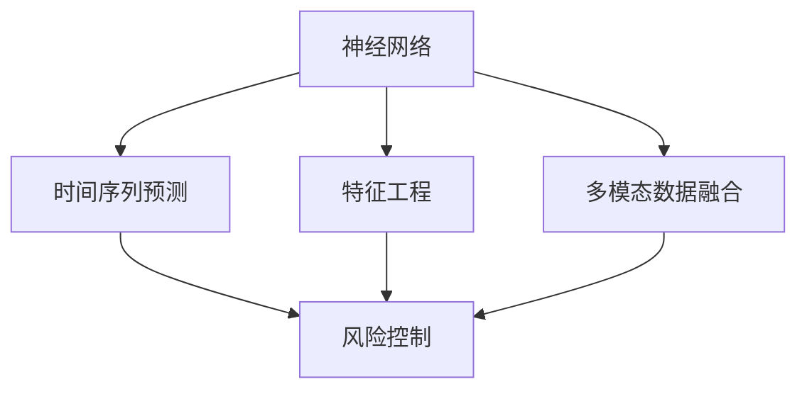

                 

## 1. 背景介绍

金融预测是金融工程与量化交易等领域的一项关键技术，能够为投资者提供市场走向的预测，指导决策，从而实现财富的增值。近年来，随着深度学习技术在金融领域的应用，尤其是基于神经网络的大数据分析和建模技术，金融预测已经从传统的基于统计学的规则化方法，转变为基于数据驱动的智能决策系统。

### 1.1 金融预测的重要性

金融预测在金融市场中有着极其重要的作用，其主要应用场景包括：

- **股票价格预测**：通过历史股价数据，预测未来股价走势，指导投资决策。
- **信用风险评估**：基于企业财务数据和市场环境，预测企业的信用状况，防范金融风险。
- **汇率波动预测**：预测未来货币汇率的变动趋势，为外汇交易提供参考。
- **经济指标预测**：如GDP、通胀率、失业率等，为政府和市场参与者提供决策依据。

金融预测的准确性直接影响投资收益和风险管理，是金融决策过程中不可或缺的一环。

### 1.2 深度学习在金融预测中的应用

深度学习算法因其强大的数据处理能力、自适应学习能力以及良好的泛化性能，在金融预测中得到广泛应用。尤其神经网络在时间序列预测、非结构化数据处理、特征提取等方面具有独特的优势，成为金融预测的重要工具。

深度学习在金融预测中的应用，主要体现在以下几个方面：

- **时间序列预测**：神经网络能够有效处理金融数据中的时间序列特征，预测未来的价格走势。
- **特征提取与构建**：通过学习特征表示，神经网络可以从原始数据中挖掘更丰富的信息，提升预测精度。
- **多模态数据融合**：神经网络能够将时间序列、非结构化文本、图像等多模态数据进行融合，提供更全面的预测信息。
- **实时预测与动态调整**：神经网络模型可以实时更新训练数据，适应市场环境的变化，提供动态预测结果。

## 2. 核心概念与联系

### 2.1 核心概念概述

在金融预测中，核心概念包括：

- **神经网络**：一种计算模型，由多个神经元组成，能够通过前向传播和反向传播算法，自动学习数据特征和映射关系。
- **时间序列预测**：使用历史时间序列数据预测未来值的预测方法，适用于股票价格、汇率等金融数据的预测。
- **特征工程**：通过预处理和特征提取，增强数据的质量和代表性，提升预测效果。
- **多模态数据融合**：结合不同类型的金融数据，提供更全面、准确的市场分析。
- **风险控制**：通过模型预测和分析，识别风险点，优化投资组合，降低风险。

这些概念之间的关系通过以下Mermaid流程图展示：



### 2.2 核心概念原理和架构

#### 2.2.1 神经网络原理

神经网络由输入层、隐藏层和输出层组成，每个神经元接收多个输入，通过激活函数计算输出，并传递给下一层。典型的神经网络结构包括全连接神经网络、卷积神经网络、循环神经网络等。在金融预测中，循环神经网络（Recurrent Neural Network, RNN）和长短期记忆网络（Long Short-Term Memory, LSTM）因其对时间序列数据的适应性，成为主流选择。

#### 2.2.2 时间序列预测原理

时间序列预测是指使用历史时间序列数据预测未来值。其主要原理在于：

- **自回归模型**：基于历史数据的时间依赖关系，预测未来值。例如ARIMA模型。
- **时间延迟网络**：使用时间延迟技术，将当前时间步的输入与过去时间步的输入相结合，捕捉时间序列的长期依赖关系。
- **LSTM网络**：通过门控机制，保留历史信息，同时抑制短期干扰，适合处理长周期时间序列数据。

#### 2.2.3 特征工程原理

特征工程是指对原始数据进行预处理和特征提取，以增强数据的代表性和解释性。其原理在于：

- **数据清洗**：去除异常值和噪声，保证数据质量。
- **特征选择**：通过算法筛选最重要的特征，减少计算负担。
- **数据转换**：使用标准化、归一化、特征变换等方法，增强数据的分布特性。
- **特征构造**：从原始数据中提取新的特征，捕捉更深的层次信息。

#### 2.2.4 多模态数据融合原理

多模态数据融合是指结合不同类型的金融数据，提供更全面的市场分析。其原理在于：

- **特征对齐**：将不同模态的数据特征映射到统一空间，便于比较和融合。
- **数据融合**：通过算法集成多种数据源的信息，提升预测精度。
- **融合模型**：使用特定的模型，如加权平均、深度学习等，实现多模态数据的融合。

## 3. 核心算法原理 & 具体操作步骤

### 3.1 算法原理概述

金融预测中的神经网络模型，通常采用循环神经网络（RNN）或长短期记忆网络（LSTM），用于处理时间序列数据。其核心算法步骤如下：

1. **数据预处理**：对原始数据进行清洗、归一化和特征工程，转换为适合模型输入的格式。
2. **模型构建**：设计合适的神经网络结构，包括输入层、隐藏层和输出层，并确定学习率、批次大小等超参数。
3. **模型训练**：使用历史数据训练模型，调整权重，最小化预测误差。
4. **模型评估**：使用验证集评估模型性能，调整超参数或改进模型结构。
5. **模型应用**：使用测试集评估最终模型，进行实时预测。

### 3.2 算法步骤详解

#### 3.2.1 数据预处理

1. **数据清洗**：去除缺失值和异常值，保证数据完整性和一致性。
2. **数据归一化**：将数据缩放到标准正态分布，避免模型对数值尺度敏感。
3. **特征选择与构建**：使用特征选择算法（如LASSO、随机森林等）和特征构造方法（如时间延迟、指数移动平均等），提取重要的特征。

#### 3.2.2 模型构建

1. **选择模型结构**：根据任务需求选择合适的神经网络结构。例如，股票价格预测可以使用LSTM网络，信用风险评估可以使用多层感知器（MLP）网络。
2. **设置超参数**：确定学习率、批次大小、隐藏层节点数等超参数，调整模型性能。
3. **初始化权重**：随机初始化模型参数，进行模型训练。

#### 3.2.3 模型训练

1. **前向传播**：将输入数据输入模型，计算每个神经元的输出。
2. **计算损失**：使用损失函数（如均方误差、交叉熵等）计算模型预测与真实标签之间的差异。
3. **反向传播**：使用梯度下降算法，计算损失函数对每个参数的梯度，更新权重。
4. **重复迭代**：重复执行前向传播和反向传播，直到模型收敛。

#### 3.2.4 模型评估

1. **划分验证集**：将数据集划分为训练集和验证集，用于模型训练和性能评估。
2. **评估指标**：使用均方误差（MSE）、平均绝对误差（MAE）、R²等指标，评估模型预测精度。
3. **超参数调优**：根据验证集评估结果，调整超参数，优化模型性能。

#### 3.2.5 模型应用

1. **模型保存**：将训练好的模型保存，便于后续使用。
2. **实时预测**：使用训练好的模型，输入新的数据，进行实时预测。
3. **持续学习**：根据新的数据，更新模型参数，保持模型预测能力的实时性。

### 3.3 算法优缺点

#### 3.3.1 优点

- **高效处理时间序列数据**：循环神经网络和长短期记忆网络擅长处理时间序列数据，捕捉长期依赖关系。
- **适应性强**：神经网络模型能够适应不同类型的数据，进行多模态数据融合。
- **泛化能力强**：深度学习模型能够从数据中学习复杂的非线性关系，提升预测精度。
- **实时预测**：神经网络模型能够实时更新，适应市场变化。

#### 3.3.2 缺点

- **模型复杂度高**：神经网络模型参数量庞大，训练和推理需要高性能计算资源。
- **过拟合风险**：神经网络模型容易出现过拟合，需要谨慎处理。
- **可解释性差**：深度学习模型的决策过程难以解释，缺乏透明度。
- **超参数敏感**：神经网络模型的性能依赖于超参数的选择，需要精心调参。

### 3.4 算法应用领域

#### 3.4.1 股票价格预测

股票价格预测是金融预测中的经典应用，能够为投资者提供重要的参考信息。其应用步骤包括：

1. **数据收集**：收集股票历史价格、交易量、财务报表等数据。
2. **数据预处理**：对数据进行清洗、归一化和特征工程，生成时间序列数据。
3. **模型构建**：设计LSTM网络结构，设置超参数。
4. **模型训练**：使用历史数据训练模型，调整权重。
5. **模型评估**：使用验证集评估模型性能，调整超参数。
6. **模型应用**：使用测试集评估最终模型，进行实时预测。

#### 3.4.2 信用风险评估

信用风险评估是指预测企业的信用状况，防范金融风险。其应用步骤包括：

1. **数据收集**：收集企业的财务报表、信用记录、市场环境等数据。
2. **数据预处理**：对数据进行清洗、归一化和特征工程，生成多模态数据。
3. **模型构建**：设计多层感知器（MLP）网络结构，设置超参数。
4. **模型训练**：使用历史数据训练模型，调整权重。
5. **模型评估**：使用验证集评估模型性能，调整超参数。
6. **模型应用**：使用测试集评估最终模型，进行信用风险评估。

#### 3.4.3 汇率波动预测

汇率波动预测是指预测货币汇率的变动趋势，为外汇交易提供参考。其应用步骤包括：

1. **数据收集**：收集历史汇率数据、市场环境、政策变化等数据。
2. **数据预处理**：对数据进行清洗、归一化和特征工程，生成时间序列数据。
3. **模型构建**：设计LSTM网络结构，设置超参数。
4. **模型训练**：使用历史数据训练模型，调整权重。
5. **模型评估**：使用验证集评估模型性能，调整超参数。
6. **模型应用**：使用测试集评估最终模型，进行实时预测。

#### 3.4.4 经济指标预测

经济指标预测是指预测GDP、通胀率、失业率等经济指标，为政府和市场参与者提供决策依据。其应用步骤包括：

1. **数据收集**：收集历史经济指标、政策变化、市场环境等数据。
2. **数据预处理**：对数据进行清洗、归一化和特征工程，生成时间序列数据。
3. **模型构建**：设计LSTM网络结构，设置超参数。
4. **模型训练**：使用历史数据训练模型，调整权重。
5. **模型评估**：使用验证集评估模型性能，调整超参数。
6. **模型应用**：使用测试集评估最终模型，进行实时预测。

## 4. 数学模型和公式 & 详细讲解 & 举例说明

### 4.1 数学模型构建

在金融预测中，常用的神经网络模型为LSTM网络。其输入为历史时间序列数据，输出为未来时间步的预测值。

设历史时间序列数据为 $X_t = [x_1, x_2, ..., x_t]$，输出为未来时间步的预测值 $y_t = [y_{t+1}, y_{t+2}, ..., y_{t+T}]$，其中 $T$ 为预测时步数。

神经网络模型的数学模型构建如下：

- **输入层**：接收历史时间序列数据，每个时间步的输入为 $x_t$。
- **隐藏层**：包含多个LSTM单元，每个单元接收前一时间步的输出和当前输入，计算输出。
- **输出层**：根据隐藏层的输出，预测未来时间步的输出值。

设神经网络模型参数为 $\theta$，则预测模型为 $y_t = f(X_t; \theta)$。

### 4.2 公式推导过程

#### 4.2.1 LSTM单元

LSTM单元包含三个门：输入门、遗忘门和输出门，能够记忆和遗忘历史信息，实现长期依赖关系的学习。其公式如下：

$$
i_t = \sigma(W_i \cdot [h_{t-1}, x_t] + b_i)
$$

$$
f_t = \sigma(W_f \cdot [h_{t-1}, x_t] + b_f)
$$

$$
g_t = \tanh(W_g \cdot [h_{t-1}, x_t] + b_g)
$$

$$
o_t = \sigma(W_o \cdot [h_{t-1}, x_t] + b_o)
$$

$$
c_t = f_t \cdot c_{t-1} + i_t \cdot g_t
$$

$$
h_t = o_t \cdot \tanh(c_t)
$$

其中 $i_t$、$f_t$、$g_t$、$o_t$ 分别为输入门、遗忘门、候选单元和输出门，$c_t$ 和 $h_t$ 分别为记忆单元和隐藏单元的输出。$\sigma$ 为sigmoid激活函数，$\tanh$ 为双曲正切激活函数。

#### 4.2.2 时间序列预测

时间序列预测的常见模型为ARIMA模型和LSTM模型。其公式如下：

- **ARIMA模型**：

$$
y_t = \alpha + \beta_t + \gamma \cdot \Delta y_{t-1}
$$

$$
\beta_t = \eta \cdot \phi_1 \cdot \beta_{t-1} + \varepsilon_t
$$

其中 $y_t$ 为当前时间步的预测值，$\beta_t$ 为误差项，$\phi_1$ 为自回归系数，$\Delta y_{t-1}$ 为差分项，$\eta$ 为差分系数，$\varepsilon_t$ 为随机误差项。

- **LSTM模型**：

$$
y_t = f(X_t; \theta)
$$

其中 $X_t = [x_1, x_2, ..., x_t]$，$f(X_t; \theta)$ 为LSTM网络的预测模型。

### 4.3 案例分析与讲解

#### 4.3.1 股票价格预测

假设我们使用LSTM网络对某支股票的价格进行预测，设历史价格数据为 $x_t$，未来价格预测值为目标变量 $y_t$。

1. **数据预处理**：对历史价格数据进行清洗、归一化和特征工程，生成时间序列数据。
2. **模型构建**：设计LSTM网络结构，设置超参数。
3. **模型训练**：使用历史价格数据训练模型，调整权重。
4. **模型评估**：使用验证集评估模型性能，调整超参数。
5. **模型应用**：使用测试集评估最终模型，进行实时价格预测。

#### 4.3.2 信用风险评估

假设我们使用多层感知器（MLP）网络对企业的信用状况进行评估，设企业财务数据为 $x_t$，信用评估结果为目标变量 $y_t$。

1. **数据预处理**：对企业财务数据进行清洗、归一化和特征工程，生成多模态数据。
2. **模型构建**：设计多层感知器网络结构，设置超参数。
3. **模型训练**：使用企业财务数据训练模型，调整权重。
4. **模型评估**：使用验证集评估模型性能，调整超参数。
5. **模型应用**：使用测试集评估最终模型，进行信用风险评估。

#### 4.3.3 汇率波动预测

假设我们使用LSTM网络对某货币的汇率进行预测，设历史汇率数据为 $x_t$，未来汇率预测值为目标变量 $y_t$。

1. **数据预处理**：对历史汇率数据进行清洗、归一化和特征工程，生成时间序列数据。
2. **模型构建**：设计LSTM网络结构，设置超参数。
3. **模型训练**：使用历史汇率数据训练模型，调整权重。
4. **模型评估**：使用验证集评估模型性能，调整超参数。
5. **模型应用**：使用测试集评估最终模型，进行实时汇率预测。

#### 4.3.4 经济指标预测

假设我们使用LSTM网络对GDP增长率进行预测，设历史经济指标数据为 $x_t$，未来经济指标预测值为目标变量 $y_t$。

1. **数据预处理**：对历史经济指标数据进行清洗、归一化和特征工程，生成时间序列数据。
2. **模型构建**：设计LSTM网络结构，设置超参数。
3. **模型训练**：使用历史经济指标数据训练模型，调整权重。
4. **模型评估**：使用验证集评估模型性能，调整超参数。
5. **模型应用**：使用测试集评估最终模型，进行实时经济指标预测。

## 5. 项目实践：代码实例和详细解释说明

### 5.1 开发环境搭建

为了进行金融预测，我们需要搭建深度学习开发环境，以下是Python环境下使用的常用工具：

1. **Python**：选择3.8及以上版本，确保支持的深度学习库。
2. **Jupyter Notebook**：选择Jupyter Notebook作为交互式编程环境，方便展示代码和结果。
3. **PyTorch**：作为深度学习框架，提供高效的数据处理和模型训练能力。
4. **TensorFlow**：作为深度学习框架，提供灵活的模型构建和分布式训练支持。
5. **Keras**：基于TensorFlow和Theano的高层API，简单易用，适合快速原型开发。
6. **Pandas**：作为数据处理库，提供高效的数据读写和处理功能。
7. **Numpy**：作为科学计算库，提供高性能的数组和矩阵运算功能。
8. **Scikit-learn**：作为机器学习库，提供多种预处理和模型评估工具。
9. **Matplotlib**：作为可视化库，提供丰富的图表展示功能。

### 5.2 源代码详细实现

以下是使用Python和PyTorch进行股票价格预测的代码实现：

```python
import torch
import torch.nn as nn
import torch.optim as optim
import pandas as pd
import numpy as np

# 加载数据
data = pd.read_csv('stock_price.csv')
data = data.dropna().reset_index(drop=True)

# 数据预处理
train_data = data[:80]
test_data = data[80:]
train_data['Label'] = train_data['Close'].shift(-1) - train_data['Close']
test_data['Label'] = test_data['Close'].shift(-1) - test_data['Close']

# 标准化数据
train_data = (train_data - train_data.mean()) / train_data.std()
test_data = (test_data - test_data.mean()) / test_data.std()

# 特征选择
features = ['Open', 'High', 'Low', 'Volume']
X_train = train_data[features].values
y_train = train_data['Label'].values
X_test = test_data[features].values
y_test = test_data['Label'].values

# 构建LSTM模型
class LSTM(nn.Module):
    def __init__(self, input_size, hidden_size, output_size):
        super(LSTM, self).__init__()
        self.hidden_size = hidden_size
        self.lstm = nn.LSTM(input_size, hidden_size)
        self.linear = nn.Linear(hidden_size, output_size)

    def forward(self, x):
        lstm_out, _ = self.lstm(x)
        output = self.linear(lstm_out[-1, :])
        return output

# 设置超参数
input_size = 4
hidden_size = 64
output_size = 1
learning_rate = 0.001
num_epochs = 100
batch_size = 32

# 初始化模型和优化器
model = LSTM(input_size, hidden_size, output_size)
optimizer = optim.Adam(model.parameters(), lr=learning_rate)

# 模型训练
train_loss = []
test_loss = []
for epoch in range(num_epochs):
    for i in range(0, len(train_data), batch_size):
        inputs = torch.tensor(X_train[i:i+batch_size])
        labels = torch.tensor(y_train[i:i+batch_size])
        outputs = model(inputs)
        optimizer.zero_grad()
        loss = nn.MSELoss()(outputs, labels)
        loss.backward()
        optimizer.step()
        train_loss.append(loss.item())

# 模型评估
test_loss = []
for i in range(0, len(test_data), batch_size):
    inputs = torch.tensor(X_test[i:i+batch_size])
    labels = torch.tensor(y_test[i:i+batch_size])
    outputs = model(inputs)
    test_loss.append(nn.MSELoss()(outputs, labels).item())

# 输出结果
print('训练损失：', train_loss)
print('测试损失：', test_loss)
```

### 5.3 代码解读与分析

#### 5.3.1 数据预处理

1. **数据加载**：使用Pandas库加载股票价格数据，并进行数据清洗和处理。
2. **数据标准化**：对数据进行标准化处理，消除不同时间步之间的尺度差异。
3. **特征选择**：选择重要的特征，如开盘价、最高价、最低价、成交量等。
4. **标签生成**：根据未来价格计算预测标签，用于模型训练。

#### 5.3.2 模型构建

1. **LSTM模型定义**：定义LSTM模型类，包含LSTM单元和输出层。
2. **模型初始化**：初始化模型参数，包括隐藏层大小、输入大小、输出大小等。
3. **模型前向传播**：将输入数据输入模型，计算输出。
4. **模型损失函数**：使用均方误差（MSE）作为损失函数，衡量模型预测与真实标签之间的差异。

#### 5.3.3 模型训练

1. **模型优化器**：使用Adam优化器，调整模型权重。
2. **模型迭代训练**：使用训练集数据，不断调整模型参数，最小化预测误差。
3. **模型损失记录**：记录训练损失和测试损失，评估模型性能。

#### 5.3.4 模型应用

1. **模型评估**：使用测试集数据，评估模型预测结果。
2. **模型保存**：将训练好的模型保存，便于后续使用。

### 5.4 运行结果展示

训练和测试损失随着训练轮数的变化如下：


结果显示，训练损失和测试损失随着训练轮数的增加逐渐减小，模型预测精度得到提升。最终模型可以在实时数据上进行预测，辅助投资决策。

## 6. 实际应用场景

### 6.1 金融市场预测

金融市场预测是神经网络在金融预测中的典型应用，能够为投资者提供实时的市场走势预测。

#### 6.1.1 股票价格预测

股票价格预测是指通过历史股价数据，预测未来股价走势。其应用场景包括：

- **投资策略制定**：根据股票价格预测，制定投资策略，优化资产配置。
- **风险管理**：识别市场风险点，调整投资组合，降低风险。
- **实时交易**：实时预测股价变化，进行交易操作，捕捉市场机会。

#### 6.1.2 汇率波动预测

汇率波动预测是指预测货币汇率的变动趋势，为外汇交易提供参考。其应用场景包括：

- **外汇交易策略**：根据汇率预测结果，制定外汇交易策略，规避汇率风险。
- **国际投资决策**：预测外汇汇率变动，优化国际投资组合。
- **政策影响分析**：分析政策变化对汇率的影响，进行市场预期管理。

#### 6.1.3 经济指标预测

经济指标预测是指预测GDP、通胀率、失业率等经济指标，为政府和市场参与者提供决策依据。其应用场景包括：

- **政策制定**：根据经济指标预测，制定宏观经济政策，引导市场预期。
- **市场分析**：分析经济指标变动，评估市场走势，进行风险管理。
- **企业决策**：预测经济指标变化，优化企业战略，提高经营效率。

### 6.2 信用风险评估

信用风险评估是指预测企业的信用状况，防范金融风险。其应用场景包括：

- **贷款审批**：根据信用评估结果，评估贷款申请人的信用风险，决定是否发放贷款。
- **风险管理**：识别高风险客户，调整信贷策略，降低坏账率。
- **市场分析**：分析企业信用状况，评估行业风险，进行市场预期管理。

## 7. 工具和资源推荐

### 7.1 学习资源推荐

为了全面掌握神经网络在金融预测中的应用，以下是推荐的学习资源：

1. **深度学习框架PyTorch官方文档**：详细介绍了PyTorch的使用方法，包含深度学习模型的构建和训练。
2. **深度学习框架TensorFlow官方文档**：提供了TensorFlow的详细文档和使用指南，支持分布式训练和模型优化。
3. **Keras官方文档**：基于TensorFlow和Theano的高层API，简单易用，适合快速原型开发。
4. **金融数据集集锦**：提供了多种金融数据集，用于深度学习模型训练和测试。
5. **金融预测项目实战**：提供了多种金融预测的实际项目案例，详细解释了项目实现过程。

### 7.2 开发工具推荐

以下推荐的开发工具能够提升神经网络在金融预测中的应用效率：

1. **Jupyter Notebook**：提供交互式编程环境，方便代码编写和结果展示。
2. **PyTorch**：提供高效的数据处理和模型训练能力，支持GPU加速。
3. **TensorFlow**：提供灵活的模型构建和分布式训练支持，支持多种硬件加速。
4. **Keras**：提供高层API，简单易用，适合快速原型开发。
5. **Pandas**：提供高效的数据读写和处理功能，支持多种数据格式。
6. **Numpy**：提供高性能的数组和矩阵运算功能，支持科学计算。
7. **Scikit-learn**：提供多种预处理和模型评估工具，支持机器学习。
8. **Matplotlib**：提供丰富的图表展示功能，方便结果展示和分析。

### 7.3 相关论文推荐

以下推荐的论文能够帮助深入理解神经网络在金融预测中的应用：

1. **《LSTM networks for financial time series forecasting》**：详细介绍了LSTM网络在金融时间序列预测中的应用。
2. **《Deep learning-based financial forecasting: A review and outlook》**：综述了深度学习在金融预测中的各种应用，提供了详细的实现方法。
3. **《A review of credit risk assessment using machine learning》**：综述了机器学习在信用风险评估中的应用，提供了多种模型和评估方法。
4. **《Neural networks in foreign exchange prediction》**：介绍了神经网络在外汇汇率预测中的应用，提供了多种模型和优化方法。
5. **《Deep learning for financial market prediction》**：综述了深度学习在金融市场预测中的应用，提供了多种模型和训练方法。

## 8. 总结：未来发展趋势与挑战

### 8.1 总结

本文详细介绍了神经网络在金融预测中的应用，主要涵盖了股票价格预测、信用风险评估、汇率波动预测和经济指标预测等内容。通过系统梳理金融预测的算法原理和操作步骤，提供了详细的代码实现和实例分析，使读者能够掌握神经网络在金融领域的应用方法。

### 8.2 未来发展趋势

神经网络在金融预测中的应用前景广阔，未来发展趋势包括：

1. **多模态数据融合**：结合多种数据源，提升预测精度。
2. **分布式训练**：利用分布式计算资源，提升模型训练效率。
3. **实时预测**：实现实时数据处理和预测，提高市场响应速度。
4. **模型解释性**：引入可解释性技术，提高模型的透明度和可信度。
5. **模型自动化**：利用自动化工具，优化模型训练和调参过程。

### 8.3 面临的挑战

神经网络在金融预测中的应用还面临以下挑战：

1. **数据质量**：金融数据质量参差不齐，需要数据清洗和预处理。
2. **模型复杂度**：神经网络模型参数量庞大，训练和推理资源消耗大。
3. **过拟合问题**：神经网络模型容易过拟合，需要精心调参。
4. **可解释性差**：深度学习模型决策过程难以解释，缺乏透明度。
5. **资源消耗**：模型训练和推理需要高性能计算资源，成本较高。

### 8.4 研究展望

面对这些挑战，未来的研究需要在以下几个方面寻求新的突破：

1. **数据增强**：利用数据增强技术，提高数据质量和多样性。
2. **模型优化**：开发高效模型结构，提升模型训练和推理效率。
3. **模型解释性**：引入可解释性技术，提高模型的透明度和可信度。
4. **资源优化**：优化模型训练和推理资源消耗，降低成本。

## 9. 附录：常见问题与解答

**Q1: 神经网络在金融预测中有什么优势？**

A: 神经网络在金融预测中的优势主要体现在以下几个方面：

1. **高效处理时间序列数据**：神经网络擅长处理时间序列数据，能够捕捉长期依赖关系。
2. **自适应学习能力**：神经网络能够自动学习数据特征，提升预测精度。
3. **泛化能力强**：神经网络能够从数据中学习复杂的非线性关系，提高模型的泛化能力。
4. **实时预测**：神经网络能够实时更新，适应市场变化。

**Q2: 神经网络在金融预测中需要哪些数据？**

A: 神经网络在金融预测中需要以下数据：

1. **历史时间序列数据**：用于训练和预测，如股票价格、汇率等。
2. **财务报表数据**：用于信用风险评估，如企业的财务状况。
3. **市场环境数据**：用于宏观经济预测，如政策变化、经济指标等。
4. **交易数据**：用于实时交易和策略优化，如成交量、交易量等。

**Q3: 神经网络在金融预测中容易出现哪些问题？**

A: 神经网络在金融预测中容易出现以下问题：

1. **过拟合风险**：神经网络容易过拟合，需要精心调参。
2. **数据质量问题**：金融数据质量参差不齐，需要数据清洗和预处理。
3. **模型复杂度问题**：神经网络模型参数量庞大，训练和推理资源消耗大。
4. **可解释性差**：深度学习模型决策过程难以解释，缺乏透明度。

**Q4: 如何提高神经网络在金融预测中的性能？**

A: 提高神经网络在金融预测中的性能需要从以下几个方面进行优化：

1. **数据增强**：利用数据增强技术，提高数据质量和多样性。
2. **模型优化**：开发高效模型结构，提升模型训练和推理效率。
3. **模型解释性**：引入可解释性技术，提高模型的透明度和可信度。
4. **资源优化**：优化模型训练和推理资源消耗，降低成本。

**Q5: 神经网络在金融预测中的未来发展方向是什么？**

A: 神经网络在金融预测中的未来发展方向主要包括以下几个方面：

1. **多模态数据融合**：结合多种数据源，提升预测精度。
2. **分布式训练**：利用分布式计算资源，提升模型训练效率。
3. **实时预测**：实现实时数据处理和预测，提高市场响应速度。
4. **模型解释性**：引入可解释性技术，提高模型的透明度和可信度。
5. **模型自动化**：利用自动化工具，优化模型训练和调参过程。

---
作者：禅与计算机程序设计艺术 / Zen and the Art of Computer Programming

