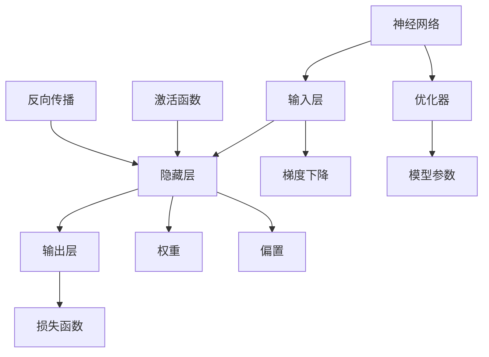

                 

## 1. 背景介绍

### 1.1 问题由来
在过去的几十年里，人工智能(AI)已经从科幻小说中的幻想变为现实中的工具。神经网络(Neural Networks)作为AI的重要组成部分，已经成为处理复杂计算任务、图像识别、自然语言处理等领域的利器。然而，尽管神经网络已经取得了巨大的成功，但关于其本质和与人类智能的关系，仍存在许多未解之谜。本文将探讨神经网络的核心概念和机制，并探讨其对人类智能和社会的深远影响。

### 1.2 问题核心关键点
本文的核心问题在于如何理解和分析神经网络的工作机制，以及它们如何与人类智能相辅相成。主要关注点包括：
1. 神经网络的原理和架构。
2. 神经网络在处理复杂计算任务和解决实际问题中的表现。
3. 神经网络对人类认知和决策过程的影响。
4. 神经网络在伦理和道德层面的挑战和责任。
5. 神经网络的未来发展趋势和应用前景。

## 2. 核心概念与联系

### 2.1 核心概念概述
为了更好地理解神经网络的工作机制，本节将介绍几个关键概念：

- 神经网络：由多个层次组成的计算模型，用于处理非线性关系和复杂数据。
- 激活函数：用于将神经元的输入转换为输出，常用的激活函数包括ReLU、Sigmoid、Tanh等。
- 反向传播算法：用于计算神经网络中各层之间的梯度，更新网络权重，是神经网络训练的核心算法。
- 深度学习：基于多层次神经网络的机器学习范式，通过自动特征提取，实现对复杂数据的建模和预测。
- 人类智能与AI共存：探讨神经网络如何模仿人类智能的认知过程，以及如何通过与人类协作，实现更高级别的智能。

### 2.2 核心概念原理和架构的 Mermaid 流程图



这个流程图展示了神经网络的基本架构和核心组件：
- 输入层接收原始数据。
- 隐藏层通过激活函数计算输出，形成特征提取和抽象。
- 输出层给出最终预测结果。
- 反向传播算法通过梯度下降更新权重和偏置，实现模型的优化。
- 损失函数衡量模型的预测误差，用于指导模型的训练。
- 优化器选择适当的训练策略，加快模型收敛速度。

## 3. 核心算法原理 & 具体操作步骤

### 3.1 算法原理概述

神经网络通过模拟人类神经系统的工作方式，实现对复杂数据的高效处理。其核心原理包括：

1. **前向传播**：将输入数据通过网络各层，得到最终输出。
2. **损失计算**：通过损失函数衡量输出与真实值之间的差距。
3. **反向传播**：通过梯度下降算法，更新网络权重，最小化损失函数。
4. **权重初始化**：采用随机或预定义方法对权重进行初始化，避免梯度消失或爆炸问题。
5. **激活函数**：通过非线性变换，增强网络的表达能力。

### 3.2 算法步骤详解

基于神经网络的处理流程，本文详细讲解其主要步骤：

**Step 1: 数据准备**
- 收集和预处理数据集，确保数据质量。
- 将数据划分为训练集、验证集和测试集，用于模型训练、调参和评估。

**Step 2: 网络设计**
- 设计神经网络的结构，包括层数、每层神经元数等。
- 选择适当的激活函数和优化器。
- 初始化网络权重和偏置。

**Step 3: 模型训练**
- 使用训练集数据，通过前向传播和反向传播算法，更新网络权重。
- 周期性在验证集上评估模型性能，防止过拟合。
- 根据验证集结果，调整模型超参数，如学习率、批大小等。

**Step 4: 模型评估**
- 使用测试集数据评估模型性能，对比训练前后的效果。
- 进行交叉验证，确保模型具有泛化能力。

### 3.3 算法优缺点

神经网络的主要优点包括：
1. 强大的数据处理能力，适用于非线性关系和复杂数据的建模。
2. 自动特征提取，减少了人工设计特征的复杂性。
3. 可扩展性强，可以通过增加层数和神经元数提升模型性能。

然而，神经网络也存在一些局限性：
1. 需要大量数据和计算资源，训练成本较高。
2. 存在梯度消失和爆炸问题，深层网络的训练困难。
3. 结果可解释性不足，难以理解模型内部逻辑。
4. 存在过拟合风险，特别是在标注数据较少的情况下。

### 3.4 算法应用领域

神经网络在众多领域得到了广泛应用，包括但不限于：

- 图像识别：通过卷积神经网络(CNN)实现图像分类、物体检测等任务。
- 自然语言处理：通过循环神经网络(RNN)、Transformer等实现文本生成、翻译、情感分析等任务。
- 语音识别：通过卷积神经网络(CNN)和递归神经网络(RNN)实现语音识别和情感分析。
- 时间序列预测：通过循环神经网络(RNN)和时间序列卷积网络(TSCN)实现股票价格预测、天气预报等任务。
- 自动驾驶：通过深度神经网络实现图像和激光雷达数据处理、目标检测和路径规划等。
- 机器人控制：通过深度强化学习实现机器人动作生成和路径规划等。

## 4. 数学模型和公式 & 详细讲解 & 举例说明

### 4.1 数学模型构建

本节将使用数学语言对神经网络的核心模型进行严格构建。

**4.1.1 线性回归模型**
线性回归模型是最简单的神经网络模型之一，由输入层、隐藏层和输出层组成。假设输入向量为 $\mathbf{x}$，输出向量为 $\mathbf{y}$，网络参数为 $\mathbf{w}$ 和偏置 $\mathbf{b}$，则线性回归模型的数学表达式为：

$$
\mathbf{y} = f(\mathbf{x}; \mathbf{w}, \mathbf{b}) = \mathbf{w}^T\mathbf{x} + \mathbf{b}
$$

其中 $f(\cdot)$ 为激活函数，$^T$ 表示矩阵转置。

**4.1.2 多层感知器(Multilayer Perceptron, MLP)**
多层感知器由多个全连接层组成，每层神经元的输出为前一层的加权和与偏置之和，并通过激活函数进行处理。以一个简单的三层MLP为例，其数学表达式为：

$$
\mathbf{h}^{(1)} = f(\mathbf{x}; \mathbf{w}^{(1)}, \mathbf{b}^{(1)})
$$

$$
\mathbf{h}^{(2)} = f(\mathbf{h}^{(1)}; \mathbf{w}^{(2)}, \mathbf{b}^{(2)})
$$

$$
\mathbf{y} = f(\mathbf{h}^{(2)}; \mathbf{w}^{(3)}, \mathbf{b}^{(3)})
$$

其中 $\mathbf{h}^{(1)}$ 和 $\mathbf{h}^{(2)}$ 分别为第一层和第二层的隐藏层输出，$\mathbf{w}^{(i)}$ 和 $\mathbf{b}^{(i)}$ 分别表示第 $i$ 层的权重和偏置。

### 4.2 公式推导过程

下面以一个简单的二分类任务为例，推导神经网络的前向传播和反向传播过程。

**4.2.1 前向传播**
假设模型接收二分类问题的训练数据 $(\mathbf{x}_i, y_i)$，其中 $y_i \in \{0, 1\}$ 表示标签。模型的目标是最小化损失函数 $L(\mathbf{x}, y; \mathbf{w}, \mathbf{b})$。

在前向传播中，首先对输入 $\mathbf{x}_i$ 进行线性变换，得到第一层隐藏层的输出 $\mathbf{z}^{(1)}$：

$$
\mathbf{z}^{(1)} = \mathbf{w}^{(1)}\mathbf{x}_i + \mathbf{b}^{(1)}
$$

然后，将 $\mathbf{z}^{(1)}$ 输入到Sigmoid激活函数中，得到第二层隐藏层的输出 $\mathbf{h}^{(1)}$：

$$
\mathbf{h}^{(1)} = \sigma(\mathbf{z}^{(1)})
$$

将 $\mathbf{h}^{(1)}$ 再次线性变换，得到输出层的输出 $\mathbf{z}^{(2)}$：

$$
\mathbf{z}^{(2)} = \mathbf{w}^{(2)}\mathbf{h}^{(1)} + \mathbf{b}^{(2)}
$$

将 $\mathbf{z}^{(2)}$ 输入到Sigmoid激活函数中，得到最终预测结果 $\hat{y}$：

$$
\hat{y} = \sigma(\mathbf{z}^{(2)})
$$

其中 $\sigma(\cdot)$ 为Sigmoid激活函数，$^T$ 表示矩阵转置。

**4.2.2 反向传播**
在反向传播中，首先计算预测值 $\hat{y}$ 与真实标签 $y$ 之间的误差：

$$
\mathcal{L}(\mathbf{x}, y; \mathbf{w}, \mathbf{b}) = -y\log\hat{y} + (1-y)\log(1-\hat{y})
$$

然后，计算损失函数对输出层权重的梯度：

$$
\frac{\partial \mathcal{L}}{\partial \mathbf{w}^{(2)}} = (\hat{y} - y) \frac{\partial \sigma(\mathbf{z}^{(2)})}{\partial \mathbf{w}^{(2)}}
$$

将 $\mathbf{w}^{(2)}$ 更新为：

$$
\mathbf{w}^{(2)} \leftarrow \mathbf{w}^{(2)} - \eta \frac{\partial \mathcal{L}}{\partial \mathbf{w}^{(2)}}
$$

其中 $\eta$ 为学习率。

类似地，计算损失函数对第二层隐藏层偏置的梯度，并将 $\mathbf{b}^{(2)}$ 更新为：

$$
\mathbf{b}^{(2)} \leftarrow \mathbf{b}^{(2)} - \eta \frac{\partial \mathcal{L}}{\partial \mathbf{b}^{(2)}}
$$

最后，计算损失函数对第一层隐藏层输出 $\mathbf{h}^{(1)}$ 的梯度，并将 $\mathbf{w}^{(1)}$ 和 $\mathbf{b}^{(1)}$ 更新为：

$$
\frac{\partial \mathcal{L}}{\partial \mathbf{w}^{(1)}} = \mathbf{h}^{(1)} \frac{\partial \sigma(\mathbf{z}^{(1)})}{\partial \mathbf{w}^{(1)}}
$$

$$
\frac{\partial \mathcal{L}}{\partial \mathbf{b}^{(1)}} = \frac{\partial \mathcal{L}}{\partial \mathbf{h}^{(1)}} \frac{\partial \sigma(\mathbf{z}^{(1)})}{\partial \mathbf{b}^{(1)}}
$$

## 5. 项目实践：代码实例和详细解释说明

### 5.1 开发环境搭建

在进行神经网络项目实践前，需要准备好开发环境。以下是使用Python进行TensorFlow开发的环境配置流程：

1. 安装Anaconda：从官网下载并安装Anaconda，用于创建独立的Python环境。

2. 创建并激活虚拟环境：
```bash
conda create -n tensorflow-env python=3.7 
conda activate tensorflow-env
```

3. 安装TensorFlow：根据CUDA版本，从官网获取对应的安装命令。例如：
```bash
conda install tensorflow -c tf
```

4. 安装相关工具包：
```bash
pip install numpy pandas scikit-learn matplotlib tensorflow-estimator tqdm jupyter notebook ipython
```

完成上述步骤后，即可在`tensorflow-env`环境中开始神经网络实践。

### 5.2 源代码详细实现

下面我们以一个简单的二分类任务为例，给出使用TensorFlow对多层感知器模型进行训练的PyTorch代码实现。

```python
import tensorflow as tf
from tensorflow.keras import layers, models

# 定义模型
model = models.Sequential([
    layers.Dense(64, activation='relu', input_shape=(784,)),
    layers.Dense(64, activation='relu'),
    layers.Dense(1, activation='sigmoid')
])

# 定义损失函数
loss_fn = tf.keras.losses.BinaryCrossentropy()

# 定义优化器
optimizer = tf.keras.optimizers.Adam()

# 定义训练函数
def train_step(inputs, targets):
    with tf.GradientTape() as tape:
        predictions = model(inputs)
        loss_value = loss_fn(targets, predictions)
    gradients = tape.gradient(loss_value, model.trainable_variables)
    optimizer.apply_gradients(zip(gradients, model.trainable_variables))
    return loss_value

# 定义训练流程
model.compile(optimizer=optimizer, loss=loss_fn, metrics=['accuracy'])

# 使用训练数据集进行训练
model.fit(train_dataset, epochs=10, validation_data=val_dataset)
```

### 5.3 代码解读与分析

让我们再详细解读一下关键代码的实现细节：

**Sequential模型定义**：
- `model = models.Sequential()`：创建一个Sequential模型，用于堆叠多个层。
- `layers.Dense(64, activation='relu', input_shape=(784,))`：添加第一个全连接层，包含64个神经元，使用ReLU激活函数，输入维度为784。
- `layers.Dense(64, activation='relu')`：添加第二个全连接层，包含64个神经元，使用ReLU激活函数。
- `layers.Dense(1, activation='sigmoid')`：添加输出层，包含1个神经元，使用Sigmoid激活函数。

**损失函数定义**：
- `loss_fn = tf.keras.losses.BinaryCrossentropy()`：定义二分类任务的损失函数，即二元交叉熵损失。

**优化器定义**：
- `optimizer = tf.keras.optimizers.Adam()`：定义Adam优化器，用于更新模型参数。

**训练函数定义**：
- `train_step(inputs, targets)`：定义一个训练步骤函数，用于计算损失值并更新模型参数。
  - `with tf.GradientTape() as tape:`：定义一个GradientTape对象，用于记录模型参数的梯度。
  - `predictions = model(inputs)`：通过模型预测输入数据的输出。
  - `loss_value = loss_fn(targets, predictions)`：计算损失值。
  - `gradients = tape.gradient(loss_value, model.trainable_variables)`：计算损失函数对模型参数的梯度。
  - `optimizer.apply_gradients(zip(gradients, model.trainable_variables))`：使用Adam优化器更新模型参数。
  - `return loss_value`：返回损失值，用于记录训练进度。

**训练流程定义**：
- `model.compile(optimizer=optimizer, loss=loss_fn, metrics=['accuracy'])`：编译模型，指定优化器和损失函数。
- `model.fit(train_dataset, epochs=10, validation_data=val_dataset)`：使用训练数据集进行模型训练，设置训练轮数为10，并在验证集上评估模型性能。

以上代码实现了基于TensorFlow的多层感知器模型训练，展示了神经网络的基本工作流程。通过不断迭代和优化训练过程，可以显著提升模型的性能和泛化能力。

## 6. 实际应用场景

### 6.1 图像识别

神经网络在图像识别领域已经取得了巨大的成功，尤其是在计算机视觉领域。例如，通过卷积神经网络(CNN)，可以对图像进行分类、目标检测、人脸识别等任务。以ImageNet数据集为例，使用预训练的VGG、ResNet等模型，可以达到超过98%的分类准确率。

**应用实例**：自动驾驶中的行人检测
- 使用预训练的神经网络模型，对摄像头捕获的实时图像进行目标检测，识别出行人位置和方向。
- 通过行人跟踪和路径规划算法，实时调整车辆行驶路径，避免交通事故。

### 6.2 自然语言处理

神经网络在自然语言处理领域也有广泛应用，如机器翻译、文本生成、情感分析等。通过循环神经网络(RNN)和Transformer等模型，可以实现对这些任务的自动化处理。例如，Google的BERT模型在多个NLP任务上取得了SOTA的性能。

**应用实例**：智能客服中的情感分析
- 通过预训练的BERT模型，对客户提问进行情感分析，识别出客户的情绪状态。
- 根据情绪状态，自动选择合适的回答模板，提供更加人性化的服务。

### 6.3 语音识别

神经网络在语音识别领域也有重要应用，如语音转文字、语音命令识别等。通过卷积神经网络(CNN)和递归神经网络(RNN)等模型，可以高效处理音频数据，实现对语音指令的准确识别和响应。

**应用实例**：智能音箱中的语音控制
- 使用预训练的神经网络模型，对用户语音指令进行识别和解析。
- 根据用户指令，自动控制智能音箱播放音乐、调整音量等操作。

### 6.4 时间序列预测

神经网络在时间序列预测领域也有广泛应用，如股票价格预测、天气预报等。通过递归神经网络(RNN)和时间序列卷积网络(TSCN)等模型，可以捕捉时间序列数据中的长期依赖关系，实现精准的预测。

**应用实例**：智能电网中的负荷预测
- 使用预训练的RNN模型，对历史用电数据进行分析和预测。
- 根据预测结果，优化电力分配和调度，提升电网运行效率。

## 7. 工具和资源推荐

### 7.1 学习资源推荐

为了帮助开发者系统掌握神经网络的核心概念和实践技巧，这里推荐一些优质的学习资源：

1. 《深度学习》（Ian Goodfellow等著）：深度学习领域的经典教材，全面介绍了神经网络的基本原理和应用。

2. CS231n《卷积神经网络》课程：斯坦福大学开设的计算机视觉课程，通过Lecture视频和配套作业，帮助开发者系统掌握CNN的原理和实践。

3. CS224n《序列建模》课程：斯坦福大学开设的自然语言处理课程，通过Lecture视频和作业，帮助开发者掌握RNN和Transformer等模型的应用。

4. 《动手学深度学习》（李沐等著）：动手实践导向的深度学习教材，通过代码示例和实践项目，帮助开发者深入理解神经网络的构建和训练过程。

5. TensorFlow官方文档：TensorFlow的官方文档，提供了完整的模型设计和训练指南，是开发者学习TensorFlow的重要资料。

6. PyTorch官方文档：PyTorch的官方文档，提供了强大的API和丰富的示例代码，帮助开发者高效开发神经网络应用。

通过对这些资源的学习实践，相信你一定能够快速掌握神经网络的核心概念和实践技巧，并用于解决实际的计算问题。

### 7.2 开发工具推荐

高效的开发离不开优秀的工具支持。以下是几款用于神经网络开发的常用工具：

1. TensorFlow：由Google主导开发的开源深度学习框架，生产部署方便，适合大规模工程应用。

2. PyTorch：Facebook开发的开源深度学习框架，灵活便捷，支持动态计算图，适合快速迭代研究。

3. Keras：高层次的深度学习API，简化了模型的设计和训练过程，适合初学者和快速原型开发。

4. Theano：另一个开源深度学习框架，提供了高效的GPU加速计算，支持自动微分和优化。

5. JAX：Google开发的基于JIT编译的深度学习框架，支持动态计算图和自动微分，适合高性能计算。

合理利用这些工具，可以显著提升神经网络开发的效率，加速创新迭代的步伐。

### 7.3 相关论文推荐

神经网络的研究源于学界的持续探索，以下是几篇奠基性的相关论文，推荐阅读：

1. Deep Neural Networks for Acoustic Modeling in Speech Recognition（深度神经网络在语音识别中的应用）：Hinton等提出，展示了神经网络在语音识别领域的巨大潜力。

2. ImageNet Classification with Deep Convolutional Neural Networks（使用卷积神经网络进行ImageNet分类）：Krizhevsky等提出，展示了CNN在图像分类任务上的优异性能。

3. Sequence to Sequence Learning with Neural Networks（基于神经网络的序列到序列学习）：Sutskever等提出，展示了RNN在机器翻译和对话生成等任务上的应用。

4. Attention Is All You Need（Transformer模型）：Vaswani等提出，展示了Transformer在自然语言处理任务上的优异表现。

5. Generative Adversarial Nets（生成对抗网络）：Goodfellow等提出，展示了GAN在图像生成和风格迁移等任务上的应用。

这些论文代表了大神经网络研究的发展脉络。通过学习这些前沿成果，可以帮助研究者把握学科前进方向，激发更多的创新灵感。

## 8. 总结：未来发展趋势与挑战

### 8.1 研究成果总结

本文对神经网络的核心概念和应用进行了全面系统的介绍。重点在于：
1. 神经网络的原理和架构，包括前向传播、反向传播、激活函数等基本概念。
2. 神经网络在处理复杂计算任务和解决实际问题中的表现，如图像识别、自然语言处理、语音识别等。
3. 神经网络对人类认知和决策过程的影响，以及其在伦理和道德层面的挑战和责任。

### 8.2 未来发展趋势

展望未来，神经网络的发展趋势将呈现以下几个方向：

1. 模型规模持续增大。随着算力成本的下降和数据规模的扩张，神经网络的参数量还将持续增长。超大规模神经网络蕴含的丰富数据表示，有望支撑更加复杂多变的任务。

2. 模型结构和训练算法不断优化。未来的神经网络将更加高效，能够处理更加复杂的输入和输出，同时训练算法也将更加智能化，能够自动调节超参数和模型结构。

3. 跨领域和跨模态应用的扩展。未来的神经网络将不再局限于单一领域和单一模态的数据，能够融合不同模态的信息，实现更加全面和多维的智能处理。

4. 对人类智能的模拟和增强。未来的神经网络将更加智能，能够模拟人类认知和决策过程，同时通过与人类协作，实现更高级别的智能。

### 8.3 面临的挑战

尽管神经网络已经取得了巨大的成功，但在迈向更加智能化、普适化应用的过程中，它仍面临诸多挑战：

1. 训练和部署的高成本。神经网络需要大量数据和计算资源，训练成本较高。同时，在实际部署中，神经网络也需要高性能的硬件支持，这对小型企业和个人开发者是一个重大挑战。

2. 模型的可解释性和鲁棒性。当前神经网络模型的结果可解释性不足，难以理解内部决策过程。同时，模型对输入噪声和攻击的鲁棒性也有待提高，以应对现实世界的复杂性和不确定性。

3. 伦理和道德问题。神经网络在处理敏感数据和决策时，可能存在偏见和歧视，需要引入伦理和道德导向的评估指标，确保模型输出的公平性和公正性。

### 8.4 研究展望

面对神经网络面临的挑战，未来的研究需要在以下几个方面寻求新的突破：

1. 开发更加高效、可解释的模型。通过引入符号化知识、因果推理等方法，增强神经网络的鲁棒性和可解释性。

2. 探索无监督和半监督学习范式。摆脱对大规模标注数据的依赖，利用自监督学习、主动学习等方法，最大化数据利用率。

3. 融合跨领域和跨模态信息。通过多模态深度学习模型，实现视觉、语音、文本等多种数据的联合处理和分析。

4. 引入伦理和道德导向的评估指标。确保神经网络模型在处理敏感数据和决策时的公平性和公正性，避免偏见和歧视。

通过这些研究方向的探索，神经网络技术必将进一步提升其智能化水平，为人类认知智能的进化带来深远影响。面向未来，我们需要不断探索和创新，以推动神经网络技术的持续进步。

## 9. 附录：常见问题与解答

**Q1: 什么是神经网络？**

A: 神经网络是一种基于生物神经元工作原理的计算模型，由多个层次组成，用于处理非线性关系和复杂数据。其主要组成部分包括输入层、隐藏层和输出层。

**Q2: 神经网络的训练过程是怎样的？**

A: 神经网络的训练过程包括前向传播和反向传播两个阶段。在前向传播阶段，输入数据通过网络各层，得到最终输出。在反向传播阶段，通过计算损失函数对模型参数的梯度，更新网络权重和偏置，最小化损失函数。

**Q3: 神经网络在实际应用中面临哪些挑战？**

A: 神经网络在实际应用中面临的主要挑战包括训练和部署的高成本、模型的可解释性和鲁棒性不足，以及伦理和道德问题。

**Q4: 未来的神经网络发展方向有哪些？**

A: 未来的神经网络发展方向包括模型规模的持续增大、模型结构和训练算法的不断优化、跨领域和跨模态应用的扩展，以及对人类智能的模拟和增强。

**Q5: 如何确保神经网络模型的公平性和公正性？**

A: 确保神经网络模型的公平性和公正性，需要引入伦理和道德导向的评估指标，避免偏见和歧视，确保模型在处理敏感数据和决策时的透明性和可解释性。

通过这些常见问题的解答，相信你能够更好地理解神经网络的原理和应用，并掌握其未来发展趋势和面临的挑战。

