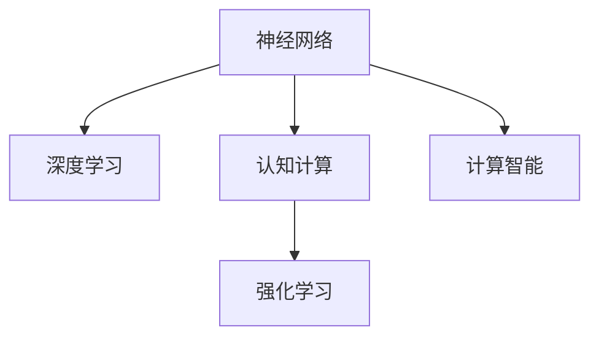
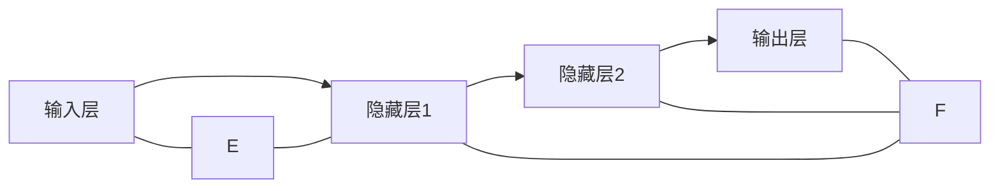

                 

# 神经网络：人类智慧的解放

> 关键词：神经网络,深度学习,人工智能,认知计算,计算智能,人类智慧

## 1. 背景介绍

### 1.1 问题由来
随着人工智能技术的飞速发展，深度学习已经成为当今时代最具影响力的技术之一。深度学习通过模拟人类大脑的神经网络结构，实现了对大规模数据的高效处理与特征提取，推动了包括计算机视觉、自然语言处理、语音识别等在内的众多领域取得了突破性进展。

在深度学习的演进过程中，神经网络以其强大的模式识别能力、自适应学习能力以及泛化能力，逐步成为人工智能的核心组件。然而，相较于传统的符号计算，神经网络这种“黑盒”模型在可解释性、认知原理等方面仍存在不少争议。

神经网络的普及和发展，不仅改变了人类对信息处理和智能交互的认知，也引发了对于“人类智慧是否可以被机器解放”的深度思考。本文旨在深入探讨神经网络的工作原理、技术演进及其对人类智慧的解放意义，以期为读者提供更全面的认知视角。

### 1.2 问题核心关键点
神经网络通过模拟大脑神经元之间的连接方式，能够自适应地处理复杂非线性关系。其核心在于以下方面：

- **自适应学习能力**：通过反向传播算法更新模型参数，不断优化输入输出映射关系。
- **泛化能力**：在大规模数据上训练出的神经网络，通常具备较好的泛化能力，能够在新数据上表现优异。
- **表征学习**：通过层级结构提取数据特征，形成高效低维的表征向量，便于后续处理和理解。
- **计算智能**：利用深度神经网络实现了计算智能的飞跃，能够进行自主决策、逻辑推理等高级认知任务。

神经网络的发展不仅改变了计算机视觉、自然语言处理等领域的研究范式，也对人类的认知方式和信息处理模式产生了深刻影响。

## 2. 核心概念与联系

### 2.1 核心概念概述

为更好理解神经网络技术及其对人类智慧的影响，本节将介绍几个关键概念及其相互联系：

- **神经网络(Neural Network)**：基于生物学神经网络启发的计算模型，由大量的人工神经元（节点）通过连接（边）组成。
- **深度学习(Deep Learning)**：神经网络的一种特殊类型，包含多个层次（通常称为深度），能够处理复杂的数据结构，如图像、音频和文本等。
- **认知计算(Cognitive Computing)**：模拟人类大脑认知过程的计算模型，如感知、记忆、推理、决策等。
- **计算智能(Computational Intelligence)**：利用计算机模型实现智能决策、模式识别和问题求解的智能化技术。
- **强化学习(Reinforcement Learning)**：利用奖励和惩罚信号，通过与环境的交互学习最优决策策略的机器学习方法。

这些核心概念之间的逻辑关系可以通过以下Mermaid流程图来展示：



### 2.2 核心概念原理和架构的 Mermaid 流程图

下面是一个简单的多层感知器（Multilayer Perceptron, MLP）的神经网络架构示意图，其由输入层、隐藏层和输出层组成。各层神经元之间通过权重矩阵连接，反向传播算法用于更新权重，实现模型的训练。



## 3. 核心算法原理 & 具体操作步骤
### 3.1 算法原理概述

神经网络的训练过程主要由前向传播和反向传播两个部分组成。在前向传播中，输入数据通过神经网络逐层传递，最终得到输出结果；在反向传播中，根据输出与真实标签之间的误差，利用梯度下降算法调整网络中的权重和偏置，优化模型参数。

以简单的多层感知器为例，其前向传播过程为：

1. 输入数据 $x$ 通过输入层传递到第一个隐藏层，每个神经元对输入进行线性变换，并通过激活函数进行非线性映射。
2. 隐藏层的输出通过权重矩阵传递到下一个隐藏层，重复上述过程。
3. 最终输出层对隐藏层的输出进行线性变换，得到预测结果 $y$。

而反向传播过程则包括：

1. 计算输出层与真实标签之间的误差 $E$，通常使用均方误差（MSE）或交叉熵（CE）等损失函数。
2. 通过链式法则，从输出层开始逐层计算每个神经元对误差的贡献，得到梯度。
3. 利用梯度下降算法更新每个神经元之间的权重和偏置，减少误差。

### 3.2 算法步骤详解

神经网络训练的具体步骤如下：

**Step 1: 准备数据和模型**

1. 收集训练数据集 $D = \{(x_i, y_i)\}_{i=1}^N$，其中 $x_i$ 为输入数据，$y_i$ 为对应的标签或目标变量。
2. 选择合适的神经网络架构，如多层感知器（MLP）、卷积神经网络（CNN）、循环神经网络（RNN）等。
3. 初始化模型参数，如权重矩阵 $W$ 和偏置向量 $b$。

**Step 2: 前向传播**

1. 将输入数据 $x$ 传递到第一层神经元，计算各层神经元的输出。
2. 将隐藏层的输出传递到下一层，重复此过程，直至输出层。
3. 通过输出层的线性变换和激活函数，得到预测结果 $\hat{y}$。

**Step 3: 计算误差**

1. 根据预测结果 $\hat{y}$ 和真实标签 $y$，计算误差 $E$。
2. 根据具体问题，选择适合的损失函数 $L$，如均方误差 $L_1$、均方误差 $L_2$ 或交叉熵损失 $L_{CE}$。

**Step 4: 反向传播**

1. 通过链式法则，计算每个神经元对误差的贡献，得到梯度 $\nabla L$。
2. 从输出层开始，利用梯度下降算法更新每个神经元之间的权重和偏置，更新公式为：
   $$
   W = W - \eta \nabla L / \nabla W
   $$
   $$
   b = b - \eta \nabla L / \nabla b
   $$
   其中，$\eta$ 为学习率，$\nabla L / \nabla W$ 和 $\nabla L / \nabla b$ 分别为权重和偏置的梯度。

**Step 5: 重复训练**

1. 重复前向传播和反向传播过程，直到达到预设的迭代次数或误差收敛。
2. 在训练集上评估模型性能，验证模型泛化能力。

**Step 6: 测试和部署**

1. 在测试集上评估模型性能，对比训练前后的精度提升。
2. 使用训练好的模型对新数据进行推理预测，集成到实际的应用系统中。

### 3.3 算法优缺点

神经网络训练的优点包括：

- **自适应学习能力**：能够自动学习复杂非线性关系，适应大规模数据集。
- **泛化能力**：在大规模数据上训练出的模型，通常在未见过的数据上表现良好。
- **表征学习**：通过层级结构提取数据特征，形成高效低维的表征向量。
- **计算智能**：能够进行自主决策、逻辑推理等高级认知任务。

然而，神经网络也存在一些局限性：

- **计算资源消耗大**：大规模神经网络的训练需要大量的计算资源和存储空间。
- **可解释性不足**：复杂神经网络通常被视为“黑盒”模型，难以解释其内部工作机制。
- **易过拟合**：在大数据集上训练出的神经网络，容易过拟合训练集，泛化能力受限。
- **敏感性问题**：神经网络对输入数据的微小变化可能十分敏感，存在一定的脆弱性。

尽管存在这些局限性，神经网络凭借其强大的表征能力和计算智能，仍然成为了人工智能领域的重要技术，推动了认知计算和计算智能的发展。

### 3.4 算法应用领域

神经网络在各个领域都有着广泛的应用：

- **计算机视觉**：用于图像分类、目标检测、人脸识别等任务，如卷积神经网络（CNN）。
- **自然语言处理**：用于文本分类、语言建模、机器翻译等任务，如递归神经网络（RNN）、Transformer。
- **语音识别**：用于语音转写、语音合成、语音情感识别等任务，如长短时记忆网络（LSTM）。
- **推荐系统**：用于商品推荐、内容推荐等任务，如协同过滤、深度推荐系统。
- **强化学习**：用于智能游戏、自动驾驶、机器人控制等任务，如深度强化学习（DRL）。

神经网络的多样性和广泛应用，使其成为了人工智能领域最为活跃的研究方向之一。

## 4. 数学模型和公式 & 详细讲解  
### 4.1 数学模型构建

神经网络训练的数学模型通常包括以下几个部分：

- **输入层**：接受原始输入数据 $x \in \mathbb{R}^n$。
- **隐藏层**：通过一系列的线性变换和非线性激活函数，将输入数据映射到更高维的特征空间。
- **输出层**：对隐藏层的输出进行线性变换，得到最终预测结果 $y \in \mathbb{R}^m$。

### 4.2 公式推导过程

以多层感知器（MLP）为例，其数学模型和训练过程如下：

**前向传播公式**：

$$
y^{(l)} = g(W^{(l)} x^{(l-1)} + b^{(l)})
$$

其中 $x^{(l-1)}$ 为第 $l-1$ 层的输出，$y^{(l)}$ 为第 $l$ 层的输出，$W^{(l)}$ 为第 $l$ 层的权重矩阵，$b^{(l)}$ 为第 $l$ 层的偏置向量，$g$ 为激活函数。

**损失函数公式**：

$$
L = \frac{1}{N} \sum_{i=1}^N L(y_i, \hat{y}_i)
$$

其中 $L$ 为损失函数，$y_i$ 为真实标签，$\hat{y}_i$ 为模型预测结果。

**梯度下降公式**：

$$
W^{(l)} \leftarrow W^{(l)} - \eta \nabla_L \nabla_{W^{(l)}} L
$$
$$
b^{(l)} \leftarrow b^{(l)} - \eta \nabla_L \nabla_{b^{(l)}} L
$$

其中 $\nabla_L \nabla_{W^{(l)}} L$ 和 $\nabla_L \nabla_{b^{(l)}} L$ 分别为权重和偏置的梯度。

### 4.3 案例分析与讲解

以手写数字识别为例，展示神经网络模型在图像分类任务中的应用：

- **数据准备**：收集包含手写数字的图像数据集，将其标准化为 $28 \times 28$ 的灰度图像，并将像素值归一化到 $[0, 1]$ 范围内。
- **模型构建**：设计一个包含两个隐藏层的全连接神经网络，使用 ReLU 激活函数，输出层使用 Softmax 激活函数。
- **训练过程**：使用反向传播算法，在训练集上优化模型参数，使模型能够准确识别手写数字。
- **性能评估**：在测试集上评估模型性能，对比训练前后的识别准确率。

## 5. 项目实践：代码实例和详细解释说明
### 5.1 开发环境搭建

在进行神经网络项目开发前，需要准备以下开发环境：

1. **安装 Python**：确保安装了 Python 3.7 或更高版本。
2. **安装 TensorFlow 或 PyTorch**：选择适合你的框架（TensorFlow、PyTorch）进行安装。
3. **安装相关库**：安装必要的库，如 NumPy、Pandas、Matplotlib 等。
4. **创建虚拟环境**：使用虚拟环境管理工具，如 Anaconda 或 venv，创建一个独立的 Python 环境。

### 5.2 源代码详细实现

以下是一个使用 TensorFlow 实现手写数字识别的简单神经网络模型：

```python
import tensorflow as tf
from tensorflow.keras.datasets import mnist
from tensorflow.keras.models import Sequential
from tensorflow.keras.layers import Dense, Flatten, Dropout
from tensorflow.keras.optimizers import Adam

# 加载数据集
(x_train, y_train), (x_test, y_test) = mnist.load_data()

# 数据预处理
x_train = x_train / 255.0
x_test = x_test / 255.0

# 构建模型
model = Sequential([
    Flatten(input_shape=(28, 28)),
    Dense(128, activation='relu'),
    Dropout(0.2),
    Dense(10, activation='softmax')
])

# 编译模型
model.compile(optimizer=Adam(learning_rate=0.001),
              loss='sparse_categorical_crossentropy',
              metrics=['accuracy'])

# 训练模型
model.fit(x_train, y_train, epochs=10, batch_size=32, validation_data=(x_test, y_test))

# 评估模型
model.evaluate(x_test, y_test)
```

### 5.3 代码解读与分析

**数据准备**：
- 使用 `mnist.load_data()` 函数加载手写数字数据集。
- 将图像数据归一化到 $[0, 1]$ 范围内，并进行 flattening 操作，将二维图像数据转化为一维向量。

**模型构建**：
- 使用 `Sequential` 模型定义神经网络结构，包含输入层、两个隐藏层和一个输出层。
- 隐藏层使用 `Dense` 层，激活函数为 ReLU。
- 输出层使用 `Dense` 层，激活函数为 Softmax。
- Dropout 层用于防止过拟合。

**模型编译和训练**：
- 使用 Adam 优化器和稀疏分类交叉熵损失函数编译模型。
- 在训练集上训练模型，使用验证集进行验证。

**模型评估**：
- 使用测试集评估模型性能，输出准确率。

## 6. 实际应用场景

### 6.1 智能家居

神经网络在智能家居系统中可以用于实现智能语音助手、自动化场景控制等功能。例如，通过训练声学模型识别用户语音指令，并根据指令自动控制家庭设备。

### 6.2 医疗诊断

在医疗领域，神经网络可用于图像诊断、病理分析等任务。通过训练医学影像分类模型，自动识别病变区域，辅助医生进行诊断。

### 6.3 金融分析

神经网络在金融领域可用于预测股票走势、风险评估、交易策略等任务。通过训练时间序列预测模型，准确预测市场变化，优化投资策略。

### 6.4 游戏智能

神经网络在人工智能游戏领域有广泛应用，如 AlphaGo、AlphaZero 等。通过深度强化学习算法训练出强大的游戏智能体，实现高水平的游戏对弈。

### 6.5 自动驾驶

神经网络在自动驾驶系统中用于感知、决策、控制等环节。通过训练感知模型，自动识别道路状况和障碍物，实现自主驾驶。

### 6.6 工业制造

在工业制造领域，神经网络用于预测设备故障、优化生产流程等任务。通过训练时间序列预测模型，预测设备寿命，优化生产计划。

### 6.7 个性化推荐

神经网络在推荐系统中用于用户行为分析、物品推荐等任务。通过训练协同过滤模型，实现个性化商品推荐。

## 7. 工具和资源推荐
### 7.1 学习资源推荐

- **深度学习书籍**：《深度学习》（Ian Goodfellow 等）、《Python深度学习》（Francois Chollet）等。
- **在线课程**：Coursera 的《深度学习专项课程》、Udacity 的《深度学习纳米学位》等。
- **技术博客和社区**：Kaggle、GitHub、Medium 等平台上的深度学习技术文章和社区讨论。

### 7.2 开发工具推荐

- **深度学习框架**：TensorFlow、PyTorch、Keras 等。
- **数据处理工具**：NumPy、Pandas、Scikit-learn 等。
- **可视化工具**：Matplotlib、Seaborn、TensorBoard 等。

### 7.3 相关论文推荐

- **深度学习基础**：《Deep Learning》（Goodfellow 等）。
- **神经网络经典论文**：《ImageNet Classification with Deep Convolutional Neural Networks》（Krizhevsky 等）。
- **强化学习经典论文**：《Playing Atari with deep reinforcement learning》（Mnih 等）。

## 8. 总结：未来发展趋势与挑战
### 8.1 总结

神经网络作为深度学习的重要组成部分，已经在各个领域取得了显著的应用成果。其强大的表征能力和计算智能，使得人类智慧得以解放，开启了智能计算的新纪元。

### 8.2 未来发展趋势

未来，神经网络将继续在各个领域发挥重要作用：

- **自适应学习能力**：通过不断学习和优化，实现更高效的数据处理和智能决策。
- **多模态融合**：将图像、语音、文本等多种模态信息进行融合，提升智能系统的全面感知能力。
- **迁移学习**：在不同领域间实现知识迁移，推动认知计算的普及。
- **认知增强**：结合符号计算、逻辑推理等技术，增强智能系统的可解释性和认知水平。

### 8.3 面临的挑战

神经网络的发展仍然面临诸多挑战：

- **计算资源需求高**：大规模神经网络需要大量计算资源和存储空间，阻碍了其在部分场景的应用。
- **可解释性不足**：复杂神经网络通常被视为“黑盒”模型，难以解释其内部工作机制。
- **过拟合问题**：在大数据集上训练出的神经网络，容易过拟合训练集，泛化能力受限。
- **伦理和安全性**：神经网络可能产生误导性输出，引发伦理和安全性问题。

### 8.4 研究展望

未来的研究需要在以下几个方面寻求新的突破：

- **计算效率提升**：开发更高效的计算框架，降低神经网络的计算复杂度。
- **可解释性增强**：引入更多符号计算和逻辑推理，增强神经网络的可解释性。
- **知识整合能力**：将符号化的先验知识与神经网络结合，提升智能系统的知识整合能力。
- **伦理和安全**：建立神经网络的伦理约束和安全机制，确保其输出符合人类价值观和伦理道德。

## 9. 附录：常见问题与解答

**Q1：神经网络是否会取代人类智能？**

A: 神经网络能够在某些任务上达到甚至超越人类的水平，但其在全面理解和决策方面仍远不及人类。神经网络更多地用于处理复杂数据和实现自动化决策，而人类智能则在更广泛的场景下具有不可替代的优势。

**Q2：神经网络是否会引发就业危机？**

A: 神经网络的普及和发展，将改变部分职业的工作方式和技能需求，但同时也将创造出更多新的就业机会。通过学习和掌握神经网络技术，人类可以更好地适应未来职业环境的变化。

**Q3：神经网络的伦理和安全问题如何解决？**

A: 神经网络的伦理和安全问题需要通过多方面的努力来解决。包括制定严格的算法标准和伦理规范、引入可解释性机制、确保数据隐私和安全等。

**Q4：神经网络在数据集选择上有什么要求？**

A: 神经网络训练需要大规模、高质量的数据集，数据集的选择应涵盖多样性和代表性，避免数据偏差。

**Q5：神经网络在实际应用中如何避免过拟合？**

A: 过拟合可以通过以下方式避免：
- 数据增强：通过数据扩充和增强，增加训练集的多样性。
- 正则化：使用 L2 正则、Dropout 等方法防止过拟合。
- 模型集成：通过集成多个模型，减少过拟合风险。
- 迁移学习：利用在其他领域训练出的模型进行迁移学习，提升泛化能力。

通过合理设计神经网络的训练过程，可以最大限度地发挥其优势，减少潜在的风险。

---

作者：禅与计算机程序设计艺术 / Zen and the Art of Computer Programming

