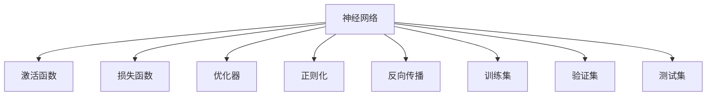

                 

## 1. 背景介绍

神经网络(Neural Networks, NNs)，作为人工智能(AI)的核心技术之一，自从1980年代被重新发现以来，便迅速成为解决复杂问题的强大工具。它通过模拟人脑的神经元工作机制，能够学习到数据的内在规律，从而实现各种智能推理和决策。

### 1.1 问题由来

近年来，随着深度学习技术的蓬勃发展，神经网络在图像识别、语音识别、自然语言处理等诸多领域取得了突破性进展。例如，卷积神经网络(CNN)在图像分类上大幅超越了传统算法，循环神经网络(RNN)在语音识别上显著提高了准确率。而在自然语言处理领域，基于Transformer结构的神经网络，如BERT、GPT系列模型，更是引领了预训练语言模型的潮流。

神经网络不仅在学术界得到了广泛认可，其强大的数据处理和预测能力，也为工业界带来了巨大价值。例如，Google利用神经网络优化搜索算法，显著提升了搜索结果的相关性和速度。Amazon使用神经网络进行个性化推荐，增强了用户体验。特斯拉使用神经网络进行自动驾驶决策，提高了行车安全。

### 1.2 问题核心关键点

神经网络之所以能够在数据驱动的任务中表现出色，主要有以下几个原因：

1. **强大的表达能力**：神经网络可以灵活地映射输入到输出，对于各种非线性关系具有较强的建模能力。
2. **自动特征提取**：神经网络可以通过学习数据的内在结构，自动提取有用的特征，减少对人工特征工程的依赖。
3. **分布式计算**：神经网络的计算图结构能够高效地并行计算，利用GPU、TPU等硬件设备，实现高速训练和推理。
4. **可解释性差**：神经网络的内部决策机制复杂，难以解释其推理过程，使得模型成为"黑盒"。
5. **过拟合问题**：神经网络容易在训练数据上过度拟合，导致泛化性能不足。
6. **数据依赖性强**：神经网络性能高度依赖于数据质量，缺少高质量数据，效果难以保障。

这些关键点构成了神经网络的研究基础，也为未来神经网络的发展指明了方向。

## 2. 核心概念与联系

### 2.1 核心概念概述

为更好地理解神经网络，本节将介绍几个关键概念及其之间的联系：

- **神经网络(Neural Network)**：由多个节点(神经元)和连接这些节点的边(权重)构成的图结构。通过前向传播计算输入数据，并反向传播计算损失函数，以优化模型参数。
- **激活函数(Activation Function)**：用于引入非线性变换，增强神经网络的表达能力。如Sigmoid、ReLU、Tanh等。
- **损失函数(Loss Function)**：用于衡量模型输出与真实标签之间的差异，是模型训练的优化目标。
- **优化器(Optimizer)**：用于自动调整模型参数，以最小化损失函数。如梯度下降法(Gradient Descent)、Adam、RMSprop等。
- **正则化(Regularization)**：用于避免模型过拟合，常见方法包括L1正则、L2正则、Dropout等。
- **反向传播(Backpropagation)**：利用链式法则计算梯度，反向传播误差信号，更新模型参数。
- **训练集(Training Set)**：用于训练模型的数据集，包含大量标注样本。
- **验证集(Validation Set)**：用于验证模型性能，评估模型泛化能力。
- **测试集(Test Set)**：用于测试模型性能，评估模型实际效果。

这些核心概念构成了神经网络的完整框架，使得模型能够自动学习数据规律，完成各种智能任务。

### 2.2 核心概念原理和架构的 Mermaid 流程图



这个流程图展示了神经网络的基本构成和关键组件之间的联系。输入数据首先经过激活函数进行非线性变换，然后通过损失函数计算误差，由优化器调整模型参数。同时，通过正则化和反向传播技术，提升模型泛化能力，并防止过拟合。训练集用于模型训练，验证集和测试集用于模型评估。

## 3. 核心算法原理 & 具体操作步骤
### 3.1 算法原理概述

神经网络通过反向传播算法进行训练。其核心思想是：将输入数据通过网络前向传播，计算模型输出与真实标签之间的差异，即损失函数。然后通过反向传播算法计算损失函数对每个参数的梯度，利用优化器更新模型参数，最小化损失函数。

数学上，设神经网络模型为 $f(x;\theta)$，其中 $x$ 为输入数据，$\theta$ 为模型参数。假设模型输出为 $\hat{y}$，真实标签为 $y$，则定义损失函数 $L(y, \hat{y})$ 为：

$$
L(y, \hat{y}) = \frac{1}{N}\sum_{i=1}^N l(y_i, \hat{y}_i)
$$

其中 $l$ 为具体的损失函数，如交叉熵、均方误差等。

通过反向传播算法，计算损失函数对每个参数的梯度 $\nabla_{\theta}L(y, \hat{y})$，然后利用优化器更新模型参数：

$$
\theta \leftarrow \theta - \eta \nabla_{\theta}L(y, \hat{y})
$$

其中 $\eta$ 为学习率，控制参数更新的幅度。

### 3.2 算法步骤详解

基于反向传播算法的神经网络训练过程一般包括以下几个步骤：

**Step 1: 准备数据和模型**

- 收集训练数据 $D=\{(x_i,y_i)\}_{i=1}^N$，划分为训练集、验证集和测试集。
- 选择合适的神经网络结构，如全连接神经网络、卷积神经网络、循环神经网络等，并设置参数初始化方式。

**Step 2: 前向传播**

- 将训练数据 $x_i$ 输入网络，通过前向传播计算得到模型输出 $\hat{y}_i$。
- 将输出 $\hat{y}_i$ 与真实标签 $y_i$ 比较，计算损失函数 $L(y_i, \hat{y}_i)$。

**Step 3: 反向传播**

- 计算损失函数 $L(y_i, \hat{y}_i)$ 对每个参数的梯度 $\nabla_{\theta}L(y_i, \hat{y}_i)$。
- 利用梯度下降等优化算法更新模型参数，公式如下：

$$
\theta \leftarrow \theta - \eta \nabla_{\theta}L(y_i, \hat{y}_i)
$$

**Step 4: 模型评估**

- 在验证集上评估模型性能，如精度、召回率等指标，确定是否提前停止训练。
- 在测试集上最终评估模型性能，得到模型在实际数据上的表现。

### 3.3 算法优缺点

神经网络的优点包括：

1. **强大的表达能力**：通过多层非线性变换，可以逼近任意复杂函数。
2. **灵活的架构设计**：网络结构可以根据任务需求进行灵活设计，适应各种复杂场景。
3. **自动特征提取**：能够自动学习输入数据的特征，减少人工特征工程的工作量。
4. **高效的分布式计算**：利用GPU、TPU等硬件设备，实现并行计算，加速训练和推理。

神经网络的缺点包括：

1. **参数量庞大**：大规模神经网络模型参数量巨大，训练和推理成本较高。
2. **训练时间长**：模型训练时间较长，需要大量数据和计算资源。
3. **过拟合问题**：容易在训练数据上过度拟合，泛化能力不足。
4. **可解释性差**：内部决策过程复杂，难以解释其推理机制。
5. **数据依赖性强**：模型性能高度依赖于数据质量，缺少高质量数据效果难以保障。

尽管存在这些缺点，但神经网络的优越性使其在实际应用中仍广受欢迎。通过优化网络结构、改进训练算法、加强正则化等手段，可以显著提升神经网络的表现，克服其局限性。

### 3.4 算法应用领域

神经网络在诸多领域得到了广泛应用，包括：

- 图像识别：如图像分类、目标检测、图像分割等。
- 语音识别：如语音转文本、语音情感识别等。
- 自然语言处理：如机器翻译、文本分类、情感分析等。
- 推荐系统：如个性化推荐、广告推荐等。
- 自动驾驶：如感知、决策、控制等。
- 金融预测：如股票预测、信用评估等。
- 医疗诊断：如影像分析、病理分析等。
- 游戏AI：如策略游戏、即时战略游戏等。

除了这些传统应用外，神经网络还在游戏设计、物理模拟、社交网络分析等领域得到了创新应用。

## 4. 数学模型和公式 & 详细讲解 & 举例说明

### 4.1 数学模型构建

以一个简单的二分类任务为例，展示神经网络模型的数学构建过程。

设输入数据 $x \in \mathbb{R}^d$，模型参数 $\theta$ 包括权重 $w$ 和偏置 $b$，则神经网络模型为：

$$
f(x;\theta) = \sigma(w \cdot x + b)
$$

其中 $\sigma$ 为激活函数，如Sigmoid或ReLU。

假设模型输出为 $\hat{y} \in [0,1]$，真实标签为 $y \in \{0,1\}$，则定义二分类交叉熵损失函数为：

$$
L(y, \hat{y}) = -[y\log \hat{y} + (1-y)\log (1-\hat{y})]
$$

在训练过程中，通过前向传播计算输出 $\hat{y}$，计算损失函数 $L(y, \hat{y})$，并利用梯度下降法更新模型参数：

$$
\theta \leftarrow \theta - \eta \nabla_{\theta}L(y, \hat{y})
$$

其中 $\eta$ 为学习率。

### 4.2 公式推导过程

以简单的二分类任务为例，推导神经网络的前向传播和反向传播算法。

**前向传播**：

$$
\hat{y} = \sigma(w \cdot x + b)
$$

**反向传播**：

- 计算输出 $\hat{y}$ 的梯度：

$$
\frac{\partial L(y, \hat{y})}{\partial \hat{y}} = -(y - \hat{y})
$$

- 计算权重 $w$ 的梯度：

$$
\frac{\partial L(y, \hat{y})}{\partial w} = \frac{\partial L(y, \hat{y})}{\partial \hat{y}} \cdot \frac{\partial \hat{y}}{\partial w} = \hat{y}(1-\hat{y})x
$$

- 计算偏置 $b$ 的梯度：

$$
\frac{\partial L(y, \hat{y})}{\partial b} = \frac{\partial L(y, \hat{y})}{\partial \hat{y}} \cdot \frac{\partial \hat{y}}{\partial b} = \hat{y}(1-\hat{y})
$$

- 利用链式法则，最终得到模型参数的梯度：

$$
\frac{\partial L(y, \hat{y})}{\partial w} = \hat{y}(1-\hat{y})x
$$

$$
\frac{\partial L(y, \hat{y})}{\partial b} = \hat{y}(1-\hat{y})
$$

### 4.3 案例分析与讲解

以一个简单的图像分类任务为例，展示神经网络的训练过程。

假设训练数据集 $D=\{(x_i,y_i)\}_{i=1}^N$，其中 $x_i$ 为图像，$y_i$ 为标签。网络结构为两层全连接神经网络，激活函数为ReLU。

1. 数据预处理：将图像进行归一化、扩充等预处理。
2. 模型初始化：设置模型参数，如权重 $w$ 和偏置 $b$。
3. 前向传播：将图像输入网络，计算模型输出。
4. 计算损失函数：计算交叉熵损失 $L(y, \hat{y})$。
5. 反向传播：计算损失函数对每个参数的梯度。
6. 优化参数：利用梯度下降法更新模型参数。
7. 模型评估：在验证集上评估模型性能，确定是否提前停止训练。
8. 测试集评估：最终评估模型在测试集上的性能。

## 5. 项目实践：代码实例和详细解释说明

### 5.1 开发环境搭建

在Python中进行神经网络开发，需要以下步骤：

1. 安装Anaconda：从官网下载并安装Anaconda，用于创建独立的Python环境。

2. 创建并激活虚拟环境：

```bash
conda create -n nn-env python=3.8 
conda activate nn-env
```

3. 安装PyTorch：

```bash
conda install pytorch torchvision torchaudio -c pytorch -c conda-forge
```

4. 安装TensorFlow：

```bash
pip install tensorflow
```

5. 安装TensorBoard：

```bash
pip install tensorboard
```

6. 安装MXNet：

```bash
pip install mxnet
```

完成上述步骤后，即可在虚拟环境中开始神经网络开发。

### 5.2 源代码详细实现

以下是使用PyTorch实现一个简单的神经网络模型的代码示例。

```python
import torch
import torch.nn as nn
import torch.optim as optim
from torch.utils.data import DataLoader
from torchvision import datasets, transforms

# 定义神经网络模型
class Net(nn.Module):
    def __init__(self):
        super(Net, self).__init__()
        self.fc1 = nn.Linear(784, 512)
        self.fc2 = nn.Linear(512, 10)

    def forward(self, x):
        x = x.view(-1, 784)
        x = torch.relu(self.fc1(x))
        x = self.fc2(x)
        return x

# 加载MNIST数据集
train_dataset = datasets.MNIST(root='./data', train=True, transform=transforms.ToTensor(), download=True)
test_dataset = datasets.MNIST(root='./data', train=False, transform=transforms.ToTensor(), download=True)

# 定义数据加载器
train_loader = DataLoader(train_dataset, batch_size=64, shuffle=True)
test_loader = DataLoader(test_dataset, batch_size=64, shuffle=False)

# 定义模型、损失函数和优化器
net = Net()
criterion = nn.CrossEntropyLoss()
optimizer = optim.SGD(net.parameters(), lr=0.01)

# 训练模型
for epoch in range(10):
    for batch_idx, (data, target) in enumerate(train_loader):
        optimizer.zero_grad()
        output = net(data)
        loss = criterion(output, target)
        loss.backward()
        optimizer.step()

        if (batch_idx+1) % 100 == 0:
            print('Train Epoch: {} [{}/{} ({:.0f}%)]\tLoss: {:.6f}'.format(
                epoch+1, batch_idx*len(data), len(train_loader.dataset),
                100. * batch_idx/len(train_loader), loss.item()))

# 测试模型
with torch.no_grad():
    correct = 0
    total = 0
    for data, target in test_loader:
        output = net(data)
        _, predicted = torch.max(output.data, 1)
        total += target.size(0)
        correct += (predicted == target).sum().item()

    print('Accuracy of the network on the 10000 test images: {} %'.format(100 * correct / total))
```

### 5.3 代码解读与分析

这段代码实现了一个简单的全连接神经网络，用于手写数字识别任务。

1. **神经网络定义**：定义了一个包含两个全连接层的神经网络模型。
2. **数据加载器定义**：使用PyTorch的DataLoader，加载训练集和测试集数据，并进行批处理。
3. **模型训练**：在训练集上迭代训练模型，更新模型参数。
4. **模型测试**：在测试集上评估模型性能，输出模型准确率。

这段代码展示了使用PyTorch进行神经网络开发的完整流程，包括模型定义、数据加载、模型训练和测试等环节。通过使用PyTorch，开发者可以方便地构建、训练和评估神经网络模型。

## 6. 实际应用场景

### 6.1 图像识别

图像识别是神经网络最早应用领域之一，也是目前应用最广泛的技术之一。在安防监控、智能驾驶、工业检测等领域，图像识别技术正逐渐普及。

例如，在安防监控中，神经网络可以通过摄像头拍摄的实时图像，自动识别异常行为或潜在威胁。在智能驾驶中，神经网络可以识别路标、行人、车辆等元素，辅助自动驾驶决策。在工业检测中，神经网络可以识别产品缺陷、尺寸偏差等问题，提高生产效率和产品质量。

### 6.2 语音识别

语音识别技术可以将语音信号转化为文本，实现人机交互。在智能助手、语音控制、会议记录等领域，语音识别技术正逐步取代传统的键盘输入，带来更加便捷的用户体验。

例如，在智能助手中，神经网络可以通过语音识别，理解用户的指令和需求，自动执行相关任务。在语音控制中，神经网络可以自动识别用户的语音指令，控制家电设备、车辆等。在会议记录中，神经网络可以将讲话内容转化为文本，自动记录会议要点。

### 6.3 自然语言处理

自然语言处理(NLP)是神经网络另一个重要的应用领域，涵盖文本分类、情感分析、机器翻译等任务。在智能客服、智能问答、智能写作等领域，NLP技术正逐渐成熟。

例如，在智能客服中，神经网络可以自动理解用户问题，提供最佳答案，提升服务效率和用户满意度。在智能问答中，神经网络可以自动识别用户问题，并从知识库中提取相关答案，实现智能问答。在智能写作中，神经网络可以自动生成文章、简历等文本内容，提高写作效率和质量。

### 6.4 未来应用展望

未来，神经网络的应用将更加广泛，涉及更多领域和场景。以下是一些可能的发展方向：

1. **医疗影像分析**：神经网络可以自动识别医学影像中的病变区域，辅助医生进行诊断和治疗。例如，在放射学中，神经网络可以自动识别肿瘤、骨折等问题，提高诊断准确率。

2. **金融预测**：神经网络可以通过分析历史数据，预测股票价格、汇率等金融指标，辅助投资决策。例如，在股票预测中，神经网络可以自动识别市场趋势、技术指标等，预测股票走势。

3. **智能制造**：神经网络可以优化生产流程、提高生产效率、预测设备故障等，辅助企业进行智能制造。例如，在预测设备故障中，神经网络可以实时监测设备状态，预测故障发生，提前进行维护。

4. **无人驾驶**：神经网络可以处理海量传感器数据，实现自动驾驶决策。例如，在自动驾驶中，神经网络可以自动识别交通信号、行人、车辆等，进行决策和控制。

5. **智能家居**：神经网络可以实现智能家居控制、环境监测等功能。例如，在环境监测中，神经网络可以自动识别空气质量、湿度等环境参数，提供个性化建议。

总之，神经网络在各个领域的应用前景广阔，未来的技术发展将进一步推动其向更高效、更智能、更广泛的方向演进。

## 7. 工具和资源推荐

### 7.1 学习资源推荐

为了帮助开发者系统掌握神经网络的基本原理和实践技巧，这里推荐一些优质的学习资源：

1. 《深度学习》（Ian Goodfellow等著）：深度学习的经典教材，涵盖神经网络、卷积神经网络、循环神经网络等基本概念。

2. 《神经网络与深度学习》（Michael Nielsen著）：通过直观的可视化手段，讲解神经网络的基本原理和训练过程。

3. CS231n《卷积神经网络》课程：斯坦福大学开设的深度学习课程，详细讲解CNN的结构和训练方法。

4. CS224n《自然语言处理》课程：斯坦福大学开设的NLP课程，涵盖文本分类、情感分析、机器翻译等任务。

5. Fast.ai课程：提供深度学习的实战培训，涵盖卷积神经网络、循环神经网络等概念。

6. PyTorch官方文档：PyTorch官方提供的文档，包含丰富的教程和示例代码。

7. TensorFlow官方文档：TensorFlow官方提供的文档，包含丰富的教程和示例代码。

通过对这些资源的学习实践，相信你一定能够快速掌握神经网络的基本原理和实践技巧。

### 7.2 开发工具推荐

高效的开发离不开优秀的工具支持。以下是几款用于神经网络开发的常用工具：

1. PyTorch：基于Python的开源深度学习框架，灵活动态的计算图，适合快速迭代研究。大部分神经网络模型都有PyTorch版本的实现。

2. TensorFlow：由Google主导开发的开源深度学习框架，生产部署方便，适合大规模工程应用。同样有丰富的神经网络模型资源。

3. MXNet：由亚马逊主导开发的深度学习框架，支持分布式训练，适合高性能计算场景。

4. Keras：基于TensorFlow和Theano的高级深度学习框架，使用简单，易于上手。

5. JAX：基于NumPy的高级深度学习框架，支持自动微分和矢量化计算，适合高性能计算场景。

6. Caffe：由加州大学伯克利分校开发的深度学习框架，性能高，适合图像处理任务。

7. CNTK：微软开发的深度学习框架，支持分布式训练和GPU加速。

合理利用这些工具，可以显著提升神经网络开发效率，加速模型迭代和优化。

### 7.3 相关论文推荐

神经网络的研究始于20世纪80年代，经过多年的发展，已经成为深度学习的重要分支。以下是几篇奠基性的相关论文，推荐阅读：

1. A Neural Network Approach to Self-Orthogonalization（Hinton等著）：提出神经网络的概念，解释了反向传播算法的原理。

2. Learning Deep Architectures for AI（Hinton等著）：探讨了深度神经网络的架构和训练方法。

3. ImageNet Classification with Deep Convolutional Neural Networks（Krizhevsky等著）：提出CNN结构，在图像分类任务上取得突破性进展。

4. Connectionist Temporal Classification: Labelling Unsegmented Sequence Data with Recurrent Neural Networks（Graves等著）：提出RNN结构，在语音识别任务上取得突破性进展。

5. Attention Is All You Need（Vaswani等著）：提出Transformer结构，在自然语言处理任务上取得突破性进展。

这些论文代表了大神经网络的研究进展，通过学习这些前沿成果，可以帮助研究者把握学科前进方向，激发更多的创新灵感。

## 8. 总结：未来发展趋势与挑战

### 8.1 总结

本文对神经网络的基本原理和实践进行了全面系统的介绍。首先阐述了神经网络的研究背景和意义，明确了神经网络在数据驱动的任务中的强大表现。其次，从原理到实践，详细讲解了神经网络的核心算法和操作步骤，给出了完整的神经网络开发示例。同时，本文还广泛探讨了神经网络在多个领域的应用前景，展示了其广阔的想象空间。最后，本文精选了神经网络的学习资源、开发工具和相关论文，力求为读者提供全方位的技术指引。

通过本文的系统梳理，可以看到，神经网络不仅在学术界得到了广泛认可，在工业界也得到了大量应用，推动了各行各业的数字化转型。未来，神经网络的应用将更加广泛，涉及更多领域和场景。

### 8.2 未来发展趋势

展望未来，神经网络的发展趋势将包括以下几个方面：

1. **更深层次的网络结构**：神经网络的层数和节点数将不断增加，网络结构将更加复杂和高效。

2. **更广泛的数据来源**：神经网络将结合多源异构数据，实现更加全面和准确的信息表示。

3. **更高效的计算方法**：神经网络的训练和推理将借助更高效的计算方法，如量化加速、分布式计算等，提高性能和效率。

4. **更灵活的架构设计**：神经网络的架构设计将更加灵活，适应各种复杂场景。

5. **更高的可解释性**：神经网络的内部决策过程将更加可解释，便于理解和调试。

6. **更强的泛化能力**：神经网络将通过对抗训练、迁移学习等方法，提升模型的泛化能力，避免过拟合。

7. **更广泛的应用领域**：神经网络将应用于更多领域，如医疗、金融、制造、交通等。

这些趋势凸显了神经网络的未来发展方向，必将进一步提升神经网络的性能和应用范围，推动AI技术在各个行业的普及和应用。

### 8.3 面临的挑战

尽管神经网络取得了巨大成功，但在迈向更加智能化、普适化应用的过程中，仍面临诸多挑战：

1. **数据依赖性强**：神经网络性能高度依赖于数据质量，缺少高质量数据效果难以保障。

2. **过拟合问题**：容易在训练数据上过度拟合，泛化能力不足。

3. **可解释性差**：内部决策过程复杂，难以解释其推理机制。

4. **计算资源消耗大**：大规模神经网络模型参数量巨大，训练和推理成本较高。

5. **实时性要求高**：部分应用场景要求神经网络具有高实时性，如何在保证性能的同时，提高响应速度，是一个重要挑战。

6. **安全性问题**：神经网络容易学习到有害信息，如何保障其安全性，是一个重要课题。

7. **隐私保护**：神经网络需要大量数据进行训练，如何保护用户隐私，是一个重要挑战。

这些挑战将在大规模部署和使用过程中逐渐显现，需要通过技术手段和政策法规来逐步解决。

### 8.4 研究展望

未来，神经网络的研究将主要集中在以下几个方向：

1. **可解释性研究**：研究如何增强神经网络的可解释性，提高其透明性和可信度。

2. **鲁棒性研究**：研究如何提升神经网络的鲁棒性，提高其对噪声、攻击等干扰的抵抗能力。

3. **迁移学习研究**：研究如何利用迁移学习，提升神经网络在不同领域和任务上的适应性。

4. **对抗攻击研究**：研究如何抵御对抗攻击，提高神经网络的安全性和稳定性。

5. **多模态融合研究**：研究如何融合多源异构数据，实现更加全面和准确的信息表示。

6. **实时系统研究**：研究如何设计高效的实时神经网络系统，实现高实时性应用。

7. **隐私保护研究**：研究如何在保护隐私的前提下，利用神经网络进行数据分析和处理。

这些研究方向将推动神经网络技术的不断演进，推动其在更多领域的落地应用。

## 9. 附录：常见问题与解答

**Q1：神经网络的结构如何设计？**

A: 神经网络的结构设计需要根据具体任务进行调整。一般而言，网络结构包括输入层、隐藏层和输出层。隐藏层可以根据任务复杂度，设置多个卷积层、全连接层等。在实际设计中，可以通过交叉验证等方法，不断调整网络结构，提升模型性能。

**Q2：神经网络的正则化技术有哪些？**

A: 神经网络的正则化技术包括L1正则、L2正则、Dropout、Early Stopping等。L1正则通过惩罚权重绝对值之和，防止过拟合。L2正则通过惩罚权重平方和，防止过拟合。Dropout通过随机关闭部分节点，防止过拟合。Early Stopping通过监控验证集误差，提前停止训练，防止过拟合。

**Q3：神经网络的优化器有哪些？**

A: 神经网络的优化器包括梯度下降法、Adam、RMSprop等。梯度下降法通过手动调整学习率，更新模型参数。Adam通过自适应学习率调整，提高收敛速度。RMSprop通过学习率衰减，防止学习率过大。

**Q4：神经网络的损失函数有哪些？**

A: 神经网络的损失函数包括交叉熵损失、均方误差损失等。交叉熵损失适用于分类任务，如多分类、二分类等。均方误差损失适用于回归任务，如房价预测、股票预测等。

**Q5：神经网络的计算图是什么？**

A: 神经网络的计算图是一种动态的数据流图，用于表示计算过程。计算图中包含节点和边，节点表示计算操作，边表示数据流。通过计算图，可以实现高效的并行计算和分布式训练。

通过以上问题解答，可以看到神经网络在结构设计、正则化、优化器、损失函数等方面有诸多关键点需要掌握。只有深入理解这些基础概念，才能设计出高效、泛化能力强的神经网络模型。

