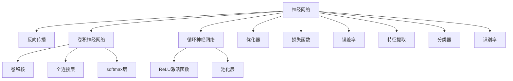

                 

# 神经网络：探索未知的领域

> 关键词：神经网络,深度学习,反向传播,卷积神经网络,循环神经网络,卷积核,ReLU激活函数,池化层,全连接层,softmax层,优化器,反向传播算法,梯度下降,参数更新,损失函数,误差率,特征提取,分类器,识别率

## 1. 背景介绍

### 1.1 问题由来
神经网络（Neural Networks, NNs）是一种模拟人类神经系统工作原理的计算模型，广泛应用于图像识别、语音识别、自然语言处理等众多领域。近年来，随着深度学习技术的不断发展，神经网络模型的复杂度和应用领域不断扩大，极大地推动了人工智能技术的发展。然而，神经网络的设计和优化仍有许多未解之谜，其原理和机制仍未被完全揭示。

### 1.2 问题核心关键点
神经网络的设计和优化是人工智能领域的核心问题之一。其主要包括以下几个关键点：

- 神经网络的架构：如何构建高效的神经网络结构，使其在特定任务上取得最佳性能。
- 神经网络的训练：如何使用反向传播算法优化网络参数，使得模型能够准确地进行特征提取和预测。
- 神经网络的优化：如何设计有效的优化器，避免梯度消失或爆炸，保证模型快速收敛。
- 神经网络的泛化能力：如何在保证模型准确性的同时，提升模型的泛化性能，避免过拟合。
- 神经网络的解释性：如何设计神经网络的结构和优化算法，使得模型的输出和行为具有可解释性，便于理解和调试。

这些关键问题构成了神经网络研究的出发点，推动着神经网络技术不断进步，为人工智能的应用开辟了广阔天地。

## 2. 核心概念与联系

### 2.1 核心概念概述

为更好地理解神经网络的基本原理和设计思想，本节将介绍几个核心概念：

- 神经网络（Neural Network, NN）：由神经元（Neuron）组成的网络结构，用于处理复杂的非线性映射问题。
- 反向传播（Backpropagation）：一种用于训练神经网络的算法，通过计算损失函数对参数的导数，反向传播梯度，更新模型参数。
- 卷积神经网络（Convolutional Neural Network, CNN）：一种特殊类型的神经网络，主要用于图像处理和模式识别任务。
- 循环神经网络（Recurrent Neural Network, RNN）：一种能够处理序列数据的神经网络，主要用于时间序列预测和语言建模任务。
- 池化层（Pooling Layer）：一种用于降低特征图尺寸的层，常见于卷积神经网络中。
- 全连接层（Fully Connected Layer）：一种将输入特征与输出标签直接连接的层，常见于分类器中。
- softmax层：一种用于多分类任务的输出层，能够将模型的输出转化为概率分布。
- 优化器（Optimizer）：一种用于更新模型参数的算法，如梯度下降（Gradient Descent）、Adam、RMSprop等。
- 损失函数（Loss Function）：用于评估模型预测结果与真实标签之间的差异，常见如均方误差（Mean Squared Error, MSE）、交叉熵（Cross Entropy）等。
- 误差率（Error Rate）：用于评估模型在测试集上的表现，计算模型预测错误的样本占总样本的比例。
- 特征提取（Feature Extraction）：神经网络的核心能力之一，通过学习输入数据的特征，提取输入数据的重要信息。
- 分类器（Classifier）：将神经网络作为特征提取器，通过全连接层和softmax层进行分类的模型。
- 识别率（Accuracy）：用于评估模型在测试集上的准确度，计算模型正确预测的样本占总样本的比例。

这些核心概念之间的逻辑关系可以通过以下Mermaid流程图来展示：



这个流程图展示了大神经网络的核心概念及其之间的关系：

1. 神经网络通过反向传播算法更新参数，实现特征提取。
2. 卷积神经网络、循环神经网络是神经网络的主要变体，分别用于图像处理和序列数据处理。
3. 池化层和全连接层是神经网络的重要组件，用于降低特征图尺寸和提取输入特征。
4. softmax层用于多分类任务，输出概率分布。
5. 优化器用于更新模型参数，损失函数用于评估模型性能。
6. 误差率用于评估模型在测试集上的表现，识别率用于评估分类器的准确度。
7. 特征提取是神经网络的核心能力，分类器是神经网络的高级应用。

这些概念共同构成了神经网络的研究基础，推动着神经网络技术的不断发展。

## 3. 核心算法原理 & 具体操作步骤
### 3.1 算法原理概述

神经网络的训练基于反向传播算法，通过不断调整模型参数，使得损失函数最小化。其核心思想是：

- 将输入数据通过一系列线性变换和非线性激活函数，转化为高维特征表示。
- 利用反向传播算法，计算损失函数对模型参数的导数，并根据导数更新模型参数。
- 通过反复迭代，逐渐优化模型参数，使得模型能够准确地进行特征提取和预测。

神经网络的训练过程可以分为以下几个步骤：

1. 前向传播：将输入数据通过网络，计算网络输出。
2. 计算损失：根据网络输出和真实标签，计算损失函数。
3. 反向传播：计算损失函数对网络参数的导数，并反向传播梯度。
4. 更新参数：根据梯度和优化器，更新网络参数。
5. 重复迭代：直到模型收敛或达到预设的迭代次数。

### 3.2 算法步骤详解

以一个简单的二分类任务为例，介绍神经网络的训练过程：

**Step 1: 准备数据集**
- 准备训练集 $D_{train}$ 和测试集 $D_{test}$。
- 将训练集和测试集分为特征 $X$ 和标签 $y$。

**Step 2: 初始化模型参数**
- 随机初始化神经网络的所有参数，包括权重 $w$ 和偏置 $b$。

**Step 3: 前向传播**
- 将输入数据 $x$ 输入网络，计算网络输出 $z$。

**Step 4: 计算损失**
- 根据网络输出 $z$ 和真实标签 $y$，计算损失函数 $L(z,y)$。

**Step 5: 反向传播**
- 计算损失函数 $L(z,y)$ 对网络参数的导数。
- 反向传播导数，更新网络参数 $w$ 和 $b$。

**Step 6: 更新参数**
- 根据优化器，更新网络参数 $w$ 和 $b$。

**Step 7: 重复迭代**
- 重复执行步骤 3-6，直到模型收敛或达到预设的迭代次数。

### 3.3 算法优缺点

神经网络的训练方法具有以下优点：

- 高效的特征提取能力：神经网络通过非线性变换，可以学习输入数据的复杂特征，适用于非线性问题的建模。
- 自动化的模型构建：神经网络能够自动构建模型，无需手动设计网络结构，减少了模型构建的时间和成本。
- 灵活的应用场景：神经网络可以用于图像识别、语音识别、自然语言处理等多个领域，具有广泛的应用前景。

同时，神经网络的训练方法也存在一些局限性：

- 计算资源需求高：神经网络需要大量的计算资源进行训练，训练时间较长，成本较高。
- 模型复杂度高：神经网络的结构较为复杂，训练难度较大，容易出现过拟合等问题。
- 模型的可解释性差：神经网络的内部机制较为复杂，难以解释其决策过程，缺乏可解释性。

尽管存在这些局限性，但神经网络以其强大的特征提取能力和自动化的模型构建，已经成为人工智能领域的重要工具。未来，随着计算资源的进一步丰富和模型的不断优化，神经网络的训练方法和应用前景将更加广阔。

### 3.4 算法应用领域

神经网络的训练方法已经广泛应用于图像识别、语音识别、自然语言处理、推荐系统等多个领域。具体应用如下：

- 图像识别：利用卷积神经网络对图像进行分类、检测和分割。
- 语音识别：利用循环神经网络进行语音特征提取和语音识别。
- 自然语言处理：利用循环神经网络进行语言建模、机器翻译和情感分析。
- 推荐系统：利用神经网络进行用户行为预测和推荐物品。

此外，神经网络的训练方法还在科学研究、金融预测、医疗诊断等多个领域得到了应用，展示了其强大的跨领域迁移能力。

## 4. 数学模型和公式 & 详细讲解  
### 4.1 数学模型构建

神经网络的训练过程可以抽象为数学模型：

设输入数据为 $X$，神经网络参数为 $w$，输出为 $Z$，损失函数为 $L$，优化器为 $Opt$。神经网络的训练过程可以表示为：

$$
Z = f(X, w) \\
L = L(Z, y) \\
w = Opt(w, \nabla_w L)
$$

其中，$f(X, w)$ 表示前向传播过程，$\nabla_w L$ 表示损失函数 $L$ 对参数 $w$ 的梯度，$Opt(w, \nabla_w L)$ 表示优化器更新参数的过程。

### 4.2 公式推导过程

以一个简单的二分类任务为例，推导神经网络训练过程中的关键公式。

假设输入数据 $X$ 为 $n$ 维向量，输出 $Z$ 为 $m$ 维向量，标签 $y$ 为 $m$ 维独热向量。神经网络的参数 $w$ 为 $n \times m$ 的权重矩阵，偏置 $b$ 为 $m$ 维向量。激活函数为 $f$，损失函数为 $L$。

前向传播过程可以表示为：

$$
Z = f(X, w) + b
$$

假设激活函数为 sigmoid 函数，则：

$$
f(Z) = \sigma(Z) = \frac{1}{1 + e^{-Z}}
$$

损失函数 $L$ 可以表示为：

$$
L = -\frac{1}{N}\sum_{i=1}^N[y_i \log f(Z_i) + (1-y_i) \log (1-f(Z_i))]
$$

其中 $N$ 表示样本数量。

反向传播过程中，计算损失函数 $L$ 对权重 $w$ 和偏置 $b$ 的导数，可以表示为：

$$
\nabla_w L = -\frac{1}{N}\sum_{i=1}^N[y_i f(Z_i) - (1-y_i) (1-f(Z_i)) f(Z_i)]
$$

$$
\nabla_b L = -\frac{1}{N}\sum_{i=1}^N[y_i - f(Z_i)]
$$

根据优化器，更新网络参数 $w$ 和 $b$，常见的优化器包括梯度下降（GD）和 Adam 等。

### 4.3 案例分析与讲解

以一个简单的二分类任务为例，分析神经网络训练过程中的关键公式。

假设输入数据为 $X$，神经网络参数为 $w$，输出为 $Z$，标签为 $y$。激活函数为 sigmoid 函数，损失函数为交叉熵损失。

**Step 1: 前向传播**

输入数据 $X$ 经过权重矩阵 $w$ 和偏置 $b$，通过 sigmoid 函数得到输出 $Z$。

$$
Z = \sigma(Xw + b)
$$

**Step 2: 计算损失**

根据输出 $Z$ 和标签 $y$，计算交叉熵损失 $L$。

$$
L = -\frac{1}{N}\sum_{i=1}^N[y_i \log f(Z_i) + (1-y_i) \log (1-f(Z_i))]
$$

**Step 3: 反向传播**

计算损失 $L$ 对权重 $w$ 和偏置 $b$ 的导数，即梯度。

$$
\nabla_w L = -\frac{1}{N}\sum_{i=1}^N[y_i f(Z_i) - (1-y_i) (1-f(Z_i)) f(Z_i)]
$$

$$
\nabla_b L = -\frac{1}{N}\sum_{i=1}^N[y_i - f(Z_i)]
$$

**Step 4: 更新参数**

根据梯度和优化器，更新网络参数 $w$ 和 $b$。

$$
w = w - \eta \nabla_w L \\
b = b - \eta \nabla_b L
$$

其中 $\eta$ 表示学习率。

通过以上步骤，可以不断迭代训练神经网络，逐渐优化模型参数，使得模型能够准确地进行特征提取和预测。

## 5. 项目实践：代码实例和详细解释说明
### 5.1 开发环境搭建

在进行神经网络训练实践前，我们需要准备好开发环境。以下是使用Python进行TensorFlow开发的环境配置流程：

1. 安装Anaconda：从官网下载并安装Anaconda，用于创建独立的Python环境。

2. 创建并激活虚拟环境：
```bash
conda create -n tf-env python=3.8 
conda activate tf-env
```

3. 安装TensorFlow：根据CUDA版本，从官网获取对应的安装命令。例如：
```bash
pip install tensorflow==2.6
```

4. 安装各类工具包：
```bash
pip install numpy pandas scikit-learn matplotlib tqdm jupyter notebook ipython
```

完成上述步骤后，即可在`tf-env`环境中开始神经网络训练实践。

### 5.2 源代码详细实现

这里我们以一个简单的二分类任务为例，给出使用TensorFlow进行神经网络训练的Python代码实现。

```python
import tensorflow as tf
import numpy as np

# 定义神经网络模型
class Model(tf.keras.Model):
    def __init__(self):
        super(Model, self).__init__()
        self.dense1 = tf.keras.layers.Dense(16, activation='relu')
        self.dense2 = tf.keras.layers.Dense(1, activation='sigmoid')

    def call(self, x):
        x = self.dense1(x)
        x = self.dense2(x)
        return x

# 定义损失函数和优化器
model = Model()
loss_fn = tf.keras.losses.BinaryCrossentropy()
optimizer = tf.keras.optimizers.Adam(learning_rate=0.001)

# 定义训练过程
def train_step(x, y):
    with tf.GradientTape() as tape:
        y_pred = model(x)
        loss_value = loss_fn(y_pred, y)
    gradients = tape.gradient(loss_value, model.trainable_variables)
    optimizer.apply_gradients(zip(gradients, model.trainable_variables))

# 准备训练数据
x_train = np.random.rand(100, 10)
y_train = np.random.randint(0, 2, size=100)

# 训练模型
for epoch in range(100):
    train_step(x_train, y_train)
    if epoch % 10 == 0:
        print(f'Epoch {epoch}, loss: {loss_fn(y_train, model(x_train)).numpy()}')
```

以上就是使用TensorFlow进行神经网络训练的完整代码实现。可以看到，TensorFlow提供了便捷的API和组件，可以轻松实现神经网络模型的构建、训练和评估。

### 5.3 代码解读与分析

让我们再详细解读一下关键代码的实现细节：

**Model类**：
- `__init__`方法：初始化神经网络模型的层。
- `call`方法：定义前向传播过程。

**损失函数和优化器**：
- `loss_fn`：定义交叉熵损失函数。
- `optimizer`：定义Adam优化器。

**train_step函数**：
- 使用梯度带包（Gradient Tape）计算损失函数的梯度。
- 使用优化器更新模型参数。

**训练数据**：
- `x_train`：随机生成的输入数据。
- `y_train`：随机生成的标签。

**训练过程**：
- 循环100次，每次更新模型参数。
- 每10个epoch打印一次损失值。

可以看到，TensorFlow提供了强大的API和组件，使得神经网络的构建和训练变得简单易懂。开发者只需关注模型的设计，而不必过多考虑底层实现细节。

当然，工业级的系统实现还需考虑更多因素，如模型的保存和部署、超参数的自动搜索、更灵活的网络结构等。但核心的训练范式基本与此类似。

## 6. 实际应用场景
### 6.1 图像识别

神经网络在图像识别领域有着广泛的应用，主要利用卷积神经网络（CNN）对图像进行分类、检测和分割。常见的应用场景包括：

- 数字识别：识别印刷体数字，如银行支票、车牌号码等。
- 物体识别：识别物体类别，如人脸、车辆、动物等。
- 图像分割：将图像分割成不同的区域，如医学图像中的器官分割。

神经网络在图像识别领域已经取得了显著的成果，推动了自动驾驶、智能监控、医疗影像分析等多个领域的发展。

### 6.2 语音识别

神经网络在语音识别领域也有着广泛的应用，主要利用循环神经网络（RNN）进行语音特征提取和语音识别。常见的应用场景包括：

- 语音转写：将语音信号转写为文字，如语音助手、自动字幕等。
- 语音情感识别：识别语音中的情感，如生气、开心、悲伤等。
- 说话人识别：识别说话人身份，如语音门禁、语音支付等。

神经网络在语音识别领域已经取得了显著的成果，推动了智能家居、智能客服、智能办公等多个领域的发展。

### 6.3 自然语言处理

神经网络在自然语言处理领域有着广泛的应用，主要利用循环神经网络（RNN）和卷积神经网络（CNN）进行语言建模、机器翻译和情感分析。常见的应用场景包括：

- 语言建模：建立语言模型，用于文本生成和语言理解。
- 机器翻译：将一种语言翻译成另一种语言，如Google Translate。
- 情感分析：分析文本中的情感倾向，如情感分析、舆情监测等。

神经网络在自然语言处理领域已经取得了显著的成果，推动了智能客服、智能翻译、情感分析等多个领域的发展。

### 6.4 未来应用展望

随着神经网络技术的不断进步，未来其在各个领域的应用前景更加广阔。

在智慧医疗领域，神经网络可以用于医学图像分析、疾病诊断、药物研发等，提高医疗服务的智能化水平，辅助医生诊疗，加速新药开发进程。

在智能教育领域，神经网络可以用于智能作业批改、学情分析、知识推荐等方面，因材施教，促进教育公平，提高教学质量。

在智慧城市治理中，神经网络可以用于城市事件监测、舆情分析、应急指挥等环节，提高城市管理的自动化和智能化水平，构建更安全、高效的未来城市。

此外，在企业生产、社会治理、文娱传媒等众多领域，神经网络的应用也将不断涌现，为经济社会发展注入新的动力。相信随着技术的日益成熟，神经网络必将在更广阔的应用领域大放异彩，深刻影响人类的生产生活方式。

## 7. 工具和资源推荐
### 7.1 学习资源推荐

为了帮助开发者系统掌握神经网络的理论基础和实践技巧，这里推荐一些优质的学习资源：

1. 《深度学习》（Goodfellow, Bengio & Courville著）：全面介绍了深度学习的基本概念、理论和应用，是深度学习领域的经典教材。
2. 《神经网络与深度学习》（Goodfellow著）：介绍了神经网络的基本原理和应用，是神经网络领域的入门教材。
3. Coursera深度学习课程：由斯坦福大学的Andrew Ng教授主讲，覆盖了深度学习的基本概念和实践技巧。
4 Udacity深度学习纳米学位课程：涵盖了深度学习的基本概念、理论和应用，提供实践项目进行练习。
5 TensorFlow官方文档：提供了详细的TensorFlow API和组件介绍，是TensorFlow的官方学习资源。

通过对这些资源的学习实践，相信你一定能够快速掌握神经网络的理论基础和实践技巧，并用于解决实际的深度学习问题。

### 7.2 开发工具推荐

高效的开发离不开优秀的工具支持。以下是几款用于神经网络开发的常用工具：

1. TensorFlow：由Google主导开发的深度学习框架，支持大规模分布式训练和部署，适用于工业应用。
2. PyTorch：由Facebook主导开发的深度学习框架，灵活性高，适用于科研和工程开发。
3. Keras：基于TensorFlow和Theano的高层次API，简单易用，适用于快速原型开发和模型验证。
4. MXNet：由Amazon主导开发的深度学习框架，支持多种语言，适用于跨平台开发。
5. Caffe：由Berkeley团队开发的深度学习框架，适用于计算机视觉领域的应用。

合理利用这些工具，可以显著提升神经网络的开发效率，加快创新迭代的步伐。

### 7.3 相关论文推荐

神经网络的研究源于学界的持续研究。以下是几篇奠基性的相关论文，推荐阅读：

1. Deep Learning（Goodfellow, Bengio & Courville, 2016）：全面介绍了深度学习的基本概念、理论和应用，是深度学习领域的经典教材。
2. ImageNet Classification with Deep Convolutional Neural Networks（Krizhevsky, Sutskever & Hinton, 2012）：展示了卷积神经网络在图像识别领域的应用，刷新了ImageNet分类任务的SOTA。
3. Learning Phrases, Words, and Sentences from Parallel Corpus（Collobert & Weston, 2008）：展示了循环神经网络在语言建模领域的应用，是循环神经网络的奠基之作。
4 LeNet-5: A Convolutional Neural Network for Handwritten Digit Recognition（LeCun, Bottou, Bengio & Haffner, 1998）：展示了卷积神经网络在手写数字识别领域的应用，是卷积神经网络的奠基之作。

这些论文代表了大神经网络的研究脉络。通过学习这些前沿成果，可以帮助研究者把握学科前进方向，激发更多的创新灵感。

## 8. 总结：未来发展趋势与挑战

### 8.1 总结

本文对神经网络的训练方法进行了全面系统的介绍。首先阐述了神经网络训练的基本原理和设计思想，明确了神经网络在各个领域的应用。其次，从原理到实践，详细讲解了神经网络训练过程的数学模型和关键公式，给出了神经网络训练的完整代码实例。同时，本文还广泛探讨了神经网络在图像识别、语音识别、自然语言处理等多个领域的应用前景，展示了神经网络技术的广泛应用前景。

通过本文的系统梳理，可以看到，神经网络训练方法已经成为人工智能领域的重要工具，极大地推动了各个领域的技术进步。未来，伴随深度学习技术的进一步发展，神经网络的训练方法和应用前景将更加广阔。

### 8.2 未来发展趋势

展望未来，神经网络训练技术将呈现以下几个发展趋势：

1. 模型规模持续增大。随着算力成本的下降和数据规模的扩张，神经网络模型的参数量还将持续增长。超大规模神经网络蕴含的丰富特征表示，有望支撑更加复杂多变的下游任务。
2. 模型结构更加灵活。未来的神经网络将不再局限于传统的全连接层和卷积层，将出现更多新型结构，如Transformer、Attention等。
3. 训练方法更加高效。未来的训练方法将更加高效，如分布式训练、混合精度训练、动态图优化等，提高神经网络的训练效率。
4. 模型应用更加广泛。神经网络将进一步拓展到更多的领域，如金融、医疗、交通等，为各个领域提供智能化解决方案。
5. 模型可解释性增强。未来的神经网络将更加注重可解释性，通过可视化、逻辑推理等方法，使得模型的输出和行为更加透明。

这些趋势凸显了神经网络训练技术的广阔前景。这些方向的探索发展，必将进一步提升神经网络的性能和应用范围，为人工智能的应用开辟新的道路。

### 8.3 面临的挑战

尽管神经网络训练技术已经取得了显著的进展，但在迈向更加智能化、普适化应用的过程中，它仍面临诸多挑战：

1. 计算资源需求高。神经网络需要大量的计算资源进行训练，训练时间较长，成本较高。如何降低计算资源需求，提高训练效率，成为未来的重要课题。
2. 模型可解释性差。神经网络的内部机制较为复杂，难以解释其决策过程，缺乏可解释性。如何设计神经网络的结构和优化算法，使得模型的输出和行为具有可解释性，将成为亟待攻克的难题。
3. 数据隐私和安全问题。神经网络在训练过程中会涉及大量的敏感数据，如何保护数据隐私和安全，防止数据泄露和滥用，成为未来的重要研究方向。
4. 模型偏见和歧视问题。神经网络在训练过程中可能会学习到有偏见、有害的信息，如何避免模型的偏见和歧视，确保模型的公平性，将是未来的重要课题。
5. 模型鲁棒性不足。神经网络在面对域外数据时，泛化性能往往大打折扣。如何提高神经网络的鲁棒性，避免灾难性遗忘，将是未来的重要研究方向。

这些挑战凸显了神经网络训练技术的复杂性和复杂性。只有勇于面对并积极应对这些挑战，才能推动神经网络技术不断进步，为人工智能的应用提供更强大的工具。

### 8.4 研究展望

面对神经网络训练技术所面临的挑战，未来的研究需要在以下几个方面寻求新的突破：

1. 探索新的神经网络结构。设计更加高效、灵活的神经网络结构，如Transformer、Attention等，提高神经网络的训练效率和性能。
2. 研究新的训练方法。开发更加高效、鲁棒的训练方法，如分布式训练、混合精度训练、动态图优化等，提高神经网络的训练效率和鲁棒性。
3. 引入更多先验知识。将符号化的先验知识，如知识图谱、逻辑规则等，与神经网络模型进行融合，增强模型的泛化能力和解释性。
4. 研究模型偏见和歧视问题。设计公平、无偏的神经网络模型，避免模型的偏见和歧视，确保模型的公平性。
5. 研究数据隐私和安全问题。设计隐私保护、安全的神经网络模型，保护数据隐私和安全，防止数据泄露和滥用。

这些研究方向的探索，必将引领神经网络训练技术迈向更高的台阶，为人工智能的应用提供更强大的工具。面向未来，神经网络训练技术还需要与其他人工智能技术进行更深入的融合，如知识表示、因果推理、强化学习等，多路径协同发力，共同推动人工智能技术的发展。只有勇于创新、敢于突破，才能不断拓展神经网络技术的边界，让智能技术更好地造福人类社会。

## 9. 附录：常见问题与解答

**Q1：神经网络是否适用于所有领域？**

A: 神经网络在各个领域都有广泛的应用，但在特定领域，如医学、法律等，可能需要根据领域特点进行特定的设计和优化。此外，对于一些需要时效性、个性化很强的任务，如对话、推荐等，神经网络也需要针对性的改进优化。

**Q2：如何选择合适的神经网络架构？**

A: 神经网络架构的选择应根据具体任务的特点和数据特点进行选择。常见的架构包括全连接神经网络、卷积神经网络、循环神经网络等。对于图像识别任务，应选择卷积神经网络；对于自然语言处理任务，应选择循环神经网络。

**Q3：神经网络的训练过程中应如何避免过拟合？**

A: 避免过拟合的方法包括数据增强、正则化、早停等。数据增强方法包括图像旋转、裁剪、加噪声等；正则化方法包括L1正则化、L2正则化、Dropout等；早停方法是指在验证集上监测模型性能，一旦性能不再提升，立即停止训练。

**Q4：神经网络的训练过程中应如何选择合适的学习率？**

A: 学习率的选择应根据具体任务和数据特点进行选择。常见的学习率选择方法包括手动调整、学习率衰减、学习率调度等。手动调整方法需要根据实验结果进行调整；学习率衰减方法包括学习率逐步降低；学习率调度方法包括学习率在训练初期较小，随着训练次数增加逐步增大。

**Q5：神经网络在实际应用中应如何提高模型的解释性？**

A: 提高模型解释性的方法包括可视化、逻辑推理等。可视化方法包括绘制梯度图、绘制激活图等；逻辑推理方法包括引入符号化知识、引入规则引擎等。

这些方法可以帮助开发者更好地理解神经网络的工作机制，提高模型的解释性和可控性。

---

作者：禅与计算机程序设计艺术 / Zen and the Art of Computer Programming

