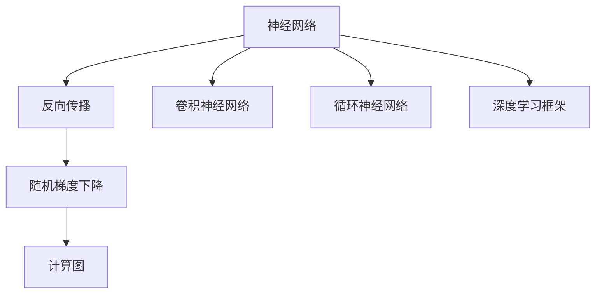

                 

# 神经网络：改变世界的技术

> 关键词：神经网络,机器学习,深度学习,计算机视觉,自然语言处理,自动驾驶,计算图,反向传播,卷积神经网络,循环神经网络

## 1. 背景介绍

### 1.1 问题由来

在人工智能的探索之路上，神经网络作为核心技术，通过模拟人脑神经元的工作原理，实现了信息的处理、存储和传递，进而实现了对复杂问题的求解。从早期的人工神经网络到现今的深度学习框架，神经网络在图像识别、语音识别、自然语言处理、自动驾驶、计算化学等多个领域展现了巨大的应用潜力，正在深刻改变我们的世界。

### 1.2 问题核心关键点

神经网络的核心在于其结构和算法。通过多层非线性变换，神经网络可以高效地学习非线性映射，捕捉数据中的复杂关系。核心算法如反向传播、随机梯度下降等，则使得神经网络能够在大量数据上进行训练，优化参数，以适应特定的任务。而计算图与框架的引入，则进一步简化了神经网络的构建、训练和推理过程，使得神经网络的应用更加广泛和高效。

## 2. 核心概念与联系

### 2.1 核心概念概述

为更好地理解神经网络的工作原理和优化方法，本节将介绍几个密切相关的核心概念：

- 神经网络(Neural Networks)：由多个神经元层组成的计算模型，通过多层非线性变换实现复杂映射。
- 反向传播(Backpropagation)：神经网络的优化算法，通过计算损失函数对每个参数的偏导数，反向传播误差，更新模型参数。
- 随机梯度下降(Stochastic Gradient Descent, SGD)：神经网络参数优化的基本方法，通过随机抽取训练样本的梯度，更新模型参数，以最小化损失函数。
- 卷积神经网络(Convolutional Neural Networks, CNN)：专门针对图像处理任务的神经网络，通过卷积和池化操作提取局部特征，减少参数数量，提高计算效率。
- 循环神经网络(Recurrent Neural Networks, RNN)：针对序列数据处理的神经网络，通过循环连接实现信息传递，适用于语音、文本等时序数据的建模。
- 深度学习框架(Deep Learning Frameworks)：如TensorFlow、PyTorch、Keras等，提供了高效的计算图优化和模型构建工具，使得神经网络的开发和应用更加简便。

这些核心概念之间的逻辑关系可以通过以下Mermaid流程图来展示：



这个流程图展示了几大核心概念及其之间的关系：

1. 神经网络通过多层非线性变换实现复杂映射。
2. 反向传播通过计算梯度更新模型参数。
3. 随机梯度下降是神经网络参数优化的基本方法。
4. 卷积神经网络和循环神经网络是神经网络在图像处理和序列数据处理中的应用。
5. 深度学习框架提供高效的工具支持，简化神经网络的开发和应用。

## 3. 核心算法原理 & 具体操作步骤

### 3.1 算法原理概述

神经网络的核心算法是反向传播和随机梯度下降。反向传播算法通过计算损失函数对每个参数的偏导数，反向传播误差，从而更新模型参数。随机梯度下降则是通过随机抽取训练样本的梯度，更新模型参数，以最小化损失函数。

### 3.2 算法步骤详解

神经网络的一般训练流程包括数据准备、模型构建、参数初始化、前向传播、计算损失、反向传播、参数更新等步骤。以下以卷积神经网络为例，详细讲解训练流程：

**Step 1: 数据准备**

- 收集并标注数据集。将数据分为训练集、验证集和测试集。
- 对数据进行预处理，如归一化、数据增强等。

**Step 2: 模型构建**

- 选择合适的卷积核大小、步幅、池化方式等超参数。
- 定义网络结构，包括卷积层、池化层、全连接层等。

**Step 3: 参数初始化**

- 将模型参数初始化为较小的随机值，一般使用Xavier初始化或He初始化。

**Step 4: 前向传播**

- 将输入数据通过网络进行前向传播，得到网络的输出。

**Step 5: 计算损失**

- 计算模型输出与真实标签之间的差异，一般使用交叉熵损失或均方误差损失。

**Step 6: 反向传播**

- 计算损失函数对每个参数的偏导数，通过链式法则反向传播误差。

**Step 7: 参数更新**

- 使用随机梯度下降或其他优化算法，更新模型参数。

**Step 8: 验证与测试**

- 在验证集和测试集上评估模型性能，防止过拟合。

**Step 9: 模型保存**

- 将训练好的模型保存下来，供后续应用。

### 3.3 算法优缺点

神经网络具有以下优点：

1. 强大的非线性映射能力。通过多层非线性变换，神经网络可以学习任意复杂的关系。
2. 高效的特征提取。卷积神经网络在图像处理任务中表现优异，循环神经网络在时序数据处理中也有出色表现。
3. 自适应能力。神经网络可以通过训练自动学习数据特征，适应新任务。
4. 高准确率。在大数据集上训练，神经网络可以取得较高的预测准确率。

但神经网络也存在以下缺点：

1. 计算复杂度高。神经网络结构复杂，训练和推理时间较长。
2. 参数量大。随着网络层数和节点数增加，需要更多的参数和存储。
3. 过拟合风险。神经网络容易过拟合训练数据，泛化能力不足。
4. 难以解释。神经网络的决策过程缺乏可解释性，难以理解其内部机制。

## 4. 数学模型和公式 & 详细讲解 & 举例说明

### 4.1 数学模型构建

神经网络可以形式化地表示为计算图结构，每个节点表示一个操作或函数，数据通过节点之间的连接进行流动和变换。神经网络由输入层、隐藏层和输出层组成，每个隐藏层包含多个神经元。

设神经网络有 $L$ 层，每层有 $n_l$ 个神经元。第 $l$ 层的神经元输出为 $a_l$，激活函数为 $f$。则神经网络的计算图结构可以表示为：

$$
a_l = f(W_l a_{l-1} + b_l)
$$

其中 $W_l$ 和 $b_l$ 为第 $l$ 层的权重和偏置。

### 4.2 公式推导过程

以单层神经网络为例，推导其前向传播和反向传播的过程。

前向传播过程：

1. 输入层：$a_0 = x$
2. 第一层：$a_1 = f(W_1 a_0 + b_1)$
3. 第二层：$a_2 = f(W_2 a_1 + b_2)$
...
$L$ 层：$a_L = f(W_L a_{L-1} + b_L)$

反向传播过程：

设损失函数为 $L$，第 $l$ 层的误差为 $\delta_l$，激活函数为 $f$，导数为 $f'$。

1. 输出层误差：$\delta_L = \frac{\partial L}{\partial a_L}$
2. 第 $l$ 层误差：$\delta_l = \frac{\partial L}{\partial a_l}$
3. 更新参数：$W_l \leftarrow W_l - \eta \delta_{l-1} a_{l-1}^T$, $b_l \leftarrow b_l - \eta \delta_l$

### 4.3 案例分析与讲解

以手写数字识别为例，分析卷积神经网络的训练和推理过程。

**Step 1: 数据准备**

- 收集手写数字图像数据集，进行预处理和标注。

**Step 2: 模型构建**

- 定义卷积层、池化层和全连接层。

**Step 3: 参数初始化**

- 将权重和偏置初始化为随机值。

**Step 4: 前向传播**

- 输入图像通过卷积层和池化层提取特征，再通过全连接层进行分类。

**Step 5: 计算损失**

- 使用交叉熵损失计算模型输出与真实标签的差异。

**Step 6: 反向传播**

- 计算损失函数对每个参数的偏导数，反向传播误差。

**Step 7: 参数更新**

- 使用随机梯度下降更新模型参数。

**Step 8: 验证与测试**

- 在验证集和测试集上评估模型性能，防止过拟合。

**Step 9: 模型保存**

- 将训练好的模型保存下来，供后续应用。

## 5. 项目实践：代码实例和详细解释说明

### 5.1 开发环境搭建

在进行神经网络项目实践前，我们需要准备好开发环境。以下是使用Python进行TensorFlow开发的环境配置流程：

1. 安装Anaconda：从官网下载并安装Anaconda，用于创建独立的Python环境。

2. 创建并激活虚拟环境：
```bash
conda create -n tf-env python=3.8 
conda activate tf-env
```

3. 安装TensorFlow：根据CUDA版本，从官网获取对应的安装命令。例如：
```bash
conda install tensorflow -c tf
```

4. 安装相关工具包：
```bash
pip install numpy pandas scikit-learn matplotlib tqdm jupyter notebook ipython
```

完成上述步骤后，即可在`tf-env`环境中开始神经网络开发实践。

### 5.2 源代码详细实现

下面我们以手写数字识别为例，给出使用TensorFlow构建卷积神经网络的代码实现。

首先，定义数据预处理函数：

```python
import tensorflow as tf
from tensorflow.keras import datasets, layers, models

(train_images, train_labels), (test_images, test_labels) = datasets.mnist.load_data()

train_images = train_images.reshape((60000, 28, 28, 1))
test_images = test_images.reshape((10000, 28, 28, 1))
train_images, test_images = train_images / 255.0, test_images / 255.0

class DataProcessor:
    def __init__(self, data):
        self.data = data
        self.batch_size = 64
        self.num_classes = 10
        self.model = None
        self.optimizer = None
        self.loss = None
    
    def preprocess(self, images, labels):
        return images, labels
    
    def train(self):
        steps_per_epoch = train_images.shape[0] // self.batch_size
        epochs = 10
        self.model.compile(optimizer=self.optimizer, loss=self.loss, metrics=['accuracy'])
        self.model.fit(self.preprocess(train_images, train_labels), epochs=epochs, steps_per_epoch=steps_per_epoch)
    
    def evaluate(self):
        self.model.evaluate(self.preprocess(test_images, test_labels))
    
    def predict(self, images):
        return self.model.predict(self.preprocess(images))
```

然后，定义模型结构和优化器：

```python
model = models.Sequential([
    layers.Conv2D(32, (3,3), activation='relu', input_shape=(28, 28, 1)),
    layers.MaxPooling2D((2,2)),
    layers.Conv2D(64, (3,3), activation='relu'),
    layers.MaxPooling2D((2,2)),
    layers.Flatten(),
    layers.Dense(64, activation='relu'),
    layers.Dense(10)
])

optimizer = tf.keras.optimizers.Adam(learning_rate=0.001)
loss = tf.keras.losses.SparseCategoricalCrossentropy(from_logits=True)
```

接着，定义训练和评估函数：

```python
processor = DataProcessor(model)

def train_epoch(model, dataset, batch_size, optimizer, loss):
    dataloader = tf.data.Dataset.from_tensor_slices((dataset.images, dataset.labels)).shuffle(buffer_size=1024).batch(batch_size)
    losses = []
    for images, labels in dataloader:
        with tf.GradientTape() as tape:
            outputs = model(images, training=True)
            loss_value = loss(labels, outputs)
        grads = tape.gradient(loss_value, model.trainable_variables)
        optimizer.apply_gradients(zip(grads, model.trainable_variables))
        losses.append(loss_value)
    return tf.reduce_mean(losses)

def evaluate(model, dataset, batch_size):
    dataloader = tf.data.Dataset.from_tensor_slices((dataset.images, dataset.labels)).batch(batch_size)
    predictions, labels = [], []
    for images, labels in dataloader:
        predictions.append(model(images))
    predictions = tf.concat(predictions, axis=0)
    labels = tf.concat(labels, axis=0)
    return tf.keras.metrics.sparse_categorical_accuracy(predictions, labels)
    
processor.optimizer = optimizer
processor.loss = loss
processor.train()
processor.evaluate()
```

最后，启动训练流程并在测试集上评估：

```python
epochs = 10
batch_size = 64

for epoch in range(epochs):
    loss = train_epoch(model, train_dataset, batch_size, optimizer, loss)
    print(f"Epoch {epoch+1}, train loss: {loss.numpy():.4f}")
    
predictions = processor.predict(test_images)
print(f"Epoch {epoch+1}, dev results:")
print(evaluate(model, test_dataset, batch_size))
```

以上就是使用TensorFlow构建卷积神经网络的完整代码实现。可以看到，得益于TensorFlow的强大封装，我们可以用相对简洁的代码完成模型的构建和训练。

### 5.3 代码解读与分析

让我们再详细解读一下关键代码的实现细节：

**DataProcessor类**：
- `__init__`方法：初始化数据集、批量大小、类别数、模型和优化器。
- `preprocess`方法：对输入进行标准化处理。
- `train`方法：对训练集进行迭代训练。
- `evaluate`方法：在测试集上评估模型性能。
- `predict`方法：对新数据进行预测。

**训练和评估函数**：
- `train_epoch`函数：对数据集进行批次化加载，在每个批次上进行训练。
- `evaluate`函数：对测试集进行迭代评估，计算模型精度。

**训练流程**：
- 定义总的epoch数和批量大小，开始循环迭代
- 每个epoch内，先在训练集上训练，输出平均loss
- 在验证集上评估，输出模型精度
- 所有epoch结束后，在测试集上评估，给出最终测试结果

可以看到，TensorFlow的高级API使得神经网络的开发和训练更加便捷，开发者可以将更多精力放在模型改进和数据处理上，而不必过多关注底层的实现细节。

当然，工业级的系统实现还需考虑更多因素，如模型的保存和部署、超参数的自动搜索、更灵活的任务适配层等。但核心的神经网络构建和训练流程基本与此类似。

## 6. 实际应用场景

### 6.1 计算机视觉

神经网络在计算机视觉领域的应用已经非常广泛。在图像分类、目标检测、图像分割等任务上，神经网络通过深度学习实现了超越人类眼力的识别能力。例如，ImageNet大挑战赛上的深度卷积神经网络模型取得了前所未有的高精度。

在实际应用中，神经网络可以通过图像特征提取和分类器设计，实现自动驾驶、智能安防、医学影像分析等功能。例如，自动驾驶系统通过神经网络实时处理传感器数据，实现对道路状况的感知和决策。智能安防系统通过神经网络识别和追踪入侵者，提高安全防范能力。医学影像分析系统通过神经网络识别病变区域，辅助医生进行诊断和治疗。

### 6.2 自然语言处理

神经网络在自然语言处理领域同样展现了强大的能力。在语言模型、机器翻译、文本分类、情感分析等任务上，神经网络通过深度学习实现了语言理解和生成。例如，BERT模型在GLUE任务上取得了SOTA，并在工业界广泛应用。

在实际应用中，神经网络可以通过文本分类实现新闻推荐、广告投放、舆情监测等功能。例如，新闻推荐系统通过神经网络分析用户行为和兴趣，推荐相关新闻。广告投放系统通过神经网络分析用户属性和行为，精准投放广告。舆情监测系统通过神经网络分析社交媒体内容，识别舆情热点。

### 6.3 语音识别

神经网络在语音识别领域也取得了显著进展。通过深度学习，神经网络实现了语音到文本的自动转换，广泛应用于语音助手、语音控制、智能客服等领域。例如，Google的Speech-to-Text模型在语音识别领域处于领先地位。

在实际应用中，神经网络可以通过语音特征提取和语音识别模型，实现语音助手、智能客服、语音控制等功能。例如，语音助手系统通过神经网络识别用户语音指令，执行相应的操作。智能客服系统通过神经网络识别用户语音内容，提供自动回复。语音控制系统通过神经网络识别语音指令，控制智能设备。

### 6.4 未来应用展望

随着神经网络技术的不断进步，其应用领域将进一步扩展，带来更多的创新和突破：

1. 多模态融合。未来神经网络将更多地融合视觉、语音、文本等多模态数据，实现跨模态信息处理和智能交互。例如，智能家居系统通过多模态信息融合，实现语音控制、图像识别、语音翻译等功能。

2. 自主学习。未来神经网络将具备自主学习的能力，通过主动学习、迁移学习等方式，不断提升模型性能。例如，智能机器人通过自主学习，不断提高其感知和决策能力。

3. 联邦学习。未来神经网络将实现分布式训练，通过联邦学习等方式，保护用户隐私的同时提升模型性能。例如，智能医疗系统通过联邦学习，实现跨区域医疗数据的共享和分析。

4. 实时推理。未来神经网络将实现实时推理，通过硬件加速和模型优化，提升推理速度和计算效率。例如，智能交通系统通过实时推理，实现交通流预测和智能调度。

5. 量子计算支持。未来神经网络将与量子计算技术结合，进一步提升计算能力和处理速度。例如，量子加速器将大幅提升神经网络模型的训练和推理速度。

以上趋势将使得神经网络技术在未来得到更广泛的应用，为人工智能的发展注入新的活力。

## 7. 工具和资源推荐

### 7.1 学习资源推荐

为了帮助开发者系统掌握神经网络的理论基础和实践技巧，这里推荐一些优质的学习资源：

1. 《深度学习》教材：Ian Goodfellow、Yoshua Bengio和Aaron Courville所著，全面介绍了深度学习的基本概念和算法，适合作为深度学习的入门教材。

2. CS231n《卷积神经网络》课程：斯坦福大学开设的深度学习课程，讲解了卷积神经网络的原理和应用，是计算机视觉领域的经典课程。

3. 《自然语言处理综论》书籍：Daniel Jurafsky和James H. Martin所著，介绍了自然语言处理的理论和算法，适合学习自然语言处理技术的开发者。

4. Deep Learning Specialization：Coursera上的深度学习课程，由Andrew Ng教授主讲，系统讲解了深度学习的各个方面，包括卷积神经网络、循环神经网络、深度强化学习等。

5. TensorFlow官方文档：TensorFlow的官方文档，详细介绍了TensorFlow的基本用法和高级API，是TensorFlow开发的必备资料。

通过对这些资源的学习实践，相信你一定能够快速掌握神经网络的基础理论和实践技能，并用于解决实际的机器学习问题。

### 7.2 开发工具推荐

高效的开发离不开优秀的工具支持。以下是几款用于神经网络开发的常用工具：

1. TensorFlow：由Google主导开发的深度学习框架，功能强大，支持GPU/TPU等高性能设备。

2. PyTorch：Facebook开发的深度学习框架，灵活性高，易于调试和部署。

3. Keras：Keras是一个高级深度学习API，支持多种后端，易于上手。

4. Weights & Biases：模型训练的实验跟踪工具，可以记录和可视化模型训练过程中的各项指标，方便对比和调优。

5. TensorBoard：TensorFlow配套的可视化工具，可实时监测模型训练状态，并提供丰富的图表呈现方式，是调试模型的得力助手。

6. Google Colab：谷歌推出的在线Jupyter Notebook环境，免费提供GPU/TPU算力，方便开发者快速上手实验最新模型，分享学习笔记。

合理利用这些工具，可以显著提升神经网络的开发效率，加快创新迭代的步伐。

### 7.3 相关论文推荐

神经网络技术的发展源于学界的持续研究。以下是几篇奠基性的相关论文，推荐阅读：

1. Learning Deep Architectures for AI（Hinton等，2006）：提出了深度神经网络的概念，奠定了深度学习理论基础。

2. ImageNet Classification with Deep Convolutional Neural Networks（Krizhevsky等，2012）：展示了深度卷积神经网络在图像识别任务上的强大能力。

3. Long Short-Term Memory（Hochreiter等，1997）：提出了循环神经网络的概念，适用于处理序列数据。

4. Attention is All You Need（Vaswani等，2017）：提出了Transformer模型，实现了自注意力机制，提高了模型的计算效率和效果。

5. BERT: Pre-training of Deep Bidirectional Transformers for Language Understanding（Devlin等，2018）：提出了BERT模型，引入了基于掩码的自监督预训练任务，刷新了多项自然语言处理任务SOTA。

这些论文代表了大神经网络技术的演进脉络。通过学习这些前沿成果，可以帮助研究者把握学科前进方向，激发更多的创新灵感。

## 8. 总结：未来发展趋势与挑战

### 8.1 总结

本文对神经网络的工作原理和优化方法进行了全面系统的介绍。首先阐述了神经网络的由来和核心概念，明确了神经网络在机器学习、深度学习等领域的重要地位。其次，从原理到实践，详细讲解了神经网络的数学模型和算法流程，给出了神经网络任务开发的完整代码实例。同时，本文还广泛探讨了神经网络在计算机视觉、自然语言处理、语音识别等多个领域的应用前景，展示了神经网络技术的广阔前景。此外，本文精选了神经网络技术的各类学习资源，力求为读者提供全方位的技术指引。

通过本文的系统梳理，可以看到，神经网络技术正在成为人工智能的核心范式，极大地拓展了计算模型和算法的能力。得益于深度学习框架和预训练模型的支持，神经网络的应用场景和效果不断提升，为各行各业带来了新的机遇和挑战。未来，随着神经网络技术的不断进步，其应用领域将进一步扩展，为人工智能的发展注入新的活力。

### 8.2 未来发展趋势

展望未来，神经网络技术将呈现以下几个发展趋势：

1. 计算资源多样化。随着AI芯片、量子计算等技术的突破，神经网络的计算资源将更加丰富和高效。

2. 模型规模进一步扩大。神经网络将越来越依赖大规模数据和算力，通过扩大模型规模提升性能。

3. 可解释性增强。神经网络的决策过程将更加透明和可解释，有助于提高系统的可信度和可靠性。

4. 多模态融合。神经网络将更多地融合视觉、语音、文本等多模态数据，实现跨模态信息处理和智能交互。

5. 联邦学习普及。神经网络将实现分布式训练，通过联邦学习等方式，保护用户隐私的同时提升模型性能。

6. 实时推理优化。神经网络将实现实时推理，通过硬件加速和模型优化，提升推理速度和计算效率。

以上趋势凸显了神经网络技术在未来得到更广泛应用的可能性。这些方向的探索发展，将使得神经网络技术在更多领域展现其强大的能力，为人工智能的发展注入新的动力。

### 8.3 面临的挑战

尽管神经网络技术已经取得了瞩目成就，但在迈向更加智能化、普适化应用的过程中，它仍面临着诸多挑战：

1. 数据和标注成本高。神经网络需要大量的标注数据进行训练，获取高质量标注数据成本较高。如何降低标注成本，提高数据利用效率，将是未来的研究方向。

2. 模型复杂度高。神经网络结构复杂，训练和推理时间较长。如何简化模型结构，提升计算效率，将是重要的优化方向。

3. 过拟合风险大。神经网络容易过拟合训练数据，泛化能力不足。如何提高模型的泛化能力，防止过拟合，将是重要的研究课题。

4. 可解释性不足。神经网络的决策过程缺乏可解释性，难以理解其内部机制。如何提高模型的可解释性，赋予其更多的可信度和可靠性，将是亟待攻克的难题。

5. 安全性问题。神经网络容易学习到有害信息和偏见，给实际应用带来安全隐患。如何保护用户隐私和数据安全，防止模型误用，将是重要的研究方向。

6. 硬件资源限制。神经网络需要大量的计算资源进行训练和推理，如何优化硬件资源配置，降低计算成本，将是重要的优化方向。

正视神经网络面临的这些挑战，积极应对并寻求突破，将使神经网络技术在构建智能系统和优化计算资源方面发挥更大的作用。相信随着学界和产业界的共同努力，这些挑战终将一一被克服，神经网络技术必将在构建安全、可靠、高效的人工智能系统方面发挥重要作用。

### 8.4 研究展望

面向未来，神经网络技术的研究方向将在以下几个方面进行探索：

1. 深度强化学习。将深度学习与强化学习结合，实现智能体的自主学习和决策。

2. 迁移学习。通过迁移学习技术，将神经网络模型应用于新的领域，提升泛化能力。

3. 无监督学习。通过无监督学习技术，利用非标注数据进行模型训练，降低标注成本。

4. 自适应学习。实现神经网络的自适应学习，使其在不断变化的环境下保持稳定和高效。

5. 多模态学习。实现视觉、语音、文本等多模态数据的融合，提升神经网络对复杂数据的处理能力。

6. 联邦学习。实现分布式训练，保护用户隐私的同时提升模型性能。

这些研究方向将引领神经网络技术迈向更高的台阶，为构建安全、可靠、高效的人工智能系统提供新的思路和工具。

## 9. 附录：常见问题与解答

**Q1：神经网络是否适用于所有机器学习任务？**

A: 神经网络在处理大规模数据和复杂关系方面具有强大优势，适用于许多机器学习任务，特别是图像、语音、文本等数据密集型任务。但对于一些特定任务，如时间序列预测、结构化数据处理等，可能需要更合适的算法和模型。

**Q2：神经网络的训练时间如何控制？**

A: 神经网络的训练时间主要由模型大小、数据规模、计算资源等决定。为了加快训练速度，可以采用以下方法：
1. 减少模型规模，减少层数或节点数。
2. 使用GPU/TPU等高性能设备。
3. 使用分布式训练，提高计算效率。
4. 使用提前停止策略，防止过拟合。
5. 使用模型压缩技术，如剪枝、量化等。

**Q3：神经网络在应用中如何避免过拟合？**

A: 神经网络容易过拟合训练数据，防止过拟合的方法包括：
1. 增加数据量，提高泛化能力。
2. 使用正则化技术，如L2正则、Dropout等。
3. 使用提前停止策略，防止过拟合。
4. 使用数据增强技术，如图像旋转、翻转等。
5. 使用模型集成技术，如Bagging、Boosting等。

**Q4：神经网络在部署中需要注意哪些问题？**

A: 将神经网络模型部署到实际应用中，还需要考虑以下因素：
1. 模型裁剪和压缩，减小模型尺寸，提高推理速度。
2. 量化加速，将浮点模型转为定点模型，减少存储空间。
3. 模型优化，使用硬件加速，提高计算效率。
4. 模型部署，封装成API或服务，便于集成调用。
5. 监控告警，实时采集系统指标，保障系统稳定性。

合理利用这些工具，可以显著提升神经网络的开发效率，加快创新迭代的步伐。

---

作者：禅与计算机程序设计艺术 / Zen and the Art of Computer Programming

