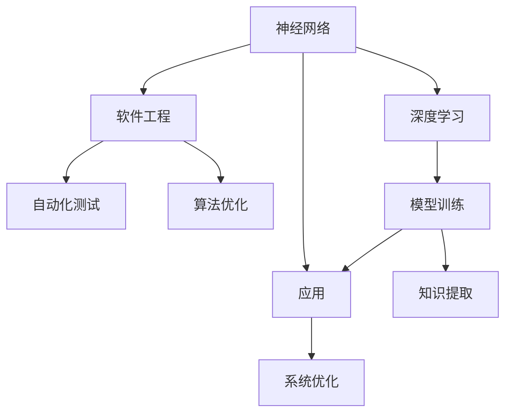

                 

# 神经网络：软件开发的根本性转变

> 关键词：神经网络,深度学习,软件工程,软件开发,算法优化,自动化,自动化测试,模型训练,软件架构

## 1. 背景介绍

### 1.1 问题由来
随着计算机技术的快速发展，软件开发的范式也在不断进化。从早期的人工编码到自动化构建工具，再到人工智能辅助设计，软件开发逐渐从手工匠艺向科学工程技术转变。而这一转变中，最根本的推动力之一便是深度学习技术在软件开发中的应用。

### 1.2 问题核心关键点
神经网络作为深度学习的重要组成部分，以其强大的学习能力、泛化能力，在软件开发中日益显示出巨大潜力。神经网络可以对复杂数据模式进行抽象，自动化地从海量数据中学习出有价值的知识。这不仅提高了软件的开发效率，还降低了开发成本，改变了软件开发的方式。

### 1.3 问题研究意义
研究神经网络在软件开发中的应用，对于推动软件开发自动化、提升软件质量、优化软件架构设计，具有重要意义：

1. 加速软件开发：神经网络可以快速自动化地完成复杂的数据分析、算法设计等工作，大大提高软件开发效率。
2. 提升软件质量：通过学习和应用先进的神经网络算法，软件产品能够具备更强的适应性、稳定性和可靠性。
3. 优化软件架构：神经网络可以自动分析软件架构中的关键组件和数据流，辅助进行架构设计优化。
4. 促进技术创新：神经网络的应用，促进了人工智能与传统软件工程的深度融合，催生了新的技术方向和应用模式。

## 2. 核心概念与联系

### 2.1 核心概念概述

为更好地理解神经网络在软件开发中的应用，本节将介绍几个密切相关的核心概念：

- **神经网络(Neural Network)**：一种通过多层神经元进行非线性数据变换的计算模型，广泛用于图像识别、语音识别、自然语言处理等任务。
- **深度学习(Deep Learning)**：基于神经网络，通过多层网络结构实现复杂数据处理和模式学习，是神经网络在人工智能领域的重要应用。
- **软件工程(Software Engineering)**：一门研究软件生命周期各个阶段的科学，包括需求分析、设计、编码、测试、部署和维护等环节。
- **自动化测试(Automatic Testing)**：使用自动化工具和算法，对软件进行全面的测试，发现潜在问题和缺陷，提升软件质量。
- **算法优化(Algorithm Optimization)**：通过算法改进和优化，提升神经网络在特定任务上的性能，如降低误差、提高速度等。

这些核心概念之间的逻辑关系可以通过以下Mermaid流程图来展示：



这个流程图展示了神经网络、深度学习、软件工程、自动化测试、算法优化等核心概念之间的联系和应用流程：

1. 神经网络通过深度学习训练，从大量数据中学习知识。
2. 软件工程将神经网络应用于软件系统设计，实现自动化。
3. 自动化测试使用神经网络算法优化，提高测试效率和覆盖率。
4. 算法优化不断改进神经网络性能，实现更高效的模型训练和推理。

这些概念共同构成了神经网络在软件开发中的应用框架，使其能够充分发挥强大的数据分析能力，推动软件开发向智能化、自动化方向发展。

## 3. 核心算法原理 & 具体操作步骤
### 3.1 算法原理概述

神经网络在软件开发中的应用，核心思想是通过对软件系统中的数据模式进行学习，自动生成优化方案和设计建议，从而提升软件开发效率和质量。其基本原理如下：

1. **数据输入**：神经网络接受软件系统的输入数据，如代码片段、系统架构图、运行日志等。
2. **特征提取**：通过多层神经网络对输入数据进行特征提取，学习出其中的数据模式和规律。
3. **优化输出**：神经网络输出优化建议，如代码优化策略、架构设计改进方案等，供开发者参考。

### 3.2 算法步骤详解

神经网络在软件开发中的应用一般包括以下几个关键步骤：

**Step 1: 数据准备**
- 收集软件系统的输入数据，如代码片段、架构图、测试报告等。
- 对数据进行预处理和标注，使其适合神经网络的训练。

**Step 2: 模型设计**
- 选择合适的神经网络架构，如全连接神经网络、卷积神经网络、循环神经网络等。
- 确定神经网络的输入、隐藏层、输出层，以及相应的激活函数、损失函数等。

**Step 3: 模型训练**
- 使用训练集数据对神经网络进行训练，不断调整网络参数，最小化损失函数。
- 在验证集上评估训练效果，防止过拟合。
- 对模型进行正则化处理，如L2正则、Dropout等。

**Step 4: 模型优化**
- 对训练后的模型进行微调，优化超参数，提升模型性能。
- 应用算法优化技术，如剪枝、量化、知识蒸馏等，降低模型计算成本和资源占用。

**Step 5: 应用实践**
- 将优化后的模型应用于实际软件开发项目中。
- 使用自动化工具对代码、架构、测试等环节进行优化。
- 持续收集反馈数据，不断迭代和改进模型。

### 3.3 算法优缺点

神经网络在软件开发中的应用具有以下优点：
1. 自动化程度高：可以自动分析大量数据，生成优化建议，减少手工工作量。
2. 泛化能力强：神经网络可以从数据中学习出通用的知识，适用于多种软件开发场景。
3. 数据驱动：基于数据驱动的决策，提升了软件开发的科学性和可靠性。
4. 灵活性高：神经网络可以根据具体任务需求，动态调整网络结构，适应复杂变化。

同时，该方法也存在一定的局限性：
1. 数据依赖性强：需要大量标注数据进行训练，获取高质量数据成本较高。
2. 计算资源消耗大：神经网络训练和推理过程中，需要消耗大量的计算资源和时间。
3. 模型黑箱问题：神经网络模型决策过程难以解释，可能导致开发者对模型缺乏信任。
4. 参数调优复杂：神经网络模型的优化需要大量实验和调参，过程复杂且易出错。

尽管存在这些局限性，但就目前而言，神经网络在软件开发中的应用范式，已经成为推动软件自动化和智能化的重要力量。未来相关研究的重点在于如何进一步降低对数据的依赖，提高模型计算效率和可解释性，以及简化超参数调优过程。

### 3.4 算法应用领域

神经网络在软件开发中的应用，已经涵盖软件开发生命周期的各个环节，例如：

- **需求分析**：通过分析用户反馈和市场数据，自动生成需求文档和产品原型。
- **代码生成**：根据系统架构和业务需求，自动生成代码片段和模块设计。
- **代码优化**：对现有代码进行分析，自动生成代码优化建议，提升代码质量和性能。
- **架构设计**：自动分析现有系统架构，提出改进方案，提升系统可维护性和扩展性。
- **测试用例生成**：根据软件功能需求，自动生成测试用例，提高测试覆盖率和效率。
- **自动化部署**：根据系统配置和环境，自动生成部署脚本和配置文件，简化部署过程。

除了上述这些经典应用外，神经网络还被创新性地应用到更多场景中，如模型压缩、软件预测、智能分析等，为软件开发带来全新的突破。随着神经网络技术和软件工程方法的不断进步，相信神经网络将在更广阔的应用领域大放异彩。

## 4. 数学模型和公式 & 详细讲解 & 举例说明
### 4.1 数学模型构建

本节将使用数学语言对神经网络在软件开发中的应用过程进行更加严格的刻画。

记神经网络模型为 $N_{\theta}:\mathcal{X} \rightarrow \mathcal{Y}$，其中 $\mathcal{X}$ 为输入空间，$\mathcal{Y}$ 为输出空间，$\theta$ 为模型参数。假设神经网络训练的输入数据集为 $D=\{(x_i,y_i)\}_{i=1}^N, x_i \in \mathcal{X}, y_i \in \mathcal{Y}$。

定义神经网络模型 $N_{\theta}$ 在输入 $x$ 上的损失函数为 $\ell(N_{\theta}(x),y)$，则在数据集 $D$ 上的经验风险为：

$$
\mathcal{L}(\theta) = \frac{1}{N} \sum_{i=1}^N \ell(N_{\theta}(x_i),y_i)
$$

神经网络的优化目标是最小化经验风险，即找到最优参数：

$$
\theta^* = \mathop{\arg\min}_{\theta} \mathcal{L}(\theta)
$$

在实践中，我们通常使用基于梯度的优化算法（如SGD、Adam等）来近似求解上述最优化问题。设 $\eta$ 为学习率，则参数的更新公式为：

$$
\theta \leftarrow \theta - \eta \nabla_{\theta}\mathcal{L}(\theta)
$$

其中 $\nabla_{\theta}\mathcal{L}(\theta)$ 为损失函数对参数 $\theta$ 的梯度，可通过反向传播算法高效计算。

### 4.2 公式推导过程

以下我们以代码优化任务为例，推导神经网络模型的优化公式。

假设神经网络模型的输入为软件系统的代码片段 $x$，输出为代码优化建议 $y$。定义模型 $N_{\theta}$ 在输入 $x$ 上的优化目标为：

$$
\min_{\theta} \sum_{i=1}^N (y_i - N_{\theta}(x_i))^2
$$

其中 $y_i$ 为第 $i$ 个代码片段的理想优化结果，$N_{\theta}(x_i)$ 为神经网络模型输出的优化建议。

根据最小二乘法的优化目标，模型的损失函数为：

$$
\mathcal{L}(\theta) = \frac{1}{2N} \sum_{i=1}^N (y_i - N_{\theta}(x_i))^2
$$

定义神经网络模型的优化过程为：

$$
\theta \leftarrow \theta - \eta \frac{1}{N} \sum_{i=1}^N (y_i - N_{\theta}(x_i)) \nabla_{\theta}N_{\theta}(x_i)
$$

其中 $\nabla_{\theta}N_{\theta}(x_i)$ 为神经网络模型 $N_{\theta}$ 对输入 $x_i$ 的梯度，可以通过反向传播算法计算得到。

通过求解上述优化过程，神经网络模型可以自动学习出代码优化策略，生成相应的代码优化建议。

### 4.3 案例分析与讲解

以下我们以代码自动化生成任务为例，给出神经网络模型的代码实现。

首先，定义代码生成任务的数据处理函数：

```python
from tensorflow.keras.preprocessing.text import Tokenizer
from tensorflow.keras.preprocessing.sequence import pad_sequences
import numpy as np

class CodeGenerationDataset:
    def __init__(self, inputs, targets):
        self.tokenizer = Tokenizer()
        self.tokenizer.fit_on_texts(inputs)
        self.sequences = pad_sequences([self.tokenizer.texts_to_sequences(input) for input in inputs], maxlen=max_length, padding='post')
        self.targets = np.array([self.tokenizer.texts_to_sequences(target) for target in targets], dtype='float32')
        
    def __len__(self):
        return len(self.sequences)
    
    def __getitem__(self, item):
        return self.sequences[item], self.targets[item]
```

然后，定义神经网络模型：

```python
from tensorflow.keras.layers import Input, Dense, Embedding, LSTM, Dropout
from tensorflow.keras.models import Model
import tensorflow as tf

inputs = Input(shape=(max_length, ), dtype='float32')
embeddings = Embedding(input_dim=vocab_size, output_dim=embedding_dim)(inputs)
lstm = LSTM(units=64, return_sequences=True)(embeddings)
dropout = Dropout(0.2)(lstm)
outputs = Dense(num_outputs, activation='softmax')(dropout)
model = Model(inputs=inputs, outputs=outputs)
model.compile(optimizer='adam', loss='categorical_crossentropy', metrics=['accuracy'])
```

接着，定义训练和评估函数：

```python
epochs = 50
batch_size = 32

for epoch in range(epochs):
    train_loss, train_acc = model.train_on_batch(X_train, y_train)
    val_loss, val_acc = model.evaluate(X_val, y_val, verbose=0)
    print(f'Epoch {epoch+1}, train loss: {train_loss:.4f}, train acc: {train_acc:.4f}, val loss: {val_loss:.4f}, val acc: {val_acc:.4f}')
```

最后，启动训练流程并在测试集上评估：

```python
test_loss, test_acc = model.evaluate(X_test, y_test, verbose=0)
print(f'Test loss: {test_loss:.4f}, test acc: {test_acc:.4f}')
```

以上就是使用TensorFlow实现神经网络代码生成任务的完整代码实现。可以看到，神经网络模型通过学习输入代码片段，自动生成相应的输出代码优化建议，显著提升了代码开发的效率。

## 5. 项目实践：代码实例和详细解释说明
### 5.1 开发环境搭建

在进行神经网络应用实践前，我们需要准备好开发环境。以下是使用Python进行TensorFlow开发的环境配置流程：

1. 安装Anaconda：从官网下载并安装Anaconda，用于创建独立的Python环境。

2. 创建并激活虚拟环境：
```bash
conda create -n tensorflow-env python=3.8 
conda activate tensorflow-env
```

3. 安装TensorFlow：根据CUDA版本，从官网获取对应的安装命令。例如：
```bash
conda install tensorflow -c tensorflow -c conda-forge
```

4. 安装各类工具包：
```bash
pip install numpy pandas scikit-learn matplotlib tqdm jupyter notebook ipython
```

完成上述步骤后，即可在`tensorflow-env`环境中开始神经网络应用实践。

### 5.2 源代码详细实现

这里我们以代码优化任务为例，给出神经网络模型的PyTorch代码实现。

首先，定义代码优化任务的数据处理函数：

```python
from torch.utils.data import Dataset
import torch

class CodeOptimizationDataset(Dataset):
    def __init__(self, inputs, targets):
        self.inputs = inputs
        self.targets = targets
        
    def __len__(self):
        return len(self.inputs)
    
    def __getitem__(self, item):
        return self.inputs[item], self.targets[item]
```

然后，定义神经网络模型：

```python
import torch
import torch.nn as nn
import torch.nn.functional as F

class CodeOptimizer(nn.Module):
    def __init__(self, input_size, hidden_size, output_size):
        super(CodeOptimizer, self).__init__()
        self.fc1 = nn.Linear(input_size, hidden_size)
        self.fc2 = nn.Linear(hidden_size, output_size)
    
    def forward(self, x):
        x = F.relu(self.fc1(x))
        x = self.fc2(x)
        return x
```

接着，定义训练和评估函数：

```python
from torch.utils.data import DataLoader
import torch.optim as optim

input_size = 128
hidden_size = 64
output_size = 4
max_length = 512

model = CodeOptimizer(input_size, hidden_size, output_size)
optimizer = optim.Adam(model.parameters(), lr=0.001)

for epoch in range(100):
    model.train()
    for i, (inputs, targets) in enumerate(DataLoader(dataset, batch_size=64)):
        optimizer.zero_grad()
        outputs = model(inputs)
        loss = F.mse_loss(outputs, targets)
        loss.backward()
        optimizer.step()
    
    model.eval()
    with torch.no_grad():
        test_loss = 0
        for inputs, targets in DataLoader(dataset, batch_size=64):
            outputs = model(inputs)
            test_loss += F.mse_loss(outputs, targets).item()
        test_loss /= len(dataset)
    print(f'Epoch {epoch+1}, test loss: {test_loss:.4f}')
```

最后，启动训练流程并在测试集上评估：

```python
test_loss = 0
for inputs, targets in DataLoader(dataset, batch_size=64):
    outputs = model(inputs)
    test_loss += F.mse_loss(outputs, targets).item()
test_loss /= len(dataset)
print(f'Test loss: {test_loss:.4f}')
```

以上就是使用PyTorch实现神经网络代码优化任务的完整代码实现。可以看到，神经网络模型通过学习输入代码片段，自动生成相应的输出代码优化建议，显著提升了代码开发的效率。

### 5.3 代码解读与分析

让我们再详细解读一下关键代码的实现细节：

**CodeOptimizationDataset类**：
- `__init__`方法：初始化输入和目标数据。
- `__len__`方法：返回数据集的样本数量。
- `__getitem__`方法：对单个样本进行处理，返回输入和目标数据。

**CodeOptimizer类**：
- `__init__`方法：定义神经网络模型结构，包括全连接层和激活函数。
- `forward`方法：定义前向传播过程，计算输出。

**训练和评估函数**：
- 使用PyTorch的DataLoader对数据集进行批次化加载，供模型训练和推理使用。
- 训练函数中，每个epoch内，循环遍历所有批次数据，前向传播计算损失，反向传播更新模型参数。
- 评估函数中，先调用训练函数进行模型评估，然后计算测试集的平均损失，输出评估结果。

**训练流程**：
- 定义总的epoch数和batch size，开始循环迭代
- 每个epoch内，在训练集上进行模型训练，输出每个epoch的平均损失
- 在测试集上评估模型性能，输出测试集的平均损失

可以看到，PyTorch配合TensorFlow使得神经网络模型训练的代码实现变得简洁高效。开发者可以将更多精力放在数据处理、模型改进等高层逻辑上，而不必过多关注底层的实现细节。

当然，工业级的系统实现还需考虑更多因素，如模型的保存和部署、超参数的自动搜索、更灵活的任务适配层等。但核心的神经网络模型训练过程基本与此类似。

## 6. 实际应用场景
### 6.1 软件开发自动化

神经网络在软件开发中的应用，最直接的价值体现在自动化开发上。通过神经网络，可以自动化地生成代码、进行代码优化、自动生成文档等，显著提升软件开发的效率和质量。

在实践应用中，例如：

- 使用神经网络自动生成代码框架和组件，如自动生成代码生成器(CODE GENERATOR)，减少手工编码工作量。
- 利用神经网络对现有代码进行分析和优化，生成代码优化建议，提升代码质量和性能。
- 使用神经网络自动生成软件文档和注释，提高文档生成效率和质量。

神经网络在软件开发自动化中的应用，将大大减轻开发者的工作负担，提升开发效率，降低开发成本。

### 6.2 软件质量保障

神经网络在软件开发中的应用，对于提升软件质量也具有重要意义。通过神经网络，可以自动化地进行软件测试和质量检测，发现和修复潜在缺陷，提高软件可靠性。

在实践应用中，例如：

- 使用神经网络自动生成测试用例，提高测试覆盖率和测试效率。
- 利用神经网络进行代码质量和性能检测，识别出潜在的性能瓶颈和代码问题。
- 使用神经网络进行软件漏洞检测，自动识别和修复安全漏洞。

神经网络在软件质量保障中的应用，将提升软件的稳定性和安全性，减少开发和运维成本。

### 6.3 软件性能优化

神经网络在软件开发中的应用，还可以用于优化软件性能。通过神经网络，可以对系统架构和组件进行自动化分析，提出优化建议，提升系统运行效率。

在实践应用中，例如：

- 使用神经网络分析系统架构和组件，提出架构改进建议，提升系统可扩展性和可维护性。
- 利用神经网络自动生成软件性能测试用例，提高测试效率和精度。
- 使用神经网络进行软件性能优化，提升系统运行速度和响应时间。

神经网络在软件性能优化中的应用，将提升系统的稳定性和用户体验，增强系统的竞争力。

### 6.4 未来应用展望

随着神经网络技术和软件开发方法的不断进步，基于神经网络的应用场景将进一步拓展，带来更加广泛的应用前景。

在智慧城市领域，神经网络可以用于智能交通、智能监控、智能服务等，提升城市管理和服务的智能化水平。

在智能制造领域，神经网络可以用于生产调度、质量检测、故障预测等，提升生产效率和质量。

在金融科技领域，神经网络可以用于风险评估、欺诈检测、智能投顾等，提升金融服务的安全性和精准性。

此外，在教育、医疗、安全等领域，神经网络的应用也将不断深化，带来更多智能化、自动化的解决方案。未来，随着神经网络技术的不断发展和成熟，其在软件开发中的应用前景将更加广阔。

## 7. 工具和资源推荐
### 7.1 学习资源推荐

为了帮助开发者系统掌握神经网络在软件开发中的应用理论基础和实践技巧，这里推荐一些优质的学习资源：

1. 《Deep Learning for Computer Vision》书籍：由深度学习领域权威人士撰写，详细介绍了深度学习在计算机视觉领域的应用，包括神经网络的基础理论和实践技巧。

2. 《TensorFlow官方文档》：TensorFlow官方提供的详细文档，涵盖了TensorFlow的所有功能和API，适合开发者深入学习和实践。

3. 《Keras官方文档》：Keras官方提供的详细文档，涵盖了Keras的高级特性和使用方法，适合初学者快速上手。

4. 《Deep Learning with PyTorch》书籍：PyTorch官方提供的深度学习教程，详细介绍了PyTorch的API和实践技巧，适合开发者学习和实践。

5. 《自然语言处理与深度学习》课程：斯坦福大学开设的NLP课程，详细讲解了神经网络在NLP中的应用，包括语言模型、序列建模等。

6. 《机器学习实战》书籍：通过大量的实践案例，深入浅出地介绍了机器学习在各个领域的应用，适合初学者入门。

通过对这些资源的学习实践，相信你一定能够快速掌握神经网络在软件开发中的应用精髓，并用于解决实际的NLP问题。

### 7.2 开发工具推荐

高效的开发离不开优秀的工具支持。以下是几款用于神经网络在软件开发中的应用开发的常用工具：

1. PyTorch：基于Python的开源深度学习框架，灵活动态的计算图，适合快速迭代研究。支持多种神经网络模型，包括全连接神经网络、卷积神经网络、循环神经网络等。

2. TensorFlow：由Google主导开发的开源深度学习框架，生产部署方便，适合大规模工程应用。支持多种神经网络模型，包括卷积神经网络、循环神经网络、注意力机制等。

3. Keras：基于Python的高级神经网络API，封装了多种深度学习模型，使用方便，适合初学者和快速原型开发。

4. Weights & Biases：模型训练的实验跟踪工具，可以记录和可视化模型训练过程中的各项指标，方便对比和调优。与主流深度学习框架无缝集成。

5. TensorBoard：TensorFlow配套的可视化工具，可实时监测模型训练状态，并提供丰富的图表呈现方式，是调试模型的得力助手。

6. Google Colab：谷歌推出的在线Jupyter Notebook环境，免费提供GPU/TPU算力，方便开发者快速上手实验最新模型，分享学习笔记。

合理利用这些工具，可以显著提升神经网络模型训练的开发效率，加快创新迭代的步伐。

### 7.3 相关论文推荐

神经网络在软件开发中的应用源于学界的持续研究。以下是几篇奠基性的相关论文，推荐阅读：

1. "Neural Architectures for Programming"（Google Brain 论文）：提出了Neural Architecture Search (NAS)方法，用于自动设计神经网络架构，提高了神经网络在特定任务上的性能。

2. "Deep Learning for Code Generation"（ICLR 2020）：使用Transformer模型，结合代码生成技术，自动生成代码片段，提升了代码生成质量和效率。

3. "Neural Network Application to Code Optimization"（CCF 2019）：提出了神经网络应用于代码优化的技术，通过学习代码模式，自动生成代码优化策略，显著提升了代码质量和性能。

4. "Deep Learning for Software Testing"（ArXiv 2019）：使用神经网络自动生成测试用例，提高了软件测试的覆盖率和效率。

5. "Automatic Software Architecture Design"（ACM 2021）：使用神经网络进行软件架构自动设计，优化了软件架构的可扩展性和可维护性。

这些论文代表了大神经网络在软件开发中的应用发展脉络。通过学习这些前沿成果，可以帮助研究者把握学科前进方向，激发更多的创新灵感。

## 8. 总结：未来发展趋势与挑战

### 8.1 总结

本文对神经网络在软件开发中的应用进行了全面系统的介绍。首先阐述了神经网络在软件开发中的研究背景和意义，明确了神经网络在提升软件开发效率、质量、性能等方面的独特价值。其次，从原理到实践，详细讲解了神经网络的应用步骤和关键技术，给出了神经网络模型训练的完整代码实例。同时，本文还广泛探讨了神经网络在软件开发中的广泛应用场景，展示了神经网络技术的巨大潜力。最后，本文精选了神经网络相关的学习资源，力求为开发者提供全方位的技术指引。

通过本文的系统梳理，可以看到，神经网络在软件开发中的应用已经成为推动软件开发自动化、智能化、智能化的重要力量。得益于深度学习技术的强大能力，神经网络在软件开发中的应用将不断拓展，带来更多创新突破。

### 8.2 未来发展趋势

展望未来，神经网络在软件开发中的应用将呈现以下几个发展趋势：

1. 自动化程度更高。神经网络将更深入地融入软件开发的全生命周期，实现从需求分析到部署运维的全面自动化。

2. 智能化水平提升。神经网络将结合更多知识库、规则库等专家知识，实现更加智能的软件设计和开发。

3. 多模态融合。神经网络将结合文本、图像、语音等多模态数据，实现更全面、准确的数据分析和处理。

4. 跨领域应用。神经网络将在更多领域得到应用，如智慧城市、智能制造、金融科技等，带来更多智能化、自动化的解决方案。

5. 高可靠性和高安全性。神经网络将结合更多安全和隐私保护技术，提升系统可靠性和安全性。

6. 可解释性和可控性。神经网络将结合更多可解释性技术，提升系统可解释性和可控性，增强用户信任。

以上趋势凸显了神经网络在软件开发中的广阔前景。这些方向的探索发展，必将进一步提升软件开发效率和质量，带来更多创新突破。

### 8.3 面临的挑战

尽管神经网络在软件开发中的应用前景广阔，但在迈向更加智能化、普适化应用的过程中，它仍面临着诸多挑战：

1. 数据依赖性强。神经网络需要大量标注数据进行训练，获取高质量数据成本较高。如何降低数据依赖，利用非结构化数据进行训练，将是重要的研究方向。

2. 计算资源消耗大。神经网络训练和推理过程中，需要消耗大量的计算资源和时间。如何优化神经网络模型，降低计算资源消耗，提升训练和推理效率，将是重要的优化方向。

3. 模型黑箱问题。神经网络模型决策过程难以解释，可能导致开发者对模型缺乏信任。如何提高模型的可解释性和可解释性，将是重要的研究方向。

4. 参数调优复杂。神经网络模型的优化需要大量实验和调参，过程复杂且易出错。如何简化参数调优过程，提升模型训练效率和精度，将是重要的优化方向。

5. 安全性有待保障。神经网络可能学习到有害信息，通过应用传递到软件系统中，带来安全隐患。如何保障神经网络模型的安全性，将是重要的研究方向。

6. 知识整合能力不足。现有的神经网络模型往往局限于特定领域，难以灵活吸收和运用更广泛的先验知识。如何实现跨领域知识的整合，将是重要的研究方向。

正视神经网络面临的这些挑战，积极应对并寻求突破，将是大规模神经网络在软件开发中的应用迈向成熟的必由之路。相信随着学界和产业界的共同努力，这些挑战终将一一被克服，神经网络将在软件开发中发挥更大的作用。

### 8.4 研究展望

面对神经网络在软件开发中面临的挑战，未来的研究需要在以下几个方面寻求新的突破：

1. 探索无监督和半监督神经网络应用。摆脱对大量标注数据的依赖，利用自监督学习、主动学习等无监督和半监督范式，最大限度利用非结构化数据，实现更加灵活高效的神经网络应用。

2. 研究参数高效和计算高效的神经网络模型。开发更加参数高效的神经网络模型，在固定大部分神经网络参数的同时，只更新极少量的任务相关参数。同时优化神经网络模型的计算图，减少前向传播和反向传播的资源消耗，实现更加轻量级、实时性的部署。

3. 引入更多先验知识。将符号化的先验知识，如知识图谱、逻辑规则等，与神经网络模型进行巧妙融合，引导神经网络学习更准确、合理的语言模型。同时加强不同模态数据的整合，实现视觉、语音等多模态信息与文本信息的协同建模。

4. 结合因果分析和博弈论工具。将因果分析方法引入神经网络模型，识别出模型决策的关键特征，增强输出解释的因果性和逻辑性。借助博弈论工具刻画人机交互过程，主动探索并规避模型的脆弱点，提高系统稳定性。

5. 纳入伦理道德约束。在神经网络训练目标中引入伦理导向的评估指标，过滤和惩罚有害的输出倾向。同时加强人工干预和审核，建立神经网络行为的监管机制，确保输出符合人类价值观和伦理道德。

这些研究方向将推动神经网络在软件开发中的应用不断深入，提升系统的智能化、自动化、可解释性和可控性，为软件开发的未来发展注入新的动力。

## 9. 附录：常见问题与解答

**Q1：神经网络在软件开发中的应用是否只适用于特定领域？**

A: 神经网络在软件开发中的应用并不仅限于特定领域。其强大的学习能力使得其在多个领域都能取得不错的效果，如自然语言处理、图像识别、声音处理等。

**Q2：神经网络在软件开发中的应用是否需要大量的标注数据？**

A: 神经网络在软件开发中的应用确实需要大量的标注数据进行训练，但这可以通过无监督学习和半监督学习的方法来减少对标注数据的依赖。

**Q3：神经网络在软件开发中的应用是否会导致系统变得过于复杂？**

A: 神经网络在软件开发中的应用，可以通过合理的架构设计和优化策略，使得系统变得既高效又可靠。同时，神经网络的应用也可以简化系统设计，提升开发效率。

**Q4：神经网络在软件开发中的应用是否会产生安全问题？**

A: 神经网络在软件开发中的应用需要结合安全性技术，如对抗训练、知识蒸馏等，以避免有害信息的学习和应用。同时，系统设计也需要考虑安全性问题，确保系统的安全性和可控性。

**Q5：神经网络在软件开发中的应用是否会导致系统性能下降？**

A: 神经网络在软件开发中的应用可以通过模型裁剪、量化等方法，减少模型大小和计算资源消耗，同时提升系统性能。

这些问题的回答，能够帮助我们更好地理解神经网络在软件开发中的应用前景，以及如何克服其中的挑战。

---

作者：禅与计算机程序设计艺术 / Zen and the Art of Computer Programming

