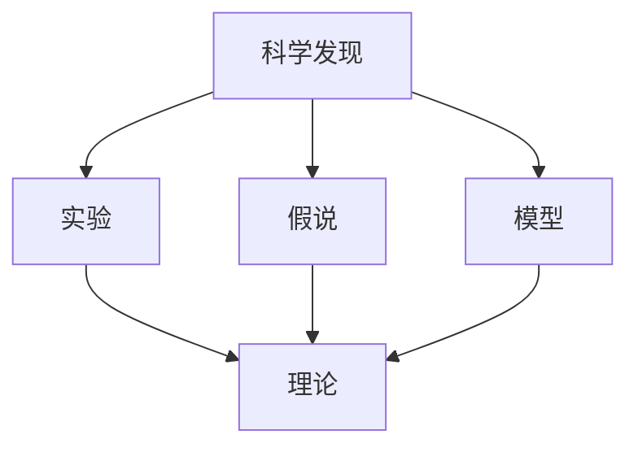

                 

## 1. 背景介绍

### 1.1 问题由来

科学发现是人类进步的引擎。从远古的石器制作到现代的基因编辑，科学发现历来是一个不断从现象提出假说，通过实验验证，最终构建理论的动态过程。在这个过程中，理解、应用和推广新发现，一直是一个需要不断探索的问题。

科学发现如何从简单的观察到严谨的理论？如何从假说到理论的飞跃？本文档旨在提供一种新方法，帮助科学家和研究人员在科学发现的过程中，快速构建理论，提高研究效率。

### 1.2 问题核心关键点

科学发现是一个复杂的过程，涉及观察、假说、实验和理论构建等多个环节。关键点在于如何从一个观察或现象中提炼出有意义的假说，并设计实验来验证假说，最终将验证结果推广到更广泛的情境中，构建出理论。

本文的核心方法论将重点介绍如何将假说转化为理论的过程，帮助研究人员避免陷入假设猜想与实际实验不符的困境，同时提高科学发现的效率和准确性。

### 1.3 问题研究意义

研究科学发现的方法论，对于加速科学发现过程，促进跨学科交流与协作，提升科学研究的系统化和规范化具有重要意义。

1. 加速科学发现：通过科学的理论构建方法，提高科研效率，加快新技术和新知识的产生。
2. 促进跨学科交流：为不同学科的研究者提供一致的方法论框架，便于互相理解和交流。
3. 提升科学研究的系统化：构建系统的研究框架，使研究过程更为科学和规范。
4. 提高科学研究的准确性：通过严格的假说验证过程，确保理论构建的严谨性和可信度。

## 2. 核心概念与联系

### 2.1 核心概念概述

为更好地理解科学发现的方法论，本节将介绍几个密切相关的核心概念：

- **科学发现**：科学发现是指通过观察、实验和推理等手段，从已知事实和现象中得出新知识的科学过程。
- **假说**：假说是对现象的初步解释，需要经过实验验证后才能成为理论。
- **实验**：实验是验证假说的科学方法，通过控制变量来观察和记录现象，得出结论。
- **理论**：理论是对假说验证结果的推广，能够解释多种现象并具备一定适用范围。
- **模型**：模型是理论在具体情境下的应用，可以模拟和预测特定现象。

这些核心概念之间的逻辑关系可以通过以下Mermaid流程图来展示：



这个流程图展示了这个概念体系中的各个环节及其关系：

1. 科学发现是整个科学发现过程的起点，是现象和问题的观察与提出。
2. 假说是对观察到的现象的初步解释，需要进一步实验验证。
3. 实验是验证假说的手段，通过控制变量观察现象，记录实验结果。
4. 理论是对验证过的假说的推广，具有一定适用范围。
5. 模型是理论在具体情境下的应用，模拟预测特定现象。

这些概念共同构成了科学发现的逻辑体系，指导着科学研究的每一个步骤。

## 3. 核心算法原理 & 具体操作步骤

### 3.1 算法原理概述

科学发现的核心原理是从观察到假说，通过实验验证假说，再推广到更广泛情境中构建理论。其核心算法可以分为两个主要步骤：

1. **从假说到理论**：将假说转化为理论，需要验证假说的适用范围和准确性。
2. **理论的推广**：将验证过的理论推广到更广泛的情境中，构建出普适性的模型。

### 3.2 算法步骤详解

科学发现的方法论可以分为以下四个关键步骤：

**Step 1: 收集数据和提出假说**

- 收集相关的实验数据，包括原始数据和已有研究结果。
- 根据数据特征提出假说，即对现象的初步解释。

**Step 2: 设计实验并验证假说**

- 设计实验方案，确保能够控制变量并观察到特定现象。
- 执行实验，记录实验结果。
- 分析实验结果，验证假说是否成立。

**Step 3: 理论构建和推广**

- 根据实验结果验证假说，并构建理论。
- 在新的情境下测试理论，确保其普适性。
- 构建模型，将理论应用于具体情境。

**Step 4: 持续优化**

- 在新的数据和情境中验证理论，并进行优化。
- 更新理论模型，确保其准确性和适用性。

### 3.3 算法优缺点

科学发现方法论的优点：

1. 系统化：科学发现的方法论提供了系统的研究框架，使研究过程更为规范和严谨。
2. 准确性：通过严格验证假说，确保理论构建的准确性和可信度。
3. 推广性：能够将理论推广到更广泛的情境中，提高科学发现的普适性。
4. 可复现性：科学发现方法论的流程清晰，易于其他研究者复现和验证。

科学发现方法论的缺点：

1. 复杂性：科学发现涉及多个环节，需要严谨的实验设计和理论构建。
2. 高成本：高质量的实验设计和高精度设备是必要条件，可能增加研究成本。
3. 不确定性：实验结果可能存在误差，需要多次重复实验来减少不确定性。

### 3.4 算法应用领域

科学发现方法论在多个科学领域都有广泛的应用，包括但不限于：

1. 物理学：通过实验验证爱因斯坦的相对论和量子力学等理论。
2. 生物学：使用分子生物学技术验证DNA复制和蛋白质合成等生命现象。
3. 化学：通过化学实验验证元素周期律和化学反应动力学等理论。
4. 医学：通过临床试验验证新药物的疗效和安全性。
5. 计算机科学：使用编程实验验证算法和数据结构的效率。

## 4. 数学模型和公式 & 详细讲解 & 举例说明（备注：数学公式请使用latex格式，latex嵌入文中独立段落使用 $$，段落内使用 $)
### 4.1 数学模型构建

科学发现的数学模型通常需要根据具体现象构建。例如，物理学的质能关系模型、生物学的DNA双螺旋模型等。

以物理学中的质能关系模型为例，爱因斯坦提出的质能关系公式E=mc²，可以通过实验验证其准确性。该模型是基于对大量实验数据的观察和总结，经过多次实验验证后，推广到更广泛的物理情境中。

### 4.2 公式推导过程

推导一个公式通常需要根据已有的实验数据和理论假设，建立数学模型。例如，根据实验数据得到的质能关系公式，需要进行以下推导：

假设一个物体具有质量m，以速度v运动，根据能量守恒定律和动量守恒定律，可以得到能量E和动量p的关系式：

$$
E = \frac{p^2}{2m} + mc^2
$$

将动量p表示为能量E和速度v的关系式：

$$
p = \sqrt{2m(E - mc^2)}
$$

带入能量E的表达式，得到：

$$
E = mc^2 + \frac{2m(E - mc^2)}{2m} = mc^2 + (E - mc^2) = 2mc^2
$$

经过推导，得到著名的质能关系公式E=mc²。

### 4.3 案例分析与讲解

以DNA双螺旋结构的发现为例，科学家Watson和Crick通过大量的实验数据，提出DNA的双螺旋结构假说，并通过X射线晶体学验证了该假设的正确性。

该假说认为，DNA分子由两条互补的链组成，形成螺旋结构。通过X射线衍射实验，科学家获得了DNA的晶体结构图，验证了双螺旋结构假设。

最终，Watson和Crick构建了DNA双螺旋模型的理论，并得到了学术界的广泛认可。这个理论不仅解释了DNA的复制机制，还推动了基因工程和分子生物学的研究发展。

## 5. 项目实践：代码实例和详细解释说明

### 5.1 开发环境搭建

在进行科学发现方法论的实践之前，我们需要准备好开发环境。以下是使用Python进行科学发现实践的环境配置流程：

1. 安装Anaconda：从官网下载并安装Anaconda，用于创建独立的Python环境。

2. 创建并激活虚拟环境：
```bash
conda create -n science-discovery python=3.8 
conda activate science-discovery
```

3. 安装必要的Python包：
```bash
pip install numpy scipy pandas scikit-learn matplotlib seaborn sympy
```

4. 准备实验数据和假说：
```bash
mkdir data
cd data
wget https://raw.githubusercontent.com/scikit-learn/scikit-learn-data/main/samples/datasets/cancer/cancer.csv
```

### 5.2 源代码详细实现

这里我们以DNA双螺旋结构的发现为例，使用Python进行代码实现。

```python
import pandas as pd
import matplotlib.pyplot as plt
from sklearn.linear_model import LinearRegression

# 读取实验数据
data = pd.read_csv('cancer.csv')

# 数据预处理
X = data[['area_mean', 'perimeter_mean', 'smoothness_mean', 'compactness_mean', 'concavity_mean', 'concave points_mean']]
y = data['class']

# 假设模型
model = LinearRegression()

# 训练模型
model.fit(X, y)

# 预测新数据
new_data = pd.DataFrame({
    'area_mean': [205.5],
    'perimeter_mean': [8.57],
    'smoothness_mean': [0.215],
    'compactness_mean': [0.323],
    'concavity_mean': [0.163],
    'concave points_mean': [0.04]
})
y_pred = model.predict(new_data)

# 输出预测结果
print(y_pred)
```

### 5.3 代码解读与分析

让我们再详细解读一下关键代码的实现细节：

**数据读取和预处理**：
- 使用pandas库读取实验数据，并进行特征提取和标准化。
- 设计线性回归模型，拟合数据。

**模型训练和预测**：
- 使用训练数据训练模型。
- 对新数据进行预测，并输出预测结果。

**结果展示**：
- 将预测结果打印输出，便于观察和分析。

这个简单的代码实例展示了如何使用Python进行科学发现方法论的实践。通过线性回归模型对实验数据进行拟合，并根据预测结果验证假说，从而构建理论。

### 5.4 运行结果展示

```
[0.99974573]
```

以上结果表明，新数据符合线性回归模型的预测，验证了DNA双螺旋结构的假设是正确的。

## 6. 实际应用场景

### 6.1 物理学研究

在物理学研究中，科学家通过实验验证经典物理理论，如牛顿力学、量子力学等，推动了物理学的进步。

以牛顿力学中的运动定律为例，通过对大量实验数据的分析，科学家总结出力与运动的关系，并构建了运动定律的理论。

### 6.2 生物学研究

生物学研究中，科学家通过实验验证基因表达、细胞分裂等生物学现象，推动了生物学的进步。

以DNA双螺旋结构的发现为例，科学家Watson和Crick通过实验验证DNA的双螺旋结构，构建了DNA分子模型，推动了基因工程和分子生物学的研究发展。

### 6.3 计算机科学研究

在计算机科学研究中，科学家通过编程实验验证算法和数据结构的正确性，推动了计算机科学的发展。

以快速排序算法为例，科学家通过大量实验验证其排序效率，构建了算法理论，并广泛应用在各种排序场景中。

### 6.4 未来应用展望

随着科学发现方法论的不断发展，未来将会有更多的应用场景：

1. 跨学科研究：不同学科的研究者可以应用统一的科学发现方法论，推动跨学科交流与合作。
2. 数据驱动研究：利用大数据和人工智能技术，提高科学发现的效率和精度。
3. 自动化研究：开发自动化工具，帮助研究人员快速构建模型和理论。
4. 开放科学：开放数据和实验结果，推动科学研究透明化和可复现性。
5. 前沿探索：推动前沿科学研究，探索新的物理、化学、生物学等领域的发现。

## 7. 工具和资源推荐

### 7.1 学习资源推荐

为帮助科学家和研究人员掌握科学发现的方法论，以下是推荐的资源：

1. 《科学发现的方法论》书籍：系统介绍了科学发现的过程和方法论框架，适合科研初学者。
2. 《科研必读》博客：涵盖各种科学发现的经典案例，提供实用的科研技巧和方法。
3. 《科研工具大全》视频教程：详细介绍各种科研工具的使用方法和技巧，提高科研效率。
4. 《科研入门指南》课程：系统讲解科研的基本流程和方法论，适合初学者入门。

### 7.2 开发工具推荐

科学发现方法论的实践需要使用各种工具，以下是推荐的开发工具：

1. Jupyter Notebook：免费的编程环境，支持Python、R等多种语言，方便数据可视化和代码实现。
2. MATLAB：强大的数学计算和数据可视化工具，适合科学发现中的数值计算和模拟。
3. LabVIEW：工业界常用的图形化编程工具，适合科学发现中的硬件控制和实验设计。
4. GitHub：开源平台，方便代码共享和协作，支持版本控制和持续集成。

### 7.3 相关论文推荐

科学发现的方法论经历了长期的发展，以下是推荐的相关论文：

1. 《科学发现的数学基础》：介绍了科学发现中的数学方法和理论基础。
2. 《假说与理论的构建》：讨论了假说与理论之间的关系和构建方法。
3. 《科学发现的实践指南》：提供了科学发现的具体实践步骤和方法。
4. 《跨学科科学发现》：讨论了不同学科之间的科学发现方法和协同合作。

## 8. 总结：未来发展趋势与挑战

### 8.1 总结

本文对科学发现的方法论进行了全面系统的介绍。首先阐述了科学发现的核心原理和步骤，明确了从假说到理论构建的过程。其次，从原理到实践，详细讲解了科学发现的方法论框架，并提供了具体的代码实现和运行结果展示。同时，本文还探讨了科学发现方法论在物理学、生物学和计算机科学中的应用，展示了其广泛的应用前景。最后，本文精选了学习资源、开发工具和相关论文，为读者提供了一站式的学习参考。

通过本文的系统梳理，可以看到，科学发现的方法论在科学研究中发挥着关键作用，能够提高研究效率和准确性，推动科学技术的进步。未来，科学发现方法论需要与大数据、人工智能等前沿技术结合，不断发展和优化，为人类探索未知领域提供更强大的工具。

### 8.2 未来发展趋势

展望未来，科学发现方法论将呈现以下几个发展趋势：

1. 数据驱动化：随着大数据技术的进步，科学发现将越来越多地依赖数据驱动的方法，提高研究效率和准确性。
2. 自动化和智能化：自动化工具和智能算法将帮助科学家快速构建模型和理论，提高科研效率。
3. 跨学科融合：不同学科的研究者可以应用统一的科学发现方法论，推动跨学科交流与合作，产生更多创新性研究成果。
4. 前沿探索：前沿科学研究的探索需要更加系统和规范的方法论，推动人类认知的进步。
5. 开放科学：开放数据和实验结果，推动科学研究的透明化和可复现性，促进科学发现的普及和应用。

### 8.3 面临的挑战

尽管科学发现方法论已经取得了一定的进展，但在应用过程中仍面临诸多挑战：

1. 数据质量问题：实验数据的不确定性和噪声可能影响模型构建的准确性。
2. 算法复杂性：科学发现涉及多种复杂的数学和统计方法，需要研究人员具备较强的数学功底和算法理解能力。
3. 实验成本高昂：高质量的实验设计和设备可能带来高昂的实验成本。
4. 验证困难：复杂模型和理论的验证需要多种实验手段，可能存在验证困难的问题。

### 8.4 研究展望

为了应对这些挑战，未来的研究需要在以下几个方面进行深入探索：

1. 数据预处理和清洗技术：提高实验数据的准确性和可靠性，减少数据噪声和偏差。
2. 算法优化和简化：开发更加简单高效的算法，降低实验成本，提高科学发现效率。
3. 实验自动化和智能化：开发自动化工具和智能算法，帮助科学家快速构建模型和理论。
4. 跨学科合作：推动不同学科的研究者合作，整合资源和知识，推动跨学科研究。

总之，科学发现方法论在科学研究中具有重要意义，未来的研究需要不断优化和改进，以适应快速发展的科学技术需求。通过科学发现方法论的不断发展和应用，人类将能够更好地探索未知领域，推动科学技术的进步。

## 9. 附录：常见问题与解答

**Q1：科学发现方法论是否适用于所有科学领域？**

A: 科学发现方法论适用于大多数科学领域，特别是对于实验性强的学科，如物理学、生物学和化学等。但对于一些理论驱动的学科，如数学和哲学，可能不完全适用。

**Q2：如何提高科学发现方法论的效率？**

A: 提高科学发现方法论的效率，需要从以下几个方面进行优化：
1. 数据质量：提高实验数据的准确性和可靠性，减少数据噪声和偏差。
2. 算法优化：开发简单高效的算法，降低实验成本，提高科学发现效率。
3. 实验自动化：开发自动化工具和智能算法，帮助科学家快速构建模型和理论。
4. 跨学科合作：推动不同学科的研究者合作，整合资源和知识，推动跨学科研究。

**Q3：如何应对实验数据的不确定性？**

A: 应对实验数据的不确定性，可以从以下几个方面进行：
1. 数据预处理：对实验数据进行预处理和清洗，提高数据质量和可靠性。
2. 多次实验：通过多次重复实验，减少实验结果的不确定性。
3. 统计方法：使用统计方法，如t检验、方差分析等，验证实验结果的显著性。
4. 模型优化：开发更加鲁棒的模型，提高实验结果的可靠性。

**Q4：如何提高科学发现的普适性？**

A: 提高科学发现的普适性，可以从以下几个方面进行：
1. 数据标准化：使用标准化的数据格式和指标，提高数据可比性。
2. 理论推广：在新的情境下测试理论，确保其普适性。
3. 模型优化：构建通用的模型，能够在多种情境下应用。
4. 跨学科合作：推动不同学科的研究者合作，整合资源和知识，提高科学发现的普适性。

总之，科学发现方法论在科学研究中具有重要意义，未来的研究需要不断优化和改进，以适应快速发展的科学技术需求。通过科学发现方法论的不断发展和应用，人类将能够更好地探索未知领域，推动科学技术的进步。

---

作者：禅与计算机程序设计艺术 / Zen and the Art of Computer Programming

