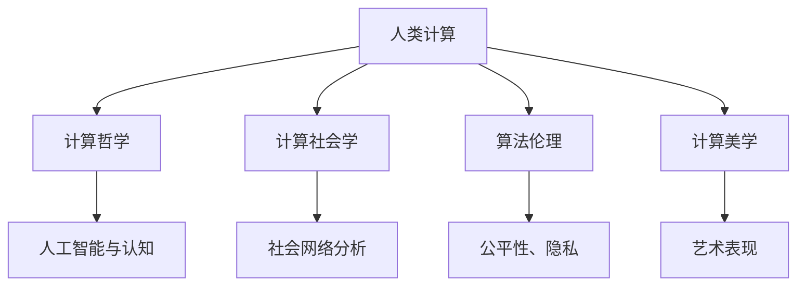

                 

# 科技与人文的交汇：人类计算的独特价值

> 关键词：
> - 人类计算(Human Computation)
> - 计算哲学(Computational Philosophy)
> - 计算社会学(Computational Sociology)
> - 算法伦理学(Algorithmic Ethics)
> - 计算美学(Computational Aesthetics)

## 1. 背景介绍

### 1.1 问题由来
随着数字化浪潮的迅猛推进，计算技术正以前所未有的速度改变着人类社会。从日常生活中简单的信息检索，到复杂的企业管理、科学研究，计算无处不在。然而，我们往往忽视了计算与人类生活、思维、文化之间深厚的联系。计算不仅是冰冷的数字和算法，更蕴含着丰富的哲学、社会学和美学价值。

### 1.2 问题核心关键点
本文将深入探讨计算技术与人类价值的交汇点，从计算哲学的视角，重新审视计算技术在人类社会中的独特价值，并探讨如何通过算法伦理、计算美学等维度，提升计算技术的人文内涵。

## 2. 核心概念与联系

### 2.1 核心概念概述

为更好地理解计算技术与人类价值的融合，本节将介绍几个密切相关的核心概念：

- 人类计算(Human Computation)：指利用人类的认知能力，通过非形式化计算方式，解决复杂问题的计算范式。它包括问题求解、知识发现、文化传承等多个方面。

- 计算哲学(Computational Philosophy)：研究计算与思维、意识、知识等哲学概念的交叉领域，探讨计算能力如何模拟人类智能，以及人类智能的计算基础。

- 计算社会学(Computational Sociology)：利用计算模型和数据，研究社会现象和人类行为规律，揭示社会动力学和网络结构等深层次问题。

- 算法伦理(Algorithmic Ethics)：探讨算法在决策、隐私、公平性等方面的伦理问题，研究如何设计伦理友好的算法，保障算法决策的透明性和公正性。

- 计算美学(Computational Aesthetics)：研究计算技术在艺术创作、设计、表现等方面的美学价值，探讨如何利用计算方法，提升艺术和设计的创意性和表现力。

这些核心概念之间的逻辑关系可以通过以下Mermaid流程图来展示：



这个流程图展示了几大核心概念及其之间的关系：

1. 人类计算通过模拟人类智能，利用计算技术和方法解决复杂问题。
2. 计算哲学探讨人类智能的计算基础，揭示计算与人类思维的深度联系。
3. 计算社会学利用计算方法研究人类行为和群体动态，揭示社会结构和规律。
4. 算法伦理研究计算技术在伦理、公平等方面的问题，保障算法决策的公正透明。
5. 计算美学研究计算技术在艺术创作、设计等方面的应用，提升创意表现力。

这些概念共同构成了计算技术在人文价值领域的研究框架，揭示了计算技术如何通过模拟人类思维、社会行为和审美表达，促进人类社会的发展。

## 3. 核心算法原理 & 具体操作步骤
### 3.1 算法原理概述

人类计算的核心理论包括符号计算、逻辑推理、模拟游戏等多个方面。其中，逻辑推理和模拟游戏是两种典型的非形式化计算方式。它们通过模拟人类思维的过程，解决复杂的逻辑问题和游戏难题，展示了计算技术与人类认知能力的深度融合。

### 3.2 算法步骤详解

**Step 1: 模型建立与数据准备**
- 选择合适的问题类型，如逻辑推理题、策略游戏等，设计计算模型。
- 准备大量数据，包括问题实例、正确答案和错误答案等，用于训练和测试模型。

**Step 2: 模型训练与优化**
- 将数据输入模型，通过训练和优化算法，调整模型参数。
- 使用验证集评估模型性能，调整超参数，防止过拟合。

**Step 3: 模型测试与评估**
- 在测试集上测试模型性能，评估模型的正确率和效率。
- 结合计算美学和算法伦理，综合评估模型的可解释性、透明性和公正性。

### 3.3 算法优缺点

人类计算的优势在于能够模拟复杂的人类思维过程，解决形式化方法难以处理的非结构化问题。然而，人类计算也面临计算速度慢、结果不稳定等问题，难以处理大规模数据和高度复杂的计算任务。

### 3.4 算法应用领域

人类计算广泛应用于各个领域，如人工智能(AI)、机器学习(ML)、自动推理(AR)等，为这些问题提供了新的计算范式和解决思路。

## 4. 数学模型和公式 & 详细讲解 & 举例说明

### 4.1 数学模型构建

人类计算中的逻辑推理可以建模为形式化的逻辑命题，如命题逻辑、谓词逻辑等。在形式化推理中，常用的数学模型包括：

- 命题逻辑：将问题抽象为布尔变量的逻辑表达式。
- 谓词逻辑：将问题抽象为个体和谓词的数学关系。

### 4.2 公式推导过程

以命题逻辑为例，假设问题为判断命题A是否蕴含命题B。模型可以表示为：

$$
A \rightarrow B
$$

其中 $\rightarrow$ 表示蕴含关系。根据逻辑推理规则，可以将其转化为等价的形式：

$$
\neg A \lor B
$$

使用布尔代数的性质，可以得到进一步的推导：

$$
A \rightarrow B \iff \neg A \lor B
$$

这意味着，若要证明 $A \rightarrow B$，可以等价地证明 $\neg A \lor B$。

### 4.3 案例分析与讲解

以著名的Sudoku数独游戏为例，数独游戏是一种经典的逻辑推理游戏。玩家需要根据已知的数独棋盘和提示数字，推理出剩余格子的数字。

将数独棋盘抽象为逻辑矩阵，每个格子的数字表示为一个布尔变量。棋盘上的数字填入规则可以通过逻辑推理模型来建模，并使用SAT solver（可满足性求解器）进行求解。通过不断优化模型和算法，可以高效地解决数独问题，甚至在数百万规模的棋盘上获得解。

## 5. 项目实践：代码实例和详细解释说明

### 5.1 开发环境搭建

在进行人类计算实践前，我们需要准备好开发环境。以下是使用Python进行Sudoku求解的开发环境配置流程：

1. 安装Anaconda：从官网下载并安装Anaconda，用于创建独立的Python环境。

2. 创建并激活虚拟环境：
```bash
conda create -n sudoku-env python=3.8 
conda activate sudoku-env
```

3. 安装必要的库：
```bash
pip install pysat sat-solver
```

完成上述步骤后，即可在`pytorch-env`环境中开始开发实践。

### 5.2 源代码详细实现

以下是一段基于Pysat库实现数独求解的Python代码：

```python
from pysat.solvers import Minisat
from pysat.exceptions import pysat
from itertools import product

def print_board(board):
    for row in board:
        print(' '.join([str(i) for i in row]))

def solve_sudoku():
    board = [
        [5, 3, 0, 0, 7, 0, 0, 0, 0],
        [6, 0, 0, 1, 9, 5, 0, 0, 0],
        [0, 9, 8, 0, 0, 0, 0, 6, 0],
        [8, 0, 0, 0, 6, 0, 0, 0, 3],
        [4, 0, 0, 8, 0, 3, 0, 0, 1],
        [7, 0, 0, 0, 2, 0, 0, 0, 6],
        [0, 6, 0, 0, 0, 0, 2, 8, 0],
        [0, 0, 0, 4, 1, 9, 0, 0, 5],
        [0, 0, 0, 0, 8, 0, 0, 7, 9]
    ]
    print_board(board)
    for permutation in permutations(list(range(1, 10)), 9):
        if solve(board, permutation):
            print_board(board)
            return True
    print("No solution!")
    return False

def solve(board, permutation):
    solver = Minisat()
    for row in range(9):
        for col in range(9):
            if board[row][col] == 0:
                for digit in permutation:
                    if is_valid(board, row, col, digit):
                        board[row][col] = digit
                        if solve(board, permutation):
                            return True
                        board[row][col] = 0
                return False
    return True

def is_valid(board, row, col, digit):
    for i in range(9):
        if board[i][col] == digit or board[row][i] == digit:
            return False
    r = row // 3
    c = col // 3
    for i in range(r * 3, r * 3 + 3):
        for j in range(c * 3, c * 3 + 3):
            if board[i][j] == digit:
                return False
    return True

solve_sudoku()
```

### 5.3 代码解读与分析

让我们再详细解读一下关键代码的实现细节：

**print_board函数**：
- 用于打印数独棋盘。

**solve_sudoku函数**：
- 初始化棋盘数据，打印棋盘。
- 通过遍历数字1到9，依次尝试填入棋盘格子。
- 若某格子不能填入当前数字，回溯上一步，尝试下一种数字。
- 若找到解，打印棋盘，结束函数；否则继续遍历。

**solve函数**：
- 初始化SAT求解器。
- 依次遍历棋盘格子，检查是否可填入当前数字。
- 若可填入，求解器加入约束条件，继续尝试。
- 若所有格子都已填入数字，结束函数；否则返回false。

**is_valid函数**：
- 检查当前数字是否满足数独规则。

代码通过遍历所有可能数字组合，逐格求解数独，展示了一种典型的基于逻辑推理的计算方法。

## 6. 实际应用场景

### 6.1 数学与科学

计算技术与数学科学的结合，开辟了新的研究范式。例如，在数论、代数、几何等领域，计算机可以高效地进行复杂计算和验证，揭示出人类难以发现的数学规律。

### 6.2 艺术与设计

计算美学在艺术设计中的应用，已经产生了广泛影响。例如，计算机图形学、交互设计等领域，利用计算方法生成艺术作品和交互界面，提升了创意表现力和用户体验。

### 6.3 社会科学与政策制定

计算社会学和算法伦理的研究，为社会科学研究和政策制定提供了新工具和新视角。例如，利用计算模型分析社会网络结构，揭示群体行为和信息传播规律；设计伦理友好的算法，保障数据隐私和算法公正。

## 7. 工具和资源推荐

### 7.1 学习资源推荐

为了帮助开发者系统掌握计算技术与人类价值的融合，这里推荐一些优质的学习资源：

1. 《Human Computation: From Decisions to Cognition》：探讨人类计算在认知科学、决策理论等领域的应用，深入浅出地介绍了人类计算的多维价值。

2. 《Computational Philosophy: Power of Calculations in Philosophy》：研究计算与哲学思想的交叉，探讨计算方法在哲学问题求解中的应用。

3. 《Computational Sociology: From Society to Mind》：利用计算模型研究社会行为和群体动力，揭示社会现象背后的深层次规律。

4. 《Algorithmic Ethics: Fairness, Accountability, Transparency》：探讨算法决策的伦理问题，提出设计伦理友好的算法的策略和路径。

5. 《Computational Aesthetics: Beyond the Digital》：研究计算技术在艺术创作、设计中的应用，提升创意表现力。

通过对这些资源的学习实践，相信你一定能够深刻理解计算技术在人类社会的独特价值，并用于解决实际问题。

### 7.2 开发工具推荐

高效的开发离不开优秀的工具支持。以下是几款用于计算技术与人类价值融合开发的常用工具：

1. Pysat：用于解决可满足性问题的开源库，支持布尔逻辑、命题逻辑等计算模型。

2. Minisat：高效的SAT求解器，可用于解决复杂的逻辑推理问题。

3. Pythia：用于生成社会网络模型的工具，可以模拟人类社会行为。

4. Fairlearn：用于研究算法伦理和公平性的开源库，支持多种算法和数据集。

5. OpenSCAD：开源的计算机辅助设计工具，可用于生成三维模型和交互界面。

合理利用这些工具，可以显著提升计算技术与人类价值的融合开发效率，加快创新迭代的步伐。

### 7.3 相关论文推荐

计算技术与人类价值的融合研究，源于学界的持续研究。以下是几篇奠基性的相关论文，推荐阅读：

1. "Human Computation: Enabling Human Intelligence Through Technology"：提出了人类计算的概念，探讨了计算技术与人类思维的融合。

2. "Computational Philosophy: An Overview"：研究计算与哲学思想的交叉，揭示了计算方法在哲学问题求解中的应用。

3. "Computational Sociology: A Computational Approach to the Social Sciences"：利用计算模型研究社会行为和群体动力，揭示社会现象背后的规律。

4. "Algorithmic Fairness: What, Why, How?"：探讨算法决策的伦理问题，提出设计伦理友好的算法的策略。

5. "Computational Aesthetics: The Future of Art and Design"：研究计算技术在艺术创作、设计中的应用，提升创意表现力。

这些论文代表了大计算技术在人文价值领域的发展脉络。通过学习这些前沿成果，可以帮助研究者把握学科前进方向，激发更多的创新灵感。

## 8. 总结：未来发展趋势与挑战

### 8.1 总结

本文对计算技术与人类价值的融合进行了全面系统的介绍。首先阐述了计算技术在人类社会中的独特价值，明确了计算技术与人类计算、计算哲学、计算社会学、算法伦理和计算美学等领域的紧密联系。其次，从原理到实践，详细讲解了计算技术与人类价值的融合方法，给出了详细代码实例。同时，本文还广泛探讨了计算技术与人类价值的融合在数学科学、艺术设计、社会科学和政策制定等诸多领域的应用前景，展示了计算技术的广阔潜力。

通过本文的系统梳理，可以看到，计算技术与人类价值的融合不仅在理论层面具有重要意义，在实际应用中也能带来深远影响。未来，伴随计算技术的发展，计算美学、计算哲学等领域的深入研究，必将进一步拓展计算技术在人文价值领域的边界，为人类社会带来更多创新和变革。

### 8.2 未来发展趋势

展望未来，计算技术与人类价值的融合将呈现以下几个发展趋势：

1. 计算技术的普适性增强。随着计算技术的普及和算法模型的优化，计算技术将在更多领域中得到应用，从专业领域走向大众化、普及化。

2. 计算技术的人文价值深化。通过计算美学、计算哲学等研究，计算技术将更深入地与人文价值结合，提升其文化内涵和审美表现力。

3. 计算技术的伦理规范完善。算法伦理、计算社会学等领域的研究，将为计算技术的应用提供伦理规范和公平性保障，促进技术健康发展。

4. 计算技术的跨学科融合加速。计算技术与更多学科的交叉融合，将推动新技术和新理论的诞生，促进学科交叉创新。

5. 计算技术的智能化提升。随着深度学习、自然语言处理等技术的进步，计算技术将更加智能化，具备更强的推理、生成和理解能力。

6. 计算技术在社会治理中的应用深化。计算社会学和计算伦理学等领域的研究，将为社会治理提供新的工具和视角，促进社会公平和正义。

以上趋势凸显了计算技术在人文价值领域的发展前景。这些方向的探索发展，必将进一步提升计算技术的文化内涵和社会价值，促进人类社会的进步。

### 8.3 面临的挑战

尽管计算技术与人类价值的融合已经取得了瞩目成就，但在迈向更加智能化、普适化应用的过程中，它仍面临着诸多挑战：

1. 计算技术的普及瓶颈。虽然计算技术已经逐渐普及，但在一些偏远地区和低收入群体中，计算设备和技术的应用仍存在障碍。如何降低技术门槛，普及计算技术，是一个重要挑战。

2. 计算技术的伦理问题。计算技术在决策、隐私等方面的伦理问题逐渐显现，如何在保障技术应用的同时，避免对社会伦理造成负面影响，是一个亟待解决的问题。

3. 计算技术的透明性不足。计算模型的决策过程和机制往往难以解释和理解，对计算技术的应用和治理带来了挑战。如何增强计算技术的透明性和可解释性，是一个重要研究方向。

4. 计算技术的社会影响评估。计算技术对社会结构和人类行为的影响评估，是一个复杂且多维的问题。如何构建全面的社会影响评估框架，是一个重要挑战。

5. 计算技术的公平性问题。计算技术在不同群体中的应用差异可能带来公平性问题，如何在设计和应用中考虑公平性，是一个重要挑战。

6. 计算技术的可持续性问题。计算技术的应用可能导致资源浪费和环境污染，如何在设计中考虑可持续性，是一个重要挑战。

正视计算技术与人类价值融合面临的这些挑战，积极应对并寻求突破，将是大计算技术迈向成熟的必由之路。相信随着学界和产业界的共同努力，这些挑战终将一一被克服，计算技术与人类价值的融合必将在构建人机协同的智能时代中扮演越来越重要的角色。

### 8.4 研究展望

面对计算技术与人类价值融合所面临的种种挑战，未来的研究需要在以下几个方面寻求新的突破：

1. 探索更普适、更高效的计算范式。开发更加普适、高效的计算模型和算法，降低技术门槛，普及计算技术。

2. 研究计算技术的伦理规范。建立全面的计算伦理规范体系，保障计算技术应用的社会公平和伦理安全。

3. 提升计算技术的透明性和可解释性。研究计算技术的透明性和可解释性，增强算法的可信性和可接受性。

4. 构建社会影响评估框架。构建全面的社会影响评估框架，评估计算技术对社会结构、人类行为的影响，制定合理的政策法规。

5. 考虑计算技术的公平性。在计算技术的设计和应用中考虑公平性，确保不同群体能够公平地受益。

6. 推动计算技术的可持续发展。在计算技术的设计中考虑资源和环境因素，推动计算技术的可持续发展。

这些研究方向的探索，必将引领计算技术与人类价值的融合技术迈向更高的台阶，为构建安全、可靠、可解释、可控的智能系统铺平道路。面向未来，计算技术与人类价值的融合技术还需要与其他人工智能技术进行更深入的融合，如知识表示、因果推理、强化学习等，多路径协同发力，共同推动自然语言理解和智能交互系统的进步。只有勇于创新、敢于突破，才能不断拓展计算技术的边界，让智能技术更好地造福人类社会。

## 9. 附录：常见问题与解答

**Q1：计算技术与人类价值融合的意义是什么？**

A: 计算技术与人类价值的融合，展示了计算技术在人类社会中的深远意义。它不仅能够解决复杂的计算问题，还能模拟和理解人类思维、情感和社会行为，推动跨学科交叉创新。计算技术与人文价值的融合，不仅提升了技术的普适性和智能化，也增强了技术的人文内涵和社会价值。

**Q2：如何应对计算技术的伦理问题？**

A: 应对计算技术的伦理问题，需要从多个方面入手：
1. 建立全面的计算伦理规范体系，确保计算技术应用的社会公平和伦理安全。
2. 提升计算技术的透明性和可解释性，增强算法的可信性和可接受性。
3. 构建社会影响评估框架，评估计算技术对社会结构、人类行为的影响，制定合理的政策法规。

**Q3：计算技术的透明性不足有哪些解决方法？**

A: 解决计算技术的透明性不足，需要从多个方面入手：
1. 开发可解释性强的计算模型和算法，增强算法的透明性。
2. 研究计算技术的透明性和可解释性，增强算法的可信性和可接受性。
3. 建立透明的计算技术应用框架，确保算法的公平和透明。

**Q4：计算技术的普及瓶颈如何克服？**

A: 克服计算技术的普及瓶颈，需要从多个方面入手：
1. 降低技术门槛，开发易于使用的计算技术工具和平台。
2. 普及计算技术的基础知识和应用技能，提升用户的技术素养。
3. 提供计算技术的公共服务，保障计算设备的普及和维护。

**Q5：计算技术的公平性问题如何解决？**

A: 解决计算技术的公平性问题，需要从多个方面入手：
1. 在计算技术的设计和应用中考虑公平性，确保不同群体能够公平地受益。
2. 研究计算技术的公平性，制定合理的公平性评估标准和政策。
3. 关注计算技术的社会影响，建立全面的社会影响评估框架，确保技术的公平应用。

---

作者：禅与计算机程序设计艺术 / Zen and the Art of Computer Programming

