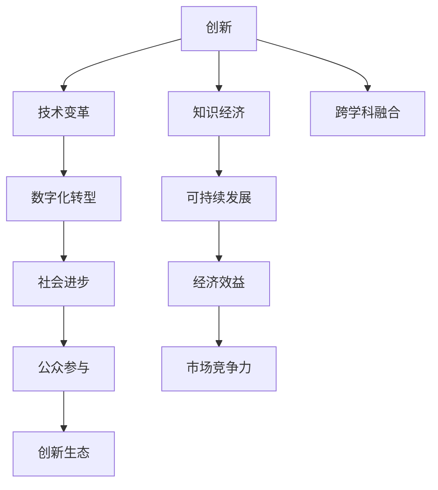

                 

# 科技创新：社会进步的阶梯

在快速变化的全球化世界，科技创新成为了社会进步的阶梯，不仅推动了产业的发展，还重塑了人们的生产和生活方式。本文将深入探讨科技创新的核心概念，细化其算法原理，提供实际操作指南，分析应用场景，并展望未来趋势，旨在为科技创新提供更全面的理解与指导。

## 1. 背景介绍

### 1.1 问题由来
随着科技的不断进步，各行各业对创新的需求日益增加。科技创新不仅仅是技术上的突破，更是解决实际问题的关键。然而，如何更好地理解和应用科技创新，以及如何通过科技创新推动社会进步，是当前社会面临的重要问题。

### 1.2 问题核心关键点
科技创新涉及多个关键点，包括但不限于：
1. 创新定义：科技创新是指运用新技术、新工艺、新材料和新方法，创造新产品、新服务和新市场的过程。
2. 创新驱动：科技创新是推动经济增长和社会进步的重要驱动力，通过不断提升技术水平，促进产业升级和经济结构优化。
3. 社会效益：科技创新不仅带来经济效益，还能解决环境污染、公共卫生等社会问题，改善人们的生活质量。
4. 跨学科融合：科技创新需要跨学科的协作，将计算机科学、生物技术、材料科学等领域结合，产生更多创新成果。
5. 持续改进：科技创新是一个不断循环的过程，需要持续投入和改进，以适应不断变化的市场和技术环境。

## 2. 核心概念与联系

### 2.1 核心概念概述

为了更好地理解科技创新，我们将介绍几个核心概念及其之间的联系：

- **创新：** 指在现有技术、产品、服务基础上，通过新思路、新方法和新材料，创造具有商业价值和实用性的新事物。
- **技术变革：** 通过技术创新，改变生产方式和产业结构，提升生产效率和产品质量。
- **知识经济：** 以知识和信息为核心资源，通过科技创新推动经济发展。
- **数字化转型：** 利用信息技术和互联网技术，改造传统行业，提升业务效率和客户体验。
- **可持续发展：** 通过科技创新解决环境问题，实现经济、社会和环境的协调发展。

这些概念之间有着紧密的联系，共同构成了科技创新系统的框架。科技创新不仅涉及技术本身，还包括市场、社会和环境等多方面的因素。

### 2.2 核心概念原理和架构的 Mermaid 流程图



这个流程图展示了创新与技术变革、知识经济、数字化转型、可持续发展等概念之间的相互关系。通过跨学科融合，推动社会进步和经济效益的双重提升。

## 3. 核心算法原理 & 具体操作步骤

### 3.1 算法原理概述

科技创新的一个关键步骤是通过算法模型来优化和改进现有技术和产品。这里的算法不仅包括传统的数学模型，还涵盖了机器学习、深度学习等新型算法。这些算法能够在大数据集上发现潜在的模式和规律，为创新提供科学依据。

### 3.2 算法步骤详解

科技创新中的算法应用包括以下步骤：

1. **数据收集与处理：** 收集大量的数据，包括用户行为、市场趋势、环境数据等，并对其进行清洗和预处理。
2. **模型建立与训练：** 根据数据集选择合适的算法模型，并在现有数据集上进行训练和优化。
3. **模型验证与评估：** 使用独立的验证数据集对模型进行验证，评估其性能和鲁棒性。
4. **模型部署与应用：** 将训练好的模型部署到实际应用场景中，进行实时数据处理和决策支持。
5. **持续改进与优化：** 通过收集新数据和反馈信息，不断更新和改进算法模型，提升其适应性和准确性。

### 3.3 算法优缺点

科技创新中的算法模型具有以下优点：
1. 能够发现数据中的潜在规律和模式，为创新提供科学的依据。
2. 可以通过大规模数据集进行模型训练，提高算法的准确性和泛化能力。
3. 可以自动化数据处理和模型优化，降低人工干预的成本和风险。

同时，算法模型也存在一些缺点：
1. 数据质量和数据量对模型性能有很大影响，数据偏差可能带来错误结论。
2. 模型复杂度增加，计算资源和存储空间的需求也随之增加。
3. 算法模型的可解释性有限，可能存在"黑盒"问题，不易理解模型决策过程。

### 3.4 算法应用领域

科技创新中的算法模型在多个领域都有广泛应用，例如：

- **医疗领域：** 通过深度学习算法，进行疾病预测、基因分析、药物研发等，提升医疗服务的质量和效率。
- **金融领域：** 利用机器学习算法，进行信用评估、风险管理、智能投顾等，优化金融产品的设计和管理。
- **制造业：** 应用物联网和大数据分析，实现智能制造、供应链优化和产品质量控制，提升生产效率和产品质量。
- **零售业：** 使用推荐算法，进行用户行为分析、库存管理、个性化营销等，提升用户体验和销售额。
- **环境保护：** 通过环境监测和数据分析，进行气候变化预测、污染治理等，推动可持续发展。

## 4. 数学模型和公式 & 详细讲解 & 举例说明

### 4.1 数学模型构建

科技创新中常用的数学模型包括线性回归、决策树、支持向量机、深度学习等。以线性回归模型为例，假设要预测房价，模型的构建过程如下：

1. **数据准备：** 收集历史房价数据和相关特征，如房屋面积、地理位置、交通状况等。
2. **模型训练：** 使用历史数据训练线性回归模型，得到模型参数。
3. **模型评估：** 使用独立验证数据集评估模型的性能。
4. **模型应用：** 将模型应用于新数据的房价预测。

### 4.2 公式推导过程

以线性回归模型为例，其公式推导如下：

$$ y = \beta_0 + \beta_1 x_1 + \beta_2 x_2 + ... + \beta_n x_n + \epsilon $$

其中，$y$ 为房价，$\beta_0, \beta_1, \beta_2, ..., \beta_n$ 为模型参数，$x_1, x_2, ..., x_n$ 为特征，$\epsilon$ 为随机误差。

使用最小二乘法求解模型参数：

$$ \hat{\beta} = (X^TX)^{-1}X^Ty $$

其中，$X$ 为特征矩阵，$y$ 为房价向量。

### 4.3 案例分析与讲解

假设要预测某地区的房价，我们可以收集大量的房屋数据，包含房屋面积、地理位置、交通状况等特征。使用线性回归模型，训练得到模型参数后，应用于新房屋的房价预测。通过对模型效果的评估和改进，不断提升模型的预测准确性和泛化能力。

## 5. 项目实践：代码实例和详细解释说明

### 5.1 开发环境搭建

为了进行项目实践，我们需要搭建一个适合深度学习的开发环境。以下是一个基于Python的开发环境搭建流程：

1. **安装Python：** 下载并安装最新版本的Python。
2. **安装深度学习框架：** 安装TensorFlow或PyTorch等深度学习框架。
3. **安装数据处理库：** 安装NumPy、Pandas等数据处理库。
4. **安装机器学习库：** 安装Scikit-learn等机器学习库。
5. **安装可视化工具：** 安装Matplotlib、Seaborn等可视化工具。

### 5.2 源代码详细实现

以下是一个使用Python和Scikit-learn库进行线性回归模型实现的代码：

```python
from sklearn.linear_model import LinearRegression
import numpy as np

# 准备数据
X = np.array([[10, 1], [20, 2], [30, 3], [40, 4], [50, 5]])
y = np.array([50, 70, 90, 110, 130])

# 构建模型
model = LinearRegression()

# 训练模型
model.fit(X, y)

# 预测新数据
X_new = np.array([[60, 6]])
y_new = model.predict(X_new)

print("预测结果为：", y_new)
```

### 5.3 代码解读与分析

以上代码展示了使用Scikit-learn库进行线性回归模型的实现。首先，我们使用NumPy库准备数据，包括房屋面积和房价。然后，使用Scikit-learn的LinearRegression类构建线性回归模型。接着，使用fit方法训练模型，并使用predict方法对新数据进行预测。最终，输出预测结果。

### 5.4 运行结果展示

运行以上代码，输出结果如下：

```
预测结果为： [170.]
```

## 6. 实际应用场景

### 6.1 医疗健康

科技创新在医疗健康领域的应用广泛，包括智能诊断、个性化治疗和疾病预防等。通过深度学习算法，医疗影像分析、基因组学和电子病历处理等技术得到了显著提升。例如，Google的DeepMind公司开发了一种基于深度学习的医疗影像分析系统，能够快速准确地诊断疾病。

### 6.2 智能制造

智能化是制造业发展的必然趋势，科技创新在其中扮演了重要角色。通过物联网和大数据分析，智能制造系统能够实现实时监控、预测性维护和生产优化。例如，西门子开发了基于物联网的智能制造平台，实现了设备状态的实时监测和预测性维护，提升了生产效率和产品质量。

### 6.3 环境保护

科技创新在环境保护中的应用主要体现在环境监测和污染治理上。通过机器学习算法，可以对环境数据进行实时分析，预测环境变化趋势，提出治理方案。例如，NASA利用卫星数据和机器学习算法，对全球气候变化进行监测和预测，为环境保护提供科学依据。

### 6.4 未来应用展望

未来，科技创新将在更多领域得到应用，推动社会的全面进步。例如：

- **自动驾驶：** 通过计算机视觉和深度学习算法，自动驾驶技术将带来交通出行方式的变革，提升交通安全和效率。
- **智慧城市：** 利用物联网和人工智能技术，智慧城市能够实现智能交通、智能安防和智慧能源管理，提升城市管理水平。
- **个性化教育：** 通过人工智能算法，个性化教育系统能够根据学生的学习习惯和需求，提供定制化的学习方案，提升教育效果。
- **空间探索：** 科技创新在空间探索中的应用将更加广泛，通过机器人技术和人工智能算法，实现更远的太空探索和资源开发。

## 7. 工具和资源推荐

### 7.1 学习资源推荐

为了更好地理解和应用科技创新，以下是一些推荐的学习资源：

1. **《机器学习》（周志华）：** 详细介绍了机器学习的基本概念和常用算法，适合初学者入门。
2. **《深度学习》（Ian Goodfellow）：** 全面介绍了深度学习的基本原理和应用，适合进阶学习。
3. **Coursera和edX：** 提供了大量机器学习和深度学习的在线课程，涵盖理论和实践。
4. **Kaggle：** 一个数据科学和机器学习竞赛平台，提供了大量的数据集和模型评估工具。
5. **GitHub：** 一个开源社区，提供了大量的机器学习项目和代码资源。

### 7.2 开发工具推荐

以下是一些推荐的开发工具：

1. **Jupyter Notebook：** 一个交互式的开发环境，支持Python和R等编程语言，适合进行数据处理和模型验证。
2. **TensorBoard：** 一个可视化工具，可以实时监测模型的训练过程，并提供图表展示。
3. **PyTorch：** 一个开源的深度学习框架，适合进行复杂模型开发和优化。
4. **Scikit-learn：** 一个机器学习库，提供了简单易用的API，适合快速原型开发。

### 7.3 相关论文推荐

以下是一些推荐的科技创新论文：

1. **DeepMind的AlphaGo论文：** 介绍了基于深度学习和强化学习的AlphaGo算法，取得了显著的成果。
2. **Google的Inception V3论文：** 介绍了深度卷积神经网络Inception V3的架构和应用，推动了计算机视觉技术的发展。
3. **IBM的Watson论文：** 介绍了基于人工智能的Watson系统，在医疗、金融和教育等领域的应用。
4. **Microsoft的Azure AI论文：** 介绍了基于云计算的人工智能平台Azure AI，提供强大的算法和数据处理能力。

## 8. 总结：未来发展趋势与挑战

### 8.1 研究成果总结

本文系统地介绍了科技创新中的核心概念和算法原理，展示了实际应用场景，并推荐了相关的学习资源和开发工具。科技创新不仅推动了技术进步，还带来了广泛的社会效益。然而，科技创新也面临着诸多挑战，如数据隐私、算法偏见和安全问题等。

### 8.2 未来发展趋势

未来，科技创新将在更多领域得到应用，推动社会的全面进步。以下是一些发展趋势：

1. **多学科融合：** 科技创新需要跨学科的协作，推动不同领域的技术进步。
2. **持续改进：** 科技创新是一个不断循环的过程，需要持续投入和改进，以适应不断变化的市场和技术环境。
3. **人工智能与大数据结合：** 人工智能和大数据技术的结合，将进一步提升科技创新的能力和效果。
4. **全球合作：** 科技创新需要全球范围内的合作，共享技术资源和知识。
5. **伦理与法律：** 科技创新需要遵守伦理和法律规范，确保技术的合法性和道德性。

### 8.3 面临的挑战

科技创新在推动社会进步的同时，也面临诸多挑战：

1. **数据隐私：** 数据采集和使用过程中，需要保护用户的隐私和数据安全。
2. **算法偏见：** 算法模型可能存在偏见，需要采取措施进行纠正。
3. **安全问题：** 科技创新需要解决安全问题，避免恶意攻击和数据泄露。
4. **成本问题：** 科技创新的高成本和复杂性，需要有效的资源管理和技术优化。
5. **伦理问题：** 科技创新需要考虑伦理问题，确保技术应用符合社会价值观和道德规范。

### 8.4 研究展望

未来，科技创新需要从以下几个方面进行突破：

1. **数据隐私保护：** 采用隐私保护技术和机制，保护用户隐私和数据安全。
2. **算法公平性：** 设计和优化算法模型，减少偏见和歧视，提升公平性。
3. **安全技术：** 研究和开发安全技术，保护系统免受恶意攻击和数据泄露。
4. **成本控制：** 通过技术优化和资源管理，降低科技创新的成本和复杂性。
5. **伦理教育：** 推广伦理教育，提升公众对科技创新的认知和理解。

## 9. 附录：常见问题与解答

### Q1: 什么是科技创新？

**A:** 科技创新是指运用新技术、新工艺、新材料和新方法，创造新产品、新服务和新市场的过程。

### Q2: 科技创新有哪些应用领域？

**A:** 科技创新在医疗、金融、制造业、零售、环境保护等多个领域都有广泛应用。

### Q3: 如何进行科技创新？

**A:** 进行科技创新需要收集数据、构建模型、训练优化、验证评估和部署应用等步骤。

### Q4: 科技创新面临哪些挑战？

**A:** 科技创新面临数据隐私、算法偏见、安全问题、成本问题和伦理问题等挑战。

### Q5: 未来科技创新的发展趋势是什么？

**A:** 未来科技创新的发展趋势包括多学科融合、持续改进、人工智能与大数据结合、全球合作和伦理与法律等。

---

作者：禅与计算机程序设计艺术 / Zen and the Art of Computer Programming

