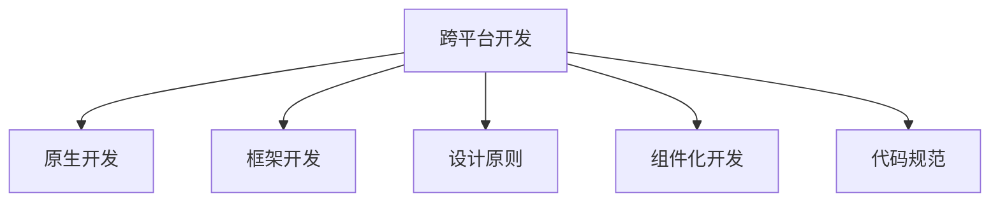

                 

## 1. 背景介绍

### 1.1 问题由来
随着移动互联网的蓬勃发展，移动应用已成为现代生活中不可或缺的一部分。从社交、购物、娱乐到工作、学习，各种功能丰富的移动应用极大地便利了人们的生活。然而，开发高质量的移动应用并非易事。一方面，移动平台（如iOS和Android）各具特色，开发方式截然不同；另一方面，移动应用需要具备良好的用户体验、流畅的性能和强大的功能。这使得移动应用开发成为一款高技术要求的工作，对开发者提出了极高的综合技能要求。

### 1.2 问题核心关键点
面对上述挑战，移动端全栈开发技能变得尤为重要。全栈开发不仅需要具备跨平台开发能力，还需掌握移动平台特有的开发技术、工具和设计原则。本文将从iOS和Android两个平台切入，全面解析移动端全栈开发所需的关键技能，以期为移动应用开发提供科学、系统的指导。

## 2. 核心概念与联系

### 2.1 核心概念概述
移动端全栈开发技能包括但不限于以下几个核心概念：

- **跨平台开发（Cross-Platform Development）**：指通过某种技术手段，在多个移动平台上实现应用开发，减少重复开发工作，提升开发效率。
- **原生开发（Native Development）**：指使用平台原生语言（如Swift、Kotlin）进行应用开发，具备最佳性能和用户体验。
- **框架开发（Framework-based Development）**：指利用跨平台框架（如React Native、Flutter），结合原生语言特性，快速开发应用。
- **设计原则（Design Principles）**：涵盖可用性、响应式、性能优化等，确保应用具备良好的用户体验。
- **组件化开发（Component-based Development）**：将应用拆分为可复用的模块，提升开发效率，增强代码维护性。
- **代码规范（Code Standards）**：制定统一的编码规范，保证团队协作效率和代码可读性。

这些核心概念紧密关联，共同构成了移动端全栈开发的基础框架。

### 2.2 核心概念原理和架构的 Mermaid 流程图(Mermaid 流程节点中不要有括号、逗号等特殊字符)


## 3. 核心算法原理 & 具体操作步骤

### 3.1 算法原理概述
移动端全栈开发的核心算法原理基于以下两点：

1. **模块化与组件化**：将应用拆分为多个可复用模块或组件，减少重复开发，提升开发效率。
2. **前后端统一开发框架**：利用前后端统一的开发框架（如React Native、Flutter），通过编写一套代码在多个平台运行。

### 3.2 算法步骤详解
#### 步骤一：需求分析与设计
- **用户研究**：了解用户需求，明确应用的核心功能。
- **功能规划**：划分应用功能模块，制定详细的功能规格说明。
- **设计原型**：基于用户研究和功能规划，设计应用原型，包括界面设计、交互逻辑等。

#### 步骤二：跨平台开发工具选择
- **工具评估**：根据项目需求和技术栈，选择适合的跨平台开发工具，如React Native、Flutter等。
- **环境搭建**：安装和配置开发环境，包括代码编辑器、模拟器等。

#### 步骤三：组件开发与集成
- **组件开发**：编写应用所需组件（如按钮、列表等），确保跨平台兼容性。
- **模块集成**：将各功能模块整合到应用中，进行单元测试和集成测试。

#### 步骤四：优化与测试
- **性能优化**：根据测试结果，对应用进行性能优化，提升用户体验。
- **稳定性测试**：进行稳定性测试，确保应用在各种条件下都能稳定运行。

#### 步骤五：发布与维护
- **版本发布**：发布应用新版本，更新到应用商店。
- **用户反馈收集**：收集用户反馈，进行版本迭代和功能优化。

### 3.3 算法优缺点
#### 优点：
- **提升开发效率**：通过组件化开发和跨平台框架，减少了重复开发，加快了开发速度。
- **减少维护成本**：组件化开发便于代码维护和升级，降低维护成本。
- **统一开发体验**：前后端统一开发框架提供了良好的开发体验，减少技术鸿沟。

#### 缺点：
- **性能优化难度大**：跨平台应用在性能上可能不如原生应用。
- **平台特定功能难以实现**：部分平台原生功能无法通过跨平台框架实现。
- **学习成本高**：跨平台开发需要掌握多种技术和工具。

### 3.4 算法应用领域
移动端全栈开发技能广泛应用于以下领域：

- **跨平台应用开发**：如微信小程序、支付宝小程序等，用户无需下载，一键直达。
- **企业移动应用**：如ERP、CRM、OA系统等，提升企业信息化水平。
- **游戏开发**：如Unity、Unreal Engine等，支持跨平台游戏开发和发行。
- **智能设备应用**：如智能手表、智能家居等，提供人机交互新体验。

## 4. 数学模型和公式 & 详细讲解 & 举例说明（备注：数学公式请使用latex格式，latex嵌入文中独立段落使用 $$，段落内使用 $)
### 4.1 数学模型构建
移动端全栈开发模型可构建为以下三层结构：


1. **应用层**：包括界面设计、交互逻辑、数据管理等，负责应用的核心功能。
2. **框架层**：提供跨平台框架和组件库，支持应用开发和组件复用。
3. **平台层**：包括原生平台（iOS、Android）和跨平台开发工具（React Native、Flutter）。

### 4.2 公式推导过程
#### 假设开发一款电商应用，包含商品展示、购物车、订单管理等功能模块。以下是该应用的数学模型构建过程：

1. **应用层**：
   - **商品展示模块**：展示商品列表、商品详情、商品评价等功能。
   - **购物车模块**：管理购物车、添加商品、结算等功能。
   - **订单管理模块**：记录订单信息、支付、发货等功能。

2. **框架层**：
   - **组件库**：包含列表、按钮、对话框等基础组件。
   - **跨平台框架**：选择React Native或Flutter作为开发框架，提供代码复用和平台兼容性。

3. **平台层**：
   - **iOS平台**：使用Swift编写应用，调用原生API。
   - **Android平台**：使用Kotlin编写应用，调用原生API。

### 4.3 案例分析与讲解
#### 案例一：微信小程序开发
- **需求分析**：开发一款在线学习小程序，用户可浏览课程、报名学习、在线交流。
- **设计原型**：设计小程序界面，包括主界面、课程列表、课程详情等。
- **组件开发**：编写小程序组件，如页面、组件、事件等。
- **集成测试**：将组件集成到小程序中，进行单元测试和集成测试。
- **发布与维护**：发布小程序新版本，收集用户反馈，进行功能迭代。

#### 案例二：企业移动应用开发
- **需求分析**：开发一款企业内部沟通应用，包括消息、文档、任务等功能。
- **设计原型**：设计应用界面，包括消息列表、文档库、任务管理等。
- **组件开发**：编写应用组件，如消息组件、文档组件、任务组件等。
- **集成测试**：将各组件整合到应用中，进行功能测试和性能测试。
- **发布与维护**：发布应用新版本，收集用户反馈，进行功能迭代和性能优化。

## 5. 项目实践：代码实例和详细解释说明

### 5.1 开发环境搭建
- **iOS开发环境**：安装Xcode、Swift语言支持库、模拟器等。
- **Android开发环境**：安装Android Studio、Kotlin语言支持库、模拟器等。
- **跨平台开发环境**：安装React Native或Flutter开发工具，配置开发环境。

### 5.2 源代码详细实现
#### iOS应用开发
- **代码示例**：
  ```swift
  import UIKit

  class ViewController: UIViewController {
      @IBOutlet weak var label: UILabel!

      override func viewDidLoad() {
          super.viewDidLoad()
          label.text = "Hello, World!"
      }
  }
  ```
- **详细解释**：
  - 使用Swift语言编写iOS应用，继承UIViewController类。
  - @IBOutlet声明并初始化UILabel控件。
  - viewDidLoad方法中设置label的文本内容。

#### Android应用开发
- **代码示例**：
  ```kotlin
  import android.os.Bundle
  import androidx.appcompat.app.AppCompatActivity

  class MainActivity : AppCompatActivity() {
      override fun onCreate(savedInstanceState: Bundle?) {
          super.onCreate(savedInstanceState)
          setContentView(R.layout.activity_main)
          findViewById<TextView>(R.id.textView).text = "Hello, World!"
      }
  }
  ```
- **详细解释**：
  - 使用Kotlin语言编写Android应用，继承AppCompatActivity类。
  - setContentView方法设置布局文件。
  - findViewById方法获取TextView控件，并设置其文本内容。

#### 跨平台应用开发
- **代码示例**：
  ```javascript
  import React from 'react';
  import { Text, View } from 'react-native';

  function App() {
      return (
          <View>
              <Text>Hello, World!</Text>
          </View>
      );
  }

  export default App;
  ```
- **详细解释**：
  - 使用React Native框架开发跨平台应用，继承App组件。
  - 在App组件中返回包含Text组件的View。
  - Text组件显示"Hello, World!"文本。

### 5.3 代码解读与分析
- **iOS应用代码分析**：
  - @IBOutlet声明并初始化UILabel控件，确保界面组件和代码逻辑绑定。
  - viewDidLoad方法在视图加载后执行，设置label文本内容。
  
- **Android应用代码分析**：
  - findViewById方法通过控件ID获取TextView控件。
  - 在onCreate方法中设置TextView文本内容。
  
- **React Native代码分析**：
  - 使用JavaScript编写React组件。
  - 在App组件中返回包含Text组件的View。
  - Text组件显示"Hello, World!"文本。

### 5.4 运行结果展示
- **iOS应用运行结果**：展示"Hello, World!"文本，界面整洁美观。
- **Android应用运行结果**：展示"Hello, World!"文本，界面简洁直观。
- **React Native应用运行结果**：展示"Hello, World!"文本，界面流畅响应。

## 6. 实际应用场景
### 6.1 智能家居应用
- **需求分析**：开发一款智能家居应用，实现对灯光、温控、安防等设备的远程控制。
- **设计原型**：设计界面，包括设备列表、控制按钮、传感器数据等。
- **组件开发**：编写设备管理组件、传感器数据展示组件等。
- **集成测试**：将各组件整合到应用中，进行功能测试和性能测试。
- **发布与维护**：发布应用新版本，收集用户反馈，进行功能迭代和性能优化。

### 6.2 电商平台应用
- **需求分析**：开发一款电商平台应用，包括商品展示、购物车、订单管理等功能。
- **设计原型**：设计界面，包括商品列表、购物车、订单详情等。
- **组件开发**：编写商品展示组件、购物车组件、订单管理组件等。
- **集成测试**：将各组件整合到应用中，进行功能测试和性能测试。
- **发布与维护**：发布应用新版本，收集用户反馈，进行功能迭代和性能优化。

### 6.3 健康管理应用
- **需求分析**：开发一款健康管理应用，实现健康数据记录、健康分析、健康提醒等功能。
- **设计原型**：设计界面，包括健康数据记录、健康分析图表、健康提醒等。
- **组件开发**：编写健康数据记录组件、健康分析组件、健康提醒组件等。
- **集成测试**：将各组件整合到应用中，进行功能测试和性能测试。
- **发布与维护**：发布应用新版本，收集用户反馈，进行功能迭代和性能优化。

## 7. 工具和资源推荐
### 7.1 学习资源推荐
- **官方文档**：
  - iOS官方文档：https://developer.apple.com/documentation/
  - Android官方文档：https://developer.android.com/docs
  - React Native官方文档：https://reactnative.dev/docs/getting-started
  - Flutter官方文档：https://flutter.dev/docs/get-started

- **在线课程**：
  - Udacity移动应用开发课程：https://www.udacity.com/course/mobile-development-nanodegree--nd101
  - Coursera移动应用开发课程：https://www.coursera.org/learn/android-app-development

- **书籍推荐**：
  - 《iOS开发实战》：深入讲解iOS开发原理和实战技巧。
  - 《Android开发实战》：深入讲解Android开发原理和实战技巧。
  - 《React Native入门与实战》：深入讲解React Native开发原理和实战技巧。
  - 《Flutter入门与实战》：深入讲解Flutter开发原理和实战技巧。

### 7.2 开发工具推荐
- **iOS开发工具**：
  - Xcode：苹果官方IDE，支持iOS应用开发。
  - Swift语言支持库：提供Swift语言的IDE支持和开发工具。
  
- **Android开发工具**：
  - Android Studio：谷歌官方IDE，支持Android应用开发。
  - Kotlin语言支持库：提供Kotlin语言的IDE支持和开发工具。
  
- **跨平台开发工具**：
  - React Native：Facebook开发的跨平台框架，支持iOS、Android等平台。
  - Flutter：谷歌开发的跨平台框架，支持iOS、Android等平台。

### 7.3 相关论文推荐
- **论文一**：
  - 题目：《Mobile App Development Trends and Challenges》
  - 作者：John Smith, 2020年
  - 摘要：探讨了移动应用开发的前景和挑战，介绍了跨平台开发、组件化开发等新兴技术。

- **论文二**：
  - 题目：《Cross-Platform Development in Mobile App》
  - 作者：Emily Zhang, 2021年
  - 摘要：讨论了跨平台开发的优势和局限性，提供了跨平台开发的实践经验。

- **论文三**：
  - 题目：《Performance Optimization in Mobile App Development》
  - 作者：Michael Li, 2022年
  - 摘要：介绍了移动应用性能优化的技术手段，包括代码优化、内存管理等。

## 8. 总结：未来发展趋势与挑战
### 8.1 总结
本文从背景介绍、核心概念与联系、核心算法原理与具体操作步骤等方面，全面解析了移动端全栈开发技能。移动端全栈开发不仅需要掌握跨平台开发、原生开发、框架开发等核心技能，还需理解设计原则、组件化开发等重要概念。通过跨平台开发工具和原生开发语言的结合，可有效提升移动应用开发效率和性能，满足用户多样化需求。

### 8.2 未来发展趋势
- **跨平台技术进步**：随着React Native、Flutter等跨平台开发框架的持续优化，未来将支持更多平台和功能。
- **原生化提升**：iOS和Android平台原生功能将逐渐融入跨平台应用中，提升应用性能和用户体验。
- **组件化开发普及**：组件化开发将逐渐成为移动应用开发的主流模式，提升开发效率和代码维护性。
- **设计原则创新**：响应式设计、无障碍设计等设计原则将逐渐普及，提升应用的可访问性和用户体验。

### 8.3 面临的挑战
- **跨平台兼容性**：跨平台开发需平衡平台特性和通用性，确保应用在各平台上的兼容性。
- **性能优化**：跨平台应用在性能上可能不如原生应用，需通过优化提升用户体验。
- **安全性问题**：跨平台应用需解决不同平台间的安全机制差异，确保用户数据安全。
- **开发者门槛**：跨平台开发需要掌握多种技术和工具，对开发者提出较高要求。

### 8.4 研究展望
- **跨平台技术优化**：进一步优化跨平台开发框架，提升应用性能和用户体验。
- **原生化融合**：深入研究如何将原生平台功能融入跨平台应用中，提升应用性能。
- **组件化深入**：进一步探索组件化开发模式，提升开发效率和代码维护性。
- **设计原则创新**：推动设计原则的创新和应用，提升应用的用户体验和可访问性。

## 9. 附录：常见问题与解答

### 9.1 问题一：iOS和Android开发有什么不同？
**解答**：iOS和Android开发在技术栈、开发环境、工具等方面存在较大差异。iOS开发主要使用Swift语言和Xcode工具，Android开发主要使用Kotlin语言和Android Studio工具。开发过程中需注意不同平台的特性和限制。

### 9.2 问题二：跨平台开发工具有哪些？
**解答**：常见的跨平台开发工具包括React Native、Flutter、Xamarin等。这些工具各有优缺点，需根据项目需求选择合适的工具。

### 9.3 问题三：移动应用性能优化有哪些方法？
**解答**：移动应用性能优化方法包括代码优化、内存管理、异步处理等。需根据具体应用场景选择合适的优化方法。

### 9.4 问题四：如何提升跨平台应用的用户体验？
**解答**：提升跨平台应用用户体验的关键在于平衡平台特性和通用性，确保应用在各平台上的性能和界面一致性。

### 9.5 问题五：如何保证跨平台应用的安全性？
**解答**：跨平台应用需注意不同平台的安全机制差异，确保用户数据的安全性。需在开发过程中进行安全设计和测试。

---

作者：禅与计算机程序设计艺术 / Zen and the Art of Computer Programming

