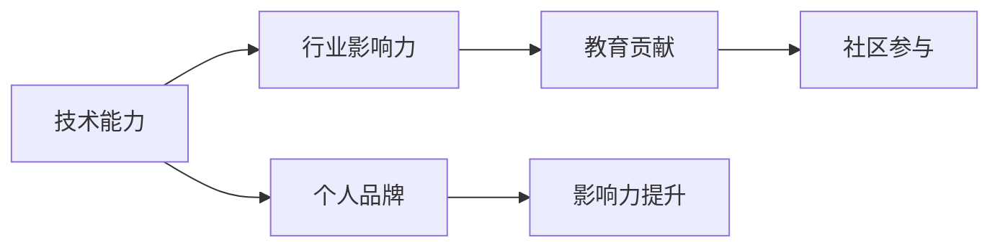

                 

# 程序员如何打造个人IP矩阵

## 1. 背景介绍

在当今这个信息爆炸的时代，个人品牌（Personal Branding）已成为程序员不可忽视的重要能力之一。个人IP矩阵（Personal IP Matrix）是一种将个人知识、技能、经验和影响力进行系统化管理的方法，通过塑造独特且持久的个人品牌，帮助程序员在职业发展、技术交流、知识传播等方面获得更大的影响力和价值。本文将详细探讨如何通过打造个人IP矩阵，提升程序员的职业价值，实现从技术专家到行业领袖的转变。

## 2. 核心概念与联系

### 2.1 核心概念概述

个人IP矩阵（Personal IP Matrix）是一种将个人品牌管理系统化的工具，它将个人品牌分为多个维度，每个维度代表一个方面的个人形象和价值主张。通过构建和优化这些维度，程序员可以更系统、更有目的地塑造自己的品牌，提升个人在行业内的知名度和影响力。

- **技术能力**：代表个人在特定技术栈或领域的专业水平。
- **行业影响力**：指个人在行业内外的声誉和影响力。
- **教育贡献**：包括个人在技术教学、知识传播和培训方面的贡献。
- **社区参与**：指个人在技术社区的活跃程度和贡献。
- **个人品牌**：个人在公众形象、公众形象管理及品牌传播方面的能力。

### 2.2 核心概念原理和架构的 Mermaid 流程图



这个流程图展示了个人IP矩阵的逻辑架构，其中各维度的互相影响和提升关系。

## 3. 核心算法原理 & 具体操作步骤

### 3.1 算法原理概述

构建个人IP矩阵的算法原理，基于心理学中的认知地图（Cognitive Maps）和社交网络分析（Social Network Analysis）。通过系统化的评估和优化个人品牌各维度的表现，识别和放大自身优势，构建独特的个人品牌。

### 3.2 算法步骤详解

1. **自我评估**：列出自己在技术能力、行业影响力、教育贡献、社区参与和个人品牌各方面的表现。可以使用SWOT分析（Strengths, Weaknesses, Opportunities, Threats）来帮助自己更全面地认识自身优势和不足。

2. **目标设定**：根据自我评估结果，设定短期和长期目标，明确想要提升的具体维度。例如，如果技术能力是当前的主要瓶颈，可以设定参加高级别技术比赛、发表技术论文等具体目标。

3. **资源整合**：搜集并整理相关资源，包括技术文档、教育资源、社交媒体账号等，这些资源将作为提升各维度表现的辅助工具。

4. **持续优化**：定期回顾个人品牌各维度的表现，根据最新目标和市场反馈，调整优化策略。

### 3.3 算法优缺点

**优点**：
- **系统化管理**：通过将个人品牌分解为多个维度，更系统地管理和优化。
- **提升效率**：能够明确自身优势和不足，针对性地提升各个维度。
- **增强认知**：通过评估和调整，增强个人对自身品牌和行业趋势的认知。

**缺点**：
- **复杂度高**：涉及多个维度的评估和优化，需要一定时间和精力投入。
- **个性化难度**：每个人的情况不同，需要根据自身特点进行定制化调整。

### 3.4 算法应用领域

个人IP矩阵适用于各类职业发展阶段的程序员，尤其是希望在技术、管理、创业等方向进一步发展的技术人员。通过建立和优化个人IP矩阵，可以提升个人在行业内的知名度和影响力，从而在职业发展中获取更多的机会。

## 4. 数学模型和公式 & 详细讲解

### 4.1 数学模型构建

设个人品牌价值 $V$ 可以由技术能力 $T$、行业影响力 $I$、教育贡献 $E$、社区参与 $C$ 和个人品牌 $P$ 共同决定。其中 $T, I, E, C, P$ 分别表示技术能力、行业影响力、教育贡献、社区参与和个人品牌的表现。则数学模型可以表示为：

$$
V = f(T, I, E, C, P)
$$

其中 $f$ 为某个复杂函数，表示各维度对品牌价值的影响权重和关系。

### 4.2 公式推导过程

设 $T, I, E, C, P$ 在时间 $t$ 的值为 $T(t), I(t), E(t), C(t), P(t)$，则品牌价值的变化可以表示为：

$$
\Delta V = f(T(t+1), I(t+1), E(t+1), C(t+1), P(t+1)) - f(T(t), I(t), E(t), C(t), P(t))
$$

为了简化问题，假设 $f$ 为线性函数，则有：

$$
\Delta V = \alpha_T \Delta T + \alpha_I \Delta I + \alpha_E \Delta E + \alpha_C \Delta C + \alpha_P \Delta P
$$

其中 $\alpha_T, \alpha_I, \alpha_E, \alpha_C, \alpha_P$ 为各维度的权重系数。

### 4.3 案例分析与讲解

假设某程序员当前的技术能力 $T(t)$ 为中等水平，行业影响力 $I(t)$ 较低，教育贡献 $E(t)$ 表现平平，社区参与 $C(t)$ 活跃但无深度，个人品牌 $P(t)$ 一般。设其希望在1年内技术能力提升至高级水平，行业影响力提升至中等，教育贡献提升至良好，社区参与深度加强，个人品牌提升至优秀。假设各维度的权重系数相同，则品牌价值变化为：

$$
\Delta V = \alpha_T \Delta T + \alpha_I \Delta I + \alpha_E \Delta E + \alpha_C \Delta C + \alpha_P \Delta P
$$

这意味着，通过针对性的努力，该程序员的品牌价值可以显著提升。例如，通过参加高级技术培训、发表技术论文、积极参与社区讨论、提升公开演讲能力等，可以逐步实现品牌价值的提升。

## 5. 项目实践：代码实例和详细解释说明

### 5.1 开发环境搭建

1. **选择开发环境**：选择一个适合个人品牌的开发环境，如Github、Medium等，用于发布和传播内容。
2. **配置开发工具**：使用如Jupyter Notebook、VSCode等工具，提高开发效率。
3. **学习资源整合**：搜集并整合相关学习资源，如技术博客、教学视频、开源项目等。

### 5.2 源代码详细实现

假设我们希望通过发布技术博客来提升个人品牌，可以使用Jupyter Notebook实现如下功能：

1. **内容撰写**：在Jupyter Notebook中编写博客内容，保存为文件。
2. **自动化发布**：使用Python脚本和API自动将博客发布到Github Pages或Medium等平台。
3. **数据分析**：使用Python库对博客的访问量、评论数等数据进行统计分析。

### 5.3 代码解读与分析

以下是一个使用Python脚本自动发布博客的示例代码：

```python
import os
from medium博客API import MediumAPI
from githubAPI import GithubAPI

# 登录Medium和Github账户
medium_api = MediumAPI()
github_api = GithubAPI()

# 获取博客文件列表
blog_files = os.listdir('blog')
for file in blog_files:
    # 发布博客到Medium
    medium_api.publish_blog(file)
    
    # 发布博客到Github Pages
    github_api.push_blog_to_github_pages(file)
```

### 5.4 运行结果展示

通过上述脚本，我们可以在Medium和Github Pages上定期发布技术博客，并通过API分析访问量、评论数等数据，了解博客的效果。这不仅能够提升我们的技术分享能力，还能在行业内提升知名度和影响力。

## 6. 实际应用场景

### 6.1 技术交流平台

在技术交流平台上，如Stack Overflow、GitHub等，通过发布高质量的技术回答、开源项目和代码实现，可以显著提升个人品牌。通过积极参与技术讨论和问题解答，可以树立自己在某个技术栈上的权威地位。

### 6.2 技术博客

通过撰写技术博客，分享学习心得和实践经验，可以积累一定的行业影响力和知名度。在博客中，除了分享技术知识，还可以加入个人故事和见解，增加内容的吸引力和共鸣。

### 6.3 公开演讲和培训

通过公开演讲和培训课程，可以提升个人品牌的影响力和可信度。例如，参加技术会议、在线直播讲座、技术沙龙等活动，展示自己的技术水平和交流能力。

## 7. 工具和资源推荐

### 7.1 学习资源推荐

1. **《程序员如何打造个人IP》**：详细介绍了个人IP矩阵的构建方法和案例，适用于各类技术专业人士。
2. **《品牌战略管理》**：由知名品牌专家撰写，涵盖个人品牌管理和市场策略的全面知识。
3. **《网络影响力营销》**：介绍如何通过社交媒体提升个人品牌影响力的实用技巧。
4. **《Python编程实践》**：通过Python进行个人IP矩阵的开发和数据分析，适合编程爱好者。

### 7.2 开发工具推荐

1. **Jupyter Notebook**：强大的交互式开发环境，适合数据分析和脚本编写。
2. **GitHub Pages**：免费的企业级博客平台，适合发布技术博客和文章。
3. **Medium**：全球最大的技术社区平台之一，适合分享和传播个人技术知识。
4. **VSCode**：功能强大的编程编辑器，支持Python、JavaScript等多种语言。

### 7.3 相关论文推荐

1. **《从编程到品牌：程序员的个人IP打造》**：介绍如何通过技术博客和开源项目提升个人品牌。
2. **《社交媒体对个人品牌的影响》**：研究社交媒体在个人品牌建设中的作用和策略。
3. **《技术演讲的艺术》**：介绍如何通过公开演讲提升个人品牌影响力和技术权威。
4. **《个人IP矩阵优化算法研究》**：探讨如何通过优化算法提升个人品牌各维度的表现。

## 8. 总结：未来发展趋势与挑战

### 8.1 研究成果总结

本文通过系统介绍个人IP矩阵的概念和构建方法，为程序员提供了系统化的个人品牌管理工具。个人IP矩阵的构建，不仅能够提升技术水平和行业影响力，还能通过教育贡献和社区参与等方式，全面提升个人品牌价值。

### 8.2 未来发展趋势

未来，个人IP矩阵将与AI、大数据、区块链等前沿技术结合，进一步提升个人品牌管理和优化效率。例如，通过AI分析用户反馈和数据，自动调整个人品牌的优化策略；通过区块链技术，实现个人品牌的加密和不可篡改性。

### 8.3 面临的挑战

个人IP矩阵的构建和维护需要耗费大量时间和精力，可能对职业发展造成一定影响。此外，如何确保个人品牌的独特性和真实性，避免抄袭和侵权等问题，也是重要的挑战。

### 8.4 研究展望

未来，个人IP矩阵的构建方法将更侧重于个性化和自动化。通过AI和大数据分析，自动识别和优化个人品牌的各维度表现，减少人为干预和错误。同时，将结合更多的社会网络分析方法，提升品牌的影响力和可信度。

## 9. 附录：常见问题与解答

**Q1：如何选择合适的技术栈和平台进行个人IP矩阵构建？**

A: 选择技术栈和平台应基于自己的技术兴趣、行业需求和个人目标。例如，如果专注于前端技术，可以选择Medium作为平台，使用JavaScript进行开发。如果专注于后端开发，可以选择Github Pages和Jupyter Notebook进行个人博客和技术分享。

**Q2：个人IP矩阵是否适合所有技术专业人士？**

A: 个人IP矩阵适合希望在技术领域内提升知名度和影响力的程序员。然而，对于专注于学术研究或隐私保护的用户，可能需要考虑其他方式来构建个人品牌。

**Q3：如何平衡个人品牌建设和职业发展？**

A: 个人品牌建设不应影响职业发展，而应成为其有益补充。选择适合自己的平台和技术，合理分配时间和精力，确保个人品牌建设和职业发展相辅相成。

**Q4：如何应对个人品牌的维护和优化？**

A: 定期回顾和调整个人品牌各维度的表现，确保品牌与个人职业目标和市场趋势保持一致。利用数据分析工具，及时获取反馈和改进策略。

**Q5：如何避免个人品牌的侵权和抄袭问题？**

A: 明确个人品牌的版权和知识产权，在发布内容时标注原创性和引用来源。使用区块链技术进行内容加密和不可篡改性验证，确保个人品牌的真实性和可信度。

---

作者：禅与计算机程序设计艺术 / Zen and the Art of Computer Programming

