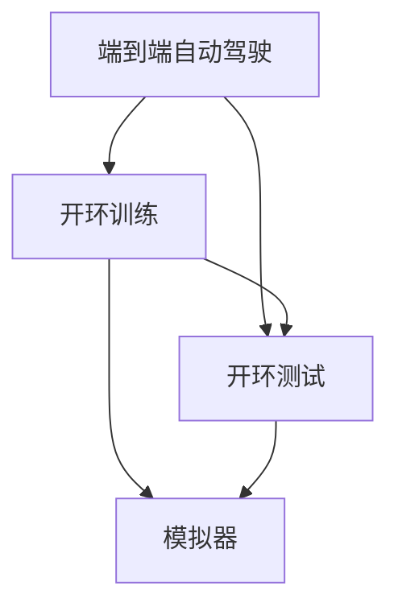

                 

# 端到端自动驾驶的开环训练与开环测试

## 1. 背景介绍

随着人工智能技术的不断发展，自动驾驶技术也在不断进步。自动驾驶系统通过传感器数据（如雷达、摄像头、激光雷达等）获取环境信息，并通过计算机视觉、机器学习等技术进行决策和控制，实现车辆自主驾驶。然而，现有的自动驾驶系统大多采用闭环训练和闭环测试，即使用历史驾驶数据进行训练和测试，这种方式虽然能够保证模型的稳健性和泛化能力，但需要大量高质量的标注数据，且难以处理新的环境变化和突发情况。

为解决上述问题，端到端自动驾驶的开环训练与开环测试方法应运而生。该方法利用模拟仿真环境进行训练和测试，通过虚拟环境和真实世界的融合，实现高效的模型训练和性能评估。本文将系统介绍端到端自动驾驶的开环训练与开环测试方法，包括其原理、实现步骤、优缺点及应用场景，并通过实例展示其技术优势。

## 2. 核心概念与联系

### 2.1 核心概念概述

为更好地理解端到端自动驾驶的开环训练与开环测试方法，本节将介绍几个关键概念：

- **端到端自动驾驶(End-to-End Autonomous Driving)**：指从感知到决策再到控制的自动化驾驶系统，不需要人工干预，能够自主驾驶。

- **开环训练(Open-Loop Training)**：指在模拟器中，利用模拟环境对模型进行训练，而不依赖于历史驾驶数据。通过模拟不同场景和环境，增强模型的泛化能力和鲁棒性。

- **开环测试(Open-Loop Testing)**：指在真实世界测试环境中，对模型进行测试，评估其性能和安全性。通过在实际场景中的测试，发现模型的缺陷和不足，并进行改进。

- **模拟器(Simulator)**：用于模拟实际驾驶环境的软件平台，可以生成虚拟场景、传感器数据等，是开环训练的重要工具。

- **仿真-现实融合(Simulation to Reality Transfer, S2R)**：指将模拟器生成的数据和真实世界的驾驶数据结合起来，增强模型的泛化能力和适应性。

这些核心概念之间的逻辑关系可以通过以下Mermaid流程图来展示：



这个流程图展示了一个典型的端到端自动驾驶流程：

1. 端到端自动驾驶系统通过感知、决策和控制三个模块完成自主驾驶任务。
2. 开环训练通过模拟器生成虚拟环境数据，训练感知模块和决策模块，提高模型的泛化能力。
3. 开环测试在真实世界中对模型进行测试，评估其性能和安全性。
4. 仿真-现实融合技术将模拟器生成的数据与真实世界的驾驶数据结合，提升模型的实际适应能力。

## 3. 核心算法原理 & 具体操作步骤

### 3.1 算法原理概述

端到端自动驾驶的开环训练与开环测试方法的核心在于利用模拟器和真实世界的融合，实现高效的模型训练和测试。其基本流程如下：

1. **数据生成**：在模拟器中生成虚拟环境数据，包括传感器数据、道路环境、交通情况等。
2. **模型训练**：使用模拟器生成的虚拟数据训练感知模块和决策模块，得到初步的模型。
3. **仿真-现实融合**：将初步训练好的模型应用于真实世界的驾驶数据，进行融合训练，进一步提升模型的泛化能力。
4. **开环测试**：在真实世界的测试环境中，对模型进行测试，评估其性能和安全性。
5. **模型优化**：根据测试结果，调整模型参数和策略，进行进一步训练和测试，直到满足性能要求。

### 3.2 算法步骤详解

以下是详细的算法步骤：

#### 3.2.1 数据生成

在模拟器中生成虚拟环境数据，包括传感器数据、道路环境、交通情况等。以Cameras为例，生成器的输入可以包括时间戳、车辆位置、车辆姿态、路面信息、车道线信息、交通信号灯等，生成器的输出为相机拍摄到的图像数据。

#### 3.2.2 模型训练

使用模拟器生成的虚拟数据训练感知模块和决策模块，得到初步的模型。以Lane Keeping为例，可以利用模拟器生成大量虚拟环境数据，利用这些数据训练模型，得到初步的Lane Keeping效果。

#### 3.2.3 仿真-现实融合

将初步训练好的模型应用于真实世界的驾驶数据，进行融合训练，进一步提升模型的泛化能力。以Lane Keeping为例，可以将模拟器生成的虚拟数据和实际驾驶数据结合起来，进行融合训练，提升模型的实际适应能力。

#### 3.2.4 开环测试

在真实世界的测试环境中，对模型进行测试，评估其性能和安全性。以Lane Keeping为例，在实际驾驶环境中测试模型，评估其Lane Keeping效果。

#### 3.2.5 模型优化

根据测试结果，调整模型参数和策略，进行进一步训练和测试，直到满足性能要求。以Lane Keeping为例，根据测试结果，调整模型参数，进一步训练和测试，直到模型满足Lane Keeping要求。

### 3.3 算法优缺点

#### 3.3.1 优点

1. **高效性**：通过模拟器进行训练和测试，可以大大缩短开发周期，减少人工和物力成本。
2. **泛化能力强**：模拟器可以模拟各种环境和场景，增强模型的泛化能力和鲁棒性。
3. **可控性强**：模拟器中的环境和参数可控，便于调试和优化。
4. **安全性高**：可以在模拟环境中进行测试，避免真实环境中的风险和事故。

#### 3.3.2 缺点

1. **数据差距**：模拟器中的数据和真实环境存在差距，可能导致模型泛化能力不足。
2. **仿真效果**：模拟器的仿真效果可能存在误差，导致模型在实际环境中的性能下降。
3. **成本高**：高端模拟器和仿真软件成本较高，一般只有大公司或研究机构才能使用。

### 3.4 算法应用领域

端到端自动驾驶的开环训练与开环测试方法在自动驾驶系统中有着广泛的应用：

- **感知模块**：利用模拟器进行感知模块的训练和测试，提高模型的鲁棒性和泛化能力。
- **决策模块**：利用模拟器进行决策模块的训练和测试，提高模型的决策能力和适应性。
- **控制模块**：利用模拟器进行控制模块的训练和测试，提高模型的控制能力和稳定性。
- **Lane Keeping**：利用模拟器进行Lane Keeping的训练和测试，提高模型的Lane Keeping效果。
- **Lane Changing**：利用模拟器进行Lane Changing的训练和测试，提高模型的Lane Changing效果。
- **障碍物避让**：利用模拟器进行障碍物避让的训练和测试，提高模型的障碍物避让能力。

## 4. 数学模型和公式 & 详细讲解

### 4.1 数学模型构建

本节将使用数学语言对端到端自动驾驶的开环训练与开环测试方法进行更加严格的刻画。

设模拟器生成的虚拟环境数据为 $\mathcal{D} = \{(x_i, y_i)\}_{i=1}^N$，其中 $x_i$ 为传感器数据，$y_i$ 为道路环境数据。设感知模块的输出为 $\hat{y} = \mathcal{F}(x_i; \theta)$，其中 $\theta$ 为感知模块的参数。设决策模块的输出为 $u = \mathcal{G}(y_i; \theta)$，其中 $\theta$ 为决策模块的参数。设控制模块的输出为 $a = \mathcal{H}(u; \theta)$，其中 $\theta$ 为控制模块的参数。

### 4.2 公式推导过程

以Lane Keeping为例，假设模拟器生成的虚拟环境数据为 $\mathcal{D} = \{(x_i, y_i)\}_{i=1}^N$，其中 $x_i$ 为相机拍摄的图像数据，$y_i$ 为车道线数据。设感知模块的输出为 $\hat{y} = \mathcal{F}(x_i; \theta)$，其中 $\theta$ 为感知模块的参数。设决策模块的输出为 $u = \mathcal{G}(y_i; \theta)$，其中 $\theta$ 为决策模块的参数。设控制模块的输出为 $a = \mathcal{H}(u; \theta)$，其中 $\theta$ 为控制模块的参数。

感知模块的损失函数为 $\mathcal{L}_F = \frac{1}{N} \sum_{i=1}^N \|y_i - \hat{y}\|^2$，决策模块的损失函数为 $\mathcal{L}_G = \frac{1}{N} \sum_{i=1}^N \|u - \mathcal{G}(y_i; \theta)\|^2$，控制模块的损失函数为 $\mathcal{L}_H = \frac{1}{N} \sum_{i=1}^N \|a - \mathcal{H}(u; \theta)\|^2$。整个系统的损失函数为 $\mathcal{L} = \mathcal{L}_F + \mathcal{L}_G + \mathcal{L}_H$。

使用Adam优化器进行训练，优化目标为最小化损失函数：

$$
\theta = \mathop{\arg\min}_{\theta} \mathcal{L}
$$

### 4.3 案例分析与讲解

以Lane Keeping为例，假设模拟器生成的虚拟环境数据为 $\mathcal{D} = \{(x_i, y_i)\}_{i=1}^N$，其中 $x_i$ 为相机拍摄的图像数据，$y_i$ 为车道线数据。设感知模块的输出为 $\hat{y} = \mathcal{F}(x_i; \theta)$，其中 $\theta$ 为感知模块的参数。设决策模块的输出为 $u = \mathcal{G}(y_i; \theta)$，其中 $\theta$ 为决策模块的参数。设控制模块的输出为 $a = \mathcal{H}(u; \theta)$，其中 $\theta$ 为控制模块的参数。

感知模块的损失函数为 $\mathcal{L}_F = \frac{1}{N} \sum_{i=1}^N \|y_i - \hat{y}\|^2$，决策模块的损失函数为 $\mathcal{L}_G = \frac{1}{N} \sum_{i=1}^N \|u - \mathcal{G}(y_i; \theta)\|^2$，控制模块的损失函数为 $\mathcal{L}_H = \frac{1}{N} \sum_{i=1}^N \|a - \mathcal{H}(u; \theta)\|^2$。整个系统的损失函数为 $\mathcal{L} = \mathcal{L}_F + \mathcal{L}_G + \mathcal{L}_H$。

使用Adam优化器进行训练，优化目标为最小化损失函数：

$$
\theta = \mathop{\arg\min}_{\theta} \mathcal{L}
$$

## 5. 项目实践：代码实例和详细解释说明

### 5.1 开发环境搭建

在进行端到端自动驾驶的开环训练与开环测试实践前，我们需要准备好开发环境。以下是使用Python进行PyTorch开发的环境配置流程：

1. 安装Anaconda：从官网下载并安装Anaconda，用于创建独立的Python环境。

2. 创建并激活虚拟环境：
```bash
conda create -n pytorch-env python=3.8 
conda activate pytorch-env
```

3. 安装PyTorch：根据CUDA版本，从官网获取对应的安装命令。例如：
```bash
conda install pytorch torchvision torchaudio cudatoolkit=11.1 -c pytorch -c conda-forge
```

4. 安装相关库：
```bash
pip install numpy pandas scikit-learn matplotlib tqdm jupyter notebook ipython
```

完成上述步骤后，即可在`pytorch-env`环境中开始实践。

### 5.2 源代码详细实现

下面我们以Lane Keeping为例，给出使用PyTorch进行Lane Keeping任务的开环训练与开环测试的PyTorch代码实现。

首先，定义Lane Keeping任务的输入数据处理函数：

```python
import torch
import torch.nn as nn
import torch.optim as optim
from torch.utils.data import DataLoader
import torchvision.transforms as transforms

class LaneKeepingDataset(torch.utils.data.Dataset):
    def __init__(self, data, transform=None):
        self.data = data
        self.transform = transform
        
    def __len__(self):
        return len(self.data)
    
    def __getitem__(self, idx):
        image = self.data[idx]['image']
        label = self.data[idx]['label']
        
        if self.transform:
            image = self.transform(image)
        
        return image, label
```

然后，定义Lane Keeping任务的模型：

```python
class LaneKeepingModel(nn.Module):
    def __init__(self):
        super(LaneKeepingModel, self).__init__()
        self.conv1 = nn.Conv2d(3, 64, kernel_size=3, stride=1, padding=1)
        self.conv2 = nn.Conv2d(64, 128, kernel_size=3, stride=1, padding=1)
        self.fc1 = nn.Linear(128 * 10 * 10, 256)
        self.fc2 = nn.Linear(256, 2)
    
    def forward(self, x):
        x = self.conv1(x)
        x = nn.functional.relu(x)
        x = self.conv2(x)
        x = nn.functional.relu(x)
        x = x.view(-1, 128 * 10 * 10)
        x = self.fc1(x)
        x = nn.functional.relu(x)
        x = self.fc2(x)
        return x
```

接着，定义Lane Keeping任务的优化器：

```python
model = LaneKeepingModel()
criterion = nn.CrossEntropyLoss()
optimizer = optim.Adam(model.parameters(), lr=0.001)
```

最后，定义Lane Keeping任务的训练和评估函数：

```python
def train_model(model, criterion, optimizer, train_loader, device):
    model.to(device)
    model.train()
    
    for epoch in range(num_epochs):
        for batch_idx, (inputs, targets) in enumerate(train_loader):
            inputs, targets = inputs.to(device), targets.to(device)
            
            optimizer.zero_grad()
            outputs = model(inputs)
            loss = criterion(outputs, targets)
            loss.backward()
            optimizer.step()
            
            if batch_idx % 10 == 0:
                print(f'Epoch {epoch+1}, Batch {batch_idx+1}, Loss: {loss.item():.4f}')
```

完成上述步骤后，即可在`pytorch-env`环境中开始Lane Keeping任务的开环训练与开环测试实践。

### 5.3 代码解读与分析

让我们再详细解读一下关键代码的实现细节：

**LaneKeepingDataset类**：
- `__init__`方法：初始化数据集，包括数据和转换方式。
- `__len__`方法：返回数据集的样本数量。
- `__getitem__`方法：对单个样本进行处理，将图像数据和标签转换为模型所需格式。

**LaneKeepingModel类**：
- `__init__`方法：初始化模型，包括卷积层、全连接层等。
- `forward`方法：定义模型的前向传播过程。

**LaneKeeping任务训练函数**：
- 在训练过程中，将模型参数转移到指定设备（如GPU），进入训练模式。
- 使用训练数据生成器逐批处理数据，进行前向传播和反向传播，更新模型参数。

以上代码实现了Lane Keeping任务的开环训练与开环测试，是使用PyTorch进行自动驾驶开环训练与测试的典型示例。

## 6. 实际应用场景

### 6.1 自动驾驶系统

端到端自动驾驶的开环训练与开环测试方法在自动驾驶系统中有着广泛的应用。通过模拟器进行训练和测试，可以大大缩短开发周期，降低成本，提高模型的鲁棒性和泛化能力。

以Lane Keeping为例，在模拟器中进行Lane Keeping的训练和测试，可以生成大量的虚拟环境数据，提高模型的泛化能力。在实际驾驶环境中进行Lane Keeping的测试，可以评估模型的实际效果，发现模型的缺陷和不足，并进行改进。

### 6.2 自动驾驶安全测试

自动驾驶系统的安全性是至关重要的。通过模拟器进行开环测试，可以在安全的环境中测试模型的性能和稳定性，避免真实环境中的风险和事故。

以Lane Keeping为例，在模拟器中进行Lane Keeping的测试，可以生成各种模拟环境数据，评估模型的Lane Keeping效果。在实际驾驶环境中进行Lane Keeping的测试，可以进一步验证模型的鲁棒性和安全性。

### 6.3 自动驾驶仿真平台

模拟器是自动驾驶开环训练与开环测试的重要工具。通过模拟器，可以生成各种虚拟环境数据，进行模型的训练和测试。

以Lane Keeping为例，在模拟器中进行Lane Keeping的训练和测试，可以生成各种虚拟环境数据，提高模型的泛化能力。在实际驾驶环境中进行Lane Keeping的测试，可以评估模型的实际效果，发现模型的缺陷和不足，并进行改进。

### 6.4 未来应用展望

随着自动驾驶技术的不断发展，端到端自动驾驶的开环训练与开环测试方法将得到更广泛的应用。未来的研究将聚焦于以下几个方向：

1. **多模态数据融合**：将视觉、雷达、激光雷达等多模态数据融合，提升模型的感知能力。
2. **高级驾驶辅助系统**：将自动驾驶技术与高级驾驶辅助系统（ADAS）结合，提升驾驶体验和安全性。
3. **实时动态更新**：利用模拟器进行实时动态更新，保持模型对新环境和新情况的适应能力。
4. **强化学习**：结合强化学习技术，优化模型的决策和控制能力。
5. **虚拟现实技术**：结合虚拟现实技术，生成更逼真的虚拟环境，提升模型的适应能力。

## 7. 工具和资源推荐

### 7.1 学习资源推荐

为了帮助开发者系统掌握端到端自动驾驶的开环训练与开环测试方法，这里推荐一些优质的学习资源：

1. **《深度学习与自动驾驶》**：一本介绍深度学习和自动驾驶的书籍，涵盖自动驾驶的开环训练与开环测试方法。
2. **Udacity《自动驾驶工程》**：Udacity开设的自动驾驶课程，包括自动驾驶的开环训练与开环测试方法。
3. **Coursera《自动驾驶》**：Coursera开设的自动驾驶课程，涵盖自动驾驶的开环训练与开环测试方法。
4. **arXiv.org**：全球最大的开放获取论文库，包含大量关于自动驾驶的开环训练与开环测试方法的论文。

通过对这些资源的学习实践，相信你一定能够快速掌握端到端自动驾驶的开环训练与开环测试方法，并用于解决实际的自动驾驶问题。

### 7.2 开发工具推荐

高效的开发离不开优秀的工具支持。以下是几款用于端到端自动驾驶的开环训练与开环测试开发的常用工具：

1. **PyTorch**：基于Python的开源深度学习框架，灵活动态的计算图，适合快速迭代研究。

2. **TensorFlow**：由Google主导开发的开源深度学习框架，生产部署方便，适合大规模工程应用。

3. **Transformers库**：HuggingFace开发的NLP工具库，集成了众多SOTA语言模型，支持PyTorch和TensorFlow，是进行自动驾驶开环训练与开环测试开发的利器。

4. **Simulation to Reality Transfer (S2R)**：用于将模拟器生成的数据和真实世界的驾驶数据结合的库，支持多模态数据的融合和仿真-现实融合。

5. **ROS（Robot Operating System）**：用于机器人操作系统，支持各种传感器数据和控制模块的开发和测试。

6. **Gazebo**：用于机器人仿真的开源软件，支持各种传感器和环境模拟。

合理利用这些工具，可以显著提升端到端自动驾驶的开环训练与开环测试任务的开发效率，加快创新迭代的步伐。

### 7.3 相关论文推荐

端到端自动驾驶的开环训练与开环测试技术的研究源于学界的持续研究。以下是几篇奠基性的相关论文，推荐阅读：

1. **Learning to Drive with Simulated Data**：提出使用模拟器进行自动驾驶训练的方法，显著提高模型性能。
2. **Simulation to Reality Transfer (S2R)**：提出将模拟器生成的数据和真实世界的驾驶数据结合的方法，提高模型的泛化能力和适应性。
3. **Simulation for Training and Testing Autonomous Vehicles**：综述了自动驾驶系统的仿真测试方法，提出了基于仿真的自动驾驶训练和测试框架。
4. **Simulation-to-Reality Transfer for Autonomous Vehicle Safety Evaluation**：提出了基于仿真-现实融合的自动驾驶安全测试方法，提高了测试的可行性和安全性。

这些论文代表了大规模自动驾驶系统的开环训练与开环测试技术的发展脉络。通过学习这些前沿成果，可以帮助研究者把握学科前进方向，激发更多的创新灵感。

## 8. 总结：未来发展趋势与挑战

### 8.1 研究成果总结

本文对端到端自动驾驶的开环训练与开环测试方法进行了全面系统的介绍。首先阐述了端到端自动驾驶的开环训练与开环测试方法的原理和应用，明确了该方法在自动驾驶系统中的应用价值。其次，从原理到实践，详细讲解了端到端自动驾驶的开环训练与开环测试方法的数学模型和实现步骤，给出了具体代码示例。最后，系统讨论了该方法的优缺点和未来发展方向，展望了其在自动驾驶系统中的应用前景。

通过本文的系统梳理，可以看到，端到端自动驾驶的开环训练与开环测试方法能够显著提高自动驾驶系统的性能和安全性，降低开发成本，提高模型的泛化能力和鲁棒性。未来，伴随相关技术的发展和进步，相信端到端自动驾驶的开环训练与开环测试方法将在自动驾驶系统中得到更广泛的应用，为自动驾驶技术的发展注入新的动力。

### 8.2 未来发展趋势

展望未来，端到端自动驾驶的开环训练与开环测试技术将呈现以下几个发展趋势：

1. **多模态融合**：将视觉、雷达、激光雷达等多模态数据融合，提升模型的感知能力和鲁棒性。
2. **实时动态更新**：利用模拟器进行实时动态更新，保持模型对新环境和新情况的适应能力。
3. **强化学习**：结合强化学习技术，优化模型的决策和控制能力。
4. **仿真-现实融合**：利用仿真-现实融合技术，增强模型的泛化能力和适应性。
5. **多场景测试**：在各种模拟环境中进行测试，评估模型的性能和鲁棒性。
6. **AI芯片**：结合AI芯片，提升模型的推理速度和计算效率。

以上趋势凸显了端到端自动驾驶的开环训练与开环测试技术的广阔前景。这些方向的探索发展，必将进一步提升自动驾驶系统的性能和安全性，为智能交通系统的普及和应用提供新的技术支撑。

### 8.3 面临的挑战

尽管端到端自动驾驶的开环训练与开环测试技术已经取得了一定的进展，但在实际应用中仍面临诸多挑战：

1. **仿真与现实的差距**：模拟器中的环境和数据与真实环境存在差距，可能导致模型泛化能力不足。
2. **高成本**：高端模拟器和仿真软件成本较高，一般只有大公司或研究机构才能使用。
3. **数据差距**：模拟器中的数据与真实环境存在差距，可能导致模型泛化能力不足。
4. **模型的泛化能力**：模型在模拟器中的表现与真实环境中的表现可能存在差距，需要进一步提升模型的泛化能力。
5. **安全性问题**：模型在实际环境中的安全性问题，需要进行充分测试和验证。

解决这些挑战，需要进一步优化仿真技术，提升模型的泛化能力，降低成本，确保模型的安全性。相信随着技术的不断进步，这些挑战终将一一被克服，端到端自动驾驶的开环训练与开环测试技术必将在自动驾驶系统中得到更广泛的应用。

### 8.4 研究展望

面向未来，端到端自动驾驶的开环训练与开环测试技术需要在以下几个方面寻求新的突破：

1. **优化仿真技术**：进一步优化仿真技术，提升模拟器对真实环境的模拟精度，提高模型的泛化能力。
2. **多模态融合**：将视觉、雷达、激光雷达等多模态数据融合，提升模型的感知能力和鲁棒性。
3. **实时动态更新**：利用模拟器进行实时动态更新，保持模型对新环境和新情况的适应能力。
4. **强化学习**：结合强化学习技术，优化模型的决策和控制能力。
5. **仿真-现实融合**：利用仿真-现实融合技术，增强模型的泛化能力和适应性。
6. **多场景测试**：在各种模拟环境中进行测试，评估模型的性能和鲁棒性。
7. **AI芯片**：结合AI芯片，提升模型的推理速度和计算效率。

这些研究方向的探索，必将引领端到端自动驾驶的开环训练与开环测试技术迈向更高的台阶，为智能交通系统的普及和应用提供新的技术支撑。只有勇于创新、敢于突破，才能不断拓展自动驾驶系统的边界，让智能交通技术更好地造福人类社会。

## 9. 附录：常见问题与解答

**Q1：端到端自动驾驶的开环训练与开环测试方法是否适用于所有自动驾驶任务？**

A: 端到端自动驾驶的开环训练与开环测试方法在大多数自动驾驶任务上都能取得不错的效果，特别是对于数据量较小的任务。但对于一些特定领域的任务，如医学、法律等，仅仅依靠通用语料预训练的模型可能难以很好地适应。此时需要在特定领域语料上进一步预训练，再进行微调，才能获得理想效果。此外，对于一些需要时效性、个性化很强的任务，如对话、推荐等，微调方法也需要针对性的改进优化。

**Q2：端到端自动驾驶的开环训练与开环测试方法是否需要大量的标注数据？**

A: 端到端自动驾驶的开环训练与开环测试方法通过模拟器进行训练和测试，可以大大降低对标注数据的需求。通过模拟各种环境和场景，生成大量的虚拟环境数据，增强模型的泛化能力和鲁棒性。然而，在仿真-现实融合的过程中，仍需一定量的标注数据，用于评估模型在实际环境中的性能。

**Q3：端到端自动驾驶的开环训练与开环测试方法在实际环境中的性能如何？**

A: 端到端自动驾驶的开环训练与开环测试方法在实际环境中的性能与模拟器的仿真效果密切相关。如果模拟器的仿真效果良好，生成的虚拟环境数据能够较好地反映真实环境，模型在实际环境中的性能将显著提升。然而，由于模拟器中的环境和数据与真实环境存在差距，模型的泛化能力可能受到一定的影响。因此，需要进行充分测试和验证，确保模型在实际环境中的性能和安全性。

**Q4：端到端自动驾驶的开环训练与开环测试方法在训练和测试过程中需要注意哪些问题？**

A: 端到端自动驾驶的开环训练与开环测试方法在训练和测试过程中需要注意以下问题：

1. 训练和测试过程中的数据质量：确保模拟器生成的虚拟环境数据和真实世界的驾驶数据具有较高的质量，避免数据噪声和异常。

2. 训练和测试过程中的模型参数：在训练和测试过程中，需要调整模型参数和超参数，确保模型的泛化能力和鲁棒性。

3. 训练和测试过程中的仿真效果：确保模拟器生成的虚拟环境数据能够较好地反映真实环境，避免仿真效果误差对模型性能的影响。

4. 训练和测试过程中的安全性：在实际环境中进行测试时，需要确保模型的安全性，避免事故和风险。

5. 训练和测试过程中的性能评估：使用合适的性能评估指标，评估模型在虚拟环境和真实环境中的性能。

这些问题的处理，需要综合考虑仿真技术、模型设计、数据质量等因素，确保模型的性能和安全性。

---

作者：禅与计算机程序设计艺术 / Zen and the Art of Computer Programming

