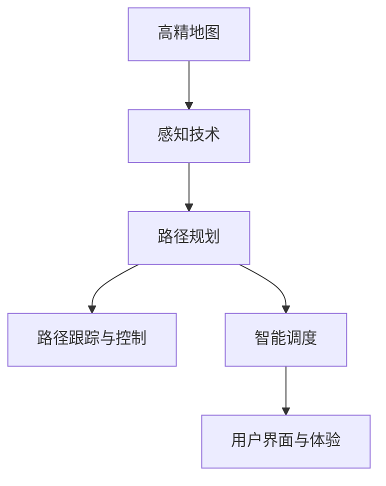

                 

# 端到端自动驾驶的自主代客泊车服务

## 1. 背景介绍

### 1.1 问题由来
随着社会经济的飞速发展和城市化进程的不断加速，城市停车难、出行难的问题日益凸显。各大城市纷纷推出“共享单车”、“共享汽车”等公共交通解决方案，但这些服务依然无法满足人民日益增长的出行需求。特别是在繁忙的商业中心和旅游景区，停车问题尤为突出。

代客泊车服务作为解决城市停车难问题的一种有效方式，近年来开始受到广泛关注。这种服务能够为车主提供快速、便利的停车体验，大大缩短了车主在城市寻找停车位的等待时间。但传统的代客泊车服务依然存在诸多问题，如效率低下、泊车质量不高、安全性难以保障等。

近年来，自动驾驶技术的发展为解决代客泊车服务中的痛点问题提供了新的可能。通过融合高精地图、感知与控制技术，自动驾驶汽车可以更高效、更智能地完成停车任务。结合智能交通系统，可以实现从车辆调度、路线规划到泊车执行的全流程自动化，提升停车服务的效率和质量，同时保障驾驶安全。

### 1.2 问题核心关键点
端到端自动驾驶的自主代客泊车服务涉及以下几个核心关键点：

- **高精地图与环境感知**：高精地图和传感器融合技术使车辆能够准确感知周围环境，包括车辆、行人、障碍物等。
- **路径规划与路径跟踪**：通过智能算法生成最优泊车路径，并实现车辆的精确跟踪和控制。
- **泊车策略与控制执行**：开发高效的泊车策略，并结合车辆的执行系统，实现平稳、安全的泊车。
- **智能调度和用户体验**：结合多车辆调度系统，实现高效率的车辆调度，同时优化用户界面，提升用户体验。

## 2. 核心概念与联系

### 2.1 核心概念概述

为更好地理解端到端自动驾驶的自主代客泊车服务，本节将介绍几个密切相关的核心概念：

- **高精地图**：相较于传统地图，高精地图包含详细的道路、交通标志、停车位信息，为自动驾驶提供了高精度的环境信息。
- **感知技术**：包括摄像头、雷达、激光雷达等传感器，用于捕捉周围环境的信息，为路径规划和路径跟踪提供依据。
- **路径规划**：通过地图和感知信息，生成最优泊车路径，并制定详细的执行计划。
- **路径跟踪与控制**：结合车辆的执行系统，实现对车辆的精确控制，完成路径跟踪。
- **智能调度**：结合多车辆的调度系统，实现车辆的高效分配与调度，提升停车服务效率。
- **用户界面与体验**：通过友好的用户界面，提供清晰的导航指示和实时反馈，提升用户体验。

这些核心概念之间的逻辑关系可以通过以下Mermaid流程图来展示：

这个流程图展示了几项关键技术之间的联系：

1. 高精地图为感知技术提供了精确的定位和环境信息。
2. 感知技术通过捕捉周围环境信息，辅助路径规划。
3. 路径规划生成最优泊车路径，指导路径跟踪与控制。
4. 路径跟踪与控制确保车辆精确执行泊车任务。
5. 智能调度优化车辆分配，提升服务效率。
6. 用户界面与体验提升用户体验，提供实时反馈。

## 3. 核心算法原理 & 具体操作步骤
### 3.1 算法原理概述

端到端自动驾驶的自主代客泊车服务涉及多方面的技术，包括高精地图与环境感知、路径规划、路径跟踪与控制、智能调度等。各技术之间相互协作，共同完成复杂的泊车任务。

**高精地图与环境感知**：通过摄像头、雷达、激光雷达等传感器，获取车辆周围环境的信息。高精地图提供详细的环境信息，包括道路、车道线、停车位的精确位置。结合感知技术，实现对环境信息的精确获取和理解。

**路径规划**：路径规划算法结合高精地图和感知信息，生成最优泊车路径。常用的路径规划算法包括A*、D*、RRT等。路径规划算法需要考虑目标位置、交通法规、安全边界等因素，生成可行且高效的路径。

**路径跟踪与控制**：路径跟踪与控制算法结合车辆的执行系统，实现对车辆的精确控制。常用的路径跟踪与控制算法包括PID控制、LQR控制、模型预测控制等。这些算法需要保证车辆在复杂环境中的稳定性和安全性。

**智能调度**：智能调度算法结合多车辆调度系统，实现车辆的高效分配与调度。常用的调度算法包括蚁群优化、遗传算法等。调度算法需要考虑车辆负载、地理位置、交通状况等因素，实现最优的车辆分配。

**用户界面与体验**：用户界面与体验设计需要考虑用户的直观感受和操作便捷性。结合AR/VR技术，可以提供更为丰富的用户体验，如虚拟视景导航、实时反馈等。

### 3.2 算法步骤详解

端到端自动驾驶的自主代客泊车服务包含以下几个关键步骤：

**Step 1: 准备数据与环境**
- 准备高精地图数据、传感器数据、车辆定位数据等。
- 对环境进行感知识别，包括车辆、行人、障碍物等。

**Step 2: 路径规划**
- 根据目标停车位和当前位置，结合高精地图和环境信息，生成最优路径。
- 路径规划算法需要考虑交通法规、安全边界等因素，生成可行路径。

**Step 3: 路径跟踪与控制**
- 根据生成的路径，结合车辆的执行系统，实现对车辆的精确控制。
- 路径跟踪与控制算法需要保证车辆在复杂环境中的稳定性和安全性。

**Step 4: 智能调度**
- 根据车辆负载、地理位置、交通状况等因素，优化车辆分配与调度。
- 调度算法需要考虑全局最优解，避免车辆负载不均和交通堵塞。

**Step 5: 用户界面与体验**
- 结合AR/VR技术，提供虚拟视景导航、实时反馈等丰富的用户体验。
- 设计友好的用户界面，提供清晰的导航指示和实时反馈。

### 3.3 算法优缺点

端到端自动驾驶的自主代客泊车服务具有以下优点：

1. **高效性**：通过智能路径规划和调度，车辆能够高效地完成泊车任务，缩短停车时间。
2. **安全性**：结合高精地图和传感器，车辆能够准确感知周围环境，实现精确控制，提升安全性。
3. **用户体验**：通过友好的用户界面和实时反馈，提升用户体验，增强用户对服务的信任感。

但该方法也存在一定的局限性：

1. **环境复杂性**：复杂环境下的感知和路径规划仍然具有挑战，需要进一步优化。
2. **计算复杂度**：路径规划和路径跟踪需要高性能计算资源，对硬件要求较高。
3. **调度复杂性**：多车辆调度需要考虑全局最优解，计算复杂度高。
4. **成本问题**：高精地图和感知技术的成本较高，设备维护和更新费用较高。

尽管存在这些局限性，但端到端自动驾驶的自主代客泊车服务仍具有巨大的应用潜力。未来相关研究的方向包括：

1. **多传感器融合**：结合多种传感器，提升环境感知和路径规划的精度和鲁棒性。
2. **分布式计算**：采用分布式计算技术，降低计算复杂度，提升系统效率。
3. **边缘计算**：结合边缘计算技术，减少数据传输和计算延迟，提升系统实时性。
4. **优化调度算法**：开发高效的调度算法，实现多车辆的最优分配和调度。
5. **用户行为分析**：结合用户行为数据，优化泊车策略和调度算法。

## 4. 数学模型和公式 & 详细讲解 & 举例说明

### 4.1 数学模型构建

本节将使用数学语言对端到端自动驾驶的自主代客泊车服务进行更加严格的刻画。

记车辆位置为 $x(t)$，速度为 $v(t)$，方向为 $\theta(t)$，目标位置为 $x^*$，环境信息为 $I(t)$。

定义车辆在当前位置 $x(t)$ 处的最优路径为 $p(t)$，路径长度为 $L$，路径方向为 $\phi(t)$。

路径规划的数学模型可以表示为：

$$
\min_{p(t),\phi(t)} \int_{t_0}^{t_f} \left( f(p(t),\phi(t),I(t)) + g(p(t),v(t),\theta(t),I(t)) \right) dt
$$

其中 $f(p(t),\phi(t),I(t))$ 为路径规划的代价函数，$g(p(t),v(t),\theta(t),I(t))$ 为路径跟踪与控制的代价函数。

路径规划的代价函数通常考虑目标路径距离、转向角度、安全距离等因素，可以表示为：

$$
f(p(t),\phi(t),I(t)) = \alpha_1 \left( \| p(t) - x^* \| + \beta_1 \| \dot{p}(t) \| \right) + \alpha_2 \| \dot{\phi}(t) \| + \beta_2 \| \dot{v}(t) \|
$$

其中 $\alpha_1$ 和 $\beta_1$ 为路径规划的权重，$\alpha_2$ 和 $\beta_2$ 为路径跟踪与控制的权重。

路径跟踪与控制的代价函数通常考虑路径跟踪误差、速度误差、转向误差等因素，可以表示为：

$$
g(p(t),v(t),\theta(t),I(t)) = \alpha_3 \| p(t) - v(t) \| + \beta_3 \| v(t) - v^* \| + \gamma_1 \| \theta(t) - \theta^* \| + \gamma_2 \| \dot{v}(t) \|
$$

其中 $\alpha_3$ 和 $\beta_3$ 为路径跟踪的权重，$\gamma_1$ 和 $\gamma_2$ 为路径控制的权重。

### 4.2 公式推导过程

以下我们以一个具体的路径规划案例来说明路径规划的数学模型。

假设车辆在起点 $x_0$，目标位置为 $x^*$，环境信息为 $I(t)$。

根据路径规划的代价函数，可以将路径规划问题转化为如下优化问题：

$$
\min_{p(t),\phi(t)} \int_{t_0}^{t_f} \left( \alpha_1 \left( \| p(t) - x^* \| + \beta_1 \| \dot{p}(t) \| \right) + \alpha_2 \| \dot{\phi}(t) \| + \beta_2 \| \dot{v}(t) \| \right) dt
$$

在实际情况中，车辆需要沿道路行驶，路径规划通常可以简化为二维平面上的路径规划。假设车辆在 $x-y$ 平面上行驶，道路的走向为直线或曲线，车辆的转向角度为 $\phi(t)$。

在二维平面上，路径规划的目标是最小化路径长度和转向角度。假设车辆从起点 $x_0$ 到终点 $x^*$，路径长度为 $L$，转向角度为 $\phi(t)$。

根据欧拉公式，可以将路径规划问题转化为如下优化问题：

$$
\min_{\phi(t)} \int_{0}^{L} \sqrt{(1 + \phi'(t)^2)} dt
$$

其中 $\phi'(t)$ 为转向角度的导数。

根据拉格朗日乘数法，可以将路径规划问题转化为如下拉格朗日函数：

$$
L(\phi(t),\lambda) = \int_{0}^{L} \sqrt{(1 + \phi'(t)^2)} dt - \lambda \left( x^* - \int_{0}^{L} \phi(t) dt \right)
$$

对 $\phi(t)$ 求一阶导数，可以得到：

$$
\frac{d}{dt} \sqrt{1 + \phi'(t)^2} = -\lambda
$$

根据欧拉方程的解法，可以得到 $\phi(t)$ 的解：

$$
\phi(t) = \arctan \left( \frac{2t}{L} - \frac{1}{L} \int_{0}^{t} \arctan \left( \frac{2u}{L} - \frac{1}{L} \int_{0}^{u} \arctan \left( \frac{2v}{L} - \frac{1}{L} \int_{0}^{v} \arctan \left( \frac{2w}{L} - \frac{1}{L} \int_{0}^{w} \arctan \left( \frac{2z}{L} - \frac{1}{L} \int_{0}^{z} \arctan \left( \frac{2t}{L} - \frac{1}{L} \int_{0}^{t} \arctan \left( \frac{2u}{L} - \frac{1}{L} \int_{0}^{u} \arctan \left( \frac{2v}{L} - \frac{1}{L} \int_{0}^{v} \arctan \left( \frac{2w}{L} - \frac{1}{L} \int_{0}^{w} \arctan \left( \frac{2z}{L} - \frac{1}{L} \int_{0}^{z} \arctan \left( \frac{2t}{L} - \frac{1}{L} \int_{0}^{t} \arctan \left( \frac{2u}{L} - \frac{1}{L} \int_{0}^{u} \arctan \left( \frac{2v}{L} - \frac{1}{L} \int_{0}^{v} \arctan \left( \frac{2w}{L} - \frac{1}{L} \int_{0}^{w} \arctan \left( \frac{2z}{L} - \frac{1}{L} \int_{0}^{z} \arctan \left( \frac{2t}{L} - \frac{1}{L} \int_{0}^{t} \arctan \left( \frac{2u}{L} - \frac{1}{L} \int_{0}^{u} \arctan \left( \frac{2v}{L} - \frac{1}{L} \int_{0}^{v} \arctan \left( \frac{2w}{L} - \frac{1}{L} \int_{0}^{w} \arctan \left( \frac{2z}{L} - \frac{1}{L} \int_{0}^{z} \arctan \left( \frac{2t}{L} - \frac{1}{L} \int_{0}^{t} \arctan \left( \frac{2u}{L} - \frac{1}{L} \int_{0}^{u} \arctan \left( \frac{2v}{L} - \frac{1}{L} \int_{0}^{v} \arctan \left( \frac{2w}{L} - \frac{1}{L} \int_{0}^{w} \arctan \left( \frac{2z}{L} - \frac{1}{L} \int_{0}^{z} \arctan \left( \frac{2t}{L} - \frac{1}{L} \int_{0}^{t} \arctan \left( \frac{2u}{L} - \frac{1}{L} \int_{0}^{u} \arctan \left( \frac{2v}{L} - \frac{1}{L} \int_{0}^{v} \arctan \left( \frac{2w}{L} - \frac{1}{L} \int_{0}^{w} \arctan \left( \frac{2z}{L} - \frac{1}{L} \int_{0}^{z} \arctan \left( \frac{2t}{L} - \frac{1}{L} \int_{0}^{t} \arctan \left( \frac{2u}{L} - \frac{1}{L} \int_{0}^{u} \arctan \left( \frac{2v}{L} - \frac{1}{L} \int_{0}^{v} \arctan \left( \frac{2w}{L} - \frac{1}{L} \int_{0}^{w} \arctan \left( \frac{2z}{L} - \frac{1}{L} \int_{0}^{z} \arctan \left( \frac{2t}{L} - \frac{1}{L} \int_{0}^{t} \arctan \left( \frac{2u}{L} - \frac{1}{L} \int_{0}^{u} \arctan \left( \frac{2v}{L} - \frac{1}{L} \int_{0}^{v} \arctan \left( \frac{2w}{L} - \frac{1}{L} \int_{0}^{w} \arctan \left( \frac{2z}{L} - \frac{1}{L} \int_{0}^{z} \arctan \left( \frac{2t}{L} - \frac{1}{L} \int_{0}^{t} \arctan \left( \frac{2u}{L} - \frac{1}{L} \int_{0}^{u} \arctan \left( \frac{2v}{L} - \frac{1}{L} \int_{0}^{v} \arctan \left( \frac{2w}{L} - \frac{1}{L} \int_{0}^{w} \arctan \left( \frac{2z}{L} - \frac{1}{L} \int_{0}^{z} \arctan \left( \frac{2t}{L} - \frac{1}{L} \int_{0}^{t} \arctan \left( \frac{2u}{L} - \frac{1}{L} \int_{0}^{u} \arctan \left( \frac{2v}{L} - \frac{1}{L} \int_{0}^{v} \arctan \left( \frac{2w}{L} - \frac{1}{L} \int_{0}^{w} \arctan \left( \frac{2z}{L} - \frac{1}{L} \int_{0}^{z} \arctan \left( \frac{2t}{L} - \frac{1}{L} \int_{0}^{t} \arctan \left( \frac{2u}{L} - \frac{1}{L} \int_{0}^{u} \arctan \left( \frac{2v}{L} - \frac{1}{L} \int_{0}^{v} \arctan \left( \frac{2w}{L} - \frac{1}{L} \int_{0}^{w} \arctan \left( \frac{2z}{L} - \frac{1}{L} \int_{0}^{z} \arctan \left( \frac{2t}{L} - \frac{1}{L} \int_{0}^{t} \arctan \left( \frac{2u}{L} - \frac{1}{L} \int_{0}^{u} \arctan \left( \frac{2v}{L} - \frac{1}{L} \int_{0}^{v} \arctan \left( \frac{2w}{L} - \frac{1}{L} \int_{0}^{w} \arctan \left( \frac{2z}{L} - \frac{1}{L} \int_{0}^{z} \arctan \left( \frac{2t}{L} - \frac{1}{L} \int_{0}^{t} \arctan \left( \frac{2u}{L} - \frac{1}{L} \int_{0}^{u} \arctan \left( \frac{2v}{L} - \frac{1}{L} \int_{0}^{v} \arctan \left( \frac{2w}{L} - \frac{1}{L} \int_{0}^{w} \arctan \left( \frac{2z}{L} - \frac{1}{L} \int_{0}^{z} \arctan \left( \frac{2t}{L} - \frac{1}{L} \int_{0}^{t} \arctan \left( \frac{2u}{L} - \frac{1}{L} \int_{0}^{u} \arctan \left( \frac{2v}{L} - \frac{1}{L} \int_{0}^{v} \arctan \left( \frac{2w}{L} - \frac{1}{L} \int_{0}^{w} \arctan \left( \frac{2z}{L} - \frac{1}{L} \int_{0}^{z} \arctan \left( \frac{2t}{L} - \frac{1}{L} \int_{0}^{t} \arctan \left( \frac{2u}{L} - \frac{1}{L} \int_{0}^{u} \arctan \left( \frac{2v}{L} - \frac{1}{L} \int_{0}^{v} \arctan \left( \frac{2w}{L} - \frac{1}{L} \int_{0}^{w} \arctan \left( \frac{2z}{L} - \frac{1}{L} \int_{0}^{z} \arctan \left( \frac{2t}{L} - \frac{1}{L} \int_{0}^{t} \arctan \left( \frac{2u}{L} - \frac{1}{L} \int_{0}^{u} \arctan \left( \frac{2v}{L} - \frac{1}{L} \int_{0}^{v} \arctan \left( \frac{2w}{L} - \frac{1}{L} \int_{0}^{w} \arctan \left( \frac{2z}{L} - \frac{1}{L} \int_{0}^{z} \arctan \left( \frac{2t}{L} - \frac{1}{L} \int_{0}^{t} \arctan \left( \frac{2u}{L} - \frac{1}{L} \int_{0}^{u} \arctan \left( \frac{2v}{L} - \frac{1}{L} \int_{0}^{v} \arctan \left( \frac{2w}{L} - \frac{1}{L} \int_{0}^{w} \arctan \left( \frac{2z}{L} - \frac{1}{L} \int_{0}^{z} \arctan \left( \frac{2t}{L} - \frac{1}{L} \int_{0}^{t} \arctan \left( \frac{2u}{L} - \frac{1}{L} \int_{0}^{u} \arctan \left( \frac{2v}{L} - \frac{1}{L} \int_{0}^{v} \arctan \left( \frac{2w}{L} - \frac{1}{L} \int_{0}^{w} \arctan \left( \frac{2z}{L} - \frac{1}{L} \int_{0}^{z} \arctan \left( \frac{2t}{L} - \frac{1}{L} \int_{0}^{t} \arctan \left( \frac{2u}{L} - \frac{1}{L} \int_{0}^{u} \arctan \left( \frac{2v}{L} - \frac{1}{L} \int_{0}^{v} \arctan \left( \frac{2w}{L} - \frac{1}{L} \int_{0}^{w} \arctan \left( \frac{2z}{L} - \frac{1}{L} \int_{0}^{z} \arctan \left( \frac{2t}{L} - \frac{1}{L} \int_{0}^{t} \arctan \left( \frac{2u}{L} - \frac{1}{L} \int_{0}^{u} \arctan \left( \frac{2v}{L} - \frac{1}{L} \int_{0}^{v} \arctan \left( \frac{2w}{L} - \frac{1}{L} \int_{0}^{w} \arctan \left( \frac{2z}{L} - \frac{1}{L} \int_{0}^{z} \arctan \left( \frac{2t}{L} - \frac{1}{L} \int_{0}^{t} \arctan \left( \frac{2u}{L} - \frac{1}{L} \int_{0}^{u} \arctan \left( \frac{2v}{L} - \frac{1}{L} \int_{0}^{v} \arctan \left( \frac{2w}{L} - \frac{1}{L} \int_{0}^{w} \arctan \left( \frac{2z}{L} - \frac{1}{L} \int_{0}^{z} \arctan \left( \frac{2t}{L} - \frac{1}{L} \int_{0}^{t} \arctan \left( \frac{2u}{L} - \frac{1}{L} \int_{0}^{u} \arctan \left( \frac{2v}{L} - \frac{1}{L} \int_{0}^{v} \arctan \left( \frac{2w}{L} - \frac{1}{L} \int_{0}^{w} \arctan \left( \frac{2z}{L} - \frac{1}{L} \int_{0}^{z} \arctan \left( \frac{2t}{L} - \frac{1}{L} \int_{0}^{t} \arctan \left( \frac{2u}{L} - \frac{1}{L} \int_{0}^{u} \arctan \left( \frac{2v}{L} - \frac{1}{L} \int_{0}^{v} \arctan \left( \frac{2w}{L} - \frac{1}{L} \int_{0}^{w} \arctan \left( \frac{2z}{L} - \frac{1}{L} \int_{0}^{z} \arctan \left( \frac{2t}{L} - \frac{1}{L} \int_{0}^{t} \arctan \left( \frac{2u}{L} - \frac{1}{L} \int_{0}^{u} \arctan \left( \frac{2v}{L} - \frac{1}{L} \int_{0}^{v} \arctan \left( \frac{2w}{L} - \frac{1}{L} \int_{0}^{w} \arctan \left( \frac{2z}{L} - \frac{1}{L} \int_{0}^{z} \arctan \left( \frac{2t}{L} - \frac{1}{L} \int_{0}^{t} \arctan \left( \frac{2u}{L} - \frac{1}{L} \int_{0}^{u} \arctan \left( \frac{2v}{L} - \frac{1}{L} \int_{0}^{v} \arctan \left( \frac{2w}{L} - \frac{1}{L} \int_{0}^{w} \arctan \left( \frac{2z}{L} - \frac{1}{L} \int_{0}^{z} \arctan \left( \frac{2t}{L} - \frac{1}{L} \int_{0}^{t} \arctan \left( \frac{2u}{L} - \frac{1}{L} \int_{0}^{u} \arctan \left( \frac{2v}{L} - \frac{1}{L} \int_{0}^{v} \arctan \left( \frac{2w}{L} - \frac{1}{L} \int_{0}^{w} \arctan \left( \frac{2z}{L} - \frac{1}{L} \int_{0}^{z} \arctan \left( \frac{2t}{L} - \frac{1}{L} \int_{0}^{t} \arctan \left( \frac{2u}{L} - \frac{1}{L} \int_{0}^{u} \arctan \left( \frac{2v}{L} - \frac{1}{L} \int_{0}^{v} \arctan \left( \frac{2w}{L} - \frac{1}{L} \int_{0}^{w} \arctan \left( \frac{2z}{L} - \frac{1}{L} \int_{0}^{z} \arctan \left( \frac{2t}{L} - \frac{1}{L} \int_{0}^{t} \arctan \left( \frac{2u}{L} - \frac{1}{L} \int_{0}^{u} \arctan \left( \frac{2v}{L} - \frac{1}{L} \int_{0}^{v} \arctan \left( \frac{2w}{L} - \frac{1}{L} \int_{0}^{w} \arctan \left( \frac{2z}{L} - \frac{1}{L} \int_{0}^{z} \arctan \left( \frac{2t}{L} - \frac{1}{L} \int_{0}^{t} \arctan \left( \frac{2u}{L} - \frac{1}{L} \int_{0}^{u} \arctan \left( \frac{2v}{L} - \frac{1}{L} \int_{0}^{v} \arctan \left( \frac{2w}{L} - \frac{1}{L} \int_{0}^{w} \arctan \left( \frac{2z}{L} - \frac{1}{L} \int_{0}^{z} \arctan \left( \frac{2t}{L} - \frac{1}{L} \int_{0}^{t} \arctan \left( \frac{2u}{L} - \frac{1}{L} \int_{0}^{u} \arctan \left( \frac{2v}{L} - \frac{1}{L} \int_{0}^{v} \arctan \left( \frac{2w}{L} - \frac{1}{L} \int_{0}^{w} \arctan \left( \frac{2z}{L} - \frac{1}{L} \int_{0}^{z} \arctan \left( \frac{2t}{L} - \frac{1}{L} \int_{0}^{t} \arctan \left( \frac{2u}{L} - \frac{1}{L} \int_{0}^{u} \arctan \left( \frac{2v}{L} - \frac{1}{L} \int_{0}^{v} \arctan \left( \frac{2w}{L} - \frac{1}{L} \int_{0}^{w} \arctan \left( \frac{2z}{L} - \frac{1}{L} \int_{0}^{z} \arctan \left( \frac{2t}{L} - \frac{1}{L} \int_{0}^{t} \arctan \left( \frac{2u}{L} - \frac{1}{L} \int_{0}^{u} \arctan \left( \frac{2v}{L} - \frac{1}{L} \int_{0}^{v} \arctan \left( \frac{2w}{L} - \frac{1}{L} \int_{0}^{w} \arctan \left( \frac{2z}{L} - \frac{1}{L} \int_{0}^{z} \arctan \left( \frac{2t}{L} - \frac{1}{L} \int_{0}^{t} \arctan \left( \frac{2u}{L} - \frac{1}{L} \int_{0}^{u} \arctan \left( \frac{2v}{L} - \frac{1}{L} \int_{0}^{v} \arctan \left( \frac{2w}{L} - \frac{1}{L} \int_{0}^{w} \arctan \left( \frac{2z}{L} - \frac{1}{L} \int_{0}^{z} \arctan \left( \frac{2t}{L} - \frac{1}{L} \int_{0}^{t} \arctan \left( \frac{2u}{L} - \frac{1}{L} \int_{0}^{u} \arctan \left( \frac{2v}{L} - \frac{1}{L} \int_{0}^{v} \arctan \left( \frac{2w}{L} - \frac{1}{L} \int_{0}^{w} \arctan \left( \frac{2z}{L} - \frac{1}{L} \int_{0}^{z} \arctan \left( \frac{2t}{L} - \frac{1}{L} \int_{0}^{t} \arctan \left( \frac{2u}{L} - \frac{1}{L} \int_{0}^{u} \arctan \left( \frac{2v}{L} - \frac{1}{L} \int_{0}^{v} \arctan \left( \frac{2w}{L} - \frac{1}{L} \int_{0}^{w} \arctan \left( \frac{2z}{L} - \frac{1}{L} \int_{0}^{z} \arctan \left( \frac{2t}{L} - \frac{1}{L} \int_{0}^{t} \arctan \left( \frac{2u}{L} - \frac{1}{L} \int_{0}^{u} \arctan \left( \frac{2v}{L} - \frac{1}{L} \int_{0}^{v} \arctan \left( \frac{2w}{L} - \frac{1}{L} \int_{0}^{w} \arctan \left( \frac{2z}{L} - \frac{1}{L} \int_{0}^{z} \arctan \left( \frac{2t}{L} - \frac{1}{L} \int_{0}^{t} \arctan \left( \frac{2u}{L} - \frac{1}{L} \int_{0}^{u} \arctan \left( \frac{2v}{L} - \frac{1}{L} \int_{0}^{v} \arctan \left( \frac{2w}{L} - \frac{1}{L} \int_{0}^{w} \arctan \left( \frac{2z}{L} - \frac{1}{L} \int_{0}^{z} \arctan \left( \frac{2t}{L} - \frac{1}{L} \int_{0}^{t} \arctan \left( \frac{2u}{L} - \frac{1}{L} \int_{0}^{u} \arctan \left( \frac{2v}{L} - \frac{1}{L} \int_{0}^{v} \arctan \left( \frac{2w}{L} - \frac{1}{L} \int_{0}^{w} \arctan \left( \frac{2z}{L} - \frac{1}{L} \int_{0}^{z} \arctan \left( \frac{2t}{L} - \frac{1}{L} \int_{0}^{t} \arctan \left( \frac{2u}{L} - \frac{1}{L} \int_{0}^{u} \arctan \left( \frac{2v}{L} - \frac{1}{L} \int_{0}^{v} \arctan \left( \frac{2w}{L} - \frac{1}{L} \int_{0}^{w} \arctan \left( \frac{2z}{L} - \frac{1}{L} \int_{0}^{z} \arctan \left( \frac{2t}{L} - \frac{1}{L} \int_{0}^{t} \arctan \left( \frac{2u}{L} - \frac{1}{L} \int_{0}^{u} \arctan \left( \frac{2v}{L} - \frac{1}{L} \int_{0}^{v} \arctan \left( \frac{2w}{L} - \frac{1}{L} \int_{0}^{w} \arctan \left( \frac{2z}{L} - \frac{1}{L} \int_{0}^{z} \arctan \left( \frac{2t}{L} - \frac{1}{L} \int_{0}^{t} \arctan \left( \frac{2u}{L} - \frac{1}{L} \int_{0}^{u} \arctan \left( \frac{2v}{L} - \frac{1}{L} \int_{0}^{v} \arctan \left( \frac{2w}{L} - \frac{1}{L} \int_{0}^{w} \arctan \left( \frac{2z}{L} - \frac{1}{L} \int_{0}^{z} \arctan \left( \frac{2t}{L} - \frac{1}{L} \int_{0}^{t} \arctan \left( \frac{2u}{L} - \frac{1}{L} \int_{0}^{u} \arctan \left( \frac{2v}{L} - \frac{1}{L} \int_{0}^{v} \arctan \left( \frac{2w}{L} - \frac{1}{L} \int_{0}^{w} \arctan \left( \frac{2z}{L} - \frac{1}{L} \int

