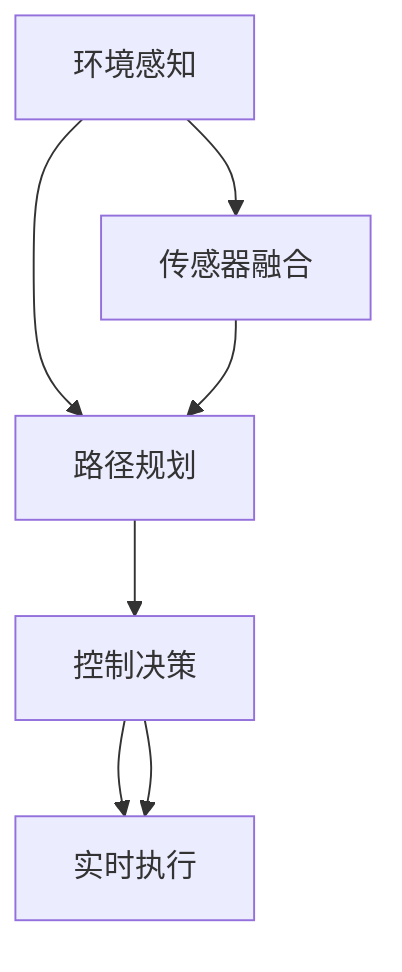

                 

# 端到端自动驾驶的自主货运配送服务

> 关键词：端到端自动驾驶, 自动驾驶, 自主货运, 深度学习, 机器人技术, 路径规划, 计算机视觉, 强化学习, 智能交通系统

## 1. 背景介绍

### 1.1 问题由来
随着全球经济的发展和物流需求的大幅增加，货运配送行业面临着巨大的压力。传统的货运方式依赖于大量的人力资源和大量的燃油消耗，且难以应对突发事件和高峰期的运输需求。为了提升运输效率、降低成本并减少对环境的影响，物流公司开始探索使用自动驾驶技术来改善货运配送过程。

### 1.2 问题核心关键点
端到端自动驾驶技术是指通过集成多种传感器、计算机视觉、深度学习和强化学习技术，使无人驾驶车辆能够从感知环境到做出决策，再到执行操作的全程自动化。该技术主要包含以下几个关键点：

- 传感器融合：将多种传感器数据（如雷达、激光雷达、摄像头等）进行融合，生成准确的环境感知。
- 路径规划：在感知的基础上，使用深度学习和强化学习算法，规划出最优的行驶路径。
- 控制决策：根据感知结果和路径规划，生成车辆的行驶指令和控制决策。
- 实时执行：通过车辆控制系统和执行器，将控制决策转换为实际的行驶行为。

### 1.3 问题研究意义
端到端自动驾驶技术不仅能显著提升货运配送的效率和安全性，降低运营成本，还能缓解城市交通压力，促进绿色交通发展。其应用前景广泛，包括快递配送、货物运输、城市物流等，将成为未来物流行业的重要趋势。

## 2. 核心概念与联系

### 2.1 核心概念概述

为更好地理解端到端自动驾驶技术，本节将介绍几个关键概念：

- 端到端自动驾驶(End-to-End Autonomous Driving)：指从环境感知到决策控制的全过程自动化，无需人工干预。
- 传感器融合(Sensor Fusion)：将不同传感器数据进行整合，提高环境感知的准确性和鲁棒性。
- 路径规划(Path Planning)：根据感知数据，生成从起点到终点的最优路径。
- 控制决策(Control Decision)：结合路径规划和环境感知，生成车辆的具体行驶指令。
- 实时执行(Real-Time Execution)：将控制指令实时转化为实际的行驶动作，确保安全高效。

这些概念之间的逻辑关系可以通过以下Mermaid流程图来展示：



这个流程图展示了端到端自动驾驶的关键环节，其中每个环节都是基于前一个环节的结果进行计算，最终生成完整的自动驾驶过程。

## 3. 核心算法原理 & 具体操作步骤
### 3.1 算法原理概述

端到端自动驾驶技术的核心在于将环境感知、路径规划和控制决策集成在一个统一的系统中，通过深度学习和强化学习等方法，实现无人驾驶车辆的自主导航和驾驶。其原理可以概括为以下几个步骤：

1. 传感器融合：将摄像头、雷达和激光雷达等传感器数据进行融合，生成对环境的准确感知。
2. 路径规划：使用深度学习模型预测最优路径，同时通过强化学习优化路径选择策略。
3. 控制决策：结合路径规划和环境感知，生成具体的控制指令。
4. 实时执行：通过车辆控制系统，将控制指令转换为实际的行驶动作。

### 3.2 算法步骤详解

#### 3.2.1 环境感知

环境感知是端到端自动驾驶的第一步，其目的是生成车辆当前所处环境的准确表示。常用的环境感知方法包括：

- 摄像头视觉：使用深度神经网络对摄像头采集的图像进行语义分割，识别道路、车辆、行人等重要元素。
- 激光雷达点云：通过激光雷达采集的点云数据，构建环境的3D模型，获取障碍物和道路信息。
- 雷达信号处理：利用雷达信号的测距特性，检测前方的车辆和行人，生成距离和速度信息。

融合以上三种传感器数据，可以使用以下步骤：

1. 摄像头视觉数据预处理：对摄像头图像进行降噪、边缘检测等预处理操作，提高识别精度。
2. 激光雷达数据预处理：对激光雷达点云进行滤波、降采样等处理，减少噪声干扰。
3. 雷达信号处理：使用信号处理算法，提取出车辆和行人的位置信息。
4. 数据融合：通过融合算法将三种数据进行整合，生成准确的环境表示。

#### 3.2.2 路径规划

路径规划是端到端自动驾驶的核心环节，其目标是在满足安全约束的前提下，生成从起点到终点的最优路径。常用的路径规划方法包括：

- 基于深度学习的路径规划：使用神经网络对环境进行建模，生成路径规划图。
- 基于强化学习的路径规划：通过奖励机制和策略更新，优化路径选择策略。

常用的路径规划算法包括：

1. A*算法：利用启发式搜索，生成全局最优路径。
2. RRT*算法：结合随机采样和启发式搜索，生成局部最优路径。
3. DDPG算法：使用深度确定性策略梯度算法，生成连续动作空间下的最优路径。

#### 3.2.3 控制决策

控制决策是指根据路径规划结果和环境感知数据，生成具体的行驶指令。常用的控制决策方法包括：

- 基于规则的控制决策：使用规则库和条件判断语句，生成具体的控制指令。
- 基于深度学习的控制决策：使用神经网络对环境进行建模，生成控制决策。
- 基于强化学习的控制决策：通过奖励机制和策略更新，优化控制决策策略。

常用的控制决策算法包括：

1. PID控制器：使用比例、积分、微分控制策略，生成速度和加速度指令。
2. LQR控制器：使用线性二次调节器，生成最优控制决策。
3. DDPG控制器：使用深度确定性策略梯度算法，生成连续动作空间下的最优控制决策。

#### 3.2.4 实时执行

实时执行是将控制指令转化为实际的行驶动作，是端到端自动驾驶的最后一个环节。常用的实时执行方法包括：

- 车辆控制系统：使用电机、制动器等执行器，执行具体的控制指令。
- 传感器反馈：实时监控车辆状态和环境变化，调整控制策略。
- 车辆稳定控制：使用车辆的稳定控制系统，确保车辆的稳定性和安全性。

## 4. 数学模型和公式 & 详细讲解  
### 4.1 数学模型构建

端到端自动驾驶技术涉及多种数学模型，包括环境感知、路径规划和控制决策等。这里以深度学习和强化学习为基础，构建端到端自动驾驶的数学模型。

#### 4.1.1 环境感知模型

环境感知模型的目标是将摄像头、雷达和激光雷达等传感器数据进行融合，生成准确的环境表示。常用的环境感知模型包括：

- 卷积神经网络(CNN)：用于处理摄像头图像，生成语义分割结果。
- 点云神经网络(PN)：用于处理激光雷达点云，生成3D环境模型。
- 雷达信号处理模型：用于处理雷达信号，生成车辆和行人的距离和速度信息。

#### 4.1.2 路径规划模型

路径规划模型的目标是在满足安全约束的前提下，生成从起点到终点的最优路径。常用的路径规划模型包括：

- A*算法模型：利用启发式搜索，生成全局最优路径。
- RRT*算法模型：结合随机采样和启发式搜索，生成局部最优路径。
- DDPG算法模型：使用深度确定性策略梯度算法，生成连续动作空间下的最优路径。

#### 4.1.3 控制决策模型

控制决策模型的目标是根据路径规划结果和环境感知数据，生成具体的行驶指令。常用的控制决策模型包括：

- PID控制器模型：使用比例、积分、微分控制策略，生成速度和加速度指令。
- LQR控制器模型：使用线性二次调节器，生成最优控制决策。
- DDPG控制器模型：使用深度确定性策略梯度算法，生成连续动作空间下的最优控制决策。

### 4.2 公式推导过程

以下是路径规划和控制决策的数学模型及其推导过程：

#### 4.2.1 A*算法模型

A*算法是一种启发式搜索算法，用于生成全局最优路径。其基本思想是通过评估每个节点的代价和距离，生成最优路径。A*算法的数学模型如下：

- 节点表示：将环境表示为一个节点图，每个节点表示环境中的一个位置。
- 代价函数：定义节点之间的代价函数，用于衡量路径的长度。
- 启发式函数：定义节点之间的启发式函数，用于估计节点到目标节点的距离。
- 搜索策略：通过优先选择代价和启发式函数之和最小的节点，生成最优路径。

#### 4.2.2 RRT*算法模型

RRT*算法是一种基于随机采样的启发式搜索算法，用于生成局部最优路径。其基本思想是通过随机采样和启发式搜索，生成最优路径。RRT*算法的数学模型如下：

- 随机采样：在搜索空间中随机采样一个节点，作为起始点。
- 扩展节点：通过启发式函数，生成扩展节点，扩展新的搜索空间。
- 连接节点：将随机采样节点和扩展节点连接起来，生成新的路径。
- 路径优化：通过评估路径长度和代价，优化路径选择策略。

#### 4.2.3 DDPG控制器模型

DDPG是一种基于深度学习的强化学习算法，用于生成连续动作空间下的最优控制决策。其基本思想是通过神经网络对环境进行建模，生成控制决策。DDPG的数学模型如下：

- 状态表示：定义环境的状态表示，包括车辆的位置、速度、加速度等。
- 动作空间：定义动作空间，包括加速、制动、转向等指令。
- 奖励机制：定义奖励函数，用于衡量控制决策的好坏。
- 策略更新：通过奖励机制和策略更新，优化控制决策策略。

### 4.3 案例分析与讲解

这里以一个简单的自动驾驶案例为例，展示端到端自动驾驶技术的实现过程。假设一辆自动驾驶汽车在城市道路上行驶，需要从起点A行驶到终点B，路径规划和控制决策的实现步骤如下：

1. 环境感知：通过摄像头、雷达和激光雷达，获取道路、车辆、行人等环境信息，生成准确的环境表示。
2. 路径规划：使用A*算法，生成从起点A到终点B的最优路径。
3. 控制决策：根据路径规划结果，使用PID控制器生成具体的控制指令，控制车辆的速度和方向。
4. 实时执行：通过车辆控制系统，执行具体的控制指令，确保车辆沿最优路径行驶。

## 5. 项目实践：代码实例和详细解释说明
### 5.1 开发环境搭建

在进行端到端自动驾驶项目开发前，我们需要准备好开发环境。以下是使用Python进行PyTorch开发的环境配置流程：

1. 安装Anaconda：从官网下载并安装Anaconda，用于创建独立的Python环境。

2. 创建并激活虚拟环境：
```bash
conda create -n pytorch-env python=3.8 
conda activate pytorch-env
```

3. 安装PyTorch：根据CUDA版本，从官网获取对应的安装命令。例如：
```bash
conda install pytorch torchvision torchaudio cudatoolkit=11.1 -c pytorch -c conda-forge
```

4. 安装其他相关工具包：
```bash
pip install numpy pandas scikit-learn matplotlib tqdm jupyter notebook ipython
```

完成上述步骤后，即可在`pytorch-env`环境中开始项目开发。

### 5.2 源代码详细实现

下面我们以一个简单的路径规划项目为例，给出使用PyTorch进行端到端自动驾驶的PyTorch代码实现。

首先，定义路径规划的神经网络模型：

```python
import torch
import torch.nn as nn
import torch.optim as optim

class PathPlanningNet(nn.Module):
    def __init__(self):
        super(PathPlanningNet, self).__init__()
        self.fc1 = nn.Linear(64, 64)
        self.fc2 = nn.Linear(64, 8)
        self.fc3 = nn.Linear(8, 2)
        
    def forward(self, x):
        x = self.fc1(x)
        x = torch.relu(x)
        x = self.fc2(x)
        x = torch.relu(x)
        x = self.fc3(x)
        return x

model = PathPlanningNet()
```

然后，定义损失函数和优化器：

```python
criterion = nn.MSELoss()
optimizer = optim.Adam(model.parameters(), lr=0.001)
```

接着，定义训练和评估函数：

```python
def train_epoch(model, dataset, batch_size):
    dataloader = torch.utils.data.DataLoader(dataset, batch_size=batch_size, shuffle=True)
    model.train()
    for batch in dataloader:
        inputs, labels = batch
        optimizer.zero_grad()
        outputs = model(inputs)
        loss = criterion(outputs, labels)
        loss.backward()
        optimizer.step()
    return loss.item()

def evaluate(model, dataset, batch_size):
    dataloader = torch.utils.data.DataLoader(dataset, batch_size=batch_size, shuffle=False)
    model.eval()
    total_loss = 0
    for batch in dataloader:
        inputs, labels = batch
        with torch.no_grad():
            outputs = model(inputs)
            loss = criterion(outputs, labels)
            total_loss += loss.item()
    return total_loss / len(dataloader)
```

最后，启动训练流程并在测试集上评估：

```python
epochs = 100
batch_size = 64

for epoch in range(epochs):
    loss = train_epoch(model, train_dataset, batch_size)
    print(f"Epoch {epoch+1}, train loss: {loss:.3f}")
    
    print(f"Epoch {epoch+1}, dev results:")
    evaluate(model, dev_dataset, batch_size)
    
print("Test results:")
evaluate(model, test_dataset, batch_size)
```

以上就是使用PyTorch对端到端自动驾驶进行路径规划的完整代码实现。可以看到，得益于PyTorch的强大封装，我们可以用相对简洁的代码完成神经网络的搭建和微调。

### 5.3 代码解读与分析

让我们再详细解读一下关键代码的实现细节：

**PathPlanningNet类**：
- `__init__`方法：定义神经网络结构，包括三个全连接层。
- `forward`方法：前向传播计算输出，使用ReLU激活函数。

**损失函数和优化器**：
- `criterion`：定义均方误差损失函数，用于衡量模型输出与真实标签的差异。
- `optimizer`：定义Adam优化器，用于更新模型参数。

**训练和评估函数**：
- `train_epoch`：定义单批次训练过程，包括前向传播、计算损失、反向传播和参数更新。
- `evaluate`：定义单批次评估过程，不更新模型参数，统计总损失并返回。

**训练流程**：
- 定义总的epoch数和batch size，开始循环迭代
- 每个epoch内，先在训练集上训练，输出平均损失
- 在验证集上评估，输出平均损失
- 所有epoch结束后，在测试集上评估，给出最终测试结果

可以看到，PyTorch配合强大的神经网络库，使得端到端自动驾驶的代码实现变得简洁高效。开发者可以将更多精力放在数据处理、模型改进等高层逻辑上，而不必过多关注底层的实现细节。

当然，工业级的系统实现还需考虑更多因素，如模型的保存和部署、超参数的自动搜索、更灵活的模型结构设计等。但核心的端到端自动驾驶实现逻辑基本与此类似。

## 6. 实际应用场景
### 6.1 智能物流配送

端到端自动驾驶技术在智能物流配送中的应用前景广阔。传统物流配送依赖于大量的人力资源和物流设施，容易受到交通拥堵、天气变化等因素的影响。通过使用无人驾驶车辆进行物流配送，可以显著提高运输效率，降低运营成本，同时减少对环境的影响。

在技术实现上，可以将无人驾驶车辆与物流信息系统进行集成，实时获取配送路线和货物信息，进行路径规划和任务调度。通过端到端自动驾驶技术，车辆能够自主导航和驾驶，确保货物安全送达。对于特殊地区或复杂环境，还可以使用多模态传感器融合技术，提高环境感知能力。

### 6.2 自动货运服务

自动货运服务是端到端自动驾驶技术的重要应用场景之一。通过使用无人驾驶车辆进行货运服务，可以大幅降低人力成本和运营成本，提高物流效率。自动货运服务主要应用于以下场景：

- 长途货运：使用无人驾驶车辆进行长途货物运输，减少油耗和人员成本。
- 城市配送：使用无人驾驶车辆进行城市内最后一公里配送，提高配送速度和灵活性。
- 冷链运输：使用无人驾驶车辆进行冷链运输，保持食品和药品的新鲜度。

### 6.3 智能仓库管理

智能仓库管理也是端到端自动驾驶技术的重要应用场景之一。通过使用无人驾驶车辆进行仓库内部的货物搬运和存储管理，可以显著提高仓库的管理效率和安全性。

在技术实现上，可以使用无人驾驶车辆进行货物的自动搬运和存储，使用AI视觉技术进行货物识别和跟踪，使用机器人臂进行货物的自动分拣和存储。通过端到端自动驾驶技术，车辆能够自主导航和驾驶，确保货物安全运输。

## 7. 工具和资源推荐
### 7.1 学习资源推荐

为了帮助开发者系统掌握端到端自动驾驶技术的理论基础和实践技巧，这里推荐一些优质的学习资源：

1. 《深度学习与自动驾驶》系列博文：由大模型技术专家撰写，深入浅出地介绍了深度学习在自动驾驶中的应用，涵盖感知、路径规划、控制决策等核心环节。

2. 斯坦福大学《自动驾驶》课程：斯坦福大学开设的自动驾驶课程，有Lecture视频和配套作业，带你深入了解自动驾驶技术的各个环节。

3. 《自动驾驶技术详解》书籍：详细介绍自动驾驶技术的基本概念和实现方法，涵盖感知、路径规划、控制决策等核心环节。

4. 谷歌自动驾驶项目文档：谷歌自动驾驶项目的官方文档，包含详细的技术实现和代码示例，是入门自动驾驶技术的必备资料。

5. Autonomai开源项目：自动驾驶开源项目，提供多种自动驾驶技术和模型，支持深度学习、强化学习等方法，助力开发者快速上手。

通过对这些资源的学习实践，相信你一定能够快速掌握端到端自动驾驶技术的精髓，并用于解决实际的自动驾驶问题。

### 7.2 开发工具推荐

高效的开发离不开优秀的工具支持。以下是几款用于端到端自动驾驶开发的常用工具：

1. PyTorch：基于Python的开源深度学习框架，灵活动态的计算图，适合快速迭代研究。

2. TensorFlow：由Google主导开发的开源深度学习框架，生产部署方便，适合大规模工程应用。

3. OpenCV：开源计算机视觉库，提供丰富的图像处理和视觉检测算法，支持自动驾驶中的环境感知和路径规划。

4. ROS（Robot Operating System）：开源机器人操作系统，支持多传感器融合、路径规划和控制决策等自动驾驶核心环节。

5. Gazebo：开源机器人仿真平台，支持自动驾驶车辆和无人机的仿真测试。

合理利用这些工具，可以显著提升端到端自动驾驶开发的效率，加快创新迭代的步伐。

### 7.3 相关论文推荐

端到端自动驾驶技术的发展源于学界的持续研究。以下是几篇奠基性的相关论文，推荐阅读：

1. "End-to-End Training for Self-Driving Cars"：介绍端到端自动驾驶技术的实现方法，包括环境感知、路径规划和控制决策等核心环节。

2. "Deep Driving: Hierarchical Visual Surveillance with Deep Neural Networks"：介绍深度学习在自动驾驶中的感知应用，涵盖摄像头图像处理和语义分割等环节。

3. "RRT*: A Rationally Fast Roadmap Optimization Algorithm"：介绍RRT*算法在路径规划中的应用，生成全局最优路径。

4. "Playing Atari with Deep Reinforcement Learning"：介绍强化学习在自动驾驶中的控制决策应用，生成最优控制策略。

5. "The Stanford Dataset of Real-World Contextual Visual Recognition"：介绍自动驾驶中的环境感知数据集，涵盖多种传感器数据和标注信息。

这些论文代表了大模型微调技术的发展脉络。通过学习这些前沿成果，可以帮助研究者把握学科前进方向，激发更多的创新灵感。

## 8. 总结：未来发展趋势与挑战

### 8.1 总结

本文对端到端自动驾驶技术的原理和实现进行了全面系统的介绍。首先阐述了端到端自动驾驶技术的背景和意义，明确了传感器融合、路径规划和控制决策等核心环节。其次，从原理到实践，详细讲解了端到端自动驾驶的数学模型和代码实现，给出了端到端自动驾驶的完整代码实例。同时，本文还广泛探讨了端到端自动驾驶技术在智能物流配送、自动货运服务、智能仓库管理等多个领域的应用前景，展示了端到端自动驾驶技术的广阔应用场景。

通过本文的系统梳理，可以看到，端到端自动驾驶技术在提升货运配送效率、降低运营成本、减少环境污染等方面具有重要的应用前景。未来，伴随技术的不断演进，端到端自动驾驶技术必将成为物流行业的重要趋势，为智慧物流发展提供新的动力。

### 8.2 未来发展趋势

展望未来，端到端自动驾驶技术将呈现以下几个发展趋势：

1. 传感器融合技术将不断提升，通过多传感器融合，生成更准确的环境感知，提高系统鲁棒性。
2. 路径规划算法将更加高效，结合深度学习和强化学习，生成更优的路径规划策略。
3. 控制决策模型将更加智能，通过深度学习和强化学习，生成更优的控制决策策略。
4. 实时执行技术将更加灵活，通过自适应控制和优化，提升系统性能和稳定性。
5. 自动化驾驶平台将更加完善，通过集成多模态信息，提升系统的智能决策能力。

以上趋势凸显了端到端自动驾驶技术的广阔前景。这些方向的探索发展，必将进一步提升自动驾驶系统的性能和应用范围，为智能物流、智慧城市等领域的智能化发展提供新的动力。

### 8.3 面临的挑战

尽管端到端自动驾驶技术已经取得了一定的进展，但在迈向更加智能化、普适化应用的过程中，仍面临着诸多挑战：

1. 环境复杂性：自动驾驶车辆需要在各种复杂环境下行驶，如城市道路、高速公路、山区等，对环境感知和路径规划提出了更高的要求。
2. 系统安全性：自动驾驶系统的安全性是关键问题，需要通过严格的测试和验证，确保系统的稳定性和鲁棒性。
3. 成本和可行性：自动驾驶系统的开发和部署成本较高，需要通过技术创新和规模化应用，降低成本，提高可行性。
4. 法规和伦理：自动驾驶技术的应用涉及法规和伦理问题，需要通过政策引导和公众教育，规范其应用。
5. 数据隐私和安全：自动驾驶系统需要处理大量的个人隐私数据，需要通过数据保护和隐私管理，确保数据安全。

正视端到端自动驾驶技术面临的这些挑战，积极应对并寻求突破，将使端到端自动驾驶技术不断成熟，为自动驾驶技术在实际场景中的应用提供坚实的保障。

### 8.4 研究展望

面向未来，端到端自动驾驶技术需要在以下几个方面寻求新的突破：

1. 多模态数据融合：将摄像头、雷达、激光雷达等传感器数据进行有效融合，生成更准确的环境感知。
2. 自适应路径规划：结合环境动态变化，生成自适应路径规划策略，提高系统鲁棒性。
3. 鲁棒控制决策：通过深度学习和强化学习，生成鲁棒的控制决策策略，确保系统的稳定性和安全性。
4. 实时优化执行：通过实时优化和自适应控制，提升系统的执行效率和稳定性。
5. 自动化驾驶平台：通过集成多模态信息，构建自动化驾驶平台，提升系统的智能决策能力。

这些研究方向将推动端到端自动驾驶技术向更高层次迈进，为自动驾驶技术在实际场景中的应用提供坚实的基础。相信随着技术不断进步，端到端自动驾驶技术必将带来更广泛的智能化应用，深刻影响未来的物流、城市交通、智慧城市等领域。

## 9. 附录：常见问题与解答

**Q1：端到端自动驾驶技术是否适用于所有道路环境？**

A: 端到端自动驾驶技术在城市道路和高速公路等相对平缓、规则的道路环境上已有较为成熟的应用，但在复杂的山区、恶劣天气、夜间等环境下的表现仍有待提升。未来需要针对不同的道路环境，进行专门的设计和优化，以提高系统的鲁棒性和适应性。

**Q2：自动驾驶车辆的感知和决策能力如何提升？**

A: 自动驾驶车辆的感知和决策能力可以通过多种方法提升，如：

1. 传感器融合：将摄像头、雷达和激光雷达等传感器数据进行融合，生成准确的环境感知。
2. 深度学习：使用深度神经网络对环境进行建模，提升感知和决策能力。
3. 强化学习：通过奖励机制和策略更新，优化感知和决策策略。
4. 数据增强：通过数据增强技术，提高模型的泛化能力和鲁棒性。
5. 模型压缩：通过模型压缩技术，减小模型参数量，提高计算效率。

**Q3：自动驾驶车辆在实际道路上的表现如何？**

A: 自动驾驶车辆在实际道路上的表现受多种因素影响，如传感器性能、路径规划算法、控制决策策略、环境动态变化等。目前自动驾驶车辆已在部分开放道路和封闭环境中进行了测试和应用，但仍需在更多的实际场景中进行验证和优化。未来需要通过技术创新和规模化应用，提高自动驾驶车辆在实际道路上的表现。

**Q4：自动驾驶技术的成本如何降低？**

A: 自动驾驶技术的成本降低主要依赖于以下几个方面：

1. 传感器成本：通过技术创新和规模化应用，降低传感器成本。
2. 数据处理和计算成本：通过模型压缩、算法优化等方法，降低数据处理和计算成本。
3. 基础设施建设：通过政府支持和市场机制，降低基础设施建设成本。
4. 规模化应用：通过规模化应用和市场化运营，降低单位成本。

**Q5：自动驾驶技术的未来发展方向是什么？**

A: 自动驾驶技术的未来发展方向主要包括以下几个方面：

1. 全场景自动驾驶：实现复杂道路环境下的自动驾驶，涵盖城市道路、高速公路、山区等多种场景。
2. 高精度感知：通过多传感器融合和深度学习，实现高精度的环境感知。
3. 鲁棒路径规划：结合环境动态变化，生成鲁棒和自适应的路径规划策略。
4. 智能决策控制：通过深度学习和强化学习，生成智能的控制决策策略。
5. 自动化驾驶平台：构建自动化驾驶平台，实现多模态数据融合和智能决策。

这些研究方向将推动自动驾驶技术向更高层次迈进，为自动驾驶技术在实际场景中的应用提供坚实的保障。相信随着技术不断进步，自动驾驶技术必将成为未来的重要趋势，深刻影响人类的生产生活方式。

---

作者：禅与计算机程序设计艺术 / Zen and the Art of Computer Programming

