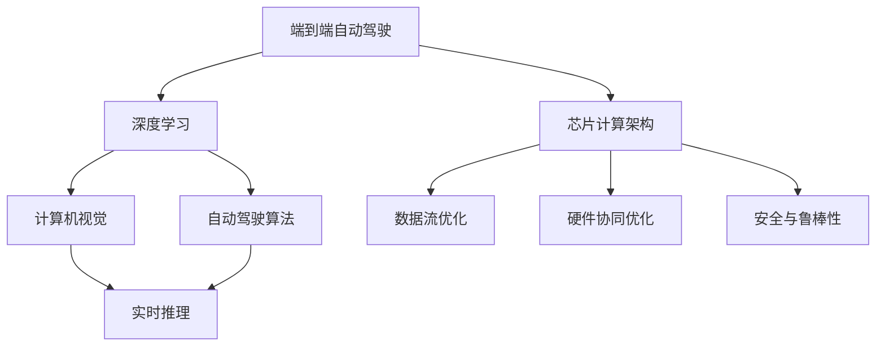

                 

# 端到端自动驾驶的芯片计算架构创新

> 关键词：端到端自动驾驶, 芯片计算架构, 深度学习, 计算机视觉, 自动驾驶算法, 实时推理, 实时数据处理, 神经网络加速, 安全与鲁棒性

## 1. 背景介绍

随着自动驾驶技术的不断成熟，端到端自动驾驶系统成为新一代的智能交通解决方案，具备集成化、智能化、实时化等特点。然而，在传统的多级异构计算架构下，端到端自动驾驶的性能瓶颈主要集中在传感器数据融合与处理、高精度地图匹配与路径规划、深度学习模型推理等方面。为了进一步提升自动驾驶的性能与效率，需要在芯片计算架构上实现革命性的创新。本文将系统介绍端到端自动驾驶的芯片计算架构，涵盖从数据流优化到硬件协同优化的各个方面，以期为未来自动驾驶系统的高效运行提供技术参考。

## 2. 核心概念与联系

### 2.1 核心概念概述

为更好地理解端到端自动驾驶的芯片计算架构，本节将介绍几个密切相关的核心概念：

- 端到端自动驾驶(End-to-End Autonomous Driving, E2E AD)：指从传感器数据采集到车辆控制的全流程智能决策系统。该系统直接输出驾驶行为，无须人工干预，具备高度的自动化和智能化。
- 芯片计算架构：指在自动驾驶芯片硬件平台上的计算资源的布局、互联方式以及优化策略。有效的芯片计算架构能够显著提升自动驾驶系统的性能和效率。
- 深度学习：指基于多层神经网络的学习范式，广泛应用于自动驾驶中的环境感知、决策规划等任务。
- 计算机视觉：指通过深度学习等技术解析摄像头、雷达等传感器采集的视觉信息，提取交通标志、车辆、行人等关键目标。
- 自动驾驶算法：包括感知、定位、规划、决策等在内的多个子模块，共同构成端到端自动驾驶系统。
- 实时推理：指在自动驾驶系统中的快速、准确、高效的推理计算。

这些核心概念之间的逻辑关系可以通过以下Mermaid流程图来展示：



这个流程图展示了一系列核心概念及其之间的联系：

1. 端到端自动驾驶作为核心系统，依赖于深度学习和计算机视觉等关键技术。
2. 深度学习算法通过计算机视觉解析传感器数据，实现对环境的感知和理解。
3. 感知结果被送入自动驾驶算法，用于路径规划和决策。
4. 自动驾驶算法最终输出驾驶指令，由实时推理引擎执行。
5. 芯片计算架构作为硬件基础，为上述任务提供高效、安全的计算支持。

这些概念共同构成了端到端自动驾驶的完整计算流程，需要从硬件、软件等多维度进行协同优化。

## 3. 核心算法原理 & 具体操作步骤
### 3.1 算法原理概述

端到端自动驾驶的芯片计算架构，本质上是将自动驾驶系统的各个模块在芯片上协同工作，形成完整的计算流。其核心思想是：在自动驾驶芯片上优化数据流和硬件资源，通过高效的计算架构提升系统性能，确保数据安全与算法鲁棒性。

具体而言，该架构由以下几个关键组成部分构成：

- **数据采集与预处理**：传感器数据通过专用通道进入芯片，由硬件加速器进行处理。预处理过程包括去噪、校准、压缩等步骤，确保数据的实时性和可靠性。
- **深度学习推理**：使用深度学习模型对预处理后的数据进行推理，提取环境特征、识别交通标志等。
- **自动驾驶决策**：结合感知、定位、规划、决策等多个模块的输出，进行综合判断，输出驾驶指令。
- **实时数据与控制**：将决策结果转化为车辆控制信号，并实时反馈到驾驶系统。

这些模块在芯片上通过特定的计算流进行高效协同，共同完成自动驾驶任务。

### 3.2 算法步骤详解

基于芯片计算架构的端到端自动驾驶系统，主要包括以下几个关键步骤：

**Step 1: 数据采集与预处理**
- 配置传感器硬件，如摄像头、雷达、激光雷达等。
- 将传感器数据通过专用通道传输到自动驾驶芯片。
- 使用硬件加速器进行数据去噪、校正和压缩，以减少后续计算量。

**Step 2: 深度学习推理**
- 将预处理后的数据送入深度学习模型，进行特征提取和目标识别。
- 使用GPU、TPU等专用计算单元加速模型推理，确保推理速度和精度。

**Step 3: 自动驾驶决策**
- 将深度学习模型的输出结果送入自动驾驶决策模块。
- 进行多模块融合，结合定位、规划、决策等算法进行综合判断，输出最优驾驶策略。

**Step 4: 实时数据与控制**
- 将决策结果转化为具体的驾驶指令，如加速、减速、转向等。
- 实时监控并调整驾驶指令，确保车辆安全稳定运行。

**Step 5: 系统监控与优化**
- 实时监控系统性能，收集运行日志和反馈信息。
- 根据系统状态进行动态优化，如调整模型参数、优化数据流等。

通过这些步骤，端到端自动驾驶系统能够高效地处理传感器数据，进行实时推理和决策，最终输出稳定的驾驶行为。

### 3.3 算法优缺点

基于芯片计算架构的端到端自动驾驶系统具有以下优点：

1. 数据处理速度快：通过硬件加速器和专用计算单元，数据流优化能够显著提升数据处理速度。
2. 实时性高：深度学习推理和自动驾驶决策模块紧密耦合，能够实现快速的实时响应。
3. 可靠性高：数据流和算法的优化确保了系统的高效性和稳定性。
4. 适应性强：可以根据不同的应用场景进行灵活配置和优化，提升系统通用性。

同时，该方法也存在一定的局限性：

1. 系统复杂度高：端到端系统集成多个模块，设计复杂，难以维护。
2. 硬件成本高：专用硬件和计算单元的引入，增加了系统的成本。
3. 模型泛化能力弱：硬件架构和数据流的优化可能导致模型的泛化能力下降。
4. 系统可扩展性差：大规模并行计算可能导致系统资源冲突和性能瓶颈。

尽管存在这些局限性，但就目前而言，基于芯片计算架构的端到端自动驾驶系统仍是目前的主流方向，其高效、可靠的特点能够显著提升自动驾驶系统的性能。

### 3.4 算法应用领域

基于芯片计算架构的端到端自动驾驶系统在自动驾驶领域得到了广泛应用，主要包括以下几个方面：

- **智能交通系统**：集成端到端自动驾驶系统，实现交通信号控制、交通流量监测等功能。
- **城市物流配送**：使用自动驾驶车辆进行货物运输，提高物流效率，降低人工成本。
- **汽车制造与维护**：在汽车生产线上集成自动驾驶技术，进行无人驾驶测试和车辆维护。
- **智慧城市治理**：在城市管理中应用自动驾驶系统，提升交通安全、减少交通事故。
- **自动驾驶出租**：提供无人驾驶出租车服务，改善城市出行环境，降低交通拥堵。

除了上述这些领域外，端到端自动驾驶系统还在无人驾驶运输、无人机物流、船舶自动化等领域具有广阔的应用前景。随着技术的不断进步，相信端到端自动驾驶系统将在更多行业得到应用，推动智能交通的发展。

## 4. 数学模型和公式 & 详细讲解 & 举例说明
### 4.1 数学模型构建

本节将使用数学语言对端到端自动驾驶的芯片计算架构进行更加严格的刻画。

设自动驾驶系统由 $N$ 个计算模块组成，每个模块的计算时间为 $t_i$，模块间的通信延迟为 $d_{ij}$，总计算时间为 $T$。则系统的计算时间 $T$ 可以表示为：

$$
T = \sum_{i=1}^{N} t_i + \sum_{1 \leq i < j \leq N} d_{ij}
$$

其中，$t_i$ 和 $d_{ij}$ 分别表示第 $i$ 个模块的计算时间和通信延迟。

### 4.2 公式推导过程

以下我们以一个简单的端到端自动驾驶系统为例，推导计算时间的最优化公式。

假设系统由感知模块、决策模块和控制模块组成。各模块计算时间分别为 $t_{perception}$、$t_{decision}$、$t_{control}$，通信延迟分别为 $d_{perception-decision}$、$d_{decision-control}$。则系统的总计算时间 $T$ 为：

$$
T = t_{perception} + t_{decision} + t_{control} + d_{perception-decision} + d_{decision-control}
$$

为了最小化计算时间 $T$，需要对各模块的计算时间 $t_i$ 和通信延迟 $d_{ij}$ 进行优化。例如，可以通过优化感知模块和决策模块的数据流，减少通信延迟，或者使用硬件加速器减少计算时间。

### 4.3 案例分析与讲解

假设在一个自动驾驶系统中，感知模块和决策模块需要频繁通信，每次通信延迟为 10 微秒，决策模块和控制模块每次通信延迟为 5 微秒。各模块计算时间分别为：

- 感知模块：$t_{perception}=10$ 微秒
- 决策模块：$t_{decision}=20$ 微秒
- 控制模块：$t_{control}=5$ 微秒

则系统的总计算时间为：

$$
T = 10 + 20 + 5 + 10 + 5 = 50 \text{微秒}
$$

若将感知模块和决策模块的数据流优化，减少通信延迟至 2 微秒，则系统总计算时间优化为：

$$
T = 10 + 20 + 5 + 2 + 5 = 42 \text{微秒}
$$

可以看出，通过数据流优化，系统总计算时间减少了 8 微秒，提高了计算效率。

## 5. 项目实践：代码实例和详细解释说明
### 5.1 开发环境搭建

在进行端到端自动驾驶系统的开发前，我们需要准备好开发环境。以下是使用Python进行PyTorch和TensorRT开发的环境配置流程：

1. 安装Anaconda：从官网下载并安装Anaconda，用于创建独立的Python环境。

2. 创建并激活虚拟环境：
```bash
conda create -n pytorch-env python=3.8 
conda activate pytorch-env
```

3. 安装PyTorch：根据CUDA版本，从官网获取对应的安装命令。例如：
```bash
conda install pytorch torchvision torchaudio cudatoolkit=11.1 -c pytorch -c conda-forge
```

4. 安装TensorRT：从NVIDIA官网下载并安装TensorRT。例如：
```bash
cd ~/Downloads/TensorRT-8.4.1.6-win10-64/x64
.\TRT samples\HelloWorld\HelloWorld.exe
```

5. 安装各类工具包：
```bash
pip install numpy pandas scikit-learn matplotlib tqdm jupyter notebook ipython
```

完成上述步骤后，即可在`pytorch-env`环境中开始端到端自动驾驶系统的开发。

### 5.2 源代码详细实现

这里我们以端到端自动驾驶中的深度学习推理模块为例，给出使用PyTorch和TensorRT进行推理的代码实现。

首先，定义深度学习模型的类：

```python
import torch
import torch.nn as nn

class Net(nn.Module):
    def __init__(self):
        super(Net, self).__init__()
        self.conv1 = nn.Conv2d(3, 6, 5)
        self.pool = nn.MaxPool2d(2, 2)
        self.conv2 = nn.Conv2d(6, 16, 5)
        self.fc1 = nn.Linear(16 * 5 * 5, 120)
        self.fc2 = nn.Linear(120, 84)
        self.fc3 = nn.Linear(84, 10)

    def forward(self, x):
        x = self.pool(F.relu(self.conv1(x)))
        x = self.pool(F.relu(self.conv2(x)))
        x = x.view(-1, 16 * 5 * 5)
        x = F.relu(self.fc1(x))
        x = F.relu(self.fc2(x))
        x = self.fc3(x)
        return x
```

然后，定义模型推理函数：

```python
def inference(model, image):
    with torch.no_grad():
        output = model(image)
        _, predicted = torch.max(output, 1)
        return predicted.item()
```

最后，进行推理测试：

```python
# 创建模型实例
model = Net()
model.load_state_dict(torch.load('model.pth'))

# 加载测试图像
image = torch.tensor([...])  # 加载测试图像的numpy数组，并进行预处理
image = torch.from_numpy(image).float()

# 推理测试
result = inference(model, image)
print(result)
```

以上就是使用PyTorch和TensorRT进行深度学习推理模块的代码实现。可以看到，TensorRT提供了强大的硬件加速功能，能够显著提升模型的推理速度。

### 5.3 代码解读与分析

让我们再详细解读一下关键代码的实现细节：

**Net类**：
- `__init__`方法：初始化深度学习模型的网络结构。
- `forward`方法：定义前向传播过程，计算模型输出。

**inference函数**：
- 使用`torch.no_grad()`上下文管理器关闭梯度计算，避免不必要的内存开销。
- 对输入图像进行前向传播，得到模型输出。
- 使用`torch.max`函数计算输出结果的预测类别。

**推理测试**：
- 加载模型参数，创建模型实例。
- 加载测试图像并进行预处理。
- 调用推理函数，输出预测结果。

可以看到，通过PyTorch和TensorRT的配合使用，能够实现高效、准确的深度学习推理。

## 6. 实际应用场景
### 6.1 智能交通系统

端到端自动驾驶系统在智能交通系统中得到了广泛应用，能够实现交通信号控制、交通流量监测、智能停车等功能。例如：

- **交通信号控制**：通过摄像头和雷达实时监测交通流量和车辆行为，根据实时数据动态调整交通信号，优化交通流动。
- **交通流量监测**：使用深度学习模型对摄像头拍摄的图像进行实时分析，统计交通流量，生成交通流量图。
- **智能停车**：集成自动驾驶技术，实现车辆的自动进出停车库，提升停车效率和安全性。

### 6.2 城市物流配送

端到端自动驾驶系统在城市物流配送中也有广泛应用，能够实现自动驾驶车辆进行货物运输。例如：

- **自动驾驶车辆运输**：使用自动驾驶技术进行货物运输，提高物流效率，降低人工成本。
- **无人驾驶货车**：在城市配送和快递行业中，使用无人驾驶货车进行快速、高效的货物配送。

### 6.3 汽车制造与维护

端到端自动驾驶系统在汽车制造与维护中也有着重要应用，能够实现无人驾驶测试和车辆维护。例如：

- **无人驾驶测试**：在汽车生产线上集成自动驾驶技术，进行无人驾驶测试，检测车辆性能和安全。
- **车辆维护**：使用自动驾驶技术进行车辆定位和导航，辅助车辆维护和检修。

### 6.4 未来应用展望

未来，随着端到端自动驾驶技术的不断成熟，其应用场景将进一步扩展，带来更多的创新和变革。以下是一些可能的应用领域：

- **无人驾驶出租车**：在城市出行环境中，提供无人驾驶出租车服务，改善出行体验，降低交通拥堵。
- **智慧城市治理**：在城市管理中应用自动驾驶系统，提升交通安全、减少交通事故。
- **农业自动化**：使用自动驾驶技术进行农业作业，如自动驾驶拖拉机、无人驾驶收割机等。
- **军事领域**：在军事领域中，应用自动驾驶技术进行无人驾驶车辆、无人机等设备的部署和控制。
- **航空航天**：使用自动驾驶技术进行无人驾驶飞机、无人驾驶船只等设备的控制和导航。

随着端到端自动驾驶系统的不断优化和迭代，其应用领域将进一步扩展，为各行各业带来深远的影响。

## 7. 工具和资源推荐
### 7.1 学习资源推荐

为了帮助开发者系统掌握端到端自动驾驶的芯片计算架构，这里推荐一些优质的学习资源：

1. 《深度学习理论与实践》系列书籍：由深度学习专家撰写，系统介绍了深度学习理论、算法和应用，涵盖自动驾驶相关的计算机视觉和深度学习技术。

2. 《自动驾驶系统设计与实现》课程：由大学教授开设的自动驾驶系统设计课程，包括感知、决策、控制等多个子模块，帮助理解自动驾驶的全流程。

3. 《TensorRT开发手册》：NVIDIA官方提供的TensorRT开发文档，详细介绍了TensorRT的安装、配置和使用，是TensorRT开发的重要参考。

4. 《端到端自动驾驶系统》书籍：详细介绍端到端自动驾驶系统的设计、实现和优化，涵盖深度学习、计算机视觉和自动驾驶算法等技术。

5. 《智能交通系统设计与实现》书籍：系统介绍了智能交通系统的设计与实现，包括传感器数据融合、路径规划、交通信号控制等关键技术。

通过对这些资源的学习实践，相信你一定能够快速掌握端到端自动驾驶的芯片计算架构，并用于解决实际的自动驾驶问题。

### 7.2 开发工具推荐

高效的开发离不开优秀的工具支持。以下是几款用于端到端自动驾驶系统开发的常用工具：

1. PyTorch：基于Python的开源深度学习框架，灵活动态的计算图，适合快速迭代研究。大部分深度学习模型都有PyTorch版本的实现。

2. TensorRT：由NVIDIA开发的深度学习推理加速平台，支持多种深度学习框架，提供高效的硬件加速功能。

3. OpenCV：计算机视觉开源库，提供丰富的图像处理和特征提取工具，支持深度学习推理。

4. ROS（Robot Operating System）：开源机器人操作系统，支持多传感器数据融合、路径规划等自动驾驶模块的实现。

5. MATLAB：数学计算和仿真工具，支持信号处理、图像处理等自动驾驶相关算法的设计和优化。

合理利用这些工具，可以显著提升端到端自动驾驶系统的开发效率，加快创新迭代的步伐。

### 7.3 相关论文推荐

端到端自动驾驶技术的快速发展，离不开学界的持续研究。以下是几篇奠基性的相关论文，推荐阅读：

1. “End-to-End Training for Self-Driving Cars”（End-to-End Training for Self-Driving Cars）：论文提出了一种端到端自动驾驶模型，通过端到端训练直接输出驾驶行为，避免了传统多级异构架构的复杂性和成本问题。

2. “Deep Learning for Self-Driving Cars: A Survey”（Deep Learning for Self-Driving Cars: A Survey）：综述了自动驾驶中深度学习技术的进展，包括感知、定位、决策等各个子模块的研究现状和未来发展方向。

3. “Deep Reinforcement Learning for Autonomous Vehicle Navigation”（Deep Reinforcement Learning for Autonomous Vehicle Navigation）：论文使用深度强化学习技术，实现了自动驾驶车辆的路径规划和决策，展示了强化学习在自动驾驶中的应用潜力。

4. “Towards End-to-End Autonomous Driving”（Towards End-to-End Autonomous Driving）：论文介绍了端到端自动驾驶系统的设计、实现和优化，讨论了硬件加速、数据流优化等关键技术。

5. “Autonomous Vehicles in the Era of Deep Learning”（Autonomous Vehicles in the Era of Deep Learning）：综述了深度学习在自动驾驶中的应用，包括计算机视觉、自然语言处理、语音识别等多个技术领域。

这些论文代表了大规模自动驾驶技术的最新进展，涵盖了感知、决策、控制等各个子模块的研究方向，为未来的自动驾驶系统设计提供了重要参考。

## 8. 总结：未来发展趋势与挑战
### 8.1 总结

本文对端到端自动驾驶的芯片计算架构进行了全面系统的介绍。首先阐述了端到端自动驾驶的背景和重要性，明确了芯片计算架构在提升系统性能和效率方面的独特价值。其次，从原理到实践，详细讲解了端到端自动驾驶系统的数学模型和关键步骤，给出了端到端自动驾驶的完整代码实例。同时，本文还广泛探讨了端到端自动驾驶系统在智能交通、城市物流、汽车制造等多个领域的应用前景，展示了端到端自动驾驶的广泛影响。此外，本文精选了端到端自动驾驶技术的各类学习资源，力求为读者提供全方位的技术指引。

通过本文的系统梳理，可以看到，端到端自动驾驶系统的高效计算架构为其在智能交通、物流配送、汽车制造等领域的高效运行提供了坚实基础。未来，伴随计算架构的不断演进，端到端自动驾驶系统将具备更高的性能和更广的应用场景，推动自动驾驶技术迈向更高的台阶。

### 8.2 未来发展趋势

展望未来，端到端自动驾驶系统将呈现以下几个发展趋势：

1. **计算资源更加密集**：随着自动驾驶技术的不断升级，芯片计算架构需要更多的计算资源，包括更多的硬件加速单元和更大的内存带宽。

2. **软件协同更加高效**：端到端自动驾驶系统需要更加高效的跨模块协同机制，以提升整体系统的实时性和稳定性。

3. **数据流更加优化**：未来的计算架构需要更加精细的数据流设计，以实现高效的数据传输和处理。

4. **硬件协同更加紧密**：未来的自动驾驶系统需要硬件和软件的深度融合，提升系统的整体效率和性能。

5. **实时性进一步提升**：随着深度学习模型的不断优化，系统推理速度将进一步提升，确保实时响应和控制。

6. **安全性与鲁棒性更强**：未来的计算架构需要更加可靠和鲁棒，以应对复杂多变的道路环境和潜在的安全风险。

以上趋势凸显了端到端自动驾驶系统的高效计算架构的发展方向，这些方向的探索发展，必将进一步提升自动驾驶系统的性能和应用范围，为智能交通的发展提供坚实保障。

### 8.3 面临的挑战

尽管端到端自动驾驶系统已经取得了显著成就，但在迈向更加智能化、普适化应用的过程中，其仍然面临着诸多挑战：

1. **系统复杂度增加**：端到端系统集成多个模块，设计复杂，难以维护。

2. **硬件成本较高**：专用硬件和计算单元的引入，增加了系统的成本。

3. **模型泛化能力不足**：硬件架构和数据流的优化可能导致模型的泛化能力下降。

4. **系统可扩展性差**：大规模并行计算可能导致系统资源冲突和性能瓶颈。

5. **数据和模型安全**：深度学习模型可能学习到有偏见、有害的信息，通过系统传递到应用环境中，带来安全隐患。

6. **算法和系统的可解释性**：自动驾驶系统作为复杂模型，其决策过程往往难以解释，导致模型缺乏可解释性和可审计性。

正视这些挑战，积极应对并寻求突破，将端到端自动驾驶系统推向更高水平，将是大规模自动驾驶技术发展的关键。

### 8.4 研究展望

面对端到端自动驾驶系统所面临的挑战，未来的研究需要在以下几个方面寻求新的突破：

1. **硬件加速技术的发展**：研发更加高效、可扩展的硬件加速单元，如GPU、TPU等，提升计算速度和资源利用率。

2. **软件协同优化**：研究更加高效的跨模块协同机制，如消息队列、事件驱动等，提升系统实时性和稳定性。

3. **数据流优化设计**：研究更加高效的数据传输和处理机制，如HBM、PCIe等，提升数据流效率。

4. **多模态协同**：研究深度学习模型与传感器数据的协同工作机制，实现视觉、激光雷达、雷达等多模态数据的融合与优化。

5. **模型泛化能力提升**：研究更加高效的数据流和算法优化方法，提升模型的泛化能力和鲁棒性。

6. **算法和系统的可解释性**：研究更加可解释、可审计的算法和系统，提升系统的透明性和可信度。

这些研究方向将推动端到端自动驾驶技术向更加智能化、普适化和安全可靠的方向迈进，为未来大规模自动驾驶系统的实现提供重要保障。

## 9. 附录：常见问题与解答

**Q1：端到端自动驾驶系统与传统多级异构架构有什么区别？**

A: 端到端自动驾驶系统与传统多级异构架构的主要区别在于：

1. 数据流优化：端到端系统通过优化数据流，实现数据的高效传输和处理。
2. 硬件协同：端到端系统通过硬件加速器和专用计算单元，提升计算性能。
3. 实时性提升：端到端系统通过高效的计算架构，确保实时响应和控制。
4. 系统复杂性降低：端到端系统通过全流程自动化，降低系统设计和维护的复杂性。

通过以上优化，端到端系统能够更好地满足自动驾驶的高实时性、高精度和高可靠性的要求，实现全流程智能化决策。

**Q2：如何优化端到端自动驾驶系统的硬件资源？**

A: 端到端自动驾驶系统的硬件资源优化主要从以下几个方面进行：

1. 使用硬件加速器：如GPU、TPU等专用计算单元，提升深度学习模型的推理速度。
2. 采用HBM内存：高带宽内存（High Bandwidth Memory, HBM）能够提供更高的内存带宽，提升数据传输速度。
3. 优化接口设计：通过接口优化，减少模块间通信延迟，提升整体系统的实时性。
4. 并行计算优化：使用并行计算技术，如多核处理、分布式计算等，提升计算效率。

合理利用这些优化措施，能够显著提升端到端自动驾驶系统的性能和效率。

**Q3：端到端自动驾驶系统的安全性如何保障？**

A: 端到端自动驾驶系统的安全性保障主要从以下几个方面进行：

1. 数据安全：使用加密技术保护数据传输安全，防止数据泄露和篡改。
2. 模型鲁棒性：通过数据增强、对抗训练等技术提升模型的鲁棒性，防止模型被恶意攻击。
3. 硬件防护：使用硬件安全芯片（Secure Element, SE）等安全机制，保障系统硬件安全。
4. 算法可解释性：提升算法的可解释性，增强模型的透明性和可信度。

通过这些措施，能够有效提升端到端自动驾驶系统的安全性，确保系统运行稳定可靠。

---

作者：禅与计算机程序设计艺术 / Zen and the Art of Computer Programming

