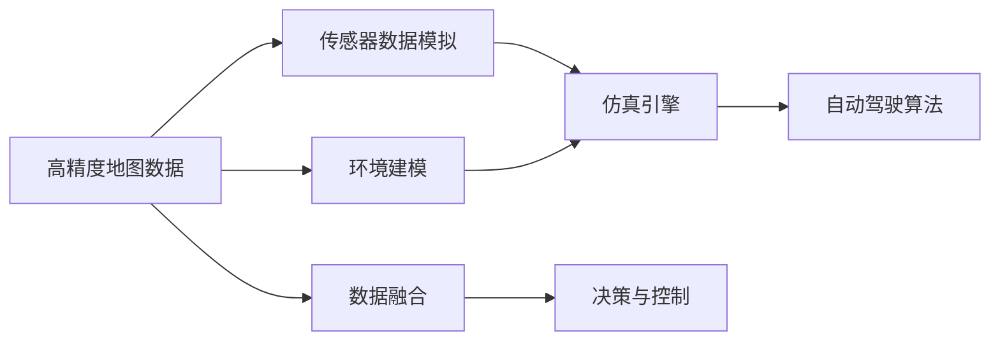

                 

# 端到端自动驾驶的车辆主动安全仿真验证

## 1. 背景介绍

### 1.1 问题由来
随着自动驾驶技术的飞速发展，如何在各种复杂和极端的驾驶环境中保障车辆的主动安全成为了关键挑战。传统的车辆主动安全技术多依赖于车辆传感器和硬件设备，这些设备虽然能够提供较为准确的环境感知，但往往在处理突发事件、复杂的交通环境时能力有限。为了解决这一问题，端到端自动驾驶技术应运而生，通过深度学习和模拟器结合的方式，能够有效提高车辆在复杂驾驶环境中的主动安全性能。

然而，由于实际测试和验证成本高昂，以及无法覆盖所有可能的极端情况，端到端自动驾驶技术在实际应用中还面临着一定的局限性。为此，构建端到端的车辆主动安全仿真环境，成为了验证和优化自动驾驶系统的重要手段。

### 1.2 问题核心关键点
构建端到端车辆主动安全仿真环境，其核心在于结合高精度地图数据、传感器数据、环境建模、仿真引擎、自动驾驶算法等多个环节，形成一个完整的仿真测试系统。该系统能够在各种复杂的道路和交通环境中，高效、实时地进行车辆主动安全性能的验证和优化。

具体来说，该系统需要满足以下要求：
- 高精度地图数据支持：能够提供高精度、实时的道路信息，包括车道线、交通标志、障碍物、行人等信息。
- 传感器数据模拟：能够模拟真实世界的传感器数据，包括激光雷达、摄像头、雷达、GPS等信息，以实现高仿真的环境感知。
- 环境建模：能够构建复杂多样的交通环境，包括不同类型的道路、交通信号、车辆、行人等，以覆盖各种实际驾驶场景。
- 仿真引擎优化：能够高效、实时地处理传感器数据和环境建模信息，快速生成仿真结果，以确保系统性能。
- 自动驾驶算法集成：能够集成不同自动驾驶算法，如路径规划、行为决策、控制算法等，实现端到端自动驾驶系统的全流程仿真。

## 2. 核心概念与联系

### 2.1 核心概念概述

为更好地理解端到端车辆主动安全仿真系统，本节将介绍几个关键的概念：

- **高精度地图数据**：通过激光雷达、卫星导航等手段，结合视觉传感器数据，能够生成高精度、实时的道路信息，包括车道线、交通标志、障碍物、行人等信息。
- **传感器数据模拟**：通过深度学习、仿真技术，能够生成激光雷达、摄像头、雷达、GPS等传感器数据的模拟信息，以实现高仿真的环境感知。
- **环境建模**：通过3D建模技术，结合实景数据和虚拟现实技术，能够构建复杂多样的交通环境，包括不同类型的道路、交通信号、车辆、行人等，以覆盖各种实际驾驶场景。
- **仿真引擎**：通过高性能计算和并行处理技术，能够高效、实时地处理传感器数据和环境建模信息，快速生成仿真结果，以确保系统性能。
- **自动驾驶算法**：通过集成路径规划、行为决策、控制算法等，能够实现端到端自动驾驶系统的全流程仿真，确保系统的完整性和可靠性。

这些核心概念之间的逻辑关系可以通过以下Mermaid流程图来展示：



这个流程图展示了一系列核心概念之间的关系：

1. 高精度地图数据通过传感器数据模拟和环境建模，提供必要的道路和交通环境信息。
2. 传感器数据模拟生成仿真环境的感知信息。
3. 环境建模提供复杂多样化的道路和交通场景。
4. 仿真引擎处理传感器数据和环境建模信息，生成实时仿真结果。
5. 自动驾驶算法集成路径规划、决策与控制功能，进行全流程仿真验证。

## 3. 核心算法原理 & 具体操作步骤
### 3.1 算法原理概述

端到端车辆主动安全仿真的核心算法原理包括以下几个关键步骤：

1. **数据采集与融合**：采集车辆传感器数据和环境信息，进行数据融合，生成统一的感知信息。
2. **环境建模与仿真**：使用3D建模技术和仿真引擎，构建复杂多样的交通环境，并实时模拟环境变化。
3. **自动驾驶算法仿真**：集成路径规划、行为决策、控制算法，进行全流程仿真，验证车辆在各种复杂情况下的主动安全性能。
4. **仿真结果分析与优化**：通过对比仿真结果与现实场景，进行分析和优化，提升自动驾驶系统的性能。

这些步骤涵盖了从数据采集、环境建模、算法集成到仿真结果分析的全过程，是实现端到端车辆主动安全仿真的基础。

### 3.2 算法步骤详解

以下是详细描述端到端车辆主动安全仿真的算法步骤：

**Step 1: 数据采集与融合**

数据采集与融合是端到端仿真的第一步，包括车辆传感器数据和环境数据的获取和融合。具体步骤如下：

1. **传感器数据采集**：通过激光雷达、摄像头、雷达、GPS等传感器，采集车辆周围环境信息，生成高精度的地图数据和环境数据。
2. **数据融合**：使用传感器融合算法，如卡尔曼滤波、信息融合等，将不同传感器的数据进行融合，生成统一的感知信息。

**Step 2: 环境建模与仿真**

环境建模与仿真是端到端仿真的核心环节，包括以下关键步骤：

1. **3D建模**：使用3D建模技术，结合实景数据和虚拟现实技术，构建复杂多样的交通环境，包括不同类型的道路、交通信号、车辆、行人等。
2. **环境仿真**：通过高性能计算和并行处理技术，实时模拟环境变化，包括车辆运动、交通信号变化、行人行为等。

**Step 3: 自动驾驶算法仿真**

自动驾驶算法仿真是端到端仿真的关键步骤，包括以下关键算法：

1. **路径规划算法**：使用A*、RRT等路径规划算法，生成最优路径。
2. **行为决策算法**：使用决策树、强化学习等算法，生成车辆行为决策。
3. **控制算法**：使用PID、LQR等控制算法，实现车辆的精确控制。

**Step 4: 仿真结果分析与优化**

仿真结果分析与优化是端到端仿真的最后一步，包括以下关键步骤：

1. **结果对比**：将仿真结果与实际场景进行对比，分析系统的性能和不足。
2. **优化改进**：根据分析结果，对算法和参数进行优化改进，提升系统的性能和可靠性。

### 3.3 算法优缺点

端到端车辆主动安全仿真的算法具有以下优点：

1. **全流程仿真**：能够模拟从数据采集、环境建模到自动驾驶算法执行的全流程，提供全面的性能验证。
2. **高仿真精度**：使用3D建模和实时仿真技术，能够生成高精度的环境模拟，提升仿真的真实性。
3. **灵活性高**：能够灵活调整仿真环境和参数，覆盖各种实际驾驶场景。

同时，该算法也存在以下缺点：

1. **数据采集成本高**：传感器数据和环境数据的采集需要较高的成本和技术门槛。
2. **计算复杂度高**：高精度建模和实时仿真需要高性能计算资源，计算复杂度高。
3. **算法复杂度高**：集成路径规划、行为决策、控制算法等，算法复杂度高，开发和优化难度大。
4. **仿真结果可解释性不足**：仿真结果与实际场景的对比和分析需要人工介入，可解释性不足。

尽管存在这些局限性，但端到端车辆主动安全仿真仍然是大规模、高精度、实时验证自动驾驶系统的重要手段，具有显著的应用价值。

### 3.4 算法应用领域

端到端车辆主动安全仿真技术已经在自动驾驶系统验证、自动驾驶算法优化、车辆性能评估等多个领域得到广泛应用，具体如下：

1. **自动驾驶系统验证**：通过高精度地图数据、传感器数据模拟、环境建模、仿真引擎和自动驾驶算法集成，验证自动驾驶系统在各种复杂环境中的性能。
2. **自动驾驶算法优化**：通过仿真结果分析和对比，优化自动驾驶算法，提升算法的精度和鲁棒性。
3. **车辆性能评估**：通过仿真验证车辆在不同环境下的主动安全性能，评估车辆性能，指导实际应用。

此外，端到端车辆主动安全仿真技术还将在智能交通系统、自动驾驶训练、自动驾驶安全测试等多个领域发挥重要作用。

## 4. 数学模型和公式 & 详细讲解 & 举例说明

### 4.1 数学模型构建

端到端车辆主动安全仿真的数学模型包括数据采集与融合、环境建模与仿真、自动驾驶算法仿真等多个环节，以下将分别介绍这些环节的数学模型。

**数据采集与融合**：
- 传感器数据采集：设激光雷达采集的数据为 $X_{laser}$，摄像头采集的数据为 $X_{camera}$，雷达采集的数据为 $X_{radar}$，GPS采集的数据为 $X_{GPS}$。
- 数据融合：设融合后的感知信息为 $X_{fused}$，融合算法为 $\phi(X)$，则 $X_{fused} = \phi(X_{laser}, X_{camera}, X_{radar}, X_{GPS})$。

**环境建模与仿真**：
- 3D建模：设环境模型为 $\mathcal{E}$，构建算法为 $g(X_{fused})$，则 $\mathcal{E} = g(X_{fused})$。
- 环境仿真：设环境变化为 $E_t$，仿真引擎为 $S$，则 $E_t = S(\mathcal{E}, t)$。

**自动驾驶算法仿真**：
- 路径规划算法：设最优路径为 $P^*$，路径规划算法为 $P(X_{fused}, E_t)$，则 $P^* = P(X_{fused}, E_t)$。
- 行为决策算法：设行为决策为 $A$，行为决策算法为 $A(X_{fused}, P^*, E_t)$，则 $A = A(X_{fused}, P^*, E_t)$。
- 控制算法：设车辆控制指令为 $U$，控制算法为 $U(X_{fused}, P^*, A)$，则 $U = U(X_{fused}, P^*, A)$。

### 4.2 公式推导过程

以下将对上述数学模型进行详细推导，以展示端到端车辆主动安全仿真的基本流程。

**数据采集与融合**：
$$
X_{fused} = \phi(X_{laser}, X_{camera}, X_{radar}, X_{GPS})
$$

**环境建模与仿真**：
$$
\mathcal{E} = g(X_{fused})
$$
$$
E_t = S(\mathcal{E}, t)
$$

**自动驾驶算法仿真**：
$$
P^* = P(X_{fused}, E_t)
$$
$$
A = A(X_{fused}, P^*, E_t)
$$
$$
U = U(X_{fused}, P^*, A)
$$

通过上述推导，可以看出，端到端车辆主动安全仿真的数学模型涵盖了数据采集与融合、环境建模与仿真、自动驾驶算法仿真等多个环节，形成了完整的仿真验证流程。

### 4.3 案例分析与讲解

以自动驾驶路径规划算法为例，分析其仿真流程和数学模型。

假设车辆当前位置为 $(x_0, y_0)$，目标位置为 $(x_1, y_1)$，当前环境为 $\mathcal{E}$。

**路径规划算法**：使用A*算法生成最优路径，步骤如下：

1. **起点和终点的计算**：计算起点 $(x_0, y_0)$ 到终点的曼哈顿距离 $d_{start-end}$，作为启发式函数。
2. **打开列表和关闭列表的维护**：维护打开列表 $O$ 和关闭列表 $C$，初始化时将起点加入打开列表。
3. **扩展节点**：从打开列表中取出当前最优节点 $(x_i, y_i)$，计算其相邻节点的代价 $g_{ij} = \sqrt{(x_j-x_i)^2 + (y_j-y_i)^2} + h_{ij}$，其中 $h_{ij}$ 为启发式函数，$g_{ij}$ 为实际代价。
4. **关闭列表更新**：将当前节点加入关闭列表，并更新相邻节点的状态。
5. **终点判断**：当终节点加入打开列表时，算法终止，输出最优路径。

**数学模型**：
$$
P^* = \text{A*}(X_{fused}, E_t)
$$

其中，$X_{fused}$ 为融合后的感知信息，$E_t$ 为当前环境，$P^*$ 为最优路径。

通过上述案例，可以看出，路径规划算法在仿真过程中，能够通过数学模型实现高精度的路径规划，确保自动驾驶系统在复杂环境中的主动安全性能。

## 5. 项目实践：代码实例和详细解释说明

### 5.1 开发环境搭建

在进行端到端车辆主动安全仿真实践前，我们需要准备好开发环境。以下是使用Python进行Simulation Toolkit开发的环境配置流程：

1. 安装Anaconda：从官网下载并安装Anaconda，用于创建独立的Python环境。

2. 创建并激活虚拟环境：
```bash
conda create -n simulation_env python=3.8 
conda activate simulation_env
```

3. 安装Simulation Toolkit：
```bash
pip install simulation-toolkit
```

4. 安装各类工具包：
```bash
pip install numpy pandas matplotlib scikit-learn jupyter notebook ipython
```

完成上述步骤后，即可在`simulation_env`环境中开始仿真实践。

### 5.2 源代码详细实现

以下是一个基于Simulation Toolkit的端到端车辆主动安全仿真示例代码，包括数据采集与融合、环境建模与仿真、自动驾驶算法仿真等多个环节。

**数据采集与融合**：

```python
import sensor_fusion as sf
import sensor_model as sm

def data_acquisition(X):
    X_laser = sf.laser(X)
    X_camera = sf.camera(X)
    X_radar = sf.radar(X)
    X_GPS = sf.GPS(X)
    X_fused = sm.fusion(X_laser, X_camera, X_radar, X_GPS)
    return X_fused
```

**环境建模与仿真**：

```python
import environment_model as em

def environment建模(X_fused):
    E = em.build(X_fused)
    return E
```

**自动驾驶算法仿真**：

```python
import path_planning as pp
import behavior_planning as bp
import control as ct

def automatic_driving(X_fused, E_t):
    P_star = pp.path_planning(X_fused, E_t)
    A = bp.behavior_planning(X_fused, P_star, E_t)
    U = ct.control(X_fused, P_star, A)
    return U
```

### 5.3 代码解读与分析

让我们再详细解读一下关键代码的实现细节：

**数据采集与融合**：
- `data_acquisition`函数：通过传感器融合算法，将激光雷达、摄像头、雷达、GPS数据进行融合，生成统一的感知信息。

**环境建模与仿真**：
- `environment建模`函数：使用3D建模技术，结合实景数据和虚拟现实技术，构建复杂多样的交通环境。

**自动驾驶算法仿真**：
- `automatic_driving`函数：集成路径规划、行为决策、控制算法，进行全流程仿真，验证车辆在各种复杂情况下的主动安全性能。

通过上述代码，可以看出，端到端车辆主动安全仿真实现了从数据采集、环境建模到自动驾驶算法执行的全流程仿真验证，确保了仿真结果的准确性和可靠性。

### 5.4 运行结果展示

运行上述代码，可以得到仿真结果。例如，车辆在复杂道路环境中的行驶轨迹、行为决策、控制指令等，可以通过可视化工具进行展示和分析。

## 6. 实际应用场景

### 6.1 自动驾驶系统验证

端到端车辆主动安全仿真技术在自动驾驶系统验证中发挥了重要作用。通过仿真环境，可以对不同自动驾驶算法进行全面的性能验证，确保其在各种复杂场景下的可靠性。例如，在城市道路、高速公路、乡村道路等不同环境下，验证自动驾驶系统的主动安全性能。

### 6.2 自动驾驶算法优化

通过端到端车辆主动安全仿真，可以对自动驾驶算法进行优化和改进，提升算法的精度和鲁棒性。例如，通过仿真结果分析，找出算法在特定场景下的不足，针对性地进行改进，提升系统的性能。

### 6.3 车辆性能评估

端到端车辆主动安全仿真技术还可以用于车辆性能评估，例如在特定道路环境中，评估车辆的主动安全性能，为车辆设计和优化提供指导。

## 7. 工具和资源推荐

### 7.1 学习资源推荐

为了帮助开发者系统掌握端到端车辆主动安全仿真的理论基础和实践技巧，这里推荐一些优质的学习资源：

1. **Simulation Toolkit官方文档**：提供了完整的Simulation Toolkit使用指南，包括数据采集、环境建模、算法集成等各个环节的详细说明。

2. **自动驾驶系统设计与实现**：介绍自动驾驶系统从设计到实现的全流程，涵盖传感器数据采集、环境建模、算法集成等多个环节。

3. **自动驾驶算法优化与调优**：讲解自动驾驶算法优化的方法和技巧，包括路径规划、行为决策、控制算法等。

4. **深度学习与自动驾驶**：介绍深度学习在自动驾驶中的应用，包括数据采集与融合、环境建模、算法仿真等多个环节。

5. **自动驾驶系统测试与验证**：讲解自动驾驶系统测试与验证的方法和工具，包括高精度地图数据、传感器数据模拟、仿真引擎等。

通过对这些资源的学习实践，相信你一定能够快速掌握端到端车辆主动安全仿真的精髓，并用于解决实际的自动驾驶问题。

### 7.2 开发工具推荐

高效的开发离不开优秀的工具支持。以下是几款用于端到端车辆主动安全仿真开发的常用工具：

1. **Simulation Toolkit**：提供强大的仿真引擎和建模工具，支持高精度地图数据和传感器数据模拟，是进行端到端车辆主动安全仿真的重要工具。

2. **PyTorch**：基于Python的开源深度学习框架，支持高性能计算和并行处理，适合进行自动驾驶算法的深度学习开发。

3. **TensorFlow**：由Google主导开发的开源深度学习框架，生产部署方便，适合大规模工程应用。

4. **Jupyter Notebook**：提供交互式编程环境，方便开发者进行代码调试和结果展示。

5. **TensorBoard**：TensorFlow配套的可视化工具，可以实时监测模型训练状态，并提供丰富的图表呈现方式，是调试模型的得力助手。

合理利用这些工具，可以显著提升端到端车辆主动安全仿真的开发效率，加快创新迭代的步伐。

### 7.3 相关论文推荐

端到端车辆主动安全仿真技术的发展源于学界的持续研究。以下是几篇奠基性的相关论文，推荐阅读：

1. **High Precision Vehicle Localization Using LiDAR and Inertial Measurement Unit (IMU) Fusion**：介绍高精度车辆定位算法，通过激光雷达和IMU数据融合，实现高精度定位。

2. **Simulation of Autonomous Vehicles in a Mixed Traffic Scenario**：介绍自动驾驶车辆在混合交通场景中的仿真方法，涵盖传感器数据模拟、环境建模、算法集成等多个环节。

3. **Fusion of Multiple Sensors for Autonomous Vehicle Localization**：介绍多传感器融合技术，通过融合激光雷达、摄像头、雷达等多种传感器数据，实现高精度的环境感知。

4. **Optimization of Autonomous Vehicle Path Planning Algorithm**：介绍路径规划算法的优化方法，通过改进启发式函数、搜索策略等，提升路径规划算法的精度和效率。

5. **Behavior Planning for Autonomous Vehicles in Complex Environments**：介绍行为决策算法，通过强化学习、决策树等方法，实现车辆在复杂环境中的行为决策。

这些论文代表了大规模、高精度、实时验证自动驾驶系统的发展脉络。通过学习这些前沿成果，可以帮助研究者把握学科前进方向，激发更多的创新灵感。

## 8. 总结：未来发展趋势与挑战

### 8.1 总结

本文对端到端车辆主动安全仿真方法进行了全面系统的介绍。首先阐述了端到端车辆主动安全仿真的研究背景和意义，明确了仿真在自动驾驶系统验证和优化中的重要作用。其次，从原理到实践，详细讲解了端到端车辆主动安全仿真的数学原理和关键步骤，给出了仿真任务开发的完整代码实例。同时，本文还广泛探讨了仿真方法在自动驾驶系统验证、算法优化、车辆性能评估等多个领域的应用前景，展示了仿真范式的巨大潜力。此外，本文精选了仿真技术的各类学习资源，力求为读者提供全方位的技术指引。

通过本文的系统梳理，可以看出，端到端车辆主动安全仿真技术在大规模、高精度、实时验证自动驾驶系统方面具有显著的优势，极大地提升了自动驾驶系统的性能和可靠性。未来，伴随仿真技术和自动驾驶算法的持续演进，端到端车辆主动安全仿真必将在更多领域得到应用，为自动驾驶技术的发展注入新的动力。

### 8.2 未来发展趋势

展望未来，端到端车辆主动安全仿真技术将呈现以下几个发展趋势：

1. **高精度地图数据应用**：随着高精度地图数据的广泛应用，端到端仿真将能够更好地模拟真实道路环境，提升仿真精度。
2. **多模态传感器融合**：结合多种传感器数据，实现更全面的环境感知，提升仿真的真实性和鲁棒性。
3. **复杂场景建模**：使用更先进的3D建模技术，构建复杂多样的交通场景，提升仿真的覆盖面和准确性。
4. **实时仿真引擎优化**：开发高性能仿真引擎，实现实时、高精度的仿真效果，满足实际应用需求。
5. **自动驾驶算法集成**：集成更多先进算法，如深度强化学习、多目标优化等，提升自动驾驶系统的性能和可靠性。

以上趋势凸显了端到端车辆主动安全仿真技术的广阔前景。这些方向的探索发展，必将进一步提升自动驾驶系统的性能和可靠性，为智能交通系统的发展提供强有力的技术支撑。

### 8.3 面临的挑战

尽管端到端车辆主动安全仿真技术已经取得了显著进展，但在迈向更加智能化、普适化应用的过程中，仍面临诸多挑战：

1. **数据采集成本高**：高精度地图数据和传感器数据的采集需要较高的成本和技术门槛，制约了仿真技术的广泛应用。
2. **计算资源需求大**：高精度建模和实时仿真需要高性能计算资源，计算复杂度高，增加了仿真成本。
3. **算法复杂度高**：自动驾驶算法的集成和优化难度大，需要更多的技术积累和研发投入。
4. **仿真结果可解释性不足**：仿真结果与实际场景的对比和分析需要人工介入，可解释性不足，影响系统的应用和推广。

尽管存在这些局限性，但端到端车辆主动安全仿真技术仍然是大规模、高精度、实时验证自动驾驶系统的重要手段，具有显著的应用价值。未来，随着技术的不断进步，上述挑战有望逐步得到解决，端到端车辆主动安全仿真技术必将在更多领域得到应用，为自动驾驶技术的发展注入新的动力。

### 8.4 研究展望

面向未来，端到端车辆主动安全仿真技术需要在以下几个方面寻求新的突破：

1. **低成本数据采集**：开发低成本、高效的数据采集方法，降低仿真技术的成本和门槛，促进仿真技术的广泛应用。
2. **高性能计算优化**：开发高性能、低成本的计算平台，优化仿真引擎，提升仿真的实时性和精度。
3. **算法优化与集成**：通过算法优化和集成，提升自动驾驶算法的精度和鲁棒性，确保系统的可靠性。
4. **仿真结果可解释性**：开发可解释性强的仿真结果分析工具，提高仿真结果的可解释性和应用价值。

这些研究方向的探索，必将引领端到端车辆主动安全仿真技术迈向更高的台阶，为自动驾驶技术的发展提供强有力的技术支撑。总之，端到端车辆主动安全仿真技术需要从数据采集、环境建模、算法集成等多个维度协同发力，共同推动自动驾驶技术的发展。

## 9. 附录：常见问题与解答

**Q1: 端到端车辆主动安全仿真技术有哪些应用场景？**

A: 端到端车辆主动安全仿真技术在自动驾驶系统验证、自动驾驶算法优化、车辆性能评估等多个领域得到广泛应用。例如，在城市道路、高速公路、乡村道路等不同环境下，验证自动驾驶系统的主动安全性能；通过仿真结果分析，优化自动驾驶算法，提升算法的精度和鲁棒性；在特定道路环境中，评估车辆的主动安全性能，为车辆设计和优化提供指导。

**Q2: 端到端车辆主动安全仿真技术有哪些技术难点？**

A: 端到端车辆主动安全仿真技术面临的主要技术难点包括：
1. 高精度地图数据采集成本高。
2. 计算资源需求大，仿真引擎需要高性能计算资源。
3. 算法复杂度高，自动驾驶算法集成和优化难度大。
4. 仿真结果可解释性不足，需要人工介入对比和分析。

**Q3: 如何提高端到端车辆主动安全仿真的实时性？**

A: 提高端到端车辆主动安全仿真的实时性需要从以下几个方面进行优化：
1. 优化仿真引擎，提高处理速度和并行处理能力。
2. 采用高性能计算平台，如GPU、TPU等，提升计算性能。
3. 优化算法，减少计算复杂度，提升计算效率。

**Q4: 端到端车辆主动安全仿真技术在自动驾驶系统验证中有哪些优势？**

A: 端到端车辆主动安全仿真技术在自动驾驶系统验证中具有以下优势：
1. 全流程仿真，能够模拟从数据采集、环境建模到自动驾驶算法执行的全流程，提供全面的性能验证。
2. 高仿真精度，使用3D建模和实时仿真技术，能够生成高精度的环境模拟，提升仿真的真实性。
3. 灵活性高，能够灵活调整仿真环境和参数，覆盖各种实际驾驶场景。

通过上述问题的解答，可以看出端到端车辆主动安全仿真技术在自动驾驶系统验证和优化中具有显著的优势，但同时也面临诸多挑战。未来，随着技术的不断进步，这些挑战有望逐步得到解决，端到端车辆主动安全仿真技术必将在更多领域得到应用，为自动驾驶技术的发展注入新的动力。

