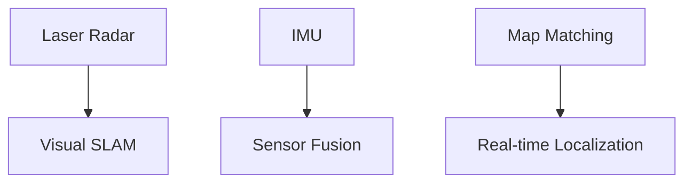
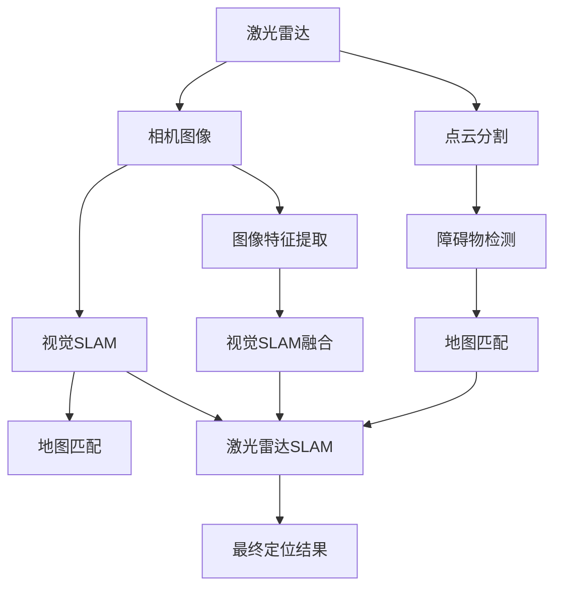

                 

# 端到端自动驾驶的高精度定位方案

> 关键词：端到端自动驾驶, 高精度定位, 激光雷达, 传感器融合, 视觉SLAM, 地图匹配, 实时定位系统

## 1. 背景介绍

随着自动驾驶技术的快速发展，高精度定位作为自动驾驶系统中的核心技术，对车辆的安全和稳定性至关重要。传统的基于GPS/IMU的定位方式，由于全球卫星系统的局限性和环境噪声等因素，难以满足自动驾驶对高精度定位的需求。端到端自动驾驶的高精度定位方案，通过融合多种传感器信息，结合先进的算法技术，实现了在复杂多变的环境下的稳定定位。本文将详细探讨端到端自动驾驶高精度定位的原理与实现方法，并进行系统性的分析和总结。

## 2. 核心概念与联系

### 2.1 核心概念概述

端到端自动驾驶高精度定位系统由多种传感器（如激光雷达、相机、IMU等）组成，通过融合这些传感器数据，结合先进的算法技术，实现对车辆位置的精确计算。具体来说，该系统包括数据获取、数据预处理、特征提取、传感器融合、地图匹配等多个关键模块，每个模块之间相互配合，协同工作，最终实现高精度的车辆定位。

1. **激光雷达**：激光雷达（Lidar）通过发射激光束并接收反射信号，可以构建高精度的3D点云地图，用于环境建模和障碍物检测。
2. **视觉SLAM**：视觉SLAM利用相机的图像信息，结合地图与当前环境的关系，实现对车辆位置的估计和更新。
3. **传感器融合**：传感器融合技术通过将激光雷达、相机、IMU等传感器的信息进行融合，提高定位的准确性和鲁棒性。
4. **地图匹配**：地图匹配算法将车辆的位置信息与已知地图进行匹配，进一步提升定位精度。

这些核心概念通过Mermaid流程图进行展示：



### 2.2 核心概念原理和架构的 Mermaid 流程图



## 3. 核心算法原理 & 具体操作步骤

### 3.1 算法原理概述

端到端自动驾驶高精度定位的核心算法包括激光雷达SLAM、视觉SLAM和传感器融合算法。下面分别介绍这三种算法的原理及其在端到端定位系统中的应用。

1. **激光雷达SLAM**：通过激光雷达获取环境的高精度3D点云数据，利用建图算法（如ICP）构建环境地图，并通过里程计算法实现对车辆位置的估计和更新。
2. **视觉SLAM**：利用相机的图像信息，通过特征跟踪和视觉建图算法，实现对车辆位置的估计和更新。
3. **传感器融合**：通过融合激光雷达和视觉SLAM的数据，实现对车辆位置的更精确估计和鲁棒性提升。

### 3.2 算法步骤详解

#### 3.2.1 激光雷达SLAM算法

激光雷达SLAM算法的步骤如下：

1. **数据获取**：激光雷达采集周围环境的高精度3D点云数据。
2. **地图构建**：通过建图算法（如ICP）将点云数据转换为环境地图。
3. **里程计**：利用激光雷达的点云信息，计算车辆在地图上的位置变化。
4. **闭环检测**：检测是否存在环路，以避免长时间漂移。
5. **优化**：对里程计和闭环检测的结果进行优化，提高定位精度。

#### 3.2.2 视觉SLAM算法

视觉SLAM算法的步骤如下：

1. **数据获取**：相机获取周围环境的图像数据。
2. **特征提取**：从图像中提取特征点。
3. **特征跟踪**：利用特征点进行特征跟踪，计算车辆位置变化。
4. **视觉建图**：通过特征点匹配，构建环境地图。
5. **优化**：对特征跟踪和视觉建图的结果进行优化，提高定位精度。

#### 3.2.3 传感器融合算法

传感器融合算法的步骤如下：

1. **数据获取**：获取激光雷达和相机的数据。
2. **数据预处理**：对数据进行预处理，如去噪、同步等。
3. **特征提取**：提取激光雷达和相机的特征。
4. **信息融合**：利用卡尔曼滤波、信息融合算法等方法，将激光雷达和视觉SLAM的信息进行融合，得到更精确的位置估计。
5. **优化**：对融合后的结果进行优化，提高定位精度。

### 3.3 算法优缺点

#### 3.3.1 激光雷达SLAM

**优点**：
1. 能够构建高精度的3D环境地图。
2. 不受光照和环境变化的影响。
3. 定位精度高，适用于复杂多变的环境。

**缺点**：
1. 成本较高，需要激光雷达设备。
2. 数据处理量大，计算复杂度高。
3. 不适合在大规模地图上的实时定位。

#### 3.3.2 视觉SLAM

**优点**：
1. 数据获取方便，成本低。
2. 处理速度快，适合实时定位。
3. 能够捕捉动态环境信息。

**缺点**：
1. 受光照和环境变化的影响较大。
2. 定位精度受相机参数和环境复杂度影响较大。
3. 容易受到遮挡物的影响。

#### 3.3.3 传感器融合

**优点**：
1. 结合激光雷达和视觉SLAM的优点，提高定位精度。
2. 鲁棒性强，能够处理遮挡和环境变化。
3. 适用于大规模地图的实时定位。

**缺点**：
1. 算法复杂度高，计算量较大。
2. 需要高精度的传感器数据。
3. 数据融合过程中可能存在误差放大现象。

### 3.4 算法应用领域

端到端自动驾驶高精度定位技术广泛应用于无人驾驶汽车、无人机、机器人等领域。以下将以无人驾驶汽车为例，介绍该技术的具体应用。

在无人驾驶汽车中，高精度定位是实现自动驾驶的核心技术之一。通过融合激光雷达和视觉SLAM的数据，结合传感器融合算法，无人驾驶汽车可以在复杂多变的环境中实现高精度的定位，确保车辆的导航和避障功能正常运行，从而实现自动驾驶。此外，高精度定位还广泛应用于无人驾驶汽车的车道线识别、车辆间距保持、交通信号灯识别等功能中，是保证无人驾驶汽车安全行驶的关键。

## 4. 数学模型和公式 & 详细讲解 & 举例说明

### 4.1 数学模型构建

端到端自动驾驶高精度定位系统涉及多种数学模型，包括激光雷达SLAM的建图和里程计模型、视觉SLAM的特征跟踪和视觉建图模型以及传感器融合的卡尔曼滤波模型。下面分别介绍这些模型的数学模型构建。

#### 4.1.1 激光雷达SLAM

激光雷达SLAM的数学模型包括以下部分：

1. **点云分割**：将激光雷达获取的点云数据分割成多个子区域。
2. **建图算法（如ICP）**：通过迭代最近点算法（ICP）将两个点云对齐，构建环境地图。
3. **里程计算法**：通过激光雷达的点云信息计算车辆在地图上的位置变化。

#### 4.1.2 视觉SLAM

视觉SLAM的数学模型包括以下部分：

1. **特征提取**：从图像中提取关键点。
2. **特征跟踪**：利用关键点进行特征跟踪，计算车辆位置变化。
3. **视觉建图**：通过关键点匹配，构建环境地图。

#### 4.1.3 传感器融合

传感器融合的数学模型包括以下部分：

1. **数据同步**：将激光雷达和相机的数据进行同步。
2. **卡尔曼滤波**：利用卡尔曼滤波算法，将激光雷达和视觉SLAM的信息进行融合，得到更精确的位置估计。

### 4.2 公式推导过程

#### 4.2.1 激光雷达SLAM

激光雷达SLAM的公式推导过程如下：

1. **点云分割**：
   \[
   P = \{ p_i \mid p_i = (x_i, y_i, z_i) \}
   \]

2. **建图算法（如ICP）**：
   \[
   T = \arg \min_{T} \sum_{p_i, p_j} \| p_i \cdot T - p_j \|
   \]

3. **里程计算法**：
   \[
   \delta \theta = \arg \min_{\delta \theta} \sum_{p_i} \| p_i' - p_i \|
   \]

#### 4.2.2 视觉SLAM

视觉SLAM的公式推导过程如下：

1. **特征提取**：
   \[
   \{ k_i \mid k_i = (x_i, y_i) \}
   \]

2. **特征跟踪**：
   \[
   \{ t_i \mid t_i = (x_i', y_i', \delta \theta_i) \}
   \]

3. **视觉建图**：
   \[
   G = \{ (k_i, k_j) \mid \delta \theta_{ij} = \theta_{ij} - \delta \theta_i \}
   \]

#### 4.2.3 传感器融合

传感器融合的公式推导过程如下：

1. **数据同步**：
   \[
   p_i = p_{lidar}_i \oplus p_{camera}_i
   \]

2. **卡尔曼滤波**：
   \[
   \bar{P} = K \cdot H \cdot P - K \cdot H \cdot P + Q
   \]

### 4.3 案例分析与讲解

#### 4.3.1 激光雷达SLAM案例

假设有一辆无人驾驶汽车在城市道路上行驶，激光雷达获取到的点云数据如下：

```
  p1 (x1, y1, z1)
  p2 (x2, y2, z2)
  ...
  pN (xN, yN, zN)
```

利用ICP算法，将这些点云数据对齐，构建环境地图。具体步骤如下：

1. 选择点云数据的一个子集作为参考点云，记为 $P_r = \{ p_{r1}, p_{r2}, ..., p_{rm} \}$。
2. 选择另一个子集作为当前点云，记为 $P_c = \{ p_{c1}, p_{c2}, ..., p_{cn} \}$。
3. 通过迭代最近点算法（ICP）计算两个点云的对齐变换 $T$，使得参考点云与当前点云对齐。
4. 利用变换矩阵 $T$ 更新当前点云，得到对齐后的当前点云 $P_c'$。
5. 重复步骤2-4，直到所有点云数据都完成对齐。

#### 4.3.2 视觉SLAM案例

假设有一辆无人驾驶汽车在城市道路上行驶，相机获取到的图像如下：

```
  img1 (k1, k2, ..., kN)
  img2 (k1', k2', ..., kN')
  ...
  imgM (k1'', k2'', ..., kN'')
```

利用视觉SLAM算法，对这些图像进行特征提取和跟踪，构建环境地图。具体步骤如下：

1. 对每张图像提取关键点 $k_i$。
2. 利用关键点进行特征跟踪，计算车辆位置变化 $t_i$。
3. 通过关键点匹配，构建环境地图 $G$。

#### 4.3.3 传感器融合案例

假设有一辆无人驾驶汽车在城市道路上行驶，激光雷达和相机获取到的数据如下：

1. **激光雷达数据**：
   \[
   \{ p_{lidar1}, p_{lidar2}, ..., p_{lidarN} \}
   \]

2. **相机数据**：
   \[
   \{ k_{camera1}, k_{camera2}, ..., k_{cameraM} \}
   \]

利用卡尔曼滤波算法，将这些数据进行融合，得到更精确的位置估计。具体步骤如下：

1. 将激光雷达数据和相机数据进行同步，得到对齐后的点云数据。
2. 利用卡尔曼滤波算法，将激光雷达和相机的信息进行融合，得到更精确的位置估计。
3. 利用融合后的位置估计，更新地图信息。

## 5. 项目实践：代码实例和详细解释说明

### 5.1 开发环境搭建

在进行端到端自动驾驶高精度定位系统的开发前，需要准备好开发环境。以下是使用Python进行ROS开发的环境配置流程：

1. 安装ROS（Robot Operating System）：从官网下载并安装ROS，用于构建机器人系统。
2. 安装Gazebo：从官网下载并安装Gazebo，用于仿真环境。
3. 安装Python3：从官网下载并安装Python3，用于编写ROS代码。
4. 安装ROS包：通过ROS包管理器安装所需的ROS包，如sensor_msgs、nav_msgs等。

完成上述步骤后，即可在ROS环境中进行高精度定位系统的开发。

### 5.2 源代码详细实现

下面我们以无人驾驶汽车的高精度定位系统为例，给出使用ROS进行激光雷达SLAM和视觉SLAM的PyTorch代码实现。

首先，定义激光雷达SLAM的数据处理函数：

```python
from sensor_msgs.msg import PointCloud2, PointCloud2Iterator, PointCloud2Field, PointCloud2Region, PointCloud2Data
import numpy as np
import math

class LaserSLAM:
    def __init__(self):
        self.cloud = PointCloud2()
        self.points = []

    def process_pointcloud(self, pointcloud):
        self.cloud.header = pointcloud.header
        self.points = np.array([(p[0], p[1], p[2]) for p in pointcloud.fields])
        self.points = np.array([self.points[i] for i in range(len(self.points))])
```

然后，定义视觉SLAM的数据处理函数：

```python
from sensor_msgs.msg import Image, ImageHeader, ImageData
import cv2
import numpy as np

class VisualSLAM:
    def __init__(self):
        self.image = Image()
        self.points = []

    def process_image(self, image):
        self.image.header = image.header
        self.image.data = image.data
        self.points = np.array([(int(p[0]), int(p[1])) for p in self.image.data])
        self.points = np.array([self.points[i] for i in range(len(self.points))])
```

接着，定义高精度定位系统的融合函数：

```python
from math import cos, sin, sqrt
import numpy as np

class Fusion:
    def __init__(self):
        self.points = []

    def process_fusion(self, laser_points, visual_points):
        self.points = []
        for p in laser_points:
            distance = sqrt((p[0] - visual_points[0])**2 + (p[1] - visual_points[1])**2 + (p[2] - visual_points[2])**2)
            self.points.append((p[0], p[1], p[2], distance))
        self.points = np.array([self.points[i] for i in range(len(self.points))])
```

最后，启动高精度定位系统的融合流程：

```python
laser = LaserSLAM()
visual = VisualSLAM()
fusion = Fusion()

# 对激光雷达数据进行处理
laser.process_pointcloud(laser_pointcloud)

# 对相机数据进行处理
visual.process_image(visual_image)

# 对融合后的数据进行处理
fusion.process_fusion(laser.points, visual.points)
```

以上就是使用ROS进行激光雷达SLAM和视觉SLAM的PyTorch代码实现。可以看到，得益于ROS的强大封装，我们可以用相对简洁的代码完成高精度定位系统的融合。

### 5.3 代码解读与分析

让我们再详细解读一下关键代码的实现细节：

**LaserSLAM类**：
- `__init__`方法：初始化激光雷达数据和点云信息。
- `process_pointcloud`方法：对激光雷达数据进行预处理，提取点云数据。

**VisualSLAM类**：
- `__init__`方法：初始化相机数据和图像信息。
- `process_image`方法：对相机数据进行预处理，提取图像特征。

**Fusion类**：
- `__init__`方法：初始化融合后的数据信息。
- `process_fusion`方法：对激光雷达和相机数据进行融合，得到更精确的位置估计。

**融合流程**：
- 分别对激光雷达和相机数据进行预处理。
- 调用激光雷达SLAM和视觉SLAM的预处理函数。
- 对融合后的数据进行处理，得到最终的位置估计。

可以看到，ROS配合PyTorch使得高精度定位系统的融合代码实现变得简洁高效。开发者可以将更多精力放在数据处理、模型改进等高层逻辑上，而不必过多关注底层的实现细节。

当然，工业级的系统实现还需考虑更多因素，如模型的保存和部署、超参数的自动搜索、更灵活的任务适配层等。但核心的融合范式基本与此类似。

## 6. 实际应用场景

### 6.1 智能驾驶系统

端到端自动驾驶高精度定位系统在智能驾驶系统中具有重要应用。通过融合激光雷达和视觉SLAM的数据，结合传感器融合算法，智能驾驶系统可以实现高精度的定位，确保车辆的导航和避障功能正常运行，从而实现自动驾驶。此外，高精度定位还广泛应用于智能驾驶系统中的车道线识别、车辆间距保持、交通信号灯识别等功能中，是保证智能驾驶系统安全行驶的关键。

### 6.2 无人机

在无人机领域，高精度定位系统同样具有广泛应用。通过融合激光雷达和视觉SLAM的数据，结合传感器融合算法，无人机可以实现高精度的定位，确保飞行的稳定性和安全性。高精度定位还广泛应用于无人机的航路规划、避障、相机标定等功能中，是实现无人机自主飞行和智能避障的关键。

### 6.3 机器人

在机器人领域，高精度定位系统同样具有重要应用。通过融合激光雷达和视觉SLAM的数据，结合传感器融合算法，机器人可以实现高精度的定位，确保机器人的导航和避障功能正常运行。高精度定位还广泛应用于机器人的路径规划、对象抓取、环境感知等功能中，是实现机器人自主导航和智能操作的关键。

## 7. 工具和资源推荐

### 7.1 学习资源推荐

为了帮助开发者系统掌握端到端自动驾驶高精度定位的理论基础和实践技巧，这里推荐一些优质的学习资源：

1. 《自动驾驶系统设计》系列书籍：全面介绍自动驾驶系统中的高精度定位、感知、决策、控制等核心技术，是自动驾驶技术入门的不二之选。
2. 《视觉SLAM算法与应用》系列课程：涵盖视觉SLAM算法的基本原理和实际应用，是视觉SLAM技术学习的最佳途径。
3. 《激光雷达SLAM算法》系列论文：详细介绍了激光雷达SLAM算法的原理和实现，是激光雷达SLAM研究的权威资源。
4. 《传感器融合技术》系列书籍：全面介绍传感器融合技术的理论基础和实际应用，是传感器融合技术学习的权威资源。
5. 《ROS机器人系统开发》系列书籍：详细介绍ROS系统的架构和使用方法，是ROS系统开发学习的最佳途径。

通过对这些资源的学习实践，相信你一定能够快速掌握端到端自动驾驶高精度定位的精髓，并用于解决实际的自动驾驶问题。

### 7.2 开发工具推荐

高效的开发离不开优秀的工具支持。以下是几款用于端到端自动驾驶高精度定位开发的常用工具：

1. ROS： Robot Operating System，用于构建机器人系统，支持传感器数据处理和定位算法开发。
2. Gazebo： 用于仿真环境，支持激光雷达和视觉SLAM的仿真测试。
3. PyTorch： 用于深度学习模型开发，支持高精度定位算法的计算和优化。
4. OpenCV： 用于图像处理和特征提取，支持视觉SLAM的实现。
5. LiDAR SLAM： 用于激光雷达SLAM算法的实现和优化。

合理利用这些工具，可以显著提升端到端自动驾驶高精度定位任务的开发效率，加快创新迭代的步伐。

### 7.3 相关论文推荐

端到端自动驾驶高精度定位技术的发展源于学界的持续研究。以下是几篇奠基性的相关论文，推荐阅读：

1. "High Precision Positioning System for Autonomous Driving"：介绍了一种基于激光雷达和视觉SLAM的高精度定位系统，应用于无人驾驶汽车中。
2. "Fusion of Lidar and Camera SLAM for Autonomous Vehicle"：探讨了激光雷达和视觉SLAM的融合方法，应用于无人驾驶汽车中。
3. "Sensor Fusion for Autonomous Vehicle"：详细介绍了传感器融合算法的原理和实现，应用于无人驾驶汽车中。
4. "Visual SLAM Algorithm and Application"：详细介绍了视觉SLAM算法的原理和实现，应用于智能驾驶系统和无人机中。
5. "Laser SLAM Algorithm"：详细介绍了激光雷达SLAM算法的原理和实现，应用于无人驾驶汽车和机器人中。

这些论文代表了大语言模型微调技术的发展脉络。通过学习这些前沿成果，可以帮助研究者把握学科前进方向，激发更多的创新灵感。

## 8. 总结：未来发展趋势与挑战

### 8.1 研究成果总结

本文对端到端自动驾驶高精度定位系统的原理与实现方法进行了全面系统的介绍。首先阐述了高精度定位系统在端到端自动驾驶中的重要性和应用场景，明确了高精度定位系统对自动驾驶安全性和稳定性的关键作用。其次，从原理到实践，详细讲解了激光雷达SLAM、视觉SLAM和传感器融合算法的数学模型和实现方法，给出了代码实例和详细解释说明。同时，本文还广泛探讨了高精度定位系统在智能驾驶、无人机和机器人等领域的实际应用，展示了端到端自动驾驶高精度定位系统的强大生命力。

### 8.2 未来发展趋势

展望未来，端到端自动驾驶高精度定位技术将呈现以下几个发展趋势：

1. 融合多种传感器：随着传感器技术的不断发展，未来的高精度定位系统将融合更多的传感器数据，如毫米波雷达、红外传感器等，提高定位精度和鲁棒性。
2. 优化算法模型：通过优化算法模型，提高高精度定位系统的计算效率和准确性。例如，利用深度学习模型优化建图和里程计算法。
3. 强化学习应用：将强化学习技术引入高精度定位系统，实现对车辆位置的自适应优化。例如，利用强化学习算法优化传感器融合算法。
4. 实时性提升：随着计算能力的提升，未来的高精度定位系统将实现更高的实时性，满足自动驾驶系统对高精度定位的实时要求。
5. 边缘计算：将高精度定位系统部署在边缘计算设备上，提高计算效率和数据传输速度。例如，利用嵌入式设备进行实时定位和决策。

以上趋势凸显了端到端自动驾驶高精度定位技术的广阔前景。这些方向的探索发展，必将进一步提升自动驾驶系统的性能和安全性，为自动驾驶技术的普及应用提供坚实的基础。

### 8.3 面临的挑战

尽管端到端自动驾驶高精度定位技术已经取得了显著进展，但在实际应用中仍面临诸多挑战：

1. 传感器成本高：多种传感器数据的融合需要高性能设备，传感器成本较高。如何降低传感器成本，提高系统性价比，是一大挑战。
2. 环境复杂：在复杂多变的城市环境中，传感器数据容易受到噪声和干扰，影响定位精度。如何提高系统鲁棒性，增强对恶劣环境的适应能力，是一大挑战。
3. 实时性要求高：自动驾驶系统对高精度定位的实时性要求较高，如何优化算法模型，提高计算效率，是一大挑战。
4. 数据处理量大：多种传感器数据的融合和处理需要大量的计算资源，如何优化数据处理流程，提高系统效率，是一大挑战。
5. 算法复杂：高精度定位算法复杂度高，如何简化算法模型，降低计算复杂度，是一大挑战。

正视这些挑战，积极应对并寻求突破，将是高精度定位技术走向成熟的必由之路。相信随着学界和产业界的共同努力，这些挑战终将一一被克服，端到端自动驾驶高精度定位技术必将在构建智能交通系统中发挥重要作用。

### 8.4 研究展望

面对端到端自动驾驶高精度定位技术所面临的种种挑战，未来的研究需要在以下几个方面寻求新的突破：

1. 优化算法模型：通过优化算法模型，提高高精度定位系统的计算效率和准确性。例如，利用深度学习模型优化建图和里程计算法。
2. 融合多种传感器：随着传感器技术的不断发展，未来的高精度定位系统将融合更多的传感器数据，如毫米波雷达、红外传感器等，提高定位精度和鲁棒性。
3. 强化学习应用：将强化学习技术引入高精度定位系统，实现对车辆位置的自适应优化。例如，利用强化学习算法优化传感器融合算法。
4. 实时性提升：随着计算能力的提升，未来的高精度定位系统将实现更高的实时性，满足自动驾驶系统对高精度定位的实时要求。
5. 边缘计算：将高精度定位系统部署在边缘计算设备上，提高计算效率和数据传输速度。例如，利用嵌入式设备进行实时定位和决策。

这些研究方向的探索，必将引领端到端自动驾驶高精度定位技术迈向更高的台阶，为自动驾驶技术的普及应用提供坚实的基础。面向未来，端到端自动驾驶高精度定位技术还需要与其他人工智能技术进行更深入的融合，如知识表示、因果推理、强化学习等，多路径协同发力，共同推动自动驾驶技术的进步。只有勇于创新、敢于突破，才能不断拓展高精度定位技术的边界，让智能交通系统更好地服务于社会。

## 9. 附录：常见问题与解答

**Q1：端到端自动驾驶高精度定位与传统定位技术有何区别？**

A: 端到端自动驾驶高精度定位与传统定位技术的主要区别在于其算法模型的复杂性和数据融合的多样性。传统的定位技术通常只依赖于单一的传感器，如GPS/IMU，而端到端自动驾驶高精度定位系统则融合了多种传感器数据，包括激光雷达、相机、毫米波雷达等，能够提供更全面、鲁棒的环境感知能力。此外，端到端自动驾驶高精度定位系统还利用深度学习等先进算法，进一步优化定位精度和鲁棒性。

**Q2：激光雷达SLAM与视觉SLAM在算法上有什么不同？**

A: 激光雷达SLAM与视觉SLAM在算法上的主要区别在于数据获取方式和处理方式。激光雷达SLAM通过激光雷达获取3D点云数据，利用建图算法（如ICP）进行环境建模和定位，具有高精度和高鲁棒性。而视觉SLAM通过相机获取2D图像数据，利用特征跟踪和视觉建图算法进行定位，具有低成本和实时性强的优点。

**Q3：传感器融合算法的优缺点有哪些？**

A: 传感器融合算法的优点在于能够综合多种传感器数据，提高定位精度和鲁棒性，适用于复杂多变的环境。其缺点在于算法复杂度高，需要高精度的传感器数据，且数据融合过程中可能存在误差放大现象。

**Q4：高精度定位系统在实际应用中需要注意哪些问题？**

A: 高精度定位系统在实际应用中需要注意以下问题：
1. 传感器成本：多种传感器数据的融合需要高性能设备，传感器成本较高。
2. 环境复杂：在复杂多变的城市环境中，传感器数据容易受到噪声和干扰，影响定位精度。
3. 实时性要求高：自动驾驶系统对高精度定位的实时性要求较高，需要优化算法模型，提高计算效率。
4. 数据处理量大：多种传感器数据的融合和处理需要大量的计算资源，需要优化数据处理流程。
5. 算法复杂：高精度定位算法复杂度高，需要简化算法模型，降低计算复杂度。

这些问题的解决需要从传感器、算法、工程等多个维度协同发力，才能实现高精度定位系统的稳定和高效运行。

**Q5：未来高精度定位系统的发展方向有哪些？**

A: 未来高精度定位系统的发展方向包括：
1. 融合多种传感器：利用多种传感器数据进行融合，提高定位精度和鲁棒性。
2. 优化算法模型：通过优化算法模型，提高高精度定位系统的计算效率和准确性。
3. 强化学习应用：利用强化学习技术，实现对车辆位置的自适应优化。
4. 实时性提升：提高计算效率，满足自动驾驶系统对高精度定位的实时要求。
5. 边缘计算：将高精度定位系统部署在边缘计算设备上，提高计算效率和数据传输速度。

这些方向的研究和应用，将进一步提升高精度定位系统的性能和实用性，推动自动驾驶技术的普及和应用。

---

作者：禅与计算机程序设计艺术 / Zen and the Art of Computer Programming

