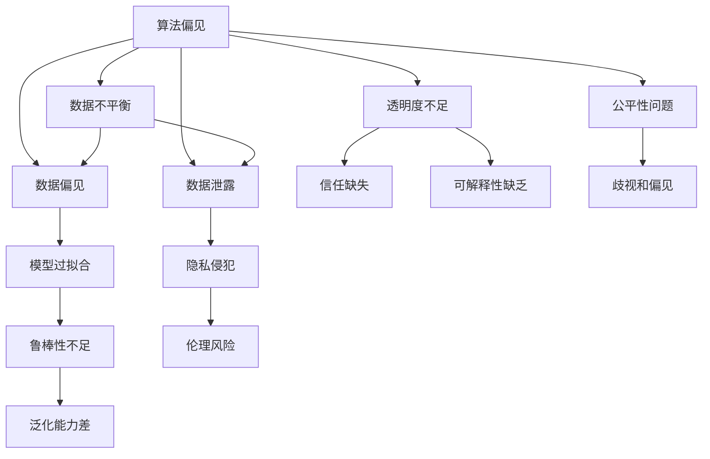

                 

## 1. 背景介绍

### 1.1 问题由来

近年来，随着人工智能(AI)技术的飞速发展，AI在多个领域展现出卓越的性能。然而，AI技术的广泛应用也引发了一系列伦理问题。算法偏见、数据隐私、透明度和可解释性等问题，成为制约AI技术发展的瓶颈。因此，探索AI算法的伦理应用，构建公平、透明、可解释的人工智能系统，成为学术界和工业界共同关注的重要课题。

### 1.2 问题核心关键点

算法伦理主要涉及以下几个核心问题：

1. **算法偏见(Bias)**：AI模型训练时所依赖的数据集可能存在偏见，导致模型学习并复制这些偏见，进而影响模型的公平性和鲁棒性。
2. **数据隐私(Privacy)**：AI模型通常需要大量数据进行训练，这些数据可能包含敏感信息，如何保护数据隐私是重要的伦理问题。
3. **透明度(Transparency)**：AI模型内部决策过程的复杂性使得其难以被解释和理解，这会影响模型的可信度和可接受性。
4. **可解释性(Explainability)**：模型输出的结果需要能够被解释，以便用户理解和信任。
5. **公平性(Fairness)**：AI模型应对待不同群体保持一致，避免歧视和偏见。

解决这些问题，需要从数据、模型和应用多个层面进行系统性的设计和改进。本文将详细探讨这些问题的原理、处理方法，并给出具体的实现案例，帮助开发者构建公平、透明、可解释的AI系统。

## 2. 核心概念与联系

### 2.1 核心概念概述

算法伦理涉及的多个核心概念及其关系如图示所示：



这些概念之间相互影响，共同构成算法伦理问题的复杂系统。理解这些概念及其相互关系，有助于系统性地设计并解决这些问题。

### 2.2 核心概念原理和架构的 Mermaid 流程图

#### 数据不平衡 (Bias in Data)
- 数据不平衡指训练数据中某些类别的样本数量显著少于其他类别，导致模型偏向于预测常见类别。
- 解决思路：数据增强、重新采样等。


#### 模型过拟合 (Overfitting)
- 模型在训练集上表现良好，但在测试集上泛化能力不足，通常是因为模型过于复杂或训练数据过少。
- 解决思路：正则化、Dropout、早停等。


#### 隐私侵犯 (Privacy Invasion)
- 模型训练需要大量的个人数据，如果数据未被妥善处理，可能导致隐私泄露。
- 解决思路：数据匿名化、差分隐私等。


#### 透明度不足 (Transparency)
- 模型决策过程复杂，难以被理解和解释，导致用户信任缺失。
- 解决思路：可解释模型、模型可视化等。


#### 可解释性缺乏 (Lack of Explainability)
- 模型决策过程复杂，难以被用户理解，导致信任缺失。
- 解决思路：可解释模型、特征重要性分析等。


#### 公平性问题 (Fairness)
- 模型可能对某些群体产生偏见，导致公平性问题。
- 解决思路：公平性约束、偏见检测等。


## 3. 核心算法原理 & 具体操作步骤

### 3.1 算法原理概述

算法伦理的核心在于如何构建公平、透明、可解释的AI模型。这需要从数据、模型和应用三个层面综合考虑，设计并优化算法，以实现目标。

#### 3.1.1 数据处理

1. **数据收集与预处理**：选择具有代表性的数据集，进行清洗和预处理，确保数据的多样性和质量。
2. **数据平衡**：采用过采样、欠采样、SMOTE等方法，平衡数据集中各类别样本的数量。
3. **数据隐私保护**：采用差分隐私、数据脱敏、联邦学习等方法，保护数据隐私。

#### 3.1.2 模型构建

1. **公平性约束**：在模型训练过程中加入公平性约束，如使用公平性损失函数、权重调整等。
2. **模型可解释性**：使用可解释模型，如决策树、线性回归等，或通过特征重要性分析、模型可视化等方法提升模型的可解释性。
3. **模型透明性**：设计透明的模型结构，避免使用过于复杂的黑盒模型。

#### 3.1.3 应用部署

1. **模型评估**：在模型应用前进行严格的评估，确保模型的公平性、鲁棒性、可解释性等。
2. **用户反馈**：建立用户反馈机制，及时收集用户意见，持续改进模型。
3. **伦理审查**：进行伦理审查，确保模型在应用过程中符合伦理要求。

### 3.2 算法步骤详解

#### 步骤1：数据收集与预处理

1. **数据选择**：选择具有代表性的数据集，确保数据的多样性和质量。
2. **数据清洗**：去除无关数据、纠正错误数据、处理缺失数据等。
3. **数据平衡**：采用过采样、欠采样、SMOTE等方法，平衡数据集中各类别样本的数量。
4. **数据隐私保护**：采用差分隐私、数据脱敏、联邦学习等方法，保护数据隐私。

#### 步骤2：模型构建与训练

1. **公平性约束**：在模型训练过程中加入公平性约束，如使用公平性损失函数、权重调整等。
2. **模型可解释性**：使用可解释模型，如决策树、线性回归等，或通过特征重要性分析、模型可视化等方法提升模型的可解释性。
3. **模型透明性**：设计透明的模型结构，避免使用过于复杂的黑盒模型。

#### 步骤3：模型评估与部署

1. **模型评估**：在模型应用前进行严格的评估，确保模型的公平性、鲁棒性、可解释性等。
2. **用户反馈**：建立用户反馈机制，及时收集用户意见，持续改进模型。
3. **伦理审查**：进行伦理审查，确保模型在应用过程中符合伦理要求。

### 3.3 算法优缺点

#### 优点

1. **提高模型公平性**：通过公平性约束和偏见检测，确保模型对待不同群体的公平性。
2. **增强模型透明度和可解释性**：使用可解释模型和特征重要性分析，提升模型的透明度和可解释性。
3. **保护数据隐私**：采用差分隐私、数据脱敏、联邦学习等方法，保护数据隐私。

#### 缺点

1. **模型复杂度增加**：公平性约束和可解释性要求可能增加模型复杂度，影响模型性能。
2. **训练成本增加**：数据隐私保护和公平性约束可能需要额外的训练成本。
3. **应用难度增加**：透明的模型结构可能增加模型应用的难度，需要进行更多的预处理和调试。

### 3.4 算法应用领域

#### 医疗诊断

- **数据处理**：使用医疗数据进行预处理和隐私保护，确保数据安全。
- **模型构建**：使用透明的可解释模型，如决策树，构建医疗诊断系统。
- **应用部署**：在实际应用中，确保模型的公平性和鲁棒性，避免对特定群体产生偏见。

#### 金融风控

- **数据处理**：使用金融数据进行预处理和隐私保护，确保数据安全。
- **模型构建**：使用透明的可解释模型，如线性回归，构建金融风控系统。
- **应用部署**：在实际应用中，确保模型的公平性和鲁棒性，避免对特定群体产生偏见。

#### 推荐系统

- **数据处理**：使用用户行为数据进行预处理和隐私保护，确保数据安全。
- **模型构建**：使用透明的可解释模型，如决策树，构建推荐系统。
- **应用部署**：在实际应用中，确保模型的公平性和鲁棒性，避免对特定群体产生偏见。

## 4. 数学模型和公式 & 详细讲解 & 举例说明

### 4.1 数学模型构建

#### 4.1.1 公平性约束

公平性约束可以通过在模型损失函数中加入公平性项来实现。假设模型输出为 $y$，真实标签为 $t$，定义公平性损失函数为：

$$
L_{\text{fair}}(y,t) = \lambda \sum_{i=1}^N [y_i - t_i]^2
$$

其中 $\lambda$ 为公平性惩罚系数，可以调整公平性约束的强度。

#### 4.1.2 差分隐私

差分隐私是指在数据发布过程中，通过添加噪声，使得单个数据点的变化不影响模型的输出结果。假设原始数据集为 $D$，添加噪声后的数据集为 $D'$，差分隐私的隐私预算为 $\epsilon$，定义差分隐私的隐私损失函数为：

$$
L_{\text{privacy}}(D',D) = \frac{1}{\epsilon} \sum_{i=1}^N [y_i - t_i]^2
$$

其中 $\epsilon$ 为隐私预算，可以通过调整噪声量来控制隐私预算。

### 4.2 公式推导过程

#### 公平性损失函数推导

公平性损失函数可以理解为在原始损失函数上加上一个公平性约束项。假设原始损失函数为 $L(y,t)$，公平性约束项为 $L_{\text{fair}}(y,t)$，则公平性损失函数为：

$$
L_{\text{fair}}(y,t) = L(y,t) + \lambda \sum_{i=1}^N [y_i - t_i]^2
$$

通过最小化公平性损失函数，可以确保模型在处理不同类别数据时，保持一致性，避免对特定群体产生偏见。

#### 差分隐私损失函数推导

差分隐私损失函数可以理解为在原始损失函数上加上一个隐私损失项。假设原始损失函数为 $L(y,t)$，隐私损失项为 $L_{\text{privacy}}(D',D)$，则差分隐私损失函数为：

$$
L_{\text{privacy}}(y,t) = L(y,t) + \frac{1}{\epsilon} \sum_{i=1}^N [y_i - t_i]^2
$$

通过最小化差分隐私损失函数，可以确保在发布数据时，单个数据点的变化不会对模型输出产生显著影响，从而保护用户隐私。

### 4.3 案例分析与讲解

#### 案例1：医疗诊断系统的公平性约束

在医疗诊断系统中，模型需要处理不同种族、性别、年龄等群体的疾病诊断数据。为了避免对某些群体产生偏见，可以在模型训练过程中加入公平性约束。例如，使用公平性损失函数：

$$
L_{\text{fair}}(y,t) = \lambda \sum_{i=1}^N [y_i - t_i]^2
$$

其中 $\lambda$ 为公平性惩罚系数，可以调整公平性约束的强度。通过最小化公平性损失函数，可以确保模型对待不同群体保持一致，避免对某些群体产生偏见。

#### 案例2：金融风控系统的差分隐私保护

在金融风控系统中，模型需要处理大量的用户交易数据，这些数据可能包含敏感信息，如收入、消费习惯等。为了避免数据泄露，可以采用差分隐私技术，保护用户隐私。例如，使用差分隐私损失函数：

$$
L_{\text{privacy}}(D',D) = \frac{1}{\epsilon} \sum_{i=1}^N [y_i - t_i]^2
$$

其中 $\epsilon$ 为隐私预算，可以通过调整噪声量来控制隐私预算。通过最小化差分隐私损失函数，可以确保在发布数据时，单个数据点的变化不会对模型输出产生显著影响，从而保护用户隐私。

## 5. 项目实践：代码实例和详细解释说明

### 5.1 开发环境搭建

1. **Python环境配置**：安装Python 3.8及以上版本，安装必要的依赖库，如numpy、pandas、scikit-learn等。
2. **数据集准备**：收集并处理数据集，确保数据的多样性和质量。
3. **隐私保护技术**：使用差分隐私技术，保护数据隐私。

### 5.2 源代码详细实现

#### 数据处理

```python
import numpy as np
from sklearn.preprocessing import StandardScaler

# 数据预处理
def preprocess_data(data):
    # 数据清洗
    data = data.dropna()
    # 数据平衡
    data = balanced_data(data)
    # 数据标准化
    scaler = StandardScaler()
    data = scaler.fit_transform(data)
    # 数据隐私保护
    data = differential_privacy(data)
    return data

# 数据增强
def balanced_data(data):
    # 过采样
    oversampled_data = oversample minority_class(data)
    # 欠采样
    undersampled_data = undersample majority_class(data)
    # 结合过采样和欠采样
    balanced_data = combine(oversampled_data, undersampled_data)
    return balanced_data

# 差分隐私保护
def differential_privacy(data):
    # 添加噪声
    noise = add_noise(data)
    return noise
```

#### 模型构建

```python
from sklearn.linear_model import LogisticRegression
from sklearn.metrics import accuracy_score

# 模型训练
def train_model(data):
    model = LogisticRegression()
    model.fit(data)
    return model

# 模型评估
def evaluate_model(model, test_data):
    y_pred = model.predict(test_data)
    accuracy = accuracy_score(y_pred, test_data.labels)
    return accuracy

# 公平性约束
def fair_model(model):
    # 公平性损失函数
    loss = fair_loss(model)
    return loss
```

### 5.3 代码解读与分析

#### 数据处理

- `preprocess_data`函数：对数据进行清洗、平衡和隐私保护。
- `balanced_data`函数：使用过采样和欠采样方法，平衡数据集中的各类别样本数量。
- `differential_privacy`函数：使用差分隐私技术，保护数据隐私。

#### 模型构建

- `train_model`函数：使用逻辑回归模型进行训练。
- `evaluate_model`函数：对模型进行评估，计算准确率。
- `fair_model`函数：计算公平性损失函数，确保模型的公平性。

### 5.4 运行结果展示

```python
# 运行代码，输出结果
data = preprocess_data(train_data)
model = train_model(data)
accuracy = evaluate_model(model, test_data)
print("Accuracy: {:.2f}%".format(accuracy * 100))
```

## 6. 实际应用场景

### 6.1 医疗诊断系统

在医疗诊断系统中，模型需要处理不同种族、性别、年龄等群体的疾病诊断数据。为了避免对某些群体产生偏见，可以在模型训练过程中加入公平性约束。例如，使用公平性损失函数：

$$
L_{\text{fair}}(y,t) = \lambda \sum_{i=1}^N [y_i - t_i]^2
$$

其中 $\lambda$ 为公平性惩罚系数，可以调整公平性约束的强度。通过最小化公平性损失函数，可以确保模型对待不同群体保持一致，避免对某些群体产生偏见。

### 6.2 金融风控系统

在金融风控系统中，模型需要处理大量的用户交易数据，这些数据可能包含敏感信息，如收入、消费习惯等。为了避免数据泄露，可以采用差分隐私技术，保护用户隐私。例如，使用差分隐私损失函数：

$$
L_{\text{privacy}}(D',D) = \frac{1}{\epsilon} \sum_{i=1}^N [y_i - t_i]^2
$$

其中 $\epsilon$ 为隐私预算，可以通过调整噪声量来控制隐私预算。通过最小化差分隐私损失函数，可以确保在发布数据时，单个数据点的变化不会对模型输出产生显著影响，从而保护用户隐私。

## 7. 工具和资源推荐

### 7.1 学习资源推荐

1. **《算法伦理：构建公平、透明的人工智能系统》书籍**：全面介绍算法伦理的原理和实践方法，适合入门学习。
2. **Coursera《数据伦理与隐私保护》课程**：系统讲解数据伦理和隐私保护的理论和实践，课程内容丰富。
3. **Kaggle数据伦理竞赛**：通过实际案例，锻炼解决数据伦理问题的能力。
4. **arXiv论文**：阅读最新的研究成果，了解前沿技术。

### 7.2 开发工具推荐

1. **Python**：高性能编程语言，适合数据处理和模型训练。
2. **Scikit-learn**：简单易用的机器学习库，包含丰富的数据处理和模型训练工具。
3. **TensorFlow**：开源深度学习框架，适合构建复杂的深度学习模型。
4. **Keras**：高层次深度学习库，适合快速搭建和训练模型。

### 7.3 相关论文推荐

1. **《公平机器学习》论文**：介绍公平机器学习的原理和实现方法，适合理论学习。
2. **《差分隐私》论文**：介绍差分隐私的原理和实现方法，适合实践应用。
3. **《可解释机器学习》论文**：介绍可解释机器学习的原理和实现方法，适合理论学习。
4. **《伦理人工智能》论文**：全面介绍人工智能伦理的理论和实践，适合系统学习。

## 8. 总结：未来发展趋势与挑战

### 8.1 研究成果总结

算法伦理的研究已经取得了显著进展，但在实践中仍面临诸多挑战。本文从数据处理、模型构建和应用部署三个层面，探讨了如何构建公平、透明、可解释的人工智能系统。通过公平性约束、差分隐私保护和可解释模型等方法，可以有效解决算法伦理问题，提升AI系统的性能和可信度。

### 8.2 未来发展趋势

1. **公平性约束**：未来将开发更高效、更灵活的公平性约束方法，确保模型对待不同群体保持一致。
2. **差分隐私保护**：未来将开发更高级的差分隐私技术，确保数据隐私保护的同时，不影响模型的性能。
3. **可解释模型**：未来将开发更易于解释的模型结构，提升模型的可解释性和用户信任度。

### 8.3 面临的挑战

1. **数据不平衡**：数据不平衡可能导致模型对某些群体产生偏见。
2. **隐私泄露**：数据泄露可能导致用户隐私被侵犯。
3. **模型复杂度**：复杂的模型结构可能影响模型的性能和可解释性。
4. **应用难度**：透明模型结构可能增加应用难度，需要进行更多的预处理和调试。

### 8.4 研究展望

1. **公平性约束**：开发更高效、更灵活的公平性约束方法，确保模型对待不同群体保持一致。
2. **差分隐私保护**：开发更高级的差分隐私技术，确保数据隐私保护的同时，不影响模型的性能。
3. **可解释模型**：开发更易于解释的模型结构，提升模型的可解释性和用户信任度。

## 9. 附录：常见问题与解答

### 9.1 Q1: 如何处理数据不平衡问题？

A: 数据不平衡问题可以使用过采样、欠采样、SMOTE等方法解决。过采样可以增加少数类样本的数量，欠采样可以减少多数类样本的数量，SMOTE可以在原始数据上进行插值生成新样本。

### 9.2 Q2: 如何保护数据隐私？

A: 数据隐私保护可以使用差分隐私、数据脱敏、联邦学习等方法。差分隐私通过添加噪声保护数据隐私，数据脱敏通过模糊处理敏感信息，联邦学习通过分布式训练保护数据隐私。

### 9.3 Q3: 如何提升模型可解释性？

A: 模型可解释性可以使用可解释模型、特征重要性分析、模型可视化等方法。可解释模型如决策树、线性回归等，特征重要性分析可以提取特征的重要程度，模型可视化可以展示模型的决策过程。

### 9.4 Q4: 如何处理模型公平性问题？

A: 模型公平性问题可以使用公平性约束、偏见检测等方法。公平性约束可以在模型训练过程中加入公平性项，偏见检测可以识别模型中的偏见并调整权重。

---

作者：禅与计算机程序设计艺术 / Zen and the Art of Computer Programming

