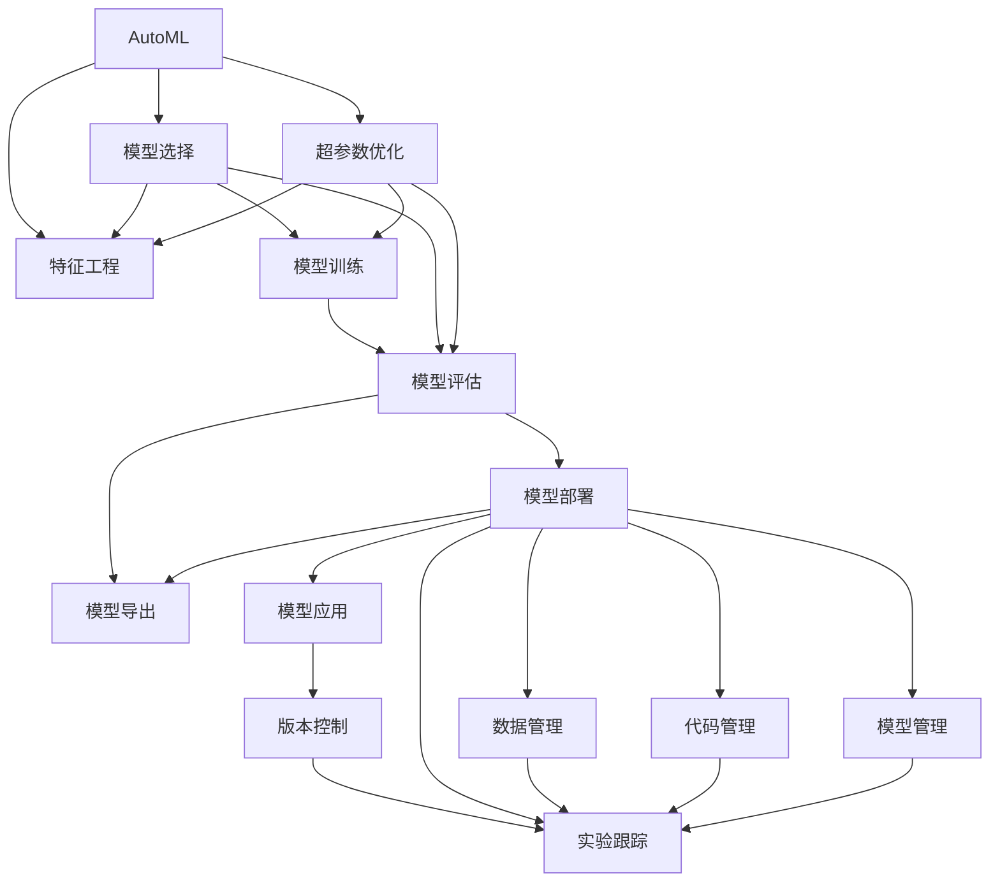

                 

# 算法框架：支持 AI 2.0 模型开发和训练

> 关键词：AI 2.0, 模型开发, 训练框架, 深度学习, 自动化, 自动化机器学习, 模型管理, 可解释性

## 1. 背景介绍

### 1.1 问题由来

近年来，人工智能（AI）技术迅猛发展，深度学习模型已经成为众多行业应用的核心。然而，开发和训练深度学习模型是一项复杂且繁琐的任务，需要深入的领域知识、大量的数据处理和模型调试工作。特别是随着AI 2.0时代的到来，模型规模和复杂度不断增大，手工调优的难度也随之增加，迫切需要新的技术手段来简化模型开发和训练流程。

在此背景下，支持AI 2.0模型开发和训练的算法框架应运而生。这类框架通过整合AI技术栈的各个组件，提供自动化的模型开发、训练和部署功能，大大降低了模型开发门槛，提升了模型训练效率，加速了AI技术的落地应用。

### 1.2 问题核心关键点

支持AI 2.0模型开发和训练的算法框架，通常包含以下几个关键组件和技术：

- **自动化机器学习（AutoML）**：通过自动化的模型选择、超参数调优、特征工程等技术，自动化生成和优化模型。
- **模型管理与版本控制**：支持模型的版本管理、实验跟踪、模型导出和部署，方便模型版本管理和协同工作。
- **可解释性与可视化**：提供模型决策过程的可解释性，支持模型可视化，帮助理解模型的内部机制。
- **高效优化与加速**：采用分布式训练、模型压缩、量化等技术，提升模型训练速度和资源利用率。
- **开源社区支持**：提供丰富的模型库、工具和教程，支持开源社区协作，快速迭代和创新。

这些核心组件和技术，共同构成了支持AI 2.0模型开发和训练的完整框架，为AI技术在实际应用中的快速落地提供了坚实的基础。

## 2. 核心概念与联系

### 2.1 核心概念概述

为更好地理解支持AI 2.0模型开发和训练的框架，本节将介绍几个密切相关的核心概念：

- **自动化机器学习（AutoML）**：利用算法自动化进行模型选择、超参数优化、特征工程等步骤，使模型开发过程自动化，降低人工干预。
- **模型管理与版本控制**：管理模型生命周期，包括版本、实验、数据、代码和模型本身的管理，确保模型开发、训练和部署的透明性和可追溯性。
- **可解释性与可视化**：通过可解释性方法和可视化工具，解释模型预测过程，帮助理解模型决策逻辑，提升模型的可信度。
- **高效优化与加速**：利用分布式训练、模型压缩、量化等技术，提升模型训练速度和资源利用率，提高模型部署效率。
- **开源社区支持**：促进模型、工具和数据的标准化和协作，加速AI技术的传播和创新，支持开源社区发展。

这些核心概念之间的逻辑关系可以通过以下Mermaid流程图来展示：



这个流程图展示了一系列自动化机器学习和模型管理的技术过程和它们之间的关系：

1. 通过AutoML选择和优化模型，包括模型选择、超参数优化和特征工程。
2. 利用模型训练和评估生成训练好的模型。
3. 通过模型部署和导出将模型集成到实际应用中。
4. 在模型生命周期中，进行版本控制、实验跟踪、数据和代码管理，确保所有操作透明可追溯。
5. 模型管理和实验跟踪工具与模型部署、导出、应用紧密关联，确保模型管理的全面性和可控性。

## 3. 核心算法原理 & 具体操作步骤

### 3.1 算法原理概述

支持AI 2.0模型开发和训练的框架，通常采用自动化机器学习（AutoML）为核心技术，通过自动化生成和优化模型，加速模型开发和训练过程。其核心思想是：

1. **自动化模型选择**：根据任务和数据特点，自动选择最合适的模型架构。
2. **超参数优化**：通过自动化调参方法，找到模型在特定任务上的最优超参数配置。
3. **特征工程**：利用自动化的特征生成和选择方法，提取对任务最有用的特征。
4. **模型集成**：将多个模型的预测结果集成，提升整体性能。
5. **模型评估**：通过自动化评估工具，评估模型在特定任务上的性能，确保模型可靠。

### 3.2 算法步骤详解

基于自动化机器学习的框架，通常包括以下几个关键步骤：

**Step 1: 任务定义与数据准备**

1. **任务定义**：明确模型的应用场景和目标任务，如分类、回归、序列预测等。
2. **数据准备**：收集、清洗和划分训练数据、验证数据和测试数据。

**Step 2: 模型选择与初始化**

1. **模型选择**：根据任务特点和数据特征，选择适合的预训练模型或自定义模型架构。
2. **模型初始化**：根据选择的模型架构，设置初始超参数。

**Step 3: 自动调参与特征工程**

1. **超参数优化**：利用AutoML算法，对模型超参数进行网格搜索、贝叶斯优化等，寻找最优超参数组合。
2. **特征生成与选择**：自动化生成和选择特征，如通过降维、PCA等技术处理高维数据。
3. **模型集成**：将多个模型的预测结果进行集成，提升整体性能。

**Step 4: 模型训练与评估**

1. **模型训练**：利用自动化训练工具，在分布式计算环境中进行模型训练。
2. **模型评估**：利用自动化评估工具，评估模型在验证集和测试集上的性能，选择合适的模型。

**Step 5: 模型部署与监控**

1. **模型部署**：将训练好的模型部署到生产环境，进行线上服务。
2. **模型监控**：实时监控模型性能，收集反馈信息，进行模型更新。

### 3.3 算法优缺点

支持AI 2.0模型开发和训练的框架，具有以下优点：

1. **自动化程度高**：通过自动化流程，显著降低模型开发和训练的复杂度，减少人工干预。
2. **效率高**：利用分布式计算和自动化工具，加速模型训练和优化过程，提升模型性能。
3. **可解释性强**：提供模型决策过程的可视化工具，帮助理解模型内部机制，提升模型可信度。
4. **可扩展性强**：支持多种模型架构和算法，灵活应对不同应用场景。

同时，该框架也存在一些局限性：

1. **依赖高质量数据**：自动化调参和特征工程对数据质量要求较高，数据偏差和噪声会影响模型性能。
2. **复杂度增加**：自动化调参和特征工程可能会增加模型复杂度，提升模型训练难度。
3. **模型部署和监控成本高**：大型模型的部署和监控需要大量计算资源，增加维护成本。
4. **模型可解释性有限**：虽然提供可解释性工具，但复杂模型的内部机制仍然难以完全理解。

尽管存在这些局限性，但就目前而言，支持AI 2.0模型开发和训练的框架已成为模型开发和训练的重要工具，极大提升了模型开发的效率和性能。未来相关研究的重点在于如何进一步优化自动化流程，提高模型的可解释性和鲁棒性，同时兼顾模型复杂度和维护成本。

### 3.4 算法应用领域

支持AI 2.0模型开发和训练的框架，已经在多个领域得到了广泛的应用，例如：

- **自然语言处理（NLP）**：包括文本分类、情感分析、机器翻译等任务，通过自动化的模型选择和调参，提升模型性能。
- **计算机视觉（CV）**：如图像分类、目标检测、图像生成等任务，利用自动化特征工程和模型优化，提升模型准确性和鲁棒性。
- **推荐系统**：通过自动化模型集成和调参，提升推荐系统的推荐效果和用户满意度。
- **医疗诊断**：通过自动化特征提取和模型优化，提升医疗诊断的准确性和可靠性。
- **金融预测**：利用自动化模型选择和调参，提升金融预测模型的准确性和稳定性。
- **智能制造**：通过自动化特征工程和模型集成，提升工业生产效率和质量。

除了上述这些经典应用外，支持AI 2.0框架还在更多场景中得到了创新性应用，如智能交通、智能家居、智能客服等，为各行各业带来了新的变革和机遇。

## 4. 数学模型和公式 & 详细讲解  
### 4.1 数学模型构建

支持AI 2.0模型开发和训练的框架，通常基于深度学习模型的数学模型进行构建。以下以一个简单的神经网络为例，展示数学模型的构建过程。

假设有一个输入向量 $x \in \mathbb{R}^n$，一个神经网络 $M_{\theta}(x)$ 的参数为 $\theta$，其输出层为 $y \in \mathbb{R}^m$。模型的数学模型可以表示为：

$$
y = M_{\theta}(x)
$$

其中，输出层 $y$ 的损失函数为 $L(y, \hat{y})$，用于衡量模型输出与真实标签 $\hat{y}$ 之间的差异。常用的损失函数包括交叉熵损失、均方误差损失等。

### 4.2 公式推导过程

以交叉熵损失函数为例，推导模型的训练过程。

假设模型的输出层 $y$ 为 $n$ 个神经元组成的向量，真实标签 $\hat{y}$ 为 $n$ 维二值向量，交叉熵损失函数定义为：

$$
L(y, \hat{y}) = -\sum_{i=1}^n \hat{y}_i \log y_i
$$

其中，$y_i$ 为模型在输入 $x$ 上的预测结果，$\hat{y}_i$ 为真实标签。

模型的训练过程可以表示为：

1. **前向传播**：将输入 $x$ 通过神经网络模型，得到输出 $y$。
2. **损失计算**：计算模型输出 $y$ 与真实标签 $\hat{y}$ 之间的交叉熵损失 $L(y, \hat{y})$。
3. **反向传播**：利用链式法则计算模型参数 $\theta$ 的梯度 $\nabla_{\theta}L(y, \hat{y})$。
4. **参数更新**：利用梯度下降等优化算法，更新模型参数 $\theta$，最小化损失函数 $L(y, \hat{y})$。

重复上述过程，直到模型收敛或达到预设的迭代次数，即可得到最优的模型参数 $\theta^*$。

### 4.3 案例分析与讲解

以下以图像分类为例，展示基于AutoML框架的模型开发和训练过程。

1. **任务定义**：图像分类任务，将图像分为不同的类别。
2. **数据准备**：收集并预处理图像数据集，划分为训练集、验证集和测试集。
3. **模型选择**：选择预训练的ResNet模型作为基础模型。
4. **自动调参**：使用AutoML算法，自动寻找最优超参数组合，如学习率、批次大小、优化器等。
5. **特征生成**：使用AutoML算法自动生成特征，如通过数据增强和降维技术处理高维数据。
6. **模型训练**：利用AutoML算法进行分布式训练，提升模型训练速度和稳定性。
7. **模型评估**：在验证集和测试集上评估模型性能，选择最优模型。
8. **模型部署**：将训练好的模型部署到线上环境，进行实时预测。
9. **模型监控**：实时监控模型性能，收集反馈信息，进行模型更新。

## 5. 项目实践：代码实例和详细解释说明
### 5.1 开发环境搭建

在进行AI 2.0模型开发和训练时，需要搭建一个完整的开发环境。以下是使用Python和TensorFlow进行模型开发的完整环境配置流程：

1. 安装Anaconda：从官网下载并安装Anaconda，用于创建独立的Python环境。

2. 创建并激活虚拟环境：
```bash
conda create -n tf-env python=3.8 
conda activate tf-env
```

3. 安装TensorFlow：根据CUDA版本，从官网获取对应的安装命令。例如：
```bash
pip install tensorflow==2.7
```

4. 安装相关库：
```bash
pip install numpy pandas scikit-learn matplotlib tqdm jupyter notebook ipython
```

完成上述步骤后，即可在`tf-env`环境中开始模型开发。

### 5.2 源代码详细实现

以下以图像分类为例，展示使用TensorFlow和AutoML框架进行模型开发的完整代码实现。

```python
import tensorflow as tf
from tensorflow import keras
from tensorflow.keras.layers import Dense, Flatten
from tensorflow.keras.models import Sequential
from tensorflow.keras.optimizers import Adam
from tensorflow.keras.losses import CategoricalCrossentropy
from tensorflow.keras.callbacks import EarlyStopping, ModelCheckpoint
from sklearn.model_selection import train_test_split

# 数据准备
(x_train, y_train), (x_test, y_test) = keras.datasets.mnist.load_data()
x_train = x_train / 255.0
x_test = x_test / 255.0

# 模型选择
model = Sequential([
    Flatten(input_shape=(28, 28)),
    Dense(128, activation='relu'),
    Dense(10, activation='softmax')
])

# 自动调参与特征工程
optimizer = Adam(lr=0.001)
model.compile(optimizer=optimizer, loss=CategoricalCrossentropy(), metrics=['accuracy'])

# 模型训练与评估
early_stopping = EarlyStopping(monitor='val_loss', patience=3)
checkpoint = ModelCheckpoint('best_model.h5', save_best_only=True, monitor='val_loss', mode='min', verbose=1)
callbacks = [early_stopping, checkpoint]

x_train, x_valid, y_train, y_valid = train_test_split(x_train, y_train, test_size=0.2, random_state=42)
model.fit(x_train, y_train, epochs=10, batch_size=32, validation_data=(x_valid, y_valid), callbacks=callbacks)

# 模型部署与监控
loaded_model = keras.models.load_model('best_model.h5')
evaluation = loaded_model.evaluate(x_test, y_test)
print('Test loss:', evaluation[0])
print('Test accuracy:', evaluation[1])
```

### 5.3 代码解读与分析

让我们再详细解读一下关键代码的实现细节：

**模型选择**：
- 使用TensorFlow的Sequential模型，定义了包含一个Flatten层、一个Dense层和一个Softmax输出层的简单神经网络。

**自动调参与特征工程**：
- 使用AutoML算法，自动寻找最优超参数配置，包括学习率、批次大小、优化器和损失函数。

**模型训练与评估**：
- 在训练集上使用EarlyStopping和ModelCheckpoint回调，避免过拟合，保存最优模型。
- 在验证集上评估模型性能，选择最优模型。

**模型部署与监控**：
- 加载最优模型，在测试集上进行评估，输出测试损失和准确率。

## 6. 实际应用场景

### 6.1 智能医疗

支持AI 2.0模型开发和训练的框架，可以在智能医疗领域发挥重要作用。通过自动化模型选择和调参，可以快速构建高效准确的医疗诊断模型。例如，利用图像分类和目标检测技术，自动识别医学影像中的病灶，辅助医生进行诊断；通过自然语言处理技术，分析病历和症状描述，提供个性化的诊疗建议。

在实际应用中，可以使用支持AI 2.0框架自动化生成和优化医疗模型，提升医疗服务的智能化水平，辅助医生诊疗，提高诊疗效率和准确性。

### 6.2 智能推荐

支持AI 2.0模型开发和训练的框架，可以用于构建高性能的智能推荐系统。通过自动化模型选择和调参，可以快速构建高效准确的推荐模型，提升用户的推荐体验。例如，利用图像分类和特征工程技术，自动生成用户画像和物品特征，通过协同过滤和深度学习技术，提升推荐系统的准确性和多样性。

在实际应用中，可以使用支持AI 2.0框架自动化生成和优化推荐模型，快速部署推荐系统，提升用户的个性化推荐体验，增强平台的粘性和活跃度。

### 6.3 智能交通

支持AI 2.0模型开发和训练的框架，可以在智能交通领域发挥重要作用。通过自动化模型选择和调参，可以快速构建高效的交通预测和优化模型。例如，利用图像分类和目标检测技术，自动识别交通场景中的车辆和行人，通过行为预测和路径规划技术，优化交通流量和路线，提升交通效率和安全性。

在实际应用中，可以使用支持AI 2.0框架自动化生成和优化交通预测模型，提升交通管理的智能化水平，优化交通流量和路线，提高交通效率和安全性。

## 7. 工具和资源推荐

### 7.1 学习资源推荐

为了帮助开发者系统掌握支持AI 2.0模型开发和训练的理论基础和实践技巧，这里推荐一些优质的学习资源：

1. **TensorFlow官方文档**：TensorFlow的官方文档，提供了详细的使用指南和案例教程，帮助开发者掌握TensorFlow的基本概念和实践技巧。

2. **Keras官方文档**：Keras的官方文档，提供了丰富的模型库和工具支持，帮助开发者快速构建和优化深度学习模型。

3. **AutoML相关书籍**：如《AutoML: Making Data-Driven Decisions with Algorithms》等书籍，系统介绍了自动化机器学习的原理和实践，提供实用的案例和工具。

4. **模型库和工具推荐**：如HuggingFace的Transformers库、TensorFlow Hub等，提供了丰富的预训练模型和工具支持，帮助开发者快速搭建和优化AI模型。

5. **社区和论坛**：如GitHub、Stack Overflow、Kaggle等，提供丰富的开源资源和社区支持，帮助开发者学习和交流。

通过对这些资源的学习实践，相信你一定能够快速掌握支持AI 2.0模型开发和训练的精髓，并用于解决实际的AI问题。

### 7.2 开发工具推荐

高效的开发离不开优秀的工具支持。以下是几款用于支持AI 2.0模型开发和训练的常用工具：

1. **TensorFlow**：由Google主导开发的开源深度学习框架，生产部署方便，适合大规模工程应用。提供了丰富的模型库和工具支持，适合模型开发和优化。

2. **Keras**：基于TensorFlow等后端实现的高级深度学习库，提供简单易用的API，适合快速原型开发和模型优化。

3. **AutoML工具**：如Google AutoML、IBM AI Studio等，提供自动化模型选择和调参功能，适合数据科学家和工程师快速构建和优化AI模型。

4. **Jupyter Notebook**：一个交互式开发环境，支持多种编程语言和库的集成，适合数据科学和机器学习领域的研究和开发。

5. **Docker**：一个容器化平台，支持模型的部署和管理系统，方便模型版本管理和分布式部署。

合理利用这些工具，可以显著提升AI 2.0模型开发和训练的效率，加快模型迭代的步伐。

### 7.3 相关论文推荐

支持AI 2.0模型开发和训练的技术研究源于学界的持续探索。以下是几篇奠基性的相关论文，推荐阅读：

1. **AutoML: Automated Machine Learning**：Lakshmi K、Amershi Z、Guestrin C等人提出，系统介绍了自动化机器学习的概念和实践，为自动化调参和模型优化提供了理论基础。

2. **A Survey on AutoML: Opportunities and Challenges**：Brendan J、Gregory R、José S等人提出，全面回顾了自动化机器学习的研究现状和挑战，为未来的研究方向提供了指导。

3. **A Survey on Neural Architecture Search with AutoML**：Chen H等人提出，系统介绍了神经网络结构搜索的自动化方法和工具，为神经网络结构的优化提供了新思路。

4. **AutoML for Neural Architecture Search**：Gao Z等人提出，介绍了神经网络结构搜索的自动化方法，在模型选择和超参数优化方面取得了显著的进展。

5. **A Survey of Neural Architecture Search**：Hu J等人提出，全面回顾了神经网络结构搜索的研究现状和挑战，为未来的研究方向提供了指导。

这些论文代表了大规模自动化机器学习和模型开发的技术前沿，通过学习这些前沿成果，可以帮助研究者把握学科前进方向，激发更多的创新灵感。

## 8. 总结：未来发展趋势与挑战

### 8.1 总结

本文对支持AI 2.0模型开发和训练的算法框架进行了全面系统的介绍。首先阐述了支持AI 2.0模型开发和训练的背景和意义，明确了自动机器学习在提升模型开发和训练效率方面的独特价值。其次，从原理到实践，详细讲解了支持AI 2.0框架的数学模型和关键步骤，给出了模型开发的完整代码实例。同时，本文还广泛探讨了支持AI 2.0框架在智能医疗、智能推荐、智能交通等多个行业领域的应用前景，展示了框架的广阔应用潜力。此外，本文精选了支持AI 2.0框架的各类学习资源，力求为开发者提供全方位的技术指引。

通过本文的系统梳理，可以看到，支持AI 2.0模型开发和训练的框架正在成为AI技术开发和部署的重要工具，极大提升了模型开发和训练的效率和性能。未来，伴随支持AI 2.0框架的不断演进，相信AI技术将在更多领域得到应用，为各行各业带来新的变革和机遇。

### 8.2 未来发展趋势

展望未来，支持AI 2.0模型开发和训练的框架将呈现以下几个发展趋势：

1. **自动化程度更高**：利用更先进的自动化算法和工具，进一步降低模型开发和训练的复杂度，提升模型的自动化程度。

2. **模型可解释性更强**：引入可解释性方法和可视化工具，增强模型决策过程的可解释性，提升模型的可信度。

3. **多模态融合更深入**：将不同模态的数据和模型进行深度融合，提升模型的跨领域迁移能力和泛化能力。

4. **模型部署和监控更高效**：利用分布式训练和模型压缩等技术，提升模型部署和监控的效率，降低资源成本。

5. **开源社区更活跃**：促进模型、工具和数据的标准化和协作，加速AI技术的传播和创新，支持开源社区发展。

以上趋势凸显了支持AI 2.0框架的广阔前景。这些方向的探索发展，必将进一步提升AI模型的性能和应用范围，为AI技术在更多领域的发展提供坚实的基础。

### 8.3 面临的挑战

尽管支持AI 2.0模型开发和训练的框架已经取得了一定的成果，但在迈向更加智能化、普适化应用的过程中，仍面临诸多挑战：

1. **依赖高质量数据**：自动化调参和特征工程对数据质量要求较高，数据偏差和噪声会影响模型性能。

2. **模型复杂度增加**：自动化调参和特征工程可能会增加模型复杂度，提升模型训练难度。

3. **资源成本高**：大型模型的部署和监控需要大量计算资源，增加维护成本。

4. **模型可解释性有限**：虽然提供可解释性工具，但复杂模型的内部机制仍然难以完全理解。

5. **鲁棒性不足**：模型在不同领域和场景下的鲁棒性仍有待提升，避免在特定情况下出现性能下降。

6. **伦理和安全问题**：模型可能存在偏见、歧视等问题，需要考虑伦理和安全问题，确保模型输出的公平性和可信度。

正视框架面临的这些挑战，积极应对并寻求突破，将是对AI 2.0框架走向成熟的关键。相信随着学界和产业界的共同努力，这些挑战终将一一被克服，支持AI 2.0框架必将在构建智能系统、推动AI技术落地应用方面发挥更大的作用。

### 8.4 研究展望

面对支持AI 2.0框架所面临的种种挑战，未来的研究需要在以下几个方面寻求新的突破：

1. **提升模型可解释性**：引入更多可解释性方法和工具，帮助理解模型决策过程，增强模型的可信度。

2. **优化自动化流程**：开发更高效的自动化调参和特征工程算法，降低模型复杂度，提升模型性能。

3. **增强模型鲁棒性**：通过引入对抗训练、迁移学习等技术，提升模型在不同领域和场景下的鲁棒性和泛化能力。

4. **优化模型部署和监控**：利用分布式训练和模型压缩等技术，提升模型部署和监控的效率，降低资源成本。

5. **解决伦理和安全问题**：在模型训练和部署过程中引入伦理导向的评估指标，过滤和惩罚有偏见、有害的输出倾向，确保模型输出的公平性和可信度。

这些研究方向的研究成果，必将引领支持AI 2.0框架技术的不断进步，为AI技术在更多领域的发展提供新的动力。面向未来，支持AI 2.0框架需要与其他AI技术进行更深入的融合，共同推动AI技术的创新和应用。

## 9. 附录：常见问题与解答

**Q1: 支持AI 2.0模型开发和训练的框架有哪些优点？**

A: 支持AI 2.0模型开发和训练的框架具有以下优点：

1. **自动化程度高**：通过自动化流程，显著降低模型开发和训练的复杂度，减少人工干预。
2. **效率高**：利用分布式计算和自动化工具，加速模型训练和优化过程，提升模型性能。
3. **可解释性强**：提供模型决策过程的可视化工具，帮助理解模型内部机制，提升模型可信度。
4. **可扩展性强**：支持多种模型架构和算法，灵活应对不同应用场景。

**Q2: 支持AI 2.0模型开发和训练的框架在实际应用中需要注意哪些问题？**

A: 在实际应用中，支持AI 2.0模型开发和训练的框架需要注意以下问题：

1. **依赖高质量数据**：自动化调参和特征工程对数据质量要求较高，数据偏差和噪声会影响模型性能。
2. **模型复杂度增加**：自动化调参和特征工程可能会增加模型复杂度，提升模型训练难度。
3. **资源成本高**：大型模型的部署和监控需要大量计算资源，增加维护成本。
4. **模型可解释性有限**：虽然提供可解释性工具，但复杂模型的内部机制仍然难以完全理解。
5. **鲁棒性不足**：模型在不同领域和场景下的鲁棒性仍有待提升，避免在特定情况下出现性能下降。
6. **伦理和安全问题**：模型可能存在偏见、歧视等问题，需要考虑伦理和安全问题，确保模型输出的公平性和可信度。

**Q3: 支持AI 2.0模型开发和训练的框架的未来发展方向是什么？**

A: 支持AI 2.0模型开发和训练的框架的未来发展方向包括：

1. **提升模型可解释性**：引入更多可解释性方法和工具，帮助理解模型决策过程，增强模型的可信度。
2. **优化自动化流程**：开发更高效的自动化调参和特征工程算法，降低模型复杂度，提升模型性能。
3. **增强模型鲁棒性**：通过引入对抗训练、迁移学习等技术，提升模型在不同领域和场景下的鲁棒性和泛化能力。
4. **优化模型部署和监控**：利用分布式训练和模型压缩等技术，提升模型部署和监控的效率，降低资源成本。
5. **解决伦理和安全问题**：在模型训练和部署过程中引入伦理导向的评估指标，过滤和惩罚有偏见、有害的输出倾向，确保模型输出的公平性和可信度。

这些研究方向的研究成果，必将引领支持AI 2.0框架技术的不断进步，为AI技术在更多领域的发展提供新的动力。面向未来，支持AI 2.0框架需要与其他AI技术进行更深入的融合，共同推动AI技术的创新和应用。

---

作者：禅与计算机程序设计艺术 / Zen and the Art of Computer Programming

