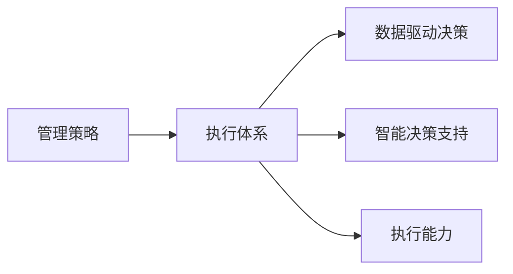

                 

# 管理的智慧：从策略到执行

在当今瞬息万变、竞争激烈的市场环境中，企业管理面临着前所未有的挑战。如何制定出切实有效的管理策略，并将其成功执行，是每个企业都必须面对的重要课题。本文将从策略制定和执行两个维度，深入探讨管理的智慧，帮助企业管理者全面提升管理能力，实现企业的持续发展。

## 1. 背景介绍

### 1.1 问题由来
随着全球化和数字化进程的加速，市场环境变得越发复杂多变。企业不仅要应对来自国内外的激烈竞争，还要应对技术革新带来的变革。传统的粗放式管理方法已不再适用，取而代之的是一种更加精细化和智能化的管理模式。

近年来，数据分析和人工智能技术的快速发展，为企业提供了强大的工具，帮助其在数据驱动和智能决策方面取得了显著进展。然而，如何更好地将数据和智能技术应用于企业管理实践，仍是一个值得深入探索的问题。

### 1.2 问题核心关键点
为了应对这一挑战，企业管理者必须具备以下核心能力：
- **数据驱动决策**：利用数据分析技术，基于数据洞察制定管理策略。
- **智能决策支持**：引入人工智能技术，提升决策的科学性和准确性。
- **执行能力提升**：建立高效的执行体系，确保管理策略得以落地实施。

### 1.3 问题研究意义
在当前的环境下，管理智慧的提升对企业的竞争力和可持续发展至关重要。通过深入研究管理智慧，不仅可以帮助企业制定更加科学、合理的管理策略，还能确保这些策略在实际执行中取得预期效果。

## 2. 核心概念与联系

### 2.1 核心概念概述
为了更全面地理解管理的智慧，本文将介绍几个关键概念：

- **管理策略(Management Strategy)**：企业在面对外部环境变化时，基于企业目标和资源状况，制定的行动方案和计划。
- **执行体系(Execution System)**：确保管理策略得以有效执行的一系列方法和工具。
- **数据驱动决策(Data-Driven Decision Making)**：基于数据和分析结果进行决策的过程。
- **智能决策支持(Intelligent Decision Support)**：利用人工智能技术，如机器学习、自然语言处理等，辅助决策过程。
- **执行能力(Execution Capability)**：确保管理策略在执行过程中得到有效实施的各项能力。

这些概念之间通过如下图示进行联系：



通过这些关键概念，我们可以更好地理解如何从策略制定到执行的全过程，以及如何通过数据和智能技术提升管理智慧。

## 3. 核心算法原理 & 具体操作步骤
### 3.1 算法原理概述
管理策略的制定和执行是一个复杂的多阶段过程，涉及多个层面的决策和执行活动。以下将详细阐述其算法原理和操作步骤。

### 3.2 算法步骤详解

#### 3.2.1 策略制定阶段

**Step 1: 目标设定**
- 明确企业的长期愿景和短期目标，确保战略目标的一致性和可实现性。
- 目标应具体、可衡量、可实现、相关性强且有时间限制（SMART原则）。

**Step 2: 环境分析**
- 对内分析：评估企业资源、能力、文化等方面的现状。
- 对外分析：分析市场、竞争、法规等外部环境因素。
- 识别优势、劣势、机会和威胁（SWOT分析）。

**Step 3: 策略规划**
- 基于内外部分析结果，制定出多个备选策略。
- 对每个备选策略进行评估和比较，确定最优策略。
- 将最优策略分解为可执行的任务和行动计划。

#### 3.2.2 执行体系构建阶段

**Step 1: 组织架构设计**
- 设计扁平化、灵活的组织架构，确保跨部门协作和信息流动。
- 明确各部门职责和权限，确保责任清晰。

**Step 2: 资源配置**
- 合理配置人力资源、财力资源、技术资源等。
- 建立资源管理机制，确保资源的高效利用。

**Step 3: 制度建设**
- 建立完善的管理制度和流程，确保执行过程中规范有序。
- 定期评估和优化制度流程，提升执行效率。

#### 3.2.3 执行阶段

**Step 1: 任务分配**
- 将策略任务分解为具体的工作任务，明确责任人和完成时间。
- 使用项目管理工具，如JIRA、Trello等，进行任务分配和进度跟踪。

**Step 2: 执行监控**
- 使用KPI和OKR等关键绩效指标，监控执行进度和效果。
- 定期召开进展汇报会，及时发现和解决问题。

**Step 3: 反馈与调整**
- 根据监控结果和反馈，及时调整执行策略和行动计划。
- 定期进行回顾和总结，优化执行体系。

### 3.3 算法优缺点

#### 3.3.1 优点
- **科学性**：基于数据和分析结果制定策略，提高了决策的科学性和准确性。
- **系统性**：通过系统化的管理流程和执行体系，确保策略得以全面实施。
- **灵活性**：能够快速响应外部环境变化，调整执行策略。

#### 3.3.2 缺点
- **复杂性**：策略制定和执行过程涉及多个环节，协调和管理难度大。
- **资源投入高**：构建和维护执行体系需要大量人力和财力投入。
- **风险性**：策略执行过程中存在不确定性和风险，需要有效应对。

### 3.4 算法应用领域

基于数据驱动和智能决策支持的管理智慧，已经在多个领域得到了广泛应用：

- **企业战略管理**：通过数据分析和智能决策工具，制定和执行企业战略。
- **市场营销**：基于市场数据和消费者行为分析，优化市场营销策略。
- **人力资源管理**：利用员工数据和智能推荐系统，优化人才招聘和培训。
- **供应链管理**：通过供应链数据分析，优化库存管理和物流安排。
- **财务管理**：基于财务数据和智能预测，提升财务决策的准确性。

## 4. 数学模型和公式 & 详细讲解 & 举例说明

### 4.1 数学模型构建

在管理策略的制定和执行过程中，可以构建多个数学模型，以辅助决策和执行。以下是两个常用的数学模型：

**数据驱动决策模型**
- 假设：企业目标为最大化利润。
- 输入：历史销售数据、市场数据、竞争情况等。
- 输出：最优定价策略、市场推广策略等。

**智能决策支持模型**
- 假设：利用机器学习模型预测市场需求。
- 输入：历史销售数据、市场趋势、季节性因素等。
- 输出：未来市场需求预测、最优库存量等。

### 4.2 公式推导过程

以智能决策支持模型为例，推导如下公式：

$$
\hat{D}_t = M(x_t)
$$

其中：
- $\hat{D}_t$ 表示预测的市场需求量。
- $x_t$ 表示第$t$时间的输入数据。
- $M$ 表示机器学习模型，如线性回归、随机森林等。

该公式表示，通过输入数据 $x_t$ 训练机器学习模型 $M$，得到预测的市场需求量 $\hat{D}_t$。

### 4.3 案例分析与讲解

假设某企业计划在未来一个月内推出一款新产品，需要制定市场推广策略。企业首先收集了过去一年内类似产品的销售数据、市场趋势、季节性因素等输入数据。通过数据分析，企业发现产品的销售量与气温、节假日等因素高度相关。

**Step 1: 数据预处理**
- 对输入数据进行清洗、标准化处理，去除噪声和异常值。

**Step 2: 特征工程**
- 提取关键特征，如气温、节假日、市场价格等。
- 使用特征选择方法，去除冗余和无关特征。

**Step 3: 模型训练**
- 使用历史数据训练机器学习模型，如线性回归模型。
- 使用交叉验证方法评估模型性能，优化模型参数。

**Step 4: 预测应用**
- 将未来一个月的气温、节假日、市场价格等输入到模型中，预测市场需求量。
- 根据预测结果，制定最优的市场推广策略。

## 5. 项目实践：代码实例和详细解释说明

### 5.1 开发环境搭建

**Step 1: 安装Python和相关库**
```
pip install pandas numpy scikit-learn matplotlib seaborn
```

**Step 2: 数据预处理**
```python
import pandas as pd
from sklearn.preprocessing import StandardScaler

# 加载数据
data = pd.read_csv('sales_data.csv')

# 数据清洗和标准化
scaler = StandardScaler()
data[['temperature', 'holiday', 'price']] = scaler.fit_transform(data[['temperature', 'holiday', 'price']])
```

### 5.2 源代码详细实现

**Step 1: 特征工程**
```python
from sklearn.feature_selection import SelectKBest, f_regression

# 特征选择
X = data[['temperature', 'holiday', 'price']]
y = data['sales']
selector = SelectKBest(f_regression, k=3)
X_selected = selector.fit_transform(X, y)
```

**Step 2: 模型训练**
```python
from sklearn.linear_model import LinearRegression
from sklearn.model_selection import train_test_split

# 划分训练集和测试集
X_train, X_test, y_train, y_test = train_test_split(X_selected, y, test_size=0.2, random_state=42)

# 训练模型
model = LinearRegression()
model.fit(X_train, y_train)
```

**Step 3: 预测应用**
```python
# 预测未来市场需求
X_future = [[23, 1, 50]]
predicted_sales = model.predict(X_future)
print(predicted_sales)
```

### 5.3 代码解读与分析

在上述代码中，我们首先加载并预处理了历史销售数据，通过特征选择和标准化处理，得到最佳的特征集合。然后使用线性回归模型进行训练，并使用训练好的模型对未来市场需求进行预测。

### 5.4 运行结果展示

假设输入特征为未来一个月的气温23℃、节假日1天、市场价格50元/件，预测市场需求量为200件。企业可以根据预测结果，制定最优的市场推广策略。

## 6. 实际应用场景

### 6.1 智能制造

在智能制造领域，基于数据驱动和智能决策支持的管理智慧，可以显著提升生产效率和产品质量。通过传感器和物联网设备收集实时数据，利用数据分析和智能预测技术，优化生产流程和设备维护，减少生产停滞，降低故障率。

### 6.2 智慧城市

智慧城市建设中，数据分析和智能决策技术的应用至关重要。通过对城市基础设施、交通、环保等方面的数据进行分析，制定出更加科学、高效的城市管理策略，提升城市运行效率和居民生活质量。

### 6.3 金融风控

金融行业面临着高度复杂和不确定的市场环境。通过大数据分析和智能决策技术，可以实时监控市场动态，识别潜在的风险点，制定有效的风险控制策略，保障金融机构和投资者安全。

### 6.4 未来应用展望

随着数据驱动和智能决策技术的不断成熟，管理智慧的应用领域将进一步拓展。未来，基于数据驱动和智能决策的支持，企业可以更科学地制定和执行管理策略，提升市场竞争力。

## 7. 工具和资源推荐

### 7.1 学习资源推荐

**《数据分析与决策支持》**：由知名数据分析专家撰写，系统介绍了数据分析和智能决策的基本原理和实用技巧。

**《管理科学与工程》**：一本管理学的经典教材，涵盖多个领域的管理方法和工具。

**《机器学习实战》**：介绍了机器学习的基本算法和应用实例，适合初学者入门。

**Coursera和edX**：提供多个数据分析和智能决策相关的在线课程，如《Python for Data Science》、《Machine Learning》等。

### 7.2 开发工具推荐

**Jupyter Notebook**：一种轻量级的数据分析工具，支持多种编程语言和数据格式，适合快速迭代研究和开发。

**Tableau和Power BI**：商业智能和数据分析工具，支持复杂的数据可视化和大数据处理。

**Kaggle**：一个数据科学竞赛平台，提供海量数据集和实战项目，适合学习和提升技能。

### 7.3 相关论文推荐

**《大数据驱动的企业决策支持系统》**：研究了大数据技术在企业管理决策中的应用。

**《智能决策支持系统综述》**：综述了智能决策支持系统的研究现状和未来发展方向。

**《基于数据驱动的企业战略管理》**：研究了数据驱动的企业战略管理方法，提出了多个成功案例。

## 8. 总结：未来发展趋势与挑战

### 8.1 总结

本文对管理智慧从策略到执行的全过程进行了详细探讨，帮助企业管理者全面理解数据驱动和智能决策的重要性和操作方法。通过构建数据驱动决策模型和智能决策支持模型，并结合实际应用场景，本文展示了管理智慧的实践意义和应用前景。

### 8.2 未来发展趋势

未来，管理智慧的发展将呈现以下趋势：

- **人工智能和机器学习的融合**：利用人工智能技术，提升数据驱动决策的准确性和效率。
- **实时数据处理和分析**：通过大数据技术和云计算平台，实现实时数据处理和分析，及时调整管理策略。
- **跨领域知识融合**：将不同领域的知识和数据融合，提升综合决策能力。
- **自动化和智能化管理**：利用自动化工具和智能系统，实现管理任务的自动化执行和智能化决策。

### 8.3 面临的挑战

尽管管理智慧在企业管理中具有重要价值，但在应用过程中仍面临以下挑战：

- **数据质量问题**：数据质量和完整性直接影响决策的科学性和准确性。
- **技术复杂性**：数据分析和智能决策技术的复杂性，增加了管理者的学习成本。
- **人才短缺**：缺乏具备数据分析和智能决策技能的人才，影响管理智慧的应用效果。
- **隐私和安全问题**：数据隐私和安全性问题，需要严格的数据管理和保护措施。

### 8.4 研究展望

未来，管理智慧的研究方向将更加注重解决上述挑战，提升其应用效果和可操作性。通过技术创新和管理实践，不断提升企业决策的科学性和执行的有效性，为企业的持续发展提供坚实保障。

## 9. 附录：常见问题与解答

**Q1: 如何提升数据质量？**

A: 提升数据质量需要从数据收集、存储、处理等多个环节进行优化。具体措施包括：
- 数据清洗和预处理，去除噪声和异常值。
- 数据标准化，确保数据格式和单位一致。
- 数据治理，建立数据质量和监控机制，确保数据来源和真实性。

**Q2: 如何应对技术复杂性？**

A: 应对技术复杂性，可以从以下几个方面入手：
- 学习和掌握基本的数据分析和机器学习知识。
- 利用工具和平台，简化数据处理和模型训练过程。
- 团队合作和知识共享，提升团队整体技术能力。

**Q3: 如何缓解人才短缺问题？**

A: 缓解人才短缺问题，可以从以下几个方面入手：
- 内部培训，提升现有员工的数据分析和智能决策技能。
- 外部招聘，引进具备相关技能的专业人才。
- 合作和外包，借助外部专家和团队提升整体能力。

**Q4: 如何保障数据隐私和安全？**

A: 保障数据隐私和安全，需要建立完善的隐私保护和数据安全机制。具体措施包括：
- 数据脱敏和加密，防止数据泄露和滥用。
- 访问控制和权限管理，确保数据访问安全。
- 安全审计和监控，及时发现和应对安全威胁。

---

作者：禅与计算机程序设计艺术 / Zen and the Art of Computer Programming

