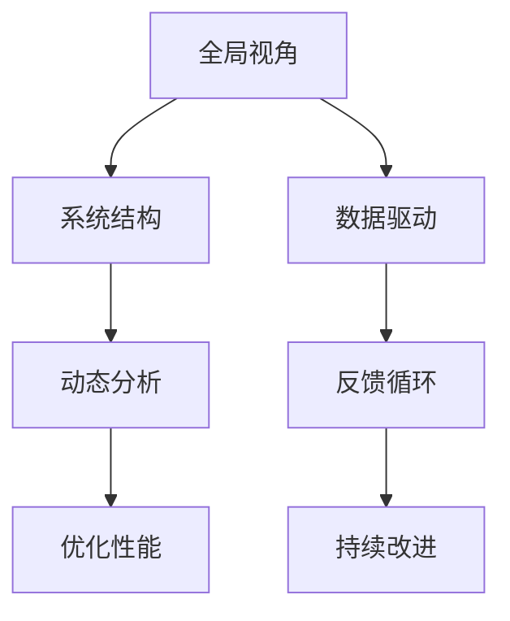

                 

# 管理者如何提升系统思考能力

## 1. 背景介绍

### 1.1 问题由来
在当今复杂多变的商业环境中，管理者需要具备系统思考能力，以应对日益复杂的企业运营挑战。系统思考不仅有助于提高管理决策的准确性和前瞻性，还能增强企业的应变能力和抗风险能力。然而，许多管理者缺乏系统思考能力，导致在处理复杂问题时容易陷入局部视角，难以获得全局最优解。

### 1.2 问题核心关键点
系统思考的核心在于将复杂问题视为一个整体系统，通过多角度、多层次的观察和分析，理解系统内部各要素之间的相互作用和因果关系，进而提出科学合理的解决方案。这种思维方式要求管理者能够：

- 建立全局视角：从宏观角度理解企业内外部环境，识别系统中的关键要素和关键流程。
- 识别系统结构：理解系统内部各要素的相互依赖关系，明确系统中的关键环节和瓶颈点。
- 分析系统动态：理解系统随时间变化的规律，预测未来趋势，制定应对策略。
- 优化系统性能：通过系统分析和持续改进，提升企业运营效率和绩效。

本节将通过系统思考的三大关键要素：全局视角、系统结构和动态分析，全面介绍如何构建和管理企业系统，提升系统思考能力。

## 2. 核心概念与联系

### 2.1 核心概念概述

系统思考的核心理念是将问题视为一个相互关联的整体系统，而非孤立的局部问题。以下列举几个关键概念及其联系：

- **全局视角**：从宏观角度理解企业内外环境，识别关键要素和关键流程。
- **系统结构**：理解系统内各要素的相互依赖关系，明确关键环节和瓶颈点。
- **动态分析**：理解系统随时间变化的规律，预测未来趋势，制定应对策略。
- **优化性能**：通过系统分析和持续改进，提升系统运营效率和绩效。

这些概念通过以下Mermaid流程图进行展示：



以上流程图展示了系统思考的逻辑流程：

1. 从全局视角识别关键要素和流程。
2. 通过系统结构理解各要素间的依赖关系。
3. 进行动态分析预测未来趋势。
4. 优化系统性能以实现全局最优。

同时，数据驱动和反馈循环是系统思考的两个重要支撑点：

- **数据驱动**：通过数据收集和分析，理解系统状态，为全局视角和系统结构提供实证依据。
- **反馈循环**：通过持续监控和改进，不断调整系统参数，实现系统优化和升级。

## 3. 核心算法原理 & 具体操作步骤

### 3.1 算法原理概述

系统思考的核心算法原理是基于系统动力学(System Dynamics)，通过构建系统模型，理解系统内部各要素的相互作用和因果关系，从而预测系统变化和提出优化方案。其核心思想包括：

- **因果环路图**：通过绘制系统中的因果关系图，识别系统中的关键环路和瓶颈点。
- **稳态环路图**：分析系统在不同稳态点上的行为特征，理解系统的稳定性与变化趋势。
- **仿真与预测**：使用仿真软件对系统模型进行仿真，预测系统未来的行为和变化趋势。
- **优化与改进**：通过仿真结果和反馈循环，不断调整系统参数，优化系统性能。

### 3.2 算法步骤详解

以下是系统思考的具体操作步骤：

**Step 1: 数据收集与分析**
- 收集企业内外部环境数据，包括市场趋势、财务数据、运营数据等。
- 分析数据，识别关键要素和关键流程，绘制因果环路图。

**Step 2: 构建系统模型**
- 基于因果环路图，使用仿真软件构建系统模型。
- 确定系统中的稳态点，分析系统在不同稳态点上的行为特征。
- 确定系统中的关键环节和瓶颈点，分析其对系统性能的影响。

**Step 3: 仿真与预测**
- 使用仿真软件对系统模型进行仿真，观察系统在设定条件下的行为和变化趋势。
- 分析仿真结果，识别系统的脆弱点和关键因素。

**Step 4: 优化与改进**
- 根据仿真结果和反馈循环，调整系统参数，优化系统性能。
- 实施改进方案，持续监控系统状态，调整改进措施。

### 3.3 算法优缺点

系统思考的优点在于能够全面、系统地理解问题，通过仿真和预测手段，提供科学合理的解决方案。其缺点包括：

- **数据需求高**：需要大量结构化和非结构化数据，数据质量和数据获取难度较大。
- **模型复杂**：系统模型构建复杂，需要专业知识和高昂的仿真软件成本。
- **实施难度大**：系统改进措施涉及多个部门和流程，实施难度较大。

尽管如此，系统思考仍是大规模系统管理和复杂问题解决的强大工具，值得管理者和IT专业人士深入学习和应用。

### 3.4 算法应用领域

系统思考广泛应用于企业运营管理、项目管理、供应链管理等多个领域，帮助管理者系统化思考问题，提升决策效率和系统优化能力。

- **企业运营管理**：识别企业运营中的关键要素和流程，优化资源配置，提升运营效率。
- **项目管理**：理解项目中的关键环节和瓶颈点，优化项目管理流程，提升项目成功率。
- **供应链管理**：识别供应链中的关键要素和风险点，优化供应链管理流程，提升供应链响应速度和稳定性。

## 4. 数学模型和公式 & 详细讲解

### 4.1 数学模型构建

系统思考的数学模型构建主要涉及系统动力学中的因果环路图和稳态环路图。以下是关键数学模型的构建：

**因果环路图**：
- 因果环路图描述了系统中的因果关系，通常由箭头和节点组成。箭头表示因果关系，节点表示系统要素。
- 常见因果环路图包括控制环路和反馈环路。

**稳态环路图**：
- 稳态环路图分析系统在不同稳态点上的行为特征。稳态点是指系统在无外部扰动的情况下，达到的一种平衡状态。
- 稳态环路图通常由状态变量和速率变量组成。

### 4.2 公式推导过程

以因果环路图和稳态环路图为例，进行数学推导过程：

**因果环路图推导**：
- 控制环路：描述系统中自变量对因变量的影响，公式为 $y = f(x)$。
- 反馈环路：描述系统中的反馈关系，公式为 $y = f(x)$ 和 $x = g(y)$。

**稳态环路图推导**：
- 稳态点推导：假设系统在稳态点上的状态变量为 $x_s$，速率变量为 $\dot{x}_s$，稳态条件为 $f(x_s) = 0$ 和 $\dot{x}_s = 0$。
- 稳态分析：通过解稳态条件，计算系统在不同稳态点上的行为特征。

### 4.3 案例分析与讲解

以企业运营管理中的销售预测为例，进行系统思考的数学模型构建和推导：

**数据收集与分析**：
- 收集历史销售数据，包括销售额、市场规模、促销活动等。
- 分析数据，识别关键要素和关键流程，绘制因果环路图。

**构建系统模型**：
- 基于因果环路图，使用仿真软件构建系统模型。
- 确定系统中的稳态点，分析系统在不同稳态点上的行为特征。

**仿真与预测**：
- 使用仿真软件对系统模型进行仿真，观察系统在设定条件下的行为和变化趋势。
- 分析仿真结果，识别系统的脆弱点和关键因素。

**优化与改进**：
- 根据仿真结果和反馈循环，调整系统参数，优化系统性能。
- 实施改进方案，持续监控系统状态，调整改进措施。

## 5. 项目实践：代码实例和详细解释说明

### 5.1 开发环境搭建

在系统思考的实际应用中，开发环境搭建是关键。以下是使用Python进行系统动力学仿真的环境配置流程：

1. 安装Python：从官网下载并安装Python，Python版本应与所使用的仿真软件兼容。
2. 安装Sympy和Matplotlib：用于数学建模和数据可视化。
3. 安装Vensim或其他仿真软件：Vensim是常用的系统动力学仿真工具，可从官网下载并安装。

完成上述步骤后，即可在Python环境中进行系统思考的开发实践。

### 5.2 源代码详细实现

以下是使用Python和Vensim进行系统思考的代码实现。

```python
import vensim
from sympy import symbols, Eq, solve

# 定义系统变量和速率变量
S = symbols('S')
I = symbols('I')
R = symbols('R')

# 定义系统方程
equation1 = Eq(S, 1000)  # 初始化S
equation2 = Eq(I, 0)     # 初始化I
equation3 = Eq(R, 0)     # 初始化R

# 仿真仿真周期和步长
simulation = vensim仿真()
simulation.addCompartment('S', equation1, simulation.T)
simulation.addCompartment('I', equation2, simulation.T)
simulation.addCompartment('R', equation3, simulation.T)

simulation.setInitialConditions({'S': 1000, 'I': 0, 'R': 0})
simulation.setSimulationTime(365.0)
simulation.setSolutionMethod('ode')
simulation.setIntegrationMethod('rk45')

# 运行仿真并输出结果
results = simulation.run()
print(results.get('S', 'I', 'R'))

# 绘制仿真结果图
import matplotlib.pyplot as plt
fig, ax = plt.subplots(figsize=(10, 6))
ax.plot(results.get('S'), label='S')
ax.plot(results.get('I'), label='I')
ax.plot(results.get('R'), label='R')
ax.set_xlabel('Time (Days)')
ax.set_ylabel('Population')
ax.set_title('System Dynamics Simulation')
ax.legend()
plt.show()
```

以上代码实现了使用Vensim进行系统思考的基本流程，包括定义系统变量和方程，仿真系统行为，输出仿真结果和绘制仿真图。

### 5.3 代码解读与分析

**代码解析**：
- 首先定义系统变量 `S`、`I` 和 `R`，表示健康人口、感染人口和康复人口。
- 定义系统方程，表示健康人口初始化、感染人口初始化和康复人口初始化。
- 使用Vensim创建仿真对象，定义系统变量和方程，并设置初始条件和仿真参数。
- 运行仿真并输出结果，绘制仿真图。

**代码分析**：
- 代码展示了使用Python和Vensim进行系统思考的基本流程，包括数据建模、仿真运行和结果分析。
- 通过可视化工具Matplotlib，能够直观展示系统行为和变化趋势，便于理解和分析仿真结果。
- 使用Vensim进行系统动力学仿真，能够有效处理复杂系统问题，提供科学合理的解决方案。

## 6. 实际应用场景

### 6.1 企业管理

系统思考在企业管理中广泛应用于运营管理、供应链管理、战略规划等多个领域。例如，某公司面临订单交货时间延迟的问题，通过系统思考识别关键要素和关键流程，构建系统模型，预测供应链中的薄弱环节，并提出优化措施。具体流程包括：

1. **数据收集与分析**：收集订单交货时间、供应商交货时间、生产时间等数据，识别关键要素和关键流程。
2. **构建系统模型**：基于因果环路图，使用Vensim构建供应链系统模型。
3. **仿真与预测**：使用Vensim进行仿真，观察供应链在不同条件下的行为和变化趋势。
4. **优化与改进**：根据仿真结果和反馈循环，调整供应链参数，优化供应链性能。

### 6.2 项目风险管理

在系统思考中，项目风险管理也是重要应用场景之一。通过系统思考，识别项目中的关键风险点和瓶颈环节，预测风险发生的可能性，并提出应对策略。具体流程包括：

1. **数据收集与分析**：收集项目进度、资源配置、风险事件等数据，识别关键风险点和关键流程。
2. **构建系统模型**：基于因果环路图，使用Vensim构建项目风险管理系统模型。
3. **仿真与预测**：使用Vensim进行仿真，观察项目在不同条件下的风险变化趋势。
4. **优化与改进**：根据仿真结果和反馈循环，调整项目参数，优化项目风险管理。

### 6.3 战略规划

系统思考在战略规划中也具有重要应用。通过系统思考，理解企业内外部环境，识别关键要素和关键流程，预测未来趋势，并制定战略规划。具体流程包括：

1. **数据收集与分析**：收集市场数据、竞争对手数据、内部运营数据等，识别关键要素和关键流程。
2. **构建系统模型**：基于因果环路图，使用Vensim构建企业战略管理系统模型。
3. **仿真与预测**：使用Vensim进行仿真，观察企业在不同条件下的发展趋势。
4. **优化与改进**：根据仿真结果和反馈循环，调整企业战略参数，优化企业发展路径。

## 7. 工具和资源推荐

### 7.1 学习资源推荐

系统思考是一门涉及多学科知识的综合学科，以下推荐一些优质的学习资源：

1. **《系统动力学与组织管理》**：该书系统介绍了系统动力学原理和应用，是学习系统思考的经典教材。
2. **System Dynamics for Management**：斯坦福大学开设的在线课程，介绍了系统思考的基本概念和应用方法。
3. **《系统思考的力量》**：该书深入浅出地介绍了系统思考的核心理念和实践方法，适合入门学习和应用实践。
4. **Vensim官方文档**：Vensim的官方文档提供了丰富的系统建模和仿真教程，适合系统思考的实践应用。

通过对这些资源的学习实践，相信你一定能够系统掌握系统思考的理论基础和实践技巧，并用于解决实际的复杂问题。

### 7.2 开发工具推荐

高效的开发离不开优秀的工具支持。以下是几款用于系统动力学仿真的常用工具：

1. **Vensim**：是一款广泛使用的系统动力学仿真工具，支持复杂系统建模和仿真。
2. **AnyLogic**：是一款集成了系统动力学、离散事件仿真、系统建模等功能的仿真工具，适用于复杂系统的建模和仿真。
3. **Python + SymPy**：利用Python和SymPy库，可以方便地进行系统建模和仿真，适用于中小规模系统的建模和分析。

合理利用这些工具，可以显著提升系统思考的开发效率，加快创新迭代的步伐。

### 7.3 相关论文推荐

系统思考的学术研究近年来取得较多成果，以下几篇经典论文值得推荐：

1. **"Principles of System Dynamics"**：由Donella Meadows等人编写的系统动力学经典教材，介绍了系统思考的基本原理和应用方法。
2. **"A General Systems Theory of Risk and Hazard"**：作者Hans Joachim Wagner介绍了系统思考在风险管理中的应用。
3. **"System Dynamics for Social Innovation"**：作者Mark Abrahams等人介绍了系统思考在社会创新中的应用。

这些论文代表了大规模系统管理和复杂问题解决的最新研究成果，深入探讨了系统思考的理论基础和实践应用。

## 8. 总结：未来发展趋势与挑战

### 8.1 研究成果总结

本文对系统思考的基本概念和操作流程进行了全面系统的介绍。首先阐述了系统思考的背景和意义，明确了系统思考在解决复杂问题中的核心价值。其次，从全局视角、系统结构和动态分析三个关键要素，详细讲解了系统思考的实施步骤和关键方法。同时，本文还通过案例分析和代码实例，深入解析了系统思考的实际应用，并推荐了学习资源和开发工具。

通过本文的系统梳理，可以看到，系统思考不仅是一种管理思维方法，更是一种系统化的分析和优化手段，广泛应用于企业运营、项目管理和战略规划等多个领域。掌握系统思考方法，能够帮助管理者系统化思考问题，提高决策效率和系统优化能力。

### 8.2 未来发展趋势

展望未来，系统思考的发展趋势如下：

1. **智能化与自动化**：系统思考将越来越多地结合人工智能和大数据技术，提高系统建模和仿真效率。
2. **多学科融合**：系统思考将更多地融合管理学、经济学、社会学等多学科知识，提供更全面、系统的解决方案。
3. **实时化与动态化**：系统思考将更多地关注实时数据和动态变化，提供更灵活、动态的系统管理方法。
4. **透明化与可视化**：系统思考将更多地关注系统透明化和可视化，提高管理决策的可视性和可解释性。

### 8.3 面临的挑战

尽管系统思考在复杂问题解决中具有重要应用，但其发展仍面临诸多挑战：

1. **数据质量与获取难度**：系统思考需要大量高质量数据，数据获取和处理难度较大。
2. **模型构建复杂**：系统建模需要专业知识，模型构建复杂且成本高昂。
3. **实施难度大**：系统改进措施涉及多个部门和流程，实施难度较大。

### 8.4 研究展望

未来，系统思考的研究方向应包括：

1. **数据驱动与实时数据**：如何利用大数据技术提高系统建模和仿真效率，更好地捕捉实时数据。
2. **多学科融合与跨学科研究**：系统思考如何与其他学科知识融合，提供更全面、系统的解决方案。
3. **透明化与可视化**：如何提高系统透明化和可视化，提高管理决策的可视性和可解释性。

## 9. 附录：常见问题与解答

**Q1：系统思考是否适用于所有复杂问题？**

A: 系统思考适用于大多数复杂问题，但需要根据问题特点和数据情况进行灵活调整。对于数据规模较小、问题结构简单的问题，可能不适用于系统思考。

**Q2：系统思考与数据科学有何区别？**

A: 系统思考与数据科学有共同之处，但也存在差异。数据科学注重数据处理和模型训练，而系统思考更注重系统结构、因果关系和动态分析。系统思考在理解系统复杂性和建立系统模型方面更具优势。

**Q3：系统思考在企业中的应用有哪些？**

A: 系统思考在企业管理中的应用包括运营管理、供应链管理、战略规划等多个领域。通过系统思考，可以全面、系统地理解企业运营问题，提供科学合理的解决方案。

**Q4：系统思考与系统工程有何区别？**

A: 系统思考与系统工程有共同之处，但也存在差异。系统工程强调系统设计、实施和优化，而系统思考更注重系统结构、因果关系和动态分析。系统思考在理解系统复杂性和建立系统模型方面更具优势。

**Q5：系统思考在实际应用中应注意哪些问题？**

A: 系统思考在实际应用中应注意以下几个问题：
1. 数据质量与获取难度
2. 模型构建复杂
3. 实施难度大

合理应对这些挑战，可以更好地实现系统思考在实际中的应用价值。

---

作者：禅与计算机程序设计艺术 / Zen and the Art of Computer Programming

