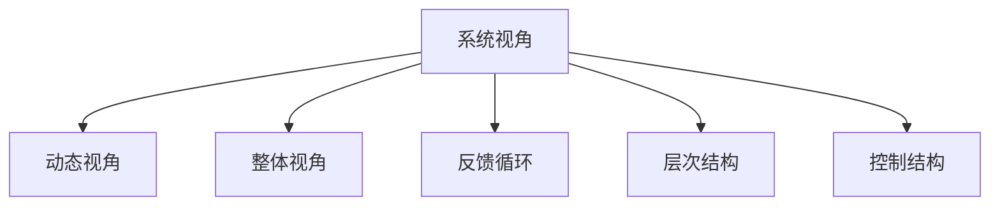
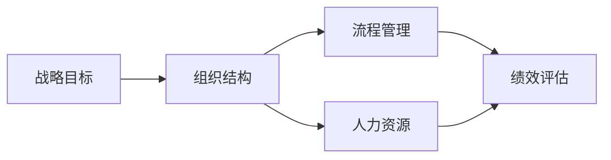

                 

# 系统思考的威力:化繁为简,抓本质

> 关键词：系统思考,化繁为简,系统设计,系统工程,复杂系统

## 1. 背景介绍

### 1.1 问题由来
在当今信息爆炸、技术迭代加速的时代，系统设计和系统工程的重要性日益凸显。面对复杂多变的外部环境和内部需求，如何有效地设计和实现一个高效、可扩展、易于维护的系统，成为了许多企业和组织关注的焦点。系统思考（Systems Thinking）作为一种从整体上理解和解决复杂问题的思维方式，提供了独特的视角和方法论。

系统思考的核心在于识别系统中各个元素之间的相互作用，从全局出发，找到系统行为的根本原因，从而设计出既符合需求又可持续发展的系统。这种思维方式在软件开发、系统工程、复杂系统管理等领域具有广泛的应用价值。

### 1.2 问题核心关键点
系统思考的核心理念包括系统视角、动态视角和整体视角。它强调从整体出发，考虑系统中的各个元素之间相互影响和互动，理解系统行为的动态变化规律，从而找到系统的根本原因，实现对系统的有效管理和优化。

系统思考方法在以下几个方面具有重要价值：
- 帮助识别系统的根本问题。系统思考引导我们从表层问题深入到系统的底层结构，找到问题的根源。
- 提高系统的可扩展性和灵活性。通过理解系统的内在规律，可以更好地设计系统的结构，使其具有更强的适应性和扩展性。
- 提升团队协作效率。系统思考强调全局视角和整体协同，有助于团队成员之间建立更好的沟通和协作。
- 促进创新思维。系统思考鼓励从整体和长远角度出发，推动思维创新和系统优化。

## 2. 核心概念与联系

### 2.1 核心概念概述

为更好地理解系统思考方法，本节将介绍几个密切相关的核心概念：

- 系统视角(System Perspective)：系统思考的核心，强调从整体出发，理解系统各元素之间的相互关系和相互作用。
- 动态视角(Dynamic Perspective)：系统行为不是静态的，而是随时间变化的。系统思考关注系统的演化过程，理解系统的动态特性。
- 整体视角(Holistic Perspective)：系统思考强调全局视角，关注系统的整体行为和系统目标的实现，而不仅仅是局部或单一元素的表现。
- 反馈循环(Feedback Loop)：系统中的各个元素之间存在相互作用，形成反馈回路，影响系统的稳定性和行为。
- 层次结构(Hierarchical Structure)：系统中的元素可以按照层次结构进行组织，不同层次之间存在相互作用和影响。
- 控制结构(Control Structure)：系统中的控制机制和调节机制，用于维持系统的稳定性和目标实现。

这些核心概念之间的逻辑关系可以通过以下Mermaid流程图来展示：



这个流程图展示在系统思考中的几个关键概念及其之间的关系：

1. 系统视角强调从整体出发，考虑系统的各元素之间的相互关系和相互作用。
2. 动态视角关注系统的演化过程，理解系统的动态特性。
3. 整体视角强调全局视角，关注系统的整体行为和系统目标的实现。
4. 反馈循环描述系统中的各个元素之间存在相互作用，形成反馈回路，影响系统的稳定性和行为。
5. 层次结构描述系统中的元素可以按照层次结构进行组织，不同层次之间存在相互作用和影响。
6. 控制结构描述系统中的控制机制和调节机制，用于维持系统的稳定性和目标实现。

这些概念共同构成了系统思考的方法论基础，使其能够在各种系统设计和工程应用中发挥重要作用。

## 3. 核心算法原理 & 具体操作步骤

### 3.1 算法原理概述

系统思考的原理和方法可以简要归纳为以下几个步骤：

1. **建立系统模型**：识别系统中的主要元素和元素之间的相互作用，建立系统的层次结构和控制结构，形成一个系统的概念模型。
2. **分析系统行为**：通过系统模型，分析系统的动态行为和反馈回路，理解系统的演化过程。
3. **识别系统问题**：从系统模型出发，识别系统的根本问题，找到问题的根源。
4. **设计解决方案**：根据系统问题，设计系统的优化方案，调整系统结构和控制结构，改善系统的性能。
5. **实施和监控**：将优化方案转化为具体的实现，实施改进措施，监控系统行为，确保改进效果。

系统思考的整个过程是一个循环迭代的过程，通过不断地建立模型、分析行为、识别问题和设计方案，逐步优化系统，实现系统的可持续发展和优化。

### 3.2 算法步骤详解

系统思考的实践步骤如下：

**Step 1: 建立系统模型**
- 识别系统的所有元素，包括物理元素、组织元素和环境元素。
- 确定元素之间的关系，包括直接关系和间接关系，形成系统的层次结构和控制结构。
- 使用系统建模工具（如SysML、UML等）建立系统的概念模型，清晰表达系统的结构和行为。

**Step 2: 分析系统行为**
- 使用系统仿真工具，模拟系统的动态行为，理解系统的演化过程。
- 通过系统仿真，识别系统的关键行为和反馈回路，理解系统的稳定性和行为规律。
- 分析系统行为的变化趋势，预测系统的未来行为和可能的异常情况。

**Step 3: 识别系统问题**
- 从系统模型出发，识别系统的关键问题和影响因素。
- 分析问题的原因和根源，找到系统问题背后的系统结构问题。
- 评估问题的严重性和影响范围，确定优先级和改进方向。

**Step 4: 设计解决方案**
- 根据系统问题的分析结果，设计系统的优化方案，调整系统结构和控制结构。
- 使用系统设计和仿真工具，评估优化方案的效果和可行性。
- 设计具体的实施计划，明确改进措施和责任分工。

**Step 5: 实施和监控**
- 实施优化方案，进行系统改进。
- 监控系统的行为和性能，评估改进效果。
- 根据监控结果，调整优化方案，持续改进系统。

### 3.3 算法优缺点

系统思考方法具有以下优点：
1. 全局视角。系统思考从整体出发，考虑系统各元素之间的相互作用，避免了局部优化的片面性。
2. 动态分析。系统思考关注系统的演化过程，理解系统的动态特性，能够更好地预测和应对变化。
3. 问题根本原因识别。系统思考引导我们从表层问题深入到系统的底层结构，找到问题的根源。
4. 系统协同设计。系统思考强调全局视角和整体协同，有助于团队成员之间建立更好的沟通和协作。
5. 持续改进。系统思考的循环迭代过程，能够持续优化系统，提升系统的适应性和稳定性。

同时，该方法也存在一些局限性：
1. 模型复杂度高。系统思考需要建立复杂多层次的系统模型，对于大型复杂系统，建模工作量大。
2. 理论要求高。系统思考需要系统建模和系统仿真等理论基础，对于实践者的理论水平要求较高。
3. 数据需求高。系统思考需要大量的数据和信息，用于建立模型和分析行为。
4. 实施难度大。系统改进方案的实施需要跨部门和跨职能团队的协调合作，实施难度较大。
5. 效果评估难。系统改进效果的评估需要综合考虑多方面因素，难以进行准确评估。

尽管存在这些局限性，但就目前而言，系统思考仍是一种非常有效的系统设计和优化方法，广泛应用于软件开发、系统工程、复杂系统管理等领域。

### 3.4 算法应用领域

系统思考在多个领域得到了广泛的应用，具体包括：

- 软件开发：系统思考用于理解软件系统的结构和行为，识别系统问题，设计软件架构，优化软件系统。
- 系统工程：系统思考在复杂系统工程中，用于设计和管理系统的整体结构和行为，确保系统目标的实现。
- 复杂系统管理：系统思考用于理解和优化复杂系统的行为和性能，提升系统的适应性和稳定性。
- 项目管理：系统思考用于项目管理和风险管理，识别项目关键问题和影响因素，设计优化方案。
- 组织变革：系统思考用于组织变革和创新管理，理解组织结构和行为，促进组织协同和创新。

## 4. 数学模型和公式 & 详细讲解  
### 4.1 数学模型构建

系统思考的数学模型可以从不同的角度进行构建，常用的数学模型包括因果关系图(Cause-Effect Diagram)、系统动力学模型(System Dynamics Model)和系统仿真模型(System Simulation Model)。

因果关系图用于描述系统中各元素之间的因果关系，通常使用箭头表示因果链。

系统动力学模型用于描述系统的动态行为和反馈回路，通常使用状态变量、速率变量和控制变量表示系统状态和行为。

系统仿真模型用于模拟系统的动态行为，通常使用计算机仿真工具进行实现。

系统思考的数学模型需要结合具体问题的特点进行构建，通常包括以下几个关键步骤：

1. 识别系统元素和关系：确定系统中的所有元素和元素之间的关系，包括直接关系和间接关系。
2. 建立系统层次结构：将系统元素按照层次结构进行组织，形成系统的层次结构。
3. 描述系统控制结构：定义系统的控制机制和调节机制，形成系统的控制结构。
4. 确定系统目标和指标：明确系统的目标和评估指标，确定系统的优化方向。

### 4.2 公式推导过程

以下我们以因果关系图为例，推导因果关系图的基本构建步骤。

因果关系图的构建步骤如下：
1. 确定系统的关键元素：识别系统中的关键元素和子系统。
2. 确定元素之间的关系：确定元素之间的因果关系，包括直接关系和间接关系。
3. 绘制因果关系图：使用箭头表示因果关系，形成系统的因果关系图。

例如，对于一个简单的组织系统，因果关系图可以如下构建：



在这个因果关系图中，战略目标(A)通过组织结构(B)、流程管理(C)和人力资源(D)影响绩效评估(E)。这种因果关系图清晰地表达了系统的结构和行为，有助于识别系统的关键问题和优化方案。

### 4.3 案例分析与讲解

**案例1：软件系统优化**
一个软件系统包括前端、后端、数据库等多个子系统，各子系统之间存在相互作用和依赖关系。通过系统思考的方法，识别系统中的关键元素和关系，建立系统的层次结构和控制结构，设计优化方案，最终实现了系统的整体优化。

**案例2：复杂项目管理**
一个大型项目涉及多个团队和职能部门，通过系统思考的方法，识别项目的关键问题和影响因素，设计项目管理和风险管理方案，最终实现了项目的成功交付和优化。

**案例3：组织变革**
一个企业面临内部变革挑战，通过系统思考的方法，识别组织中的关键问题和结构性问题，设计组织变革方案，最终实现了组织的协同和创新。

## 5. 项目实践：代码实例和详细解释说明
### 5.1 开发环境搭建

在进行系统思考的实践前，我们需要准备好开发环境。以下是使用Python进行Sympy库开发的环境配置流程：

1. 安装Anaconda：从官网下载并安装Anaconda，用于创建独立的Python环境。

2. 创建并激活虚拟环境：
```bash
conda create -n sys-thinking python=3.8 
conda activate sys-thinking
```

3. 安装Sympy：使用pip安装Sympy库，用于建立和分析系统的因果关系图。
```bash
pip install sympy
```

4. 安装相关工具包：
```bash
pip install networkx matplotlib tqdm jupyter notebook ipython
```

完成上述步骤后，即可在`sys-thinking`环境中开始系统思考的实践。

### 5.2 源代码详细实现

下面我们以因果关系图为例，给出使用Sympy库建立和分析系统因果关系图的Python代码实现。

首先，定义因果关系图的元素和关系：

```python
from sympy import Symbol, Eq, solve, init_printing

init_printing()

# 定义系统元素
strategy = Symbol('strategy')
organization = Symbol('organization')
process = Symbol('process')
resource = Symbol('resource')
performance = Symbol('performance')

# 定义元素之间的关系
strategy_to_organization = Eq(strategy, organization)
organization_to_process = Eq(organization, process)
organization_to_resource = Eq(organization, resource)
process_to_performance = Eq(process, performance)
resource_to_performance = Eq(resource, performance)
```

然后，绘制因果关系图：

```python
import networkx as nx
import matplotlib.pyplot as plt

# 创建因果关系图
graph = nx.DiGraph()
graph.add_node(strategy)
graph.add_node(organization)
graph.add_node(process)
graph.add_node(resource)
graph.add_node(performance)

# 添加关系边
graph.add_edge(strategy, organization)
graph.add_edge(organization, process)
graph.add_edge(organization, resource)
graph.add_edge(process, performance)
graph.add_edge(resource, performance)

# 绘制因果关系图
nx.draw(graph, with_labels=True, node_size=500, node_color='skyblue', font_size=12)
plt.show()
```

最后，进行因果关系图的分析和优化：

```python
# 定义优化目标
optimization_goal = Symbol('optimization_goal')

# 定义优化方程
optimization_eq = Eq(strategy, optimization_goal)

# 解优化方程
solution = solve(optimization_eq, strategy)

# 输出优化结果
print(solution)
```

以上就是使用Sympy库建立和分析因果关系图的完整代码实现。可以看到，Sympy库的强大符号计算能力，使得系统思考的建模和优化变得简洁高效。

### 5.3 代码解读与分析

让我们再详细解读一下关键代码的实现细节：

**定义系统元素和关系**：
- `Symbol`函数用于定义系统的元素和关系，每个元素和关系都是一个符号变量。
- `Eq`函数用于定义元素之间的关系，使用等式表示因果关系。

**绘制因果关系图**：
- `networkx.DiGraph`用于创建有向图，表示系统的因果关系。
- `add_node`方法用于添加系统元素节点，`add_edge`方法用于添加关系边。
- `nx.draw`用于绘制因果关系图，通过`with_labels`参数添加节点标签，`node_size`参数设置节点大小，`node_color`参数设置节点颜色，`font_size`参数设置节点标签字体大小。

**进行因果关系图的分析和优化**：
- `Symbol`函数用于定义优化目标，每个优化目标也是一个符号变量。
- `Eq`函数用于定义优化方程，使用等式表示优化目标与系统元素之间的关系。
- `solve`函数用于求解优化方程，得到优化解。
- `print`函数用于输出优化结果。

可以看到，Sympy库提供了强大的符号计算能力，使得系统思考的建模和优化变得简单易行。通过符号表示和求解，可以清晰表达系统的结构和行为，进行系统的分析和优化。

当然，工业级的系统思考实践还需要考虑更多因素，如模型验证、参数优化、团队协作等。但核心的系统思考方法基本与此类似。

## 6. 实际应用场景
### 6.1 软件开发

系统思考在软件开发中的应用，主要体现在以下几个方面：

**系统架构设计**：通过系统思考的方法，识别系统的关键元素和关系，设计系统的层次结构和控制结构，建立系统的概念模型。这有助于理解和设计软件的整体架构，提升系统的可扩展性和稳定性。

**需求分析和设计**：通过系统思考的方法，识别系统的关键问题和影响因素，设计系统的优化方案，调整系统结构和控制结构。这有助于更好地理解用户需求和业务场景，设计出符合需求的软件系统。

**问题诊断和解决**：通过系统思考的方法，识别系统的关键问题和影响因素，设计问题的优化方案，调整系统结构和控制结构。这有助于快速定位问题，设计有效的解决方案。

### 6.2 系统工程

系统思考在系统工程中的应用，主要体现在以下几个方面：

**系统设计和管理**：通过系统思考的方法，设计和管理系统的整体结构和行为，确保系统目标的实现。这有助于系统工程的规划和实施，提升系统的效率和质量。

**系统优化和改进**：通过系统思考的方法，识别系统的关键问题和影响因素，设计系统的优化方案，调整系统结构和控制结构。这有助于系统工程的持续改进和优化，提升系统的稳定性和性能。

**系统风险管理**：通过系统思考的方法，识别系统的关键问题和影响因素，设计系统的优化方案，调整系统结构和控制结构。这有助于系统工程的的风险管理和应对，提升系统的鲁棒性和抗风险能力。

### 6.3 复杂系统管理

系统思考在复杂系统管理中的应用，主要体现在以下几个方面：

**系统分析和优化**：通过系统思考的方法，分析和优化复杂系统的行为和性能，提升系统的适应性和稳定性。这有助于复杂系统的管理和优化，提升系统的效率和质量。

**系统协同和创新**：通过系统思考的方法，识别系统的关键问题和影响因素，设计系统的优化方案，调整系统结构和控制结构。这有助于复杂系统的协同和创新，提升系统的创造力和竞争力。

**系统变革和转型**：通过系统思考的方法，识别系统的关键问题和结构性问题，设计系统的优化方案，调整系统结构和控制结构。这有助于复杂系统的变革和转型，提升系统的灵活性和适应性。

### 6.4 未来应用展望

随着系统思考方法的不断发展和应用，其在未来将有更广泛的应用前景：

**智能系统设计**：通过系统思考的方法，设计和优化智能系统，提升系统的智能化和自动化水平。这有助于智能系统在各个领域的应用，提升系统的效率和质量。

**可持续系统设计**：通过系统思考的方法，设计和优化可持续系统，提升系统的环境友好和资源效率。这有助于可持续发展的实现，提升系统的环境和社会效益。

**创新系统设计**：通过系统思考的方法，设计和优化创新系统，提升系统的创新能力和竞争优势。这有助于创新系统的构建和应用，提升系统的创造力和竞争力。

**复杂系统仿真**：通过系统思考的方法，设计和优化复杂系统的仿真模型，提升系统的仿真能力和预测能力。这有助于复杂系统的分析和优化，提升系统的决策和控制能力。

**多学科融合**：通过系统思考的方法，设计和优化多学科融合的系统，提升系统的综合能力和跨学科协同。这有助于跨学科的研究和应用，提升系统的创新和应用水平。

## 7. 工具和资源推荐
### 7.1 学习资源推荐

为了帮助开发者系统掌握系统思考的理论基础和实践技巧，这里推荐一些优质的学习资源：

1. 《系统思考:理解复杂世界的科学》：这是一本经典的系统思考著作，详细介绍了系统思考的基本概念、方法和应用。
2. 《系统动力学导论》：这是一本关于系统动力学的基础教材，介绍了系统动力学的基本原理和应用方法。
3. 《复杂系统建模与仿真》：这是一本关于复杂系统建模和仿真的经典教材，介绍了复杂系统建模和仿真的方法和工具。
4. 《网络分析与复杂系统》：这是一本关于网络分析和复杂系统的教材，介绍了网络分析和复杂系统的方法和应用。
5. 《系统思考实践指南》：这是一本关于系统思考实践的指南，介绍了系统思考的实践方法和案例。

通过对这些资源的学习实践，相信你一定能够快速掌握系统思考的精髓，并用于解决实际的系统设计和工程问题。

### 7.2 开发工具推荐

高效的开发离不开优秀的工具支持。以下是几款用于系统思考开发的常用工具：

1. Sympy库：用于符号计算和方程求解，支持复杂的数学建模和优化。
2. NetworkX库：用于创建和分析网络图，支持复杂系统建模和仿真。
3. Matplotlib库：用于绘制图形和可视化，支持复杂系统可视化和分析。
4. Jupyter Notebook：用于交互式编程和数据可视化，支持复杂系统设计和优化。
5. Simulink：用于系统建模和仿真，支持复杂系统分析和优化。

合理利用这些工具，可以显著提升系统思考的开发效率，加快创新迭代的步伐。

### 7.3 相关论文推荐

系统思考的研究源于学界的持续研究。以下是几篇奠基性的相关论文，推荐阅读：

1. "A framework for systems thinking: Toward a unified systems perspective"（系统思考框架：走向统一的系统视角）：这是一篇关于系统思考的综述论文，详细介绍了系统思考的基本概念和方法。
2. "Systems Thinking: Concepts, Processes, Methods and Tools"（系统思考：概念、过程、方法和工具）：这是一篇关于系统思考的综述论文，介绍了系统思考的基本概念、方法和工具。
3. "Theory and practice of systems thinking"（系统思考的理论和实践）：这是一篇关于系统思考的理论和实践论文，介绍了系统思考的理论基础和实践方法。
4. "Systems Thinking for the Future"（面向未来的系统思考）：这是一篇关于系统思考的未来发展论文，介绍了系统思考的未来发展方向和应用前景。
5. "Complexity in systems thinking: A new perspective"（系统思考中的复杂性：一种新视角）：这是一篇关于系统思考中的复杂性的论文，介绍了系统思考中的复杂性和应对方法。

这些论文代表了大系统思考的发展脉络。通过学习这些前沿成果，可以帮助研究者把握学科前进方向，激发更多的创新灵感。

## 8. 总结：未来发展趋势与挑战

### 8.1 总结

本文对系统思考方法进行了全面系统的介绍。首先阐述了系统思考的研究背景和意义，明确了系统思考在系统设计和工程中的重要价值。其次，从原理到实践，详细讲解了系统思考的数学模型和操作步骤，给出了系统思考任务开发的完整代码实例。同时，本文还广泛探讨了系统思考方法在软件开发、系统工程、复杂系统管理等领域的应用前景，展示了系统思考范式的巨大潜力。此外，本文精选了系统思考技术的各类学习资源，力求为读者提供全方位的技术指引。

通过本文的系统梳理，可以看到，系统思考方法正在成为系统设计和工程的重要范式，极大地拓展了系统设计和工程的应用边界，催生了更多的落地场景。受益于系统思考方法的不断发展和应用，系统设计和工程将变得更加高效、智能和可持续。

### 8.2 未来发展趋势

展望未来，系统思考方法将呈现以下几个发展趋势：

1. 系统思考与大数据和人工智能的融合。系统思考将更多地与大数据和人工智能技术结合，提升系统的数据处理和分析能力，实现系统的智能化和自动化。
2. 系统思考与复杂网络理论的结合。系统思考将更多地与复杂网络理论结合，提升系统的网络分析和优化能力，实现系统的协同和创新。
3. 系统思考与环境可持续发展的融合。系统思考将更多地与环境可持续发展的理念结合，提升系统的环境友好和资源效率，实现系统的可持续发展。
4. 系统思考与跨学科融合。系统思考将更多地与跨学科的研究和应用结合，提升系统的综合能力和跨学科协同，实现系统的多学科融合。
5. 系统思考与多模态融合。系统思考将更多地与多模态的数据和信息结合，提升系统的多模态分析和优化能力，实现系统的全维度建模。
6. 系统思考与自适应系统的结合。系统思考将更多地与自适应系统的设计和优化结合，提升系统的自适应能力和环境响应能力，实现系统的智能化和自动化。

以上趋势凸显了系统思考方法的广阔前景。这些方向的探索发展，必将进一步提升系统设计和工程的效果和应用范围，为人类社会的发展和进步带来新的动力。

### 8.3 面临的挑战

尽管系统思考方法已经取得了瞩目成就，但在迈向更加智能化、普适化应用的过程中，它仍面临着诸多挑战：

1. 模型复杂度高。系统思考需要建立复杂多层次的系统模型，对于大型复杂系统，建模工作量大，需要高水平的技术和经验。
2. 理论要求高。系统思考需要系统建模和系统仿真等理论基础，对于实践者的理论水平要求较高，需要跨学科的知识背景。
3. 数据需求高。系统思考需要大量的数据和信息，用于建立模型和分析行为，需要跨领域的数据整合能力。
4. 实施难度大。系统改进方案的实施需要跨部门和跨职能团队的协调合作，实施难度较大，需要高效的项目管理和协作机制。
5. 效果评估难。系统改进效果的评估需要综合考虑多方面因素，难以进行准确评估，需要高效的效果评估方法。
6. 优化方向不确定。系统思考的优化方向往往受限于现有技术和经验，需要不断探索和创新。

尽管存在这些挑战，但系统思考方法依然具有广阔的应用前景，其在系统设计和工程中的重要地位不可动摇。系统思考的不断发展和完善，将为系统设计和工程带来新的突破，推动人类社会的发展和进步。

### 8.4 研究展望

面对系统思考面临的种种挑战，未来的研究需要在以下几个方面寻求新的突破：

1. 探索系统建模的新方法和工具。开发更加高效、灵活的系统建模工具，提升系统建模的效率和质量。
2. 引入人工智能和大数据技术。将人工智能和大数据技术引入系统思考的建模和优化过程，提升系统的智能化和自动化水平。
3. 研究系统仿真和验证方法。开发高效的系统仿真和验证方法，提升系统的仿真能力和优化效果。
4. 引入环境可持续发展的理念。将环境可持续发展的理念引入系统思考，提升系统的环境友好和资源效率。
5. 研究跨学科的融合方法。研究跨学科的融合方法，提升系统的综合能力和跨学科协同。
6. 研究多模态数据融合方法。研究多模态数据融合方法，提升系统的多模态分析和优化能力。
7. 研究自适应系统的设计和优化方法。研究自适应系统的设计和优化方法，提升系统的自适应能力和环境响应能力。

这些研究方向将推动系统思考方法向更加智能化、普适化和可持续化的方向发展，为人类社会的进步和创新带来新的动力。

## 9. 附录：常见问题与解答

**Q1：系统思考如何应用于软件开发？**

A: 系统思考在软件开发中的应用主要体现在以下几个方面：
1. 系统架构设计：通过系统思考的方法，识别系统的关键元素和关系，设计系统的层次结构和控制结构，建立系统的概念模型。
2. 需求分析和设计：通过系统思考的方法，识别系统的关键问题和影响因素，设计系统的优化方案，调整系统结构和控制结构。
3. 问题诊断和解决：通过系统思考的方法，识别系统的关键问题和影响因素，设计问题的优化方案，调整系统结构和控制结构。

**Q2：系统思考的建模和分析工具有哪些？**

A: 系统思考的建模和分析工具包括：
1. Sympy库：用于符号计算和方程求解，支持复杂的数学建模和优化。
2. NetworkX库：用于创建和分析网络图，支持复杂系统建模和仿真。
3. Matplotlib库：用于绘制图形和可视化，支持复杂系统可视化和分析。
4. Jupyter Notebook：用于交互式编程和数据可视化，支持复杂系统设计和优化。
5. Simulink：用于系统建模和仿真，支持复杂系统分析和优化。

**Q3：系统思考的实施难度如何？**

A: 系统思考的实施难度主要在于：
1. 跨部门和跨职能团队的协调合作，需要高效的项目管理和协作机制。
2. 系统建模和系统仿真等技术要求较高，需要高水平的技术和经验。
3. 数据和信息的整合难度较大，需要跨领域的数据整合能力。

尽管实施难度较大，但通过合理的项目管理、跨学科协作和技术支持，系统思考的实施效果可以显著提升。

**Q4：系统思考与人工智能的融合方向是什么？**

A: 系统思考与人工智能的融合方向主要包括以下几个方面：
1. 将人工智能技术引入系统建模和优化，提升系统的智能化和自动化水平。
2. 将人工智能技术引入系统仿真和验证，提升系统的仿真能力和优化效果。
3. 将人工智能技术引入问题诊断和解决，提升系统的诊断能力和优化效果。

通过与人工智能技术的结合，系统思考的建模和优化将更加高效、智能和自动化，提升系统的整体效果和应用价值。

**Q5：系统思考的未来发展方向是什么？**

A: 系统思考的未来发展方向主要包括以下几个方面：
1. 系统思考与大数据和人工智能的融合，提升系统的数据处理和分析能力，实现系统的智能化和自动化。
2. 系统思考与复杂网络理论的结合，提升系统的网络分析和优化能力，实现系统的协同和创新。
3. 系统思考与环境可持续发展的融合，提升系统的环境友好和资源效率，实现系统的可持续发展。
4. 系统思考与跨学科融合，提升系统的综合能力和跨学科协同，实现系统的多学科融合。
5. 系统思考与多模态融合，提升系统的多模态分析和优化能力，实现系统的全维度建模。
6. 系统思考与自适应系统的结合，提升系统的自适应能力和环境响应能力，实现系统的智能化和自动化。

通过不断探索和创新，系统思考将向更加智能化、普适化和可持续化的方向发展，推动人类社会的发展和进步。

---

作者：禅与计算机程序设计艺术 / Zen and the Art of Computer Programming

