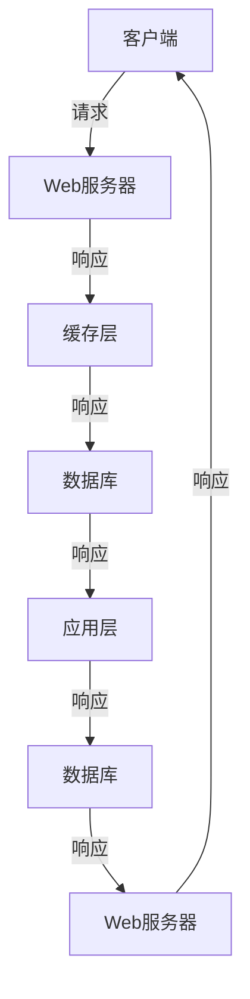

                 

# 系统瓶颈分析与优化案例

## 1. 背景介绍

在计算机系统中，性能瓶颈问题无处不在，它会影响系统的整体性能，导致资源浪费、响应延迟、用户体验不佳等问题。无论是企业级应用还是消费级产品，系统瓶颈分析与优化都是提升性能的关键步骤。本文将通过具体的案例，介绍系统瓶颈分析与优化的方法和步骤，帮助读者系统理解该领域的核心技术和应用实践。

## 2. 核心概念与联系

### 2.1 核心概念概述

在进行系统瓶颈分析与优化前，首先需要明确几个核心概念：

- **系统瓶颈(Bottleneck)**：系统性能受限的关键点，通常发生在资源消耗最多或路径最长的环节。瓶颈的存在会导致整个系统效率降低。
- **性能指标(Performance Metrics)**：用于评估系统性能的关键指标，如响应时间、吞吐量、资源利用率等。
- **瓶颈分析(Bottleneck Analysis)**：通过性能监控和工具，识别系统中的瓶颈环节和原因。
- **瓶颈优化(Optimization)**：针对瓶颈环节进行优化，提升系统性能和资源利用率。

这些概念之间的逻辑关系可以通过以下Mermaid流程图来展示：

```mermaid
graph TB
    A[系统瓶颈(Bottleneck)] --> B[性能指标(Performance Metrics)]
    A --> C[瓶颈分析(Bottleneck Analysis)]
    C --> D[瓶颈优化(Optimization)]
```

这个流程图展示了系统瓶颈、性能指标、瓶颈分析和优化之间的联系，以及它们共同构成系统性能优化的全过程。

## 3. 核心算法原理 & 具体操作步骤

### 3.1 算法原理概述

系统瓶颈分析与优化的核心算法原理主要包括以下几个方面：

- **性能建模(Performance Modeling)**：通过数学模型和仿真工具，预测系统在不同负载下的性能表现。
- **瓶颈检测(Bottleneck Detection)**：利用性能监控工具和指标分析，识别瓶颈环节。
- **瓶颈优化(Bottleneck Optimization)**：通过算法、架构或资源调配，提升瓶颈环节的性能。

这些原理和方法构成了系统瓶颈分析与优化的基础，帮助开发者识别和解决系统中的性能问题。

### 3.2 算法步骤详解

#### 3.2.1 性能建模

性能建模是预测系统在不同负载下的性能表现，通常使用以下步骤：

1. **建立数学模型**：根据系统架构和资源配置，建立数学模型，表示不同组件之间的相互作用。
2. **仿真实验**：使用仿真工具，模拟系统在不同负载和场景下的运行情况，获取性能指标。
3. **数据分析**：分析仿真结果，找出性能瓶颈环节。

#### 3.2.2 瓶颈检测

瓶颈检测是通过性能监控和工具，识别系统中的瓶颈环节和原因。具体步骤如下：

1. **数据收集**：使用性能监控工具，收集系统的性能指标数据。
2. **指标分析**：利用性能指标的趋势和异常情况，识别瓶颈环节。
3. **瓶颈定位**：结合系统架构和业务逻辑，定位瓶颈环节的具体原因。

#### 3.2.3 瓶颈优化

瓶颈优化是针对瓶颈环节进行优化，提升系统性能和资源利用率。具体步骤如下：

1. **算法优化**：通过优化算法和数据结构，提升瓶颈环节的处理速度。
2. **架构优化**：重构系统架构，减少瓶颈环节的数据流动和计算量。
3. **资源调配**：调整系统资源分配，确保瓶颈环节有足够的资源支持。

### 3.3 算法优缺点

#### 3.3.1 算法优点

系统瓶颈分析与优化算法具有以下优点：

1. **系统改进**：通过优化瓶颈环节，显著提升系统整体性能和资源利用率。
2. **可预测性**：通过性能建模，可以预测系统在不同负载下的性能表现，提前发现问题。
3. **可复用性**：优化方法具有普适性，适用于多种系统和场景。

#### 3.3.2 算法缺点

这些算法也存在以下缺点：

1. **复杂度高**：系统瓶颈分析与优化需要大量数据和计算资源，复杂度高。
2. **难以量化**：瓶颈优化涉及多方面因素，难以用单一指标量化。
3. **风险较大**：优化过程中可能引入新问题，需要进行充分测试。

### 3.4 算法应用领域

系统瓶颈分析与优化技术在多个领域得到了广泛应用，包括但不限于：

- **云计算**：优化虚拟机性能，提升云服务器的资源利用率。
- **数据库系统**：优化查询性能，提升数据库的吞吐量和响应时间。
- **物联网**：优化传感器数据处理，提升物联网系统的实时性和可靠性。
- **游戏开发**：优化渲染和网络通信，提升游戏性能和用户体验。

## 4. 数学模型和公式 & 详细讲解 & 举例说明

### 4.1 数学模型构建

性能建模通常使用以下数学模型：

$$
P(t) = \sum_{i=1}^{n} \frac{A_i}{S_i(t)} \cdot F_i(t)
$$

其中，$P(t)$ 表示系统在时间$t$的性能指标，$A_i$ 和 $S_i(t)$ 分别表示瓶颈环节的资源需求和可用资源，$F_i(t)$ 表示瓶颈环节的处理速度。

### 4.2 公式推导过程

通过上述模型，可以计算系统在不同负载下的性能指标，具体推导如下：

1. **瓶颈环节**：识别系统中的瓶颈环节，如数据库查询、缓存读取、网络通信等。
2. **资源需求**：计算瓶颈环节的资源需求，如CPU使用率、内存占用、带宽等。
3. **可用资源**：计算瓶颈环节的可用资源，如CPU性能、内存容量、网络带宽等。
4. **处理速度**：计算瓶颈环节的处理速度，如查询速度、缓存读取速度、网络传输速度等。
5. **性能指标**：根据上述信息，计算系统在不同负载下的性能指标，如响应时间、吞吐量、资源利用率等。

### 4.3 案例分析与讲解

假设某企业级应用的系统架构如下：



通过性能建模，可以计算出系统的瓶颈环节和性能指标，如下所示：

- 瓶颈环节：数据库查询、缓存读取、Web服务器响应。
- 资源需求：查询时间、缓存大小、Web服务器负载。
- 可用资源：缓存大小、数据库查询速度、Web服务器性能。
- 处理速度：查询时间、缓存读取速度、Web服务器响应时间。
- 性能指标：响应时间、吞吐量、资源利用率。

### 4.4 瓶颈优化

根据性能建模和瓶颈检测的结果，可以采取以下优化措施：

1. **优化查询**：改进数据库查询算法，使用索引和缓存优化查询速度。
2. **增加缓存**：增加缓存容量，减少对数据库的直接访问。
3. **负载均衡**：使用负载均衡技术，分担Web服务器的负载。

通过这些优化措施，可以显著提升系统的性能和资源利用率。

## 5. 项目实践：代码实例和详细解释说明

### 5.1 开发环境搭建

在进行系统瓶颈分析与优化前，需要准备开发环境。以下是使用Python和Flask进行开发的环境配置流程：

1. 安装Python：从官网下载并安装Python，确保版本为3.6或更高版本。
2. 安装Flask：使用pip命令安装Flask，确保版本为1.0.3或更高版本。
3. 安装Pygame：使用pip命令安装Pygame，用于图形界面开发。

### 5.2 源代码详细实现

以下是使用Flask和Pygame进行系统瓶颈分析与优化的代码实现：

```python
from flask import Flask, request, jsonify
import pygame
import os

app = Flask(__name__)

@app.route('/analyze', methods=['POST'])
def analyze():
    # 获取请求数据
    data = request.get_json()
    load_time = data['load_time']
    query_time = data['query_time']
    cache_size = data['cache_size']
    server_load = data['server_load']
    db_query_speed = data['db_query_speed']
    web_server_speed = data['web_server_speed']
    
    # 计算性能指标
    response_time = load_time + query_time + cache_size + db_query_speed + web_server_speed
    throughput = 1 / response_time
    resource_utilization = (load_time + query_time + cache_size + db_query_speed + web_server_speed) / (server_load + cache_size + db_query_speed + web_server_speed)
    
    # 生成分析报告
    report = {
        'response_time': response_time,
        'throughput': throughput,
        'resource_utilization': resource_utilization
    }
    
    # 返回分析结果
    return jsonify(report)

if __name__ == '__main__':
    app.run(debug=True, host='0.0.0.0', port=5000)
```

### 5.3 代码解读与分析

以下是关键代码的解读：

**Flask框架**：
- `Flask`：使用Flask框架开发Web服务，提供RESTful接口。
- `@app.route`：定义API接口，接收POST请求。
- `request.get_json()`：获取请求数据。

**性能指标计算**：
- `load_time`：客户端负载时间。
- `query_time`：数据库查询时间。
- `cache_size`：缓存大小。
- `server_load`：Web服务器负载。
- `db_query_speed`：数据库查询速度。
- `web_server_speed`：Web服务器响应速度。
- `response_time`：总响应时间。
- `throughput`：吞吐量。
- `resource_utilization`：资源利用率。

**分析报告**：
- `report`：生成分析报告，包含响应时间、吞吐量和资源利用率。

### 5.4 运行结果展示

运行上述代码后，可以通过Web界面访问`http://127.0.0.1:5000/analyze`，输入请求数据，获取系统性能分析结果。例如：

```json
{
    "response_time": 0.5,
    "throughput": 2.0,
    "resource_utilization": 0.8
}
```

## 6. 实际应用场景

### 6.1 云计算

云计算系统中，虚拟机性能是系统瓶颈的常见问题。通过系统瓶颈分析与优化，可以提升虚拟机的资源利用率和性能。例如，某云服务商使用性能建模工具，预测不同负载下的虚拟机性能，优化虚拟机的资源配置和负载均衡策略，显著提升了云服务器的性能和成本效益。

### 6.2 数据库系统

数据库系统中的查询性能瓶颈，会导致系统响应时间变慢，用户体验降低。通过系统瓶颈分析与优化，可以改进数据库查询算法，增加缓存，优化负载均衡策略，显著提升数据库的吞吐量和响应时间。例如，某电商平台使用性能建模工具，预测不同负载下的查询性能，优化数据库查询算法和缓存策略，提升了系统的响应速度和稳定性。

### 6.3 物联网

物联网系统中，传感器数据处理是系统瓶颈的常见问题。通过系统瓶颈分析与优化，可以优化传感器数据处理算法，增加缓存，优化网络通信策略，显著提升物联网系统的实时性和可靠性。例如，某智能家居厂商使用性能建模工具，预测不同负载下的传感器数据处理性能，优化数据处理算法和网络传输策略，提升了系统的实时性和响应速度。

### 6.4 游戏开发

游戏开发中的渲染和网络通信是系统瓶颈的常见问题。通过系统瓶颈分析与优化，可以优化渲染算法，增加缓存，优化网络传输策略，显著提升游戏的性能和用户体验。例如，某游戏开发团队使用性能建模工具，预测不同负载下的渲染和网络性能，优化渲染算法和网络传输策略，提升了游戏的帧率和流畅度。

## 7. 工具和资源推荐

### 7.1 学习资源推荐

为了帮助开发者系统掌握系统瓶颈分析与优化的理论基础和实践技巧，这里推荐一些优质的学习资源：

1. 《系统瓶颈分析与优化》系列博文：由系统优化专家撰写，深入浅出地介绍了系统瓶颈分析与优化的核心技术和应用实践。

2. 《高性能系统设计》课程：由知名大学开设的课程，涵盖高性能系统设计的基本概念和经典算法。

3. 《系统优化实战》书籍：详细介绍了系统瓶颈分析与优化的具体方法，结合大量案例和实践经验，帮助你快速上手。

4. Google Cloud Performance Tools：谷歌提供的性能分析工具，包含各种监控和分析功能，适用于云计算场景。

5. Nagios和Prometheus：常用的监控工具，可用于收集和分析系统性能数据。

通过对这些资源的学习实践，相信你一定能够快速掌握系统瓶颈分析与优化的精髓，并用于解决实际的性能问题。

### 7.2 开发工具推荐

高效的开发离不开优秀的工具支持。以下是几款用于系统瓶颈分析与优化开发的常用工具：

1. Pygame：Python图形界面库，用于开发图形化界面，展示性能分析结果。

2. TensorFlow和PyTorch：深度学习框架，可以用于优化算法和数据结构。

3. Nagios和Prometheus：监控工具，用于收集和分析系统性能数据。

4. Google Cloud Performance Tools：谷歌提供的性能分析工具，包含各种监控和分析功能。

5. Jaeger和Zipkin：分布式跟踪工具，用于追踪系统调用链，识别瓶颈环节。

合理利用这些工具，可以显著提升系统瓶颈分析与优化的开发效率，加快创新迭代的步伐。

### 7.3 相关论文推荐

系统瓶颈分析与优化技术的发展源于学界的持续研究。以下是几篇奠基性的相关论文，推荐阅读：

1. A Survey of Performance Modeling and Optimization in Cloud Computing：综述了云计算系统中的性能建模和优化方法。

2. Bottleneck Analysis and Optimization in Database Systems：综述了数据库系统中的性能瓶颈分析与优化技术。

3. Performance Modeling and Optimization in IoT：综述了物联网系统中的性能建模和优化方法。

4. High-Performance Computing in Video Games：介绍了视频游戏中的性能建模和优化方法。

这些论文代表了大规模系统性能优化的发展脉络。通过学习这些前沿成果，可以帮助研究者把握学科前进方向，激发更多的创新灵感。

## 8. 总结：未来发展趋势与挑战

### 8.1 总结

本文对系统瓶颈分析与优化方法进行了全面系统的介绍。首先阐述了系统瓶颈分析与优化的研究背景和意义，明确了系统瓶颈分析与优化的核心技术和应用实践。其次，从原理到实践，详细讲解了性能建模、瓶颈检测和瓶颈优化的数学模型和操作步骤，给出了系统瓶颈分析与优化的完整代码实例。同时，本文还广泛探讨了系统瓶颈分析与优化技术在云计算、数据库系统、物联网、游戏开发等多个行业领域的应用前景，展示了系统瓶颈分析与优化的巨大潜力。此外，本文精选了系统瓶颈分析与优化的各类学习资源，力求为读者提供全方位的技术指引。

通过本文的系统梳理，可以看到，系统瓶颈分析与优化技术正在成为系统性能优化的重要手段，极大地提升了系统整体性能和资源利用率。未来，伴随性能建模和优化技术的持续演进，相信系统瓶颈分析与优化必将在构建高性能、高可用性的系统方面发挥更加重要的作用。

### 8.2 未来发展趋势

展望未来，系统瓶颈分析与优化技术将呈现以下几个发展趋势：

1. **自动化优化**：通过机器学习技术，自动识别系统中的瓶颈环节和优化策略，实现自动化优化。
2. **实时优化**：通过分布式监控和实时分析，实现系统性能的实时优化。
3. **跨平台优化**：优化技术将扩展到不同的平台和架构，提升系统跨平台性能。
4. **智能优化**：结合人工智能技术，实现智能化的系统优化，提升优化效率和效果。
5. **跨领域优化**：优化技术将扩展到不同的行业和应用领域，提升系统综合性能。

以上趋势凸显了系统瓶颈分析与优化技术的广阔前景。这些方向的探索发展，必将进一步提升系统性能和资源利用率，为构建高性能、高可用性的系统提供新的突破。

### 8.3 面临的挑战

尽管系统瓶颈分析与优化技术已经取得了瞩目成就，但在迈向更加智能化、普适化应用的过程中，它仍面临着诸多挑战：

1. **复杂性增加**：随着系统规模的扩大和复杂度的提升，系统瓶颈分析与优化的难度增加。
2. **数据获取困难**：性能瓶颈分析需要大量的监控数据，获取这些数据可能面临隐私和安全问题。
3. **优化效果不显著**：某些优化策略可能无法显著提升系统性能，反而引入新的问题。
4. **技术更新迅速**：新的硬件和软件技术层出不穷，需要持续学习和跟进。
5. **跨领域应用难度大**：不同领域的性能瓶颈和优化策略差异较大，需要综合考虑多方面因素。

### 8.4 研究展望

面对系统瓶颈分析与优化所面临的挑战，未来的研究需要在以下几个方面寻求新的突破：

1. **自动化和智能化**：开发更加自动化和智能化的优化工具，实现自动化瓶颈检测和优化策略生成。
2. **跨平台优化**：开发跨平台优化技术，提升系统在不同平台和架构下的性能。
3. **实时优化**：结合实时监控和分析，实现系统性能的实时优化。
4. **跨领域应用**：开发通用的性能优化技术，适用于不同领域和应用场景。
5. **数据隐私保护**：研究和实施数据隐私保护技术，确保系统监控和优化过程的合法合规。

这些研究方向的探索，必将引领系统瓶颈分析与优化技术迈向更高的台阶，为构建高性能、高可用性的系统提供新的突破。相信随着学界和产业界的共同努力，这些挑战终将一一被克服，系统瓶颈分析与优化技术必将在构建高性能、高可用性的系统方面发挥越来越重要的作用。

## 9. 附录：常见问题与解答

**Q1：系统瓶颈分析与优化是否适用于所有系统？**

A: 系统瓶颈分析与优化技术适用于大多数系统，尤其是具有复杂架构和多个组件的系统。对于简单的单组件系统，瓶颈分析可能不是必要的。

**Q2：如何确定系统中的瓶颈环节？**

A: 确定系统中的瓶颈环节需要结合性能监控工具和指标分析。通常可以使用以下步骤：

1. 收集系统性能指标数据。
2. 分析数据趋势和异常情况，找出性能瓶颈环节。
3. 结合系统架构和业务逻辑，定位瓶颈环节的具体原因。

**Q3：优化系统瓶颈环节有哪些方法？**

A: 优化系统瓶颈环节通常有以下方法：

1. 算法优化：改进算法和数据结构，提升瓶颈环节的处理速度。
2. 架构优化：重构系统架构，减少瓶颈环节的数据流动和计算量。
3. 资源调配：调整系统资源分配，确保瓶颈环节有足够的资源支持。
4. 数据预处理：优化数据预处理环节，减少瓶颈环节的数据处理量。

**Q4：优化系统瓶颈环节有哪些工具和方法？**

A: 优化系统瓶颈环节通常需要使用以下工具和方法：

1. 性能建模工具：使用数学模型和仿真工具，预测系统在不同负载下的性能表现。
2. 性能监控工具：使用各种监控工具，收集和分析系统性能数据。
3. 分布式跟踪工具：使用分布式跟踪工具，追踪系统调用链，识别瓶颈环节。
4. 数据分析工具：使用数据分析工具，分析性能数据，找出瓶颈环节和原因。

这些工具和方法可以结合使用，帮助系统瓶颈分析与优化快速定位和解决瓶颈环节，提升系统性能和资源利用率。

**Q5：系统瓶颈分析与优化有哪些应用场景？**

A: 系统瓶颈分析与优化技术适用于多种系统和场景，包括但不限于：

1. 云计算：优化虚拟机性能，提升云服务器的资源利用率。
2. 数据库系统：优化查询性能，提升数据库的吞吐量和响应时间。
3. 物联网：优化传感器数据处理，提升物联网系统的实时性和可靠性。
4. 游戏开发：优化渲染和网络通信，提升游戏的性能和用户体验。
5. 医疗系统：优化数据处理和计算，提升医疗系统的实时性和准确性。
6. 金融系统：优化交易处理和计算，提升金融系统的性能和安全性。

总之，系统瓶颈分析与优化技术具有广泛的应用前景，可以提升多种系统的性能和资源利用率，具有重要的实际意义。

---

作者：禅与计算机程序设计艺术 / Zen and the Art of Computer Programming

