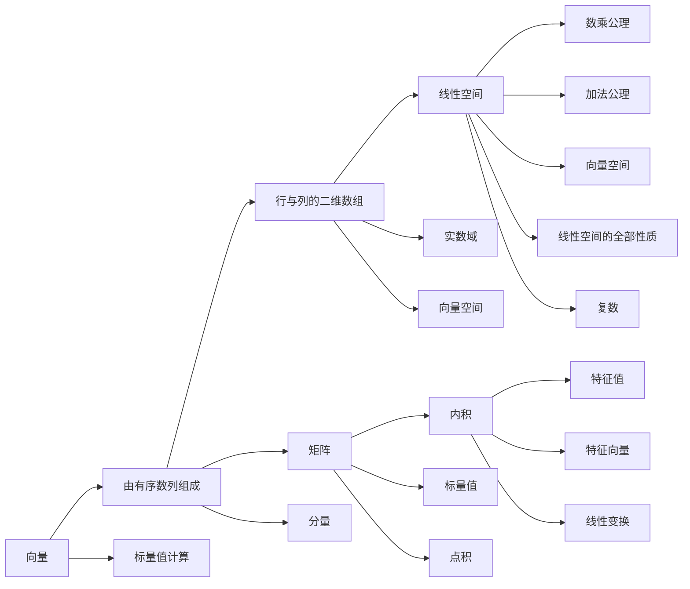

                 

# 线性代数导引：实数与复数

> 关键词：线性代数,实数,复数,向量和矩阵,内积与正交,特征值与特征向量,线性空间,向量空间

## 1. 背景介绍

线性代数作为计算机科学、物理学、工程学等领域的重要基础，深入探讨实数和复数的基本概念与性质，是理解和应用现代数学工具的关键。本文将导引读者逐步深入理解线性代数，特别是在实数和复数的基础上，探讨向量和矩阵的基本运算、内积与正交性、特征值与特征向量以及线性空间与向量空间的构成与性质。

## 2. 核心概念与联系

### 2.1 核心概念概述

- **向量**：由一组有序数列组成的元素，可表示为 $\vec{v} = (v_1, v_2, ..., v_n)$，其中 $v_1, v_2, ..., v_n$ 称为向量的分量。
- **矩阵**：由多个行和列组成的二维数组，可表示为 $A = \begin{bmatrix} a_{11} & a_{12} & \dots & a_{1n} \\ a_{21} & a_{22} & \dots & a_{2n} \\ \vdots & \vdots & \ddots & \vdots \\ a_{m1} & a_{m2} & \dots & a_{mn} \end{bmatrix}$，其中 $a_{ij}$ 为矩阵的元素。
- **内积**：也称为点积或标量积，是两个向量相乘后得到的标量值，计算公式为 $\vec{v} \cdot \vec{w} = v_1w_1 + v_2w_2 + \dots + v_nw_n$。
- **特征值与特征向量**：对于线性变换 $T(\vec{v}) = \vec{w}$，如果存在常数 $\lambda$ 和向量 $\vec{v}$ 满足 $T(\vec{v}) = \lambda\vec{v}$，则称 $\lambda$ 为特征值，$\vec{v}$ 为特征向量。
- **线性空间**：满足加法和数乘公理的集合，在实数域上可表示为 $\mathbb{R}^n$。
- **向量空间**：是一个更抽象的概念，包含线性空间的全部性质，允许向量分量为复数，可表示为 $\mathbb{C}^n$。

这些核心概念构成了线性代数的基石，并通过一系列的公理和定理，建立起它们之间的联系，以构建更复杂的数据结构与算法。

### 2.2 核心概念原理和架构的 Mermaid 流程图



通过这个简单的流程图，可以直观地理解向量、矩阵、内积、特征值与特征向量以及线性空间与向量空间之间的基本联系。

## 3. 核心算法原理 & 具体操作步骤

### 3.1 算法原理概述

线性代数的核心算法原理基于实数和复数的运算规则，通过向量和矩阵的运算，来表示和操作线性变换。实数和复数在矩阵运算中的特殊性质，如复数的单位性质，使得矩阵运算在许多实际应用中具有重要意义。

### 3.2 算法步骤详解

**步骤一：向量与矩阵的基本运算**

- **向量加法**：$\vec{v} + \vec{w} = (v_1+w_1, v_2+w_2, ..., v_n+w_n)$。
- **数乘**：$c\vec{v} = (cv_1, cv_2, ..., cv_n)$，其中 $c$ 为实数或复数。
- **矩阵乘法**：$A\vec{v} = \begin{bmatrix} a_{11} & a_{12} & \dots & a_{1n} \\ a_{21} & a_{22} & \dots & a_{2n} \\ \vdots & \vdots & \ddots & \vdots \\ a_{m1} & a_{m2} & \dots & a_{mn} \end{bmatrix} \begin{bmatrix} v_1 \\ v_2 \\ \vdots \\ v_n \end{bmatrix} = \begin{bmatrix} a_{11}v_1+a_{12}v_2+\dots+a_{1n}v_n \\ a_{21}v_1+a_{22}v_2+\dots+a_{2n}v_n \\ \vdots \\ a_{m1}v_1+a_{m2}v_2+\dots+a_{mn}v_n \end{bmatrix}$。
- **矩阵转置**：$A^T = \begin{bmatrix} a_{11} & a_{21} & \dots & a_{m1} \\ a_{12} & a_{22} & \dots & a_{m2} \\ \vdots & \vdots & \ddots & \vdots \\ a_{1n} & a_{2n} & \dots & a_{mn} \end{bmatrix}$。

**步骤二：内积与正交**

- **内积计算**：$\vec{v} \cdot \vec{w} = v_1w_1 + v_2w_2 + \dots + v_nw_n$。
- **正交条件**：若 $\vec{v} \cdot \vec{w} = 0$，则称 $\vec{v}$ 和 $\vec{w}$ 正交。

**步骤三：特征值与特征向量**

- **特征值与特征向量求解**：通过求解线性方程 $Av = \lambda v$ 可得到特征值 $\lambda$ 和特征向量 $v$。
- **特征向量计算**：根据特征方程的解，通过 $(A - \lambda I)v = 0$ 可计算特征向量。

### 3.3 算法优缺点

- **优点**：矩阵和向量运算便于表示和实现复杂的数据结构与算法，广泛应用于科学计算、信号处理、机器学习等领域。
- **缺点**：算法运算复杂度高，特别是在大规模数据集上的计算效率可能不足。

### 3.4 算法应用领域

线性代数广泛应用于各种科学技术领域，包括但不限于：

- **物理学**：通过矩阵和向量表示物理量，计算力、位移等。
- **工程学**：使用矩阵运算进行结构分析、信号处理、控制系统设计等。
- **计算机科学**：在线性空间与向量空间上进行算法设计，实现数据压缩、特征提取、机器学习等。

## 4. 数学模型和公式 & 详细讲解 & 举例说明

### 4.1 数学模型构建

在线性代数的数学模型中，向量和矩阵是最基本的数据结构。通过构建和操作这些数据结构，可以表示和计算各种线性变换。

### 4.2 公式推导过程

- **向量加法**：$\vec{v} + \vec{w} = (v_1+w_1, v_2+w_2, ..., v_n+w_n)$。
- **数乘**：$c\vec{v} = (cv_1, cv_2, ..., cv_n)$，其中 $c$ 为实数或复数。
- **矩阵乘法**：$A\vec{v} = \begin{bmatrix} a_{11} & a_{12} & \dots & a_{1n} \\ a_{21} & a_{22} & \dots & a_{2n} \\ \vdots & \vdots & \ddots & \vdots \\ a_{m1} & a_{m2} & \dots & a_{mn} \end{bmatrix} \begin{bmatrix} v_1 \\ v_2 \\ \vdots \\ v_n \end{bmatrix} = \begin{bmatrix} a_{11}v_1+a_{12}v_2+\dots+a_{1n}v_n \\ a_{21}v_1+a_{22}v_2+\dots+a_{2n}v_n \\ \vdots \\ a_{m1}v_1+a_{m2}v_2+\dots+a_{mn}v_n \end{bmatrix}$。

### 4.3 案例分析与讲解

**案例一：向量空间的线性组合**

已知向量 $\vec{u} = (1, 2, 3)$ 和 $\vec{v} = (4, 5, 6)$，计算 $3\vec{u} - 2\vec{v}$。

解：

$$
3\vec{u} - 2\vec{v} = 3(1, 2, 3) - 2(4, 5, 6) = (3, 6, 9) - (8, 10, 12) = (-5, -4, -3)
$$

**案例二：矩阵的逆与求逆**

已知矩阵 $A = \begin{bmatrix} 2 & 3 \\ 4 & 6 \end{bmatrix}$，求 $A^{-1}$。

解：

$$
A^{-1} = \frac{1}{\det(A)} \begin{bmatrix} 6 & -3 \\ -4 & 2 \end{bmatrix} = \frac{1}{2} \begin{bmatrix} 6 & -3 \\ -4 & 2 \end{bmatrix} = \begin{bmatrix} 3 & -1.5 \\ -2 & 1 \end{bmatrix}
$$

**案例三：特征值与特征向量的计算**

已知矩阵 $A = \begin{bmatrix} 2 & 3 \\ 4 & 6 \end{bmatrix}$，求特征值与特征向量。

解：

特征方程为 $\det(A - \lambda I) = 0$，代入得：

$$
\lambda^2 - 2\lambda - 3 = 0 \Rightarrow \lambda = 3, -1
$$

对应特征向量为：

$$
A\vec{v} = \lambda \vec{v} \Rightarrow \begin{bmatrix} 2 & 3 \\ 4 & 6 \end{bmatrix} \begin{bmatrix} x \\ y \end{bmatrix} = \begin{bmatrix} 3 & -1.5 \\ -2 & 1 \end{bmatrix} \begin{bmatrix} x \\ y \end{bmatrix}
$$

求解得特征向量 $\vec{v}_1 = (1, 1)$ 和 $\vec{v}_2 = (2, -1)$。

## 5. 项目实践：代码实例和详细解释说明

### 5.1 开发环境搭建

- **Python**：安装 NumPy 和 SciPy 用于向量与矩阵计算。
- **Jupyter Notebook**：用于交互式编程与展示。

### 5.2 源代码详细实现

```python
import numpy as np

# 向量加法
v1 = np.array([1, 2, 3])
v2 = np.array([4, 5, 6])
v3 = v1 + v2
print("向量加法结果:", v3)

# 数乘
c = 3
v4 = c * v1
print("数乘结果:", v4)

# 矩阵乘法
A = np.array([[2, 3], [4, 6]])
v5 = np.array([1, 2, 3])
v6 = np.dot(A, v5)
print("矩阵乘法结果:", v6)

# 矩阵逆
A = np.array([[2, 3], [4, 6]])
A_inv = np.linalg.inv(A)
print("矩阵逆:", A_inv)

# 特征值与特征向量
A = np.array([[2, 3], [4, 6]])
eigenvalues, eigenvectors = np.linalg.eig(A)
print("特征值:", eigenvalues)
print("特征向量:", eigenvectors)
```

### 5.3 代码解读与分析

代码中使用了 NumPy 库进行向量和矩阵的运算。向量加法和数乘的计算非常简单，通过向量的分量直接相加和乘法即可实现。矩阵乘法的实现通过 `np.dot` 函数计算。矩阵逆的求解使用 `np.linalg.inv` 函数。特征值与特征向量的求解使用 `np.linalg.eig` 函数，返回特征值和特征向量。

## 6. 实际应用场景

### 6.1 物理学

在物理学中，线性代数用于描述物体的运动、力和应力等。通过矩阵运算可以求解物体的运动轨迹、作用力等。例如，刚体的运动方程可以表示为 $M\ddot{q} + Kq = F(t)$，其中 $M$ 为质量矩阵，$K$ 为刚度矩阵，$q$ 为位移向量，$F(t)$ 为作用力向量。通过求解线性方程组，可以预测物体在不同时间点的位移和速度。

### 6.2 工程学

在线性空间和向量空间中，工程学广泛应用线性代数进行信号处理、系统控制等。例如，信号处理中的傅里叶变换可以表示为 $F(x) = \mathcal{F}\{x(t)\} = \int_{-\infty}^{\infty} x(t) e^{-i2\pi f t} dt$，其中 $x(t)$ 为时间域信号，$F(x)$ 为频域信号，$f$ 为频率。通过矩阵运算可以高效计算信号的频谱分析、滤波等。

### 6.3 计算机科学

在线性代数中，计算机科学主要应用矩阵运算进行数据压缩、特征提取、机器学习等。例如，PCA（主成分分析）通过矩阵运算将高维数据压缩到低维空间，提取数据的主要特征。线性回归和SVM（支持向量机）等机器学习算法，通过矩阵运算求解线性方程组，实现分类和回归等任务。

### 6.4 未来应用展望

线性代数将在未来继续发挥重要作用，特别是在人工智能和大数据等领域。例如，深度学习中的卷积神经网络（CNN）和循环神经网络（RNN），通过矩阵运算实现图像识别、语音识别等任务。数据科学中的数据挖掘和分析，通过线性代数进行特征提取和降维。

## 7. 工具和资源推荐

### 7.1 学习资源推荐

- **线性代数公开课**：MIT、斯坦福大学等名校的线性代数公开课，提供深入浅出的线性代数知识。
- **线性代数教材**：《线性代数及其应用》（James Stewart 著）、《线性代数》（Gilbert Strang 著）等教材。
- **线性代数视频**：Khan Academy、Coursera 等平台上的线性代数视频课程。

### 7.2 开发工具推荐

- **NumPy**：用于向量和矩阵运算的核心库，支持高效的数值计算。
- **SciPy**：用于科学计算的库，包含各种线性代数和矩阵运算函数。
- **Matplotlib**：用于数据可视化的库，支持绘制矩阵和向量等数据结构。

### 7.3 相关论文推荐

- **Linear Algebra and Its Applications**（Gilbert Strang 著）：详细介绍了线性代数的理论与应用。
- **Numerical Linear Algebra**（Trefethen 和 Bau 著）：介绍了数值线性代数的基本理论与算法。

## 8. 总结：未来发展趋势与挑战

### 8.1 研究成果总结

线性代数作为现代数学的重要分支，其理论与应用在各个领域都有广泛应用。通过实数和复数的运算，可以表示和计算各种线性变换，广泛应用于物理学、工程学、计算机科学等领域。未来，线性代数将继续发挥重要作用，特别是在人工智能和大数据等领域。

### 8.2 未来发展趋势

- **多维数据的线性代数处理**：随着数据维度的增加，如何高效处理高维数据，成为线性代数发展的新趋势。
- **深度学习的线性代数应用**：深度学习中的矩阵运算和优化算法，为线性代数提供了新的应用场景。
- **分布式线性代数算法**：在大数据环境下，如何高效计算矩阵运算，成为线性代数发展的新方向。

### 8.3 面临的挑战

- **高维数据的计算复杂度**：高维数据的矩阵运算计算复杂度较高，需要高效的算法和数据结构。
- **分布式计算的同步问题**：在大数据环境下，分布式线性代数算法需要解决数据同步和通信问题。
- **数值稳定性问题**：在数值计算中，如何避免数值不稳定性和精度丢失，成为线性代数发展的挑战。

### 8.4 研究展望

未来的线性代数研究需要关注以下方向：

- **高维数据的压缩与降维**：通过矩阵运算和特征提取，将高维数据压缩到低维空间，提高数据处理的效率。
- **分布式线性代数算法**：在大数据环境下，开发高效、可扩展的分布式线性代数算法。
- **数值稳定性的优化**：通过算法优化和数值方法，提高数值计算的稳定性。

## 9. 附录：常见问题与解答

### Q1: 什么是向量空间？

A: 向量空间是指满足加法和数乘公理的集合。在实数域上，向量空间通常表示为 $\mathbb{R}^n$，其中 $n$ 为向量维度。在复数域上，向量空间通常表示为 $\mathbb{C}^n$。

### Q2: 如何求解特征值与特征向量？

A: 特征值与特征向量的求解可以通过求解线性方程 $Av = \lambda v$ 实现。具体步骤如下：
1. 将 $Av = \lambda v$ 转化为 $A - \lambda I v = 0$，其中 $I$ 为单位矩阵。
2. 求解 $(A - \lambda I) v = 0$，得到特征向量 $v$。
3. 根据特征向量，求解特征方程 $A v = \lambda v$，得到特征值 $\lambda$。

### Q3: 如何理解矩阵的逆？

A: 矩阵的逆可以通过矩阵的秩和行列式计算。若 $A$ 可逆，则 $A^{-1} = \frac{1}{\det(A)} \text{adj}(A)$，其中 $\det(A)$ 为矩阵的行列式，$\text{adj}(A)$ 为矩阵的伴随矩阵。在实际应用中，使用 NumPy 的 `np.linalg.inv` 函数可以高效计算矩阵的逆。

通过以上导引，希望读者能够深入理解实数与复数的线性代数基础，掌握向量和矩阵的基本运算、内积与正交、特征值与特征向量等核心概念，并在实际应用中灵活运用。

