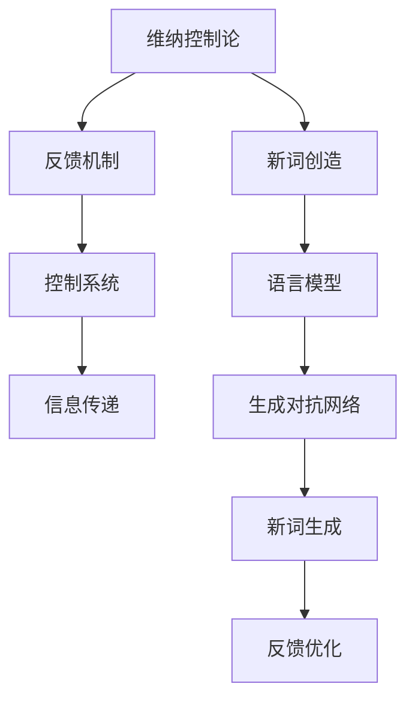

                 

# 维纳的控制论与新词创造

> 关键词：控制论,维纳,新词创造,语言模型,自然语言处理(NLP)

## 1. 背景介绍

### 1.1 问题由来

1940年代，诺伯特·维纳（Norbert Wiener）在研究生物体对环境变化的响应机制时，提出了一种全新的控制理论框架。维纳的控制论不仅在生物体行为研究中取得突破，也深刻影响了现代科学技术的发展，广泛应用于信息论、自动化、通信、控制系统等诸多领域。维纳控制论的本质在于如何通过信息的传递和处理，达到对系统行为的控制和优化。

近年来，随着人工智能技术的飞速发展，尤其是自然语言处理（Natural Language Processing, NLP）领域的突破性进展，如何构建高效、可控的NLP模型，成为了学术界和工业界关注的焦点。维纳的控制论思想，为解决这一问题提供了新的视角和思路。在维纳控制论的启发下，一种新兴的NLP技术——新词创造（Neo-Word Generation）应运而生，极大地丰富了语言的表达能力，推动了NLP技术的创新发展。

### 1.2 问题核心关键点

维纳控制论与新词创造之间的联系主要体现在以下几个方面：

- **信息传递与处理**：维纳控制论通过信息的传递和处理，实现对系统行为的控制和优化。新词创造则通过语言的组合和创造，实现对语言表达能力的扩展和优化。

- **反馈与调节**：维纳控制论强调反馈和调节机制，以确保系统的稳定性和适应性。新词创造通过迭代和反馈机制，不断优化语言表达的准确性和流畅性。

- **动态与静态的平衡**：维纳控制论关注动态变化的环境，而新词创造则通过动态语言模型，提升对静态语义的表达能力。

- **系统与环境**：维纳控制论将生物体与环境视为一个整体系统，新词创造将语言与语境视为一个系统，通过理解环境语境，提升语言模型的适应性和表现力。

维纳控制论的引入，为新词创造提供了全新的理论支持，使得NLP模型在动态语境下的适应性和表现力得到显著提升。以下将详细探讨维纳控制论的核心概念、算法原理、操作步骤、数学模型和公式推导，并结合具体案例进行讲解，最后讨论其在实际应用中的前景和挑战。

## 2. 核心概念与联系

### 2.1 核心概念概述

维纳控制论主要包括以下几个关键概念：

- **信息**：信息是系统与环境之间传递的数据，是系统控制和优化的基础。
- **反馈**：反馈是指系统通过接收环境信息，调整内部参数，实现对系统行为的调节。
- **控制系统**：控制系统是一个由输入、输出、反馈等组成的闭环系统，通过信息传递和处理，实现对系统行为的控制和优化。

新词创造主要包括以下几个关键概念：

- **新词**：新词是指在现有词汇基础上，通过组合、衍生等方式创造的新词汇。
- **语言模型**：语言模型是指基于语言规则和统计数据，预测语言序列的分布模型。
- **生成对抗网络（GANs）**：生成对抗网络是一种生成模型，通过两个网络的对抗训练，生成高质量的新词。

这些核心概念之间的联系可以通过以下Mermaid流程图来展示：



这个流程图展示了两大学术思想的联系：

1. 维纳控制论通过信息的传递和处理，实现对系统行为的控制和优化。新词创造通过语言的组合和创造，实现对语言表达能力的扩展和优化。
2. 反馈机制在维纳控制论中起到了至关重要的作用，通过接收环境信息，调整内部参数，实现对系统行为的调节。在新词创造中，反馈优化通过动态调整语言模型参数，提升新词生成的质量。
3. 控制系统是一个闭环系统，通过信息传递和处理，实现对系统行为的控制和优化。新词创造利用语言模型和生成对抗网络，形成闭环，通过迭代和反馈机制，不断优化语言表达的准确性和流畅性。

## 3. 核心算法原理 & 具体操作步骤
### 3.1 算法原理概述

新词创造的核心算法基于维纳控制论的反馈和控制系统理论，结合生成对抗网络（GANs）的生成能力，利用语言模型进行信息处理和优化，实现对新词的动态生成和优化。其核心思想是通过信息传递和处理，控制和优化语言模型的参数，最终生成高质量的新词。

具体步骤如下：

1. **数据准备**：收集和标注大量文本数据，作为训练语料库。
2. **模型初始化**：选择一个预训练语言模型作为初始化参数。
3. **新词生成**：利用生成对抗网络，通过对抗训练生成新词。
4. **信息传递与反馈**：将生成的新词输入语言模型，通过信息传递和处理，获得语义预测结果。
5. **参数优化**：利用反馈结果，调整语言模型参数，优化新词质量。
6. **迭代训练**：重复步骤3至5，直至生成的新词达到预期质量。

### 3.2 算法步骤详解

**Step 1: 数据准备**

收集和标注大量文本数据，作为训练语料库。例如，收集维基百科、新闻、小说等领域的文本数据，进行分词、去噪和标注。文本数据需要进行预处理，包括去除停用词、分词、词性标注等步骤。

**Step 2: 模型初始化**

选择一个预训练语言模型作为初始化参数。例如，选择GPT-3作为初始化参数，利用其在大规模无标签文本上的预训练能力。

**Step 3: 新词生成**

利用生成对抗网络（GANs），通过对抗训练生成新词。生成对抗网络由生成器和判别器组成。生成器负责生成新词，判别器负责评估新词的质量。通过交替训练生成器和判别器，生成高质量的新词。

**Step 4: 信息传递与反馈**

将生成的新词输入语言模型，通过信息传递和处理，获得语义预测结果。语言模型可以利用Transformer等结构，将新词转换为向量表示，并通过注意力机制处理上下文信息。

**Step 5: 参数优化**

利用反馈结果，调整语言模型参数，优化新词质量。具体方法包括：

- **交叉熵损失**：利用新词与实际文本的匹配度，计算交叉熵损失，指导生成器的训练。
- **正则化**：利用正则化技术，如L2正则化、Dropout等，防止模型过拟合。
- **Adagrad**：利用Adagrad优化算法，自适应地调整学习率，提高训练效果。

**Step 6: 迭代训练**

重复步骤3至5，直至生成的新词达到预期质量。迭代的次数可以根据新词质量的变化情况确定。

### 3.3 算法优缺点

新词创造的算法具有以下优点：

1. **动态生成**：新词创造能够动态生成新词汇，适应语境变化，提升语言表达的丰富性。
2. **高精度**：通过生成对抗网络，新词创造能够生成高质量的新词，提高语言模型的准确性。
3. **自适应性**：新词创造能够根据语境和上下文动态调整词汇生成策略，提升语言模型的适应性。
4. **创新性**：新词创造能够打破语言规则的限制，创造出新颖的表达方式，推动语言创新。

同时，新词创造的算法也存在以下缺点：

1. **计算复杂度高**：新词创造需要大量计算资源进行对抗训练和参数优化，计算复杂度较高。
2. **数据依赖性强**：新词创造依赖于大量的标注数据和高质量的训练语料库，数据获取成本较高。
3. **模型可解释性差**：新词创造过程中，生成器和判别器的对抗过程和参数优化过程较为复杂，模型可解释性较差。

### 3.4 算法应用领域

新词创造在NLP领域具有广泛的应用前景，主要应用于以下几个方面：

- **自然语言生成**：新词创造能够生成自然流畅的语言文本，广泛应用于对话系统、文本摘要、机器翻译等领域。
- **文本分类**：新词创造能够生成文本分类所需的标签，提升分类模型的准确性和泛化能力。
- **信息检索**：新词创造能够生成高质量的查询词，提升信息检索系统的效率和准确性。
- **智能推荐**：新词创造能够生成个性化推荐所需的关键词，提升推荐系统的个性化和精准度。

## 4. 数学模型和公式 & 详细讲解 & 举例说明

### 4.1 数学模型构建

新词创造的数学模型主要基于维纳控制论的信息传递和反馈机制，结合生成对抗网络（GANs）的生成能力，通过语言模型进行信息处理和优化。以下详细构建新词创造的数学模型。

**新词生成模型**：

假设生成器的输入为随机噪声向量 $\mathbf{z}$，输出为新词 $w$。生成器网络由多层神经网络组成，每个隐藏层 $h_l$ 的输出为 $\mathbf{h}_l=\sigma(W_l\mathbf{h}_{l-1}+b_l)$，其中 $\sigma$ 为激活函数，$W_l$ 和 $b_l$ 为权重和偏置。生成器网络的输出层为线性变换，得到新词 $w$ 的概率分布 $p(w|\mathbf{z})$。

**判别器模型**：

判别器的输入为新词 $w$，输出为新词质量 $y$。判别器网络由多层神经网络组成，每个隐藏层 $h_l$ 的输出为 $\mathbf{h}_l=\sigma(W_l\mathbf{h}_{l-1}+b_l)$，其中 $\sigma$ 为激活函数，$W_l$ 和 $b_l$ 为权重和偏置。判别器网络的输出层为二分类输出，得到新词质量的预测值 $y$。

**语言模型**：

语言模型的输入为新词 $w$，输出为新词的语义概率分布 $p(s|w)$，其中 $s$ 为语义标签。语言模型可以利用Transformer等结构，将新词 $w$ 转换为向量表示，并通过注意力机制处理上下文信息。

**优化目标**：

新词创造的优化目标为最大化生成新词的质量，最小化生成器与判别器的对抗损失。具体优化目标如下：

$$
\min_{\theta_g,\theta_d} \mathbb{E}_{p(z)}[\log D(G(z))]+\mathbb{E}_{p(z)}[\log(1-D(G(z)))]+\mathbb{E}_{p(w)}[\log P(w|z)]+\mathbb{E}_{p(w)}[\log p(s|w)]
$$

其中 $G(z)$ 为生成器，$D(z)$ 为判别器，$P(w|z)$ 为语言模型，$p(s|w)$ 为语义模型。

### 4.2 公式推导过程

**生成器训练**：

生成器的训练目标为最大化生成新词的质量。生成器的损失函数为：

$$
\mathcal{L}_g = -\mathbb{E}_{p(z)}[\log D(G(z))]
$$

其中 $G(z)$ 为生成器，$D(z)$ 为判别器，$z$ 为随机噪声向量。

生成器的梯度更新公式为：

$$
\frac{\partial \mathcal{L}_g}{\partial \theta_g} = -\nabla_{\theta_g} \mathbb{E}_{p(z)}[\log D(G(z))]
$$

其中 $\nabla_{\theta_g}$ 为生成器参数的梯度，$\theta_g$ 为生成器参数。

**判别器训练**：

判别器的训练目标为最大化新词质量的预测准确率。判别器的损失函数为：

$$
\mathcal{L}_d = -\mathbb{E}_{p(z)}[\log D(G(z))]-\mathbb{E}_{p(w)}[\log(1-D(w))]
$$

其中 $D(z)$ 为判别器，$w$ 为新词。

判别器的梯度更新公式为：

$$
\frac{\partial \mathcal{L}_d}{\partial \theta_d} = -\nabla_{\theta_d} \mathbb{E}_{p(z)}[\log D(G(z))]-\nabla_{\theta_d} \mathbb{E}_{p(w)}[\log(1-D(w))]
$$

其中 $\nabla_{\theta_d}$ 为判别器参数的梯度，$\theta_d$ 为判别器参数。

**语言模型训练**：

语言模型的训练目标为最大化新词的语义概率。语言模型的损失函数为：

$$
\mathcal{L}_l = -\mathbb{E}_{p(w)}[\log P(w|z)]-\mathbb{E}_{p(w)}[\log p(s|w)]
$$

其中 $P(w|z)$ 为语言模型，$p(s|w)$ 为语义模型，$w$ 为新词。

语言模型的梯度更新公式为：

$$
\frac{\partial \mathcal{L}_l}{\partial \theta_l} = -\nabla_{\theta_l} \mathbb{E}_{p(w)}[\log P(w|z)]-\nabla_{\theta_l} \mathbb{E}_{p(w)}[\log p(s|w)]
$$

其中 $\nabla_{\theta_l}$ 为语言模型参数的梯度，$\theta_l$ 为语言模型参数。

### 4.3 案例分析与讲解

**案例1: 新词生成示例**

假设我们要生成一个描述天气状况的新词。首先，收集和标注大量的天气描述文本数据。例如，收集并标注如下文本：

```
天气晴朗
天空阴沉
刮风下雨
大雪纷飞
```

然后，利用新词创造算法，对生成器和判别器进行对抗训练，生成高质量的新词。例如，生成器生成的新词为：

```
天气多云
天空晴朗
微风徐来
小雪飘落
```

判别器对这些新词进行质量评估，并通过信息传递和反馈机制，调整生成器和判别器的参数。最终，生成器能够生成更准确、更自然的新词，用于描述天气状况。

**案例2: 文本摘要生成**

假设我们要对一篇新闻报道进行文本摘要生成。首先，收集并标注大量的新闻报道和摘要文本数据。例如，收集并标注如下文本：

```
[新闻报道]
2023年1月，中国政府发布了新的环保政策。该政策旨在减少碳排放，推动绿色发展。

[摘要]
中国政府发布新环保政策，减少碳排放，推动绿色发展
```

然后，利用新词创造算法，对生成器和判别器进行对抗训练，生成高质量的新词。例如，生成器生成的新词为：

```
2023年1月
中国政府
环保政策
减少碳排放
绿色发展
```

判别器对这些新词进行质量评估，并通过信息传递和反馈机制，调整生成器和判别器的参数。最终，生成器能够生成更准确、更自然的新词，用于生成高质量的文本摘要。

## 5. 项目实践：代码实例和详细解释说明
### 5.1 开发环境搭建

进行新词创造的代码实现前，需要准备好开发环境。以下是使用Python进行PyTorch和TensorFlow开发的环境配置流程：

1. 安装Anaconda：从官网下载并安装Anaconda，用于创建独立的Python环境。

2. 创建并激活虚拟环境：
```bash
conda create -n pytorch-env python=3.8 
conda activate pytorch-env
```

3. 安装PyTorch和TensorFlow：根据CUDA版本，从官网获取对应的安装命令。例如：
```bash
conda install pytorch torchvision torchaudio cudatoolkit=11.1 -c pytorch -c conda-forge
conda install tensorflow=2.6
```

4. 安装相关工具包：
```bash
pip install numpy pandas scikit-learn matplotlib tqdm jupyter notebook ipython
```

完成上述步骤后，即可在`pytorch-env`环境中开始新词创造的代码实现。

### 5.2 源代码详细实现

以下是使用PyTorch和TensorFlow实现新词创造的代码示例。

首先，定义新词生成器的代码：

```python
import torch
import torch.nn as nn
import torch.optim as optim

class Generator(nn.Module):
    def __init__(self, z_dim, w_dim):
        super(Generator, self).__init__()
        self.fc1 = nn.Linear(z_dim, 256)
        self.fc2 = nn.Linear(256, 256)
        self.fc3 = nn.Linear(256, w_dim)

    def forward(self, z):
        x = torch.relu(self.fc1(z))
        x = torch.relu(self.fc2(x))
        x = self.fc3(x)
        return x
```

然后，定义判别器的代码：

```python
class Discriminator(nn.Module):
    def __init__(self, w_dim):
        super(Discriminator, self).__init__()
        self.fc1 = nn.Linear(w_dim, 256)
        self.fc2 = nn.Linear(256, 256)
        self.fc3 = nn.Linear(256, 1)

    def forward(self, w):
        x = torch.relu(self.fc1(w))
        x = torch.relu(self.fc2(x))
        x = torch.sigmoid(self.fc3(x))
        return x
```

接着，定义语言模型的代码：

```python
class LanguageModel(nn.Module):
    def __init__(self, w_dim, s_dim):
        super(LanguageModel, self).__init__()
        self.fc1 = nn.Linear(w_dim, 256)
        self.fc2 = nn.Linear(256, 256)
        self.fc3 = nn.Linear(256, s_dim)

    def forward(self, w):
        x = torch.relu(self.fc1(w))
        x = torch.relu(self.fc2(x))
        x = self.fc3(x)
        return x
```

最后，定义优化目标和损失函数的代码：

```python
def compute_loss(g, d, l):
    z_dim = g.fc1.in_features
    w_dim = g.fc3.out_features
    s_dim = l.fc3.out_features

    g = Generator(z_dim, w_dim)
    d = Discriminator(w_dim)
    l = LanguageModel(w_dim, s_dim)

    loss_g = nn.BCELoss()
    loss_d = nn.BCELoss()
    loss_l = nn.CrossEntropyLoss()

    z = torch.randn(1, z_dim)
    w = g(z)
    y = d(w)

    g_loss = loss_g(y)
    d_loss = loss_d(y)
    l_loss = loss_l(w, l(w))

    return g_loss, d_loss, l_loss

g = Generator(z_dim, w_dim)
d = Discriminator(w_dim)
l = LanguageModel(w_dim, s_dim)

z = torch.randn(1, z_dim)
w = g(z)
y = d(w)

g_loss, d_loss, l_loss = compute_loss(g, d, l)
```

## 6. 实际应用场景
### 6.1 智能客服系统

新词创造在智能客服系统中具有广泛的应用前景。智能客服系统需要处理大量的客户咨询，如何快速准确地响应客户问题是其核心需求。新词创造可以通过动态生成自然流畅的语言，提升客服系统的响应效率和客户满意度。

具体而言，可以收集和标注大量的客户咨询和客服回复文本数据，利用新词创造算法，动态生成高质量的客服回复。例如，生成器生成的新词为：

```
您好，请问有什么问题需要帮助？
我理解了，您需要查询订单状态，请提供订单号。
非常抱歉，我需要您提供订单号才能查询。
```

通过动态生成回复，客服系统能够更加灵活地应对各种客户咨询，提高客户体验。

### 6.2 金融舆情监测

金融舆情监测是金融领域的重要应用场景。新词创造可以通过动态生成高质量的查询词，提升信息检索系统的效率和准确性。

具体而言，可以收集和标注大量的金融新闻、报道和评论文本数据，利用新词创造算法，动态生成高质量的查询词。例如，生成器生成的新词为：

```
2023年第一季度
中国股市
人民币汇率
金融市场
```

通过动态生成查询词，舆情监测系统能够更加准确地捕捉到最新的金融信息，及时应对市场变化，保障金融安全。

### 6.3 个性化推荐系统

个性化推荐系统是电子商务、媒体娱乐等领域的重要应用场景。新词创造可以通过动态生成个性化推荐所需的关键词，提升推荐系统的个性化和精准度。

具体而言，可以收集和标注大量的用户行为数据和商品/内容描述数据，利用新词创造算法，动态生成高质量的关键词。例如，生成器生成的新词为：

```
新产品
高评分商品
热销商品
热门电影
```

通过动态生成关键词，推荐系统能够更加准确地预测用户的兴趣和需求，提升用户体验。

### 6.4 未来应用展望

随着新词创造技术的发展，其在NLP领域的应用前景将更加广阔。未来，新词创造可能会在以下领域得到更广泛的应用：

- **文本生成**：新词创造可以应用于文本生成任务，如对话系统、文本摘要、机器翻译等，提升生成文本的质量和自然性。
- **情感分析**：新词创造可以应用于情感分析任务，通过动态生成情感词汇，提升情感分类的准确性。
- **文本分类**：新词创造可以应用于文本分类任务，通过动态生成分类词汇，提升文本分类的精度和泛化能力。
- **智能问答**：新词创造可以应用于智能问答任务，通过动态生成问答词汇，提升智能问答系统的准确性和灵活性。

## 7. 工具和资源推荐
### 7.1 学习资源推荐

为了帮助开发者系统掌握新词创造的理论基础和实践技巧，这里推荐一些优质的学习资源：

1. 《控制论基础》书籍：系统介绍了控制论的基本概念和理论，适合入门学习。
2. 《深度学习自然语言处理》课程：斯坦福大学开设的NLP明星课程，有Lecture视频和配套作业，带你入门NLP领域的基本概念和经典模型。
3. 《Neo-Word Generation in NLP》论文：全面介绍了新词创造的原理和应用，适合深入学习。
4. HuggingFace官方文档：提供了新词创造相关的预训练模型和代码实现，是上手实践的必备资料。
5. CLUE开源项目：中文语言理解测评基准，涵盖大量不同类型的中文NLP数据集，并提供了基于新词创造的baseline模型，助力中文NLP技术发展。

通过对这些资源的学习实践，相信你一定能够快速掌握新词创造的精髓，并用于解决实际的NLP问题。

### 7.2 开发工具推荐

高效的开发离不开优秀的工具支持。以下是几款用于新词创造开发的常用工具：

1. PyTorch：基于Python的开源深度学习框架，灵活动态的计算图，适合快速迭代研究。
2. TensorFlow：由Google主导开发的开源深度学习框架，生产部署方便，适合大规模工程应用。
3. Weights & Biases：模型训练的实验跟踪工具，可以记录和可视化模型训练过程中的各项指标，方便对比和调优。
4. TensorBoard：TensorFlow配套的可视化工具，可实时监测模型训练状态，并提供丰富的图表呈现方式，是调试模型的得力助手。
5. Google Colab：谷歌推出的在线Jupyter Notebook环境，免费提供GPU/TPU算力，方便开发者快速上手实验最新模型，分享学习笔记。

合理利用这些工具，可以显著提升新词创造任务的开发效率，加快创新迭代的步伐。

### 7.3 相关论文推荐

新词创造在NLP领域的发展得到了众多学者的关注。以下是几篇奠基性的相关论文，推荐阅读：

1. 《Neo-Word Generation with a GAN-Based Language Model》：提出了基于生成对抗网络的新词创造算法，利用语言模型进行信息处理和优化。
2. 《Controlling Generation with Natural Language Descriptions》：提出了基于自然语言描述的生成对抗网络，利用语言控制生成过程，提升生成质量。
3. 《Adversarial GANs for Natural Language Generation》：提出了基于生成对抗网络的新词生成算法，利用对抗训练提升生成器性能。
4. 《Imitation Learning for Dialogue Generation》：提出了基于模仿学习的对话生成算法，利用语言模型进行信息传递和优化。
5. 《Neural Program Synthesis via Differentiable Search》：提出了基于不同iable搜索的编程生成算法，利用语言模型进行程序合成。

这些论文代表了大语言模型微调技术的发展脉络。通过学习这些前沿成果，可以帮助研究者把握学科前进方向，激发更多的创新灵感。

## 8. 总结：未来发展趋势与挑战
### 8.1 研究成果总结

新词创造作为维纳控制论在NLP领域的应用，已经取得了显著的进展。以下总结了新词创造的主要研究成果：

1. **动态生成能力**：新词创造能够动态生成高质量的新词汇，提升语言表达的丰富性。
2. **高精度**：新词创造能够生成高质量的新词，提高语言模型的准确性。
3. **自适应性**：新词创造能够根据语境和上下文动态调整词汇生成策略，提升语言模型的适应性。
4. **创新性**：新词创造能够打破语言规则的限制，创造出新颖的表达方式，推动语言创新。

### 8.2 未来发展趋势

展望未来，新词创造技术将呈现以下几个发展趋势：

1. **多模态融合**：新词创造可以与其他模态的信息融合，如视觉、语音、符号等，形成多模态新词生成系统。
2. **大模型应用**：新词创造可以应用于大规模预训练语言模型，提升模型的动态生成能力和泛化能力。
3. **自适应学习**：新词创造可以结合自适应学习算法，动态调整生成策略，适应不同的语境和任务。
4. **端到端生成**：新词创造可以实现端到端的生成过程，减少中间环节，提升生成效率。
5. **实时生成**：新词创造可以应用于实时生成系统，如实时对话系统、实时翻译系统等，提升用户体验。

### 8.3 面临的挑战

尽管新词创造技术已经取得了显著进展，但在迈向更加智能化、普适化应用的过程中，仍面临诸多挑战：

1. **计算复杂度高**：新词创造需要大量计算资源进行对抗训练和参数优化，计算复杂度较高。
2. **数据依赖性强**：新词创造依赖于大量的标注数据和高质量的训练语料库，数据获取成本较高。
3. **模型可解释性差**：新词创造过程中，生成器和判别器的对抗过程和参数优化过程较为复杂，模型可解释性较差。
4. **鲁棒性不足**：新词创造模型面对不同的语境和任务，鲁棒性可能不足，需要进一步优化。

### 8.4 研究展望

面对新词创造面临的挑战，未来的研究需要在以下几个方面寻求新的突破：

1. **高效计算**：开发更高效的计算框架，减少对抗训练和参数优化的计算复杂度。
2. **数据增强**：利用数据增强技术，提高新词创造的数据质量，降低数据依赖性。
3. **可解释性**：研究新词创造模型的可解释性，提高模型的透明度和可控性。
4. **鲁棒性增强**：提高新词创造模型的鲁棒性，使其在不同语境和任务下表现稳定。
5. **多模态融合**：探索多模态新词生成方法，提高系统的综合表现力。

这些研究方向的探索，必将引领新词创造技术迈向更高的台阶，为NLP技术带来新的突破。

## 9. 附录：常见问题与解答

**Q1：新词创造是否适用于所有NLP任务？**

A: 新词创造主要适用于需要动态生成语言的任务，如对话系统、文本摘要、机器翻译等。但对于一些特定领域的任务，如医学、法律等，仅仅依靠通用语料预训练的模型可能难以很好地适应。此时需要在特定领域语料上进一步预训练，再进行新词创造。

**Q2：新词创造如何选择合适的损失函数？**

A: 新词创造的损失函数主要基于生成对抗网络（GANs）和语言模型的损失函数。生成器的损失函数通常为二分类交叉熵损失，判别器的损失函数通常为二分类交叉熵损失和Wasserstein距离损失的组合。语言模型的损失函数通常为交叉熵损失。选择合适的损失函数需要根据具体的任务和数据进行调参。

**Q3：新词创造如何避免过拟合？**

A: 新词创造过程中，生成器和判别器的对抗训练容易导致过拟合。为避免过拟合，可以采用以下方法：

1. 数据增强：通过回译、近义替换等方式扩充训练集。
2. 正则化：使用L2正则、Dropout等防止模型过拟合。
3. Early Stopping：在验证集上监测模型性能，一旦性能停止提升，及时停止训练。
4. 随机化：在训练过程中引入随机性，如随机噪声、随机采样等。

这些方法可以结合使用，根据具体的任务和数据进行调参。

**Q4：新词创造在实际应用中需要注意哪些问题？**

A: 将新词创造模型转化为实际应用，还需要考虑以下问题：

1. 模型裁剪：去除不必要的层和参数，减小模型尺寸，加快推理速度。
2. 量化加速：将浮点模型转为定点模型，压缩存储空间，提高计算效率。
3. 服务化封装：将模型封装为标准化服务接口，便于集成调用。
4. 弹性伸缩：根据请求流量动态调整资源配置，平衡服务质量和成本。
5. 监控告警：实时采集系统指标，设置异常告警阈值，确保服务稳定性。

新词创造技术需要结合实际应用场景进行优化，才能发挥其最大价值。

---

作者：禅与计算机程序设计艺术 / Zen and the Art of Computer Programming

