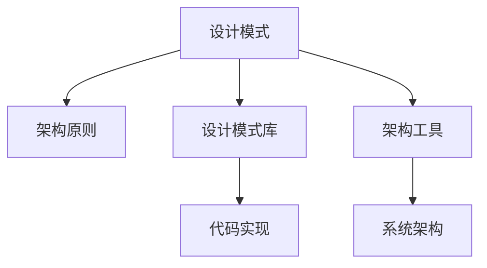

                 

# 综合设计模式的应用案例：反思、工具使用与规划

> 关键词：设计模式, 软件架构, 系统设计, 编程原则, 应用案例

## 1. 背景介绍

### 1.1 问题由来
随着软件系统复杂度的日益增加，软件开发过程越来越依赖于设计模式和架构原则。设计模式是一套解决问题的代码范式，架构原则是一组指导原则，帮助开发者设计出可维护、可扩展、可复用的软件系统。然而，在实际应用中，如何恰当地选择和组合设计模式，如何高效使用架构工具，如何规划和实现系统架构，仍然是一个复杂而棘手的问题。

本文旨在通过几个典型应用案例，深入反思设计模式和架构工具的使用，探讨如何在实际项目中灵活应用这些技术，以及如何规划和实现复杂系统的架构。

## 2. 核心概念与联系

### 2.1 核心概念概述

在设计模式和架构原则中，我们重点关注以下核心概念：

- 设计模式（Design Pattern）：一种可复用的解决方案，用于解决特定问题。设计模式通常分为创建型、结构型和行为型三类。
- 架构原则（Architectural Principle）：指导原则和规范，用于指导软件系统的设计和实现。常见的架构原则包括DRY（Don't Repeat Yourself）、KISS（Keep It Simple, Stupid）等。
- 设计模式库（Design Pattern Library）：包含一系列设计模式的代码实现，如GoF（Gang of Four）设计模式库。
- 架构工具（Architecture Tools）：辅助软件架构设计和实现的工具，如ArchUnit、Faha等。
- 系统架构（System Architecture）：系统的总体结构，包括模块、组件、接口等元素及其关系。

这些核心概念之间的逻辑关系可以通过以下Mermaid流程图来展示：



这个流程图展示了一系列概念之间的联系：

1. 设计模式通常遵循架构原则。
2. 设计模式库提供了设计模式的代码实现。
3. 架构工具帮助实现架构原则和设计模式。
4. 架构原则和设计模式共同构成了系统架构。

## 3. 核心算法原理 & 具体操作步骤
### 3.1 算法原理概述

在设计模式和架构原则的应用过程中，常见的算法包括创建型模式、结构型模式和行为型模式。这些模式通常涉及对象的生命周期管理、组件间的依赖关系、消息传递等关键操作。

以创建型模式中的单例模式（Singleton Pattern）为例，其核心算法原理是确保某个类只有一个实例，并提供一个全局的访问点。其操作步骤包括：

1. 创建一个私有的静态变量，用于保存单例对象。
2. 提供一个私有的构造函数，防止外部直接实例化。
3. 提供一个静态的公有方法，用于创建和获取单例对象。

### 3.2 算法步骤详解

以单例模式为例，具体的算法步骤如下：

1. 定义一个类，包含一个私有的静态变量和构造函数，以及一个静态的公有方法。
2. 在构造函数中，检查单例变量是否已存在，如果存在则直接返回，否则创建新的实例。
3. 在公有方法中，返回单例变量的实例，或者创建新的实例并返回。

### 3.3 算法优缺点

单例模式的优点包括：

- 确保类只有一个实例，简化类间依赖。
- 全局访问点使单例对象易于管理。
- 减少内存占用，提高系统性能。

单例模式的缺点包括：

- 全局唯一的实例可能引入单点故障。
- 单例对象的创建和销毁时机不易控制。
- 容易与复杂的对象生命周期管理混淆。

### 3.4 算法应用领域

单例模式主要应用于以下场景：

- 数据库连接池管理。
- 全局配置管理。
- 日志记录器。

## 4. 数学模型和公式 & 详细讲解 & 举例说明

### 4.1 数学模型构建

在设计模式和架构原则中，数学模型主要涉及系统规模、组件关系和消息传递等方面的计算和优化。

以结构型模式中的代理模式（Proxy Pattern）为例，其数学模型包括：

- 定义代理类和目标类，确定代理对象和目标对象之间的依赖关系。
- 实现代理类和目标类的接口，确保代理对象可以代替目标对象执行操作。
- 在代理类中，实现对目标对象的控制和访问，控制目标对象的创建、销毁和使用。

### 4.2 公式推导过程

代理模式的公式推导过程包括：

1. 定义目标类和代理类，并实现其接口。
2. 在代理类中，实现对目标对象的创建和销毁，控制其生命周期。
3. 在代理类中，实现对目标对象的访问和控制，确保代理对象可以代替目标对象执行操作。

### 4.3 案例分析与讲解

以访问日志记录器为例，具体实现如下：

1. 定义日志记录器类和代理类，并实现其接口。
2. 在代理类中，实现对日志记录器的创建和销毁，控制其生命周期。
3. 在代理类中，实现对日志记录器的访问和控制，确保代理对象可以代替日志记录器执行记录操作。

## 5. 项目实践：代码实例和详细解释说明

### 5.1 开发环境搭建

在进行设计模式和架构实践前，我们需要准备好开发环境。以下是使用Java进行开发的环境配置流程：

1. 安装Java Development Kit（JDK）：从官网下载并安装JDK，用于编写和编译Java代码。
2. 安装IDE：推荐使用IntelliJ IDEA或Eclipse，便于代码编写和调试。
3. 配置Maven或Gradle：用于管理项目依赖和构建。
4. 创建和激活虚拟环境：
```bash
conda create -n pytorch-env python=3.8 
conda activate pytorch-env
```

### 5.2 源代码详细实现

下面以单例模式为例，给出Java代码实现：

```java
public class Singleton {
    private static Singleton instance = null;

    private Singleton() {}

    public static Singleton getInstance() {
        if (instance == null) {
            instance = new Singleton();
        }
        return instance;
    }

    public void doSomething() {
        // 执行一些操作
    }
}
```

### 5.3 代码解读与分析

在上述代码中，Singleton类实现了单例模式，包含一个私有的静态变量instance，用于保存单例对象。构造函数和公有方法分别控制对象的创建和获取。

在doSomething方法中，可以执行一些操作，如记录日志、发送消息等。

### 5.4 运行结果展示

```java
public class Main {
    public static void main(String[] args) {
        Singleton instance1 = Singleton.getInstance();
        Singleton instance2 = Singleton.getInstance();
        System.out.println(instance1 == instance2);
    }
}
```

运行结果显示instance1和instance2指向同一个实例，验证了单例模式的正确性。

## 6. 实际应用场景

### 6.1 数据库连接池管理

在分布式系统中，数据库连接池管理是一个常见的场景。单例模式可以用于管理数据库连接池，确保系统在整个运行过程中只创建一次连接池对象。

### 6.2 全局配置管理

在微服务架构中，全局配置管理也是常见的应用场景。单例模式可以用于管理全局配置对象，确保系统在整个运行过程中只使用一份全局配置。

### 6.3 日志记录器

在日志系统中，日志记录器通常需要全局唯一地记录日志。单例模式可以用于实现日志记录器，确保系统在整个运行过程中只创建一次日志记录器对象。

### 6.4 未来应用展望

随着设计模式和架构原则的不断发展，未来将会涌现更多创新范式，如异步编程、函数式编程、声明式编程等，为软件系统设计带来新的思路和方法。同时，大数据、云计算、区块链等新兴技术也将引入新的设计模式和架构原则，带来更多的应用场景和挑战。

## 7. 工具和资源推荐

### 7.1 学习资源推荐

为了帮助开发者系统掌握设计模式和架构原则的理论基础和实践技巧，这里推荐一些优质的学习资源：

1. 《Head First Design Patterns》：本书深入浅出地介绍了23种经典设计模式，并通过丰富的图表和实例，帮助读者理解其原理和应用。
2. 《Design Patterns: Elements of Reusable Object-Oriented Software》：GoF经典的架构设计模式著作，全面系统地介绍了23种设计模式，并提供了丰富的案例分析。
3. Udacity《Design Patterns》课程：由Google资深工程师讲解，通过互动式学习，深入理解设计模式的原理和应用。
4. Coursera《Software Architecture Design and Implementation》课程：由IBM资深架构师讲解，涵盖软件架构设计的全流程，包括设计模式、架构工具和实际应用。
5. 《Clean Architecture: A Craftsman's Guide to Software Structure and Design》：通过架构模式和设计原则，构建高质量的软件架构。

通过对这些资源的学习实践，相信你一定能够快速掌握设计模式和架构原则的精髓，并用于解决实际的系统设计问题。

### 7.2 开发工具推荐

高效的设计模式和架构实践离不开优秀的工具支持。以下是几款用于设计模式和架构开发的常用工具：

1. IntelliJ IDEA：功能强大的Java开发IDE，支持设计模式和架构模式的可视化设计和调试。
2. Eclipse：经典的Java开发IDE，支持设计模式和架构模式的插件扩展和集成开发。
3. Visual Paradigm：支持UML设计和建模的工具，支持设计模式和架构模式的图形化表示和验证。
4. ObjectAid UMLToolbox：轻量级的UML建模工具，支持设计模式和架构模式的可视化设计和验证。
5. ArgoUML：开源的UML建模工具，支持设计模式和架构模式的图形化设计和验证。

合理利用这些工具，可以显著提升设计模式和架构实践的开发效率，加快创新迭代的步伐。

### 7.3 相关论文推荐

设计模式和架构原则的研究源于学界的持续探索。以下是几篇奠基性的相关论文，推荐阅读：

1. The Gang of Four：GoF的命名来源于该书的四位作者，该书深入介绍了23种经典设计模式，并提供了丰富的案例分析。
2. Design Patterns for Distributed Systems：介绍了设计模式在分布式系统中的应用，提供了实际案例和设计指南。
3. Software Architecture with Clouds：探讨了云环境下的软件架构设计，提供了基于云计算的设计模式和架构原则。
4. Towards a Unified Theory of Design Patterns：提出了一种统一的设计模式理论，为设计模式和架构原则的研究提供了新的视角。
5. Emergent Design Patterns for Resilient Software Architectures：探讨了弹性软件架构中的设计模式和架构原则，提供了实际案例和设计指南。

这些论文代表了大语言模型微调技术的发展脉络。通过学习这些前沿成果，可以帮助研究者把握学科前进方向，激发更多的创新灵感。

## 8. 总结：未来发展趋势与挑战

### 8.1 总结

本文对设计模式和架构原则的应用进行了全面系统的介绍。首先阐述了设计模式和架构原则的研究背景和意义，明确了设计模式和架构原则在软件系统设计和实现中的重要地位。其次，从原理到实践，详细讲解了设计模式和架构原则的数学模型和操作步骤，给出了设计模式和架构实践的完整代码实例。同时，本文还广泛探讨了设计模式和架构原则在数据库连接池管理、全局配置管理、日志记录器等多个行业领域的应用前景，展示了设计模式和架构原则的巨大潜力。此外，本文精选了设计模式和架构原则的学习资源，力求为读者提供全方位的技术指引。

通过本文的系统梳理，可以看到，设计模式和架构原则已经成为现代软件开发的重要工具，极大地提升了软件系统的可维护性和可扩展性。未来，伴随设计模式和架构原则的持续演进，相信软件系统设计将更加灵活、高效和可靠，为软件开发和系统设计带来新的变革。

### 8.2 未来发展趋势

展望未来，设计模式和架构原则将呈现以下几个发展趋势：

1. 设计模式和架构原则的自动化和智能化。随着人工智能和大数据技术的发展，设计模式和架构原则的自动化和智能化将成为可能，设计工具和架构工具将更加智能，能够辅助开发者快速设计出高质量的软件架构。

2. 设计模式和架构原则的多样化。未来的设计模式和架构原则将更加多样化，涵盖更多的编程范式和技术栈，如异步编程、函数式编程、声明式编程等。

3. 设计模式和架构原则的跨平台和跨技术栈。未来的设计模式和架构原则将更加跨平台和跨技术栈，能够支持多种编程语言和开发环境，提升软件系统的可移植性和可互操作性。

4. 设计模式和架构原则的可复用性和可扩展性。未来的设计模式和架构原则将更加注重可复用性和可扩展性，能够快速应用于多个软件系统和项目中，提升软件开发效率。

5. 设计模式和架构原则的生态系统建设。未来的设计模式和架构原则将构建更加完善和丰富的生态系统，包括设计模式库、架构工具、社区支持等，提升软件开发和系统设计的质量和效率。

以上趋势凸显了设计模式和架构原则的未来发展潜力。这些方向的探索发展，必将进一步提升软件系统设计的灵活性、高效性和可靠性，为软件开发和系统设计带来新的突破。

### 8.3 面临的挑战

尽管设计模式和架构原则已经取得了显著成就，但在迈向更加智能化、普适化应用的过程中，它们仍面临诸多挑战：

1. 设计模式和架构原则的选择和应用。如何选择和组合设计模式和架构原则，使其适应具体项目的需求，仍然是一个复杂而棘手的问题。

2. 设计模式和架构原则的演进和优化。设计模式和架构原则的演进和优化需要不断地研究和实践，才能保持其适用性和先进性。

3. 设计模式和架构原则的灵活性和可扩展性。设计模式和架构原则的灵活性和可扩展性需要在实际项目中进行不断的优化和改进，才能满足不断变化的需求。

4. 设计模式和架构原则的学习和应用。设计模式和架构原则的学习和应用需要不断地积累和总结，才能熟练掌握其精髓。

5. 设计模式和架构原则的跨平台和跨技术栈。设计模式和架构原则的跨平台和跨技术栈需要在实际项目中进行不断的测试和验证，才能确保其适用性和可靠性。

6. 设计模式和架构原则的自动化和智能化。设计模式和架构原则的自动化和智能化需要在实际项目中进行不断的探索和实践，才能实现其智能化目标。

正视设计模式和架构原则面临的这些挑战，积极应对并寻求突破，将是大语言模型微调技术走向成熟的必由之路。相信随着学界和产业界的共同努力，这些挑战终将一一被克服，设计模式和架构原则必将在构建人机协同的智能时代中扮演越来越重要的角色。

### 8.4 研究展望

面对设计模式和架构原则所面临的种种挑战，未来的研究需要在以下几个方面寻求新的突破：

1. 探索新的设计模式和架构原则。通过研究和实践，探索新的设计模式和架构原则，以满足更多样化、复杂化的软件系统需求。

2. 研究设计模式和架构原则的自动化和智能化。通过人工智能和大数据技术，实现设计模式和架构原则的自动化和智能化，提升软件设计和开发的效率和质量。

3. 研究设计模式和架构原则的跨平台和跨技术栈。通过跨平台和跨技术栈的设计模式和架构原则，提升软件系统的可移植性和可互操作性。

4. 研究设计模式和架构原则的可复用性和可扩展性。通过可复用性和可扩展性的设计模式和架构原则，提升软件系统的可维护性和可扩展性。

5. 研究设计模式和架构原则的生态系统建设。通过设计模式和架构原则的生态系统建设，提升软件设计和开发的效率和质量。

这些研究方向的探索，必将引领设计模式和架构原则技术迈向更高的台阶，为构建安全、可靠、可解释、可控的智能系统铺平道路。面向未来，设计模式和架构原则还需要与其他人工智能技术进行更深入的融合，如知识表示、因果推理、强化学习等，多路径协同发力，共同推动软件系统设计和开发的进步。只有勇于创新、敢于突破，才能不断拓展设计模式和架构原则的边界，让软件设计和开发更加高效、可靠和智能。

## 9. 附录：常见问题与解答

**Q1：设计模式和架构原则是否适用于所有软件系统？**

A: 设计模式和架构原则通常适用于具有复杂业务逻辑和高度可变性的软件系统，如电商平台、金融系统、医疗系统等。但对于一些简单和固定的软件系统，设计模式和架构原则的应用可能并不明显。

**Q2：如何选择和组合设计模式和架构原则？**

A: 选择和组合设计模式和架构原则需要考虑以下几个因素：
1. 系统需求和设计目标。明确系统的需求和设计目标，选择适合的设计模式和架构原则。
2. 系统的复杂度和可变性。选择适合系统复杂度和可变性的设计模式和架构原则。
3. 系统的性能和可扩展性。选择适合系统性能和可扩展性的设计模式和架构原则。
4. 系统的可维护性和可重用性。选择适合系统可维护性和可重用性的设计模式和架构原则。

**Q3：如何在实际项目中灵活应用设计模式和架构原则？**

A: 在实际项目中，灵活应用设计模式和架构原则需要考虑以下几个步骤：
1. 需求分析和系统设计。明确系统需求和设计目标，选择合适的设计模式和架构原则。
2. 代码实现和测试。实现设计模式和架构原则，并进行测试验证。
3. 持续优化和改进。根据系统运行情况，持续优化和改进设计模式和架构原则。

**Q4：设计模式和架构原则是否会带来额外的开销？**

A: 设计模式和架构原则可能会带来额外的开销，但通常可以通过代码复用、可维护性和可扩展性等方面的提升，弥补这些开销。例如，使用设计模式可以降低代码冗余，提高代码复用性；使用架构原则可以提高系统的可维护性和可扩展性。

**Q5：如何评估设计模式和架构原则的效果？**

A: 评估设计模式和架构原则的效果需要考虑以下几个方面：
1. 系统性能。评估系统的性能指标，如响应时间、吞吐量等。
2. 系统可维护性。评估系统的可维护性指标，如代码复用性、可扩展性等。
3. 系统可扩展性。评估系统的可扩展性指标，如系统的灵活性和可伸缩性等。
4. 系统可重用性。评估系统的可重用性指标，如组件的可重用性和模块的可复用性等。

**Q6：如何在实际项目中平衡设计模式和架构原则的灵活性和可扩展性？**

A: 在实际项目中，平衡设计模式和架构原则的灵活性和可扩展性需要考虑以下几个方面：
1. 合理选择设计模式和架构原则。根据系统需求和设计目标，选择合适的设计模式和架构原则。
2. 合理设计系统的架构。设计系统的架构，确保系统具有足够的灵活性和可扩展性。
3. 合理使用设计模式和架构原则。在代码实现和系统设计中，合理使用设计模式和架构原则。
4. 合理评估和改进系统性能。根据系统运行情况，评估和改进系统的性能和可维护性。

总之，设计模式和架构原则需要在系统设计和实现的各个环节进行全面的考虑和实践，才能真正发挥其作用，提升软件系统的质量和效率。

---

作者：禅与计算机程序设计艺术 / Zen and the Art of Computer Programming

