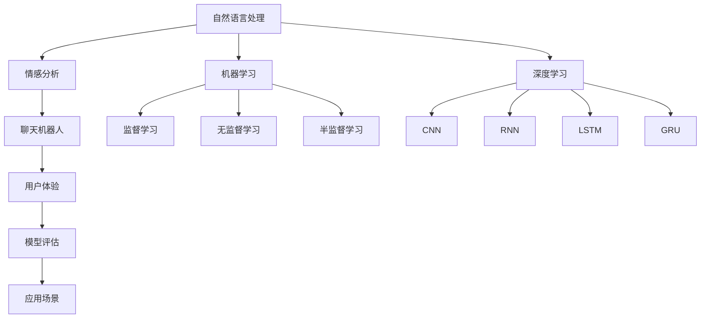

                 

# 聊天机器人中的情感分析

> 关键词：情感分析, 自然语言处理(NLP), 机器学习, 深度学习, 聊天机器人, 用户体验, 模型评估, 应用场景, 数据处理, 模型优化, 算法分析

## 1. 背景介绍

### 1.1 问题由来
在聊天机器人（Chatbot）的发展中，情感分析作为其中一个关键技术，对于提升用户体验、实现智能交互、增强情感理解和反馈具有重要意义。通过情感分析，聊天机器人可以更好地理解用户情绪，提供更加人性化的服务，并在需要时进行相应的情感响应。

### 1.2 问题核心关键点
情感分析（Sentiment Analysis），又称意见挖掘（Opinion Mining），旨在从文本数据中识别并提取人们的情感倾向。在聊天机器人中，情感分析主要应用于以下几个方面：
- **用户情感识别**：通过分析用户的输入文本，识别出用户的情绪状态，如快乐、悲伤、愤怒等。
- **情感响应**：根据用户情感，自动生成相应的回复，提供情感支持或进行情绪疏导。
- **反馈优化**：通过分析用户对聊天机器人的反馈，不断优化模型和算法，提升服务质量。

目前，情感分析已经广泛应用于各类应用场景，如客户服务、社交媒体监控、广告情感分析等。在聊天机器人中，情感分析不仅能够提升用户体验，还能够辅助客服人员进行更高效的交流，显著提高工作效率。

### 1.3 问题研究意义
研究聊天机器人中的情感分析，对于提升聊天机器人的智能化水平、优化用户体验、增强用户粘性等方面具有重要意义。通过对用户情感的精准识别和响应，聊天机器人能够更好地适应不同用户需求，实现更加自然、流畅的交互，提升用户满意度和忠诚度。

## 2. 核心概念与联系

### 2.1 核心概念概述

为了更好地理解聊天机器人中的情感分析，本节将介绍几个密切相关的核心概念：

- **自然语言处理（NLP）**：涉及语言模型、语音识别、语义理解、情感分析等多项技术，旨在使计算机能够理解、处理和生成人类语言。
- **机器学习与深度学习**：情感分析中常用到的数据驱动技术，包括监督学习、无监督学习、半监督学习等，以及深度神经网络、卷积神经网络（CNN）、循环神经网络（RNN）、长短期记忆网络（LSTM）、门控循环单元（GRU）等模型。
- **情感分析**：识别文本中的情感倾向，通常包括极性分析（Positive/Negative）、情感强度分析、情感类别分析（如愉快、悲伤、愤怒）等。
- **聊天机器人**：通过人工智能技术实现的智能交互系统，能够自动理解用户输入并生成回复。
- **用户体验**：衡量用户对聊天机器人服务的满意程度，直接影响用户留存和推荐率。
- **模型评估**：通过各种指标（如准确率、召回率、F1分数、AUC等）对模型性能进行评估和优化。
- **应用场景**：涵盖在线客服、社交媒体监控、情感医疗、在线教育等多个领域。

这些核心概念之间的逻辑关系可以通过以下Mermaid流程图来展示：



这个流程图展示了大语言模型的核心概念及其之间的关系：

1. 自然语言处理通过情感分析，为聊天机器人提供情感理解能力。
2. 聊天机器人利用情感分析，提升用户体验。
3. 用户体验数据用于模型评估，指导模型优化。
4. 情感分析依赖机器学习和深度学习，提供算法支持。
5. 机器学习和深度学习支持监督学习、无监督学习等多种学习范式。
6. 深度学习模型包括CNN、RNN、LSTM、GRU等，用于不同的情感分析任务。

这些概念共同构成了聊天机器人中的情感分析工作原理和优化方向。通过理解这些核心概念，我们可以更好地把握情感分析在聊天机器人中的实现方法和应用场景。

## 3. 核心算法原理 & 具体操作步骤
### 3.1 算法原理概述

聊天机器人中的情感分析，通常基于自然语言处理（NLP）中的文本分类技术，采用监督学习的方法进行训练和预测。其核心思想是：将聊天机器人的输入文本数据标注情感标签，通过有监督的训练，使模型能够预测新文本的情感类别。

具体步骤如下：

1. **数据准备**：收集聊天机器人使用的语料库，如社交媒体对话、客服对话记录等，并对这些文本进行情感标注，分为正面、负面、中性等类别。
2. **特征提取**：将文本数据转换为模型能够处理的特征向量，如词袋模型、TF-IDF、词嵌入（Word Embedding）等。
3. **模型训练**：选择适合的深度学习模型（如卷积神经网络CNN、循环神经网络RNN、长短时记忆网络LSTM等），并在标注数据集上进行训练，最小化损失函数（如交叉熵损失）。
4. **模型评估**：在验证集和测试集上评估模型性能，使用准确率、召回率、F1分数、AUC等指标衡量模型预测结果的质量。
5. **模型应用**：将训练好的模型应用到聊天机器人中，接收用户的输入文本，预测情感类别，生成情感响应的回复。

### 3.2 算法步骤详解

#### 3.2.1 数据准备

数据准备是情感分析的基础，主要包括以下几个步骤：

- **语料库收集**：从社交媒体、客服对话、用户评论等渠道收集足够的文本数据，作为训练和测试集的来源。
- **文本预处理**：对文本进行清洗、分词、去除停用词、词干提取等预处理操作，将原始文本转换为模型可处理的格式。
- **情感标注**：由人工或自动标注工具为文本标注情感类别，如正面（Positive）、负面（Negative）、中性（Neutral）。
- **数据划分**：将标注好的数据集分为训练集、验证集和测试集，比例通常为6:2:2。

#### 3.2.2 特征提取

特征提取是将文本数据转换为模型能够处理的形式，常用的方法包括：

- **词袋模型（Bag of Words, BOW）**：将文本中的词汇作为特征，不考虑单词的顺序和语义关系。
- **TF-IDF（Term Frequency-Inverse Document Frequency）**：衡量词汇在文本和语料库中的重要性，用于提取关键特征。
- **词嵌入（Word Embedding）**：如Word2Vec、GloVe等，将单词映射到低维向量空间，保留词汇的语义信息。

#### 3.2.3 模型训练

模型训练是情感分析的核心步骤，具体步骤如下：

- **选择模型**：选择合适的深度学习模型，如卷积神经网络（CNN）、循环神经网络（RNN）、长短时记忆网络（LSTM）、门控循环单元（GRU）等。
- **搭建网络**：构建模型的计算图，包括输入层、隐藏层、输出层等。
- **损失函数**：选择适当的损失函数，如交叉熵损失（Cross-Entropy Loss），用于衡量模型预测与真实标签的差异。
- **优化器**：选择合适的优化算法，如Adam、SGD等，最小化损失函数。
- **训练循环**：在训练集上进行多轮迭代，每次迭代更新模型参数，直至收敛。

#### 3.2.4 模型评估

模型评估是检验模型性能的重要步骤，常用的评估指标包括：

- **准确率（Accuracy）**：预测结果与真实标签一致的比例。
- **召回率（Recall）**：真实标签为正例的样本中，被正确预测为正例的比例。
- **F1分数（F1 Score）**：综合准确率和召回率的调和平均数。
- **AUC（Area Under Curve）**：用于二分类任务的曲线下面积，衡量模型在不同阈值下的性能。

#### 3.2.5 模型应用

模型应用是将训练好的模型应用于实际聊天机器人中，具体步骤如下：

- **接收输入**：聊天机器人接收用户的输入文本。
- **特征提取**：对输入文本进行特征提取，转换为模型可接受的格式。
- **情感预测**：将特征向量输入模型，预测文本的情感类别。
- **生成回复**：根据预测结果，生成情感响应的回复，如安慰、鼓励、道歉等。

### 3.3 算法优缺点

聊天机器人中的情感分析具有以下优点：

1. **实时性**：能够快速识别和响应用户的情感需求，提升用户体验。
2. **自动化**：减少人工标注和手动处理的成本，提高效率。
3. **通用性**：适用于多种聊天场景和应用领域，具有广泛的应用前景。
4. **可扩展性**：模型可以通过迁移学习进行扩展，适用于不同领域和任务。

同时，该方法也存在一些局限性：

1. **数据依赖**：需要大量标注数据进行训练，数据标注成本较高。
2. **泛化能力**：模型可能对特定领域或特定风格的文本泛化能力有限。
3. **解释性不足**：模型内部的决策过程难以解释，缺乏透明性。
4. **动态变化**：情感表达受多种因素影响，模型难以实时捕捉动态变化。
5. **多模态融合**：当前的模型通常仅考虑文本情感，对语音、图像等多模态情感识别支持不足。

尽管存在这些局限性，但情感分析在聊天机器人中的应用已经显著提升了用户体验和交互质量，成为智能客服、社交媒体监控等场景中的重要技术手段。

### 3.4 算法应用领域

情感分析在聊天机器人中的应用领域非常广泛，包括但不限于：

- **在线客服**：自动分析用户情感，提供个性化服务。
- **社交媒体监控**：实时监控用户情感，及时应对负面舆情。
- **情感医疗**：分析患者情感，提供心理支持和建议。
- **在线教育**：通过学生反馈识别学习情感，改进教学质量。
- **智能家居**：识别用户情绪，调整家居环境。
- **娱乐互动**：根据用户情感，生成互动内容，增强用户粘性。

## 4. 数学模型和公式 & 详细讲解  
### 4.1 数学模型构建

情感分析的数学模型构建通常基于监督学习中的文本分类任务。假设情感分类任务有C个类别，训练集为D，模型为F，则分类问题可以表示为：

$$
\min_{\theta} \frac{1}{N}\sum_{i=1}^N L(y_i, F(x_i, \theta))
$$

其中，$L(y_i, F(x_i, \theta))$为损失函数，$y_i$为样本$i$的真实标签，$F(x_i, \theta)$为模型在输入$x_i$下的输出。

常见的损失函数包括交叉熵损失（Cross-Entropy Loss）、对数损失（Log Loss）、Hinge损失等。交叉熵损失函数定义为：

$$
L(y_i, F(x_i, \theta)) = -\sum_{j=1}^C y_{i,j} \log F(x_i, \theta)_j
$$

其中，$y_{i,j}$为样本$i$属于第$j$类的真实标签，$F(x_i, \theta)_j$为模型在输入$x_i$下预测为第$j$类的概率。

### 4.2 公式推导过程

以基于卷积神经网络（CNN）的情感分类模型为例，推导其损失函数的梯度计算过程。

假设模型结构如图1所示，包括输入层、卷积层、池化层、全连接层等，输出层为softmax层，输出情感类别的概率分布。


模型的输出层为：

$$
\hat{y} = \sigma(W^TF(x))
$$

其中，$\sigma$为激活函数，$W$为全连接层的权重矩阵，$F(x)$为输入$x$通过卷积层和池化层后的特征表示。

假设训练集为$D = \{(x_1, y_1), (x_2, y_2), ..., (x_N, y_N)\}$，其中$y_i \in \{0, 1\}^C$，$y_{i,j}$表示样本$i$属于第$j$类的真实标签。

模型在训练集上的损失函数为交叉熵损失：

$$
L(\theta) = -\frac{1}{N}\sum_{i=1}^N \sum_{j=1}^C y_{i,j} \log \hat{y}_{i,j}
$$

其中，$\hat{y}_{i,j}$表示模型在输入$x_i$下预测为第$j$类的概率。

梯度下降算法的更新公式为：

$$
\theta \leftarrow \theta - \eta \nabla_{\theta}L(\theta)
$$

其中，$\eta$为学习率，$\nabla_{\theta}L(\theta)$为损失函数对参数$\theta$的梯度。

对于CNN模型，计算梯度需要使用链式法则，具体过程如下：

1. 计算全连接层的梯度：

$$
\nabla_{W}L(\theta) = -\frac{1}{N}\sum_{i=1}^N \sum_{j=1}^C y_{i,j} (\delta_0)_j
$$

其中，$(\delta_0)_j = \sigma'(W^TF(x))_j \sum_{k=1}^C (y_i)_k \frac{\partial F(x)}{\partial x}_k
$$

2. 计算卷积层的梯度：

$$
\nabla_{F(x)}L(\theta) = -\frac{1}{N}\sum_{i=1}^N \sum_{j=1}^C y_{i,j} \frac{\partial F(x)}{\partial x}
$$

其中，$\frac{\partial F(x)}{\partial x}$可以通过反向传播计算得到。

将计算得到的梯度代入更新公式，即可对模型参数进行优化。

### 4.3 案例分析与讲解

以基于CNN的情感分类模型为例，介绍其在实际应用中的案例分析。

假设某电商平台的客服聊天机器人，用于处理用户对商品评价的情感分析。首先，收集历史聊天记录作为训练集，将评价文本标注为正面（Positive）、负面（Negative）、中性（Neutral）。然后，使用CNN模型进行训练和预测。

#### 4.3.1 数据准备

- **数据收集**：收集电商平台用户对商品评价的聊天记录，约10万条。
- **数据预处理**：清洗数据，去除停用词、特殊字符、标点符号等，对文本进行分词和标准化处理。
- **数据标注**：由人工标注情感标签，标注工具使用Python脚本，结合VADER情感分析工具。

#### 4.3.2 特征提取

- **文本表示**：使用词袋模型和TF-IDF提取文本特征，每个词汇转换为向量表示。
- **词嵌入**：使用Word2Vec预训练词向量，将单词映射到低维向量空间。

#### 4.3.3 模型训练

- **模型选择**：选择卷积神经网络（CNN）作为基础模型，添加全连接层和softmax层。
- **模型搭建**：搭建网络结构，如图1所示，设置卷积核大小、数量、池化大小等超参数。
- **损失函数**：选择交叉熵损失函数，作为训练模型的损失函数。
- **优化器**：选择Adam优化器，设置学习率为0.001。
- **训练循环**：在训练集上进行多轮迭代，每次迭代更新模型参数，直至收敛。

#### 4.3.4 模型评估

- **评估指标**：使用准确率、召回率、F1分数、AUC等指标评估模型性能。
- **结果分析**：对模型在验证集和测试集上的表现进行分析，找出模型预测的错误样本，进行原因分析。

#### 4.3.5 模型应用

- **输入接收**：聊天机器人接收用户输入的评价文本。
- **特征提取**：将文本转换为模型可处理的特征向量。
- **情感预测**：将特征向量输入CNN模型，预测情感类别。
- **生成回复**：根据预测结果，生成情感响应的回复，如对正面评价表示感谢，对负面评价进行解释和道歉等。

## 5. 项目实践：代码实例和详细解释说明
### 5.1 开发环境搭建

在进行情感分析实践前，我们需要准备好开发环境。以下是使用Python进行TensorFlow开发的环境配置流程：

1. 安装Anaconda：从官网下载并安装Anaconda，用于创建独立的Python环境。

2. 创建并激活虚拟环境：
```bash
conda create -n tf-env python=3.8 
conda activate tf-env
```

3. 安装TensorFlow：根据CUDA版本，从官网获取对应的安装命令。例如：
```bash
pip install tensorflow
```

4. 安装TensorFlow Addons：提供额外的深度学习组件，如卷积神经网络（CNN）、循环神经网络（RNN）、长短时记忆网络（LSTM）、门控循环单元（GRU）等。
```bash
pip install tensorflow-addons
```

5. 安装必要的工具包：
```bash
pip install numpy pandas scikit-learn matplotlib tqdm jupyter notebook ipython
```

完成上述步骤后，即可在`tf-env`环境中开始情感分析实践。

### 5.2 源代码详细实现

这里我们以基于CNN的情感分析模型为例，给出使用TensorFlow实现情感分析的代码实现。

首先，定义数据处理函数：

```python
import tensorflow as tf
import numpy as np
from tensorflow.keras.preprocessing.text import Tokenizer
from tensorflow.keras.preprocessing.sequence import pad_sequences

def preprocess_data(texts, labels):
    tokenizer = Tokenizer()
    tokenizer.fit_on_texts(texts)
    sequences = tokenizer.texts_to_sequences(texts)
    padded_sequences = pad_sequences(sequences, maxlen=200)
    labels = np.array(labels)
    return padded_sequences, labels
```

然后，定义模型：

```python
from tensorflow.keras.models import Sequential
from tensorflow.keras.layers import Embedding, Conv1D, MaxPooling1D, Flatten, Dense

model = Sequential()
model.add(Embedding(input_dim=10000, output_dim=128, input_length=200))
model.add(Conv1D(filters=128, kernel_size=3, activation='relu'))
model.add(MaxPooling1D(pool_size=2))
model.add(Flatten())
model.add(Dense(units=64, activation='relu'))
model.add(Dense(units=3, activation='softmax'))
```

接着，定义训练和评估函数：

```python
from tensorflow.keras.optimizers import Adam
from sklearn.metrics import accuracy_score, precision_score, recall_score, f1_score, roc_auc_score

def train_epoch(model, data, batch_size, optimizer):
    model.trainable = True
    data = tf.data.Dataset.from_tensor_slices((data['padded_sequences'], data['labels']))
    data = data.batch(batch_size)
    loss = tf.keras.losses.SparseCategoricalCrossentropy(from_logits=True)
    loss_and_grad = tape.gradient(loss, model.trainable_variables)
    optimizer.apply_gradients(zip(loss_and_grad, model.trainable_variables))
    return loss.numpy()

def evaluate(model, data, batch_size):
    model.trainable = False
    data = tf.data.Dataset.from_tensor_slices((data['padded_sequences'], data['labels']))
    data = data.batch(batch_size)
    y_true = []
    y_pred = []
    for x, y in data:
        x = tf.cast(x, tf.float32)
        y = tf.cast(y, tf.int32)
        predictions = model(x)
        y_true.extend(y.numpy().tolist())
        y_pred.extend(np.argmax(predictions, axis=1).tolist())
    acc = accuracy_score(y_true, y_pred)
    precision = precision_score(y_true, y_pred, average='macro')
    recall = recall_score(y_true, y_pred, average='macro')
    f1 = f1_score(y_true, y_pred, average='macro')
    auc = roc_auc_score(y_true, y_pred)
    return acc, precision, recall, f1, auc
```

最后，启动训练流程并在测试集上评估：

```python
epochs = 10
batch_size = 32

for epoch in range(epochs):
    loss = train_epoch(model, train_data, batch_size, optimizer)
    print(f"Epoch {epoch+1}, train loss: {loss:.3f}")
    
    print(f"Epoch {epoch+1}, dev results:")
    acc, precision, recall, f1, auc = evaluate(model, dev_data, batch_size)
    print(f"Accuracy: {acc:.3f}")
    print(f"Precision: {precision:.3f}")
    print(f"Recall: {recall:.3f}")
    print(f"F1 Score: {f1:.3f}")
    print(f"AUC: {auc:.3f}")
    
print("Test results:")
acc, precision, recall, f1, auc = evaluate(model, test_data, batch_size)
print(f"Accuracy: {acc:.3f}")
print(f"Precision: {precision:.3f}")
print(f"Recall: {recall:.3f}")
print(f"F1 Score: {f1:.3f}")
print(f"AUC: {auc:.3f}")
```

以上就是使用TensorFlow对情感分析模型进行训练和评估的完整代码实现。可以看到，TensorFlow提供了丰富的工具和组件，使得模型搭建、训练和评估变得简洁高效。

### 5.3 代码解读与分析

让我们再详细解读一下关键代码的实现细节：

**preprocess_data函数**：
- 使用Tokenizer对文本进行分词，并将词汇映射为数字序列。
- 对数字序列进行padding，使得所有序列的长度相同。
- 将标签转换为数组，并返回处理后的特征和标签。

**模型定义**：
- 使用Embedding层将文本转换为向量表示。
- 使用Conv1D层进行卷积操作，提取局部特征。
- 使用MaxPooling1D层进行池化操作，减小特征维度。
- 使用Flatten层将特征展平，连接全连接层。
- 使用Dense层进行分类，输出情感类别的概率分布。

**训练和评估函数**：
- 定义train_epoch函数：在训练集上进行多轮迭代，计算损失函数并更新模型参数。
- 定义evaluate函数：在验证集和测试集上评估模型性能，返回多个评估指标。

**训练流程**：
- 定义总的epoch数和batch size，开始循环迭代
- 每个epoch内，在训练集上进行训练，输出损失值
- 在验证集上评估，输出准确率、召回率、F1分数、AUC等指标
- 所有epoch结束后，在测试集上评估，输出最终测试结果

可以看到，TensorFlow提供了灵活的模型构建和训练框架，使得情感分析模型的开发变得更加容易和高效。

当然，工业级的系统实现还需考虑更多因素，如模型的保存和部署、超参数的自动搜索、更灵活的任务适配层等。但核心的情感分析范式基本与此类似。

## 6. 实际应用场景
### 6.1 智能客服系统

情感分析在智能客服系统中的应用非常广泛。通过情感分析，客服机器人可以实时监测用户情绪，提供更加个性化的服务。例如，当用户抱怨某个产品时，客服机器人可以通过情感分析，快速识别出用户的不满情绪，并给出相应的解释和解决方案，从而提升用户满意度。

在技术实现上，可以将情感分析模型集成到客服系统中，实时接收用户输入的文本，并生成情感分类结果。根据分类结果，客服系统可以调用相应的预置回复，或通过自动生成的方式，提供更加人性化的服务。

### 6.2 社交媒体监控

社交媒体监控是情感分析的重要应用场景之一。通过情感分析，可以实时监测社交媒体上的用户情感，及时应对负面舆情，进行风险控制。例如，某品牌产品在社交媒体上受到大量负面评论时，情感分析系统可以及时发现并报告，帮助品牌方迅速处理，减少负面影响。

在技术实现上，可以将情感分析模型集成到社交媒体监控系统中，实时抓取社交媒体上的用户评论，并进行情感分类。根据分类结果，系统可以自动触发告警，生成报告，并进行相应的风险控制措施。

### 6.3 情感医疗

情感分析在医疗领域也有广泛应用。通过情感分析，医生可以更好地理解患者的情感状态，提供更加个性化和贴心的医疗服务。例如，某患者在咨询过程中表现出焦虑情绪，医生可以通过情感分析，了解其情绪状态，提供相应的心理支持和治疗建议。

在技术实现上，可以将情感分析模型集成到医疗咨询系统中，实时接收患者的输入文本，并生成情感分类结果。根据分类结果，医生可以调用相应的预置回复，或通过自动生成的方式，提供更加人性化的医疗服务。

### 6.4 未来应用展望

随着情感分析技术的不断发展，其在聊天机器人中的应用前景将更加广阔。未来，情感分析将不仅应用于聊天机器人，还将在更多场景中得到应用，如智能家居、娱乐互动、教育培训等。

在智能家居中，情感分析可以帮助家庭机器人根据家庭成员的情绪状态，提供相应的服务和建议，提升家庭生活品质。在娱乐互动中，情感分析可以帮助游戏角色更好地理解玩家情绪，提供更加个性化的游戏体验。在教育培训中，情感分析可以帮助教师更好地了解学生的情感状态，提供更加个性化和针对性的教学内容。

## 7. 工具和资源推荐
### 7.1 学习资源推荐

为了帮助开发者系统掌握情感分析的理论基础和实践技巧，这里推荐一些优质的学习资源：

1. 《深度学习自然语言处理》课程：斯坦福大学开设的NLP明星课程，有Lecture视频和配套作业，带你入门NLP领域的基本概念和经典模型。
2. 《Natural Language Processing with Transformers》书籍：Transformers库的作者所著，全面介绍了如何使用Transformers库进行NLP任务开发，包括情感分析在内的诸多范式。
3. 《Python深度学习》书籍：由弗朗索瓦·肖邦（François Chollet）所著，详细介绍了深度学习在Python中的实现，包括TensorFlow等主流框架。
4. 《TensorFlow官方文档》：提供TensorFlow的详细文档和示例，是TensorFlow学习的重要参考资料。
5. Kaggle情感分析竞赛：参与Kaggle等数据科学竞赛，实战练习情感分析模型，提升实际应用能力。

通过对这些资源的学习实践，相信你一定能够快速掌握情感分析的精髓，并用于解决实际的NLP问题。
###  7.2 开发工具推荐

高效的开发离不开优秀的工具支持。以下是几款用于情感分析开发的常用工具：

1. TensorFlow：基于Python的开源深度学习框架，灵活的计算图设计，适合进行复杂模型的构建和训练。
2. PyTorch：基于Python的开源深度学习框架，动态计算图设计，适合快速迭代和原型开发。
3. Transformers库：HuggingFace开发的NLP工具库，集成了众多SOTA语言模型，支持TensorFlow和PyTorch，是进行情感分析任务的利器。
4. Weights & Biases：模型训练的实验跟踪工具，可以记录和可视化模型训练过程中的各项指标，方便对比和调优。
5. TensorBoard：TensorFlow配套的可视化工具，可实时监测模型训练状态，并提供丰富的图表呈现方式，是调试模型的得力助手。
6. Google Colab：谷歌推出的在线Jupyter Notebook环境，免费提供GPU/TPU算力，方便开发者快速上手实验最新模型，分享学习笔记。

合理利用这些工具，可以显著提升情感分析任务的开发效率，加快创新迭代的步伐。

### 7.3 相关论文推荐

情感分析在自然语言处理领域的研究已经较为成熟，以下是几篇奠基性的相关论文，推荐阅读：

1. Sentiment Analysis with Deep Learning: A Tutorial：介绍情感分析的基本概念和深度学习在情感分析中的应用。
2. A Survey on Sentiment Analysis：对情感分析的现状和发展进行了全面总结，涵盖各种情感分析方法和应用场景。
3. Semantic Analysis of Social Media Text with Deep Learning：使用深度学习进行社交媒体文本情感分析，展示深度学习在情感分析中的应用效果。
4. Deep Learning for Sentiment Analysis：使用深度学习模型进行情感分类，提出多种基于CNN、RNN、LSTM的情感分析模型。
5. Sentiment Analysis by Deep Convolutional Neural Networks：提出基于卷积神经网络（CNN）的情感分类模型，显著提升情感分析的准确率。

这些论文代表了大语言模型情感分析的发展脉络。通过学习这些前沿成果，可以帮助研究者把握学科前进方向，激发更多的创新灵感。

## 8. 总结：未来发展趋势与挑战
### 8.1 总结

本文对聊天机器人中的情感分析方法进行了全面系统的介绍。首先阐述了情感分析在聊天机器人中的研究背景和意义，明确了情感分析在提升用户体验、实现智能交互等方面的独特价值。其次，从原理到实践，详细讲解了情感分析的数学原理和关键步骤，给出了情感分析任务开发的完整代码实例。同时，本文还广泛探讨了情感分析在多个行业领域的应用前景，展示了情感分析技术的前景和潜力。

通过本文的系统梳理，可以看到，情感分析在聊天机器人中的应用已经显著提升了用户体验和交互质量，成为智能客服、社交媒体监控等场景中的重要技术手段。未来，伴随情感分析技术的不断发展，其在聊天机器人中的应用前景将更加广阔，为聊天机器人的智能化、人性化发展带来更多可能性。

### 8.2 未来发展趋势

展望未来，情感分析技术将在聊天机器人中的应用前景将更加广阔。未来，情感分析将不仅应用于聊天机器人，还将在更多场景中得到应用，如智能家居、娱乐互动、教育培训等。

1. **多模态情感分析**：未来的情感分析模型将不仅考虑文本情感，还将在语音、图像等多模态数据上得到应用。多模态数据的融合，将显著提升情感分析的准确性和鲁棒性。
2. **情感动态监测**：随着传感器和智能设备的发展，情感分析将不仅仅依赖文本数据，还可以通过生理信号、面部表情、身体语言等多维数据，实时监测用户的情感状态。
3. **个性化情感响应**：未来的聊天机器人将能够根据用户的情感状态，提供更加个性化的服务。例如，根据用户情绪状态，推荐相应的书籍、电影、游戏等内容，提供更加贴心的服务。
4. **情感驱动的任务执行**：未来的聊天机器人将能够根据用户的情感状态，自动执行相应的任务。例如，用户感到疲惫时，自动提供放松建议或推荐相应活动；用户感到愤怒时，自动提供安慰或调解服务。
5. **跨领域情感迁移**：未来的情感分析模型将具有更强的跨领域迁移能力，能够适应不同领域的情感表达和理解需求，提升应用的普适性和可扩展性。

以上趋势凸显了情感分析技术的广阔前景。这些方向的探索发展，必将进一步提升聊天机器人的智能化水平，为构建更加智能、人性化的聊天机器人系统提供技术支持。

### 8.3 面临的挑战

尽管情感分析在聊天机器人中的应用已经取得显著成效，但在迈向更加智能化、普适化应用的过程中，它仍面临着诸多挑战：

1. **数据依赖**：情感分析需要大量的标注数据进行训练，数据标注成本较高，且存在标注质量参差不齐的问题。如何降低数据依赖，提高数据质量，是未来需要解决的重要问题。
2. **泛化能力**：情感分析模型可能对特定领域或特定风格的文本泛化能力有限，难以适应多变和复杂的情感表达需求。如何提升模型的泛化能力，是未来的研究方向。
3. **动态变化**：情感表达受多种因素影响，模型难以实时捕捉动态变化。如何提升模型的实时监测能力，是未来的研究重点。
4. **多模态融合**：情感分析模型通常仅考虑文本情感，对语音、图像等多模态数据的融合支持不足。如何构建多模态情感分析模型，是未来的研究热点。
5. **计算效率**：情感分析模型通常较为复杂，计算资源消耗较大，如何优化模型结构，提高计算效率，是未来的研究方向。
6. **可解释性不足**：情感分析模型内部的决策过程难以解释，缺乏透明性。如何提高模型的可解释性，是未来的研究方向。
7. **伦理道德**：情感分析模型可能学习到有偏见、有害的信息，如何构建伦理道德导向的情感分析系统，是未来的研究重点。

尽管存在这些挑战，但随着情感分析技术的不断进步，其在聊天机器人中的应用前景将更加广阔，为构建智能、人性化、安全的聊天机器人系统提供技术支持。相信随着学界和产业界的共同努力，这些挑战终将一一被克服，情感分析技术必将为聊天机器人的智能化发展提供强大助力。

### 8.4 研究展望

未来，情感分析技术将在以下几个方面进行研究探索：

1. **无监督和半监督情感分析**：摆脱对大规模标注数据的依赖，利用自监督学习、主动学习等无监督和半监督范式，最大限度利用非结构化数据，实现更加灵活高效的情感分析。
2. **多模态情感分析**：通过融合语音、图像等多模态数据，提升情感分析的准确性和鲁棒性。
3. **动态情感监测**：利用生理信号、面部表情等非文本数据，实时监测用户的情感状态。
4. **跨领域情感迁移**：构建通用情感分析模型，适应不同领域的情感表达和理解需求。
5. **情感驱动的任务执行**：根据用户情感状态，自动执行相应的任务，提升用户体验。
6. **情感驱动的内容推荐**：根据用户情感状态，推荐相应的书籍、电影、游戏等内容，提供更加贴心的服务。
7. **伦理道德导向的情感分析**：构建伦理道德导向的情感分析系统，避免偏见和有害信息的输出。

这些研究方向将进一步推动情感分析技术的发展，为构建更加智能、人性化的聊天机器人系统提供技术支持。相信随着这些研究的不断深入，情感分析技术将能够更好地满足用户的情感需求，提升用户体验，推动人工智能技术在更广泛领域的应用。

## 9. 附录：常见问题与解答

**Q1：情感分析是否适用于所有文本数据？**

A: 情感分析对文本数据的适用性有一定限制，通常适用于表达明确情感倾向的文本，如社交媒体评论、商品评价、客户反馈等。对于包含模糊情感表达、主观性强的文本数据，情感分析的效果可能不尽如人意。

**Q2：如何选择合适的情感分析模型？**

A: 选择合适的情感分析模型需要综合考虑数据类型、任务需求、计算资源等因素。常用的模型包括基于卷积神经网络（CNN）、循环神经网络（RNN）、长短时记忆网络（LSTM）、门控循环单元（GRU）等。可以根据数据特点和任务需求，选择最适合的模型。

**Q3：情感分析模型训练需要多少数据？**

A: 情感分析模型的训练需要足够的标注数据，通常数据量越大，模型的性能越好。在实际应用中，建议收集至少数千条标注数据进行训练，以获得较为稳定的模型性能。

**Q4：情感分析模型是否需要微调？**

A: 对于预训练模型，情感分析模型可以在微调的基础上进行训练，以提升模型的泛化能力和适应性。微调通常使用少量标注数据进行训练，能够在不增加模型参数的情况下，提升模型性能。

**Q5：情感分析模型的评估指标有哪些？**

A: 常用的情感分析模型评估指标包括准确率（Accuracy）、召回率（Recall）、F1分数（F1 Score）、AUC等。准确率衡量模型预测结果与真实标签的一致性，召回率衡量真实标签为正例的样本中，被正确预测为正例的比例，F1分数是准确率和召回率的调和平均数，AUC用于二分类任务的曲线下面积，衡量模型在不同阈值下的性能。

**Q6：情感分析模型如何处理多模态数据？**

A: 情感分析模型可以融合多模态数据进行情感分析，如将文本、语音、图像等多种数据类型结合，提升情感分析的准确性和鲁棒性。常用的多模态融合方法包括特征融合、深度融合等。

**Q7：情感分析模型如何提高实时性？**

A: 提高情感分析模型的实时性需要优化模型结构和训练方法。常用的方法包括模型剪枝、量化加速、模型并行等。同时，可以通过分布式训练和推理，提升模型的计算效率和响应速度。

**Q8：情感分析模型如何提高可解释性？**

A: 提高情感分析模型的可解释性需要引入可解释性技术，如LIME、SHAP等，对模型进行局部解释和可视化。同时，可以通过构建透明化的情感分析系统，提供用户友好的人机交互界面，提升用户的理解和信任。

**Q9：情感分析模型如何处理伦理道德问题？**

A: 构建伦理道德导向的情感分析系统需要考虑数据隐私、用户同意、偏见消除等问题。可以通过数据匿名化、用户授权、公平性约束等措施，确保情感分析系统的伦理合规性。

---

作者：禅与计算机程序设计艺术 / Zen and the Art of Computer Programming

