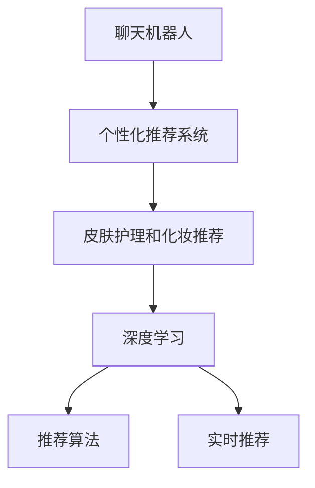

                 

## 1. 背景介绍

### 1.1 问题由来
随着移动互联网和人工智能技术的飞速发展，智能聊天机器人作为一种新型的交互方式，正在被广泛应用于各行各业，特别是在个性化推荐领域，如电商、新闻、音乐、视频等。以电商为例，智能聊天机器人可以根据用户的浏览记录、购买记录、搜索记录等数据，为用户推荐个性化商品，极大地提升了用户体验和交易转化率。然而，传统的基于内容的个性化推荐方法，往往只能简单地通过标签和特征匹配，难以真正理解用户的多样化需求和个性化偏好。

### 1.2 问题核心关键点
为了解决上述问题，引入个性化皮肤护理和化妆推荐这一具体应用场景，通过聊天机器人提供更加精细化和个性化的服务。聊天机器人根据用户的皮肤类型、肤质、年龄、需求等，提供精准的皮肤护理和化妆建议，帮助用户快速找到适合自己的产品。

### 1.3 问题研究意义
随着生活水平的提高，越来越多的消费者开始重视皮肤护理和化妆，寻求更加个性化的服务。传统的基于内容的推荐方法，无法满足用户的多样化和个性化需求。聊天机器人通过深度学习等先进技术，能够更全面地理解用户的实时需求，提供更加精准和个性化的推荐，从而提升用户体验，增加品牌忠诚度，带来巨大的商业价值。

## 2. 核心概念与联系

### 2.1 核心概念概述

为了更好地理解基于深度学习的聊天机器人美容业推荐系统，本节将介绍几个密切相关的核心概念：

- **聊天机器人(Chatbot)**：一种能够通过自然语言处理技术，与用户进行智能对话的应用。能够根据用户输入的语句，自动生成并回复，模拟人与人之间的对话体验。
- **个性化推荐系统(Recommendation System)**：通过用户的历史行为数据和偏好，为每个用户推荐最符合其需求的商品、内容、服务等。能够有效提升用户满意度，增加用户黏性。
- **皮肤护理和化妆推荐**：结合皮肤科学和化妆品知识，为用户提供个性化的皮肤护理方案和化妆品推荐。需要综合考虑用户的肤质、需求、偏好等因素，提供精准的推荐。
- **深度学习(Deep Learning)**：一种机器学习技术，通过多层次的非线性变换，从大规模数据中学习特征表示，进行分类、回归等任务。
- **推荐算法**：包括协同过滤、基于内容的推荐、基于矩阵分解的推荐等，是推荐系统实现的核心。
- **实时推荐**：通过实时分析用户的最新行为数据，动态调整推荐策略，提升推荐的相关性和时效性。

这些核心概念之间的逻辑关系可以通过以下Mermaid流程图来展示：



这个流程图展示了几者之间的联系：

1. 聊天机器人通过与用户的对话，收集用户的实时需求。
2. 将这些需求输入到个性化推荐系统中，通过深度学习等技术，动态生成推荐结果。
3. 推荐系统根据用户的历史行为和偏好，推荐皮肤护理方案和化妆品。
4. 推荐算法通过协同过滤、内容推荐等方法，提高推荐的相关性。
5. 实时推荐策略能够根据最新的用户数据，动态调整推荐结果，提升用户体验。

## 3. 核心算法原理 & 具体操作步骤
### 3.1 算法原理概述

基于深度学习的聊天机器人美容业推荐系统，主要包含以下几个关键步骤：

- 聊天机器人收集用户的实时对话信息，如肤质、需求、偏好等。
- 将用户的对话信息输入到深度学习模型中，得到用户画像。
- 根据用户画像和历史行为数据，通过推荐算法动态生成推荐结果。
- 实时推荐策略根据最新的用户数据，动态调整推荐策略，提升用户体验。

### 3.2 算法步骤详解

**Step 1: 构建用户画像**

用户画像包含了用户的各类特征，如肤质、年龄、偏好、消费习惯等，是推荐系统进行推荐的重要依据。构建用户画像的过程通常包括以下几个步骤：

1. 数据收集：通过聊天机器人收集用户的实时对话信息，如肤质、需求、偏好等。

2. 特征提取：使用NLP技术，对用户的对话信息进行特征提取，如关键词、情感等。

3. 画像融合：将用户的历史行为数据与实时对话信息进行融合，生成综合用户画像。

4. 画像存储：将用户画像存储在数据库中，供推荐系统调用。

**Step 2: 深度学习用户画像**

构建用户画像后，需要通过深度学习模型进一步优化和细化用户画像，以便更好地进行推荐。具体步骤如下：

1. 数据预处理：对用户画像进行归一化、分词、去除停用词等预处理。

2. 模型训练：使用深度学习模型，如BERT、Transformer等，对用户画像进行训练，得到更加精确的用户画像表示。

3. 画像更新：根据最新的用户对话信息，动态更新用户画像，保持画像的时效性和准确性。

**Step 3: 推荐算法生成推荐结果**

在用户画像的基础上，通过推荐算法生成推荐结果。推荐算法可以包括协同过滤、基于内容的推荐、基于矩阵分解的推荐等。具体步骤如下：

1. 数据收集：收集用户的历史行为数据，如浏览记录、购买记录等。

2. 模型训练：使用推荐算法对历史行为数据进行训练，得到推荐模型。

3. 结果生成：根据用户画像和推荐模型，动态生成推荐结果。

**Step 4: 实时推荐策略调整**

为了提升推荐的相关性和用户体验，实时推荐策略需要根据最新的用户数据，动态调整推荐策略。具体步骤如下：

1. 数据收集：实时收集用户的最新行为数据，如点击记录、购买记录等。

2. 策略调整：根据最新的行为数据，动态调整推荐策略，如调整推荐权重、添加推荐规则等。

3. 结果反馈：将调整后的推荐结果反馈给用户，并收集用户反馈，进一步优化推荐策略。

### 3.3 算法优缺点

基于深度学习的聊天机器人美容业推荐系统具有以下优点：

- 个性化程度高：深度学习模型能够全面理解用户的实时需求和历史偏好，生成更加精准的推荐结果。
- 实时响应：通过实时推荐策略，能够动态调整推荐结果，提升用户体验。
- 算法灵活：推荐算法可以根据不同的推荐场景进行灵活选择和组合。

同时，该方法也存在以下局限性：

- 数据需求高：构建用户画像和推荐系统，需要大量的用户数据，数据采集和处理成本较高。
- 模型复杂：深度学习模型的训练和优化过程较为复杂，需要较大的计算资源。
- 数据隐私：收集用户数据时，需要考虑用户的隐私保护和数据安全问题。
- 模型泛化性：深度学习模型的泛化性较强，但可能存在过拟合问题。

尽管存在这些局限性，但就目前而言，基于深度学习的推荐系统在推荐精度和用户体验方面已经取得了显著效果，成为推荐系统的主流范式。未来相关研究的重点在于如何进一步降低数据需求，提高模型的实时性和可解释性，同时兼顾数据隐私和模型泛化性等因素。

### 3.4 算法应用领域

基于深度学习的聊天机器人美容业推荐系统，已经在电商、新闻、音乐、视频等多个领域得到广泛应用。以下是几个典型的应用场景：

- 电商推荐：通过聊天机器人收集用户对话信息，动态生成个性化的商品推荐，提升用户体验和交易转化率。
- 新闻推荐：根据用户的阅读历史和偏好，动态生成个性化新闻推荐，提升用户粘性和满意度。
- 音乐推荐：收集用户的听歌历史和偏好，动态生成个性化音乐推荐，提升用户满意度和忠诚度。
- 视频推荐：通过聊天机器人收集用户的观看历史和偏好，动态生成个性化视频推荐，提升用户粘性和满意度。

除了上述这些经典应用外，美容业聊天机器人推荐系统还可以用于推荐皮肤护理产品、化妆品、护肤教程等，为用户提供更加全面、个性化的服务。

## 4. 数学模型和公式 & 详细讲解  
### 4.1 数学模型构建

本节将使用数学语言对基于深度学习的聊天机器人美容业推荐系统进行更加严格的刻画。

记用户画像为 $X$，推荐结果为 $Y$，其中 $X$ 为特征向量，$Y$ 为推荐结果向量。假设推荐模型为 $f: X \rightarrow Y$，其中 $f$ 为非线性映射函数。

**目标函数**：
$$
\min_{f} \frac{1}{N}\sum_{i=1}^N L(f(X_i), Y_i)
$$
其中 $L$ 为损失函数，$N$ 为样本数量。

**损失函数**：
$$
L(f(X_i), Y_i) = \sum_{j=1}^M (f(X_i)_j - Y_i_j)^2
$$
其中 $M$ 为推荐结果向量的维度。

**模型训练**：
$$
\theta = \mathop{\arg\min}_{\theta} \frac{1}{N}\sum_{i=1}^N \sum_{j=1}^M (f_{\theta}(X_i)_j - Y_i_j)^2
$$

### 4.2 公式推导过程

以下我们以协同过滤算法为例，推导推荐系统的数学模型和损失函数。

假设推荐系统有 $N$ 个用户和 $M$ 个物品，每个用户的历史行为矩阵为 $R \in \mathbb{R}^{N \times M}$，其中 $R_{ij} = 1$ 表示用户 $i$ 对物品 $j$ 有行为，$R_{ij} = 0$ 表示用户 $i$ 对物品 $j$ 没有行为。设用户 $i$ 的未行为物品向量为 $X_i$，推荐结果向量为 $Y_i$，其中 $X_i$ 为 $N \times M$ 的矩阵。

协同过滤的目标是找到一个低秩矩阵 $R' \in \mathbb{R}^{N \times M}$，使得 $R'$ 与 $R$ 尽可能相似。设低秩矩阵 $R'$ 的奇异值分解为 $R' = U \Sigma V^T$，其中 $U$ 和 $V$ 为 $N \times M$ 的正交矩阵，$\Sigma$ 为 $N \times M$ 的对角矩阵，对角线上的元素为奇异值。

推荐模型的目标函数为：
$$
\min_{U, V} \frac{1}{N}\sum_{i=1}^N \|R_i - R'_i\|_F^2
$$

其中 $\|.\|_F$ 为矩阵的Frobenius范数。

将推荐模型展开，得到：
$$
\min_{U, V} \frac{1}{N}\sum_{i=1}^N \sum_{j=1}^M (U_i^T R_{ij} V_j - R_i^T V_j)^2
$$

将 $U_i$ 和 $V_j$ 表示为矩阵形式，得到：
$$
\min_{U, V} \frac{1}{N}\sum_{i=1}^N \sum_{j=1}^M (U_i^T R_{ij} V_j - R_i^T V_j)^2 = \min_{U, V} \frac{1}{N}\sum_{i=1}^N \sum_{j=1}^M (U_i V_j^T R_{ij} - R_i V_j)^2
$$

将上式写成矩阵形式：
$$
\min_{U, V} \frac{1}{N} \text{Tr}((R - UV^T)^T (R - UV^T))
$$

其中 $\text{Tr}(.)$ 为矩阵的迹，即对角线元素之和。

该优化问题可以使用基于梯度的优化算法进行求解，如随机梯度下降、Adam等。

## 5. 项目实践：代码实例和详细解释说明
### 5.1 开发环境搭建

在进行推荐系统实践前，我们需要准备好开发环境。以下是使用Python进行TensorFlow开发的环境配置流程：

1. 安装Anaconda：从官网下载并安装Anaconda，用于创建独立的Python环境。

2. 创建并激活虚拟环境：
```bash
conda create -n tf-env python=3.8 
conda activate tf-env
```

3. 安装TensorFlow：根据CUDA版本，从官网获取对应的安装命令。例如：
```bash
conda install tensorflow==2.7.0
```

4. 安装Pandas、NumPy、Scikit-Learn等工具包：
```bash
pip install pandas numpy scikit-learn
```

完成上述步骤后，即可在`tf-env`环境中开始推荐系统实践。

### 5.2 源代码详细实现

下面我们以基于协同过滤算法的推荐系统为例，给出使用TensorFlow进行用户画像和推荐系统开发的Python代码实现。

首先，定义用户画像和推荐结果的模型：

```python
import tensorflow as tf
from tensorflow.keras.layers import Input, Embedding, Dense, Dot, concatenate

# 定义用户画像和推荐结果的模型
user_input = Input(shape=(N, M), dtype='float32', name='user_input')
item_input = Input(shape=(N, M), dtype='float32', name='item_input')

# 用户画像的嵌入层
user_embedding = Embedding(M, K, input_length=N)(user_input)

# 推荐结果的嵌入层
item_embedding = Embedding(M, K, input_length=N)(item_input)

# 用户画像和推荐结果的矩阵乘积
user_item_dot = Dot(axes=1)([user_embedding, item_embedding])

# 输出层
output = Dense(1, activation='sigmoid')(user_item_dot)

model = tf.keras.Model(inputs=[user_input, item_input], outputs=output)
```

然后，定义训练和评估函数：

```python
from tensorflow.keras import metrics, losses

# 定义损失函数和评价指标
loss = losses.BinaryCrossentropy()
metrics = [metrics.BinaryAccuracy('accuracy')]

# 编译模型
model.compile(optimizer='adam', loss=loss, metrics=metrics)

# 定义训练函数
def train_epoch(model, train_dataset, batch_size):
    model.train_on_batch(x=train_dataset, y=train_dataset.labels)
    return model.evaluate(x=test_dataset, y=test_dataset.labels)

# 定义测试函数
def evaluate(model, test_dataset, batch_size):
    return model.evaluate(x=test_dataset, y=test_dataset.labels)
```

最后，启动训练流程并在测试集上评估：

```python
epochs = 10
batch_size = 32

# 训练模型
history = model.fit(x=train_dataset, y=train_dataset.labels, epochs=epochs, batch_size=batch_size)

# 测试模型
test_loss, test_acc = evaluate(model, test_dataset, batch_size)
print(f'Test loss: {test_loss:.4f}')
print(f'Test accuracy: {test_acc:.4f}')
```

以上就是使用TensorFlow进行基于协同过滤算法的推荐系统开发的完整代码实现。可以看到，TensorFlow的高级API使得推荐系统的实现变得简洁高效。

### 5.3 代码解读与分析

让我们再详细解读一下关键代码的实现细节：

**用户画像和推荐结果模型**：
- `Input`层用于定义输入，其中`shape`参数指定输入的形状，`dtype`参数指定数据类型。
- `Embedding`层用于将输入转换为嵌入向量，其中`M`为词汇表大小，`K`为嵌入向量的维度，`input_length`指定输入的长度。
- `Dot`层用于计算用户画像和推荐结果的矩阵乘积，得到中间结果。
- `Dense`层用于定义输出，其中`1`为输出维度，`activation`参数指定激活函数。

**训练和评估函数**：
- `train_epoch`函数：用于模型训练，使用`train_on_batch`方法进行单批次训练。
- `evaluate`函数：用于模型评估，使用`evaluate`方法计算模型在测试集上的损失和评价指标。

**训练流程**：
- `epochs`和`batch_size`分别指定训练轮数和批次大小。
- 使用`fit`方法进行模型训练，返回训练过程中的历史记录。
- 使用`evaluate`方法在测试集上评估模型性能，打印输出测试损失和准确率。

可以看到，TensorFlow的高层API使得推荐系统的实现变得简单直观，开发者可以专注于模型的设计和优化。

## 6. 实际应用场景

### 6.1 智能客服

智能客服系统是聊天机器人推荐系统的经典应用场景之一。通过收集用户的咨询记录，分析用户的真实需求，智能客服系统能够提供个性化的服务，提升用户满意度。具体应用包括以下几个方面：

1. **用户画像构建**：通过对话记录，收集用户的皮肤类型、肤质、需求等信息，构建用户画像。
2. **推荐皮肤护理产品**：根据用户画像和历史行为数据，动态生成个性化的皮肤护理产品推荐。
3. **实时推荐调整**：根据用户的最新反馈和行为数据，动态调整推荐策略，提升用户体验。

### 6.2 电商推荐

电商推荐系统是聊天机器人推荐系统的另一个重要应用场景。通过收集用户的浏览记录、购买记录、搜索记录等数据，推荐系统能够为每个用户生成个性化的商品推荐，提升用户的购物体验和转化率。具体应用包括以下几个方面：

1. **用户画像构建**：通过用户的浏览记录、购买记录等数据，收集用户的特征信息，构建用户画像。
2. **推荐商品**：根据用户画像和历史行为数据，动态生成个性化的商品推荐。
3. **实时推荐调整**：根据用户的最新行为数据，动态调整推荐策略，提升推荐的相关性和时效性。

### 6.3 美容顾问

美容顾问聊天机器人是聊天机器人推荐系统的一个新应用场景。通过收集用户的肤质、需求、偏好等信息，美容顾问机器人能够提供个性化的皮肤护理方案和化妆品推荐，帮助用户更好地管理自己的皮肤。具体应用包括以下几个方面：

1. **用户画像构建**：通过用户的对话信息，收集用户的肤质、需求、偏好等信息，构建用户画像。
2. **推荐皮肤护理方案**：根据用户画像和历史行为数据，动态生成个性化的皮肤护理方案。
3. **推荐化妆品**：根据用户画像和历史行为数据，动态生成个性化的化妆品推荐。

## 7. 工具和资源推荐
### 7.1 学习资源推荐

为了帮助开发者系统掌握聊天机器人美容业推荐系统的理论基础和实践技巧，这里推荐一些优质的学习资源：

1. **《TensorFlow实战Google深度学习》**：Google官方出版的TensorFlow实战指南，全面介绍了TensorFlow的使用方法和深度学习模型训练。

2. **《深度学习入门：基于Python的理论与实现》**：深度学习入门必读书籍，详细讲解了深度学习的基本概念和实现方法。

3. **《推荐系统实战》**：阿里技术专家编写的推荐系统实战指南，涵盖了协同过滤、矩阵分解、基于内容的推荐等主流推荐算法。

4. **Coursera的《推荐系统专项课程》**：由斯坦福大学教授讲授的推荐系统课程，涵盖了推荐系统的基础理论、算法实现和应用案例。

5. **Kaggle竞赛**：Kaggle平台上有众多推荐系统相关的竞赛和数据集，通过参与竞赛，可以积累实战经验和提升技能。

通过对这些资源的学习实践，相信你一定能够快速掌握聊天机器人美容业推荐系统的精髓，并用于解决实际的推荐问题。

### 7.2 开发工具推荐

高效的开发离不开优秀的工具支持。以下是几款用于聊天机器人美容业推荐系统开发的常用工具：

1. **TensorFlow**：基于Python的开源深度学习框架，灵活动态的计算图，适合快速迭代研究。具有丰富的推荐系统组件，如TensorFlow Recommenders。

2. **PyTorch**：基于Python的开源深度学习框架，灵活的动态计算图，适合模型研究和优化。提供了丰富的深度学习组件，如PyTorch Lite。

3. **Scikit-Learn**：基于Python的机器学习库，提供了丰富的推荐系统算法，如协同过滤、基于内容的推荐等。

4. **Jupyter Notebook**：支持Python代码的在线编辑器，方便快速迭代和共享代码。

5. **Git**：版本控制系统，方便多人协作开发和代码管理。

合理利用这些工具，可以显著提升聊天机器人美容业推荐系统的开发效率，加快创新迭代的步伐。

### 7.3 相关论文推荐

聊天机器人美容业推荐系统的发展源于学界的持续研究。以下是几篇奠基性的相关论文，推荐阅读：

1. **《Attention Is All You Need》**：提出Transformer结构，开启了NLP领域的预训练大模型时代。

2. **《A Neural Collaborative Filtering Model》**：提出基于神经网络的协同过滤模型，成为推荐系统的主流算法之一。

3. **《Deep Recommendation with Multi-View Matrix Factorization》**：提出多视图矩阵分解的推荐方法，进一步提升了推荐精度。

4. **《BPR: Bayesian Personalized Ranking from Implicit Feedback》**：提出基于贝叶斯的网络协同过滤方法，广泛应用于推荐系统。

5. **《Contextual Deep Neural Network based Recommender System》**：提出基于上下文的多层神经网络推荐模型，提升了推荐系统的性能。

这些论文代表了大语言模型微调技术的发展脉络。通过学习这些前沿成果，可以帮助研究者把握学科前进方向，激发更多的创新灵感。

## 8. 总结：未来发展趋势与挑战

### 8.1 总结

本文对基于深度学习的聊天机器人美容业推荐系统进行了全面系统的介绍。首先阐述了聊天机器人推荐系统在电商、新闻、音乐、视频等多个领域的应用，明确了推荐系统在提升用户体验、增加用户黏性方面的重要价值。其次，从原理到实践，详细讲解了推荐系统的核心算法和具体操作步骤，给出了推荐系统开发的完整代码实例。同时，本文还探讨了推荐系统在智能客服、电商推荐、美容顾问等实际应用场景中的具体应用，展示了推荐系统的广泛应用前景。最后，本文精选了推荐系统的各类学习资源，力求为读者提供全方位的技术指引。

通过本文的系统梳理，可以看到，基于深度学习的推荐系统正在成为推荐系统的主流范式，极大地提升了推荐精度和用户体验。推荐系统结合聊天机器人技术，能够更加全面地理解用户的实时需求和历史偏好，生成更加精准和个性化的推荐，从而提升用户体验，增加品牌忠诚度，带来巨大的商业价值。未来，伴随深度学习技术的进一步发展，推荐系统必将在更广阔的应用领域大放异彩，深刻影响人类的生产生活方式。

### 8.2 未来发展趋势

展望未来，聊天机器人美容业推荐系统将呈现以下几个发展趋势：

1. **多模态融合**：推荐系统将融合视觉、语音、文本等多种模态信息，实现跨模态推荐，提升推荐的相关性和准确性。

2. **实时动态调整**：推荐系统将通过实时分析用户数据，动态调整推荐策略，提升推荐的相关性和时效性。

3. **个性化推荐**：推荐系统将结合用户的实时行为和历史数据，提供更加个性化的推荐，提升用户体验。

4. **隐私保护**：推荐系统将更加注重用户隐私保护，采用差分隐私、联邦学习等技术，确保用户数据的安全。

5. **模型可解释性**：推荐系统将引入可解释性算法，帮助用户理解推荐结果的来源和逻辑，提升用户信任度。

6. **跨领域推荐**：推荐系统将跨领域进行协同推荐，提升推荐的多样性和全面性，增强用户的满意度。

以上趋势凸显了聊天机器人美容业推荐系统的广阔前景。这些方向的探索发展，必将进一步提升推荐系统的性能和应用范围，为人类认知智能的进化带来深远影响。

### 8.3 面临的挑战

尽管聊天机器人美容业推荐系统已经取得了显著效果，但在迈向更加智能化、普适化应用的过程中，仍面临诸多挑战：

1. **数据需求高**：构建推荐系统需要大量的用户数据，数据采集和处理成本较高。如何高效收集和处理数据，是一个重要挑战。

2. **模型复杂性**：深度学习模型的训练和优化过程较为复杂，需要较大的计算资源。如何降低模型的复杂性，提高训练效率，是一个重要挑战。

3. **用户隐私**：收集用户数据时，需要考虑用户的隐私保护和数据安全问题。如何保障用户数据安全，避免数据泄露和滥用，是一个重要挑战。

4. **模型泛化性**：深度学习模型的泛化性较强，但可能存在过拟合问题。如何提升模型的泛化性，避免过拟合，是一个重要挑战。

5. **模型可解释性**：推荐系统中的深度学习模型缺乏可解释性，难以理解推荐结果的来源和逻辑。如何提高模型的可解释性，是一个重要挑战。

6. **技术融合**：推荐系统需要与聊天机器人、电商、美容顾问等技术进行融合，实现协同工作。如何实现技术融合，提升系统性能，是一个重要挑战。

正视这些挑战，积极应对并寻求突破，将使聊天机器人美容业推荐系统走向成熟。相信随着学界和产业界的共同努力，这些挑战终将一一被克服，推荐系统必将在构建人机协同的智能时代中扮演越来越重要的角色。

### 8.4 研究展望

面对聊天机器人美容业推荐系统所面临的种种挑战，未来的研究需要在以下几个方面寻求新的突破：

1. **多模态推荐**：融合视觉、语音、文本等多种模态信息，实现跨模态推荐，提升推荐的相关性和准确性。

2. **实时动态推荐**：通过实时分析用户数据，动态调整推荐策略，提升推荐的相关性和时效性。

3. **个性化推荐**：结合用户的实时行为和历史数据，提供更加个性化的推荐，提升用户体验。

4. **隐私保护**：采用差分隐私、联邦学习等技术，确保用户数据的安全，提升用户信任度。

5. **模型可解释性**：引入可解释性算法，帮助用户理解推荐结果的来源和逻辑，提升用户信任度。

6. **跨领域推荐**：跨领域进行协同推荐，提升推荐的多样性和全面性，增强用户的满意度。

这些研究方向的探索，必将引领聊天机器人美容业推荐系统技术迈向更高的台阶，为构建安全、可靠、可解释、可控的智能系统铺平道路。面向未来，聊天机器人美容业推荐系统需要与其他人工智能技术进行更深入的融合，如知识表示、因果推理、强化学习等，多路径协同发力，共同推动智能交互系统的进步。只有勇于创新、敢于突破，才能不断拓展推荐系统的边界，让智能技术更好地造福人类社会。

## 9. 附录：常见问题与解答

**Q1：如何选择合适的推荐算法？**

A: 选择合适的推荐算法需要根据具体应用场景和数据特点进行评估。常见的推荐算法包括协同过滤、基于内容的推荐、基于矩阵分解的推荐等。协同过滤适用于用户和物品数目较少的情况，基于内容的推荐适用于数据稀疏的情况，基于矩阵分解的推荐适用于数据密集的情况。在实际应用中，可以采用混合推荐算法，结合多种算法的优点，提升推荐效果。

**Q2：推荐系统如何处理数据稀疏性问题？**

A: 推荐系统中的数据通常存在稀疏性问题，即用户和物品之间的交互数据较少。为了处理数据稀疏性，可以采用以下方法：

1. 数据填充：通过冷启动、随机生成等方式，填充缺失的数据。

2. 矩阵分解：使用矩阵分解算法，如奇异值分解、矩阵分解等，将稀疏矩阵转换为稠密矩阵。

3. 基于协同过滤的推荐：使用协同过滤算法，如基于用户协同的推荐、基于物品协同的推荐等，提升推荐精度。

4. 基于内容推荐的推荐：使用基于内容的推荐算法，如基于特征的推荐、基于标签的推荐等，提升推荐精度。

以上方法可以结合使用，根据具体应用场景选择合适的处理方式。

**Q3：推荐系统如何应对用户行为变化？**

A: 推荐系统需要不断适应用户行为的变化，动态调整推荐策略。常见的应对方法包括：

1. 实时分析：实时分析用户的最新行为数据，动态调整推荐策略。

2. 增量学习：使用增量学习算法，不断更新推荐模型，适应用户行为的变化。

3. 多视图融合：融合多种用户行为数据，提升推荐系统的鲁棒性和泛化性。

4. 用户反馈：通过用户反馈，调整推荐策略，提升推荐的相关性。

以上方法可以结合使用，根据具体应用场景选择合适的应对方式。

**Q4：推荐系统如何提升用户满意度？**

A: 提升用户满意度是推荐系统的最终目标。常见的提升方法包括：

1. 个性化推荐：根据用户的实时行为和历史数据，提供更加个性化的推荐，提升用户满意度。

2. 实时动态推荐：通过实时分析用户数据，动态调整推荐策略，提升推荐的相关性和时效性。

3. 多模态融合：融合多种模态信息，提升推荐的相关性和准确性。

4. 用户反馈：通过用户反馈，调整推荐策略，提升推荐的相关性。

5. 跨领域推荐：跨领域进行协同推荐，提升推荐的多样性和全面性，增强用户的满意度。

以上方法可以结合使用，根据具体应用场景选择合适的提升方式。

---

作者：禅与计算机程序设计艺术 / Zen and the Art of Computer Programming

