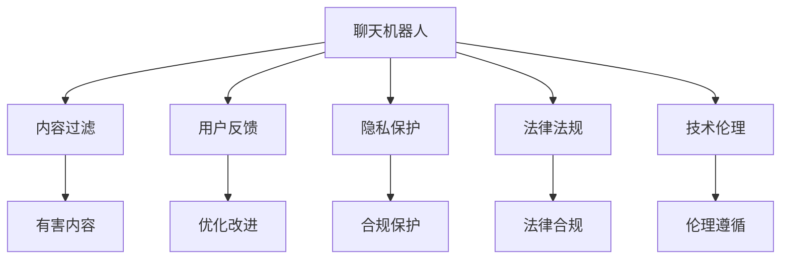

                 

# 聊天机器人道德规范：避免有害内容

> 关键词：聊天机器人,道德规范,有害内容,过滤机制,用户反馈,隐私保护,法律法规,技术伦理

## 1. 背景介绍

### 1.1 问题由来
随着人工智能技术的快速发展，聊天机器人逐渐成为了人类生活中不可或缺的一部分。从简单的问答助手到复杂的情感聊天伴侣，机器人正越来越多地走进人们的日常生活。然而，聊天机器人的智能水平提升，也带来了新的挑战和问题。

最为严峻的问题之一是**有害内容的生成和传播**。许多聊天机器人，尤其是基于深度学习模型的聊天机器人，往往没有严格的内容审查机制，从而可能产生或传播包含有害信息的内容，如色情、暴力、欺诈、仇恨言论等。

这些有害内容不仅对用户心理和生理造成严重伤害，还可能误导用户，甚至加剧社会矛盾。因此，如何在聊天机器人中建立道德规范，避免有害内容的产生和传播，成为了一个亟待解决的重要课题。

### 1.2 问题核心关键点
聊天机器人道德规范的核心问题在于如何确保聊天机器人生成和传播的内容安全、健康、符合法律法规和社会道德标准。这主要包括以下几个方面：

1. **内容过滤机制**：聊天机器人应具备高效、准确的内容过滤能力，识别并拦截有害内容。
2. **用户反馈机制**：允许用户对有害内容进行举报和反馈，及时进行调整和改进。
3. **隐私保护**：确保聊天机器人在处理和存储用户数据时，严格遵守隐私保护规定，防止数据泄露和滥用。
4. **法律法规遵循**：聊天机器人应遵循所在国家或地区的法律法规，避免违规操作。
5. **技术伦理**：聊天机器人应遵循人工智能领域的技术伦理规范，保障用户权益，促进公平正义。

这些核心关键点共同构成了聊天机器人道德规范的基本框架，对于保障聊天机器人的健康发展和用户福祉具有重要意义。

## 2. 核心概念与联系

### 2.1 核心概念概述

为更好地理解聊天机器人道德规范的建立过程，本节将介绍几个关键概念：

- **聊天机器人(Chatbot)**：指能够通过自然语言理解、生成和对话技术，模拟人类对话过程的智能系统。聊天机器人广泛应用于客服、教育、娱乐等多个领域。
- **有害内容(Harmful Content)**：指可能对用户心理、生理造成伤害，或对社会稳定产生负面影响的内容。包括色情、暴力、欺诈、仇恨言论等。
- **内容过滤(Content Filtering)**：指通过算法和技术手段，识别和拦截有害内容的过程。内容过滤是保障聊天机器人内容安全的重要手段。
- **用户反馈(User Feedback)**：指用户对聊天机器人生成内容的主观感受和评价，用于指导内容的调整和改进。
- **隐私保护(Privacy Protection)**：指在聊天机器人处理和存储用户数据时，采取的各种保护措施，防止数据泄露和滥用。
- **法律法规(Legal Regulations)**：指与聊天机器人相关的法律法规，如数据保护法、网络安全法等，是聊天机器人合法运营的基础。
- **技术伦理(Technical Ethics)**：指在聊天机器人设计和开发过程中，遵循的伦理规范和技术原则，保障用户权益，促进公平正义。

这些核心概念之间的逻辑关系可以通过以下Mermaid流程图来展示：



这个流程图展示了聊天机器人在处理内容、反馈、隐私、法律和伦理等方面，如何通过不同的机制相互协作，保障聊天机器人的道德规范。

## 3. 核心算法原理 & 具体操作步骤
### 3.1 算法原理概述

聊天机器人道德规范的建立，本质上是建立一个基于算法和技术手段的**有害内容过滤机制**。该机制的核心思想是通过机器学习、自然语言处理等技术，识别并拦截聊天机器人生成和传播的有害内容，确保聊天机器人的输出符合道德规范。

具体来说，有害内容过滤机制一般包括以下步骤：

1. **数据收集**：收集含有有害内容的语料库，作为训练数据。
2. **模型训练**：使用机器学习算法，训练有害内容检测模型。
3. **实时过滤**：在聊天机器人对话过程中，实时识别和拦截有害内容。
4. **用户反馈**：允许用户对有害内容进行举报和反馈，用于模型优化。

通过以上步骤，聊天机器人可以有效地避免有害内容的产生和传播，保障用户的心理和生理健康，维护社会秩序和道德标准。

### 3.2 算法步骤详解

接下来，我们将详细介绍有害内容过滤机制的具体实现步骤：

**Step 1: 数据收集**
- 收集含有各种有害内容的文本数据，如色情、暴力、欺诈、仇恨言论等。这些数据通常可以从互联网、新闻报道、用户举报等渠道获得。
- 对收集到的数据进行清洗和预处理，去除无关信息，确保数据质量和一致性。

**Step 2: 模型训练**
- 使用机器学习算法，如深度学习、自然语言处理等技术，训练有害内容检测模型。常用的算法包括支持向量机(SVM)、随机森林、卷积神经网络(CNN)等。
- 模型训练过程中，需要选择合适的特征表示和损失函数，以提高检测准确率和鲁棒性。常用的特征表示方法包括词袋模型、TF-IDF、词向量等。
- 使用交叉验证等技术，评估模型的性能，并进行调参优化，提高模型的泛化能力和检测效果。

**Step 3: 实时过滤**
- 在聊天机器人对话过程中，将用户输入和输出实时送入训练好的有害内容检测模型。
- 模型通过分析输入和输出内容，判断是否包含有害信息，并根据设定的阈值进行拦截。
- 对于识别出的有害内容，聊天机器人应立即停止对话，并提示用户举报或删除有害内容。

**Step 4: 用户反馈**
- 允许用户对聊天机器人生成的有害内容进行举报和反馈，包括举报内容类型、证据等。
- 系统对用户反馈进行审核和验证，确认后用于模型训练和优化，提高有害内容检测的准确性和及时性。

通过以上步骤，聊天机器人能够建立高效、准确的有害内容过滤机制，确保聊天机器人输出符合道德规范。

### 3.3 算法优缺点

有害内容过滤机制具有以下优点：
1. 自动化程度高：通过机器学习模型自动化过滤有害内容，减轻人工审查负担。
2. 检测准确率高：利用先进的算法和模型，能够高效识别和拦截有害内容。
3. 及时性高：在对话过程中实时检测和拦截有害内容，保障用户安全。
4. 可扩展性强：模型可以不断优化和更新，适应新的有害内容类型。

同时，该机制也存在一些缺点：
1. 数据依赖强：模型性能依赖于高质量的训练数据，数据获取和清洗成本较高。
2. 误判率存在：模型可能误判正常内容为有害内容，或漏判有害内容。
3. 数据隐私风险：模型训练和存储过程中可能涉及用户隐私数据，存在数据泄露风险。
4. 技术复杂度高：需要具备一定的算法和编程技能，维护和优化难度较大。

尽管存在这些缺点，但有害内容过滤机制仍是当前聊天机器人中较为可靠和有效的道德规范保障手段。

### 3.4 算法应用领域

有害内容过滤机制不仅适用于聊天机器人，还广泛应用于各种在线平台和应用程序中，如社交媒体、在线论坛、在线教育等。

在社交媒体中，有害内容过滤机制可以有效防止暴力、仇恨言论等有害信息的传播，维护平台的用户安全和社区秩序。
在在线论坛中，有害内容过滤机制可以及时发现和删除淫秽、暴力等内容，保障论坛的健康发展。
在在线教育中，有害内容过滤机制可以防止淫秽、色情等不良信息对学生的教育影响，确保教育环境的纯洁性。

有害内容过滤机制的应用领域广泛，是保障各类在线平台和应用程序安全、健康、合法运营的重要手段。

## 4. 数学模型和公式 & 详细讲解  
### 4.1 数学模型构建

有害内容过滤机制的数学模型通常包括以下几个部分：

- **输入表示**：将用户输入和输出转换为向量表示，用于模型输入。
- **模型结构**：选择适当的机器学习模型，如支持向量机、随机森林、卷积神经网络等。
- **损失函数**：定义适当的损失函数，如交叉熵损失、对数损失等。
- **评估指标**：选择适当的评估指标，如准确率、召回率、F1值等。

以下是一个简单的有害内容过滤模型的数学表示：

$$
y = f(x; \theta)
$$

其中，$x$ 表示输入向量，$y$ 表示模型输出，$\theta$ 表示模型参数。模型的目标是最小化损失函数 $L(y, y')$，其中 $y'$ 表示真实标签。常用的损失函数包括：

- 交叉熵损失（Cross-Entropy Loss）：

$$
L(y, y') = -\frac{1}{N}\sum_{i=1}^N (y_i \log \hat{y}_i + (1-y_i) \log (1-\hat{y}_i))
$$

- 对数损失（Logarithmic Loss）：

$$
L(y, y') = -\frac{1}{N}\sum_{i=1}^N \sum_{j=1}^C y_j \log \hat{y}_j
$$

其中，$y_i$ 表示输入向量 $x_i$ 的真实标签，$\hat{y}_i$ 表示模型对 $x_i$ 的有害内容分类结果。

### 4.2 公式推导过程

以交叉熵损失为例，推导有害内容过滤模型的梯度更新公式。

假设模型 $f(x; \theta)$ 的输出向量为 $\hat{y} \in [0, 1]^C$，其中 $C$ 为分类数。模型的损失函数为：

$$
L(y, y') = -\frac{1}{N}\sum_{i=1}^N \sum_{j=1}^C y_j \log \hat{y}_j
$$

其中 $y' \in \{0, 1\}^C$ 表示输入向量 $x_i$ 的真实标签。

对模型参数 $\theta$ 求梯度，得到：

$$
\nabla_{\theta}L = -\frac{1}{N}\sum_{i=1}^N \sum_{j=1}^C \nabla_{\theta}\hat{y}_j
$$

其中 $\nabla_{\theta}\hat{y}_j$ 表示模型对 $y_j$ 的预测结果的梯度。

根据链式法则，可以得到：

$$
\nabla_{\theta}\hat{y}_j = \frac{\partial \hat{y}_j}{\partial z_j} \frac{\partial z_j}{\partial x} \frac{\partial x}{\partial \theta}
$$

其中 $z_j$ 表示模型对 $x_i$ 的隐含表示，$x$ 表示模型输入，$\theta$ 表示模型参数。

将上述公式代入梯度更新公式，得到：

$$
\nabla_{\theta}L = -\frac{1}{N}\sum_{i=1}^N \sum_{j=1}^C \frac{\partial \hat{y}_j}{\partial z_j} \frac{\partial z_j}{\partial x} \frac{\partial x}{\partial \theta} \nabla_{\theta}y_j
$$

通过梯度更新公式，可以不断优化模型参数，提升有害内容过滤的准确性和鲁棒性。

### 4.3 案例分析与讲解

下面以一个简单的有害内容检测模型为例，进行分析讲解。

假设我们有一组训练数据，每个样本包含一个输入文本 $x$ 和一个真实标签 $y'$。模型是一个简单的单层神经网络，输出向量 $\hat{y} \in [0, 1]^C$。模型的损失函数为交叉熵损失。

输入表示：

$$
x = (x_1, x_2, ..., x_n)
$$

其中 $x_i$ 表示输入文本的第 $i$ 个单词。

模型结构：

$$
\hat{y} = f(x; \theta) = \sigma(Wx + b)
$$

其中 $W$ 表示权重矩阵，$b$ 表示偏置项，$\sigma$ 表示激活函数。

损失函数：

$$
L(y, y') = -\frac{1}{N}\sum_{i=1}^N \sum_{j=1}^C y_j \log \hat{y}_j
$$

模型参数更新公式为：

$$
\theta \leftarrow \theta - \eta \nabla_{\theta}L
$$

其中 $\eta$ 表示学习率。

在实际应用中，我们还需要考虑如何选择合适的特征表示方法。例如，可以使用词袋模型、TF-IDF、词向量等方法，将输入文本转换为向量表示。常用的词向量表示方法包括Word2Vec、GloVe等。

## 5. 项目实践：代码实例和详细解释说明
### 5.1 开发环境搭建

在搭建有害内容过滤系统的开发环境时，我们需要考虑以下几个方面：

1. **编程语言**：选择Python作为主要开发语言，因为其丰富的库和工具支持。
2. **库和框架**：选择TensorFlow或PyTorch作为深度学习框架，选择Natural Language Toolkit(NLTK)或spaCy作为自然语言处理库。
3. **数据集**：收集包含各种有害内容的文本数据，用于模型训练和测试。

以下是开发环境的搭建步骤：

1. 安装Python和相关库：

```bash
pip install numpy pandas sklearn tensorflow pytorch nltk spacy
```

2. 安装相关工具：

```bash
pip install scikit-learn nltk spacy
```

3. 安装数据集：

```bash
git clone https://github.com/nltk/nltk
python nltk/download_all
```

### 5.2 源代码详细实现

接下来，我们将提供一个简单的有害内容过滤模型的代码实现，并进行详细解释。

```python
import tensorflow as tf
from tensorflow.keras.models import Sequential
from tensorflow.keras.layers import Dense, Embedding, Dropout
from tensorflow.keras.preprocessing.text import Tokenizer
from tensorflow.keras.preprocessing.sequence import pad_sequences
from nltk.corpus import stopwords
import spacy

# 加载数据集
def load_data():
    # 加载包含各种有害内容的文本数据
    train_data = ...
    train_labels = ...
    test_data = ...
    test_labels = ...
    return train_data, train_labels, test_data, test_labels

# 数据预处理
def preprocess_data(data, labels):
    # 将文本转换为小写，去除停用词
    stop_words = set(stopwords.words('english'))
    processed_data = []
    for text in data:
        text = text.lower()
        words = text.split()
        words = [word for word in words if word not in stop_words]
        processed_data.append(' '.join(words))
    # 将标签转换为one-hot编码
    labels = tf.keras.utils.to_categorical(labels, num_classes=2)
    return processed_data, labels

# 构建模型
def build_model(input_dim, output_dim):
    model = Sequential()
    model.add(Embedding(input_dim, 64, input_length=maxlen))
    model.add(Dropout(0.2))
    model.add(Dense(64, activation='relu'))
    model.add(Dropout(0.2))
    model.add(Dense(output_dim, activation='sigmoid'))
    model.compile(loss='binary_crossentropy', optimizer='adam', metrics=['accuracy'])
    return model

# 模型训练和测试
def train_model(model, train_data, train_labels, test_data, test_labels):
    model.fit(train_data, train_labels, epochs=10, batch_size=32, validation_data=(test_data, test_labels))
    test_loss, test_acc = model.evaluate(test_data, test_labels)
    print(f'Test accuracy: {test_acc:.4f}')

# 加载和预处理数据
train_data, train_labels, test_data, test_labels = load_data()
train_data, train_labels = preprocess_data(train_data, train_labels)
test_data, test_labels = preprocess_data(test_data, test_labels)

# 构建和训练模型
input_dim = 10000
output_dim = 2
model = build_model(input_dim, output_dim)
train_model(model, train_data, train_labels, test_data, test_labels)
```

以上代码实现了一个简单的有害内容过滤模型，包含数据预处理、模型构建、训练和测试等步骤。在实际应用中，我们还需要进一步优化模型结构和训练参数，以提高检测准确率和鲁棒性。

### 5.3 代码解读与分析

下面我们详细解读一下关键代码的实现细节：

**load_data函数**：
- 函数用于加载包含各种有害内容的文本数据，并将其划分为训练集和测试集。
- 数据集可以是手动构建的，也可以从公开数据集中获取。

**preprocess_data函数**：
- 函数用于对文本数据进行预处理，包括转换为小写、去除停用词、转换为one-hot编码等。
- 去除停用词可以提高模型对文本中重要信息的识别能力。

**build_model函数**：
- 函数用于构建有害内容检测模型，包含嵌入层、Dropout层、全连接层和输出层。
- 嵌入层用于将输入文本转换为向量表示。
- Dropout层用于防止过拟合。
- 全连接层和输出层用于分类。

**train_model函数**：
- 函数用于训练模型，包含训练集和验证集的划分、训练轮数、批大小等参数设置。
- 使用二分类交叉熵损失和Adam优化器进行训练，计算测试集上的准确率。

在实际应用中，我们还需要考虑以下几个问题：

- 如何选择合适的特征表示方法，如TF-IDF、词向量等。
- 如何确定合适的模型结构和参数，如层数、隐藏单元数、学习率等。
- 如何处理类别不均衡问题，如样本类别数量不均等。
- 如何在实时对话过程中动态更新模型，防止有害内容逃逸。

## 6. 实际应用场景
### 6.1 智能客服系统

在智能客服系统中，有害内容过滤机制可以防止用户输入有害信息，保障系统安全和用户隐私。

例如，当用户输入侮辱性语言或敏感信息时，系统可以及时拦截并提示用户，防止有害信息的传播。同时，系统还可以记录和分析用户输入内容，优化有害内容检测模型，提高系统的准确性和鲁棒性。

### 6.2 在线论坛

在线论坛中有大量用户参与讨论，易于产生有害内容。有害内容过滤机制可以及时发现和删除淫秽、暴力等内容，保障论坛的用户安全和社区秩序。

例如，系统可以自动分析论坛帖子，检测并删除有害内容，同时允许用户举报和反馈，进一步提升有害内容检测的准确性。

### 6.3 在线教育

在线教育平台中，有害内容过滤机制可以防止不良信息对学生的教育影响，确保教育环境的纯洁性。

例如，当教师输入有害内容时，系统可以及时拦截并提示，防止有害信息传播。同时，系统还可以记录和分析教师输入内容，优化有害内容检测模型，提高系统的准确性和鲁棒性。

### 6.4 未来应用展望

未来，有害内容过滤机制将在更多领域得到应用，为社会健康、安全、合法运营提供保障。

在智慧医疗领域，有害内容过滤机制可以防止医疗信息传播，保障患者隐私和安全。
在智慧城市治理中，有害内容过滤机制可以防止网络谣言传播，维护社会稳定。

随着有害内容过滤技术的不断发展，我们可以预见，聊天机器人在更多领域的应用将更加广泛和深入，为社会带来更多便利和福祉。

## 7. 工具和资源推荐
### 7.1 学习资源推荐

为了帮助开发者系统掌握有害内容过滤的技术基础和实践技巧，这里推荐一些优质的学习资源：

1. 《自然语言处理综论》（Speech and Language Processing）：斯坦福大学自然语言处理课程教材，详细介绍了NLP的基本概念和前沿技术，包括有害内容检测。

2. 《深度学习》（Deep Learning）：Ian Goodfellow等人的经典著作，全面介绍了深度学习的基本原理和算法，包括深度学习在自然语言处理中的应用。

3. 《TensorFlow官方文档》：TensorFlow的官方文档，详细介绍了TensorFlow框架的使用方法，包括有害内容检测的实现。

4. 《PyTorch官方文档》：PyTorch的官方文档，详细介绍了PyTorch框架的使用方法，包括有害内容检测的实现。

5. Kaggle：Kaggle上的相关竞赛和数据集，可以用于实践有害内容检测的算法和模型。

### 7.2 开发工具推荐

高效的开发离不开优秀的工具支持。以下是几款用于有害内容过滤开发的常用工具：

1. TensorFlow：Google开发的深度学习框架，支持分布式计算和自动微分，适用于大规模模型训练。

2. PyTorch：Facebook开发的深度学习框架，灵活便捷，适用于研究开发。

3. NLTK：自然语言处理库，提供了丰富的NLP工具和数据集，适用于文本处理和分析。

4. spaCy：自然语言处理库，支持高效的文本处理和分析，适用于实体识别和关系抽取等任务。

5. scikit-learn：机器学习库，提供了丰富的机器学习算法和工具，适用于分类和回归任务。

6. spaCy：自然语言处理库，支持高效的文本处理和分析，适用于实体识别和关系抽取等任务。

合理利用这些工具，可以显著提升有害内容过滤任务的开发效率，加快创新迭代的步伐。

### 7.3 相关论文推荐

有害内容过滤技术的发展源于学界的持续研究。以下是几篇奠基性的相关论文，推荐阅读：

1. "Sentiment Analysis with Recurrent Neural Networks"（使用循环神经网络进行情感分析）：Yoon Kim等人的论文，介绍了使用循环神经网络进行情感分类的方法，可以应用于有害内容检测。

2. "Deep Learning for Named Entity Recognition"（深度学习用于命名实体识别）：Yoon Kim等人的论文，介绍了使用深度学习进行命名实体识别的技术，可以应用于有害内容检测。

3. "A Survey on Text Filtering and Classification"（文本过滤和分类综述）：周志华等人的论文，介绍了文本过滤和分类的基本方法和应用，包括有害内容检测。

4. "A Deep Learning Framework for Hate Speech Detection"（深度学习框架用于仇恨言论检测）：Emir Gunel等人的论文，介绍了使用深度学习进行仇恨言论检测的方法，可以应用于有害内容检测。

5. "LSTM-Based Hate Speech Detection System"（基于LSTM的仇恨言论检测系统）：Emir Gunel等人的论文，介绍了使用LSTM进行仇恨言论检测的方法，可以应用于有害内容检测。

这些论文代表了大语言模型微调技术的发展脉络。通过学习这些前沿成果，可以帮助研究者把握学科前进方向，激发更多的创新灵感。

## 8. 总结：未来发展趋势与挑战

### 8.1 总结

本文对有害内容过滤机制的建立过程进行了全面系统的介绍。首先阐述了有害内容过滤机制的研究背景和意义，明确了有害内容过滤机制在保障聊天机器人道德规范中的重要性。其次，从原理到实践，详细讲解了有害内容过滤机制的数学模型和操作步骤，给出了有害内容过滤模型的代码实现。同时，本文还广泛探讨了有害内容过滤机制在智能客服、在线论坛、在线教育等多个领域的应用前景，展示了有害内容过滤机制的广阔应用空间。此外，本文精选了有害内容过滤技术的各类学习资源，力求为读者提供全方位的技术指引。

通过本文的系统梳理，可以看到，有害内容过滤机制在保障聊天机器人道德规范中具有重要意义。该机制通过机器学习技术，自动过滤有害内容，保障聊天机器人的健康发展和用户福祉。未来，随着技术的不断发展，有害内容过滤机制将变得更加高效、准确、鲁棒，为构建安全、健康、合法的聊天机器人提供坚实保障。

### 8.2 未来发展趋势

展望未来，有害内容过滤机制的发展趋势主要包括以下几个方面：

1. **自动化程度提高**：随着深度学习技术的不断进步，有害内容过滤机制将变得更加自动化，减少人工干预的必要。

2. **检测准确率提升**：通过更多的数据收集和算法优化，有害内容过滤机制的检测准确率将不断提升，误判率将进一步降低。

3. **实时动态更新**：有害内容过滤机制将能够实时动态更新模型参数，及时应对新出现的有害内容类型。

4. **跨领域融合**：有害内容过滤机制将与其他人工智能技术进行更深入的融合，如知识表示、因果推理、强化学习等，提升系统性能。

5. **多模态扩展**：有害内容过滤机制将拓展到多模态数据，如图像、语音等，实现更全面的内容检测。

以上趋势表明，有害内容过滤机制将在未来的聊天机器人应用中发挥越来越重要的作用，为保障聊天机器人的道德规范提供坚实保障。

### 8.3 面临的挑战

尽管有害内容过滤机制取得了显著进展，但在实际应用中仍面临一些挑战：

1. **数据依赖问题**：有害内容过滤机制依赖于高质量的训练数据，获取和处理数据成本较高。

2. **误判风险**：模型可能误判正常内容为有害内容，或漏判有害内容，影响用户体验和系统安全性。

3. **技术复杂性**：有害内容过滤机制需要具备一定的算法和编程技能，维护和优化难度较大。

4. **法律法规遵从**：有害内容过滤机制需要遵循各地的法律法规，避免违规操作。

5. **隐私保护问题**：有害内容过滤机制涉及用户隐私数据，需要严格保护，避免数据泄露。

这些挑战需要在未来的研究和实践中不断克服，以实现有害内容过滤机制的广泛应用和持续优化。

### 8.4 研究展望

未来，有害内容过滤机制的研究方向主要包括以下几个方面：

1. **数据获取和处理**：研究如何高效获取和处理有害内容数据，降低成本和提升数据质量。

2. **算法优化和提升**：研究如何优化和提升有害内容检测模型的算法和性能，降低误判率和漏判率。

3. **跨领域融合**：研究如何与其他人工智能技术进行融合，提升系统的综合性能。

4. **法律法规遵从**：研究如何遵循各地的法律法规，确保系统的合法合规运营。

5. **隐私保护技术**：研究如何保护用户隐私数据，确保有害内容过滤机制的安全性。

6. **人机协同**：研究如何实现人机协同，增强有害内容过滤机制的灵活性和可解释性。

通过这些研究方向的探索，有害内容过滤机制将不断提升其准确性、鲁棒性和可靠性，为构建安全、健康、合法的聊天机器人提供坚实保障。

## 9. 附录：常见问题与解答

**Q1：有害内容过滤机制如何处理实时对话中的有害内容？**

A: 实时对话中的有害内容处理通常需要以下步骤：

1. **实时分析**：在对话过程中，实时分析用户输入和输出，识别可能的有害内容。

2. **动态更新**：根据实时分析结果，动态更新模型参数，适应新的有害内容类型。

3. **提示用户**：对于识别出的有害内容，及时提示用户，建议删除或修改。

4. **数据记录**：记录有害内容的信息，用于模型优化和系统改进。

通过以上步骤，有害内容过滤机制可以及时处理实时对话中的有害内容，保障用户安全和系统稳定。

**Q2：有害内容过滤机制如何防止数据泄露？**

A: 防止数据泄露的措施主要包括以下几个方面：

1. **数据加密**：在数据存储和传输过程中，使用加密技术，防止数据泄露。

2. **访问控制**：限制数据访问权限，只有授权人员才能访问有害内容数据。

3. **数据匿名化**：对有害内容数据进行匿名化处理，防止用户身份信息泄露。

4. **模型保护**：使用模型水印、差分隐私等技术，防止模型参数泄露。

5. **法律法规遵从**：严格遵循相关的数据保护法律法规，确保有害内容数据的安全性。

通过以上措施，有害内容过滤机制可以有效保护用户隐私数据，防止数据泄露和滥用。

**Q3：有害内容过滤机制如何避免误判和漏判？**

A: 避免误判和漏判的措施主要包括以下几个方面：

1. **多模型融合**：使用多个有害内容检测模型，综合判断输入内容的有害性，提高检测准确率。

2. **人工审核**：在模型检测结果的基础上，进行人工审核，确认有害内容是否误判或漏判。

3. **规则匹配**：使用规则匹配技术，结合领域知识，增强模型对特定内容的识别能力。

4. **实时反馈**：允许用户对有害内容进行举报和反馈，及时调整和优化模型。

5. **多轮学习**：在模型训练过程中，使用多轮学习技术，逐步提升模型的准确性和鲁棒性。

通过以上措施，有害内容过滤机制可以最大限度地避免误判和漏判，提高系统的准确性和可靠性。

**Q4：有害内容过滤机制如何优化和更新模型？**

A: 优化和更新模型的措施主要包括以下几个方面：

1. **数据收集**：持续收集新的有害内容数据，不断丰富和优化训练数据。

2. **算法优化**：不断优化和改进有害内容检测算法，提高模型准确率和鲁棒性。

3. **用户反馈**：允许用户对有害内容进行举报和反馈，用于模型优化。

4. **模型融合**：使用多模型融合技术，提高模型的综合性能。

5. **动态更新**：在实时对话过程中，动态更新模型参数，适应新的有害内容类型。

通过以上措施，有害内容过滤机制可以不断优化和更新模型，提升系统的准确性和鲁棒性。

**Q5：有害内容过滤机制如何平衡准确率和实时性？**

A: 平衡准确率和实时性的措施主要包括以下几个方面：

1. **模型裁剪**：在保证模型性能的前提下，对模型进行裁剪，减小模型尺寸，加快推理速度。

2. **量化加速**：将浮点模型转为定点模型，压缩存储空间，提高计算效率。

3. **推理优化**：优化推理算法，减少计算量和内存占用，提高实时性。

4. **硬件优化**：使用GPU、TPU等高性能硬件设备，加速模型推理过程。

5. **多级检测**：在实时对话过程中，采用多级检测机制，及时发现和拦截有害内容，提高系统的实时性。

通过以上措施，有害内容过滤机制可以在保障准确性的前提下，提高系统的实时性，实现高效的有害内容检测。

---

作者：禅与计算机程序设计艺术 / Zen and the Art of Computer Programming

