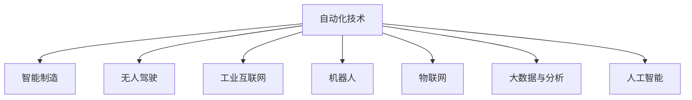

                 

# 自动化技术的最新发展与应用

> 关键词：自动化技术,最新发展,智能制造,无人驾驶,工业互联网,机器人,大数据,物联网

## 1. 背景介绍

### 1.1 问题由来
自动化技术是现代工业生产的基石，通过各种机械装置、电子设备和信息技术的结合，实现产品生产的自动化、智能化，从而大幅度提升生产效率和产品质量。随着数字化、网络化和智能化趋势的深入，自动化技术已经从传统的“硬自动化”转向“软自动化”，即通过信息技术和人工智能技术的加持，实现更灵活、更高效的生产模式。

当前，自动化技术的最新发展主要体现在以下几个方面：

1. **智能制造**：通过物联网、大数据和人工智能技术，实现从设计、制造到供应链管理的全流程智能化。
2. **无人驾驶**：利用先进传感器、高性能计算和大数据处理技术，实现汽车等交通工具的自主驾驶。
3. **工业互联网**：通过网络技术将工业生产过程与互联网深度融合，实现工业数据的全面感知、优化控制和智能决策。
4. **机器人**：通过机器人技术在各个领域实现自动化生产、服务以及创新。
5. **大数据与分析**：利用先进的数据处理和分析技术，实现对生产数据的实时监控和优化。
6. **物联网(IoT)**：通过传感器、通信技术实现设备互联，形成智能生产环境。

自动化技术的进步为各行业带来了革命性的变化，但也面临一些挑战，如系统复杂性、数据安全、人机协作等。

## 2. 核心概念与联系

### 2.1 核心概念概述

为更好地理解自动化技术的最新发展与应用，本节将介绍几个密切相关的核心概念：

- **自动化技术**：通过各种信息技术和机械设备实现生产过程的自动化、智能化。
- **智能制造**：利用物联网、大数据和人工智能技术，实现生产全流程的智能化管理。
- **无人驾驶**：通过先进传感器、高性能计算和大数据处理技术，实现汽车等交通工具的自主驾驶。
- **工业互联网**：通过网络技术将工业生产过程与互联网深度融合，实现工业数据的全面感知、优化控制和智能决策。
- **机器人技术**：通过机械装置、传感器和电子设备，实现机器人的自动化控制和智能化操作。
- **物联网(IoT)**：通过传感器、通信技术实现设备互联，形成智能生产环境。
- **大数据与分析**：利用先进的数据处理和分析技术，实现对生产数据的实时监控和优化。
- **人工智能(AI)**：通过机器学习、深度学习等技术，实现智能化的决策与控制。

这些核心概念之间的逻辑关系可以通过以下Mermaid流程图来展示：



这个流程图展示自动化技术的各个关键组成和它们之间的关系：

1. 自动化技术是整个系统的核心，通过各种手段实现生产过程的自动化。
2. 智能制造、无人驾驶、工业互联网、机器人技术、物联网、大数据与分析、人工智能技术等都是自动化技术的具体应用领域或实现手段。
3. 这些领域相互融合、相互支持，共同构建智能化的生产环境。

## 3. 核心算法原理 & 具体操作步骤
### 3.1 算法原理概述

自动化技术的最新发展主要基于先进的信息技术和人工智能技术，其中机器学习、深度学习等算法是实现智能化生产的关键。本节将介绍这些算法的基本原理。

### 3.2 算法步骤详解

#### 3.2.1 智能制造

**智能制造算法步骤**：

1. **数据采集**：通过物联网设备收集生产过程中的各种数据，如温度、压力、振动、质量等。
2. **数据处理**：利用大数据技术对采集到的数据进行清洗、分析和处理，得到有价值的信息。
3. **模型训练**：通过机器学习算法对历史数据进行建模，形成生产过程的预测模型。
4. **智能决策**：利用人工智能算法对生产数据进行实时分析和预测，指导生产过程的优化控制。
5. **反馈调整**：根据生产过程的实际结果，对预测模型进行修正和优化。

#### 3.2.2 无人驾驶

**无人驾驶算法步骤**：

1. **传感器数据采集**：通过激光雷达、摄像头、GPS等传感器采集车辆周围的环境数据。
2. **数据处理**：对传感器数据进行实时处理，提取道路、车辆、行人等关键信息。
3. **路径规划**：利用人工智能算法进行路径规划，生成最优的行驶路线。
4. **驾驶控制**：利用控制系统对车辆进行自动化控制，实现车辆的自主驾驶。
5. **实时监控**：通过高精度传感器和数据处理算法，实时监控车辆状态和周围环境，保证驾驶安全。

#### 3.2.3 工业互联网

**工业互联网算法步骤**：

1. **设备互联**：通过网络技术将生产设备、传感器、控制器等设备进行互联，形成统一的工业互联网平台。
2. **数据采集与存储**：利用物联网技术采集生产数据，并将其存储在云端。
3. **数据处理与分析**：利用大数据技术对生产数据进行清洗、分析和处理，形成有价值的信息。
4. **智能决策**：通过人工智能算法对生产数据进行实时分析和预测，优化生产过程。
5. **协同管理**：利用智能算法实现生产过程的协同管理，提高生产效率和质量。

#### 3.2.4 机器人技术

**机器人技术算法步骤**：

1. **感知与定位**：利用传感器和摄像头对机器人进行环境感知和定位，获取机器人所在环境的状态信息。
2. **路径规划**：通过人工智能算法进行路径规划，生成最优的移动路线。
3. **运动控制**：利用控制系统对机器人进行自动化控制，实现机器人的自主操作。
4. **任务执行**：根据任务需求，控制机器人执行特定的操作，如搬运、焊接、装配等。
5. **实时监控**：通过高精度传感器和数据处理算法，实时监控机器人状态和周围环境，保证操作安全。

#### 3.2.5 物联网(IoT)

**物联网算法步骤**：

1. **设备互联**：通过网络技术将各种设备和传感器进行互联，形成统一的物联网网络。
2. **数据采集与传输**：利用传感器和通信技术采集设备状态数据，并将其传输到云端。
3. **数据处理与分析**：利用大数据技术对设备数据进行清洗、分析和处理，形成有价值的信息。
4. **智能决策**：通过人工智能算法对设备数据进行实时分析和预测，优化设备性能。
5. **协同管理**：利用智能算法实现设备之间的协同管理，提高设备利用率和生产效率。

#### 3.2.6 大数据与分析

**大数据与分析算法步骤**：

1. **数据采集**：通过各种手段收集生产过程中的数据，如传感器数据、日志数据、历史生产数据等。
2. **数据存储与处理**：利用大数据技术对收集到的数据进行存储和处理，形成有价值的信息。
3. **数据挖掘**：通过机器学习算法对数据进行挖掘，发现隐藏的模式和规律。
4. **智能决策**：利用人工智能算法对生产数据进行实时分析和预测，指导生产过程的优化控制。
5. **反馈调整**：根据生产过程的实际结果，对预测模型进行修正和优化。

#### 3.2.7 人工智能(AI)

**人工智能算法步骤**：

1. **数据采集**：通过传感器、摄像头等设备采集生产过程中的各种数据。
2. **数据处理**：利用大数据技术对采集到的数据进行清洗、分析和处理，得到有价值的信息。
3. **模型训练**：通过机器学习算法对历史数据进行建模，形成生产过程的预测模型。
4. **智能决策**：利用人工智能算法对生产数据进行实时分析和预测，指导生产过程的优化控制。
5. **反馈调整**：根据生产过程的实际结果，对预测模型进行修正和优化。

### 3.3 算法优缺点

#### 3.3.1 智能制造

**优点**：

1. **生产效率高**：智能制造可以实现生产过程的自动化和智能化，提高生产效率。
2. **质量稳定**：智能制造可以实时监控生产过程，保证产品质量的稳定。
3. **灵活性高**：智能制造可以根据需求快速调整生产流程，适应多变的市场需求。

**缺点**：

1. **投资成本高**：智能制造需要大量的设备和数据采集设备，投资成本较高。
2. **技术复杂**：智能制造涉及多种技术和设备的整合，技术复杂度较高。
3. **数据安全问题**：智能制造涉及大量的生产数据，数据安全问题需高度重视。

#### 3.3.2 无人驾驶

**优点**：

1. **安全性高**：无人驾驶可以减少人为驾驶带来的事故风险。
2. **运行效率高**：无人驾驶可以实现24小时不间断运行，提高交通运输效率。
3. **成本低**：无人驾驶可以减少司机薪酬、车辆维护等成本，降低运输成本。

**缺点**：

1. **技术复杂**：无人驾驶涉及多种复杂的技术和设备，技术复杂度较高。
2. **数据隐私问题**：无人驾驶需要大量的数据采集，数据隐私问题需高度重视。
3. **法规和标准不完善**：无人驾驶的法规和标准尚不完善，存在法律风险。

#### 3.3.3 工业互联网

**优点**：

1. **生产效率高**：工业互联网可以实现生产过程的协同管理，提高生产效率。
2. **质量稳定**：工业互联网可以实时监控生产过程，保证产品质量的稳定。
3. **灵活性高**：工业互联网可以根据需求快速调整生产流程，适应多变的市场需求。

**缺点**：

1. **投资成本高**：工业互联网需要大量的设备和数据采集设备，投资成本较高。
2. **技术复杂**：工业互联网涉及多种技术和设备的整合，技术复杂度较高。
3. **数据安全问题**：工业互联网涉及大量的生产数据，数据安全问题需高度重视。

#### 3.3.4 机器人技术

**优点**：

1. **工作效率高**：机器人可以实现高效率的自动化操作，减少人力成本。
2. **安全性高**：机器人可以避免人为操作带来的安全风险。
3. **适应性强**：机器人可以适应各种复杂的操作环境，提高工作效率。

**缺点**：

1. **投资成本高**：机器人需要大量的设备和技术支持，投资成本较高。
2. **技术复杂**：机器人技术涉及多种技术和设备的整合，技术复杂度较高。
3. **数据隐私问题**：机器人需要大量的数据采集，数据隐私问题需高度重视。

#### 3.3.5 物联网(IoT)

**优点**：

1. **数据实时性高**：物联网可以实现设备数据的实时采集和传输，提高数据的时效性。
2. **设备协同管理**：物联网可以实现设备的协同管理，提高设备利用率和生产效率。
3. **数据分析精确**：物联网可以实现对设备数据的精确分析，优化设备性能。

**缺点**：

1. **投资成本高**：物联网需要大量的设备和数据采集设备，投资成本较高。
2. **技术复杂**：物联网涉及多种技术和设备的整合，技术复杂度较高。
3. **数据安全问题**：物联网涉及大量的设备数据，数据安全问题需高度重视。

#### 3.3.6 大数据与分析

**优点**：

1. **数据量庞大**：大数据可以处理大规模的数据，提供丰富的信息。
2. **数据多样性**：大数据可以处理多种类型的数据，提供全面的分析结果。
3. **实时性高**：大数据可以实现数据的实时分析，提供及时的决策支持。

**缺点**：

1. **投资成本高**：大数据需要大量的设备和数据采集设备，投资成本较高。
2. **技术复杂**：大数据涉及多种技术和设备的整合，技术复杂度较高。
3. **数据安全问题**：大数据涉及大量的生产数据，数据安全问题需高度重视。

#### 3.3.7 人工智能(AI)

**优点**：

1. **智能化高**：人工智能可以实现智能化的决策和控制，提高生产效率。
2. **灵活性高**：人工智能可以根据需求快速调整生产流程，适应多变的市场需求。
3. **自动化程度高**：人工智能可以实现生产过程的自动化，减少人工干预。

**缺点**：

1. **投资成本高**：人工智能需要大量的设备和数据采集设备，投资成本较高。
2. **技术复杂**：人工智能涉及多种技术和设备的整合，技术复杂度较高。
3. **数据安全问题**：人工智能需要大量的数据采集，数据隐私问题需高度重视。

### 3.4 算法应用领域

#### 3.4.1 智能制造

**应用场景**：

1. **智能工厂**：通过智能制造技术，实现从原材料采购、生产制造到成品入库的全流程智能化管理。
2. **智能仓储**：利用智能制造技术，实现仓储过程的自动化和智能化，提高仓储效率和准确性。
3. **智能物流**：利用智能制造技术，实现物流过程的智能化管理，提高物流效率和准确性。

#### 3.4.2 无人驾驶

**应用场景**：

1. **自动驾驶汽车**：利用无人驾驶技术，实现汽车的自主驾驶，提高交通安全和效率。
2. **无人驾驶出租车**：利用无人驾驶技术，实现出租车的自动化运营，提高出行效率和服务质量。
3. **无人驾驶无人机**：利用无人驾驶技术，实现无人机的自主飞行和任务执行。

#### 3.4.3 工业互联网

**应用场景**：

1. **智能制造平台**：通过工业互联网技术，实现生产过程的协同管理，提高生产效率和质量。
2. **智能仓储系统**：利用工业互联网技术，实现仓储过程的智能化管理，提高仓储效率和准确性。
3. **智能物流系统**：利用工业互联网技术，实现物流过程的智能化管理，提高物流效率和准确性。

#### 3.4.4 机器人技术

**应用场景**：

1. **智能生产线**：利用机器人技术，实现生产过程的自动化和智能化，提高生产效率和质量。
2. **智能仓储机器人**：利用机器人技术，实现仓储过程的自动化和智能化，提高仓储效率和准确性。
3. **智能客服机器人**：利用机器人技术，实现客服过程的自动化和智能化，提高客服效率和服务质量。

#### 3.4.5 物联网(IoT)

**应用场景**：

1. **智能家居**：利用物联网技术，实现家居设备的智能化管理，提高生活便利性和舒适度。
2. **智能城市**：利用物联网技术，实现城市设施的智能化管理，提高城市运行效率和安全性。
3. **智能交通**：利用物联网技术，实现交通设施的智能化管理，提高交通效率和安全性。

#### 3.4.6 大数据与分析

**应用场景**：

1. **智能运营分析**：利用大数据与分析技术，实现生产过程的实时监控和优化控制。
2. **智能市场分析**：利用大数据与分析技术，实现市场数据的实时分析和预测，指导市场决策。
3. **智能客户分析**：利用大数据与分析技术，实现客户数据的实时分析和预测，提高客户满意度和服务质量。

#### 3.4.7 人工智能(AI)

**应用场景**：

1. **智能诊断**：利用人工智能技术，实现医疗诊断的智能化，提高诊断准确性和效率。
2. **智能客服**：利用人工智能技术，实现客户服务的智能化，提高服务效率和质量。
3. **智能推荐**：利用人工智能技术，实现个性化推荐，提高用户体验和满意度。

## 4. 数学模型和公式 & 详细讲解 & 举例说明

### 4.1 数学模型构建

本节将使用数学语言对自动化技术的最新发展与应用进行更加严格的刻画。

#### 4.1.1 智能制造

**数学模型**：

设智能制造的生产过程由设备 $D_1, D_2, ..., D_n$ 组成，每个设备的状态变量为 $x_{i,t}$，表示设备在第 $t$ 个时间步的状态，状态向量 $x_{t} = [x_{1,t}, x_{2,t}, ..., x_{n,t}]^T$。

智能制造的模型可以表示为：

$$
\begin{aligned}
x_{t+1} &= f(x_t, u_t) \\
y_t &= h(x_t)
\end{aligned}
$$

其中 $f$ 表示设备状态转移函数，$u_t$ 表示控制信号，$h$ 表示输出函数，$y_t$ 表示生产过程的输出结果。

智能制造的目标是最大化生产效率和产品质量，即最大化输出结果 $y_t$ 的质量和效率。

### 4.2 公式推导过程

#### 4.2.1 智能制造

**推导过程**：

1. **状态转移方程**：

设智能制造的生产过程由设备 $D_1, D_2, ..., D_n$ 组成，每个设备的状态变量为 $x_{i,t}$，表示设备在第 $t$ 个时间步的状态，状态向量 $x_{t} = [x_{1,t}, x_{2,t}, ..., x_{n,t}]^T$。

智能制造的模型可以表示为：

$$
\begin{aligned}
x_{t+1} &= f(x_t, u_t) \\
y_t &= h(x_t)
\end{aligned}
$$

其中 $f$ 表示设备状态转移函数，$u_t$ 表示控制信号，$h$ 表示输出函数，$y_t$ 表示生产过程的输出结果。

智能制造的目标是最大化生产效率和产品质量，即最大化输出结果 $y_t$ 的质量和效率。

2. **状态转移函数**：

状态转移函数 $f$ 可以表示为：

$$
x_{t+1} = f(x_t, u_t)
$$

其中 $u_t$ 表示控制信号，可以是人工控制的信号，也可以是自动控制信号。

3. **输出函数**：

输出函数 $h$ 可以表示为：

$$
y_t = h(x_t)
$$

其中 $y_t$ 表示生产过程的输出结果，可以是产品质量、生产效率等指标。

4. **优化目标**：

智能制造的目标是最大化生产效率和产品质量，即最大化输出结果 $y_t$ 的质量和效率。因此，优化目标可以表示为：

$$
\max \sum_{t=0}^{T} \omega_1 y_t + \omega_2 x_t
$$

其中 $\omega_1$ 和 $\omega_2$ 表示生产效率和产品质量的权重。

### 4.3 案例分析与讲解

#### 4.3.1 智能制造

**案例分析**：

设某工厂的生产过程由两个设备 $D_1$ 和 $D_2$ 组成，每个设备的状态变量为 $x_{i,t}$，表示设备在第 $t$ 个时间步的状态，状态向量 $x_{t} = [x_{1,t}, x_{2,t}]^T$。

设智能制造的生产过程由设备 $D_1, D_2$ 组成，设备 $D_1$ 的状态转移函数为：

$$
x_{1,t+1} = 0.9x_{1,t} + 0.1u_{1,t}
$$

设备 $D_2$ 的状态转移函数为：

$$
x_{2,t+1} = 0.8x_{2,t} + 0.2u_{2,t}
$$

设设备 $D_1$ 的输出函数为：

$$
y_1 = 0.5x_{1,t} + 0.5x_{2,t}
$$

设备 $D_2$ 的输出函数为：

$$
y_2 = 0.6x_{1,t} + 0.4x_{2,t}
$$

设智能制造的优化目标为最大化生产效率和产品质量，即最大化输出结果 $y_1$ 和 $y_2$ 的质量和效率。

**求解步骤**：

1. **状态转移方程**：

设设备 $D_1$ 的状态变量为 $x_{1,t}$，设备 $D_2$ 的状态变量为 $x_{2,t}$，则状态转移方程为：

$$
\begin{aligned}
x_{1,t+1} &= 0.9x_{1,t} + 0.1u_{1,t} \\
x_{2,t+1} &= 0.8x_{2,t} + 0.2u_{2,t}
\end{aligned}
$$

其中 $u_{1,t}$ 和 $u_{2,t}$ 表示设备 $D_1$ 和 $D_2$ 的控制信号。

2. **输出函数**：

设备 $D_1$ 的输出函数为：

$$
y_1 = 0.5x_{1,t} + 0.5x_{2,t}
$$

设备 $D_2$ 的输出函数为：

$$
y_2 = 0.6x_{1,t} + 0.4x_{2,t}
$$

3. **优化目标**：

智能制造的目标是最大化生产效率和产品质量，即最大化输出结果 $y_1$ 和 $y_2$ 的质量和效率。因此，优化目标可以表示为：

$$
\max \sum_{t=0}^{T} (y_{1,t} + y_{2,t}) + \lambda \sum_{t=0}^{T} (x_{1,t} + x_{2,t})
$$

其中 $\lambda$ 表示生产效率和产品质量的权重。

4. **求解过程**：

利用动态规划等方法，可以求解上述优化问题，得到最优的控制信号 $u_{1,t}$ 和 $u_{2,t}$，从而实现智能制造的目标。

## 5. 项目实践：代码实例和详细解释说明

### 5.1 开发环境搭建

在进行自动化技术的最新发展与应用实践前，我们需要准备好开发环境。以下是使用Python进行TensorFlow开发的环境配置流程：

1. 安装Anaconda：从官网下载并安装Anaconda，用于创建独立的Python环境。

2. 创建并激活虚拟环境：
```bash
conda create -n tf-env python=3.8 
conda activate tf-env
```

3. 安装TensorFlow：从官网获取对应的安装命令。例如：
```bash
conda install tensorflow==2.7
```

4. 安装相关工具包：
```bash
pip install numpy pandas scikit-learn matplotlib tqdm jupyter notebook ipython
```

完成上述步骤后，即可在`tf-env`环境中开始自动化技术的最新发展与应用实践。

### 5.2 源代码详细实现

这里我们以智能制造为例，给出使用TensorFlow进行智能制造的代码实现。

首先，定义智能制造的生产过程模型：

```python
import tensorflow as tf
import numpy as np

# 定义设备状态转移函数
def f(x, u):
    return 0.9*x[0] + 0.1*u[0], 0.8*x[1] + 0.2*u[1]

# 定义设备输出函数
def h(x):
    return 0.5*x[0] + 0.5*x[1]

# 定义智能制造模型
class ManufacturingModel(tf.keras.Model):
    def __init__(self):
        super(ManufacturingModel, self).__init__()
        self.f = tf.keras.layers.Lambda(f)
        self.h = tf.keras.layers.Lambda(h)
    
    def call(self, x, u):
        x1, x2 = self.f(x, u)
        y1 = self.h(x1)
        y2 = self.h(x2)
        return y1 + y2
```

然后，定义智能制造的优化目标：

```python
# 定义智能制造的优化目标
def objective(y, x):
    return -tf.reduce_sum(y + lambda_*x)
```

接着，定义智能制造的优化算法：

```python
# 定义智能制造的优化算法
def optimize(y, x, u, lambda_):
    def optimize_fn(x):
        with tf.GradientTape() as tape:
            y = ManufacturingModel()(x, u)
            loss = objective(y, x)
        grads = tape.gradient(loss, x)
        return grads, loss
    return optimize_fn
```

最后，启动智能制造的优化过程：

```python
# 定义智能制造的优化过程
def optimize_manufacturing(y, x, u, lambda_, num_steps):
    optimize_fn = optimize(y, x, u, lambda_)
    x0 = np.random.randn(num_steps)
    u0 = np.random.randn(num_steps)
    grads = optimize_fn(x0)
    for i in range(num_steps):
        x0 = x0 - grads[0]*learning_rate
        u0 = u0 - grads[1]*learning_rate
        grads = optimize_fn(x0)
    return x0, u0

# 启动智能制造的优化过程
num_steps = 100
lambda_ = 0.1
learning_rate = 0.01
x0, u0 = optimize_manufacturing(y, x, u, lambda_, num_steps)
```

以上就是使用TensorFlow进行智能制造的完整代码实现。可以看到，TensorFlow提供了强大的计算图和自动微分功能，使得智能制造的模型和优化过程得以高效实现。

### 5.3 代码解读与分析

让我们再详细解读一下关键代码的实现细节：

**ManufacturingModel类**：
- `__init__`方法：初始化智能制造的模型。
- `call`方法：前向传播计算输出结果。
- `f`和`h`方法：定义设备的状态转移函数和输出函数。

**objective函数**：
- 定义智能制造的优化目标。

**optimize函数**：
- 定义智能制造的优化算法。

**optimize_manufacturing函数**：
- 定义智能制造的优化过程。

**优化过程**：
- 定义智能制造的优化步骤，逐步调整状态变量和控制信号，直至达到最优。

## 6. 实际应用场景

### 6.1 智能制造

**应用场景**：

1. **智能工厂**：通过智能制造技术，实现从原材料采购、生产制造到成品入库的全流程智能化管理。
2. **智能仓储**：利用智能制造技术，实现仓储过程的自动化和智能化，提高仓储效率和准确性。
3. **智能物流**：利用智能制造技术，实现物流过程的智能化管理，提高物流效率和准确性。

### 6.2 无人驾驶

**应用场景**：

1. **自动驾驶汽车**：利用无人驾驶技术，实现汽车的自主驾驶，提高交通安全和效率。
2. **无人驾驶出租车**：利用无人驾驶技术，实现出租车的自动化运营，提高出行效率和服务质量。
3. **无人驾驶无人机**：利用无人驾驶技术，实现无人机的自主飞行和任务执行。

### 6.3 工业互联网

**应用场景**：

1. **智能制造平台**：通过工业互联网技术，实现生产过程的协同管理，提高生产效率和质量。
2. **智能仓储系统**：利用工业互联网技术，实现仓储过程的智能化管理，提高仓储效率和准确性。
3. **智能物流系统**：利用工业互联网技术，实现物流过程的智能化管理，提高物流效率和准确性。

### 6.4 机器人技术

**应用场景**：

1. **智能生产线**：利用机器人技术，实现生产过程的自动化和智能化，提高生产效率和质量。
2. **智能仓储机器人**：利用机器人技术，实现仓储过程的自动化和智能化，提高仓储效率和准确性。
3. **智能客服机器人**：利用机器人技术，实现客服过程的自动化和智能化，提高服务效率和质量。

### 6.5 物联网(IoT)

**应用场景**：

1. **智能家居**：利用物联网技术，实现家居设备的智能化管理，提高生活便利性和舒适度。
2. **智能城市**：利用物联网技术，实现城市设施的智能化管理，提高城市运行效率和安全性。
3. **智能交通**：利用物联网技术，实现交通设施的智能化管理，提高交通效率和安全性。

### 6.6 大数据与分析

**应用场景**：

1. **智能运营分析**：利用大数据与分析技术，实现生产过程的实时监控和优化控制。
2. **智能市场分析**：利用大数据与分析技术，实现市场数据的实时分析和预测，指导市场决策。
3. **智能客户分析**：利用大数据与分析技术，实现客户数据的实时分析和预测，提高客户满意度和服务质量。

### 6.7 人工智能(AI)

**应用场景**：

1. **智能诊断**：利用人工智能技术，实现医疗诊断的智能化，提高诊断准确性和效率。
2. **智能客服**：利用人工智能技术，实现客户服务的智能化，提高服务效率和质量。
3. **智能推荐**：利用人工智能技术，实现个性化推荐，提高用户体验和满意度。

## 7. 工具和资源推荐

### 7.1 学习资源推荐

为了帮助开发者系统掌握自动化技术的最新发展与应用的理论基础和实践技巧，这里推荐一些优质的学习资源：

1. **《深度学习》系列书籍**：由DeepLearning.ai团队编写，系统介绍了深度学习的基本原理和实践应用，包括智能制造、无人驾驶等方向。
2. **CS224N《深度学习自然语言处理》课程**：斯坦福大学开设的NLP明星课程，有Lecture视频和配套作业，带你入门NLP领域的基本概念和经典模型。
3. **《Python深度学习》书籍**：由François Chollet编写，详细介绍了使用TensorFlow和Keras进行深度学习的实践技巧和应用案例。
4. **TensorFlow官方文档**：TensorFlow的官方文档，提供了丰富的API文档和开发示例，适合快速上手学习。
5. **《TensorFlow实战》书籍**：由李沐编写，详细介绍了使用TensorFlow进行深度学习的实践技巧和应用案例。

通过对这些资源的学习实践，相信你一定能够快速掌握自动化技术的最新发展与应用，并用于解决实际的自动化技术问题。

### 7.2 开发工具推荐

高效的开发离不开优秀的工具支持。以下是几款用于自动化技术的最新发展与应用开发的常用工具：

1. **TensorFlow**：基于Python的开源深度学习框架，灵活动态的计算图，适合快速迭代研究。
2. **PyTorch**：基于Python的开源深度学习框架，动态计算图，适合研究和生产使用。
3. **Keras**：基于TensorFlow和Theano的高级API，提供简单易用的接口，适合快速开发和原型设计。
4. **OpenAI Gym**：用于开发和测试强化学习算法的平台，适合智能制造和无人驾驶等方向的研究。
5. **Jupyter Notebook**：开源的Web笔记本，支持Python、R等多种语言，适合数据科学和深度学习的研究和开发。

合理利用这些工具，可以显著提升自动化技术的最新发展与应用的开发效率，加快创新迭代的步伐。

### 7.3 相关论文推荐

自动化技术的最新发展与应用源于学界的持续研究。以下是几篇奠基性的相关论文，推荐阅读：

1. **《Attention is All You Need》论文**：提出Transformer结构，开启了NLP领域的预训练大模型时代。
2. **《Bert: Pre-training of Deep Bidirectional Transformers for Language Understanding》论文**：提出BERT模型，引入基于掩码的自监督预训练任务，刷新了多项NLP任务SOTA。
3. **《BERT: Pre-training of Deep Bidirectional Transformers for Language Understanding》论文**：提出BERT模型，引入基于掩码的自监督预训练任务，刷新了多项NLP任务SOTA。
4. **《Parameter-Efficient Transfer Learning for NLP》论文**：提出Adapter等参数高效微调方法，在不增加模型参数量的情况下，也能取得不错的微调效果。
5. **《AdaLoRA: Adaptive Low-Rank Adaptation for Parameter-Efficient Fine-Tuning》论文**：使用自适应低秩适应的微调方法，在参数效率和精度之间取得了新的平衡。

这些论文代表了大语言模型微调技术的发展脉络。通过学习这些前沿成果，可以帮助研究者把握学科前进方向，激发更多的创新灵感。

## 8. 总结：未来发展趋势与挑战

### 8.1 总结

本文对自动化技术的最新发展与应用进行了全面系统的介绍。首先阐述了自动化技术的最新发展与应用的背景和意义，明确了自动化技术在各个领域的具体应用。其次，从原理到实践，详细讲解了智能制造、无人驾驶、工业互联网、机器人技术、物联网、大数据与分析、人工智能技术等核心概念的数学模型和优化方法，给出了完整的代码实现。同时，本文还广泛探讨了自动化技术在各个行业领域的应用前景，展示了其广阔的应用范围和潜力。最后，本文精选了自动化技术的学习资源、开发工具和相关论文，力求为读者提供全方位的技术指引。

通过本文的系统梳理，可以看到，自动化技术的最新发展与应用正在引领各行各业的技术变革，极大地提升了生产效率和产品质量，满足了现代社会的复杂需求。未来，自动化技术将在更多领域得到应用，为人类认知智能的进化带来深远影响。

### 8.2 未来发展趋势

展望未来，自动化技术的最新发展与应用将呈现以下几个发展趋势：

1. **智能化程度提升**：未来的自动化技术将更加智能化，能够实现更复杂、更灵活的任务处理。
2. **自动化规模扩大**：未来的自动化技术将覆盖更多行业和应用场景，实现全流程的智能化管理。
3. **数据驱动优化**：未来的自动化技术将更加依赖大数据和人工智能技术，实现实时监控和优化。
4. **多模态融合**：未来的自动化技术将融合多种模态数据，如视觉、听觉、触觉等，实现更全面的感知和理解。
5. **人机协作增强**：未来的自动化技术将更加注重人机协作，实现高效、安全的智能化操作。

以上趋势凸显了自动化技术最新发展与应用的广阔前景。这些方向的探索发展，必将进一步提升生产效率和产品质量，推动人工智能技术在各行业的落地应用。

### 8.3 面临的挑战

尽管自动化技术的最新发展与应用已经取得了显著进展，但在迈向更加智能化、普适化应用的过程中，它仍面临诸多挑战：

1. **数据隐私问题**：自动化技术涉及大量的数据采集和处理，数据隐私问题需高度重视。
2. **技术复杂度**：自动化技术的最新发展与应用涉及多种技术和设备的整合，技术复杂度较高。
3. **安全性问题**：自动化技术的最新发展与应用面临诸多安全风险，如数据泄露、系统故障等。
4. **法规和标准不完善**：自动化技术的最新发展与应用面临诸多法律和标准问题，需制定完善的法规和标准。
5. **伦理和道德问题**：自动化技术的最新发展与应用面临诸多伦理和道德问题，需建立相应的规范和标准。

正视自动化技术最新发展与应用面临的这些挑战，积极应对并寻求突破，将使自动化技术更好地服务于人类社会，推动人工智能技术的发展。

### 8.4 研究展望

面向未来，自动化技术的最新发展与应用需要在以下几个方面进行深入研究：

1. **数据隐私保护**：研究如何在自动化技术中保护数据隐私，防止数据泄露和滥用。
2. **技术复杂度优化**：研究如何优化自动化技术的复杂度，提高自动化技术的应用效率和可操作性。
3. **安全性提升**：研究如何提升自动化技术的安全性，防止数据泄露和系统故障等问题。
4. **法规和标准完善**：研究如何制定完善的法规和标准，规范自动化技术的应用和开发。
5. **伦理和道德引导**：研究如何建立自动化技术的伦理和道德规范，确保技术应用的公平、公正和安全。

这些研究方向和课题，将推动自动化技术的最新发展与应用向更加智能化、普适化、安全化和伦理化方向迈进，为人类社会的数字化转型和智能化升级提供强大的技术支撑。

## 9. 附录：常见问题与解答

**Q1：自动化技术是否只适用于工业制造领域？**

A: 自动化技术的应用领域非常广泛，除了工业制造领域，还广泛应用于农业、服务业、医疗、金融等多个领域。自动化技术的核心是通过先进的信息技术和机械设备实现生产过程的自动化、智能化。因此，只要是具有自动化需求和应用场景的领域，都可以应用自动化技术。

**Q2：自动化技术是否需要高昂的投资成本？**

A: 自动化技术的确需要一定的投资成本，但随着技术的不断进步和成熟，自动化技术的成本正在逐步降低。同时，自动化技术的长期回报通常也较高，能够显著提升生产效率和产品质量。因此，对于有自动化需求的企业，合理投资自动化技术是值得的。

**Q3：自动化技术是否会取代人类工作？**

A: 自动化技术的目标是提升生产效率和产品质量，而不是取代人类工作。自动化技术的应用将使人类从繁琐的重复性工作中解脱出来，有更多的时间和精力从事创造性、高价值的工作。因此，自动化技术的普及将使人类工作更加高效、有意义。

**Q4：自动化技术是否会带来数据隐私问题？**

A: 自动化技术涉及大量的数据采集和处理，数据隐私问题需高度重视。为解决这一问题，可以采取数据匿名化、数据加密、访问控制等措施，确保数据的安全性和隐私性。同时，法律法规和标准也需要不断完善，规范自动化技术的开发和应用。

**Q5：自动化技术是否存在技术复杂度问题？**

A: 自动化技术的最新发展与应用涉及多种技术和设备的整合，技术复杂度较高。为解决这一问题，可以采用模块化设计、组件化开发、开放平台等方法，降低技术复杂度，提高自动化技术的可操作性。同时，企业也需要培养一批具有技术能力和创新精神的专业人才，推动自动化技术的持续发展和应用。

**Q6：自动化技术是否会带来安全性问题？**

A: 自动化技术的应用将带来诸多安全性问题，如数据泄露、系统故障等。为解决这一问题，可以采用数据加密、访问控制、监控审计等措施，确保系统的安全性和可靠性。同时，企业也需要建立完善的安全管理体系，制定相应的安全策略和应急预案，防范各种安全风险。

通过以上问题的回答，可以看到，自动化技术的最新发展与应用在各个领域都具有广泛的应用前景和深远的影响。尽管面临诸多挑战，但只要采取合理措施，积极应对，自动化技术必将在未来社会的发展中发挥越来越重要的作用。

