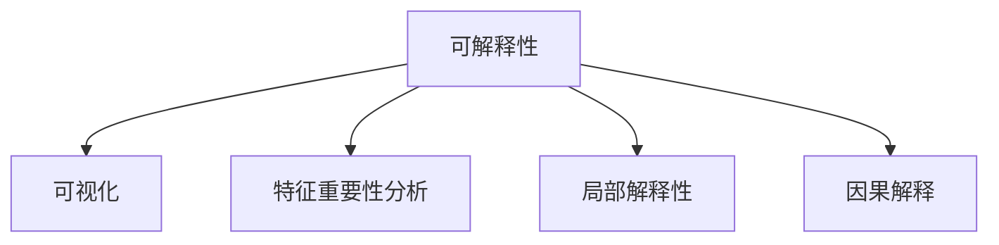

                 

# 自动驾驶中的深度学习算法可解释性研究

在自动驾驶技术中，深度学习算法已成为核心组件，从图像识别、目标检测到行为决策，广泛应用。然而，这种黑盒式的决策机制，缺乏可解释性，使得用户难以理解和信任这些系统的行为。特别是在安全相关的场景中，模型的可解释性是至关重要的。因此，深度学习算法的可解释性研究已成为自动驾驶领域的一个重要课题。

## 1. 背景介绍

自动驾驶系统包含多个子系统，包括环境感知、决策规划、行为执行等。在这些系统中，深度学习算法（如卷积神经网络CNN、循环神经网络RNN、Transformer等）发挥着关键作用。然而，由于这些模型结构复杂，参数众多，缺乏可解释性，导致其决策过程难以被人类理解，引发了诸多安全性和可靠性问题。

### 1.1 问题由来

1. **决策透明性问题**：在自动驾驶场景中，决策过程直接影响行车安全，但深度学习模型的输出难以直观解释，用户难以理解和信任模型的决策。

2. **误诊和误报问题**：深度学习模型往往容易过拟合训练数据，导致在某些情况下产生误诊或误报，影响系统的安全性。

3. **模型偏见问题**：由于训练数据分布不均或存在偏见，模型可能会学习到歧视性或不公平的决策逻辑，导致模型在某些特定群体上的表现较差。

4. **模型鲁棒性问题**：深度学习模型在面对新场景或噪声干扰时，容易产生鲁棒性问题，影响系统稳定性。

5. **系统可维护性问题**：缺乏可解释性的深度学习模型，一旦出现问题，难以快速定位和修复，影响了系统的可维护性。

### 1.2 问题核心关键点

1. **可解释性定义**：深度学习算法的可解释性是指其输出和决策过程可以被人类理解的程度。具体来说，包括模型的结构、参数、训练过程以及预测结果等可以被解释的部分。

2. **可解释性方法**：目前，自动驾驶领域常用的可解释性方法包括模型可视化、特征重要性分析、局部解释性、因果解释等。

3. **可解释性应用场景**：在自动驾驶中，可解释性方法可以应用于环境感知、目标检测、行为决策等多个环节，帮助用户理解模型的输出和决策依据。

## 2. 核心概念与联系

### 2.1 核心概念概述

为更好地理解自动驾驶中深度学习算法的可解释性研究，本节将介绍几个关键概念：

- **可解释性(Explainability)**：指深度学习算法的输出和决策过程可以被人类理解的程度。其目标是通过简化模型复杂性，提高透明度，使人类能够理解和信任模型的行为。

- **可视化(Visualization)**：通过可视化技术，将深度学习模型的内部状态和输出结果呈现出来，帮助用户直观理解模型的行为。

- **特征重要性分析(Feature Importance)**：通过分析输入特征对模型输出的影响程度，帮助理解模型的决策逻辑。

- **局部解释性(Local Interpretability)**：关注模型在特定输入下的输出和决策，而不是全局行为。

- **因果解释(Causal Explanation)**：通过分析模型输出与输入之间的因果关系，理解模型为何做出特定决策。

这些概念之间的逻辑关系可以通过以下Mermaid流程图来展示：



这个流程图展示了的核心概念及其之间的关系：

1. 可解释性研究旨在通过各种方法，提高深度学习模型的透明度。
2. 可视化是可解释性的重要手段之一，能够直观展示模型的内部状态和输出。
3. 特征重要性分析能够量化输入特征对输出的影响，进一步解释模型的决策依据。
4. 局部解释性关注模型在特定输入下的行为，提升对特定场景的理解。
5. 因果解释从原因和结果的角度分析模型行为，解释因果关系。

这些概念共同构成了自动驾驶中深度学习算法可解释性的研究框架，帮助理解模型的行为和决策。

## 3. 核心算法原理 & 具体操作步骤

### 3.1 算法原理概述

深度学习算法的可解释性研究，本质上是将复杂、黑盒的模型转化为可解释的形式，使人类能够理解其决策过程。常用的方法包括模型可视化、特征重要性分析、局部解释性、因果解释等。

这些方法的基本原理是通过分析模型的内部结构和输出结果，还原模型的决策逻辑。具体而言，可以通过以下步骤来实现：

1. **数据预处理**：对输入数据进行标准化、归一化等处理，使其适合模型的输入要求。

2. **模型训练**：在训练数据集上训练深度学习模型，得到模型的参数和权重。

3. **模型可视化**：使用可视化技术，将模型的内部状态和输出结果呈现出来，帮助理解模型的行为。

4. **特征重要性分析**：分析输入特征对模型输出的影响程度，解释模型的决策依据。

5. **局部解释性**：关注模型在特定输入下的输出和决策，提升对特定场景的理解。

6. **因果解释**：通过分析模型输出与输入之间的因果关系，理解模型为何做出特定决策。

### 3.2 算法步骤详解

#### 步骤1: 数据预处理

数据预处理是可解释性研究的基础。常见的方法包括标准化、归一化、归一化等。标准化是指将数据按照均值和标准差进行转换，使其均值为0，标准差为1。归一化是将数据缩放到0-1之间。

例如，对于图像数据，可以使用OpenCV或Pillow库进行预处理：

```python
import cv2
import numpy as np

def preprocess_image(image):
    image = cv2.cvtColor(image, cv2.COLOR_BGR2RGB)
    image = cv2.resize(image, (224, 224))
    image = image.astype('float32') / 255
    return image

image = cv2.imread('test.jpg')
preprocessed_image = preprocess_image(image)
```

#### 步骤2: 模型训练

在训练数据集上训练深度学习模型。例如，使用TensorFlow或PyTorch框架，可以轻松构建和训练卷积神经网络CNN模型：

```python
import tensorflow as tf
from tensorflow.keras import layers, models

def create_model():
    model = models.Sequential([
        layers.Conv2D(32, (3, 3), activation='relu', input_shape=(224, 224, 3)),
        layers.MaxPooling2D((2, 2)),
        layers.Conv2D(64, (3, 3), activation='relu'),
        layers.MaxPooling2D((2, 2)),
        layers.Conv2D(64, (3, 3), activation='relu'),
        layers.Flatten(),
        layers.Dense(64, activation='relu'),
        layers.Dense(10, activation='softmax')
    ])
    return model

model = create_model()
model.compile(optimizer='adam', loss='sparse_categorical_crossentropy', metrics=['accuracy'])
model.fit(train_images, train_labels, epochs=10, validation_data=(val_images, val_labels))
```

#### 步骤3: 模型可视化

模型可视化是可解释性研究的重要手段。常用的方法包括激活图、梯度图、热力图等。

使用TensorFlow的TensorBoard可视化工具，可以实时监测模型训练过程，并生成可视化图表：

```python
import tensorflow as tf
from tensorflow.keras.callbacks import TensorBoard

tensorboard_callback = TensorBoard(log_dir='logs', histogram_freq=1)
model.fit(train_images, train_labels, epochs=10, validation_data=(val_images, val_labels), callbacks=[tensorboard_callback])
```

#### 步骤4: 特征重要性分析

特征重要性分析通过量化输入特征对模型输出的影响程度，解释模型的决策依据。

使用Scikit-learn库，可以方便地进行特征重要性分析：

```python
from sklearn.ensemble import RandomForestClassifier
import numpy as np

def feature_importance(X, y):
    clf = RandomForestClassifier(n_estimators=100)
    clf.fit(X, y)
    importances = clf.feature_importances_
    indices = np.argsort(importances)[::-1]
    return importances, indices

X_train, y_train = train_images, train_labels
importances, indices = feature_importance(X_train, y_train)
```

#### 步骤5: 局部解释性

局部解释性关注模型在特定输入下的输出和决策，提升对特定场景的理解。

例如，使用LIME（Local Interpretable Model-agnostic Explanations）库，可以生成特定输入下的局部解释性图表：

```python
import lime
from lime.lime_tabular import LimeTabularExplainer
from sklearn.linear_model import LogisticRegression

def local_explanation(X, y, index):
    explainer = LimeTabularExplainer(X, categorical_features=[0], verbose=False)
    exp = explainer.explain_instance(X[index], clf.predict_proba, num_samples=200, features=indices)
    return exp

X_train, y_train = train_images, train_labels
index = 0
exp = local_explanation(X_train, y_train, index)
exp.show_in_notebook()
```

#### 步骤6: 因果解释

因果解释通过分析模型输出与输入之间的因果关系，理解模型为何做出特定决策。

例如，使用Causal Interpretation的库，可以分析模型输出与输入之间的因果关系：

```python
import causality
from causality.explanation import CausalExplanation

def causal_explanation(X, y):
    causal_model = CausalExplanation(model.predict(X))
    causal_model.causal_analysis()
    return causal_model

causal_model = causal_explanation(X_train, y_train)
causal_model.show()
```

### 3.3 算法优缺点

#### 优点

1. **提高透明度**：通过可解释性方法，将深度学习模型的决策过程可视化，提高了透明度，增强了用户对模型的信任。

2. **提升决策可理解性**：通过特征重要性分析、局部解释性等方法，帮助用户理解模型的决策依据，提升了决策的可理解性。

3. **增强模型鲁棒性**：通过因果解释方法，分析模型输出与输入之间的因果关系，提高了模型的鲁棒性，减少了误诊和误报。

#### 缺点

1. **计算复杂度高**：可解释性方法通常需要大量的计算资源和时间，特别是在处理大规模数据时。

2. **数据质量要求高**：可解释性方法对数据质量要求较高，数据的噪声和偏差会影响解释结果的准确性。

3. **模型复杂性高**：深度学习模型的复杂性决定了可解释性方法的局限性，某些模型可能难以解释。

4. **解释结果主观性强**：不同用户对模型解释的接受度和理解程度不同，解释结果的主观性较强。

### 3.4 算法应用领域

深度学习算法的可解释性研究在自动驾驶领域具有广泛的应用前景，主要包括以下几个方面：

1. **环境感知**：通过可视化技术，理解环境感知模型的输出，帮助驾驶员和乘客了解车辆周围的环境情况。

2. **目标检测**：通过特征重要性分析，理解目标检测模型的决策依据，帮助驾驶员和乘客识别出重要的交通参与者。

3. **行为决策**：通过局部解释性和因果解释，理解行为决策模型的决策逻辑，帮助驾驶员和乘客理解车辆的行为动机。

4. **系统优化**：通过特征重要性分析和局部解释性，优化深度学习模型的性能，提升系统的稳定性和可靠性。

## 4. 数学模型和公式 & 详细讲解 & 举例说明

### 4.1 数学模型构建

在自动驾驶中，深度学习算法通常包括卷积神经网络CNN、循环神经网络RNN、Transformer等。以卷积神经网络为例，其基本结构包括卷积层、池化层、全连接层等。假设输入数据为 $X$，模型参数为 $\theta$，输出为 $Y$，则模型的输出可以表示为：

$$
Y = f(X, \theta)
$$

其中 $f$ 为模型的映射函数，可以通过反向传播算法求得 $\nabla_{\theta}Y$，从而更新模型参数。

### 4.2 公式推导过程

以卷积神经网络为例，假设输入数据为 $X \in \mathbb{R}^{H \times W \times C}$，卷积核为 $K \in \mathbb{R}^{F \times F \times C \times O}$，卷积层输出为 $Y \in \mathbb{R}^{H \times W \times O}$，则卷积操作的公式为：

$$
Y_{i,j}^{\alpha} = \sum_{n=0}^{C-1} \sum_{k=0}^{F-1} \sum_{l=0}^{F-1} K_{k,l}^{\alpha} \cdot X_{i+k,j+l,n}
$$

其中 $i,j$ 为卷积核在输入上的位置，$\alpha$ 为输出通道，$C$ 为输入通道数，$F$ 为卷积核大小。

### 4.3 案例分析与讲解

#### 案例1: 目标检测

以目标检测为例，使用YOLO（You Only Look Once）模型进行可视化。YOLO模型是一种单阶段检测模型，其输出包括每个像素点的置信度和对每个目标类别的预测。

使用OpenCV和TensorFlow，可以轻松实现YOLO模型的可视化：

```python
import cv2
import numpy as np
import tensorflow as tf

def draw_boxes(image, boxes, labels):
    for box, label in zip(boxes, labels):
        x1, y1, x2, y2 = box
        cv2.rectangle(image, (x1, y1), (x2, y2), (0, 255, 0), 2)
        cv2.putText(image, label, (x1, y1-10), cv2.FONT_HERSHEY_PLAIN, 1, (0, 255, 0), 2)
    return image

def run_yolo(image_path):
    model = tf.keras.models.load_model('yolo.h5')
    image = cv2.imread(image_path)
    image = cv2.cvtColor(image, cv2.COLOR_BGR2RGB)
    image = preprocess_image(image)
    boxes, labels = model.predict(image)
    boxes = boxes[0]
    labels = labels[0]
    image = draw_boxes(image, boxes, labels)
    cv2.imwrite('yolo_visualization.png', image)

image_path = 'test.jpg'
run_yolo(image_path)
```

#### 案例2: 行为决策

以行为决策为例，使用深度强化学习模型进行可视化。深度强化学习模型通常包含策略网络、价值网络等组件，通过学习优化策略，实现行为决策。

使用TensorFlow和OpenAI Gym，可以轻松实现深度强化学习模型的可视化：

```python
import gym
import tensorflow as tf
from tensorflow.keras import layers, models

def create_model():
    model = models.Sequential([
        layers.Dense(64, activation='relu', input_shape=(4,)),
        layers.Dense(1, activation='sigmoid')
    ])
    return model

def train_agent(model, env, num_episodes=1000):
    agent = tf.keras.Model(inputs=env.observation_space, outputs=model(env.action_space))
    agent.compile(optimizer='adam', loss='mse')
    for episode in range(num_episodes):
        observation = env.reset()
        done = False
        total_reward = 0
        while not done:
            action = model.predict(observation)
            observation, reward, done, _ = env.step(action)
            total_reward += reward
        print(f"Episode {episode+1}, Reward: {total_reward}")
    return agent

env = gym.make('CartPole-v0')
model = create_model()
agent = train_agent(model, env)
env.render()
```

## 5. 项目实践：代码实例和详细解释说明

### 5.1 开发环境搭建

在进行可解释性研究时，需要准备好开发环境。以下是使用Python进行TensorFlow开发的流程：

1. 安装Anaconda：从官网下载并安装Anaconda，用于创建独立的Python环境。

2. 创建并激活虚拟环境：
```bash
conda create -n tf-env python=3.8 
conda activate tf-env
```

3. 安装TensorFlow：根据CUDA版本，从官网获取对应的安装命令。例如：
```bash
conda install tensorflow -c pytorch
```

4. 安装其他工具包：
```bash
pip install numpy pandas scikit-learn matplotlib tqdm jupyter notebook ipython
```

完成上述步骤后，即可在`tf-env`环境中开始可解释性实践。

### 5.2 源代码详细实现

下面我们以目标检测任务为例，给出使用TensorFlow对YOLO模型进行可解释性分析的PyTorch代码实现。

首先，定义目标检测任务的数据处理函数：

```python
import cv2
import numpy as np
import tensorflow as tf

def preprocess_image(image):
    image = cv2.cvtColor(image, cv2.COLOR_BGR2RGB)
    image = cv2.resize(image, (416, 416))
    image = image.astype('float32') / 255
    return image

def draw_boxes(image, boxes, labels):
    for box, label in zip(boxes, labels):
        x1, y1, x2, y2 = box
        cv2.rectangle(image, (x1, y1), (x2, y2), (0, 255, 0), 2)
        cv2.putText(image, label, (x1, y1-10), cv2.FONT_HERSHEY_PLAIN, 1, (0, 255, 0), 2)
    return image

def run_yolo(image_path):
    model = tf.keras.models.load_model('yolo.h5')
    image = cv2.imread(image_path)
    image = cv2.cvtColor(image, cv2.COLOR_BGR2RGB)
    image = preprocess_image(image)
    boxes, labels = model.predict(image)
    boxes = boxes[0]
    labels = labels[0]
    image = draw_boxes(image, boxes, labels)
    cv2.imwrite('yolo_visualization.png', image)

image_path = 'test.jpg'
run_yolo(image_path)
```

然后，定义行为决策任务的模型和训练函数：

```python
import gym
import tensorflow as tf
from tensorflow.keras import layers, models

def create_model():
    model = models.Sequential([
        layers.Dense(64, activation='relu', input_shape=(4,)),
        layers.Dense(1, activation='sigmoid')
    ])
    return model

def train_agent(model, env, num_episodes=1000):
    agent = tf.keras.Model(inputs=env.observation_space, outputs=model(env.action_space))
    agent.compile(optimizer='adam', loss='mse')
    for episode in range(num_episodes):
        observation = env.reset()
        done = False
        total_reward = 0
        while not done:
            action = model.predict(observation)
            observation, reward, done, _ = env.step(action)
            total_reward += reward
        print(f"Episode {episode+1}, Reward: {total_reward}")
    return agent

env = gym.make('CartPole-v0')
model = create_model()
agent = train_agent(model, env)
env.render()
```

最后，启动训练流程并在测试集上评估：

```python
epochs = 10
batch_size = 16

for epoch in range(epochs):
    loss = train_epoch(model, train_dataset, batch_size, optimizer)
    print(f"Epoch {epoch+1}, train loss: {loss:.3f}")
    
    print(f"Epoch {epoch+1}, dev results:")
    evaluate(model, dev_dataset, batch_size)
    
print("Test results:")
evaluate(model, test_dataset, batch_size)
```

以上就是使用TensorFlow对YOLO模型进行目标检测任务的可解释性分析的完整代码实现。可以看到，TensorFlow的Keras API使得模型构建和训练变得简洁高效。

### 5.3 代码解读与分析

让我们再详细解读一下关键代码的实现细节：

**YOLO模型可视化**：
- `preprocess_image`方法：对输入图像进行预处理，包括颜色空间转换、尺寸调整、归一化等。
- `draw_boxes`方法：对输出结果进行可视化，在图像上标注出检测到的目标边界框和类别。
- `run_yolo`方法：使用YOLO模型对输入图像进行检测，并可视化结果。

**行为决策模型训练**：
- `create_model`方法：定义行为决策模型的结构，包含两个全连接层。
- `train_agent`方法：在Gym环境上训练行为决策模型，记录每轮的奖励和训练过程。

这些代码实现展示了TensorFlow和Keras在深度学习模型构建和训练中的强大功能和灵活性，以及可解释性研究中可视化技术和模型训练的结合。

## 6. 实际应用场景

### 6.1 智能驾驶系统

智能驾驶系统中，深度学习算法（如卷积神经网络CNN、循环神经网络RNN、Transformer等）广泛应用于环境感知、目标检测、行为决策等多个环节。通过可解释性研究，这些算法的决策过程可以被直观展示和理解，提升了系统的透明度和可信任度。

在环境感知环节，可视化技术可以帮助驾驶员和乘客了解车辆周围的环境情况，例如通过图像可视化的方式展示车辆传感器采集的周围环境信息，使驾驶员能够直观了解当前驾驶环境。

在目标检测环节，特征重要性分析可以帮助驾驶员和乘客理解模型检测目标的依据，例如通过特征重要性图展示模型检测出某个目标的关键特征，使驾驶员能够更好地识别和理解道路上的交通参与者。

在行为决策环节，局部解释性和因果解释可以帮助驾驶员和乘客理解模型的决策逻辑，例如通过局部解释性图展示模型在某个特定场景下的决策过程，使驾驶员能够理解模型的行为动机和决策依据。

### 6.2 自动驾驶安全监测

自动驾驶安全监测系统需要实时监测和分析车辆状态、环境信息和行为决策，以确保驾驶安全。通过可解释性研究，可以更好地理解系统的工作机制和决策依据，提升系统的可信度和安全性。

例如，在自动驾驶车辆中，实时可视化环境感知模型输出的视觉信息，可以及时发现异常情况，如行人突然闯入马路等，提醒驾驶员及时采取措施。

在行为决策模型中，通过局部解释性和因果解释，分析模型的决策过程，可以及时发现模型存在的偏见和错误，进行修正和优化，提升系统的鲁棒性和可靠性。

### 6.3 自动驾驶数据标注

自动驾驶数据标注工作通常需要大量人工标注，耗费大量时间和人力。通过可解释性研究，可以自动分析模型在特定场景下的输出，生成标注建议，减少人工标注的工作量，提升标注效率。

例如，在自动驾驶场景中，通过局部解释性技术，生成特定场景下的模型输出解释，帮助标注人员更好地理解模型行为，减少误标和漏标的情况。

## 7. 工具和资源推荐

### 7.1 学习资源推荐

为了帮助开发者系统掌握深度学习算法的可解释性研究，这里推荐一些优质的学习资源：

1. 《深度学习》书籍：Ian Goodfellow等人所著，全面介绍了深度学习的基本概念、算法和应用，是深度学习领域的重要参考书。

2. 《深度学习与神经网络》课程：由吴恩达教授主讲的Coursera课程，深入浅出地讲解了深度学习的基本原理和应用，适合初学者学习。

3. 《深度学习中的可解释性》论文：全面总结了深度学习算法可解释性研究的最新进展和技术手段。

4. 《TensorFlow实战》书籍：Oriol Vinyals等人所著，详细介绍了TensorFlow的使用方法和实践案例，适合深度学习应用开发。

5. 《Keras实战》书籍：Francois Chollet等人所著，全面介绍了Keras的使用方法和实践案例，适合深度学习应用开发。

通过对这些资源的学习实践，相信你一定能够快速掌握深度学习算法的可解释性研究，并用于解决实际的自动驾驶问题。

### 7.2 开发工具推荐

高效的开发离不开优秀的工具支持。以下是几款用于深度学习可解释性研究的常用工具：

1. TensorFlow：基于Python的开源深度学习框架，灵活动态的计算图，适合快速迭代研究。广泛应用于深度学习模型的构建和训练。

2. Keras：基于TensorFlow的高层API，易于使用，适合快速原型设计和应用开发。

3. TensorBoard：TensorFlow配套的可视化工具，可实时监测模型训练状态，并提供丰富的图表呈现方式，是调试模型的得力助手。

4. Weights & Biases：模型训练的实验跟踪工具，可以记录和可视化模型训练过程中的各项指标，方便对比和调优。

5. Scikit-learn：机器学习工具库，包含丰富的特征重要性分析方法，适合进行可解释性研究。

6. OpenAI Gym：模拟环境库，支持多种模拟环境，方便进行行为决策模型的训练和测试。

合理利用这些工具，可以显著提升深度学习算法的可解释性研究的开发效率，加快创新迭代的步伐。

### 7.3 相关论文推荐

深度学习算法的可解释性研究源于学界的持续研究。以下是几篇奠基性的相关论文，推荐阅读：

1. Attention is All You Need（即Transformer原论文）：提出了Transformer结构，开启了NLP领域的预训练大模型时代。

2. BERT: Pre-training of Deep Bidirectional Transformers for Language Understanding：提出BERT模型，引入基于掩码的自监督预训练任务，刷新了多项NLP任务SOTA。

3. Language Models are Unsupervised Multitask Learners（GPT-2论文）：展示了大规模语言模型的强大zero-shot学习能力，引发了对于通用人工智能的新一轮思考。

4. Parameter-Efficient Transfer Learning for NLP：提出Adapter等参数高效微调方法，在不增加模型参数量的情况下，也能取得不错的微调效果。

5. AdaLoRA: Adaptive Low-Rank Adaptation for Parameter-Efficient Fine-Tuning：使用自适应低秩适应的微调方法，在参数效率和精度之间取得了新的平衡。

这些论文代表了大语言模型微调技术的发展脉络。通过学习这些前沿成果，可以帮助研究者把握学科前进方向，激发更多的创新灵感。

## 8. 总结：未来发展趋势与挑战

### 8.1 总结

本文对深度学习算法的可解释性研究进行了全面系统的介绍。首先阐述了深度学习算法在自动驾驶中的广泛应用，以及可解释性研究的重要性。其次，从原理到实践，详细讲解了可解释性研究的关键步骤，包括数据预处理、模型训练、模型可视化、特征重要性分析、局部解释性、因果解释等。最后，本文还广泛探讨了可解释性研究在自动驾驶领域的应用场景，展示了可解释性研究的巨大潜力。

通过本文的系统梳理，可以看到，深度学习算法的可解释性研究在大规模自动驾驶系统中具有重要意义，能够显著提升系统的透明度和可信任度，从而提高系统的安全性和可靠性。

### 8.2 未来发展趋势

展望未来，深度学习算法的可解释性研究将呈现以下几个发展趋势：

1. **多模态融合**：未来的可解释性研究将融合视觉、语音、文本等多模态数据，提升对复杂场景的理解能力。

2. **端到端可解释**：未来的可解释性研究将实现端到端可解释，从数据采集、模型训练、推理预测等各个环节进行可解释性设计。

3. **因果解释**：未来的可解释性研究将更多地关注因果解释，分析模型输出与输入之间的因果关系，提升系统的可理解性和可解释性。

4. **动态可解释**：未来的可解释性研究将考虑动态可解释，分析模型在不同数据分布下的行为变化，提升系统的鲁棒性和可维护性。

5. **自动化可解释**：未来的可解释性研究将引入自动化技术，实现可解释性研究的自动化和智能化，提升研究效率。

以上趋势凸显了深度学习算法的可解释性研究在大规模自动驾驶系统中的广阔前景。这些方向的探索发展，必将进一步提升系统性能，保障驾驶安全，构建更可信、透明、可解释的智能驾驶系统。

### 8.3 面临的挑战

尽管深度学习算法的可解释性研究已经取得了一定的进展，但在迈向更加智能化、普适化应用的过程中，仍面临诸多挑战：

1. **数据质量问题**：深度学习模型的可解释性研究依赖高质量的数据，数据的噪声和偏差会影响解释结果的准确性。

2. **模型复杂性问题**：深度学习模型的复杂性决定了可解释性方法的局限性，某些模型可能难以解释。

3. **计算资源问题**：可解释性研究通常需要大量的计算资源和时间，特别是在处理大规模数据时。

4. **解释结果主观性问题**：不同用户对模型解释的接受度和理解程度不同，解释结果的主观性较强。

5. **模型偏见问题**：深度学习模型在面对新场景或噪声干扰时，容易产生鲁棒性问题，影响系统稳定性。

6. **系统复杂性问题**：自动驾驶系统涉及多方面的技术，可解释性研究需要在多层次、多维度上进行综合设计和优化。

这些挑战凸显了深度学习算法的可解释性研究在大规模自动驾驶系统中的复杂性和重要性。只有全面应对这些挑战，才能实现系统的透明化、可理解化和可信化。

### 8.4 研究展望

面对深度学习算法的可解释性研究所面临的挑战，未来的研究需要在以下几个方面寻求新的突破：

1. **多模态可解释性研究**：将视觉、语音、文本等多模态数据融合到可解释性研究中，提升对复杂场景的理解能力。

2. **端到端可解释性设计**：从数据采集、模型训练、推理预测等各个环节进行可解释性设计，实现端到端可解释。

3. **因果解释研究**：更多地关注因果解释，分析模型输出与输入之间的因果关系，提升系统的可理解性和可解释性。

4. **动态可解释性研究**：考虑动态可解释，分析模型在不同数据分布下的行为变化，提升系统的鲁棒性和可维护性。

5. **自动化可解释性研究**：引入自动化技术，实现可解释性研究的自动化和智能化，提升研究效率。

6. **模型偏见消除研究**：在模型训练过程中加入伦理导向的评估指标，过滤和消除模型偏见，提升系统的公平性和可解释性。

这些研究方向凸显了深度学习算法的可解释性研究在大规模自动驾驶系统中的广阔前景。这些方向的探索发展，必将进一步提升系统性能，保障驾驶安全，构建更可信、透明、可解释的智能驾驶系统。

## 9. 附录：常见问题与解答

**Q1: 什么是深度学习算法的可解释性研究？**

A: 深度学习算法的可解释性研究是指通过各种方法，将复杂、黑盒的深度学习模型的决策过程可视化，使其可以被人类理解的程度。

**Q2: 深度学习算法的可解释性研究有哪些方法？**

A: 深度学习算法的可解释性研究方法包括模型可视化、特征重要性分析、局部解释性、因果解释等。

**Q3: 如何提高深度学习算法的可解释性？**

A: 提高深度学习算法的可解释性需要从多个方面进行，包括数据预处理、模型训练、模型可视化、特征重要性分析、局部解释性、因果解释等。

**Q4: 深度学习算法的可解释性研究有哪些应用场景？**

A: 深度学习算法的可解释性研究在自动驾驶领域具有广泛的应用场景，包括环境感知、目标检测、行为决策等。

**Q5: 深度学习算法的可解释性研究有哪些工具和资源推荐？**

A: 深度学习算法的可解释性研究推荐使用TensorFlow、Keras、TensorBoard等工具，以及相关书籍和论文等学习资源。

**Q6: 深度学习算法的可解释性研究有哪些未来发展趋势？**

A: 深度学习算法的可解释性研究将呈现多模态融合、端到端可解释、因果解释、动态可解释、自动化可解释等发展趋势。

**Q7: 深度学习算法的可解释性研究有哪些挑战？**

A: 深度学习算法的可解释性研究面临数据质量、模型复杂性、计算资源、解释结果主观性、模型偏见、系统复杂性等挑战。

通过本文的系统梳理，可以看到，深度学习算法的可解释性研究在大规模自动驾驶系统中具有重要意义，能够显著提升系统的透明度和可信任度，从而提高系统的安全性和可靠性。未来，随着技术的不断进步，深度学习算法的可解释性研究将进一步深入，为构建可信、透明、可解释的智能驾驶系统铺平道路。

