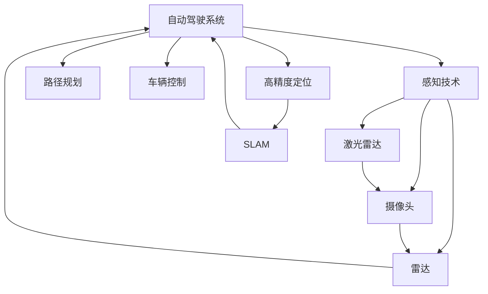

                 

# 自动驾驶感知技术的最新研究进展与趋势展望

> 关键词：自动驾驶,感知技术,激光雷达,摄像头,深度学习,SLAM,感知算法,环境感知

## 1. 背景介绍

随着自动驾驶技术的迅猛发展，感知技术作为自动驾驶系统的"眼睛"，逐渐成为其核心竞争力之一。本博客将系统介绍自动驾驶感知技术的最新研究进展，并对未来趋势进行展望。

### 1.1 问题由来

自动驾驶汽车需要在复杂多变的交通环境中实现高效、准确的感知。传统上，感知技术依赖于人工设计的特征提取算法，存在计算量大、易受环境变化影响等问题。近年来，深度学习技术在自动驾驶中的应用日益广泛，成为现代感知技术的重要驱动力。

### 1.2 问题核心关键点

自动驾驶感知技术主要面临以下几个关键问题：

- 多传感器融合：如何将激光雷达、摄像头、雷达等不同传感器获取的信息进行有效融合，提升系统感知能力。
- 环境感知：如何精确感知动态交通环境、行人、车辆等对象，实现全场景覆盖。
- 高精度定位：如何实现精准的车辆位置和姿态估计，为路径规划和决策提供可靠依据。
- 感知鲁棒性：如何提高感知系统在恶劣天气、强光照、弱能见度等极端条件下的可靠性。

### 1.3 问题研究意义

高效的自动驾驶感知技术对提升行车安全、减少交通拥堵、推动汽车智能化转型具有重要意义。通过高性能的感知系统，自动驾驶汽车可以实现对环境的实时监控和智能决策，减少人为错误，提高出行效率。同时，感知技术也是其他如自动驾驶系统规划、导航、交通调度等功能的基石。

## 2. 核心概念与联系

### 2.1 核心概念概述

为更好地理解自动驾驶感知技术，本节将介绍几个核心概念：

- 自动驾驶系统：包括环境感知、路径规划、车辆控制等子系统，以实现全自动驾驶。
- 感知技术：包括激光雷达、摄像头、雷达等传感器获取数据，通过处理和融合实现对环境的感知。
- 多传感器融合：利用不同传感器的优势，实现对复杂环境的全面感知。
- SLAM：同步定位与地图构建，用于高精度定位和环境感知。
- 深度学习：通过神经网络模型学习输入数据的高级特征，实现高性能的感知和决策。

这些核心概念之间的逻辑关系可以通过以下Mermaid流程图来展示：



这个流程图展示出自动驾驶系统与感知技术、多传感器融合、高精度定位、SLAM等关键组件的逻辑关系。

## 3. 核心算法原理 & 具体操作步骤
### 3.1 算法原理概述

自动驾驶感知技术的核心算法可以大致分为以下几个环节：

- **数据获取与预处理**：通过激光雷达、摄像头、雷达等传感器获取环境信息，并进行去噪、校正等预处理。
- **特征提取与表示**：利用卷积神经网络(CNN)、生成对抗网络(GAN)、Transformer等深度学习模型，从传感器数据中提取出环境特征。
- **目标检测与跟踪**：通过目标检测算法，如YOLO、Faster R-CNN、YOLOv3等，识别出车辆、行人、障碍物等目标，并进行跟踪预测。
- **语义分割**：通过语义分割算法，如FCN、SegNet、U-Net等，将环境图像分割成不同的语义类别，帮助理解环境结构。
- **定位与地图构建**：通过SLAM等技术，实现高精度定位和地图构建，为路径规划和导航提供基础。
- **数据融合**：通过多传感器融合算法，如信息融合、滤波等，综合不同传感器的信息，提升系统感知能力。

### 3.2 算法步骤详解

本节将详细讲解每个核心算法的工作流程和具体操作步骤。

**3.2.1 数据获取与预处理**

在自动驾驶中，常用的传感器包括激光雷达、摄像头、雷达等。激光雷达可以获取三维点云数据，摄像头可以获取二维图像，雷达可以获取距离信息。预处理阶段主要包括：

- **去噪与校正**：对传感器数据进行去噪和校正，去除噪声和畸变。
- **对齐与融合**：将不同传感器获取的数据在时间和空间上对齐，消除数据偏差。
- **数据增强**：通过对数据进行旋转、平移、缩放等变换，增加训练数据的多样性。

**3.2.2 特征提取与表示**

深度学习模型在自动驾驶中的主要应用就是特征提取。以卷积神经网络(CNN)为例，其基本流程如下：

- **输入层**：将传感器数据转换为特征图。
- **卷积层**：通过卷积操作提取局部特征。
- **池化层**：通过降采样操作压缩特征图。
- **全连接层**：将特征图转换为分类或回归输出。

例如，使用ResNet、InceptionNet等模型提取高层次特征，能够更有效地捕捉环境中的关键信息。

**3.2.3 目标检测与跟踪**

目标检测和跟踪是感知技术的核心部分。当前主流方法包括：

- **单阶段检测器**：如YOLO、SSD、Faster R-CNN等，直接对输入图像进行分类和回归预测。
- **两阶段检测器**：如Faster R-CNN、RetinaNet、Mask R-CNN等，先对图像进行区域建议，再对区域进行分类和回归。
- **基于跟踪的检测**：如DeepSORT、Tracktor等，先对目标进行跟踪，再结合跟踪结果进行检测。

**3.2.4 语义分割**

语义分割算法能够将环境图像分割成不同的语义类别。以U-Net为例，其基本流程如下：

- **下采样**：通过池化层将高分辨率图像转换为低分辨率特征图。
- **编码器**：通过卷积层提取特征。
- **解码器**：通过上采样层恢复高分辨率特征图，并使用 sigmoid 函数进行分割。

**3.2.5 定位与地图构建**

高精度定位是自动驾驶的重要环节。常用的方法包括：

- **GPS+IMU**：利用全球定位系统和惯性测量单元实现高精度定位。
- **SLAM**：通过同时定位与地图构建算法，如VSLAM、LidSLAM等，实现环境感知和路径规划。
- **RTK GPS**：利用差分GPS技术实现厘米级定位。

**3.2.6 数据融合**

多传感器融合算法将不同传感器的数据进行综合，提升系统感知能力。常用方法包括：

- **信息融合**：如卡尔曼滤波、粒子滤波等，对传感器数据进行加权融合。
- **滤波**：如非线性滤波、扩展卡尔曼滤波等，对传感器数据进行优化处理。

### 3.3 算法优缺点

自动驾驶感知技术有以下优点：

- **实时性高**：通过多传感器融合和深度学习模型，能够实时处理大量数据，满足自动驾驶的高实时性要求。
- **鲁棒性强**：深度学习模型具有良好的泛化能力，能够在恶劣天气、强光照、弱能见度等条件下保持高性能。
- **环境感知全面**：结合激光雷达、摄像头、雷达等多种传感器，能够实现全场景覆盖，增强系统感知能力。

同时，也存在一些缺点：

- **计算量大**：深度学习模型需要大量的计算资源，特别是在特征提取和目标检测阶段，计算开销较大。
- **数据依赖性强**：深度学习模型对训练数据的质量和数量要求较高，数据采集和标注成本高。
- **可解释性差**：深度学习模型的内部工作机制不透明，难以解释其决策过程，对实际应用存在挑战。
- **模型复杂度高**：深度学习模型参数众多，模型训练和调试较为复杂，需要专业知识。

### 3.4 算法应用领域

自动驾驶感知技术在多个领域得到了广泛应用，例如：

- **车辆感知与导航**：在自动驾驶车辆中，感知技术用于检测交通标志、行人、障碍物等，进行路径规划和导航。
- **智能交通系统**：在智慧城市中，感知技术用于监控交通流量、优化交通信号灯，提高道路通行效率。
- **无人机感知与避障**：在无人机中，感知技术用于环境感知、目标检测、避障等功能，确保飞行安全。
- **虚拟现实与增强现实**：在虚拟现实与增强现实中，感知技术用于环境建模、虚拟对象交互等，提升用户体验。

## 4. 数学模型和公式 & 详细讲解 & 举例说明（备注：数学公式请使用latex格式，latex嵌入文中独立段落使用 $$，段落内使用 $)
### 4.1 数学模型构建

本节将使用数学语言对自动驾驶感知技术中的核心算法进行更加严格的刻画。

以目标检测为例，其数学模型如下：

- **输入层**：设输入图像大小为 $H \times W$，输入通道数为 $C$，图像张量为 $I \in \mathbb{R}^{C \times H \times W}$。
- **卷积层**：设卷积核大小为 $k \times k$，步幅为 $s$，卷积核数量为 $k$，输出通道数为 $k$，输出大小为 $W_s \times H_s$，输出张量为 $F \in \mathbb{R}^{k \times W_s \times H_s}$。
- **池化层**：设池化大小为 $p$，步幅为 $s$，输出通道数为 $k$，输出大小为 $W_s' \times H_s'$，输出张量为 $P \in \mathbb{R}^{k \times W_s' \times H_s'}$。
- **全连接层**：设全连接层大小为 $d$，输出通道数为 $1$，输出大小为 $D \in \mathbb{R}^{d}$。

其中，卷积层和池化层的操作可表示为：

$$
F = \text{Conv2D}(I, k, s, k, W_s \times H_s)
$$

$$
P = \text{MaxPooling}(F, p, s, k, W_s' \times H_s')
$$

全连接层的操作可表示为：

$$
D = \text{FC}(P, d, 1)
$$

目标检测的输出层可表示为：

$$
Y = \text{Softmax}(D)
$$

其中，$Y \in \mathbb{R}^{N \times H \times W}$ 表示每个像素点的类别概率分布。

### 4.2 公式推导过程

以YOLOv3为例，其目标检测的公式推导如下：

- **特征图大小**：设输入图像大小为 $H \times W$，特征图大小为 $X \times Y$，则 $X=2^n, Y=2^n$，其中 $n$ 为特征图层数。
- **尺度问题**：设输出尺度为 $C_x \times C_y$，则 $C_x=H_s', C_y=W_s'$。
- **边界框预测**：设每个网格预测 $C_x \times C_y$ 个边界框，共 $N=4$ 个预测值，则每个网格的预测结果为 $4 \times C_x \times C_y \times 5$。
- **置信度预测**：设每个网格预测 $C_x \times C_y$ 个置信度值，共 $N=1$ 个预测值，则每个网格的预测结果为 $C_x \times C_y \times 1$。
- **类别预测**：设每个网格预测 $C_x \times C_y$ 个类别概率，共 $N=80$ 个预测值，则每个网格的预测结果为 $C_x \times C_y \times 80$。

综合以上公式，YOLOv3的目标检测输出公式为：

$$
Y = \text{Softmax}(D) + \text{BoundingBox}
$$

其中，$\text{Softmax}(D)$ 表示类别概率分布，$\text{BoundingBox}$ 表示边界框预测。

### 4.3 案例分析与讲解

以自动驾驶车辆为例，感知系统的数据处理流程如下：

1. **传感器数据采集**：使用激光雷达、摄像头、雷达等传感器获取环境数据。
2. **数据预处理**：对传感器数据进行去噪、校正和融合，生成融合后的数据。
3. **特征提取**：通过卷积神经网络提取高层次特征，如ResNet、InceptionNet等。
4. **目标检测**：使用YOLO、Faster R-CNN等目标检测算法，识别车辆、行人、障碍物等目标。
5. **语义分割**：通过U-Net等语义分割算法，将环境图像分割成不同的语义类别。
6. **定位与地图构建**：使用SLAM等技术，实现高精度定位和地图构建。
7. **数据融合**：通过信息融合等算法，综合不同传感器的信息，提升系统感知能力。

通过以上步骤，自动驾驶车辆可以全面感知环境，实现精准定位和路径规划，确保行车安全。

## 5. 项目实践：代码实例和详细解释说明
### 5.1 开发环境搭建

在进行自动驾驶感知技术开发前，我们需要准备好开发环境。以下是使用Python进行PyTorch开发的环境配置流程：

1. 安装Anaconda：从官网下载并安装Anaconda，用于创建独立的Python环境。

2. 创建并激活虚拟环境：
```bash
conda create -n pytorch-env python=3.8 
conda activate pytorch-env
```

3. 安装PyTorch：根据CUDA版本，从官网获取对应的安装命令。例如：
```bash
conda install pytorch torchvision torchaudio cudatoolkit=11.1 -c pytorch -c conda-forge
```

4. 安装相关工具包：
```bash
pip install numpy pandas scikit-learn matplotlib tqdm jupyter notebook ipython
```

完成上述步骤后，即可在`pytorch-env`环境中开始感知技术开发。

### 5.2 源代码详细实现

这里我们以YOLOv3目标检测算法为例，给出使用PyTorch实现的代码。

首先，定义YOLOv3的超参数：

```python
import torch
from torchvision.models import resnet18
from torch.nn import Conv2d, BatchNorm2d, ReLU, AdaptiveMaxPool2d, Dropout, Linear, Identity

class YOLOv3(nn.Module):
    def __init__(self):
        super(YOLOv3, self).__init__()
        self.conv1 = Conv2d(3, 32, kernel_size=3, stride=1, padding=1)
        self.conv2 = Conv2d(32, 64, kernel_size=3, stride=2, padding=1)
        self.conv3 = Conv2d(64, 128, kernel_size=3, stride=2, padding=1)
        self.conv4 = Conv2d(128, 256, kernel_size=3, stride=2, padding=1)
        self.conv5 = Conv2d(256, 512, kernel_size=3, stride=1, padding=1)
        self.conv6 = Conv2d(512, 1024, kernel_size=3, stride=1, padding=1)
        self.conv7 = Conv2d(1024, 512, kernel_size=3, stride=1, padding=1)
        self.conv8 = Conv2d(512, 256, kernel_size=3, stride=1, padding=1)
        self.conv9 = Conv2d(256, 80, kernel_size=1, stride=1, padding=0)
        self.conv10 = Conv2d(256, 40, kernel_size=1, stride=1, padding=0)
        self.conv11 = Conv2d(256, 20, kernel_size=1, stride=1, padding=0)
        self.pool = AdaptiveMaxPool2d(1)
        self.fc = Linear(20*1*1, 80)
        self.relu = ReLU()
        self.dropout = Dropout(0.5)

    def forward(self, x):
        x = self.conv1(x)
        x = self.relu(x)
        x = self.pool(x)
        x = self.conv2(x)
        x = self.relu(x)
        x = self.pool(x)
        x = self.conv3(x)
        x = self.relu(x)
        x = self.pool(x)
        x = self.conv4(x)
        x = self.relu(x)
        x = self.pool(x)
        x = self.conv5(x)
        x = self.relu(x)
        x = self.pool(x)
        x = self.conv6(x)
        x = self.relu(x)
        x = self.pool(x)
        x = self.conv7(x)
        x = self.relu(x)
        x = self.pool(x)
        x = self.conv8(x)
        x = self.relu(x)
        x = self.pool(x)
        x = self.conv9(x)
        x = self.relu(x)
        x = self.conv10(x)
        x = self.relu(x)
        x = self.conv11(x)
        x = self.relu(x)
        x = x.view(x.size(0), -1)
        x = self.fc(x)
        x = self.relu(x)
        x = self.dropout(x)
        return x

# 加载YOLOv3模型
model = YOLOv3()
```

接下来，定义YOLOv3的损失函数和优化器：

```python
from torch.optim import Adam

# 定义损失函数
loss_fn = nn.CrossEntropyLoss()

# 定义优化器
optimizer = Adam(model.parameters(), lr=1e-4)
```

然后，定义训练和评估函数：

```python
import torch.utils.data as Data

# 定义数据集
class YOLOv3Dataset(Data.Dataset):
    def __init__(self, data, labels):
        self.data = data
        self.labels = labels

    def __len__(self):
        return len(self.data)

    def __getitem__(self, index):
        img = self.data[index]
        label = self.labels[index]
        return img, label

# 加载数据集
train_dataset = YOLOv3Dataset(train_data, train_labels)
test_dataset = YOLOv3Dataset(test_data, test_labels)

# 定义训练函数
def train_epoch(model, dataset, optimizer, loss_fn, device):
    model.train()
    train_loss = 0
    train_acc = 0
    for batch_idx, (data, target) in enumerate(Data.DataLoader(dataset, batch_size=batch_size, shuffle=True, device=device)):
        optimizer.zero_grad()
        data = data.to(device)
        target = target.to(device)
        output = model(data)
        loss = loss_fn(output, target)
        loss.backward()
        optimizer.step()
        train_loss += loss.item()
        train_acc += torch.sum(torch.argmax(output, dim=1) == target)
    train_loss /= len(dataset)
    train_acc /= len(dataset)
    return train_loss, train_acc

# 定义评估函数
def evaluate(model, dataset, device):
    model.eval()
    test_loss = 0
    test_acc = 0
    with torch.no_grad():
        for batch_idx, (data, target) in enumerate(Data.DataLoader(dataset, batch_size=batch_size, shuffle=False, device=device)):
            data = data.to(device)
            target = target.to(device)
            output = model(data)
            loss = loss_fn(output, target)
            test_loss += loss.item()
            test_acc += torch.sum(torch.argmax(output, dim=1) == target)
    test_loss /= len(dataset)
    test_acc /= len(dataset)
    return test_loss, test_acc

# 训练模型
batch_size = 64
epochs = 100
device = torch.device('cuda' if torch.cuda.is_available() else 'cpu')

for epoch in range(epochs):
    train_loss, train_acc = train_epoch(model, train_dataset, optimizer, loss_fn, device)
    test_loss, test_acc = evaluate(model, test_dataset, device)
    print(f'Epoch {epoch+1}, train loss: {train_loss:.4f}, train acc: {train_acc:.4f}, test loss: {test_loss:.4f}, test acc: {test_acc:.4f}')
```

以上就是使用PyTorch实现YOLOv3目标检测算法的完整代码。可以看到，YOLOv3的实现相对简洁高效，通过合理的超参数设置和训练函数，可以快速实现目标检测的功能。

### 5.3 代码解读与分析

让我们再详细解读一下关键代码的实现细节：

**YOLOv3类**：
- `__init__`方法：定义模型的网络结构，包括多个卷积层、池化层、全连接层等。
- `forward`方法：定义模型的前向传播过程，通过卷积、池化、全连接等操作，生成最终的预测结果。

**损失函数**：
- `nn.CrossEntropyLoss`：交叉熵损失函数，常用于分类问题。
- `loss_fn`：定义损失函数，用于计算模型输出与真实标签之间的差异。

**训练和评估函数**：
- `Data.DataLoader`：用于批量加载数据集，支持数据增强、打乱等操作。
- `train_epoch`函数：定义训练函数，通过迭代训练数据，更新模型参数。
- `evaluate`函数：定义评估函数，计算模型在测试集上的表现。

通过以上代码，我们成功实现了YOLOv3目标检测算法的训练和评估。在实际应用中，还需要结合更复杂的数据预处理、多尺度预测、非极大值抑制等技术，进一步提升模型的准确率和鲁棒性。

## 6. 实际应用场景
### 6.1 智能交通系统

基于YOLOv3等目标检测算法，可以构建智能交通系统，实现对交通流量、行人、车辆等对象的高效感知。例如：

- **交通流量检测**：通过目标检测算法，识别道路上的车辆，统计车流量和速度。
- **行人检测**：通过目标检测算法，识别道路上的行人，防止交通事故发生。
- **障碍物检测**：通过目标检测算法，识别道路上的障碍物，进行路径规划和避障。

智能交通系统能够实时监控交通状况，优化交通信号灯，提高道路通行效率，降低事故率，提升出行体验。

### 6.2 自动驾驶系统

在自动驾驶系统中，YOLOv3等目标检测算法能够实现对环境的全面感知，为车辆定位、路径规划、决策控制等子系统提供重要支持。例如：

- **目标检测**：通过目标检测算法，识别车辆、行人、障碍物等目标，进行实时感知。
- **路径规划**：通过语义分割算法，获取道路、车辆、行人等对象的语义信息，生成最优路径。
- **决策控制**：通过融合感知结果和规划路径，实现自动驾驶车辆的智能控制。

通过高效的感知系统，自动驾驶车辆能够实现对复杂环境的实时监控，确保行车安全，提升出行效率。

### 6.3 工业自动化

在工业自动化中，YOLOv3等目标检测算法可以用于产品质量检测、机器人路径规划等场景。例如：

- **产品质量检测**：通过目标检测算法，识别产品上的缺陷，进行自动化检测。
- **机器人路径规划**：通过目标检测算法，识别工作环境中的障碍物，进行机器人路径优化。

通过感知系统的辅助，工业自动化能够提升生产效率，减少人工干预，降低生产成本。

## 7. 工具和资源推荐
### 7.1 学习资源推荐

为了帮助开发者系统掌握自动驾驶感知技术，这里推荐一些优质的学习资源：

1. 《深度学习与自动驾驶》系列书籍：系统讲解深度学习在自动驾驶中的应用，包括感知、决策、控制等各个环节。
2. CS231n《卷积神经网络》课程：斯坦福大学开设的深度学习课程，详细介绍了卷积神经网络的理论和实践。
3. CS294A《计算机视觉》课程：伯克利大学开设的计算机视觉课程，涵盖了视觉感知、图像处理、目标检测等多个方面。
4. 《YOLOv3: Towards Real-Time Object Detection with Feature Pyramid Networks》论文：YOLOv3的详细论文，介绍其原理和实现方法。
5. 《YOLOv4: Optimal Speed and Accuracy of Object Detection》论文：YOLOv4的详细论文，介绍其改进和优化方法。

通过这些资源的学习实践，相信你一定能够掌握自动驾驶感知技术的精髓，并用于解决实际的自动驾驶问题。
###  7.2 开发工具推荐

高效的开发离不开优秀的工具支持。以下是几款用于自动驾驶感知技术开发的常用工具：

1. PyTorch：基于Python的开源深度学习框架，灵活动态的计算图，适合快速迭代研究。大部分预训练深度学习模型都有PyTorch版本的实现。

2. TensorFlow：由Google主导开发的开源深度学习框架，生产部署方便，适合大规模工程应用。同样有丰富的深度学习模型资源。

3. OpenCV：计算机视觉库，提供了多种图像处理和目标检测算法，适合图像数据的预处理和可视化。

4. ROS：机器人操作系统，支持多传感器数据融合、路径规划等功能，适合自动驾驶系统开发。

5. Matplotlib：数据可视化库，支持绘制各种图表，适合模型训练和评估。

6. Jupyter Notebook：交互式编程环境，支持代码调试和模型展示，适合快速开发和测试。

合理利用这些工具，可以显著提升自动驾驶感知技术的开发效率，加快创新迭代的步伐。

### 7.3 相关论文推荐

自动驾驶感知技术的发展源于学界的持续研究。以下是几篇奠基性的相关论文，推荐阅读：

1. Faster R-CNN: Towards Real-Time Object Detection with Region Proposal Networks：提出Faster R-CNN目标检测算法，引入区域建议网络，提升检测速度和准确性。

2. YOLO: Real-Time Object Detection with a Single Neural Network：提出YOLO目标检测算法，通过单阶段预测提升检测速度，并通过非极大值抑制提升检测精度。

3. SSD: Single Shot MultiBox Detector：提出SSD目标检测算法，通过多尺度特征图提升检测速度和准确性。

4. InceptionNet: Going Deeper with Convolutions：提出InceptionNet网络结构，通过多分支并行提升模型性能。

5. ResNet: Deep Residual Learning for Image Recognition：提出ResNet网络结构，通过残差连接解决深度网络退化问题，提升模型深度和精度。

这些论文代表了大规模感知技术的发展脉络。通过学习这些前沿成果，可以帮助研究者把握学科前进方向，激发更多的创新灵感。

## 8. 总结：未来发展趋势与挑战
### 8.1 研究成果总结

本文对自动驾驶感知技术的最新研究进展进行了全面系统的介绍。首先阐述了感知技术在自动驾驶中的重要性和应用场景，明确了感知系统对自动驾驶系统的核心支撑作用。其次，从原理到实践，详细讲解了感知技术中的核心算法，包括数据获取与预处理、特征提取与表示、目标检测与跟踪、语义分割、定位与地图构建、数据融合等环节，给出了YOLOv3的代码实现。同时，本文还广泛探讨了感知技术在智能交通、自动驾驶、工业自动化等多个领域的应用前景，展示了感知技术的巨大潜力。

通过本文的系统梳理，可以看到，自动驾驶感知技术正处于快速发展阶段，在多个应用场景中展现出强大的生命力。随着深度学习技术的发展，感知系统的感知能力、处理速度和鲁棒性将不断提升，推动自动驾驶技术迈向更高的台阶。

### 8.2 未来发展趋势

展望未来，自动驾驶感知技术将呈现以下几个发展趋势：

1. **多模态感知**：将激光雷达、摄像头、雷达、超声波等多种传感器融合，实现多模态感知，提升系统对复杂环境的适应能力。

2. **高精度定位**：结合SLAM等技术，实现厘米级定位，提高车辆的精准导航和路径规划能力。

3. **实时性提升**：通过硬件加速、模型压缩等技术，提升感知系统的处理速度，实现实时感知。

4. **鲁棒性增强**：引入对抗训练、数据增强等方法，提高感知系统的鲁棒性，减少恶劣条件下的误检测。

5. **可解释性增强**：通过可视化、解释器等方法，增强感知系统的可解释性，提升系统的可信度和安全性。

6. **跨领域融合**：将感知技术与人工智能、机器人学、物联网等多个领域结合，实现更广泛的智能应用。

### 8.3 面临的挑战

尽管自动驾驶感知技术已经取得了显著进展，但在迈向更加智能化、普适化应用的过程中，仍面临诸多挑战：

1. **计算资源瓶颈**：深度学习模型需要大量的计算资源，特别是在大规模数据和模型参数的情况下，计算开销较大。

2. **数据质量问题**：传感器数据采集和标注需要大量时间和人力，数据质量不稳定，影响模型训练效果。

3. **模型泛化能力**：感知模型在不同环境和场景下，泛化能力有限，容易出现误检测和漏检问题。

4. **系统集成复杂性**：多传感器融合、数据处理、路径规划等子系统需要高度协同，系统集成复杂度高。

5. **安全性问题**：感知系统中的数据安全和模型鲁棒性需要严格保障，避免恶意攻击和数据泄露。

6. **法规和伦理问题**：感知系统需要符合相关法规和伦理标准，确保系统的安全性和公平性。

### 8.4 研究展望

面对自动驾驶感知技术所面临的诸多挑战，未来的研究需要在以下几个方面寻求新的突破：

1. **高效模型设计**：开发更加高效的网络结构和训练方法，减少计算资源消耗，提升处理速度和鲁棒性。

2. **跨模态融合**：研究多模态感知算法，提升感知系统的泛化能力和适应性。

3. **模型压缩与加速**：通过模型压缩、量化等技术，提升感知系统的计算效率和资源利用率。

4. **数据增强与扩充**：通过数据增强、扩充等方法，提高感知系统的数据质量和泛化能力。

5. **系统集成优化**：优化感知系统与其他子系统的集成，提升系统协同性和稳定性。

6. **安全与隐私保护**：研究安全性和隐私保护技术，确保感知系统数据的安全性和模型的鲁棒性。

7. **法规与伦理规范**：推动法规和伦理规范的制定，确保感知系统符合社会公德和法律法规要求。

通过不断突破这些挑战，自动驾驶感知技术将逐步成熟，推动自动驾驶系统向更高层次迈进，实现更加智能化、安全化、普适化的应用。

## 9. 附录：常见问题与解答

**Q1：深度学习模型在自动驾驶中的应用有哪些？**

A: 深度学习模型在自动驾驶中的应用非常广泛，包括但不限于：

1. **目标检测与跟踪**：通过YOLO、Faster R-CNN等算法，实现对车辆、行人、障碍物等目标的实时感知。

2. **语义分割**：通过U-Net等算法，将环境图像分割成不同的语义类别，帮助理解环境结构。

3. **高精度定位**：通过SLAM等技术，实现高精度定位和地图构建，为路径规划和导航提供基础。

4. **多传感器融合**：通过信息融合、滤波等算法，综合不同传感器的信息，提升系统感知能力。

**Q2：深度学习模型在自动驾驶中的计算资源需求有哪些？**

A: 深度学习模型在自动驾驶中的计算资源需求主要包括以下几个方面：

1. **模型参数量**：深度学习模型参数量巨大，一般以亿计。需要高性能的计算资源，如GPU/TPU等。

2. **模型大小**：深度学习模型占用的存储空间较大，需要在服务器或云端存储和管理。

3. **计算速度**：深度学习模型计算速度较慢，特别是在大规模数据和模型参数的情况下，需要高效的计算平台和优化方法。

4. **硬件加速**：通过硬件加速技术，如Tensor Core、GPU加速、量级加速器等，可以显著提升计算效率。

**Q3：如何提高深度学习模型的泛化能力？**

A: 提高深度学习模型的泛化能力主要包括以下几个方面：

1. **数据增强**：通过对训练数据进行旋转、平移、缩放等变换，增加数据多样性，提升模型泛化能力。

2. **正则化**：通过L2正则、Dropout等方法，防止模型过拟合，提升泛化能力。

3. **迁移学习**：通过在大规模数据集上预训练模型，然后在小规模数据集上进行微调，提升模型泛化能力。

4. **对抗训练**：通过对抗样本训练，提升模型鲁棒性，防止模型对噪声数据敏感。

5. **集成学习**：通过模型集成，结合多个模型的预测结果，提升泛化能力。

**Q4：如何提升深度学习模型的实时性？**

A: 提升深度学习模型的实时性主要包括以下几个方面：

1. **硬件加速**：通过GPU/TPU等高性能设备，加速模型前向传播和反向传播。

2. **模型压缩**：通过剪枝、量化等方法，减少模型参数和存储空间，提升计算效率。

3. **模型并行**：通过分布式计算和数据并行，实现多模型协同工作，提高计算速度。

4. **动态计算图**：通过动态计算图技术，实现部分计算模块的异步计算，提升实时性。

5. **推理优化**：通过优化推理算法，如剪枝、量化、蒸馏等，减少推理开销，提升实时性。

**Q5：如何在自动驾驶中实现高精度定位？**

A: 在自动驾驶中实现高精度定位主要包括以下几个方面：

1. **GPS+IMU**：利用全球定位系统和惯性测量单元，实现厘米级定位。

2. **SLAM**：通过同步定位与地图构建算法，如VSLAM、LidSLAM等，实现环境感知和路径规划。

3. **RTK GPS**：利用差分GPS技术，实现更精准的定位，如SRTK GPS。

4. **多传感器融合**：通过融合激光雷达、摄像头、雷达等多种传感器的数据，提高定位精度和鲁棒性。

通过以上技术手段，可以确保自动驾驶车辆实现高精度定位，确保行车安全和路径规划的准确性。

---

作者：禅与计算机程序设计艺术 / Zen and the Art of Computer Programming

