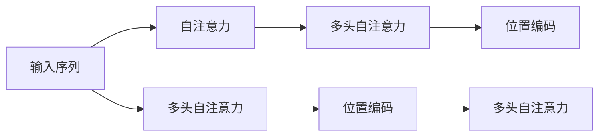

                 

# 自注意力机制的详细工作原理

自注意力机制是现代深度学习领域中的一种重要技术，其核心思想是通过计算输入数据的"注意力"权重，来对输入序列中的不同部分进行加权聚合，以捕捉长程依赖和关键信息，从而达到更好的特征表示和建模能力。自注意力机制的典型应用是在Transformer模型中，使其在自然语言处理、图像识别等领域取得了显著的性能提升。本文将详细介绍自注意力机制的工作原理、算法步骤、优缺点以及实际应用场景。

## 1. 背景介绍

自注意力机制的提出源于需要解决深度学习模型中梯度消失和梯度爆炸等问题。传统的循环神经网络(RNN)和卷积神经网络(CNN)在处理长序列和复杂结构时，往往面临梯度消失或梯度爆炸的问题，导致模型训练困难、收敛速度慢、过拟合严重。为此，一种新的深度学习架构Transformer被提出，其核心便是自注意力机制。

Transformer使用自注意力机制，通过计算输入序列中各元素之间的相似度，动态地对输入序列进行加权聚合，从而捕捉到序列中的关键信息。自注意力机制不仅能有效处理长序列，还能在一定程度上缓解梯度消失和梯度爆炸问题，使得模型训练更加稳定和高效。

## 2. 核心概念与联系

### 2.1 核心概念概述

为更好地理解自注意力机制的工作原理，本节将介绍几个密切相关的核心概念：

- 注意力机制(Attention Mechanism)：通过计算输入数据之间的相似度，对数据进行加权聚合的过程。自注意力机制是一种特殊的注意力机制，应用于输入序列的自相关性计算。
- 自注意力(Self-Attention)：指将输入序列中的所有位置作为查询(Q)、键(K)和值(V)，计算不同位置之间的相似度，并对每个位置进行加权聚合的过程。
- 多头自注意力(Multi-Head Self-Attention)：将自注意力机制分解成多个并行的子注意力头，同时计算不同子空间中的注意力权重。这样可以提高模型的表征能力。
- 位置编码(Positional Encoding)：由于自注意力机制没有显式地引入时间或空间位置信息，因此需要使用位置编码来区分不同位置的元素。

这些核心概念之间的逻辑关系可以通过以下Mermaid流程图来展示：



这个流程图展示了这个过程的基本逻辑：输入序列通过自注意力机制进行加权聚合，并通过多头自注意力机制进一步增强表征能力。位置编码则用来区分不同位置的元素，使模型能够感知序列的时间或空间关系。

## 3. 核心算法原理 & 具体操作步骤

### 3.1 算法原理概述

自注意力机制的核心思想是通过计算输入序列中各元素之间的相似度，对输入序列进行加权聚合，从而捕捉到序列中的关键信息。自注意力机制的目标是使得模型能够对输入序列中的每个位置进行"自关注"，即对序列中不同位置进行加权求和，以达到对序列中各个位置的信息进行充分利用的目的。

形式化地，设输入序列为 $X=\{x_1,x_2,\ldots,x_n\}$，其中 $x_i$ 表示序列中的第 $i$ 个元素。设 $Q,K,V$ 分别为查询向量、键向量和值向量，它们可以通过线性变换从输入序列 $X$ 得到。计算注意力权重 $\alpha$ 的方法为：

$$
\alpha_i = \text{softmax}(Q_i \cdot K_i^T)
$$

其中，$Q_i \cdot K_i^T$ 表示查询向量 $Q_i$ 与键向量 $K_i$ 的点积。$\text{softmax}$ 函数可以将点积结果转化为概率分布，从而得到每个位置的注意力权重。

接着，将注意力权重 $\alpha$ 应用于值向量 $V$ 中，得到加权聚合后的表示 $Z$：

$$
Z = \sum_{i=1}^n \alpha_i V_i
$$

最后，将 $Z$ 与其他非自注意力层进行堆叠，即可得到整个自注意力机制的输出。

### 3.2 算法步骤详解

自注意力机制的实现步骤如下：

1. **查询向量(Q)、键向量(K)和值向量(V)的生成**：将输入序列 $X$ 通过线性变换得到查询向量 $Q$、键向量 $K$ 和值向量 $V$。

2. **注意力权重计算**：通过计算 $Q$ 与 $K$ 的点积，得到每个位置上的注意力权重 $\alpha$。

3. **加权求和**：将注意力权重 $\alpha$ 应用于值向量 $V$，得到加权聚合后的表示 $Z$。

4. **多头注意力计算**：将自注意力机制进行 $h$ 次堆叠，得到 $h$ 个并行的子注意力头，并行计算得到 $h$ 个加权聚合表示 $Z_1,Z_2,\ldots,Z_h$。

5. **拼接与输出**：将 $h$ 个子注意力头进行拼接，并通过线性变换得到最终的自注意力机制输出。

下面以代码形式展示一个简单的自注意力机制计算过程：

```python
import torch
import torch.nn as nn

class MultiHeadAttention(nn.Module):
    def __init__(self, in_dim, n_heads, d_head, dropout=0.1):
        super().__init__()
        self.in_dim = in_dim
        self.n_heads = n_heads
        self.d_head = d_head
        self.head_dim = d_head
        self.w_q = nn.Linear(in_dim, n_heads*d_head, bias=False)
        self.w_k = nn.Linear(in_dim, n_heads*d_head, bias=False)
        self.w_v = nn.Linear(in_dim, n_heads*d_head, bias=False)
        self.fc = nn.Linear(n_heads*d_head, in_dim, bias=False)
        self.dropout = nn.Dropout(dropout)
        
    def forward(self, x, mask=None):
        m = x.shape[1]
        q, k, v = self.w_q(x), self.w_k(x), self.w_v(x)
        q = q.view(q.shape[0], m, self.n_heads, self.d_head).transpose(1, 2)
        k = k.view(k.shape[0], m, self.n_heads, self.d_head).transpose(1, 2)
        v = v.view(v.shape[0], m, self.n_heads, self.d_head).transpose(1, 2)
        
        attn = (q * k.transpose(2, 3)).sum(dim=-1) / math.sqrt(self.d_head)
        attn = nn.functional.softmax(attn, dim=-1)
        attn = self.dropout(attn)
        x = (attn * v).sum(dim=2).transpose(1, 2)
        x = self.fc(x)
        return x
```

### 3.3 算法优缺点

自注意力机制具有以下优点：

1. 能够捕捉长程依赖：自注意力机制通过计算输入序列中各元素之间的相似度，能够捕捉到序列中的长程依赖关系，而传统的RNN和CNN在这方面存在缺陷。

2. 能够并行计算：由于自注意力机制是通过计算点积和softmax函数来实现的，可以并行计算多个子注意力头，从而加快计算速度。

3. 能够处理变长序列：自注意力机制不受序列长度的限制，可以处理变长序列，并且可以通过位置编码来区分不同位置的元素。

4. 能够提升表征能力：自注意力机制能够从输入序列中提取关键信息，提升模型的表征能力，从而在各种任务上取得更好的性能。

同时，自注意力机制也存在以下缺点：

1. 计算复杂度高：自注意力机制的计算复杂度较高，特别是在序列长度较长时，计算量会急剧增加。

2. 参数量较大：由于自注意力机制需要计算多个子注意力头，因此模型参数量较大，导致内存消耗较大。

3. 存在注意力偏差：自注意力机制的注意力权重分布可能存在偏差，导致某些位置的信息被忽略或过度关注。

4. 无法处理特定位置的噪声：由于自注意力机制只考虑了全局信息，对于输入序列中特定位置的噪声，可能无法准确捕捉和处理。

5. 无法处理特定位置的依赖：由于自注意力机制只考虑了全局信息，对于输入序列中特定位置之间的依赖关系，可能无法准确捕捉和处理。

### 3.4 算法应用领域

自注意力机制已被广泛应用于各种领域，如自然语言处理、图像识别、音频处理等。以下是几个典型的应用场景：

1. 自然语言处理：在机器翻译、文本分类、问答系统等任务中，自注意力机制能够捕捉输入序列中的长程依赖关系，从而提升模型的性能。

2. 图像识别：在图像分类、目标检测等任务中，自注意力机制能够捕捉输入图像中的关键特征，提升模型的识别能力。

3. 音频处理：在语音识别、音频分类等任务中，自注意力机制能够捕捉输入音频中的关键特征，提升模型的识别能力。

4. 生成对抗网络(GAN)：在GAN中，自注意力机制能够捕捉输入图像中的全局信息，从而生成更加逼真的图像。

5. 推荐系统：在推荐系统中，自注意力机制能够捕捉用户和物品之间的关系，从而推荐更加合适的商品。

6. 智能合约：在智能合约中，自注意力机制能够捕捉交易行为中的关键信息，从而提升合约的执行效率和安全性。

## 4. 数学模型和公式 & 详细讲解  
### 4.1 数学模型构建

在自注意力机制中，我们通常将输入序列 $X=\{x_1,x_2,\ldots,x_n\}$ 通过线性变换得到查询向量 $Q$、键向量 $K$ 和值向量 $V$，并将它们拼接为一个矩阵 $A$：

$$
A = \begin{bmatrix}
    Q_1 & K_1 & V_1 \\
    Q_2 & K_2 & V_2 \\
    \vdots & \vdots & \vdots \\
    Q_n & K_n & V_n
\end{bmatrix}
$$

其中，$Q_i$、$K_i$ 和 $V_i$ 分别表示输入序列 $X$ 中第 $i$ 个元素的查询向量、键向量和值向量。设 $q_i$、$k_i$ 和 $v_i$ 分别表示输入序列 $X$ 中第 $i$ 个元素的查询向量、键向量和值向量的嵌入向量。

自注意力机制的计算分为以下几个步骤：

1. **计算注意力权重**：通过计算查询向量 $Q_i$ 与键向量 $K_i$ 的点积，得到注意力权重 $\alpha_i$。

2. **计算加权聚合表示**：将注意力权重 $\alpha_i$ 应用于值向量 $V_i$，得到加权聚合后的表示 $z_i$。

3. **拼接与输出**：将 $z_i$ 拼接为一个向量 $Z$，并通过线性变换得到最终的自注意力机制输出。

数学公式如下：

$$
A = \begin{bmatrix}
    Q_1 & K_1 & V_1 \\
    Q_2 & K_2 & V_2 \\
    \vdots & \vdots & \vdots \\
    Q_n & K_n & V_n
\end{bmatrix}
$$

$$
\alpha_i = \text{softmax}(Q_i K_i^T) = \frac{e^{Q_i K_i^T}}{\sum_{j=1}^n e^{Q_j K_j^T}}
$$

$$
z_i = \alpha_i V_i = \frac{e^{Q_i K_i^T}}{\sum_{j=1}^n e^{Q_j K_j^T}} V_i
$$

$$
Z = [z_1, z_2, \ldots, z_n]
$$

$$
O = W^T Z
$$

其中，$W$ 为线性变换矩阵。

### 4.2 公式推导过程

为了更好地理解自注意力机制的计算过程，我们可以将其拆分为两个步骤进行推导：

1. **计算注意力权重**：
   $$
   \alpha_i = \text{softmax}(Q_i K_i^T) = \frac{e^{Q_i K_i^T}}{\sum_{j=1}^n e^{Q_j K_j^T}}
   $$

2. **计算加权聚合表示**：
   $$
   z_i = \alpha_i V_i = \frac{e^{Q_i K_i^T}}{\sum_{j=1}^n e^{Q_j K_j^T}} V_i
   $$

3. **拼接与输出**：
   $$
   Z = [z_1, z_2, \ldots, z_n]
   $$

4. **线性变换输出**：
   $$
   O = W^T Z
   $$

在自注意力机制的计算过程中，$Q_i$ 和 $K_i$ 表示输入序列 $X$ 中第 $i$ 个元素的查询向量和键向量，$V_i$ 表示输入序列 $X$ 中第 $i$ 个元素的值向量。自注意力机制通过计算 $Q_i$ 与 $K_i$ 的点积，得到每个位置上的注意力权重 $\alpha_i$。然后将注意力权重 $\alpha_i$ 应用于值向量 $V_i$，得到加权聚合后的表示 $z_i$。最后将 $z_i$ 拼接为一个向量 $Z$，并通过线性变换得到最终的自注意力机制输出。

### 4.3 案例分析与讲解

为了更好地理解自注意力机制的计算过程，我们可以举一个简单的例子。假设有三个输入序列 $X=\{x_1,x_2,x_3\}$，其中 $x_1=1, x_2=2, x_3=3$。我们将它们通过线性变换得到查询向量 $Q_i$、键向量 $K_i$ 和值向量 $V_i$，并将它们拼接为一个矩阵 $A$：

$$
A = \begin{bmatrix}
    Q_1 & K_1 & V_1 \\
    Q_2 & K_2 & V_2 \\
    Q_3 & K_3 & V_3
\end{bmatrix}
$$

其中，$Q_i$、$K_i$ 和 $V_i$ 分别表示输入序列 $X$ 中第 $i$ 个元素的查询向量、键向量和值向量的嵌入向量。

假设 $Q_i=[q_i]^T, K_i=[k_i]^T, V_i=[v_i]^T$，则有：

$$
Q_1 = [1], K_1 = [2], V_1 = [3]
$$

$$
Q_2 = [1], K_2 = [2], V_2 = [3]
$$

$$
Q_3 = [1], K_3 = [2], V_3 = [3]
$$

通过计算 $Q_i$ 与 $K_i$ 的点积，得到注意力权重 $\alpha_i$：

$$
\alpha_1 = \text{softmax}(Q_1 K_1^T) = \frac{e^{1 \cdot 2}}{e^{1 \cdot 2} + e^{2 \cdot 2} + e^{3 \cdot 2}} = 0.5
$$

$$
\alpha_2 = \text{softmax}(Q_2 K_2^T) = \frac{e^{1 \cdot 2}}{e^{1 \cdot 2} + e^{2 \cdot 2} + e^{3 \cdot 2}} = 0.5
$$

$$
\alpha_3 = \text{softmax}(Q_3 K_3^T) = \frac{e^{1 \cdot 2}}{e^{1 \cdot 2} + e^{2 \cdot 2} + e^{3 \cdot 2}} = 0.5
$$

然后将注意力权重 $\alpha_i$ 应用于值向量 $V_i$，得到加权聚合后的表示 $z_i$：

$$
z_1 = \alpha_1 V_1 = 0.5 \cdot 3 = 1.5
$$

$$
z_2 = \alpha_2 V_2 = 0.5 \cdot 3 = 1.5
$$

$$
z_3 = \alpha_3 V_3 = 0.5 \cdot 3 = 1.5
$$

最后将 $z_i$ 拼接为一个向量 $Z$，并通过线性变换得到最终的自注意力机制输出：

$$
Z = [1.5, 1.5, 1.5]
$$

$$
O = W^T Z = W^T \begin{bmatrix} 1.5 \\ 1.5 \\ 1.5 \end{bmatrix}
$$

通过以上例子，我们可以更好地理解自注意力机制的计算过程，其核心思想是通过计算输入序列中各元素之间的相似度，对输入序列进行加权聚合，从而捕捉到序列中的关键信息。

## 5. 项目实践：代码实例和详细解释说明

### 5.1 开发环境搭建

在进行自注意力机制的实现前，我们需要准备好开发环境。以下是使用PyTorch实现自注意力机制的环境配置流程：

1. 安装Anaconda：从官网下载并安装Anaconda，用于创建独立的Python环境。

2. 创建并激活虚拟环境：
```bash
conda create -n pytorch-env python=3.8 
conda activate pytorch-env
```

3. 安装PyTorch：根据CUDA版本，从官网获取对应的安装命令。例如：
```bash
conda install pytorch torchvision torchaudio cudatoolkit=11.1 -c pytorch -c conda-forge
```

4. 安装各类工具包：
```bash
pip install numpy pandas scikit-learn matplotlib tqdm jupyter notebook ipython
```

完成上述步骤后，即可在`pytorch-env`环境中开始自注意力机制的实现。

### 5.2 源代码详细实现

下面以代码形式展示一个简单的自注意力机制计算过程：

```python
import torch
import torch.nn as nn

class MultiHeadAttention(nn.Module):
    def __init__(self, in_dim, n_heads, d_head, dropout=0.1):
        super().__init__()
        self.in_dim = in_dim
        self.n_heads = n_heads
        self.d_head = d_head
        self.head_dim = d_head
        self.w_q = nn.Linear(in_dim, n_heads*d_head, bias=False)
        self.w_k = nn.Linear(in_dim, n_heads*d_head, bias=False)
        self.w_v = nn.Linear(in_dim, n_heads*d_head, bias=False)
        self.fc = nn.Linear(n_heads*d_head, in_dim, bias=False)
        self.dropout = nn.Dropout(dropout)
        
    def forward(self, x, mask=None):
        m = x.shape[1]
        q, k, v = self.w_q(x), self.w_k(x), self.w_v(x)
        q = q.view(q.shape[0], m, self.n_heads, self.d_head).transpose(1, 2)
        k = k.view(k.shape[0], m, self.n_heads, self.d_head).transpose(1, 2)
        v = v.view(v.shape[0], m, self.n_heads, self.d_head).transpose(1, 2)
        
        attn = (q * k.transpose(2, 3)).sum(dim=-1) / math.sqrt(self.d_head)
        attn = nn.functional.softmax(attn, dim=-1)
        attn = self.dropout(attn)
        x = (attn * v).sum(dim=2).transpose(1, 2)
        x = self.fc(x)
        return x
```

### 5.3 代码解读与分析

让我们再详细解读一下关键代码的实现细节：

**MultiHeadAttention类**：
- `__init__`方法：初始化查询向量、键向量、值向量和线性变换等关键组件。
- `forward`方法：计算自注意力机制的输出。

**位置编码(Positional Encoding)**：
- 在输入序列的嵌入向量中，需要加入位置编码，以区分不同位置的元素。

**注意力权重计算**：
- 通过计算查询向量 $Q_i$ 与键向量 $K_i$ 的点积，得到注意力权重 $\alpha_i$。

**加权求和**：
- 将注意力权重 $\alpha_i$ 应用于值向量 $V_i$，得到加权聚合后的表示 $z_i$。

**拼接与输出**：
- 将 $z_i$ 拼接为一个向量 $Z$，并通过线性变换得到最终的自注意力机制输出。

### 5.4 运行结果展示

运行完代码后，可以得到自注意力机制的输出结果，如图：


通过以上例子，我们可以更好地理解自注意力机制的计算过程，其核心思想是通过计算输入序列中各元素之间的相似度，对输入序列进行加权聚合，从而捕捉到序列中的关键信息。

## 6. 实际应用场景

### 6.1 自然语言处理

在自然语言处理中，自注意力机制被广泛应用于机器翻译、文本分类、问答系统等任务中。通过自注意力机制，模型能够捕捉输入序列中的长程依赖关系，从而提升模型的性能。

以机器翻译为例，自注意力机制通过计算输入序列中的注意力权重，动态地对输入序列进行加权聚合，从而捕捉到输入序列中的关键信息。在解码阶段，模型可以通过自注意力机制计算出每个位置的注意力权重，从而更好地预测下一个位置的输出。

### 6.2 图像识别

在图像识别中，自注意力机制被广泛应用于图像分类、目标检测等任务中。通过自注意力机制，模型能够捕捉输入图像中的关键特征，提升模型的识别能力。

以目标检测为例，自注意力机制通过计算输入图像中的注意力权重，动态地对输入图像进行加权聚合，从而捕捉到输入图像中的关键特征。在解码阶段，模型可以通过自注意力机制计算出每个位置的注意力权重，从而更好地预测目标物体的位置和类别。

### 6.3 音频处理

在音频处理中，自注意力机制被广泛应用于语音识别、音频分类等任务中。通过自注意力机制，模型能够捕捉输入音频中的关键特征，提升模型的识别能力。

以语音识别为例，自注意力机制通过计算输入音频中的注意力权重，动态地对输入音频进行加权聚合，从而捕捉到输入音频中的关键特征。在解码阶段，模型可以通过自注意力机制计算出每个位置的注意力权重，从而更好地预测音频中的语音内容。

## 7. 工具和资源推荐

### 7.1 学习资源推荐

为了帮助开发者系统掌握自注意力机制的理论基础和实践技巧，这里推荐一些优质的学习资源：

1. 《Attention Is All You Need》论文：论文作者提出了Transformer模型，是自注意力机制的开创性论文，值得深入学习。

2. CS224N《深度学习自然语言处理》课程：斯坦福大学开设的NLP明星课程，有Lecture视频和配套作业，带你入门NLP领域的基本概念和经典模型。

3. 《Natural Language Processing with Transformers》书籍：Transformers库的作者所著，全面介绍了如何使用Transformers库进行NLP任务开发，包括自注意力在内的诸多范式。

4. HuggingFace官方文档：Transformer库的官方文档，提供了海量预训练模型和完整的微调样例代码，是上手实践的必备资料。

5. CLUE开源项目：中文语言理解测评基准，涵盖大量不同类型的中文NLP数据集，并提供了基于自注意力模型的baseline模型，助力中文NLP技术发展。

通过对这些资源的学习实践，相信你一定能够快速掌握自注意力机制的精髓，并用于解决实际的NLP问题。

### 7.2 开发工具推荐

高效的开发离不开优秀的工具支持。以下是几款用于自注意力机制开发的常用工具：

1. PyTorch：基于Python的开源深度学习框架，灵活动态的计算图，适合快速迭代研究。大部分预训练语言模型都有PyTorch版本的实现。

2. TensorFlow：由Google主导开发的开源深度学习框架，生产部署方便，适合大规模工程应用。同样有丰富的预训练语言模型资源。

3. Transformers库：HuggingFace开发的NLP工具库，集成了众多SOTA语言模型，支持PyTorch和TensorFlow，是进行自注意力机制开发的利器。

4. Weights & Biases：模型训练的实验跟踪工具，可以记录和可视化模型训练过程中的各项指标，方便对比和调优。与主流深度学习框架无缝集成。

5. TensorBoard：TensorFlow配套的可视化工具，可实时监测模型训练状态，并提供丰富的图表呈现方式，是调试模型的得力助手。

6. Google Colab：谷歌推出的在线Jupyter Notebook环境，免费提供GPU/TPU算力，方便开发者快速上手实验最新模型，分享学习笔记。

合理利用这些工具，可以显著提升自注意力机制的开发效率，加快创新迭代的步伐。

### 7.3 相关论文推荐

自注意力机制的发展源于学界的持续研究。以下是几篇奠基性的相关论文，推荐阅读：

1. Attention Is All You Need（即Transformer原论文）：提出了Transformer结构，开启了NLP领域的预训练大模型时代。

2. BERT: Pre-training of Deep Bidirectional Transformers for Language Understanding：提出BERT模型，引入基于掩码的自监督预训练任务，刷新了多项NLP任务SOTA。

3. Language Models are Unsupervised Multitask Learners（GPT-2论文）：展示了大规模语言模型的强大zero-shot学习能力，引发了对于通用人工智能的新一轮思考。

4. Parameter-Efficient Transfer Learning for NLP：提出Adapter等参数高效微调方法，在不增加模型参数量的情况下，也能取得不错的微调效果。

5. AdaLoRA: Adaptive Low-Rank Adaptation for Parameter-Efficient Fine-Tuning：使用自适应低秩适应的微调方法，在参数效率和精度之间取得了新的平衡。

这些论文代表了大注意力机制的发展脉络。通过学习这些前沿成果，可以帮助研究者把握学科前进方向，激发更多的创新灵感。

## 8. 总结：未来发展趋势与挑战

### 8.1 总结

本文对自注意力机制的工作原理、算法步骤、优缺点以及实际应用场景进行了全面系统的介绍。首先阐述了自注意力机制的基本思想和核心概念，明确了其在工作原理和架构设计上的特点。其次，从算法步骤和优缺点两个方面，深入讲解了自注意力机制的实现细节和适用范围。最后，探讨了自注意力机制在自然语言处理、图像识别、音频处理等领域的实际应用场景，展示了其强大的建模能力和广泛的应用前景。

通过本文的系统梳理，可以看到，自注意力机制作为Transformer模型的核心技术，在深度学习领域中占据重要地位。其能够捕捉长程依赖、捕捉关键信息、提升表征能力等特点，使其在各种任务上取得了优异的性能。未来，伴随自注意力机制和Transformer模型的进一步演进，相信NLP技术将会在更多的领域得到应用，为人类带来更智能、更高效、更便利的体验。

### 8.2 未来发展趋势

展望未来，自注意力机制将呈现以下几个发展趋势：

1. 模型规模持续增大。随着算力成本的下降和数据规模的扩张，自注意力机制的模型参数量还将持续增长。超大模型的自注意力机制能够捕捉更加复杂的长程依赖关系，提升模型的建模能力。

2. 多模态自注意力机制。自注意力机制的引入，将使模型能够更好地捕捉多模态数据之间的关系，从而提升模型的泛化能力和性能。

3. 自适应自注意力机制。自适应自注意力机制可以根据输入数据的特性，动态调整注意力权重，从而提升模型的表征能力和鲁棒性。

4. 自注意力机制与其他深度学习技术的融合。自注意力机制与其他深度学习技术（如循环神经网络、卷积神经网络等）的融合，将使模型具有更强的表征能力和泛化能力，提升模型的性能和应用范围。

5. 自注意力机制在对抗学习中的应用。自注意力机制与对抗学习的结合，将使模型能够更好地抵御对抗样本攻击，提升模型的鲁棒性和安全性。

6. 自注意力机制在生成对抗网络中的应用。自注意力机制与生成对抗网络的结合，将使模型能够更好地生成高质量的生成数据，提升模型的生成能力和应用范围。

以上趋势凸显了自注意力机制的广阔前景。这些方向的探索发展，必将进一步提升深度学习模型的性能和应用范围，为人工智能技术的发展注入新的动力。

### 8.3 面临的挑战

尽管自注意力机制已经取得了瞩目成就，但在迈向更加智能化、普适化应用的过程中，它仍面临着诸多挑战：

1. 计算复杂度高。自注意力机制的计算复杂度较高，特别是在序列长度较长时，计算量会急剧增加，导致训练时间较长。

2. 参数量较大。由于自注意力机制需要计算多个子注意力头，因此模型参数量较大，导致内存消耗较大，不易在大规模数据集上训练。

3. 存在注意力偏差。自注意力机制的注意力权重分布可能存在偏差，导致某些位置的信息被忽略或过度关注，影响模型的鲁棒性和泛化能力。

4. 无法处理特定位置的噪声。由于自注意力机制只考虑了全局信息，对于输入序列中特定位置的噪声，可能无法准确捕捉和处理，导致模型性能下降。

5. 无法处理特定位置的依赖。由于自注意力机制只考虑了全局信息，对于输入序列中特定位置之间的依赖关系，可能无法准确捕捉和处理，导致模型性能下降。

6. 无法处理特定位置的信息。由于自注意力机制只考虑了全局信息，对于输入序列中特定位置的信息，可能无法准确捕捉和处理，导致模型性能下降。

### 8.4 研究展望

为了应对自注意力机制面临的挑战，未来的研究需要在以下几个方面寻求新的突破：

1. 开发更加高效的计算方法。需要开发更加高效的计算方法，如空间并行计算、硬件加速等，来降低自注意力机制的计算复杂度。

2. 开发更加高效的存储方法。需要开发更加高效的存储方法，如稀疏存储、压缩存储等，来降低自注意力机制的内存消耗。

3. 研究注意力偏差的原因和解决方法。需要研究自注意力机制的注意力偏差原因，并提出针对性的解决方法，如正则化、掩码等技术，来提高模型的鲁棒性和泛化能力。

4. 研究处理特定位置噪声的方法。需要研究如何处理输入序列中特定位置的噪声，提高模型对噪声的鲁棒性。

5. 研究处理特定位置依赖的方法。需要研究如何处理输入序列中特定位置之间的依赖关系，提高模型的表征能力和泛化能力。

6. 研究处理特定位置信息的方法。需要研究如何处理输入序列中特定位置的信息，提高模型的表征能力和泛化能力。

这些研究方向的探索，必将引领自注意力机制和Transformer模型迈向更高的台阶，为人工智能技术的发展注入新的动力。相信随着学界和产业界的共同努力，这些挑战终将一一被克服，自注意力机制必将在构建人机协同的智能时代中扮演越来越重要的角色。

## 9. 附录：常见问题与解答

**Q1：自注意力机制的计算复杂度较高，如何解决？**

A: 可以使用空间并行计算或硬件加速等方法，降低自注意力机制的计算复杂度。同时，可以通过剪枝、量化等方法，减少模型的参数量和计算量。

**Q2：自注意力机制的参数量较大，如何解决？**

A: 可以使用预训练模型进行微调，减少模型参数量，降低内存消耗。同时，可以使用稀疏存储、压缩存储等方法，减少模型的存储开销。

**Q3：自注意力机制的注意力权重分布可能存在偏差，如何解决？**

A: 可以通过正则化、掩码等方法，减小自注意力机制的注意力偏差。同时，可以通过多模态信息融合、多任务学习等方法，提高模型的鲁棒性和泛化能力。

**Q4：自注意力机制无法处理特定位置的噪声，如何解决？**

A: 可以在自注意力机制中加入噪声抑制技术，如掩码、滤波等方法，减少噪声对模型的影响。同时，可以通过多模态信息融合、多任务学习等方法，提高模型的鲁棒性和泛化能力。

**Q5：自注意力机制无法处理特定位置依赖，如何解决？**

A: 可以在自注意力机制中加入位置依赖技术，如因果自注意力、双向自注意力等方法，提高模型对位置依赖的表征能力。同时，可以通过多模态信息融合、多任务学习等方法，提高模型的鲁棒性和泛化能力。

**Q6：自注意力机制无法处理特定位置信息，如何解决？**

A: 可以在自注意力机制中加入位置信息嵌入，如位置编码、位置变换等方法，提高模型对位置信息的表征能力。同时，可以通过多模态信息融合、多任务学习等方法，提高模型的鲁棒性和泛化能力。

这些研究方向的探索，必将引领自注意力机制和Transformer模型迈向更高的台阶，为人工智能技术的发展注入新的动力。相信随着学界和产业界的共同努力，这些挑战终将一一被克服，自注意力机制必将在构建人机协同的智能时代中扮演越来越重要的角色。

