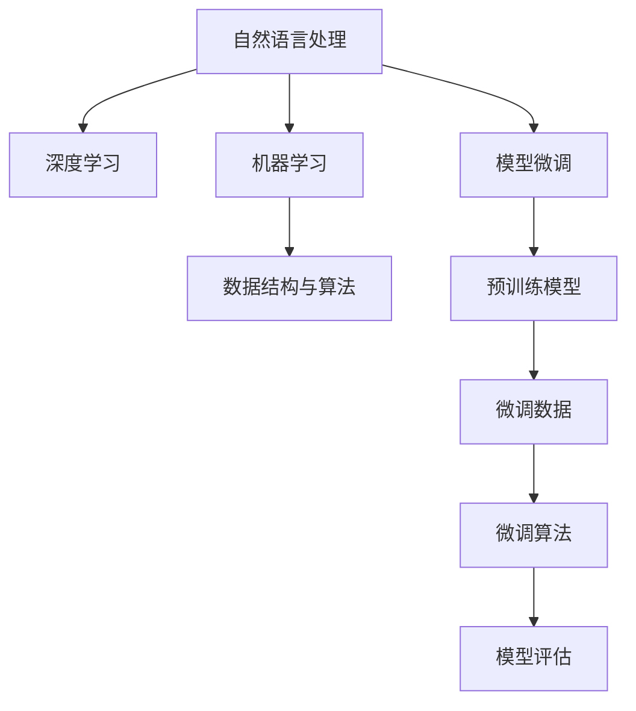

                 

# 自然语言处理原理与代码实战案例讲解

> 关键词：自然语言处理,代码实战,深度学习,机器学习,数据结构与算法,案例讲解

## 1. 背景介绍

### 1.1 问题由来
自然语言处理（Natural Language Processing, NLP）是人工智能（AI）领域的一个重要分支，旨在让计算机理解和处理人类语言。NLP技术不仅在学术界取得了显著进展，也广泛应用于工业界，如智能客服、语音识别、机器翻译、情感分析等场景。然而，尽管NLP技术已经取得了许多突破性成果，其在实际应用中的效果仍受限于数据量、模型复杂度和计算资源等因素。因此，如何在有限的资源条件下，提升NLP模型的性能，是一个亟需解决的问题。

### 1.2 问题核心关键点
NLP模型的性能提升主要依赖于两个关键因素：模型选择和数据处理。选择适合任务的模型结构，并对其进行微调以适应特定任务，是提升NLP模型性能的核心方法。此外，高质量的数据处理和预处理，也是模型性能提升的重要保障。

### 1.3 问题研究意义
研究NLP模型及其代码实战，对于推动AI技术的落地应用具有重要意义：

1. **降低开发成本**：利用已有的大模型进行微调，可以显著减少从头开发所需的时间和资源。
2. **提高模型效果**：微调能够使通用大模型更好地适应特定任务，提升模型的准确性和泛化能力。
3. **加速开发进度**：预训练模型提供了一个良好的起点，开发者可以更快地完成任务适配，缩短开发周期。
4. **带来技术创新**：微调技术促进了对预训练模型的深入研究，催生了诸如注意力机制、迁移学习等新的研究方向。
5. **赋能产业升级**：微调技术的应用，能够使NLP技术更容易被各行各业所采用，推动行业数字化转型。

## 2. 核心概念与联系

### 2.1 核心概念概述

在介绍NLP原理和代码实战之前，我们先概述一些核心概念：

- **自然语言处理**：使用计算机处理和理解人类语言的技术。
- **深度学习**：一种基于神经网络的机器学习技术，广泛应用于NLP模型中。
- **机器学习**：一种让计算机通过数据学习规律的技术，是NLP模型的基础。
- **数据结构与算法**：处理和分析数据的基础，NLP模型中常使用到的有词向量、Transformer模型等。
- **模型微调**：在预训练模型的基础上，针对特定任务进行优化，提升模型性能。

这些概念之间的逻辑关系可以通过以下Mermaid流程图来展示：



这个流程图展示了自然语言处理、深度学习、机器学习、数据结构和算法以及模型微调之间的关系：

1. **自然语言处理**是目标，其余技术手段都是为了实现这个目标。
2. **深度学习**和**机器学习**是技术手段，深度学习是机器学习的一个子集，使用神经网络来处理数据。
3. **数据结构与算法**是处理数据的基础，深度学习模型中常使用词向量、Transformer模型等数据结构。
4. **模型微调**是实现自然语言处理目标的一种手段，在预训练模型基础上进行调整以适应特定任务。

这些核心概念共同构成了自然语言处理的理论基础和实践框架，使得NLP模型能够处理和理解自然语言。

## 3. 核心算法原理 & 具体操作步骤

### 3.1 算法原理概述

NLP模型的核心算法原理包括词向量表示、Transformer模型、注意力机制和模型微调等。

#### 3.1.1 词向量表示
词向量表示是NLP中的基础技术，通过将单词映射到高维向量空间，使得计算机能够理解单词之间的关系和语义。常用的词向量表示方法包括Word2Vec、GloVe、FastText等。

#### 3.1.2 Transformer模型
Transformer模型是一种基于自注意力机制的深度学习模型，广泛应用于NLP任务中。其核心思想是通过注意力机制，让模型在处理序列数据时，能够动态地关注不同位置的信息。Transformer模型主要包括编码器和解码器两个部分，编码器用于将输入序列转换为表示向量，解码器用于生成输出序列。

#### 3.1.3 注意力机制
注意力机制是Transformer模型的核心部分，用于计算不同位置的信息对当前位置的影响。注意力机制通过计算注意力权重，决定哪些信息应该被更关注，从而提升模型的性能。

#### 3.1.4 模型微调
模型微调是指在预训练模型的基础上，针对特定任务进行优化，提升模型性能。常用的微调方法包括参数微调和非参数微调等。参数微调是指更新模型参数以适应特定任务，非参数微调是指在不更新模型参数的情况下，通过改变输入或输出结构，提升模型性能。

### 3.2 算法步骤详解

#### 3.2.1 数据准备
数据准备是NLP模型的第一步，包括数据清洗、分词、标注等。具体步骤如下：

1. **数据清洗**：去除无用信息、修复错误等，确保数据质量。
2. **分词**：将文本按照一定规则分割成单词或词组。
3. **标注**：根据任务需求，对数据进行标注，如命名实体识别、情感分析等。

#### 3.2.2 模型选择与预训练
选择合适的NLP模型，并在大规模语料上进行预训练。预训练的目的是让模型学习到语言的通用表示，为后续微调打下基础。

1. **模型选择**：根据任务需求选择适合的NLP模型，如BERT、GPT等。
2. **预训练**：使用大规模语料库进行预训练，以学习语言的通用表示。

#### 3.2.3 模型微调
在预训练模型的基础上，针对特定任务进行微调，以提升模型性能。

1. **任务适配**：设计适当的任务适配层，如分类器、解码器等，以适配特定任务。
2. **优化器选择**：选择合适的优化器，如Adam、SGD等，并设置合适的学习率、批大小等参数。
3. **训练过程**：在标注数据上训练模型，定期评估模型性能，并根据性能调整训练参数。
4. **模型评估**：在验证集和测试集上评估模型性能，确保模型能够泛化到新数据。

#### 3.2.4 代码实现
具体代码实现过程如下：

```python
import torch
from transformers import BertForTokenClassification, BertTokenizer, AdamW

# 准备数据
tokenizer = BertTokenizer.from_pretrained('bert-base-cased')
train_data = ...
train_labels = ...
val_data = ...
val_labels = ...
test_data = ...
test_labels = ...

# 模型选择与预训练
model = BertForTokenClassification.from_pretrained('bert-base-cased')
optimizer = AdamW(model.parameters(), lr=2e-5)

# 模型微调
for epoch in range(num_epochs):
    model.train()
    for input_ids, attention_mask, labels in train_data:
        optimizer.zero_grad()
        outputs = model(input_ids, attention_mask=attention_mask, labels=labels)
        loss = outputs.loss
        loss.backward()
        optimizer.step()

    # 评估模型
    model.eval()
    val_loss = evaluate(model, val_data, val_labels)
    test_loss = evaluate(model, test_data, test_labels)

# 输出结果
print(f'Val loss: {val_loss:.4f}, Test loss: {test_loss:.4f}')
```

### 3.3 算法优缺点

#### 3.3.1 优点
1. **高效性**：深度学习模型能够自动学习特征，减少了手动特征工程的复杂性。
2. **泛化能力**：深度学习模型具有较强的泛化能力，能够在未见过的数据上取得良好性能。
3. **可解释性**：深度学习模型的内部结构较简单，易于理解和解释。

#### 3.3.2 缺点
1. **数据依赖性**：深度学习模型依赖大量高质量的数据，数据收集和标注成本较高。
2. **计算资源需求高**：深度学习模型需要大量的计算资源，尤其是大规模预训练和微调过程。
3. **过拟合风险**：深度学习模型容易过拟合，特别是在数据量较小的情况下。

### 3.4 算法应用领域

NLP模型已经在多个领域得到应用，包括但不限于：

- **自然语言理解**：如命名实体识别、情感分析、文本分类等。
- **自然语言生成**：如机器翻译、文本摘要、对话系统等。
- **语音识别**：将语音信号转换为文本。
- **文本挖掘**：如主题建模、信息检索等。

## 4. 数学模型和公式 & 详细讲解

### 4.1 数学模型构建

NLP模型的数学模型包括词向量表示、Transformer模型、注意力机制和模型微调等。

#### 4.1.1 词向量表示
词向量表示的数学模型如下：

$$
\mathbf{w} = f(x)
$$

其中，$x$ 表示单词，$\mathbf{w}$ 表示其对应的词向量。常用的词向量表示方法有：

1. **Word2Vec**：基于神经网络的词向量表示方法，通过上下文信息学习单词的向量表示。
2. **GloVe**：基于全局词频统计的词向量表示方法，将单词表示为全局和局部共现关系的学习向量。
3. **FastText**：基于子词的词向量表示方法，将单词表示为其子词的组合。

#### 4.1.2 Transformer模型
Transformer模型的数学模型如下：

$$
\mathbf{H} = \mathbf{X}W_Q^T + \mathbf{b}_Q
$$

$$
\mathbf{A} = \mathbf{H}W_K^T + \mathbf{b}_K
$$

$$
\mathbf{E} = \mathbf{A}W_V^T + \mathbf{b}_V
$$

$$
\mathbf{E} = \mathbf{E}\alpha
$$

其中，$\mathbf{X}$ 表示输入序列，$W_Q^T$、$W_K^T$、$W_V^T$ 表示查询、键、值投影矩阵，$\mathbf{b}_Q$、$\mathbf{b}_K$、$\mathbf{b}_V$ 表示偏置向量，$\alpha$ 表示注意力权重。

#### 4.1.3 注意力机制
注意力机制的数学模型如下：

$$
\alpha = \frac{\exp(\mathbf{A}^T\mathbf{V})}{\sum_{i=1}^n\exp(\mathbf{A}_i^T\mathbf{V})}
$$

$$
\mathbf{E} = \mathbf{E}\alpha
$$

其中，$\alpha$ 表示注意力权重，$\mathbf{V}$ 表示注意力向量的投影矩阵。

#### 4.1.4 模型微调
模型微调的数学模型如下：

$$
\theta = \mathop{\arg\min}_{\theta} \mathcal{L}(\theta)
$$

其中，$\theta$ 表示模型参数，$\mathcal{L}$ 表示损失函数，用于衡量模型预测输出与真实标签之间的差异。

### 4.2 公式推导过程

以分类任务为例，推导损失函数的计算过程。

假设模型 $M_{\theta}$ 在输入 $x$ 上的输出为 $\hat{y}=M_{\theta}(x)$，表示样本属于正类的概率。真实标签 $y \in \{0,1\}$。则二分类交叉熵损失函数定义为：

$$
\ell(M_{\theta}(x),y) = -[y\log \hat{y} + (1-y)\log (1-\hat{y})]
$$

将其代入损失函数，得：

$$
\mathcal{L}(\theta) = -\frac{1}{N}\sum_{i=1}^N [y_i\log M_{\theta}(x_i)+(1-y_i)\log(1-M_{\theta}(x_i))]
$$

根据链式法则，损失函数对参数 $\theta_k$ 的梯度为：

$$
\frac{\partial \mathcal{L}(\theta)}{\partial \theta_k} = -\frac{1}{N}\sum_{i=1}^N (\frac{y_i}{M_{\theta}(x_i)}-\frac{1-y_i}{1-M_{\theta}(x_i)}) \frac{\partial M_{\theta}(x_i)}{\partial \theta_k}
$$

其中 $\frac{\partial M_{\theta}(x_i)}{\partial \theta_k}$ 可进一步递归展开，利用自动微分技术完成计算。

在得到损失函数的梯度后，即可带入参数更新公式，完成模型的迭代优化。重复上述过程直至收敛，最终得到适应下游任务的最优模型参数 $\theta^*$。

### 4.3 案例分析与讲解

以情感分析为例，分析NLP模型的实现过程。

情感分析的模型构建过程如下：

1. **数据准备**：收集电影评论数据，对每条评论进行情感标注。
2. **模型选择与预训练**：选择BERT模型进行预训练。
3. **任务适配**：在BERT模型的顶层添加一个线性分类器，用于情感分类。
4. **优化器选择**：选择AdamW优化器，设置合适的学习率。
5. **训练过程**：在标注数据上训练模型，定期评估模型性能。
6. **模型评估**：在验证集和测试集上评估模型性能。

代码实现如下：

```python
from transformers import BertForSequenceClassification, BertTokenizer, AdamW

# 准备数据
tokenizer = BertTokenizer.from_pretrained('bert-base-cased')
train_data = ...
train_labels = ...
val_data = ...
val_labels = ...
test_data = ...
test_labels = ...

# 模型选择与预训练
model = BertForSequenceClassification.from_pretrained('bert-base-cased', num_labels=2)
optimizer = AdamW(model.parameters(), lr=2e-5)

# 任务适配
train_dataset = ...
val_dataset = ...
test_dataset = ...

# 训练过程
for epoch in range(num_epochs):
    model.train()
    for input_ids, attention_mask, labels in train_dataset:
        optimizer.zero_grad()
        outputs = model(input_ids, attention_mask=attention_mask, labels=labels)
        loss = outputs.loss
        loss.backward()
        optimizer.step()

    # 评估模型
    model.eval()
    val_loss = evaluate(model, val_dataset, val_labels)
    test_loss = evaluate(model, test_dataset, test_labels)

# 输出结果
print(f'Val loss: {val_loss:.4f}, Test loss: {test_loss:.4f}')
```

## 5. 项目实践：代码实例和详细解释说明

### 5.1 开发环境搭建

在进行NLP模型开发前，我们需要准备好开发环境。以下是使用Python进行PyTorch开发的环境配置流程：

1. 安装Anaconda：从官网下载并安装Anaconda，用于创建独立的Python环境。

2. 创建并激活虚拟环境：
```bash
conda create -n pytorch-env python=3.8 
conda activate pytorch-env
```

3. 安装PyTorch：根据CUDA版本，从官网获取对应的安装命令。例如：
```bash
conda install pytorch torchvision torchaudio cudatoolkit=11.1 -c pytorch -c conda-forge
```

4. 安装Transformers库：
```bash
pip install transformers
```

5. 安装各类工具包：
```bash
pip install numpy pandas scikit-learn matplotlib tqdm jupyter notebook ipython
```

完成上述步骤后，即可在`pytorch-env`环境中开始NLP模型开发。

### 5.2 源代码详细实现

这里我们以情感分析为例，给出使用Transformers库对BERT模型进行情感分析的PyTorch代码实现。

首先，定义情感分析任务的数据处理函数：

```python
from transformers import BertTokenizer
from torch.utils.data import Dataset
import torch

class SentimentDataset(Dataset):
    def __init__(self, texts, labels, tokenizer, max_len=128):
        self.texts = texts
        self.labels = labels
        self.tokenizer = tokenizer
        self.max_len = max_len
        
    def __len__(self):
        return len(self.texts)
    
    def __getitem__(self, item):
        text = self.texts[item]
        label = self.labels[item]
        
        encoding = self.tokenizer(text, return_tensors='pt', max_length=self.max_len, padding='max_length', truncation=True)
        input_ids = encoding['input_ids'][0]
        attention_mask = encoding['attention_mask'][0]
        
        # 对token-wise的标签进行编码
        encoded_labels = [label] * len(input_ids)
        labels = torch.tensor(encoded_labels, dtype=torch.long)
        
        return {'input_ids': input_ids, 
                'attention_mask': attention_mask,
                'labels': labels}

# 标签与id的映射
label2id = {'negative': 0, 'positive': 1}
id2label = {v: k for k, v in label2id.items()}

# 创建dataset
tokenizer = BertTokenizer.from_pretrained('bert-base-cased')

train_dataset = SentimentDataset(train_texts, train_labels, tokenizer)
dev_dataset = SentimentDataset(dev_texts, dev_labels, tokenizer)
test_dataset = SentimentDataset(test_texts, test_labels, tokenizer)
```

然后，定义模型和优化器：

```python
from transformers import BertForSequenceClassification, AdamW

model = BertForSequenceClassification.from_pretrained('bert-base-cased', num_labels=len(label2id))

optimizer = AdamW(model.parameters(), lr=2e-5)
```

接着，定义训练和评估函数：

```python
from torch.utils.data import DataLoader
from tqdm import tqdm
from sklearn.metrics import accuracy_score, precision_score, recall_score, f1_score

device = torch.device('cuda') if torch.cuda.is_available() else torch.device('cpu')
model.to(device)

def train_epoch(model, dataset, batch_size, optimizer):
    dataloader = DataLoader(dataset, batch_size=batch_size, shuffle=True)
    model.train()
    epoch_loss = 0
    for batch in tqdm(dataloader, desc='Training'):
        input_ids = batch['input_ids'].to(device)
        attention_mask = batch['attention_mask'].to(device)
        labels = batch['labels'].to(device)
        model.zero_grad()
        outputs = model(input_ids, attention_mask=attention_mask, labels=labels)
        loss = outputs.loss
        epoch_loss += loss.item()
        loss.backward()
        optimizer.step()
    return epoch_loss / len(dataloader)

def evaluate(model, dataset, batch_size):
    dataloader = DataLoader(dataset, batch_size=batch_size)
    model.eval()
    preds, labels = [], []
    with torch.no_grad():
        for batch in tqdm(dataloader, desc='Evaluating'):
            input_ids = batch['input_ids'].to(device)
            attention_mask = batch['attention_mask'].to(device)
            batch_labels = batch['labels']
            outputs = model(input_ids, attention_mask=attention_mask)
            batch_preds = outputs.logits.argmax(dim=2).to('cpu').tolist()
            batch_labels = batch_labels.to('cpu').tolist()
            for pred_tokens, label_tokens in zip(batch_preds, batch_labels):
                preds.append(pred_tokens)
                labels.append(label_tokens)
                
    print(f'Accuracy: {accuracy_score(labels, preds):.4f}, '
          f'Precision: {precision_score(labels, preds):.4f}, '
          f'Recall: {recall_score(labels, preds):.4f}, '
          f'F1 score: {f1_score(labels, preds):.4f}')
```

最后，启动训练流程并在测试集上评估：

```python
epochs = 5
batch_size = 16

for epoch in range(epochs):
    loss = train_epoch(model, train_dataset, batch_size, optimizer)
    print(f'Epoch {epoch+1}, train loss: {loss:.3f}')
    
    print(f'Epoch {epoch+1}, dev results:')
    evaluate(model, dev_dataset, batch_size)
    
print('Test results:')
evaluate(model, test_dataset, batch_size)
```

以上就是使用PyTorch对BERT进行情感分析任务微调的完整代码实现。可以看到，得益于Transformers库的强大封装，我们可以用相对简洁的代码完成BERT模型的加载和微调。

### 5.3 代码解读与分析

让我们再详细解读一下关键代码的实现细节：

**SentimentDataset类**：
- `__init__`方法：初始化文本、标签、分词器等关键组件。
- `__len__`方法：返回数据集的样本数量。
- `__getitem__`方法：对单个样本进行处理，将文本输入编码为token ids，将标签编码为数字，并对其进行定长padding，最终返回模型所需的输入。

**label2id和id2label字典**：
- 定义了标签与数字id之间的映射关系，用于将预测结果解码回真实的标签。

**训练和评估函数**：
- 使用PyTorch的DataLoader对数据集进行批次化加载，供模型训练和推理使用。
- 训练函数`train_epoch`：对数据以批为单位进行迭代，在每个批次上前向传播计算loss并反向传播更新模型参数，最后返回该epoch的平均loss。
- 评估函数`evaluate`：与训练类似，不同点在于不更新模型参数，并在每个batch结束后将预测和标签结果存储下来，最后使用sklearn的评分指标对整个评估集的预测结果进行打印输出。

**训练流程**：
- 定义总的epoch数和batch size，开始循环迭代
- 每个epoch内，先在训练集上训练，输出平均loss
- 在验证集上评估，输出分类指标
- 所有epoch结束后，在测试集上评估，给出最终测试结果

可以看到，PyTorch配合Transformers库使得BERT微调的代码实现变得简洁高效。开发者可以将更多精力放在数据处理、模型改进等高层逻辑上，而不必过多关注底层的实现细节。

当然，工业级的系统实现还需考虑更多因素，如模型的保存和部署、超参数的自动搜索、更灵活的任务适配层等。但核心的微调范式基本与此类似。

## 6. 实际应用场景

### 6.1 智能客服系统

基于NLP模型的智能客服系统，可以广泛应用于客户服务领域。传统客服往往需要配备大量人力，高峰期响应缓慢，且一致性和专业性难以保证。而使用NLP模型构建的智能客服系统，可以7x24小时不间断服务，快速响应客户咨询，用自然流畅的语言解答各类常见问题。

在技术实现上，可以收集企业内部的历史客服对话记录，将问题和最佳答复构建成监督数据，在此基础上对预训练模型进行微调。微调后的模型能够自动理解用户意图，匹配最合适的答案模板进行回复。对于客户提出的新问题，还可以接入检索系统实时搜索相关内容，动态组织生成回答。如此构建的智能客服系统，能大幅提升客户咨询体验和问题解决效率。

### 6.2 金融舆情监测

金融机构需要实时监测市场舆论动向，以便及时应对负面信息传播，规避金融风险。传统的人工监测方式成本高、效率低，难以应对网络时代海量信息爆发的挑战。基于NLP模型的文本分类和情感分析技术，为金融舆情监测提供了新的解决方案。

具体而言，可以收集金融领域相关的新闻、报道、评论等文本数据，并对其进行主题标注和情感标注。在此基础上对预训练语言模型进行微调，使其能够自动判断文本属于何种主题，情感倾向是正面、中性还是负面。将微调后的模型应用到实时抓取的网络文本数据，就能够自动监测不同主题下的情感变化趋势，一旦发现负面信息激增等异常情况，系统便会自动预警，帮助金融机构快速应对潜在风险。

### 6.3 个性化推荐系统

当前的推荐系统往往只依赖用户的历史行为数据进行物品推荐，无法深入理解用户的真实兴趣偏好。基于NLP模型的个性化推荐系统可以更好地挖掘用户行为背后的语义信息，从而提供更精准、多样的推荐内容。

在实践中，可以收集用户浏览、点击、评论、分享等行为数据，提取和用户交互的物品标题、描述、标签等文本内容。将文本内容作为模型输入，用户的后续行为（如是否点击、购买等）作为监督信号，在此基础上微调预训练语言模型。微调后的模型能够从文本内容中准确把握用户的兴趣点。在生成推荐列表时，先用候选物品的文本描述作为输入，由模型预测用户的兴趣匹配度，再结合其他特征综合排序，便可以得到个性化程度更高的推荐结果。

### 6.4 未来应用展望

随着NLP模型的不断发展，其应用场景将更加广泛。未来，NLP技术将在更多领域得到应用，为传统行业带来变革性影响：

- **智慧医疗**：基于NLP模型的医疗问答、病历分析、药物研发等应用将提升医疗服务的智能化水平，辅助医生诊疗，加速新药开发进程。
- **智能教育**：基于NLP模型的作业批改、学情分析、知识推荐等应用，因材施教，促进教育公平，提高教学质量。
- **智慧城市治理**：基于NLP模型的城市事件监测、舆情分析、应急指挥等应用，提高城市管理的自动化和智能化水平，构建更安全、高效的未来城市。
- **企业生产**：基于NLP模型的订单处理、客服对话、市场分析等应用，提升企业的生产效率和市场反应速度。
- **社会治理**：基于NLP模型的舆情监测、公共安全、事件应急等应用，提升社会治理的智能化水平。

此外，在企业生产、社会治理、文娱传媒等众多领域，基于NLP技术的人工智能应用也将不断涌现，为经济社会发展注入新的动力。相信随着技术的日益成熟，NLP技术必将更加普及，为各行各业带来深远影响。

## 7. 工具和资源推荐

### 7.1 学习资源推荐

为了帮助开发者系统掌握NLP模型的原理和实践技巧，这里推荐一些优质的学习资源：

1. **《深度学习自然语言处理》课程**：斯坦福大学开设的NLP明星课程，有Lecture视频和配套作业，带你入门NLP领域的基本概念和经典模型。
2. **《自然语言处理与深度学习》书籍**：该书全面介绍了NLP技术的基本原理和深度学习模型，适合初学者和进阶者阅读。
3. **《Natural Language Processing with Python》书籍**：这本书介绍了Python中常用的NLP库，并结合实际案例，帮助读者快速上手实践。
4. **CS224N《深度学习自然语言处理》课程**：斯坦福大学开设的NLP明星课程，有Lecture视频和配套作业，适合学习NLP领域的基本概念和经典模型。
5. **《Python自然语言处理》书籍**：这本书介绍了NLP技术的基本原理和Python中常用的NLP库，适合初学者和进阶者阅读。

通过对这些资源的学习实践，相信你一定能够快速掌握NLP模型的精髓，并用于解决实际的NLP问题。

### 7.2 开发工具推荐

高效的开发离不开优秀的工具支持。以下是几款用于NLP模型开发的常用工具：

1. **PyTorch**：基于Python的开源深度学习框架，灵活动态的计算图，适合快速迭代研究。
2. **TensorFlow**：由Google主导开发的开源深度学习框架，生产部署方便，适合大规模工程应用。
3. **Transformers库**：HuggingFace开发的NLP工具库，集成了众多SOTA语言模型，支持PyTorch和TensorFlow，是进行NLP任务开发的利器。
4. **Weights & Biases**：模型训练的实验跟踪工具，可以记录和可视化模型训练过程中的各项指标，方便对比和调优。
5. **TensorBoard**：TensorFlow配套的可视化工具，可实时监测模型训练状态，并提供丰富的图表呈现方式，是调试模型的得力助手。

合理利用这些工具，可以显著提升NLP模型开发的效率，加快创新迭代的步伐。

### 7.3 相关论文推荐

NLP模型的不断发展离不开学界的持续研究。以下是几篇奠基性的相关论文，推荐阅读：

1. **Attention is All You Need**：提出了Transformer结构，开启了NLP领域的预训练大模型时代。
2. **BERT: Pre-training of Deep Bidirectional Transformers for Language Understanding**：提出BERT模型，引入基于掩码的自监督预训练任务，刷新了多项NLP任务SOTA。
3. **Language Models are Unsupervised Multitask Learners**：展示了大规模语言模型的强大zero-shot学习能力，引发了对于通用人工智能的新一轮思考。
4. **Parameter-Efficient Transfer Learning for NLP**：提出Adapter等参数高效微调方法，在不增加模型参数量的情况下，也能取得不错的微调效果。
5. **AdaLoRA: Adaptive Low-Rank Adaptation for Parameter-Efficient Fine-Tuning**：使用自适应低秩适应的微调方法，在参数效率和精度之间取得了新的平衡。

这些论文代表了大NLP模型微调技术的发展脉络。通过学习这些前沿成果，可以帮助研究者把握学科前进方向，激发更多的创新灵感。

## 8. 总结：未来发展趋势与挑战

### 8.1 总结

本文对NLP模型的原理和代码实战进行了全面系统的介绍。首先阐述了NLP模型的背景和重要性，明确了微调在提升模型性能中的核心作用。其次，从原理到实践，详细讲解了NLP模型的数学模型和关键步骤，给出了NLP模型微调的完整代码实例。同时，本文还广泛探讨了NLP模型在多个领域的应用前景，展示了NLP模型强大的应用能力。

通过本文的系统梳理，可以看到，基于NLP模型的微调技术正在成为NLP应用的重要范式，极大地拓展了模型的应用边界，催生了更多的落地场景。得益于大规模语料的预训练和微调技术的不断发展，NLP模型在实际应用中的效果得到了显著提升，为各行各业带来了深远的影响。未来，伴随NLP技术的不断进步，相信NLP模型将在更多领域大放异彩，深刻影响人类的生产生活方式。

### 8.2 未来发展趋势

展望未来，NLP模型的发展趋势将呈现以下几个方面：

1. **模型规模持续增大**：随着算力成本的下降和数据规模的扩张，预训练语言模型的参数量还将持续增长。超大规模语言模型蕴含的丰富语言知识，有望支撑更加复杂多变的下游任务微调。
2. **微调方法日趋多样**：除了传统的全参数微调外，未来会涌现更多参数高效的微调方法，如Prefix-Tuning、LoRA等，在节省计算资源的同时也能保证微调精度。
3. **持续学习成为常态**：随着数据分布的不断变化，微调模型也需要持续学习新知识以保持性能。如何在不遗忘原有知识的同时，高效吸收新样本信息，将成为重要的研究课题。
4. **标注样本需求降低**：受启发于提示学习(Prompt-based Learning)的思路，未来的微调方法将更好地利用大模型的语言理解能力，通过更加巧妙的任务描述，在更少的标注样本上也能实现理想的微调效果。
5. **多模态微调崛起**：当前的微调主要聚焦于纯文本数据，未来会进一步拓展到图像、视频、语音等多模态数据微调。多模态信息的融合，将显著提升语言模型对现实世界的理解和建模能力。
6. **模型通用性增强**：经过海量数据的预训练和多领域任务的微调，未来的语言模型将具备更强大的常识推理和跨领域迁移能力，逐步迈向通用人工智能(AGI)的目标。

以上趋势凸显了NLP模型的广阔前景。这些方向的探索发展，必将进一步提升NLP系统的性能和应用范围，为人类认知智能的进化带来深远影响。

### 8.3 面临的挑战

尽管NLP模型已经取得了显著进展，但在迈向更加智能化、普适化应用的过程中，仍面临诸多挑战：

1. **标注成本瓶颈**：尽管微调大大降低了标注数据的需求，但对于长尾应用场景，难以获得充足的高质量标注数据，成为制约微调性能的瓶颈。如何进一步降低微调对标注样本的依赖，将是一大难题。
2. **模型鲁棒性不足**：当前微调模型面对域外数据时，泛化性能往往大打折扣。对于测试样本的微小扰动，微调模型的预测也容易发生波动。如何提高微调模型的鲁棒性，避免灾难性遗忘，还需要更多理论和实践的积累。
3. **推理效率有待提高**：大规模语言模型虽然精度高，但在实际部署时往往面临推理速度慢、内存占用大等效率问题。如何在保证性能的同时，简化模型结构，提升推理速度，优化资源占用，将是重要的优化方向。
4. **可解释性亟需加强**：当前微调模型更像是"黑盒"系统，难以解释其内部工作机制和决策逻辑。对于医疗、金融等高风险应用，算法的可解释性和可审计性尤为重要。如何赋予微调模型更强的可解释性，将是亟待攻克的难题。
5. **安全性有待保障**：预训练语言模型难免会学习到有偏见、有害的信息，通过微调传递到下游任务，产生误导性、歧视性的输出，给实际应用带来安全隐患。如何从数据和算法层面消除模型偏见，避免恶意用途，确保输出的安全性，也将是重要的研究课题。

6. **知识整合能力不足**：现有的微调模型往往局限于任务内数据，难以灵活吸收和运用更广泛的先验知识。如何让微调过程更好地与外部知识库、规则库等专家知识结合，形成更加全面、准确的信息整合能力，还有很大的想象空间。

正视NLP模型面临的这些挑战，积极应对并寻求突破，将使NLP模型走向成熟的必由之路。相信随着学界和产业界的共同努力，这些挑战终将一一被克服，NLP模型必将在构建安全、可靠、可解释、可控的智能系统铺平道路。

### 8.4 研究展望

面对NLP模型所面临的挑战，未来的研究需要在以下几个方面寻求新的突破：

1. **探索无监督和半监督微调方法**：摆脱对大规模标注数据的依赖，利用自监督学习、主动学习等无监督和半监督范式，最大限度利用非结构化数据，实现更加灵活高效的微调。
2. **研究参数高效和计算高效的微调范式**：开发更加参数高效的微调方法，在固定大部分预训练参数的同时，只更新极少量的任务相关参数。同时优化微调模型的计算图，减少前向传播和反向传播的资源消耗，实现更加轻量级、实时性的部署。
3. **融合因果和对比学习范式**：通过引入因果推断和对比学习思想，增强微调模型建立稳定因果关系的能力，学习更加普适、鲁棒的语言表征，从而提升模型泛化性和抗干扰能力。
4. **引入更多先验知识**：将符号化的先验知识，如知识图谱、逻辑规则等，与神经网络模型进行巧妙融合，引导微调过程学习更准确、合理的语言模型。同时加强不同模态数据的整合，实现视觉、语音等多模态信息与文本信息的协同建模。
5. **结合因果分析和博弈论工具**：将因果分析方法引入微调模型，识别出模型决策的关键特征，增强输出解释的因果性和逻辑性。借助博弈论工具刻画人机交互过程，主动探索并规避模型的脆弱点，提高系统稳定性。
6. **纳入伦理道德约束**：在模型训练目标中引入伦理导向的评估指标，过滤和惩罚有偏见、有害的输出倾向。同时加强人工干预和审核，建立模型行为的监管机制，确保输出符合人类价值观和伦理道德。

这些研究方向的探索，必将引领NLP模型的微调技术迈向更高的台阶，为构建安全、可靠、可解释、可控的智能系统铺平道路。面向未来，NLP模型还需要与其他人工智能技术进行更深入的融合，如知识表示、因果推理、强化学习等，多路径协同发力，共同推动自然语言理解和智能交互系统的进步。只有勇于创新、敢于突破，才能不断拓展语言模型的边界，让智能技术更好地造福人类社会。

## 9. 附录：常见问题与解答

**Q1：NLP模型是否适用于所有NLP任务？**

A: NLP模型在大多数NLP任务上都能取得不错的效果，特别是对于数据量较小的任务。但对于一些特定领域的任务，如医学、法律等，仅仅依靠通用语料预训练的模型可能难以很好地适应。此时需要在特定领域语料上进一步预训练，再进行微调，才能获得理想效果。此外，对于一些需要时效性、个性化很强的任务，如对话、推荐等，微调方法也需要针对性的改进优化。

**Q2：微调过程中如何选择合适的学习率？**

A: 微调的学习率一般要比预训练时小1-2个数量级，如果使用过大的学习率，容易破坏预训练权重，导致过拟合。一般建议从1e-5开始调参，逐步减小学习率，直至收敛。也可以使用warmup策略，在开始阶段使用较小的学习率，再逐渐过渡到预设值。需要注意的是，不同的优化器(如AdamW、Adafactor等)以及不同的学习率调度策略，可能需要设置不同的学习率阈值。

**Q3：采用NLP模型时会面临哪些资源瓶颈？**

A: 当前主流的预训练NLP模型动辄以亿计的参数规模，对算力、内存、存储都提出了很高的要求。GPU/TPU等高性能设备是必不可少的，但即便如此，超大批次的训练和推理也可能遇到显存不足的问题。因此需要采用一些资源优化技术，如梯度积累、混合精度训练、模型并行等，来突破硬件瓶颈。同时，模型的存储和读取也可能占用大量时间和空间，需要采用模型压缩、稀疏化存储等方法进行优化。

**Q4：如何缓解微调过程中的过拟合问题？**

A: 过拟合是微调面临的主要挑战，尤其是在标注数据不足的情况下。常见的缓解策略包括：
1. 数据增强：通过回译、近义替换等方式扩充训练集
2. 正则化：使用L2正则、Dropout、Early Stopping等避免过拟合
3. 对抗训练：引入对抗样本，提高模型鲁棒性
4. 参数高效微调：只调整少量参数(如Adapter、Prefix等)，减小过拟合风险
5. 多模型集成：训练多个微调模型，取平均输出，抑制过拟合

这些策略往往需要根据具体任务和数据特点进行灵活组合。只有在数据、模型、训练、推理等各环节进行全面优化，才能最大限度地发挥NLP模型的威力。

**Q5：NLP模型在落地部署时需要注意哪些问题？**

A: 将NLP模型转化为实际应用，还需要考虑以下因素：
1. 模型裁剪：去除不必要的层和参数，减小模型尺寸，加快推理速度
2. 量化加速：将浮点模型转为定点模型，压缩存储空间，提高计算效率
3. 服务化封装：将模型封装为标准化服务接口，便于集成调用
4. 弹性伸缩：根据请求流量动态调整资源配置，平衡服务质量和成本
5. 监控告警：实时采集系统指标，设置异常告警阈值，确保服务稳定性
6. 安全防护：采用访问鉴权、数据脱敏等措施，保障数据和模型安全

NLP模型微调为NLP应用开启了广阔的想象空间，但如何将强大的性能转化为稳定、高效、安全的业务价值，还需要工程实践的不断打磨。唯有从数据、算法、工程、业务等多个维度协同发力，才能真正实现NLP技术在垂直行业的规模化落地。总之，微调需要开发者根据具体任务，不断迭代和优化模型、数据和算法，方能得到理想的效果。

---

作者：禅与计算机程序设计艺术 / Zen and the Art of Computer Programming

