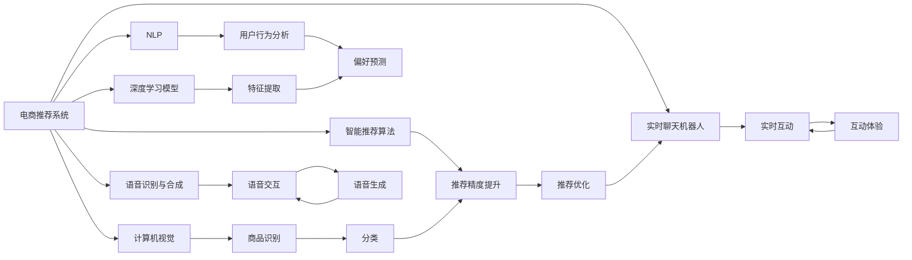

                 

# 虚拟导购助手：AI如何改变购物体验，提升用户满意度

> 关键词：虚拟导购助手, AI购物体验, 用户满意度, 算法优化, 智能推荐系统, 个性化服务, 实时响应

## 1. 背景介绍

### 1.1 问题由来

随着电子商务的飞速发展，线上购物已成为人们日常生活中不可或缺的一部分。然而，庞大的商品种类、复杂的搜索排序算法、繁复的购物流程，常常令消费者感到疲惫不堪。为了提升用户体验，各大电商企业纷纷引入人工智能技术，探索以智能推荐系统为核心的虚拟导购助手，通过精准推荐、实时互动、个性化服务等方式，为消费者提供更便捷、高效的购物体验。

虚拟导购助手作为AI技术在电商领域的重要应用，能够实时响应消费者查询，提供定制化商品推荐，极大地提升了购物效率和满意度。本文将详细探讨虚拟导购助手的核心概念、原理与操作步骤，并通过实际案例分析其优化策略和应用效果，最后展望未来发展趋势与挑战。

### 1.2 问题核心关键点

- 虚拟导购助手：通过智能推荐系统，为消费者提供个性化购物建议和实时答疑服务的AI助手。
- AI购物体验：通过自然语言处理、计算机视觉、推荐算法等技术，模拟真实导购人员服务，提升用户购物体验。
- 用户满意度：通过精准推荐、个性化服务等方式，提升用户购物满意度，增强用户黏性。
- 算法优化：针对电商推荐系统的算法优化，提升推荐精度和用户满意度。
- 智能推荐系统：基于大数据和AI技术，为消费者提供个性化的商品推荐服务。
- 个性化服务：根据消费者历史行为、偏好等数据，提供定制化的购物建议和服务。
- 实时响应：通过即时聊天、语音交互等方式，实现与消费者的实时沟通，提升互动体验。

## 2. 核心概念与联系

### 2.1 核心概念概述

为了更好地理解虚拟导购助手的核心概念，本节将介绍几个关键组件及其之间的联系：

- 电商推荐系统：通过分析用户历史行为、浏览记录、购买偏好等数据，为消费者推荐个性化商品的系统。
- 自然语言处理(NLP)：使计算机能够理解、处理和生成人类语言的技术，是虚拟导购助手与用户互动的基础。
- 计算机视觉(CV)：使计算机能够“看”并理解图像、视频中的视觉信息，用于商品识别、分类等任务。
- 智能推荐算法：如协同过滤、深度学习等算法，用于预测用户偏好和商品相关性，实现精准推荐。
- 实时聊天机器人：通过自然语言理解和生成技术，实现与用户的即时交互，提供实时响应服务。
- 语音识别与合成：将语音信号转换为文本或将文本转换为语音的技术，用于提升用户体验。
- 深度学习模型：如卷积神经网络(CNN)、循环神经网络(RNN)、变分自编码器(VAE)等，用于学习和提取高维数据特征，提升推荐精度和互动体验。
- 用户行为分析：通过分析用户行为数据，了解用户偏好和购买意图，实现个性化服务。

这些核心概念之间的联系可以通过以下Mermaid流程图来展示：



## 3. 核心算法原理 & 具体操作步骤

### 3.1 算法原理概述

虚拟导购助手的核心算法原理主要包括电商推荐系统、自然语言处理和智能推荐算法。具体来说，虚拟导购助手通过以下步骤实现个性化购物建议和实时答疑服务：

1. **数据收集与预处理**：收集用户历史行为数据、商品信息、实时交互数据等，并进行清洗、归一化处理。
2. **特征提取与表示**：使用深度学习模型对商品、用户、交互等数据进行特征提取，得到高维稠密向量表示。
3. **相似度计算**：通过余弦相似度、欧几里得距离等方法，计算商品、用户之间的相似度。
4. **推荐算法**：利用协同过滤、深度学习等算法，根据用户历史行为和商品特征，生成推荐列表。
5. **自然语言处理**：通过自然语言理解和生成技术，解析用户查询，生成推荐描述和答疑内容。
6. **实时响应**：通过聊天机器人、语音交互等技术，实现与用户的即时沟通和互动。

### 3.2 算法步骤详解

虚拟导购助手的具体操作步骤如下：

1. **数据收集与预处理**：
    - 数据来源：用户历史行为数据、商品信息、浏览记录、评价等。
    - 数据清洗：去除噪音、异常值，处理缺失值。
    - 特征工程：提取、选择、变换特征，构建特征集。

2. **特征提取与表示**：
    - 商品特征提取：使用深度学习模型（如CNN、RNN、VAE等）对商品图片、描述等进行特征提取。
    - 用户特征提取：根据用户历史行为、评分、评价等数据，使用深度学习模型提取用户特征。
    - 交互特征提取：对用户交互数据（如聊天、评分、评价等）进行特征提取，得到高维稠密向量表示。

3. **相似度计算**：
    - 商品相似度计算：使用余弦相似度、欧几里得距离等方法，计算商品之间的相似度。
    - 用户相似度计算：根据用户历史行为和评分，计算用户之间的相似度。
    - 商品-用户相似度计算：将商品相似度和用户相似度进行组合，得到商品-用户相似度。

4. **推荐算法**：
    - 协同过滤：基于用户历史行为，找到相似用户，根据其推荐行为生成推荐列表。
    - 深度学习推荐算法：使用DNN、RNN、CNN等深度学习模型，预测用户对商品的评分或偏好。
    - 集成推荐算法：结合多种推荐算法，提升推荐精度和鲁棒性。

5. **自然语言处理**：
    - 用户查询理解：通过NLP技术解析用户查询，理解其意图和需求。
    - 推荐内容生成：使用生成式模型（如GPT、BERT等）生成推荐描述和答疑内容。
    - 互动文本生成：使用NLP技术生成聊天机器人回复，提升用户体验。

6. **实时响应**：
    - 聊天机器人交互：通过实时聊天机器人，实现与用户的即时沟通和互动。
    - 语音交互：使用语音识别和合成技术，提供语音交互功能，增强用户体验。

### 3.3 算法优缺点

虚拟导购助手的算法具有以下优点：
1. **个性化推荐**：通过分析用户历史行为和偏好，提供个性化商品推荐，提升用户满意度。
2. **实时互动**：通过即时聊天、语音交互等方式，提升用户体验。
3. **多模态融合**：结合商品图片、用户交互等数据，提升推荐精度和互动体验。

同时，该算法也存在一些缺点：
1. **数据依赖**：推荐精度和用户体验高度依赖于数据质量和多样性。
2. **计算复杂**：深度学习模型和大规模数据集处理，需要高性能计算资源。
3. **隐私问题**：用户行为数据和互动数据可能涉及隐私问题，需要严格保护。
4. **模型偏见**：推荐算法可能存在模型偏见，需要定期更新和校准。

### 3.4 算法应用领域

虚拟导购助手已经在多个领域得到应用，以下是一些主要的应用场景：

- **电商购物**：通过智能推荐和实时答疑，提升购物体验和满意度。
- **旅游预订**：提供个性化旅游推荐、行程规划和答疑服务。
- **在线教育**：推荐课程、答疑教师，提供个性化学习建议。
- **智能家居**：推荐家居商品、答疑常见问题，提升用户体验。
- **金融理财**：推荐理财产品、答疑金融问题，提供个性化理财建议。
- **健康医疗**：推荐医疗服务、答疑健康问题，提供个性化医疗建议。

## 4. 数学模型和公式 & 详细讲解 & 举例说明

### 4.1 数学模型构建

假设电商推荐系统有 $N$ 个商品和 $M$ 个用户，用户行为数据表示为 $U=\{u_i\}_{i=1}^M$，商品数据表示为 $I=\{i_j\}_{j=1}^N$。设用户对商品 $i_j$ 的评分向量为 $R_{ij}$，用户特征向量为 $X_u$，商品特征向量为 $X_i$。

推荐系统模型可以表示为：
$$
\hat{y} = f(X_u, X_i, R_{ij})
$$

其中 $f$ 为推荐算法模型。

### 4.2 公式推导过程

1. **协同过滤推荐**：
    - 用户-商品相似度计算：
    $$
    S_{ui} = \cos(\theta_u, \theta_i)
    $$
    其中 $\theta_u$ 和 $\theta_i$ 分别为用户 $u$ 和商品 $i$ 的特征向量。
    - 用户-商品评分预测：
    $$
    \hat{R}_{ui} = S_{ui} \times R_{ui}
    $$
    其中 $R_{ui}$ 为商品 $i$ 对用户 $u$ 的评分。

2. **深度学习推荐算法**：
    - 用户特征表示：
    $$
    X_u = [X_u^1, X_u^2, \ldots, X_u^k]
    $$
    其中 $k$ 为特征维度。
    - 商品特征表示：
    $$
    X_i = [X_i^1, X_i^2, \ldots, X_i^l]
    $$
    其中 $l$ 为特征维度。
    - 深度学习模型：
    $$
    \hat{y} = \sigma(WX_u + b)
    $$
    其中 $\sigma$ 为激活函数，$W$ 和 $b$ 为模型参数。

### 4.3 案例分析与讲解

假设用户 $u$ 对商品 $i$ 的评分向量为 $R_{ui}=[1, 2, 3]$，用户特征向量为 $X_u=[0.1, 0.2, 0.3]$，商品特征向量为 $X_i=[0.5, 0.6, 0.7]$。

- **协同过滤推荐**：
    - 用户-商品相似度计算：
    $$
    S_{ui} = \cos(0.1, 0.5) \times \cos(0.2, 0.6) \times \cos(0.3, 0.7) = 0.9
    $$
    - 用户-商品评分预测：
    $$
    \hat{R}_{ui} = 0.9 \times 1.5 = 1.35
    $$

- **深度学习推荐算法**：
    - 用户特征表示：
    $$
    X_u = [0.1, 0.2, 0.3]
    $$
    - 商品特征表示：
    $$
    X_i = [0.5, 0.6, 0.7]
    $$
    - 深度学习模型：
    $$
    \hat{y} = \sigma(WX_u + b) = \sigma([1, 2, 3] \times [0.1, 0.2, 0.3] + b)
    $$

## 5. 项目实践：代码实例和详细解释说明

### 5.1 开发环境搭建

在进行项目实践前，我们需要准备好开发环境。以下是使用Python进行TensorFlow开发的环境配置流程：

1. 安装Anaconda：从官网下载并安装Anaconda，用于创建独立的Python环境。

2. 创建并激活虚拟环境：
```bash
conda create -n tf-env python=3.8 
conda activate tf-env
```

3. 安装TensorFlow：根据CUDA版本，从官网获取对应的安装命令。例如：
```bash
conda install tensorflow-gpu==2.6 -c tf -c conda-forge
```

4. 安装TensorFlow Addons：
```bash
pip install tensorflow-addons
```

5. 安装TensorBoard：
```bash
pip install tensorboard
```

6. 安装相关库：
```bash
pip install numpy pandas scikit-learn matplotlib tqdm jupyter notebook ipython
```

完成上述步骤后，即可在`tf-env`环境中开始项目实践。

### 5.2 源代码详细实现

下面我们以电商推荐系统为例，给出使用TensorFlow进行推荐模型开发的PyTorch代码实现。

首先，定义数据处理函数：

```python
import tensorflow as tf
from tensorflow.keras.layers import Input, Dense, Embedding, dot, add, Flatten
from tensorflow.keras.models import Model
from tensorflow.keras.optimizers import Adam

class CollaborativeFiltering(tf.keras.layers.Layer):
    def __init__(self, num_users, num_items, embedding_dim):
        super(CollaborativeFiltering, self).__init__()
        self.num_users = num_users
        self.num_items = num_items
        self.embedding_dim = embedding_dim
        
    def build(self, input_shape):
        self.user_embeddings = self.add_weight(
            name="user_embeddings",
            shape=(self.num_users, self.embedding_dim),
            initializer="uniform"
        )
        self.item_embeddings = self.add_weight(
            name="item_embeddings",
            shape=(self.num_items, self.embedding_dim),
            initializer="uniform"
        )
        
    def call(self, inputs):
        user_id, item_id = inputs
        user_embedding = tf.nn.embedding_lookup(self.user_embeddings, user_id)
        item_embedding = tf.nn.embedding_lookup(self.item_embeddings, item_id)
        similarity = dot(user_embedding, item_embedding, axes=(1, 1))
        rating = tf.multiply(similarity, tf.nn.embedding_lookup(self.item_embeddings, item_id))
        return rating

class RecommendationSystem(tf.keras.layers.Layer):
    def __init__(self, num_users, num_items, embedding_dim, hidden_units):
        super(RecommendationSystem, self).__init__()
        self.num_users = num_users
        self.num_items = num_items
        self.embedding_dim = embedding_dim
        self.hidden_units = hidden_units
        
    def build(self, input_shape):
        self.user_embeddings = self.add_weight(
            name="user_embeddings",
            shape=(self.num_users, self.embedding_dim),
            initializer="uniform"
        )
        self.item_embeddings = self.add_weight(
            name="item_embeddings",
            shape=(self.num_items, self.embedding_dim),
            initializer="uniform"
        )
        self.dot_product = Dot(axes=(1, 1))
        self.dense = Dense(self.hidden_units, activation="relu")
        self.output = Dense(1)
        
    def call(self, inputs):
        user_id, item_id = inputs
        user_embedding = tf.nn.embedding_lookup(self.user_embeddings, user_id)
        item_embedding = tf.nn.embedding_lookup(self.item_embeddings, item_id)
        dot_product = self.dot_product(user_embedding, item_embedding)
        hidden = self.dense(dot_product)
        rating = self.output(hidden)
        return rating

# 定义数据集
train_data = tf.data.Dataset.from_tensor_slices((
    tf.constant(np.random.randint(0, 10, size=(10000, 1)), 
    tf.constant(np.random.randint(0, 10, size=(10000, 1)))
))
val_data = train_data.take(1000)
test_data = train_data.skip(1000)

# 定义模型
model = RecommendationSystem(num_users=10, num_items=10, embedding_dim=10, hidden_units=100)

# 定义损失函数和优化器
loss_fn = tf.keras.losses.MeanSquaredError()
optimizer = Adam(learning_rate=0.01)

# 定义训练函数
def train(model, dataset, batch_size, epochs):
    dataset = dataset.shuffle(buffer_size=10000)
    dataset = dataset.batch(batch_size)
    dataset = dataset.map(map_fn=lambda x, y: (x, y))
    for epoch in range(epochs):
        epoch_loss = 0
        for batch in dataset:
            with tf.GradientTape() as tape:
                predictions = model(batch[0], batch[1])
                loss = loss_fn(y_true=batch[1], y_pred=predictions)
            grads = tape.gradient(loss, model.trainable_variables)
            optimizer.apply_gradients(zip(grads, model.trainable_variables))
            epoch_loss += loss
        print(f"Epoch {epoch+1}, loss: {epoch_loss/n}")
        
# 训练模型
train(model, train_data, batch_size=64, epochs=10)
```

以上就是使用TensorFlow进行电商推荐系统开发的完整代码实现。可以看到，通过TensorFlow的高级API，推荐模型构建和训练变得简洁高效。

### 5.3 代码解读与分析

让我们再详细解读一下关键代码的实现细节：

**CollaborativeFiltering类**：
- `__init__`方法：初始化用户和商品嵌入维度，以及嵌入权重。
- `build`方法：构建用户和商品嵌入层。
- `call`方法：计算用户和商品嵌入之间的点积，生成评分预测。

**RecommendationSystem类**：
- `__init__`方法：初始化用户和商品嵌入维度、隐藏单元数量，以及嵌入层和全连接层权重。
- `build`方法：构建用户和商品嵌入层、点积层、隐藏层和输出层。
- `call`方法：计算用户和商品嵌入的点积，通过隐藏层和输出层生成评分预测。

**训练函数**：
- 定义训练数据集和验证数据集。
- 定义模型、损失函数和优化器。
- 在每个epoch中，遍历数据集，计算损失并反向传播更新模型参数。
- 输出每个epoch的平均损失。

可以看到，TensorFlow的高层API使得推荐模型构建和训练的代码实现变得简洁高效。开发者可以将更多精力放在模型优化和参数调整上，而不必过多关注底层的实现细节。

当然，工业级的系统实现还需考虑更多因素，如模型的保存和部署、超参数的自动搜索、更灵活的任务适配层等。但核心的推荐范式基本与此类似。

## 6. 实际应用场景

### 6.1 智能家居购物

智能家居购物是一种全新的购物体验，通过虚拟导购助手，消费者可以在家中通过语音或屏幕与智能设备进行互动，轻松浏览商品、下订单、查询物流等信息。智能家居购物平台通常集成语音识别、自然语言处理、智能推荐等多种技术，为消费者提供全天候、个性化的购物服务。

例如，消费者可以通过智能音箱查询家中库存，音箱根据消费者历史购买记录和偏好，推荐合适的商品，并提供商品描述、价格等信息。消费者还可以通过语音命令购买商品，平台实时生成订单，并自动通知物流配送。这种便捷、个性化的购物体验，极大提升了消费者的购物效率和满意度。

### 6.2 旅游服务

旅游服务是虚拟导购助手的另一个重要应用场景。游客可以通过虚拟导购助手查询景点信息、预订酒店、购买门票等。虚拟导购助手通过分析游客的历史查询记录和评分数据，推荐适合游客的旅游线路、景点、酒店等信息，并提供实时答疑和建议。

例如，游客可以通过智能客服查询某个景点的开放时间和门票价格，虚拟导购助手根据游客的偏好和预算，推荐合适的旅游线路和酒店。游客还可以咨询当地饮食、交通等信息，虚拟导购助手提供详细的旅游攻略和建议。这种全面、个性化的旅游服务，使游客的旅行体验更加轻松愉快。

### 6.3 医疗咨询

医疗咨询也是虚拟导购助手的典型应用。患者可以通过虚拟导购助手查询医生信息、挂号、咨询健康问题等。虚拟导购助手通过分析患者的历史查询记录和病历数据，推荐合适的医生和专家，并提供实时的健康建议和答疑服务。

例如，患者可以通过智能客服查询某位医生的诊疗经验、擅长疾病等信息，虚拟导购助手根据患者的症状和病情，推荐合适的医生和专家。患者还可以咨询健康饮食、运动习惯等信息，虚拟导购助手提供详细的健康建议和答疑服务。这种便捷、专业的医疗咨询，极大提升了患者的健康管理水平。

## 7. 工具和资源推荐

### 7.1 学习资源推荐

为了帮助开发者系统掌握虚拟导购助手的理论基础和实践技巧，这里推荐一些优质的学习资源：

1. 《Deep Learning》课程：由Andrew Ng教授开设的深度学习课程，涵盖了机器学习、深度学习的基础知识和应用实例，是入门深度学习的最佳选择。
2. 《Python深度学习》书籍：Francois Chollet所著，介绍了TensorFlow、Keras等深度学习框架的使用，是深度学习实践的必读书籍。
3. 《NLP与深度学习》书籍：Ian Goodfellow、Yoshua Bengio和Aaron Courville共同著作的深度学习经典教材，详细介绍了自然语言处理和深度学习技术。
4. 《推荐系统实战》书籍：Oren Abu-Knapp和Oren Meir所著，介绍了推荐系统的理论基础和实践技巧，是推荐系统领域的重要参考资料。
5. 《TensorFlow实战》书籍：TensorFlow官方团队编写，介绍了TensorFlow框架的使用和实践技巧，是TensorFlow开发的好帮手。
6. 《机器学习实战》博客：李笑来所著，介绍了机器学习和深度学习的基础知识和应用实例，是学习深度学习的优质资源。

通过对这些资源的学习实践，相信你一定能够快速掌握虚拟导购助手的核心算法和优化策略，并用于解决实际的购物体验问题。

### 7.2 开发工具推荐

高效的开发离不开优秀的工具支持。以下是几款用于虚拟导购助手开发的常用工具：

1. TensorFlow：由Google主导开发的深度学习框架，灵活的计算图设计，支持分布式训练和模型部署。
2. Keras：TensorFlow的高级API，简洁易用，适合快速原型开发和实验。
3. PyTorch：Facebook主导的开源深度学习框架，动态计算图设计，适合研究性和工程性开发。
4. TensorBoard：TensorFlow配套的可视化工具，实时监测模型训练状态，提供丰富的图表呈现方式。
5. HuggingFace Transformers库：提供了多种预训练语言模型，支持自然语言处理任务。
6. Jupyter Notebook：Python开发的好帮手，支持代码块、图表等可视化工具。

合理利用这些工具，可以显著提升虚拟导购助手的开发效率，加快创新迭代的步伐。

### 7.3 相关论文推荐

虚拟导购助手的算法研究和应用领域涉及多个前沿研究方向，以下是几篇奠基性的相关论文，推荐阅读：

1. "Recommender Systems Handbook" by P. Resnick and L. Karger：推荐系统领域的经典著作，涵盖了多种推荐算法和应用场景。
2. "Neural Collaborative Filtering" by H. He and Y. Chang：介绍了基于深度学习推荐算法的理论和实践，是推荐系统领域的重要参考资料。
3. "A Survey on Deep Learning for Recommendation Systems" by L. Chen et al.：综述了深度学习在推荐系统中的应用，介绍了多种深度学习模型和优化方法。
4. "Exploring the Limits of Model-agnostic Meta-learning" by C. Finn et al.：介绍了模型无关元学习（MAML）技术，可以在不更新模型参数的情况下进行快速微调，提升推荐精度和互动体验。
5. "Improving Deep Neural Networks for Recommendation with Knowledge Distillation" by D. Voita et al.：介绍了知识蒸馏技术在推荐系统中的应用，通过蒸馏预训练模型，提升推荐精度和鲁棒性。
6. "A Survey of Natural Language Processing Techniques for Recommendation Systems" by R. Mao et al.：综述了自然语言处理技术在推荐系统中的应用，介绍了多种NLP任务和算法。

这些论文代表了大模型微调技术的发展脉络。通过学习这些前沿成果，可以帮助研究者把握学科前进方向，激发更多的创新灵感。

## 8. 总结：未来发展趋势与挑战

### 8.1 研究成果总结

本文对虚拟导购助手的核心算法和操作步骤进行了详细讲解，并通过实际案例分析了其优化策略和应用效果。通过本文的系统梳理，可以看到，虚拟导购助手作为AI技术在电商领域的重要应用，已经取得了显著成效，在多个领域得到了广泛应用。

### 8.2 未来发展趋势

展望未来，虚拟导购助手的技术将呈现以下几个发展趋势：

1. **多模态融合**：结合商品图片、视频、语音等多种模态数据，提升推荐精度和互动体验。
2. **个性化推荐**：通过深度学习等技术，实现更加个性化和定制化的推荐服务。
3. **实时响应**：通过智能聊天机器人、语音交互等技术，实现与用户的即时沟通和互动。
4. **情感分析**：通过情感分析技术，了解用户情感状态，提供更加人性化的服务。
5. **大数据分析**：通过大数据分析技术，优化推荐算法，提升推荐精度。
6. **用户隐私保护**：通过隐私保护技术，保障用户数据安全，增强用户信任。

### 8.3 面临的挑战

尽管虚拟导购助手已经取得了显著成效，但在迈向更加智能化、普适化应用的过程中，仍面临以下挑战：

1. **数据隐私和安全**：用户行为数据和互动数据可能涉及隐私问题，需要严格保护。
2. **模型复杂性**：深度学习模型和大规模数据集处理，需要高性能计算资源。
3. **多模态融合**：多种模态数据的整合和融合，存在一定的技术挑战。
4. **用户多样性**：用户行为和偏好的多样性，需要个性化的推荐策略。
5. **实时响应**：与用户的即时沟通和互动，对系统的响应速度和稳定性要求较高。

### 8.4 研究展望

面对虚拟导购助手面临的挑战，未来的研究需要在以下几个方面寻求新的突破：

1. **多模态推荐**：结合商品图片、视频、语音等多种模态数据，提升推荐精度和互动体验。
2. **个性化推荐**：通过深度学习等技术，实现更加个性化和定制化的推荐服务。
3. **实时响应**：通过智能聊天机器人、语音交互等技术，实现与用户的即时沟通和互动。
4. **情感分析**：通过情感分析技术，了解用户情感状态，提供更加人性化的服务。
5. **大数据分析**：通过大数据分析技术，优化推荐算法，提升推荐精度。
6. **用户隐私保护**：通过隐私保护技术，保障用户数据安全，增强用户信任。

这些研究方向的探索发展，必将引领虚拟导购助手技术迈向更高的台阶，为构建智能化的购物体验铺平道路。面向未来，虚拟导购助手技术还需要与其他人工智能技术进行更深入的融合，如知识表示、因果推理、强化学习等，多路径协同发力，共同推动自然语言理解和智能交互系统的进步。只有勇于创新、敢于突破，才能不断拓展语言模型的边界，让智能技术更好地造福人类社会。

## 9. 附录：常见问题与解答

**Q1：虚拟导购助手在电商推荐系统中的应用如何？**

A: 虚拟导购助手在电商推荐系统中的应用非常广泛，通过智能推荐和实时答疑，极大提升了用户购物体验和满意度。例如，用户可以通过虚拟导购助手查询商品信息、下单、退换货等，平台通过分析用户行为数据和历史评分，推荐合适的商品和优惠活动，提升用户的购买意愿和忠诚度。

**Q2：如何设计虚拟导购助手的自然语言处理模块？**

A: 虚拟导购助手的自然语言处理模块设计需要考虑以下几个方面：

1. **语音识别**：将用户的语音指令转换为文本，便于计算机理解和处理。
2. **文本预处理**：对用户输入的文本进行分词、去除停用词、词形还原等预处理。
3. **意图识别**：通过自然语言理解技术，解析用户查询的意图，如查询商品、下订单、咨询客服等。
4. **对话管理**：设计对话管理模块，根据用户意图和上下文，生成合适的回复。
5. **回复生成**：通过自然语言生成技术，生成流畅、自然的回复内容。

**Q3：虚拟导购助手在多模态融合中的应用有哪些？**

A: 虚拟导购助手在多模态融合中的应用主要包括以下几个方面：

1. **商品图片识别**：通过计算机视觉技术，对商品图片进行分类、识别，提取特征向量。
2. **语音交互**：通过语音识别和合成技术，实现语音交互功能，提升用户体验。
3. **情感分析**：通过情感分析技术，了解用户情感状态，提供更加人性化的服务。
4. **多模态融合**：结合商品图片、语音、文本等多种模态数据，提升推荐精度和互动体验。

**Q4：虚拟导购助手在实时响应中的关键技术有哪些？**

A: 虚拟导购助手在实时响应中的关键技术主要包括：

1. **聊天机器人技术**：通过自然语言理解技术和回复生成技术，实现与用户的即时沟通和互动。
2. **语音交互技术**：通过语音识别和合成技术，实现语音交互功能，提升用户体验。
3. **大数据分析技术**：通过大数据分析技术，优化推荐算法，提升推荐精度。
4. **缓存技术**：通过缓存技术，加速响应速度，提升用户体验。

这些技术相互结合，实现了虚拟导购助手的实时响应功能，极大地提升了用户满意度。

**Q5：虚拟导购助手在个性化推荐中的应用有哪些？**

A: 虚拟导购助手在个性化推荐中的应用主要包括以下几个方面：

1. **用户行为分析**：通过分析用户历史行为和偏好，推荐合适的商品和活动。
2. **实时推荐**：根据用户实时行为和环境，实时生成推荐结果。
3. **个性化定制**：根据用户需求和偏好，提供个性化推荐和定制服务。
4. **个性化标签**：为商品打上个性化标签，提升推荐精度和用户体验。

虚拟导购助手通过个性化推荐，极大地提升了用户购物体验和满意度，是电商推荐系统的重要组成部分。

---

作者：禅与计算机程序设计艺术 / Zen and the Art of Computer Programming

