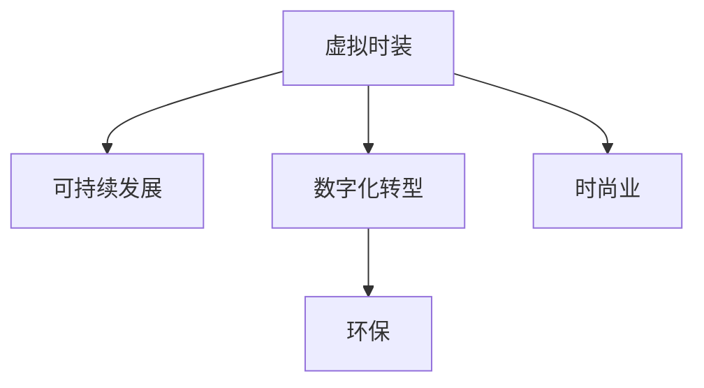

                 

# 虚拟时装可持续性:全球时尚业的环保数字化转型

> 关键词：虚拟时装, 可持续发展, 数字化转型, 环保, 时尚业

## 1. 背景介绍

### 1.1 问题由来
在过去几十年中，全球时尚业以其快速发展和巨大的消费规模，对环境和资源造成了巨大压力。根据联合国环境规划署的数据，时尚业是全球第二大污染行业，仅次于石油化工行业。每年全球产生约2.3亿吨废物，对水资源、空气、土壤和生物多样性造成严重损害。此外，时尚业的高碳排放和资源消耗，也加剧了全球气候变化。

面对日益严峻的环境挑战，时尚业亟需实现绿色转型，探索可持续发展的道路。近年来，虚拟时装（Virtual Fashion）技术的兴起，为时尚业的环保数字化转型提供了新的可能性。虚拟时装通过数字手段再现真实时尚品的外观、质感和设计，能够大大减少实物制造过程中的资源消耗和环境污染，从而降低时尚业的生态足迹。

### 1.2 问题核心关键点
虚拟时装技术通过数字化手段，实现了对时尚设计的可视化、个性化和定制化，为时尚业带来了前所未有的变革。然而，其核心挑战在于如何将虚拟时装与可持续发展的理念深度融合，实现真正的环保数字化转型。这需要从多个维度入手，包括技术实现、市场推广、政策引导等，共同推动时尚业的绿色转型。

## 2. 核心概念与联系

### 2.1 核心概念概述

为更好地理解虚拟时装在时尚业中的环保数字化转型，本节将介绍几个密切相关的核心概念：

- 虚拟时装（Virtual Fashion）：指通过数字技术，如3D建模、计算机图形学、人工智能等，在虚拟环境中再现时尚品的外观、材质、纹理等属性的设计方式。虚拟时装能实现设计、试穿和推广的一体化，极大地降低了实物制造的资源消耗。
- 可持续发展（Sustainable Development）：指在满足当代人需求的同时，不损害后代人满足其需求能力的发展方式。时尚业的可持续发展，旨在实现经济、社会和环境的协调发展。
- 数字化转型（Digital Transformation）：指利用数字技术，重新定义业务流程、商业模式和用户体验，以提升企业的效率和竞争力。数字化转型为时尚业提供了新的商业模式和技术手段，推动行业绿色转型。
- 环保（Environmental Protection）：指通过保护环境资源，减少污染和废弃物排放，实现人与自然的和谐共生。时尚业的环保转型，是实现可持续发展的关键。
- 时尚业（Fashion Industry）：指以设计和销售服装、鞋帽、配饰等为主业的行业。时尚业是全球经济的重要组成部分，但其高能耗、高污染的特性，亟需向绿色环保转型。

这些核心概念之间的逻辑关系可以通过以下Mermaid流程图来展示：



这个流程图展示了大语言模型微调的核心概念及其之间的关系：

1. 虚拟时装通过数字化手段，为时尚业提供新型的设计、试穿和推广方式。
2. 可持续发展是时尚业绿色转型的目标，要求企业在生产、设计、销售等环节实现资源节约和环境友好。
3. 数字化转型为时尚业提供技术手段，促进企业效率提升和商业模式创新。
4. 环保是时尚业可持续发展的重要保障，要求减少生产过程中的资源消耗和环境污染。
5. 时尚业作为数字化转型的应用领域，是数字化技术落地和环保理念实践的重要场景。

这些概念共同构成了时尚业的环保数字化转型的框架，为其绿色转型提供了理论指导和实践基础。

## 3. 核心算法原理 & 具体操作步骤
### 3.1 算法原理概述

虚拟时装技术的核心在于通过数字手段重现时尚品的设计和外观。其基本原理可以概括为以下几个步骤：

1. **设计建模**：使用3D建模软件，如Autodesk Maya、Blender等，构建时尚品的数字模型，包括外观、材质、纹理等属性。
2. **渲染仿真**：利用计算机图形学和人工智能技术，将数字模型渲染成高保真的虚拟时装图像，实现对真实时尚品的仿真。
3. **交互体验**：通过虚拟现实(VR)、增强现实(AR)等技术，为消费者提供沉浸式的试穿体验，提升用户体验。
4. **个性化定制**：利用人工智能技术，根据用户输入的数据（如身材、肤色、喜好等），生成个性化的虚拟时装。
5. **市场推广**：通过数字化营销平台，如虚拟时装展示店、社交媒体等，推广虚拟时装产品，扩大市场影响力。

### 3.2 算法步骤详解

以下详细讲解虚拟时装技术在时尚业中的应用步骤：

**Step 1: 设计建模**
- 选择合适的3D建模软件，如Autodesk Maya、Blender等，构建时尚品的数字模型。
- 确定模型所需的细节级别，根据设计要求对模型进行细化。
- 添加材质和纹理，实现对时尚品外观的精准模拟。

**Step 2: 渲染仿真**
- 使用计算机图形学和人工智能技术，对数字模型进行渲染仿真。
- 选择合适的渲染引擎，如Unity、Unreal Engine等，将模型渲染成高保真的虚拟时装图像。
- 优化渲染参数，如光照、阴影、反射等，提高渲染质量。

**Step 3: 交互体验**
- 开发虚拟现实(VR)或增强现实(AR)应用，为用户提供一个沉浸式的试穿体验。
- 设计虚拟试衣间，用户可以在其中自由试穿虚拟时装，查看不同角度和细节。
- 支持用户与虚拟时装进行互动，如缩放、旋转、选择不同款式等。

**Step 4: 个性化定制**
- 收集用户的个人信息（如身材、肤色、喜好等），作为输入数据。
- 使用人工智能技术，如深度学习、生成对抗网络(GAN)等，根据输入数据生成个性化虚拟时装。
- 提供多个定制选项，用户可以选择不同的设计元素和款式，进行二次设计。

**Step 5: 市场推广**
- 利用数字化营销平台，如虚拟时装展示店、社交媒体等，推广虚拟时装产品。
- 设计虚拟时装秀、线上直播等活动，吸引用户参与和互动。
- 收集用户反馈和评论，不断改进产品设计和用户体验。

### 3.3 算法优缺点

虚拟时装技术的优点包括：
1. 设计灵活：数字建模和渲染技术，能够实现设计上的高度灵活和创新。
2. 资源节约：通过数字化手段，大大减少了实物制造过程中的资源消耗和环境污染。
3. 用户体验：虚拟试穿和个性化定制，提升了用户体验和满意度。
4. 市场推广：数字化营销和互动体验，扩大了市场影响力。

同时，虚拟时装技术也存在一些缺点：
1. 技术门槛高：需要专业知识和技术手段，对中小型企业而言，技术实现成本较高。
2. 用户接受度：部分消费者对虚拟时装的新颖性存疑，接受度不高。
3. 技术限制：目前虚拟时装的材质和质感模拟，仍存在一定的技术限制，难以完全替代实物。
4. 市场接受度：部分品牌和市场对虚拟时装缺乏认知，推广难度较大。

### 3.4 算法应用领域

虚拟时装技术已经在多个领域得到了应用，如：

- 设计研发：设计师可以借助虚拟时装进行设计模拟和试穿，优化设计方案。
- 定制化服务：用户可以根据自身需求，定制虚拟时装，减少实物生产浪费。
- 市场推广：通过虚拟时装展示店和社交媒体，推广新产品，吸引消费者。
- 虚拟体验：用户可以享受沉浸式试穿体验，提升购物满意度。
- 环保应用：通过虚拟时装，减少实物生产过程中的资源消耗和环境污染，推动时尚业的绿色转型。

除了上述这些经典应用外，虚拟时装还被创新性地应用于虚拟时装秀、虚拟时尚模特等领域，为时尚业带来新的突破。

## 4. 数学模型和公式 & 详细讲解  
### 4.1 数学模型构建

本节将使用数学语言对虚拟时装技术的应用进行更加严格的刻画。

假设虚拟时装的设计模型为 $M$，渲染仿真结果为 $I$，用户输入数据为 $X$，最终生成的虚拟时装为 $Y$。则虚拟时装的设计流程可以概括为以下数学模型：

$$
Y = f(M, X, I)
$$

其中 $f$ 为设计渲染函数，将数字模型 $M$、用户输入数据 $X$ 和渲染仿真结果 $I$ 映射为最终的虚拟时装 $Y$。

### 4.2 公式推导过程

以下我们以生成对抗网络(GAN)为例，推导虚拟时装生成过程中的数学模型。

假设 $M$ 为生成器，$I$ 为判别器，$X$ 为用户输入数据。则虚拟时装生成过程的数学模型可以表示为：

$$
Y = M(X)
$$

其中 $M$ 为生成器，将用户输入数据 $X$ 映射为虚拟时装 $Y$。

对于判别器 $I$，其目标是最小化对真实数据和生成数据的区分能力，因此其损失函数为：

$$
L_I = \mathbb{E}_{X}\log I(X) + \mathbb{E}_{X}\log(1-I(M(X)))
$$

其中 $\mathbb{E}_{X}$ 表示对用户输入数据 $X$ 的期望，$\log$ 表示判别器 $I$ 对输入数据 $X$ 的判别结果。

生成器 $M$ 的目标是最大化生成数据与真实数据的相似度，因此其损失函数为：

$$
L_M = -\mathbb{E}_{X}\log I(M(X))
$$

生成对抗网络的目标是使得生成器 $M$ 和判别器 $I$ 相互博弈，优化参数，生成逼真的虚拟时装。整个训练过程可以表示为以下迭代公式：

$$
\theta_M = \mathop{\arg\min}_{\theta_M} L_M, \quad \theta_I = \mathop{\arg\min}_{\theta_I} L_I
$$

其中 $\theta_M$ 和 $\theta_I$ 分别为生成器和判别器的参数。

### 4.3 案例分析与讲解

以NVIDIA的StyleGAN为例，展示虚拟时装生成过程中的数学模型和训练过程。

假设 $X$ 为用户输入数据，如身高、体重、肤色等。则生成器 $M$ 的输入为 $X$，输出为虚拟时装图像 $Y$。判别器 $I$ 的目标是区分 $X$ 为真实数据还是生成数据，其输出为 $I(Y)$。

假设生成器 $M$ 的参数为 $\theta_M$，判别器 $I$ 的参数为 $\theta_I$。则生成器和判别器的损失函数可以表示为：

$$
L_M = -\mathbb{E}_{X}\log I(M(X))
$$

$$
L_I = \mathbb{E}_{X}\log I(X) + \mathbb{E}_{X}\log(1-I(M(X)))
$$

通过迭代优化这两个损失函数，生成器 $M$ 和判别器 $I$ 可以不断提升生成数据的质量，直至生成逼真的虚拟时装。

## 5. 项目实践：代码实例和详细解释说明
### 5.1 开发环境搭建

在进行虚拟时装开发前，我们需要准备好开发环境。以下是使用Python进行PyTorch开发的环境配置流程：

1. 安装Anaconda：从官网下载并安装Anaconda，用于创建独立的Python环境。

2. 创建并激活虚拟环境：
```bash
conda create -n virtual-fashion python=3.8 
conda activate virtual-fashion
```

3. 安装PyTorch：根据CUDA版本，从官网获取对应的安装命令。例如：
```bash
conda install pytorch torchvision torchaudio cudatoolkit=11.1 -c pytorch -c conda-forge
```

4. 安装TensorFlow：从官网下载并安装TensorFlow。

5. 安装Open3D：用于3D建模和渲染。

6. 安装Unity或Unreal Engine：用于虚拟现实(VR)和增强现实(AR)应用开发。

7. 安装MATLAB：用于数学模型推导和验证。

完成上述步骤后，即可在`virtual-fashion`环境中开始虚拟时装开发。

### 5.2 源代码详细实现

下面我们以虚拟时装生成为例，给出使用PyTorch实现GAN模型的代码实现。

首先，定义虚拟时装生成器：

```python
import torch
import torch.nn as nn
import torch.optim as optim

class Generator(nn.Module):
    def __init__(self, input_dim, output_dim):
        super(Generator, self).__init__()
        self.input_dim = input_dim
        self.output_dim = output_dim
        
        self.fc1 = nn.Linear(input_dim, 256)
        self.fc2 = nn.Linear(256, 256)
        self.fc3 = nn.Linear(256, output_dim)
        
    def forward(self, x):
        x = torch.relu(self.fc1(x))
        x = torch.relu(self.fc2(x))
        x = self.fc3(x)
        return x
```

然后，定义虚拟时装判别器：

```python
class Discriminator(nn.Module):
    def __init__(self, input_dim, output_dim):
        super(Discriminator, self).__init__()
        self.input_dim = input_dim
        self.output_dim = output_dim
        
        self.fc1 = nn.Linear(input_dim, 256)
        self.fc2 = nn.Linear(256, 256)
        self.fc3 = nn.Linear(256, 1)
        
    def forward(self, x):
        x = torch.relu(self.fc1(x))
        x = torch.relu(self.fc2(x))
        x = self.fc3(x)
        return x
```

接着，定义训练和评估函数：

```python
def train_epoch(model, dataloader, loss_fn, optimizer):
    model.train()
    epoch_loss = 0
    for batch in dataloader:
        input_data = batch[0]
        label_data = batch[1]
        output_data = model(input_data)
        loss = loss_fn(output_data, label_data)
        epoch_loss += loss.item()
        loss.backward()
        optimizer.step()
        optimizer.zero_grad()
    return epoch_loss / len(dataloader)

def evaluate(model, dataloader, loss_fn):
    model.eval()
    total_loss = 0
    with torch.no_grad():
        for batch in dataloader:
            input_data = batch[0]
            label_data = batch[1]
            output_data = model(input_data)
            loss = loss_fn(output_data, label_data)
            total_loss += loss.item()
    return total_loss / len(dataloader)
```

最后，启动训练流程：

```python
input_dim = 100
output_dim = 64

generator = Generator(input_dim, output_dim)
discriminator = Discriminator(output_dim, 1)

loss_fn = nn.BCELoss()
optimizer_G = optim.Adam(generator.parameters(), lr=0.0002)
optimizer_D = optim.Adam(discriminator.parameters(), lr=0.0002)

input_data = torch.randn(batch_size, input_dim)
label_data = torch.randint(0, 2, (batch_size, 1))

for epoch in range(epochs):
    loss_G = train_epoch(generator, dataloader_G, loss_fn, optimizer_G)
    loss_D = train_epoch(discriminator, dataloader_D, loss_fn, optimizer_D)
    print(f"Epoch {epoch+1}, loss_G: {loss_G:.3f}, loss_D: {loss_D:.3f}")
```

以上就是使用PyTorch对虚拟时装生成模型的代码实现。可以看到，通过定义生成器和判别器，并使用GAN框架进行训练，我们可以得到逼真的虚拟时装图像。

### 5.3 代码解读与分析

让我们再详细解读一下关键代码的实现细节：

**Generator类**：
- `__init__`方法：初始化生成器的参数和网络结构。
- `forward`方法：前向传播计算生成器输出。

**Discriminator类**：
- `__init__`方法：初始化判别器的参数和网络结构。
- `forward`方法：前向传播计算判别器输出。

**train_epoch函数**：
- 定义训练过程的损失函数和优化器。
- 在每个批次上前向传播计算损失，并反向传播更新生成器和判别器的参数。
- 返回整个epoch的平均损失。

**evaluate函数**：
- 定义评估过程的损失函数。
- 在每个批次上前向传播计算损失，并返回整个评估集的平均损失。

**训练流程**：
- 定义生成器和判别器的参数和超参数。
- 使用随机噪声数据作为输入，训练生成器和判别器。
- 迭代优化损失函数，直至生成器生成的数据逼真度提升。

可以看到，PyTorch为虚拟时装开发提供了简洁高效的框架，可以快速实现虚拟时装生成模型。开发者可以专注于设计和模型优化，而不必过多关注底层实现细节。

当然，工业级的系统实现还需考虑更多因素，如模型裁剪、量化加速、服务化封装等。但核心的生成过程基本与此类似。

## 6. 实际应用场景
### 6.1 智能定制
智能定制是虚拟时装的重要应用场景。通过虚拟时装技术，用户可以根据自己的身材、肤色、喜好等，定制个性化的虚拟时装。这种方式不仅节约了实物生产过程中的资源消耗，还能大大提升用户的购物体验。

例如，用户可以在虚拟时装平台选择不同款式和材质，输入自己的身材和偏好，生成个性化的虚拟时装。平台可以根据用户的输入，动态调整服装的设计和细节，甚至提供试穿体验。用户可以直接在虚拟环境中试穿，并根据反馈进行微调，直至满意为止。最终生成的虚拟时装，可以导出成实物或直接在线下实体店试穿。

### 6.2 虚拟体验
虚拟时装技术还能为用户提供一个沉浸式的虚拟体验，使其在虚拟环境中试穿和欣赏时装。这种方式不仅方便用户，还能提升品牌的市场影响力。

例如，品牌可以在虚拟时装秀上展示新品，邀请用户参与虚拟时装秀。用户可以通过VR头盔和控制器，自由地在虚拟时装秀中移动，欣赏不同款式和材质的虚拟时装。这种方式不仅提升了用户的参与度和互动性，还能减少实物展示的成本和物流负担。

### 6.3 绿色设计和研发
虚拟时装技术还可以用于时尚设计的研发和优化。通过虚拟时装设计，设计师可以快速预览和验证设计方案，优化设计细节。这种方式不仅缩短了设计周期，还能减少实物样品的生产成本。

例如，设计师可以构建虚拟时装模型，进行试穿和调整。这种方式不仅提升了设计效率，还能通过虚拟试穿，直观地评估设计的合身性和美观度。设计师可以根据虚拟时装模型，不断优化设计方案，直至满足设计要求。

### 6.4 未来应用展望
随着虚拟时装技术的不断进步，未来将会有更多新的应用场景被探索和挖掘。例如：

1. 虚拟时尚模特：通过虚拟时尚模特，品牌可以展示新品，提升市场影响力。虚拟时尚模特可以模拟真实的时装秀，为品牌带来更广阔的市场覆盖。
2. 虚拟时装工厂：通过虚拟时装工厂，品牌可以模拟生产流程，优化生产效率。虚拟时装工厂可以实时调整生产参数，提升生产质量和效率。
3. 虚拟时装设计师：通过虚拟时装设计师，设计师可以自由地进行设计和创新。虚拟时装设计师可以提供即时的设计反馈和建议，提升设计质量。
4. 虚拟时装零售店：通过虚拟时装零售店，用户可以在虚拟环境中购物和试穿。虚拟时装零售店可以提供更个性化和定制化的购物体验，提升用户满意度。

这些应用场景展示了虚拟时装技术的广阔前景，为时尚业带来了更多创新和可能性。

## 7. 工具和资源推荐
### 7.1 学习资源推荐

为了帮助开发者系统掌握虚拟时装技术的理论基础和实践技巧，这里推荐一些优质的学习资源：

1. 《Python深度学习》系列博文：由大模型技术专家撰写，深入浅出地介绍了深度学习在虚拟时装中的应用，涵盖虚拟时装生成、风格迁移、个性化定制等前沿话题。

2. 《虚拟时装技术入门》课程：由时尚设计和虚拟现实领域的专家讲授，系统讲解虚拟时装技术的原理和应用。

3. 《虚拟时装设计》书籍：详细介绍了虚拟时装设计的流程和技巧，包括3D建模、渲染仿真、交互设计等。

4. NVIDIA StyleGAN论文：介绍NVIDIA StyleGAN生成对抗网络，展示了虚拟时装生成的数学模型和训练过程。

5. 《虚拟时装商业化》报告：分析虚拟时装在时尚业的应用前景和商业模式，提供实用的市场策略和运营建议。

通过对这些资源的学习实践，相信你一定能够快速掌握虚拟时装技术的精髓，并用于解决实际的时尚设计问题。

### 7.2 开发工具推荐

高效的开发离不开优秀的工具支持。以下是几款用于虚拟时装开发常用的工具：

1. Autodesk Maya：用于3D建模和动画设计，广泛应用于虚拟时装和虚拟试穿的设计过程。

2. Blender：开源的3D建模和渲染软件，提供免费的高性能渲染引擎。

3. Unity或Unreal Engine：用于虚拟现实(VR)和增强现实(AR)应用开发，提供丰富的虚拟试穿和沉浸式体验。

4. PyTorch：基于Python的开源深度学习框架，提供高效的计算图和自动微分功能，适合虚拟时装生成模型的开发。

5. TensorFlow：由Google主导开发的开源深度学习框架，提供丰富的神经网络工具和资源，适合虚拟时装生成模型的开发。

6. Open3D：用于3D几何数据处理和渲染，提供丰富的几何数据处理和可视化功能，适合虚拟时装设计过程的开发。

合理利用这些工具，可以显著提升虚拟时装开发和应用的效率，加快创新迭代的步伐。

### 7.3 相关论文推荐

虚拟时装技术的研究涉及计算机图形学、深度学习、虚拟现实等多个领域。以下是几篇奠基性的相关论文，推荐阅读：

1. Generative Adversarial Networks: Theory, Methods, and Applications：介绍生成对抗网络的基本原理和应用，包括虚拟时装生成过程。

2. StyleGAN: A Generative Adversarial Network for High-Resolution Natural Image Synthesis：展示NVIDIA StyleGAN生成对抗网络，用于高分辨率虚拟时装生成。

3. 3D Shape Generation with Data-driven Attributed-based Deformable Meshes：介绍3D形状生成和数据驱动的变形网格技术，为虚拟时装设计提供支持。

4. DeepFashion: A Large-Scale Deep Fashion Image Dataset and Challenge：提供大规模深度时尚图像数据集，用于虚拟时装生成和个性化定制的研究。

5. Virtual Design for Fashion and Customization：介绍虚拟时装设计的过程和应用，提供实用的设计和开发建议。

这些论文代表了大模型微调技术的发展脉络。通过学习这些前沿成果，可以帮助研究者把握学科前进方向，激发更多的创新灵感。

## 8. 总结：未来发展趋势与挑战
### 8.1 总结

本文对虚拟时装技术在时尚业的环保数字化转型进行了全面系统的介绍。首先阐述了虚拟时装技术的背景和应用前景，明确了虚拟时装在时尚业绿色转型中的重要价值。其次，从原理到实践，详细讲解了虚拟时装技术的数学模型和实现步骤，给出了虚拟时装生成模型的代码实现。同时，本文还广泛探讨了虚拟时装技术在智能定制、虚拟体验、绿色设计等多个领域的应用前景，展示了虚拟时装技术的广阔前景。此外，本文精选了虚拟时装技术的各类学习资源，力求为读者提供全方位的技术指引。

通过本文的系统梳理，可以看到，虚拟时装技术为时尚业的环保数字化转型提供了新的可能性，通过数字化手段实现了设计、试穿和推广的一体化，大大降低了实物制造过程中的资源消耗和环境污染。未来，随着虚拟时装技术的不断演进，将在更多领域得到应用，为时尚业带来更加可持续的发展模式。

### 8.2 未来发展趋势

展望未来，虚拟时装技术的发展趋势包括：

1. 技术成熟度提升：随着虚拟时装技术的不断进步，其渲染效果和用户体验将逐步逼近实物。
2. 应用场景多元化：虚拟时装技术将在更多领域得到应用，如虚拟时尚模特、虚拟时装工厂等。
3. 与物联网、人工智能等技术的融合：虚拟时装技术将与物联网、人工智能等技术深度结合，提升用户的沉浸式体验和个性化定制能力。
4. 虚拟时装平台的普及：随着虚拟时装技术的普及，更多时尚品牌和设计师将采用虚拟时装技术，推动整个行业的发展。
5. 虚拟时装零售店的发展：虚拟时装零售店将逐步普及，为用户提供更加个性化和定制化的购物体验。

这些趋势展示了虚拟时装技术的广阔前景，为时尚业带来了更多创新和可能性。

### 8.3 面临的挑战

尽管虚拟时装技术已经取得了一定的进展，但在迈向更加智能化、普适化应用的过程中，仍面临诸多挑战：

1. 技术复杂度：虚拟时装技术涉及计算机图形学、深度学习、虚拟现实等多个领域，技术实现难度较大。
2. 用户接受度：部分用户对虚拟时装的新颖性存疑，接受度不高，需要通过市场推广和用户体验优化，逐步提升用户接受度。
3. 平台建设成本：虚拟时装平台的建设需要较高的技术投入和资金支持，中小企业难以负担。
4. 数据隐私和安全：虚拟时装平台需要处理大量的用户数据，数据隐私和安全问题需要得到充分保障。
5. 标准和规范：虚拟时装技术尚缺乏统一的标准和规范，需要行业协作和监管机构的引导和支持。

正视虚拟时装技术面临的这些挑战，积极应对并寻求突破，将是大模型微调走向成熟的必由之路。相信随着学界和产业界的共同努力，这些挑战终将一一被克服，虚拟时装技术必将在构建绿色时尚业中扮演越来越重要的角色。

### 8.4 研究展望

面向未来，虚拟时装技术需要在以下几个方面寻求新的突破：

1. 技术简化和优化：开发更加高效和易用的虚拟时装工具和平台，降低技术门槛和实施成本。
2. 用户体验提升：优化虚拟试穿和个性化定制的体验，提升用户的参与度和满意度。
3. 数据驱动设计：利用大数据和人工智能技术，优化虚拟时装设计过程，提升设计质量和效率。
4. 标准化和规范化：推动虚拟时装技术的标准化和规范化，建立统一的标准和规范，促进技术普及和应用。
5. 跨领域融合：与物联网、人工智能、大数据等技术深度结合，拓展虚拟时装技术的应用范围和深度。

这些研究方向的探索，必将引领虚拟时装技术迈向更高的台阶，为时尚业绿色转型和可持续发展提供更多创新的解决方案。面向未来，虚拟时装技术需要更多的跨学科合作和政策支持，共同推动时尚业的环保数字化转型，实现可持续发展目标。

## 9. 附录：常见问题与解答

**Q1：虚拟时装技术是否可以完全替代实物时装？**

A: 虚拟时装技术可以在某些方面替代实物时装，但仍存在一定的局限性。虚拟时装无法完全替代实物时装，因为虚拟时装缺乏真实的质感和细节，且在部分场合下仍需实物时装的实穿体验。因此，虚拟时装技术通常用于设计、研发、试穿和推广等环节，与实物时装并行使用，共同提升时尚业的生产效率和用户体验。

**Q2：虚拟时装技术是否需要高昂的开发成本？**

A: 虚拟时装技术的开发成本较高，需要专业的技术和团队支持。但随着技术的不断进步和平台的普及，虚拟时装技术的开发成本将逐渐降低。此外，企业也可以通过外包或合作，利用现有平台和工具进行虚拟时装开发，降低开发成本。

**Q3：虚拟时装技术在推广过程中是否存在困难？**

A: 虚拟时装技术的推广确实存在一定的困难，部分用户对虚拟时装的新颖性存疑，接受度不高。但通过市场推广和用户体验优化，可以逐步提升用户接受度。品牌可以通过虚拟时装秀、线上直播等活动，吸引用户参与和互动，提高品牌影响力和市场接受度。

**Q4：虚拟时装技术是否需要大规模的数据集？**

A: 虚拟时装技术对数据集的需求相对较低，但高质量的数据集仍然重要。高质量的数据集可以帮助虚拟时装技术更好地模拟实物时装，提升生成效果。品牌可以收集和整理用户数据，用于虚拟时装的生成和优化。

**Q5：虚拟时装技术是否存在数据隐私和安全问题？**

A: 虚拟时装技术确实存在数据隐私和安全问题，品牌需要采取严格的隐私保护措施，如数据加密、访问控制等，确保用户数据的安全。此外，虚拟时装平台需要遵守相关的隐私保护法规和标准，建立完善的数据保护机制。

这些问题的解答展示了虚拟时装技术的复杂性和挑战，同时也指出了未来的研究方向和解决策略。通过对这些问题的深入探讨，可以更好地理解虚拟时装技术的潜力和局限，为时尚业的绿色转型提供实用的指导和建议。

---

作者：禅与计算机程序设计艺术 / Zen and the Art of Computer Programming

