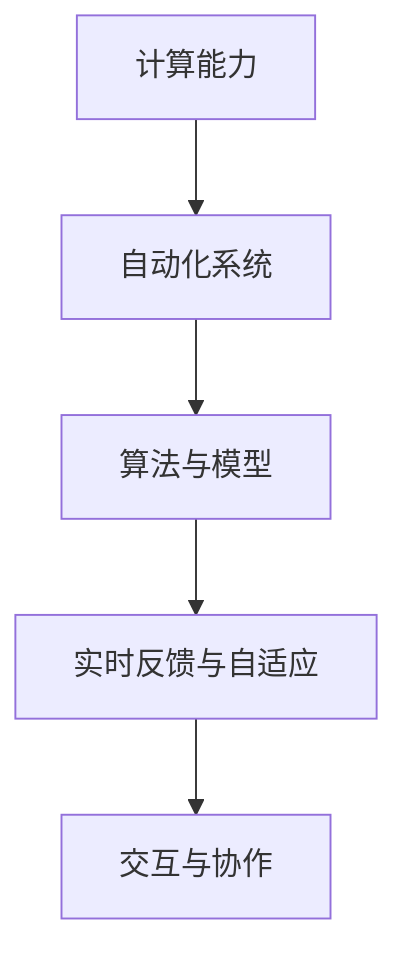
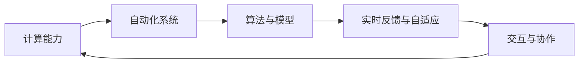

                 

## 1. 背景介绍

### 1.1 问题由来

在过去几十年中，计算的变化极大地改变了我们的生活和工作方式。从个人计算机到移动互联网，再到人工智能，计算技术的每一次突破都为人类社会带来了深刻变革。自动化作为计算技术的重要应用领域，也随之迅速发展，推动了各行各业的效率提升和创新变革。但随着计算能力的提升，自动化系统也变得越来越复杂，对系统的理解与操作提出了更高的要求。

计算与自动化的互动正处在一个关键点。一方面，自动化系统越来越依赖于计算能力的提升，以实现更精确、更智能的决策。另一方面，计算技术的发展也使得自动化的实施变得更加高效、灵活。这种互动关系对计算和自动化领域的研究者和从业者提出了新的挑战和机遇。

### 1.2 问题核心关键点

计算与自动化的互动涉及以下几个核心关键点：
1. **计算能力提升**：高性能计算、云计算和边缘计算的普及，使得自动化系统能够处理更复杂、更海量数据的自动化任务。
2. **算法与模型优化**：优化算法的性能、减少计算资源消耗、提升自动化系统响应速度。
3. **实时反馈与自适应**：通过实时反馈和自适应机制，自动化系统能够快速响应环境变化，提升决策准确性和适应性。
4. **交互与协作**：实现人机协作，将计算与自动化系统整合，增强系统性能和用户体验。

这些关键点体现了计算与自动化互动的深度和广度，对未来的技术发展具有重要指导意义。

### 1.3 问题研究意义

研究计算与自动化的互动，对于推动计算与自动化技术的融合、提升自动化系统的性能和可靠性具有重要意义：

1. **提升效率与降低成本**：计算能力的提升使得自动化系统能够处理更复杂的任务，降低人力成本，提高工作效率。
2. **增强决策准确性**：通过优化算法和模型，自动化系统能够更准确地理解和响应环境变化，提升决策效果。
3. **促进创新与变革**：计算与自动化的结合，推动了新产品、新服务的开发，促进了传统行业的数字化转型。
4. **增强系统鲁棒性**：通过实时反馈和自适应机制，自动化系统能够更好地应对不确定性和风险，提高系统的鲁棒性。
5. **增强人机协作**：实现高效、灵活的人机协作，提升用户体验和工作效率。

## 2. 核心概念与联系

### 2.1 核心概念概述

计算与自动化的互动涉及到多个核心概念，包括：

- **计算能力**：指计算机系统处理数据和任务的能力，包括计算速度、内存大小、存储容量等。
- **自动化系统**：指通过计算能力实现的任务自动化系统，包括工业自动化、物流自动化、智能制造等。
- **算法与模型**：指用于优化自动化系统性能的算法和模型，包括机器学习、深度学习、强化学习等。
- **实时反馈与自适应**：指自动化系统通过实时数据反馈，动态调整决策和行为。
- **交互与协作**：指计算与自动化系统通过人机接口实现的信息交换和协同工作。

这些概念之间的逻辑关系可以通过以下Mermaid流程图来展示：



### 2.2 核心概念原理和架构的 Mermaid 流程图



这个流程图展示了计算与自动化的互动关系：计算能力为自动化系统的运行提供基础，算法与模型优化提升自动化系统的性能，实时反馈与自适应增强系统灵活性和鲁棒性，人机协作提升用户体验和系统效率。

## 3. 核心算法原理 & 具体操作步骤

### 3.1 算法原理概述

计算与自动化的互动主要依赖于算法和模型的优化。这些算法和模型通过处理海量数据和任务，实现自动化系统的智能化和自动化。

算法与模型优化的基本原理包括：

1. **数据驱动**：通过收集和分析大量数据，优化算法和模型的参数，提升预测和决策的准确性。
2. **模型学习**：使用机器学习和深度学习等方法，训练模型以适应特定任务和环境，提升系统性能。
3. **自适应优化**：通过实时反馈和自适应机制，动态调整模型参数，适应环境变化。
4. **人机协同**：通过交互界面，实现人机协作，提升系统响应速度和决策质量。

### 3.2 算法步骤详解

计算与自动化的互动算法一般包括以下几个关键步骤：

**Step 1: 数据采集与预处理**

- 收集与任务相关的数据，包括传感器数据、历史记录、用户反馈等。
- 对数据进行清洗、过滤、归一化等预处理操作，保证数据质量和一致性。

**Step 2: 算法模型选择**

- 根据任务需求，选择合适的算法和模型。例如，对于分类任务，可以选择逻辑回归、决策树、支持向量机等算法。
- 对于复杂的预测和优化问题，可以使用深度学习、强化学习等高级算法。

**Step 3: 模型训练与优化**

- 使用训练集数据，训练模型，并根据验证集数据进行参数调整。
- 使用交叉验证、正则化等技术，优化模型性能，防止过拟合。
- 根据计算能力，选择合适的优化器和超参数，平衡模型性能和计算效率。

**Step 4: 模型部署与反馈**

- 将训练好的模型部署到自动化系统中，并进行实时数据处理和决策。
- 实时监控模型性能，收集反馈数据，动态调整模型参数。
- 通过人机界面，收集用户反馈，优化模型和系统。

**Step 5: 持续改进**

- 根据最新的数据和用户反馈，持续优化模型和算法。
- 引入新的计算资源，提升系统处理能力和响应速度。
- 探索新的自动化技术，提升系统性能和可靠性。

### 3.3 算法优缺点

计算与自动化的互动算法具有以下优点：

1. **高效处理复杂任务**：算法和模型能够处理大规模、高维度数据，实现复杂任务的高效自动化。
2. **提升决策准确性**：通过优化算法和模型，提升决策的准确性和鲁棒性。
3. **增强系统适应性**：实时反馈和自适应机制，使系统能够快速响应环境变化。
4. **提高用户体验**：人机协作界面，提升用户对自动化系统的理解和操作。

同时，这些算法也存在一些局限性：

1. **数据依赖性强**：算法和模型的性能依赖于高质量的数据，数据获取和处理成本较高。
2. **计算资源消耗大**：复杂的算法和模型需要大量的计算资源，可能导致系统延迟和成本增加。
3. **模型复杂度高**：高维数据和多变量系统可能增加模型的复杂度，降低模型的可解释性。
4. **系统风险难以预测**：自动化系统的复杂性增加了系统风险的不可预测性，需要额外的监控和维护。

### 3.4 算法应用领域

计算与自动化的互动算法已经在多个领域得到了广泛应用：

1. **智能制造**：通过自动化系统实现工业生产的智能化和自动化，提高生产效率和质量。
2. **智能交通**：利用计算能力和算法优化交通信号控制和车辆调度，提高交通效率和安全性。
3. **智能医疗**：使用算法优化医疗影像诊断和治疗方案，提高诊断准确性和治疗效果。
4. **智能城市**：通过自动化系统实现城市管理和公共服务的智能化，提升城市运行效率和居民满意度。
5. **智能客服**：利用计算能力和算法优化客服系统，提升客户体验和问题解决效率。
6. **智能金融**：使用算法优化金融市场分析和风险管理，提升金融服务质量和稳定性。

## 4. 数学模型和公式 & 详细讲解 & 举例说明

### 4.1 数学模型构建

计算与自动化的互动涉及多个数学模型，包括监督学习、非监督学习、强化学习等。这里以监督学习模型为例，介绍其构建和优化过程。

假设自动化系统需要完成一个分类任务，输入为特征向量 $x \in \mathbb{R}^n$，输出为标签 $y \in \{0, 1\}$。监督学习模型的目标是最小化损失函数：

$$
\mathcal{L}(\theta) = \frac{1}{N} \sum_{i=1}^N \ell(M_{\theta}(x_i),y_i)
$$

其中 $M_{\theta}(x)$ 为模型在输入 $x$ 上的输出，$\ell$ 为损失函数，$N$ 为训练样本数量。常见的损失函数包括交叉熵损失、均方误差损失等。

### 4.2 公式推导过程

以交叉熵损失为例，推导其具体形式：

假设模型在输入 $x$ 上的输出为 $\hat{y}=M_{\theta}(x) \in [0,1]$，表示样本属于正类的概率。真实标签 $y \in \{0,1\}$。则交叉熵损失函数定义为：

$$
\ell(M_{\theta}(x),y) = -[y\log \hat{y} + (1-y)\log (1-\hat{y})]
$$

将其代入经验风险公式，得：

$$
\mathcal{L}(\theta) = -\frac{1}{N}\sum_{i=1}^N [y_i\log M_{\theta}(x_i)+(1-y_i)\log(1-M_{\theta}(x_i))]
$$

根据链式法则，损失函数对参数 $\theta_k$ 的梯度为：

$$
\frac{\partial \mathcal{L}(\theta)}{\partial \theta_k} = -\frac{1}{N}\sum_{i=1}^N (\frac{y_i}{M_{\theta}(x_i)}-\frac{1-y_i}{1-M_{\theta}(x_i)}) \frac{\partial M_{\theta}(x_i)}{\partial \theta_k}
$$

其中 $\frac{\partial M_{\theta}(x_i)}{\partial \theta_k}$ 可进一步递归展开，利用自动微分技术完成计算。

### 4.3 案例分析与讲解

以智能交通系统为例，分析其自动化决策过程。

智能交通系统通过传感器收集道路交通数据，包括车速、车流量、交通信号等。利用机器学习算法，系统可以预测交通流量，优化交通信号灯的控制策略。具体步骤如下：

1. **数据采集与预处理**：通过传感器收集实时交通数据，对数据进行清洗、归一化等预处理操作。
2. **算法选择**：选择适当的机器学习算法，如线性回归、支持向量机等，进行交通流量预测。
3. **模型训练与优化**：使用历史交通数据训练模型，并通过交叉验证等技术优化模型参数。
4. **模型部署与反馈**：将训练好的模型部署到交通控制系统中，实时处理交通数据并输出控制策略。
5. **持续改进**：根据最新交通数据和用户反馈，持续优化模型和算法，提升系统性能和适应性。

## 5. 项目实践：代码实例和详细解释说明

### 5.1 开发环境搭建

在进行计算与自动化互动算法实践前，我们需要准备好开发环境。以下是使用Python进行Scikit-learn开发的环境配置流程：

1. 安装Anaconda：从官网下载并安装Anaconda，用于创建独立的Python环境。

2. 创建并激活虚拟环境：
```bash
conda create -n sklearn-env python=3.8 
conda activate sklearn-env
```

3. 安装Scikit-learn：
```bash
conda install scikit-learn
```

4. 安装各类工具包：
```bash
pip install numpy pandas matplotlib scikit-learn scikit-image scikit-learn
```

完成上述步骤后，即可在`sklearn-env`环境中开始互动算法实践。

### 5.2 源代码详细实现

这里我们以智能交通系统中的交通流量预测为例，给出使用Scikit-learn库的Python代码实现。

首先，定义交通流量预测问题：

```python
from sklearn.model_selection import train_test_split
from sklearn.linear_model import LinearRegression
from sklearn.metrics import mean_squared_error
import pandas as pd

# 导入交通数据
data = pd.read_csv('traffic_data.csv')

# 数据预处理
features = data.drop('flow', axis=1)
target = data['flow']
X_train, X_test, y_train, y_test = train_test_split(features, target, test_size=0.2, random_state=42)

# 训练模型
model = LinearRegression()
model.fit(X_train, y_train)

# 模型评估
y_pred = model.predict(X_test)
mse = mean_squared_error(y_test, y_pred)
print(f"MSE: {mse:.3f}")
```

然后，定义模型训练和评估函数：

```python
def train_model(X_train, y_train):
    model = LinearRegression()
    model.fit(X_train, y_train)
    return model

def evaluate_model(model, X_test, y_test):
    y_pred = model.predict(X_test)
    mse = mean_squared_error(y_test, y_pred)
    return mse
```

接着，启动训练流程并在测试集上评估：

```python
X_train, X_test, y_train, y_test = train_test_split(features, target, test_size=0.2, random_state=42)

# 训练模型
model = train_model(X_train, y_train)

# 模型评估
mse = evaluate_model(model, X_test, y_test)
print(f"MSE: {mse:.3f}")
```

以上就是使用Scikit-learn库对交通流量进行预测的完整代码实现。可以看到，Scikit-learn库提供了丰富的算法和工具，使得互动算法的实现变得相对简单高效。

### 5.3 代码解读与分析

让我们再详细解读一下关键代码的实现细节：

**数据预处理**：
- `pd.read_csv('traffic_data.csv')`：读取交通数据CSV文件。
- `features = data.drop('flow', axis=1)`：移除目标变量，获取特征变量。
- `target = data['flow']`：获取目标变量。
- `X_train, X_test, y_train, y_test = train_test_split(features, target, test_size=0.2, random_state=42)`：将数据集拆分为训练集和测试集。

**模型训练与评估**：
- `model = LinearRegression()`：实例化线性回归模型。
- `model.fit(X_train, y_train)`：使用训练集数据训练模型。
- `y_pred = model.predict(X_test)`：使用测试集数据预测目标变量。
- `mse = mean_squared_error(y_test, y_pred)`：计算预测值和真实值之间的均方误差。

**训练流程**：
- `X_train, X_test, y_train, y_test = train_test_split(features, target, test_size=0.2, random_state=42)`：将数据集拆分为训练集和测试集。
- `model = train_model(X_train, y_train)`：训练模型。
- `mse = evaluate_model(model, X_test, y_test)`：评估模型性能。

可以看到，Scikit-learn库的模块化设计使得互动算法的开发过程变得简单快捷。开发者可以将更多精力放在数据处理、模型改进等高层逻辑上，而不必过多关注底层的实现细节。

当然，工业级的系统实现还需考虑更多因素，如模型的保存和部署、超参数的自动搜索、更灵活的任务适配层等。但核心的互动算法基本与此类似。

## 6. 实际应用场景

### 6.1 智能制造

智能制造领域，计算与自动化互动技术的应用非常广泛。通过自动化系统实现生产线的智能化和自动化，提高生产效率和质量。例如，利用机器视觉和深度学习技术，对产品质量进行实时检测和缺陷分类，提升产品合格率。

### 6.2 智能交通

智能交通系统通过计算与自动化互动技术，实现交通信号控制和车辆调度，提升交通效率和安全性。例如，通过摄像头和传感器采集交通数据，使用机器学习算法预测交通流量，优化交通信号灯的控制策略，缓解交通拥堵。

### 6.3 智能医疗

智能医疗领域，计算与自动化互动技术的应用也越来越多。通过自动化系统实现医疗影像诊断和治疗方案的智能化，提高诊断准确性和治疗效果。例如，使用深度学习算法，对医疗影像进行自动分割和分析，辅助医生进行疾病诊断和手术规划。

### 6.4 未来应用展望

随着计算与自动化互动技术的不断发展，未来将会在更多领域得到应用，为各行各业带来变革性影响。

在智慧城市治理中，计算与自动化互动技术可以用于城市事件监测、舆情分析、应急指挥等环节，提高城市管理的自动化和智能化水平，构建更安全、高效的未来城市。

在企业生产中，智能制造系统可以实现生产线的智能化和自动化，提升生产效率和产品质量。通过实时数据采集和分析，优化生产流程，减少资源浪费。

在社会治理中，计算与自动化互动技术可以用于公共服务的智能化，提升政府服务的效率和质量。例如，通过自动化系统实现公共服务资源的最优化分配和调度，提升服务水平和用户满意度。

## 7. 工具和资源推荐

### 7.1 学习资源推荐

为了帮助开发者系统掌握计算与自动化互动的理论基础和实践技巧，这里推荐一些优质的学习资源：

1. 《机器学习实战》系列博文：由机器学习专家撰写，深入浅出地介绍了机器学习算法的原理和实现，包括线性回归、决策树、支持向量机等。

2. Coursera《机器学习》课程：斯坦福大学开设的机器学习明星课程，有Lecture视频和配套作业，带你入门机器学习的基本概念和经典算法。

3. 《深度学习》书籍：Ian Goodfellow、Yoshua Bengio和Aaron Courville合著，全面介绍了深度学习的基本原理和应用，包括神经网络、卷积神经网络等。

4. Kaggle竞赛：参与Kaggle机器学习竞赛，提升算法实现和模型优化能力，探索不同的数据和问题域。

5. GitHub代码库：浏览开源项目，学习先进的算法和模型实现，提升编程和开发能力。

通过对这些资源的学习实践，相信你一定能够快速掌握计算与自动化互动的精髓，并用于解决实际的计算和自动化问题。

### 7.2 开发工具推荐

高效的开发离不开优秀的工具支持。以下是几款用于计算与自动化互动开发的常用工具：

1. Jupyter Notebook：基于Python的交互式编程环境，支持数据可视化和模型调试。
2. PyTorch：基于Python的开源深度学习框架，灵活动态的计算图，适合快速迭代研究。
3. TensorFlow：由Google主导开发的开源深度学习框架，生产部署方便，适合大规模工程应用。
4. Scikit-learn：Python的机器学习库，包含多种算法和工具，易于实现和优化。
5. Keras：高级神经网络API，支持快速搭建和训练深度学习模型。
6. Microsoft Azure：云计算平台，提供强大的计算和存储资源，支持大规模数据处理和模型部署。

合理利用这些工具，可以显著提升计算与自动化互动任务的开发效率，加快创新迭代的步伐。

### 7.3 相关论文推荐

计算与自动化互动的发展源于学界的持续研究。以下是几篇奠基性的相关论文，推荐阅读：

1. TensorFlow: A System for Large-Scale Machine Learning: 提出了TensorFlow计算图框架，支持高效的数据流图计算。
2. The Unreasonable Effectiveness of Transfer Learning: 展示了迁移学习在图像识别、自然语言处理等任务中的显著效果。
3. Rethinking the Inception Architecture for Computer Vision: 提出了Inception模块，提高了深度神经网络的计算效率。
4. Deep Residual Learning for Image Recognition: 展示了深度残差网络在图像分类任务中的优越性能。
5. GANs Trained by a Two Time-Scale Update Rule Converge to the Semi-Equilibrium: 提出了生成对抗网络，为计算机视觉任务提供了新的解决方案。

这些论文代表了大数据、深度学习与计算互动的最新进展。通过学习这些前沿成果，可以帮助研究者把握学科前进方向，激发更多的创新灵感。

## 8. 总结：未来发展趋势与挑战

### 8.1 总结

本文对计算与自动化的互动进行了全面系统的介绍。首先阐述了计算与自动化的互动发展背景和意义，明确了互动在提升自动化系统性能和效率方面的重要价值。其次，从原理到实践，详细讲解了互动算法的数学模型和操作步骤，给出了互动算法任务开发的完整代码实例。同时，本文还广泛探讨了互动算法在智能制造、智能交通、智能医疗等多个领域的应用前景，展示了互动算法的广泛应用潜力。此外，本文精选了互动算法的各类学习资源，力求为读者提供全方位的技术指引。

通过本文的系统梳理，可以看到，计算与自动化的互动在推动自动化系统性能提升、降低成本、提高效率等方面具有重要意义。未来，伴随计算能力的持续提升和自动化技术的不断发展，互动技术必将在更多领域得到应用，为各行各业带来变革性影响。

### 8.2 未来发展趋势

展望未来，计算与自动化的互动将呈现以下几个发展趋势：

1. **计算能力持续提升**：高性能计算、云计算和边缘计算的普及，使得自动化系统能够处理更复杂、更海量数据的自动化任务。
2. **算法与模型优化**：优化算法的性能、减少计算资源消耗、提升自动化系统响应速度。
3. **实时反馈与自适应**：通过实时反馈和自适应机制，自动化系统能够快速响应环境变化，提升决策准确性和适应性。
4. **人机协同**：实现高效、灵活的人机协作，提升系统响应速度和决策质量。

这些趋势凸显了计算与自动化互动技术的广阔前景。这些方向的探索发展，必将进一步提升自动化系统的性能和可靠性，为构建更加智能化、普适化的自动化系统铺平道路。

### 8.3 面临的挑战

尽管计算与自动化的互动技术已经取得了瞩目成就，但在迈向更加智能化、普适化应用的过程中，它仍面临着诸多挑战：

1. **数据依赖性强**：算法和模型的性能依赖于高质量的数据，数据获取和处理成本较高。
2. **计算资源消耗大**：复杂的算法和模型需要大量的计算资源，可能导致系统延迟和成本增加。
3. **模型复杂度高**：高维数据和多变量系统可能增加模型的复杂度，降低模型的可解释性。
4. **系统风险难以预测**：自动化系统的复杂性增加了系统风险的不可预测性，需要额外的监控和维护。
5. **可解释性不足**：计算与自动化互动系统往往缺乏可解释性，难以对其决策过程进行解释和调试。
6. **伦理与安全问题**：自动化系统可能会学习到有偏见、有害的信息，需要通过数据和算法层面消除模型偏见，确保输出符合伦理道德。

正视计算与自动化互动面临的这些挑战，积极应对并寻求突破，将是实现互动技术进一步发展的关键。

### 8.4 研究展望

面对计算与自动化互动所面临的挑战，未来的研究需要在以下几个方面寻求新的突破：

1. **优化算法与模型**：开发更加高效、鲁棒的算法和模型，适应复杂的数据和任务。
2. **增强系统鲁棒性**：通过实时反馈和自适应机制，提升系统对环境变化的适应能力。
3. **提升模型可解释性**：引入因果分析、逻辑推理等方法，增强模型的可解释性和可控性。
4. **保障数据与模型安全**：通过数据脱敏、隐私保护等技术，确保数据和模型的安全性。
5. **实现人机协同**：通过人机接口，实现高效、灵活的人机协作，提升用户体验和系统效率。

这些研究方向的探索，必将引领计算与自动化互动技术迈向更高的台阶，为构建安全、可靠、可解释、可控的智能系统铺平道路。面向未来，计算与自动化互动技术还需要与其他人工智能技术进行更深入的融合，如知识表示、因果推理、强化学习等，多路径协同发力，共同推动智能交互系统的进步。只有勇于创新、敢于突破，才能不断拓展计算与自动化互动的边界，让智能技术更好地造福人类社会。

## 9. 附录：常见问题与解答

**Q1：计算与自动化的互动中如何选择合适的算法和模型？**

A: 选择合适的算法和模型需要考虑多个因素，包括任务类型、数据规模、计算资源等。一般建议从简单的算法开始尝试，如线性回归、决策树等，逐步尝试更复杂的算法，如深度学习、强化学习等。同时，可以通过实验对比不同算法的效果，选择最优的算法和模型。

**Q2：在计算与自动化互动中如何处理大规模数据？**

A: 处理大规模数据时，需要采用分布式计算和并行计算技术，如MapReduce、Spark等。同时，可以使用数据压缩和增量更新等技术，减少数据存储和传输成本。此外，可以考虑使用GPU、TPU等高性能计算资源，加速数据处理和模型训练。

**Q3：在计算与自动化互动中如何提升模型可解释性？**

A: 提升模型可解释性可以从多个方面入手，如使用可解释性较强的算法，引入特征重要性分析、部分依赖图等技术，展示模型的决策路径和特征影响。同时，可以通过数据可视化、模型可视化等方法，帮助用户理解模型的输出和行为。

**Q4：在计算与自动化互动中如何确保数据和模型安全？**

A: 确保数据和模型安全，需要采用数据加密、访问控制、审计日志等技术。对于模型，可以通过对抗训练、模型蒸馏等方法，增强模型的鲁棒性和泛化能力，防止模型过拟合和攻击。同时，需要建立数据和模型的审查机制，定期进行安全评估和修复。

**Q5：在计算与自动化互动中如何实现高效的人机协同？**

A: 实现高效的人机协同，需要设计友好的用户界面和交互机制。通过自然语言处理、语音识别等技术，实现人机自然的交互，提升用户体验和系统效率。同时，可以通过强化学习等方法，实现用户行为的学习和预测，提供个性化服务。

这些问题的回答，可以帮助开发者更好地理解和应用计算与自动化互动技术，提升系统性能和用户体验。

---

作者：禅与计算机程序设计艺术 / Zen and the Art of Computer Programming

