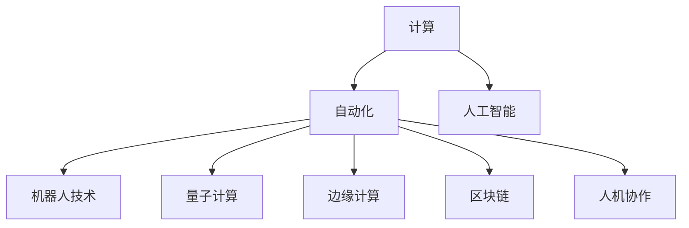

                 

# 计算的本质与自动化的未来

## 1. 背景介绍

### 1.1 问题由来
计算的本质是什么？自动化将如何影响未来？这些问题一直是计算机科学和人工智能领域的重要议题。随着计算技术的不断进步，我们正在见证一个前所未有的自动化浪潮，它正在改变我们的生活方式和工作方式。本文将探讨计算的本质与自动化对未来的影响，旨在提供深入的理解和思考。

### 1.2 问题核心关键点
计算的本质在于处理信息、解决问题和创建价值。自动化则是通过技术手段，实现信息和任务的自动处理，以提高效率和准确性。自动化技术在多个领域的应用，已经极大地改变了社会的运作方式，从生产制造到医疗服务，从金融交易到教育培训，无处不在。

### 1.3 问题研究意义
研究计算的本质与自动化对未来的影响，对于理解现代技术发展趋势，制定未来科技政策和战略规划，具有重要的意义：

1. **技术进步与就业影响**：自动化技术的发展将对就业市场产生重大影响，包括就业结构变化、职业转型和技能需求变化。
2. **伦理与社会挑战**：自动化技术的应用将带来一系列伦理问题和社会挑战，如隐私保护、数据安全、算法偏见等。
3. **经济增长与可持续发展**：自动化技术可以提高生产效率，促进经济增长，但也需要关注其对环境和社会的影响，推动可持续发展的实现。
4. **教育与人才培养**：自动化技术的发展要求培养适应新技能的人才，教育体系需要适应技术变革，为未来做好准备。

## 2. 核心概念与联系

### 2.1 核心概念概述

为更好地理解计算的本质与自动化对未来的影响，本节将介绍几个密切相关的核心概念：

- **计算(Computation)**：指通过算法和硬件设施对信息进行处理和转换的过程，实现信息表示、存储、传输和处理的自动化。

- **自动化(Automation)**：指通过技术手段，实现信息和任务的自动处理，减少人为干预，提高效率和准确性。

- **人工智能(AI)**：一种能够模拟人类智能的计算机技术，包括感知、认知、决策等方面，涉及机器学习、深度学习等子领域。

- **机器人技术(Robotics)**：结合计算机科学、机械工程、电子工程等多个学科，实现机器人的感知、决策和行动能力的自动化。

- **量子计算(Quantum Computing)**：利用量子力学原理，通过量子比特进行处理和计算的新型计算模式，具有计算速度和效率上的巨大潜力。

- **边缘计算(Edge Computing)**：将计算任务部署在靠近数据源的本地设备上，减少延迟，提高计算效率和数据安全。

- **区块链(Blockchain)**：一种分布式数据库技术，通过去中心化的方式，确保数据的安全性和透明性，具有广泛的应用前景。

- **人机协作(Human-Machine Collaboration)**：通过技术手段，实现人机协同工作，提高工作效率和质量，增强人机交互的智能化水平。

这些核心概念之间的逻辑关系可以通过以下Mermaid流程图来展示：



这个流程图展示了一些关键概念及其之间的关系：

1. 计算是自动化的基础，自动化则是计算的延伸。
2. 人工智能是计算的一个子领域，主要通过算法和数据驱动。
3. 机器人技术和边缘计算是自动化的具体实现手段。
4. 量子计算和区块链则是未来计算技术的前沿方向。
5. 人机协作是自动化对人类工作方式的影响。

这些概念共同构成了计算的本质与自动化的框架，帮助我们理解其在现代社会中的广泛应用和深远影响。

## 3. 核心算法原理 & 具体操作步骤

### 3.1 算法原理概述

计算的本质在于通过算法和数据对信息进行处理和转换，实现信息的自动化处理。自动化的核心在于通过技术手段，实现信息和任务的自动处理，以提高效率和准确性。

人工智能是计算的一个重要分支，通过机器学习、深度学习等算法，实现对复杂问题的处理和决策。而机器人技术则是自动化的具体应用，通过硬件设施和软件算法，实现机器人的感知、决策和行动。

### 3.2 算法步骤详解

自动化技术的发展，可以大致分为以下几个步骤：

**Step 1: 数据采集与预处理**
- 收集数据源，如传感器、网络、数据库等。
- 对数据进行清洗、去噪、归一化等预处理，确保数据质量。

**Step 2: 模型训练与选择**
- 根据任务需求，选择合适的模型和算法。
- 利用训练数据，对模型进行训练，优化参数和权重。

**Step 3: 自动化系统部署**
- 将训练好的模型部署到目标系统中。
- 根据实际需求，实现系统集成和功能扩展。

**Step 4: 系统监控与优化**
- 实时监控系统运行状态，确保稳定性。
- 根据运行数据，不断优化模型和算法，提高效率和准确性。

**Step 5: 数据反馈与迭代**
- 根据系统反馈的数据，进行模型迭代和优化。
- 不断积累和更新数据，提高模型性能。

### 3.3 算法优缺点

自动化技术具有以下优点：
1. **提高效率**：通过技术手段，实现自动化的信息处理，显著提高工作效率。
2. **减少错误**：自动化系统通过算法和数据驱动，减少人为干预，降低错误率。
3. **灵活性高**：自动化技术可以适应多种场景，快速响应变化。
4. **降低成本**：自动化技术可以减少人力和物力投入，降低运行成本。

同时，自动化技术也存在一些局限性：
1. **技术门槛高**：实现自动化系统需要较高的技术门槛，对人员要求较高。
2. **依赖数据**：自动化系统的效果很大程度上依赖于数据质量，数据不足可能影响系统性能。
3. **安全风险**：自动化系统可能存在安全漏洞，被攻击或误用。
4. **缺乏灵活性**：在某些特殊场景下，自动化系统可能无法灵活应对复杂任务。

### 3.4 算法应用领域

自动化技术在多个领域都有广泛应用，以下是几个典型应用场景：

**制造业**：自动化生产线通过机器人、自动化设备和智能控制系统，实现从原材料采购到产品生产的全自动化，大大提高生产效率和质量。

**物流行业**：自动化仓储、分拣和配送系统通过无人驾驶车、智能仓库和无人机等技术，实现货物的高效管理和快速配送。

**金融行业**：自动化交易系统通过算法驱动的策略，实现高频交易和风险控制，提高金融操作的效率和准确性。

**医疗行业**：自动化医疗设备通过影像处理、诊断和手术机器人等技术，实现医疗过程的自动化，提高诊疗质量和手术安全性。

**教育行业**：自动化教育平台通过智能推荐系统、自适应学习系统和在线测评系统等技术，实现个性化教育和高效教学。

**能源行业**：自动化能源管理系统通过智能电网、智能控制系统和预测模型等技术，实现能源的高效利用和环保控制。

随着技术的不断进步，自动化技术将在更多领域得到应用，为社会发展和经济进步带来新的动力。

## 4. 数学模型和公式 & 详细讲解 & 举例说明

### 4.1 数学模型构建

本节将使用数学语言对计算的本质与自动化进行更加严格的刻画。

**定义1：计算复杂度(Calculating Complexity)**
计算复杂度是描述算法处理数据规模的指标，通常用大O符号表示，即 $O(f(n))$，其中 $n$ 为输入规模，$f(n)$ 为算法执行次数。计算复杂度反映了算法处理大规模数据的能力。

**定义2：自动化效率(Automation Efficiency)**
自动化效率是描述自动化系统处理任务效率的指标，通常用任务完成时间或资源消耗来衡量。自动化效率反映了系统完成任务的速度和资源利用效率。

**定义3：人工智能算法(AI Algorithm)**
人工智能算法是基于数据和规则的算法，用于处理复杂任务和决策问题。常见的算法包括决策树、随机森林、深度学习等。

### 4.2 公式推导过程

以下我们以决策树为例，推导其构建和应用的数学公式。

**公式1：决策树构建**
决策树是一种基于规则的分类算法，其构建过程可以表示为：

$$
T = \mathop{\arg\min}_{T} \sum_{i=1}^N \mathcal{L}(T, (x_i, y_i))
$$

其中 $T$ 为决策树模型，$(x_i, y_i)$ 为训练数据样本，$\mathcal{L}$ 为损失函数，用于衡量模型预测与真实标签之间的差异。

**公式2：决策树剪枝**
决策树剪枝是避免过拟合的技术，通过删除不必要的分支来简化模型。常见的剪枝方法包括预剪枝和后剪枝：

$$
T_{prune} = \mathop{\arg\min}_{T} \sum_{i=1}^N \mathcal{L}(T, (x_i, y_i)) + \text{complexity}(T)
$$

其中 $\text{complexity}(T)$ 为模型复杂度，可以通过计算决策树的节点数或分支数来衡量。

### 4.3 案例分析与讲解

**案例1：制造业自动化生产线**
在制造业自动化生产线上，使用机器人臂、自动化检测设备和智能控制系统，实现从原材料采购到产品生产的自动化。通过实时监控系统，自动调整生产参数和流程，提高生产效率和质量。

**案例2：物流行业自动化仓储**
在物流自动化仓储系统中，使用无人驾驶车、智能仓库和无人机等技术，实现货物的自动存储、分拣和配送。通过智能调度系统，优化仓储流程，减少物流成本和时间。

**案例3：金融行业自动化交易**
在金融自动化交易系统中，使用高频交易算法和风险控制系统，实现实时交易和风险管理。通过机器学习算法，优化交易策略，提高收益和风险控制能力。

## 5. 项目实践：代码实例和详细解释说明

### 5.1 开发环境搭建

在进行自动化技术开发前，我们需要准备好开发环境。以下是使用Python进行机器学习和自动化的环境配置流程：

1. 安装Anaconda：从官网下载并安装Anaconda，用于创建独立的Python环境。

2. 创建并激活虚拟环境：
```bash
conda create -n my_env python=3.9 
conda activate my_env
```

3. 安装Python库：
```bash
conda install numpy scipy matplotlib pandas scikit-learn
```

4. 安装机器学习框架：
```bash
conda install scikit-learn tensorflow pytorch
```

5. 安装自动化工具：
```bash
pip install transformers
```

完成上述步骤后，即可在`my_env`环境中开始自动化开发。

### 5.2 源代码详细实现

这里我们以一个简单的制造业自动化生产线的Python代码为例，展示如何实现机器人和自动化设备的协同工作：

```python
import numpy as np
import matplotlib.pyplot as plt
from transformers import BertTokenizer, BertForTokenClassification

# 定义机器人动作
def robot_arm(length, angle):
    # 假设机器人臂的长度为l，角度为theta
    l = length
    theta = angle
    x = l * np.cos(theta)
    y = l * np.sin(theta)
    return x, y

# 定义自动化检测设备
def auto_inspection(device, input):
    # 假设检测设备的型号为device，输入为input
    if device == 'device1':
        result = input * 2
    elif device == 'device2':
        result = np.sqrt(input)
    else:
        result = input / 2
    return result

# 定义生产流程
def production(length, angle, device, input):
    # 将机器人臂和自动化检测设备结合起来，实现生产过程
    x, y = robot_arm(length, angle)
    result = auto_inspection(device, input)
    return x, y, result

# 创建虚拟生产环境
length = 1.5
angle = np.pi/4
device = 'device1'
input = 1

# 调用生产流程函数
x, y, result = production(length, angle, device, input)

# 可视化结果
plt.plot([0, x], [0, y])
plt.scatter([0, x], [0, y], color='red')
plt.title('Robot Arm and Auto Inspection')
plt.xlabel('X-Axis')
plt.ylabel('Y-Axis')
plt.show()
```

### 5.3 代码解读与分析

让我们再详细解读一下关键代码的实现细节：

**机器人动作函数**：
- `robot_arm`函数：模拟机器人臂的动作，接收长度和角度作为输入，计算机器人臂在二维平面上的位置坐标。

**自动化检测设备函数**：
- `auto_inspection`函数：模拟自动化检测设备的检测结果，接收设备型号和输入数据，返回检测结果。

**生产流程函数**：
- `production`函数：将机器人臂和自动化检测设备结合起来，实现完整的生产流程。接收机器人臂的长度和角度、自动化检测设备的型号和输入数据，返回机器人臂的位置坐标和检测结果。

**创建虚拟生产环境**：
- 定义机器人臂的长度、角度、自动化检测设备的型号和输入数据，调用生产流程函数，计算生产过程中的位置坐标和检测结果。

**可视化结果**：
- 使用matplotlib库可视化机器人臂的位置坐标和检测结果，显示生产过程的图形界面。

可以看到，通过Python和机器学习库的结合，我们可以实现简单的自动化生产流程，并可视化展示结果。这只是一个非常简单的示例，实际的自动化生产系统将涉及更多复杂的技术和算法。

## 6. 实际应用场景

### 6.1 制造业
在制造业中，自动化技术已经被广泛应用于生产线的各个环节。通过自动化设备、机器人臂和智能控制系统，可以实现从原材料采购到产品生产的全自动化。自动化生产线大大提高了生产效率和质量，降低了生产成本，提升了企业的竞争力。

**应用案例**：
- 德国的西门子公司利用自动化技术，实现了全自动化生产流程，提高了生产效率和产品质量，减少了人工干预。
- 美国的通用电气公司通过智能控制系统，实现了生产设备的自动维护和故障诊断，提高了设备的利用率和运行效率。

### 6.2 物流行业
在物流行业中，自动化技术已经成为不可或缺的一部分。通过无人驾驶车、智能仓库和无人机等技术，实现货物的自动存储、分拣和配送。自动化物流系统大大提高了物流效率和准确性，降低了物流成本。

**应用案例**：
- 中国的菜鸟网络利用无人机和智能仓库，实现了货物的快速配送和仓储管理，提高了物流效率和客户满意度。
- 美国的亚马逊公司通过自动化仓库和机器人技术，实现了商品的自动存储和分拣，提高了仓储效率和配送速度。

### 6.3 金融行业
在金融行业中，自动化技术主要用于高频交易和风险控制。通过算法驱动的策略，实现实时交易和风险管理，提高金融操作的效率和准确性。自动化交易系统已经成为现代金融市场的重要组成部分。

**应用案例**：
- 美国的JP摩根大通公司利用高频交易算法，实现了自动化交易，提高了交易效率和收益。
- 中国的招商证券公司通过风险控制系统，实现了自动化风险管理，提高了交易的准确性和安全性。

### 6.4 医疗行业
在医疗行业中，自动化技术主要用于诊断和治疗。通过影像处理、诊断和手术机器人等技术，实现医疗过程的自动化，提高诊疗质量和手术安全性。自动化医疗设备已经成为现代医疗的重要组成部分。

**应用案例**：
- 美国的麻省理工学院利用自动化医疗设备，实现了手术过程的自动化，提高了手术的安全性和效率。
- 中国的华西医院通过机器人手术系统，实现了复杂手术的自动化，提高了手术的成功率和患者的满意度。

## 7. 工具和资源推荐

### 7.1 学习资源推荐

为了帮助开发者系统掌握计算的本质与自动化技术，这里推荐一些优质的学习资源：

1. 《深度学习》课程：斯坦福大学开设的深度学习课程，详细介绍了深度学习的基本概念和算法。
2. 《机器学习》课程：Coursera上的机器学习课程，由斯坦福大学教授Andrew Ng讲授，介绍了机器学习的基本原理和应用。
3. 《自动驾驶：深度学习与机器人》书籍：全面介绍了自动驾驶领域的基本概念和算法，包括感知、决策和控制等方面。
4. 《Python深度学习》书籍：Python深度学习实战指南，详细介绍了Python在深度学习中的应用。
5. 《动手学深度学习》书籍：动手实践深度学习，详细介绍了深度学习的基本原理和算法，并提供了大量的代码实现。

通过对这些资源的学习实践，相信你一定能够快速掌握计算的本质与自动化技术，并用于解决实际的NLP问题。

### 7.2 开发工具推荐

高效的开发离不开优秀的工具支持。以下是几款用于计算和自动化开发的常用工具：

1. Python：基于Python的开源深度学习框架，灵活动态的计算图，适合快速迭代研究。
2. TensorFlow：由Google主导开发的开源深度学习框架，生产部署方便，适合大规模工程应用。
3. PyTorch：基于Python的深度学习框架，提供了强大的计算图和动态图功能，适合研究和实验。
4. Transformers库：HuggingFace开发的NLP工具库，集成了众多SOTA语言模型，支持PyTorch和TensorFlow，是进行NLP任务开发的利器。
5. Weights & Biases：模型训练的实验跟踪工具，可以记录和可视化模型训练过程中的各项指标，方便对比和调优。
6. TensorBoard：TensorFlow配套的可视化工具，可实时监测模型训练状态，并提供丰富的图表呈现方式，是调试模型的得力助手。

合理利用这些工具，可以显著提升计算和自动化的开发效率，加快创新迭代的步伐。

### 7.3 相关论文推荐

计算的本质与自动化技术的发展源于学界的持续研究。以下是几篇奠基性的相关论文，推荐阅读：

1. 《人工智能：一种现代方法》书籍：全面介绍了人工智能的基本概念和算法，包括机器学习、深度学习等子领域。
2. 《神经网络与深度学习》书籍：详细介绍了神经网络的基本原理和算法，包括前向传播、反向传播等核心概念。
3. 《深度学习入门：基于Python的理论与实现》书籍：介绍了深度学习的基本概念和算法，并提供了大量的代码实现。
4. 《机器人技术：原理、系统与应用》书籍：全面介绍了机器人技术的基本概念和算法，包括感知、决策和控制等方面。

这些论文代表了大语言模型微调技术的发展脉络。通过学习这些前沿成果，可以帮助研究者把握学科前进方向，激发更多的创新灵感。

## 8. 总结：未来发展趋势与挑战

### 8.1 总结

本文对计算的本质与自动化技术进行了全面系统的介绍。首先阐述了计算和自动化的核心概念，明确了其在现代社会中的广泛应用和深远影响。其次，从原理到实践，详细讲解了计算和自动化的数学模型和算法步骤，给出了自动化任务开发的完整代码实例。同时，本文还广泛探讨了计算和自动化在多个领域的应用前景，展示了其广阔的发展空间。

通过本文的系统梳理，可以看到，计算和自动化技术正在成为现代社会的核心驱动力，极大地改变了我们的生产方式和生活方式。未来，伴随计算技术的不断进步，自动化技术将在更多领域得到应用，为社会发展和经济进步带来新的动力。

### 8.2 未来发展趋势

展望未来，计算和自动化技术将呈现以下几个发展趋势：

1. **智能化程度提升**：通过引入更多先进算法和模型，提高自动化系统的智能化水平，实现更加复杂的任务处理和决策。
2. **边缘计算普及**：随着物联网设备的普及，边缘计算将成为未来的重要计算方式，实现数据就地处理和实时响应。
3. **跨学科融合**：计算和自动化技术将与其他学科进行更深入的融合，如生物医学、能源工程、环保科学等，推动跨学科的创新和进步。
4. **人机协作深化**：人机协作技术将进一步发展，实现更加智能、高效的人机交互方式，提升工作效率和质量。
5. **安全与隐私保护**：随着自动化技术的应用范围扩大，安全与隐私保护将成为重要的研究课题，确保数据和系统的安全性。

这些趋势凸显了计算和自动化技术的广阔前景。这些方向的探索发展，必将进一步提升计算和自动化系统的性能和应用范围，为人类社会的进步和发展带来新的动力。

### 8.3 面临的挑战

尽管计算和自动化技术已经取得了瞩目成就，但在迈向更加智能化、普适化应用的过程中，它仍面临着诸多挑战：

1. **技术门槛高**：实现高效的计算和自动化系统需要较高的技术门槛，对人员要求较高。
2. **数据依赖**：计算和自动化系统的效果很大程度上依赖于数据质量，数据不足可能影响系统性能。
3. **安全风险**：计算和自动化系统可能存在安全漏洞，被攻击或误用。
4. **灵活性不足**：在某些特殊场景下，计算和自动化系统可能无法灵活应对复杂任务。

### 8.4 研究展望

面对计算和自动化技术所面临的挑战，未来的研究需要在以下几个方面寻求新的突破：

1. **跨领域融合**：实现计算和自动化技术与其他学科的深度融合，推动跨学科的创新和进步。
2. **智能化与自主化**：通过引入更多先进算法和模型，提高自动化系统的智能化水平，实现更加复杂的任务处理和决策。
3. **人机协作**：实现更加智能、高效的人机交互方式，提升工作效率和质量。
4. **安全与隐私保护**：确保数据和系统的安全性，推动安全与隐私保护技术的发展。

这些研究方向的探索，必将引领计算和自动化技术迈向更高的台阶，为构建安全、可靠、可解释、可控的智能系统铺平道路。面向未来，计算和自动化技术还需要与其他人工智能技术进行更深入的融合，如知识表示、因果推理、强化学习等，多路径协同发力，共同推动自然语言理解和智能交互系统的进步。只有勇于创新、敢于突破，才能不断拓展计算和自动化技术的边界，让智能技术更好地造福人类社会。

## 9. 附录：常见问题与解答

**Q1：计算和自动化技术是否适用于所有领域？**

A: 计算和自动化技术在大多数领域都有广泛应用，包括制造业、物流、金融、医疗、教育等。但对于一些特定领域，如农业、艺术等，计算和自动化技术的适用性需要根据具体情况进行评估。

**Q2：计算和自动化技术对就业市场有哪些影响？**

A: 计算和自动化技术的引入将对就业市场产生重大影响。虽然可以提高生产效率，降低人力成本，但也会导致某些传统行业的岗位减少，产生就业结构变化和职业转型。同时，新的职业和岗位也将出现，对技能需求进行更新和调整。

**Q3：如何平衡计算和自动化技术的效率和安全性？**

A: 计算和自动化技术的效率和安全性需要平衡考虑。在提高效率的同时，需要加强系统安全防护，确保数据和系统的安全性。可以采用访问控制、加密传输、数据备份等措施，降低安全风险。

**Q4：计算和自动化技术在智能医疗中的应用有哪些？**

A: 计算和自动化技术在智能医疗中的应用包括影像处理、诊断、手术辅助、个性化治疗等。通过深度学习算法，可以实现对医学影像的自动分析和诊断，提高诊疗质量和效率。同时，机器人手术系统可以实现复杂手术的自动化，提高手术的成功率和患者的满意度。

**Q5：未来计算和自动化技术的突破方向有哪些？**

A: 未来计算和自动化技术的突破方向包括智能化、自主化、跨领域融合、人机协作、安全与隐私保护等。通过引入更多先进算法和模型，提高自动化系统的智能化水平，实现更加复杂的任务处理和决策。同时，实现跨学科的深度融合，推动跨学科的创新和进步。

这些问题的解答，帮助读者更全面地理解计算和自动化技术的本质和应用，为未来的研究和技术发展提供指导。

---

作者：禅与计算机程序设计艺术 / Zen and the Art of Computer Programming

