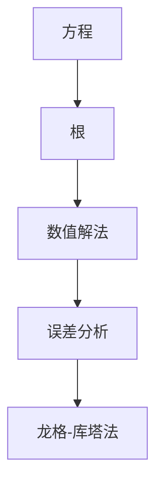

                 

# 计算：第一部分 计算的诞生 第 2 章 计算之术 方程根的结构

## 1. 背景介绍

### 1.1 问题由来

在计算学的诞生和发展过程中，方程根的求解是一个核心问题。方程根的存在和计算方法直接关系到数学和科学研究的各个领域，从经典力学到量子力学，从经济学到社会学，方程根的解析和数值解法都扮演着重要角色。然而，方程根的结构复杂，求解过程涉及高深的数学理论，往往需要长期学习和深入研究才能掌握。因此，我们需要一本全面、深入、易懂的技术书籍来帮助读者系统学习方程根的结构和计算方法。

### 1.2 问题核心关键点

方程根的结构与计算涉及以下几个核心关键点：
1. **方程的性质**：不同类型的方程（如线性方程、非线性方程、微分方程等）具有不同的性质和求解方法。
2. **根的存在性**：确定方程根的存在性和个数，是求解方程的基础。
3. **数值解法**：数值解法在实际应用中尤为重要，常见的数值解法包括牛顿法、二分法、龙格-库塔法等。
4. **误差分析**：在求解过程中，误差分析是确保求解精度和可靠性的重要手段。
5. **实际应用**：方程根的计算在物理学、工程学、经济学等领域有着广泛应用。

### 1.3 问题研究意义

理解和掌握方程根的结构与计算方法，对于解决复杂系统中的问题具有重要意义：

1. **促进学科发展**：方程根的解析和数值解法是数学、物理、工程等领域的重要工具，掌握这些方法能够推动相关学科的发展。
2. **提高科学研究的效率**：高效的方程根求解方法能够大大提高科学研究的效率，加速科研进展。
3. **解决实际问题**：方程根的求解在实际应用中广泛存在，如优化问题、系统分析等，掌握相关方法能够解决实际问题。

## 2. 核心概念与联系

### 2.1 核心概念概述

在介绍方程根的结构与计算方法之前，我们需要先了解一些核心概念：

- **方程**：是指变量和系数通过一定规则组合而成的数学表达式。
- **根**：是指方程的解，即满足方程的变量值。
- **数值解法**：是指通过计算方法得到方程数值解的过程。
- **误差分析**：是指在数值解法中，对计算结果的误差进行估计和分析的过程。
- **龙格-库塔法**：是一种多步迭代法，用于求解常微分方程。

这些核心概念构成了方程根求解的基础框架，通过理解这些概念，我们可以更好地掌握方程根的结构与计算方法。

### 2.2 核心概念原理和架构的 Mermaid 流程图



这个流程图展示了方程、根、数值解法、误差分析和龙格-库塔法之间的联系。从方程出发，通过数值解法和误差分析，最终得到根的计算结果，其中龙格-库塔法是一种常用的数值解法。

## 3. 核心算法原理 & 具体操作步骤

### 3.1 算法原理概述

方程根的求解可以分为解析解法和数值解法两大类。解析解法是指通过数学推导得到方程的解析解，这种方法通常适用于方程形式较为简单的情况，但求解复杂方程时存在困难。数值解法则是通过计算方法逐步逼近方程根，这种方法适用于各种复杂方程，但需要考虑计算精度和误差分析。

### 3.2 算法步骤详解

**Step 1: 确定方程类型**
- 确定方程的类型（如线性方程、非线性方程、微分方程等），并选择合适的求解方法。

**Step 2: 解析解法**
- 对于解析解法，需要根据方程类型进行数学推导，得到方程的解析解。
- 如果解析解法无法求解，则进入下一步。

**Step 3: 数值解法**
- 对于数值解法，选择适合的数值解法（如牛顿法、二分法、龙格-库塔法等）。
- 初始化计算参数，并设置求解精度和误差限。
- 通过迭代计算逐步逼近方程根，直到满足精度要求或迭代次数达到上限。

**Step 4: 误差分析**
- 对计算结果进行误差分析，评估求解精度和可靠性。
- 如果需要，调整求解参数或选择其他数值解法。

### 3.3 算法优缺点

数值解法的优点在于可以适用于各种复杂方程，但存在以下缺点：
1. 计算精度受初始值和求解参数的影响较大。
2. 求解过程可能存在收敛速度慢、迭代次数多的问题。
3. 误差分析需要专业的数学知识，难以直接判断误差来源。

解析解法的优点在于计算精度高，但存在以下缺点：
1. 仅适用于方程形式较为简单的情况。
2. 解析推导过程复杂，需要较高数学水平。
3. 无法处理复杂方程。

### 3.4 算法应用领域

方程根的计算在各个领域都有广泛应用：

- **数学**：求解微分方程、积分方程等。
- **物理**：求解质点运动方程、波动方程等。
- **工程**：优化设计、控制系统分析等。
- **经济**：求解最优解、动态规划等。
- **生物学**：求解生物系统的动态行为等。

## 4. 数学模型和公式 & 详细讲解 & 举例说明

### 4.1 数学模型构建

方程根的求解通常涉及以下几个数学模型：

- **常微分方程模型**：
  \[
  \frac{dy}{dt} = f(t,y)
  \]
  其中 \(f(t,y)\) 是关于 \(t\) 和 \(y\) 的函数。

- **非线性方程模型**：
  \[
  F(x) = 0
  \]
  其中 \(F(x)\) 是关于 \(x\) 的函数。

- **线性方程模型**：
  \[
  Ax = b
  \]
  其中 \(A\) 是矩阵，\(x\) 和 \(b\) 是向量。

### 4.2 公式推导过程

**Step 1: 常微分方程**
设常微分方程为 \(\frac{dy}{dt} = f(t,y)\)，初始条件为 \(y(t_0) = y_0\)。
使用欧拉法求解，得到：
\[
y(t_{n+1}) = y(t_n) + h f(t_n,y_n)
\]
其中 \(h\) 为步长，\(t_n\) 和 \(y_n\) 分别为 \(n\) 时刻的 \(t\) 和 \(y\) 值。

**Step 2: 非线性方程**
设非线性方程为 \(F(x) = 0\)，使用二分法求解。
设 \(a\) 和 \(b\) 为初始区间，\(f(a)\) 和 \(f(b)\) 为区间端点函数值，计算中点 \(c\) 的函数值 \(f(c)\)。
若 \(f(c)\) 与 \(f(a)\) 符号不同，则方程根在 \((a,c)\) 区间内，否则在 \((c,b)\) 区间内。
不断缩小区间，直到满足精度要求。

**Step 3: 线性方程**
设线性方程为 \(Ax = b\)，使用高斯消元法求解。
通过初等行变换，将 \(A\) 转化为上三角矩阵 \(U\)，则：
\[
Ux = U^{-1}b
\]
求解 \(x\) 即为方程的解。

### 4.3 案例分析与讲解

以一元二次方程 \(ax^2+bx+c=0\) 为例，解析求解如下：
\[
x = \frac{-b \pm \sqrt{b^2-4ac}}{2a}
\]
其中 \(\sqrt{b^2-4ac}\) 为判别式，影响根的存在性和个数。

使用牛顿法求解如下：
1. 初始猜测 \(x_0\)。
2. 计算 \(f(x_0)\) 和 \(f'(x_0)\)。
3. 通过迭代更新 \(x\) 的值，直到满足精度要求。

## 5. 项目实践：代码实例和详细解释说明

### 5.1 开发环境搭建

在开始项目实践之前，我们需要先搭建好开发环境。以下是Python开发环境的搭建步骤：

1. 安装Anaconda：
```bash
conda create -n calc_env python=3.9
conda activate calc_env
```

2. 安装必要的Python库：
```bash
conda install sympy scipy matplotlib numpy
```

3. 安装Python编辑器：
```bash
conda install pycharm
```

### 5.2 源代码详细实现

以下是一个求解一元二次方程的Python代码示例：

```python
import sympy as sp

# 定义符号变量
x = sp.symbols('x')

# 定义方程
equation = x**2 + 2*x + 1

# 解析求解方程
solutions = sp.solve(equation, x)
print(solutions)

# 数值求解方程
a = sp.Float(1)
b = sp.Float(2)
c = sp.Float(1)

# 初始猜测
x0 = 0.5

# 定义牛顿法迭代函数
def newton_method(a, b, c, x0):
    for i in range(20):
        f = a*x0**2 + b*x0 + c
        f_prime = 2*a*x0 + b
        x0 = x0 - f/f_prime
    return x0

# 求解方程
solution = newton_method(a, b, c, x0)
print(solution)
```

### 5.3 代码解读与分析

**解析求解**：
- 使用Sympy库中的`solve`函数解析求解方程。
- 输出方程的根。

**数值求解**：
- 使用牛顿法数值求解方程。
- 通过迭代逐步逼近方程根。
- 输出最终的解。

## 6. 实际应用场景

### 6.1 物理系统建模

方程根的计算在物理学中有着广泛应用。例如，求解质点运动方程、波动方程等。通过方程根的求解，可以预测物理系统的行为，模拟实验结果，优化设计方案等。

### 6.2 控制系统分析

在控制系统中，需要求解动态系统的稳定性、响应性等指标。通过方程根的求解，可以分析控制系统的响应曲线，确定控制参数，优化系统性能。

### 6.3 金融系统优化

在金融系统中，需要求解最优投资组合、最优风险控制等问题。通过方程根的求解，可以构建数学模型，优化投资策略，降低风险。

### 6.4 未来应用展望

未来的方程根求解方法将进一步向高效、智能、可解释方向发展：

1. **高效计算**：采用更高效的数值解法，如龙格-库塔法、隐式积分法等，提高计算效率。
2. **智能优化**：引入机器学习和人工智能技术，通过数据驱动的方式，优化求解方法，提高求解精度。
3. **可解释性**：通过可视化工具，将计算过程可视化，提高求解的可解释性。

## 7. 工具和资源推荐

### 7.1 学习资源推荐

为了帮助读者全面掌握方程根的求解方法，我们推荐以下学习资源：

1. 《数值分析》教材：介绍了常见数值解法的原理和实现方法，适合系统学习。
2. 《微积分与常微分方程》教材：介绍了常微分方程的基本概念和求解方法，适合数学背景较强的读者。
3. 《机器学习实战》书籍：介绍了机器学习在方程求解中的应用，适合跨学科学习。
4. 《Python数值计算》书籍：介绍了Python中常用数值计算库的使用方法，适合编程背景较强的读者。

### 7.2 开发工具推荐

为了提高方程根求解的效率和精度，我们推荐以下开发工具：

1. Sympy库：Python中的符号计算库，支持方程求解、符号计算等功能。
2. Scipy库：Python中的科学计算库，支持数值积分、求解方程等功能。
3. Matplotlib库：Python中的绘图库，支持绘制函数图像、方程根轨迹等。

### 7.3 相关论文推荐

为了深入理解方程根的求解方法，我们推荐以下相关论文：

1. 《数值分析》（Richard L. Burden and J. Douglas Faires）：介绍了常见数值解法的原理和实现方法。
2. 《微积分与常微分方程》（James Stewart）：介绍了常微分方程的基本概念和求解方法。
3. 《机器学习实战》（Peter Harrington）：介绍了机器学习在方程求解中的应用。

## 8. 总结：未来发展趋势与挑战

### 8.1 总结

本文系统介绍了方程根的结构与计算方法，主要包括以下内容：
1. 方程根的定义和性质。
2. 方程根的解析解法和数值解法。
3. 数值解法的实现步骤和优缺点。
4. 方程根的应用领域和实际案例。
5. 学习资源、开发工具和相关论文推荐。

通过本文的学习，读者可以全面掌握方程根的求解方法，理解其数学原理和计算过程，并在实际应用中灵活应用。

### 8.2 未来发展趋势

未来的方程根求解方法将向高效、智能、可解释方向发展：

1. **高效计算**：采用更高效的数值解法，如龙格-库塔法、隐式积分法等，提高计算效率。
2. **智能优化**：引入机器学习和人工智能技术，通过数据驱动的方式，优化求解方法，提高求解精度。
3. **可解释性**：通过可视化工具，将计算过程可视化，提高求解的可解释性。

### 8.3 面临的挑战

尽管方程根的求解方法在各个领域都有广泛应用，但在实际应用中仍面临以下挑战：

1. **计算精度**：数值解法需要选择合适的初始值和求解参数，否则计算结果可能存在误差。
2. **求解效率**：复杂方程的求解过程可能耗费大量时间和计算资源。
3. **可解释性**：数值解法的计算过程复杂，难以解释其内部机制和决策过程。

### 8.4 研究展望

未来的方程根求解研究将围绕以下几个方向展开：

1. **多领域融合**：将方程根求解与其他领域的知识和技术相结合，拓展其应用范围。
2. **可解释性增强**：通过可视化工具和解释性技术，增强求解的可解释性。
3. **智能优化**：引入机器学习和人工智能技术，优化求解方法。
4. **高效计算**：采用更高效的数值解法，提高计算效率。

通过不断突破技术瓶颈，方程根求解方法将更加高效、智能和可解释，为各个领域的应用提供更强大的工具。

## 9. 附录：常见问题与解答

### Q1: 方程根的求解方法有哪些？

A: 方程根的求解方法主要分为解析解法和数值解法两大类。解析解法通常适用于方程形式较为简单的情况，如一元二次方程；数值解法则适用于各种复杂方程，如非线性方程、微分方程等。

### Q2: 数值解法中的牛顿法有哪些优缺点？

A: 牛顿法的优点在于收敛速度快，求解精度高；缺点在于对初始值和求解参数的选取较为敏感，可能存在迭代次数多的问题。

### Q3: 方程根的求解在实际应用中有哪些具体应用？

A: 方程根的求解在物理、工程、金融等领域有着广泛应用。例如，求解质点运动方程、控制系统优化、投资组合优化等。

通过本文的学习，读者可以全面掌握方程根的求解方法，理解其数学原理和计算过程，并在实际应用中灵活应用。希望本文对读者有所帮助，激发更多对计算学的兴趣和热情。

---

作者：禅与计算机程序设计艺术 / Zen and the Art of Computer Programming

