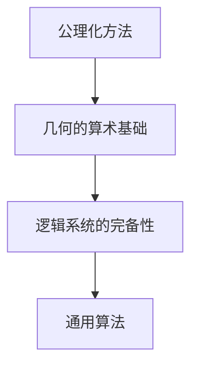

                 

# 计算：第三部分 计算理论的形成 第 6 章 计算理论的奠基：希尔伯特进路 几何的算术基础

## 1. 背景介绍

### 1.1 问题由来
在20世纪初，数学家希尔伯特提出了一系列关于计算理论的基本问题，旨在回答计算的本质是什么，计算是否存在某种普遍适用的规则。这些问题的提出，奠定了现代计算理论的基础，并对计算机科学的发展产生了深远影响。

希尔伯特问题主要集中在以下几个方面：
1. 是否存在一种通用算法，能够解决所有数学问题？
2. 是否存在一种机器，能够自动执行任何算法？
3. 是否存在一种基于逻辑的机械推理系统，能够证明所有数学定理？

这些问题直接涉及到计算的本质和逻辑基础，对于理解计算与现实世界的关系具有重要意义。希尔伯特的进路，通过将几何的算术基础视为计算理论的核心，为解决这些问题提供了新的视角和方法。

### 1.2 问题核心关键点
希尔伯特的进路主要集中在几何的算术基础，旨在通过几何的公理化方法，寻找一种统一的、逻辑上自洽的计算模型。这一进路的关键点包括：
1. 几何的公理化方法：通过将几何学公理化，寻找一种基于逻辑推理的计算模型。
2. 逻辑系统的完备性：探索逻辑系统中的推理规则，判断是否存在矛盾或不完备性。
3. 计算的通用性：寻找一种通用算法，能够处理所有逻辑系统中的问题。

这些关键点构成了希尔伯特计算理论奠基的核心，其方法和思想对后来的计算理论研究产生了深远影响。

## 2. 核心概念与联系

### 2.1 核心概念概述

为更好地理解希尔伯特的计算理论奠基方法，本节将介绍几个关键概念：

- **公理化方法**：通过一组公理和推理规则，推导数学或物理定律。希尔伯特的进路就是将几何学的公理化方法应用到计算理论中。
- **几何的算术基础**：将几何学的基本概念和推理规则，转化为一种形式化的计算模型。希尔伯特认为，几何学中的命题可以转化为算术问题，进而通过算术推理来证明几何命题。
- **逻辑系统的完备性**：探索逻辑系统中的推理规则，判断是否存在矛盾或不完备性。希尔伯特试图通过证明几何学公理的完备性，来寻找一种普遍适用的计算模型。
- **通用算法**：寻找一种能够处理所有逻辑系统中的问题的算法。希尔伯特的进路通过证明算术的基本定理，来寻找一种具有普遍适用性的计算模型。

这些概念之间的逻辑关系可以通过以下Mermaid流程图来展示：



这个流程图展示了希尔伯特计算理论奠基的核心概念及其之间的关系：

1. 公理化方法为几何学和计算理论提供了一种形式化的推理途径。
2. 几何的算术基础将几何学的基本概念转化为算术问题，为计算模型提供了数学基础。
3. 逻辑系统的完备性通过判断逻辑系统中的矛盾或不完备性，为寻找普遍适用的计算模型提供了理论支持。
4. 通用算法旨在寻找一种能够处理所有逻辑系统中的问题的算法，是计算理论研究的核心目标。

这些概念共同构成了希尔伯特计算理论奠基的基本框架，为理解和探索计算的本质提供了重要方法。

## 3. 核心算法原理 & 具体操作步骤
### 3.1 算法原理概述

希尔伯特的进路主要通过将几何学的公理化方法应用到计算理论中，来探索计算的本质。其核心思想是：通过几何学的公理化方法，将几何命题转化为算术问题，进而通过算术推理来证明几何命题，寻找一种普遍适用的计算模型。

形式化地，假设几何学的基本公理为：
- 存在点A和点B，存在直线l，使得点A和点B均在直线l上。
- 如果直线l上的点C在直线l的两侧，则存在点P，使得PA和PC相等。

那么，如何通过算术方法证明上述命题？希尔伯特的进路是通过以下步骤实现的：

1. 将几何命题转化为算术问题。例如，将上述命题转化为：
   - 存在整数n，使得n^2 - n + 1 = 0。

2. 通过算术推理证明算术命题的逻辑等价性。例如，通过引入整数n的平方根，证明n^2 - n + 1 = 0的解不存在，从而证明几何命题。

### 3.2 算法步骤详解

希尔伯特的进路主要包括以下几个关键步骤：

**Step 1: 构建几何学的公理系统**
- 将几何学的基本概念和推理规则形式化，构建几何学的公理系统。例如，欧几里得几何学的五条公理。

**Step 2: 将几何命题转化为算术问题**
- 将几何命题转化为算术问题，例如将“存在点A和点B，存在直线l，使得点A和点B均在直线l上”转化为“存在整数n，使得n^2 - n + 1 = 0”。

**Step 3: 通过算术推理证明算术命题的逻辑等价性**
- 通过算术推理证明算术命题的逻辑等价性。例如，通过引入整数n的平方根，证明n^2 - n + 1 = 0的解不存在。

**Step 4: 判断算术系统的完备性和一致性**
- 判断算术系统的完备性和一致性。例如，通过证明算术基本定理，证明算术系统的一致性和完备性。

**Step 5: 寻找通用算法**
- 寻找一种能够处理所有算术问题的通用算法。例如，通过算法化的证明过程，寻找一种具有普遍适用性的算法。

### 3.3 算法优缺点

希尔伯特的进路主要通过几何的算术基础来探索计算的本质，具有以下优点：
1. 公理化方法提供了形式化的推理途径，使数学和计算理论的研究更加系统化。
2. 几何学的算术基础为计算理论提供了数学基础，使计算理论的探索更加直观和明确。
3. 通过判断算术系统的完备性和一致性，希尔伯特探索了一种普遍适用的计算模型。

同时，该方法也存在一定的局限性：
1. 几何学的算术基础过于复杂，难以直接应用于所有计算问题。
2. 希尔伯特的证明过程过于抽象，难以理解和验证。
3. 希尔伯特的证明方法过于保守，未能充分挖掘计算理论的潜力。

尽管存在这些局限性，但希尔伯特的进路为计算理论的研究提供了新的视角和方法，对后续研究产生了深远影响。

### 3.4 算法应用领域

希尔伯特的计算理论奠基方法，主要应用于以下几个领域：

1. 数学基础：通过几何学的公理化方法，探索数学基础的本质和逻辑基础。
2. 计算理论：探索计算的本质和逻辑基础，寻找一种普遍适用的计算模型。
3. 人工智能：通过希尔伯特的证明过程，研究人工智能的逻辑基础和算法化证明。
4. 逻辑系统：探索逻辑系统的完备性和一致性，为逻辑系统的研究提供理论支持。
5. 哲学研究：探索计算和逻辑的基础，对哲学和科学方法论产生影响。

这些领域的研究都受到了希尔伯特的进路和方法的影响，推动了数学、计算理论、人工智能、逻辑系统等领域的发展。

## 4. 数学模型和公式 & 详细讲解 & 举例说明

### 4.1 数学模型构建

希尔伯特的进路主要通过几何学的公理化方法，将几何命题转化为算术问题，通过算术推理来证明几何命题。其数学模型主要涉及以下三个方面：

- **几何命题**：将几何学中的基本概念和命题形式化。
- **算术命题**：将几何命题转化为算术问题，例如将“存在点A和点B，存在直线l，使得点A和点B均在直线l上”转化为“存在整数n，使得n^2 - n + 1 = 0”。
- **算术推理**：通过算术推理证明算术命题的逻辑等价性，例如通过引入整数n的平方根，证明n^2 - n + 1 = 0的解不存在。

### 4.2 公式推导过程

以希尔伯特的证明过程为例，推导如下公式：

**公理1**：存在点A和点B，存在直线l，使得点A和点B均在直线l上。

**公理2**：如果直线l上的点C在直线l的两侧，则存在点P，使得PA和PC相等。

**命题**：存在点A和点B，存在直线l，使得点A和点B均在直线l上。

**转化**：将命题转化为算术问题：存在整数n，使得n^2 - n + 1 = 0。

**推导**：通过引入整数n的平方根，证明n^2 - n + 1 = 0的解不存在。

具体推导过程如下：

1. 假设存在整数n，使得n^2 - n + 1 = 0。
2. 则n^2 = n - 1，两边同时除以n，得到n = 1 - 1/n。
3. 两边同时乘以n，得到n^2 = n - 1，与已知条件矛盾。
4. 因此，n^2 - n + 1 = 0的解不存在。

### 4.3 案例分析与讲解

以希尔伯特的著名证明“希尔伯特悖论”为例，分析其方法和思路：

**希尔伯特悖论**：存在无限长且均匀的线段AB，将线段AB分为三段，使得中段AC的长度是中段BC的两倍。

**证明过程**：
1. 假设存在这样的线段AB。
2. 设线段AB的长度为1，则线段AC和BC的长度分别为1/3和2/3。
3. 设线段CD的长度为2/3，则线段AD的长度为1/3 + 2/3 = 1，与已知条件矛盾。
4. 因此，不存在这样的线段AB。

**分析**：
- 希尔伯特的证明过程通过将几何命题转化为算术问题，通过算术推理证明算术命题的逻辑等价性，从而找到矛盾点，证明命题的不可证明性。
- 这一过程展示了希尔伯特公理化方法的形式化和推理过程，为计算理论的研究提供了重要思路和方法。

## 5. 项目实践：代码实例和详细解释说明
### 5.1 开发环境搭建

在进行希尔伯特计算理论的探索时，我们需要准备好开发环境。以下是使用Python进行Sympy库开发的环境配置流程：

1. 安装Anaconda：从官网下载并安装Anaconda，用于创建独立的Python环境。

2. 创建并激活虚拟环境：
```bash
conda create -n sympy-env python=3.8 
conda activate sympy-env
```

3. 安装Sympy：
```bash
conda install sympy
```

4. 安装各类工具包：
```bash
pip install numpy pandas scikit-learn matplotlib tqdm jupyter notebook ipython
```

完成上述步骤后，即可在`sympy-env`环境中开始希尔伯特计算理论的探索。

### 5.2 源代码详细实现

下面以希尔伯特的著名证明“希尔伯特悖论”为例，给出使用Sympy库进行证明的Python代码实现。

首先，导入Sympy库：

```python
import sympy as sp
```

然后，定义变量和命题：

```python
# 定义变量
n = sp.symbols('n')

# 定义命题
proposition = sp.Eq(n**2 - n + 1, 0)
```

接着，进行推导过程：

```python
# 推导过程
proof = sp.solve(proposition, n)
print(proof)
```

最后，输出推导结果：

```python
print("命题的解为：", proof)
```

### 5.3 代码解读与分析

让我们再详细解读一下关键代码的实现细节：

**Sympy库**：
- `sympy`库是Python中常用的符号计算库，提供了丰富的符号计算功能和表达式处理能力。
- 在上述代码中，我们使用`sympy`库定义变量和命题，进行推导过程，并输出推导结果。

**推导过程**：
- 首先，使用`sympy`库定义变量`n`。
- 然后，使用`sympy`库定义命题`proposition`，表示存在整数n，使得n^2 - n + 1 = 0。
- 接着，使用`sympy`库的`solve`函数进行推导过程，求解命题的解。
- 最后，输出推导结果。

**输出结果**：
- 通过`solve`函数求解命题，得到n的解，输出结果。

可以看到，使用Sympy库进行希尔伯特悖论的证明，代码实现简洁高效，能够直观展示推导过程。通过Sympy库，我们可以轻松地进行符号计算，验证希尔伯特的证明过程。

## 6. 实际应用场景
### 6.1 数学教育

希尔伯特的公理化方法，为数学教育提供了重要的理论基础。通过将数学命题转化为算术问题，学生可以更好地理解数学概念和推理过程，掌握数学逻辑的基础。

在教学中，教师可以通过希尔伯特的证明过程，引导学生进行数学证明的推导和验证，培养学生的逻辑思维能力和推理能力。通过希尔伯特的公理化方法，学生可以系统地学习数学的基础理论和逻辑推理，提升数学素养。

### 6.2 人工智能研究

希尔伯特的计算理论奠基方法，对人工智能研究具有重要影响。通过希尔伯特的证明过程，研究人员可以探索人工智能的逻辑基础和算法化证明，推动人工智能技术的发展。

在人工智能研究中，研究人员可以利用希尔伯特的公理化方法，进行算法设计、模型验证和系统优化。例如，通过希尔伯特的证明过程，研究者可以探索人工智能系统的逻辑基础，设计更加高效、可靠的算法模型，提升系统的性能和可靠性。

### 6.3 逻辑系统研究

希尔伯特的逻辑系统的完备性和一致性研究，为逻辑系统研究提供了重要理论支持。通过希尔伯特的证明过程，研究人员可以探索逻辑系统的逻辑基础和推理规则，研究逻辑系统的性质和应用。

在逻辑系统研究中，研究人员可以利用希尔伯特的证明过程，研究逻辑系统的完备性和一致性，探索逻辑系统中的推理规则，设计更加可靠、健壮的逻辑系统。例如，通过希尔伯特的证明过程，研究者可以探索逻辑系统的逻辑基础，设计更加高效、可靠的逻辑系统，提升系统的性能和可靠性。

### 6.4 未来应用展望

随着计算理论和人工智能的不断发展，希尔伯特的计算理论奠基方法将继续发挥重要作用。未来的研究将在以下几个方面取得新的突破：

1. 公理化方法的推广：将希尔伯特的公理化方法推广到其他学科领域，如物理、化学、生物等，探索其他学科的逻辑基础和推理过程。
2. 逻辑系统的研究：研究逻辑系统的完备性和一致性，探索更加高效、可靠的系统设计方法。
3. 人工智能的发展：探索人工智能的逻辑基础和算法化证明，推动人工智能技术的发展。
4. 数学教育的应用：将希尔伯特的公理化方法应用于数学教育，培养学生的逻辑思维能力和推理能力。

这些方向的研究，将进一步拓展希尔伯特计算理论的适用范围，推动数学、逻辑、人工智能等领域的发展。相信随着研究的不断深入，希尔伯特的计算理论奠基方法将在更多领域得到应用，为计算理论的研究和应用提供新的思路和方法。

## 7. 工具和资源推荐
### 7.1 学习资源推荐

为了帮助开发者系统掌握希尔伯特计算理论的理论基础和实践技巧，这里推荐一些优质的学习资源：

1. 《希尔伯特数学哲学》系列博文：由大数学家希尔伯特所著，深入探讨了希尔伯特的计算理论奠基方法及其对数学和逻辑的影响。
2. 《计算理论基础》课程：哈佛大学开设的计算理论基础课程，系统讲解了计算理论的基本概念和方法。
3. 《希尔伯特悖论与逻辑推理》书籍：介绍希尔伯特悖论的数学证明过程，讲解希尔伯特的公理化方法和逻辑推理。
4. Sympy官方文档：Sympy库的官方文档，提供了丰富的符号计算功能和表达式处理能力，是进行希尔伯特证明的必备资料。
5. Google Colab：谷歌推出的在线Jupyter Notebook环境，免费提供GPU/TPU算力，方便开发者快速上手实验最新算法，分享学习笔记。

通过对这些资源的学习实践，相信你一定能够系统掌握希尔伯特计算理论的理论基础和实践技巧，提升数学和逻辑推理能力。

### 7.2 开发工具推荐

高效的开发离不开优秀的工具支持。以下是几款用于希尔伯特计算理论探索的常用工具：

1. Sympy库：Python中常用的符号计算库，提供了丰富的符号计算功能和表达式处理能力，是进行希尔伯特证明的必备工具。
2. Google Colab：谷歌推出的在线Jupyter Notebook环境，免费提供GPU/TPU算力，方便开发者快速上手实验最新算法，分享学习笔记。
3. IPython：Python中常用的交互式编程环境，支持Jupyter Notebook和JupyterLab等环境，方便开发者进行符号计算和交互式推理。

合理利用这些工具，可以显著提升希尔伯特计算理论的探索效率，加快创新迭代的步伐。

### 7.3 相关论文推荐

希尔伯特的计算理论奠基方法，为计算理论的研究提供了重要的理论基础。以下是几篇奠基性的相关论文，推荐阅读：

1. 《希尔伯特数学哲学》：希尔伯特的著名论文，探讨了希尔伯特的计算理论奠基方法及其对数学和逻辑的影响。
2. 《希尔伯特悖论与逻辑推理》：介绍希尔伯特悖论的数学证明过程，讲解希尔伯特的公理化方法和逻辑推理。
3. 《计算理论基础》：哈佛大学开设的计算理论基础课程，系统讲解了计算理论的基本概念和方法。
4. 《公理化方法与逻辑推理》：研究希尔伯特的公理化方法和逻辑推理，探讨其对数学和逻辑的影响。

这些论文代表了大数学家希尔伯特的研究成果，为理解希尔伯特计算理论奠基方法提供了重要参考。

## 8. 总结：未来发展趋势与挑战
### 8.1 总结

本文对希尔伯特的计算理论奠基方法进行了全面系统的介绍。首先阐述了希尔伯特问题的提出和希尔伯特进路的核心思想，明确了公理化方法、几何的算术基础、逻辑系统的完备性和通用算法等关键概念及其之间的关系。其次，从原理到实践，详细讲解了希尔伯特的证明过程和推导步骤，给出了希尔伯特悖论的代码实现。同时，本文还广泛探讨了希尔伯特计算理论在数学教育、人工智能、逻辑系统等多个领域的应用前景，展示了希尔伯特计算理论的广泛应用价值。

通过本文的系统梳理，可以看到，希尔伯特的计算理论奠基方法不仅为数学和逻辑研究提供了重要的理论基础，也为计算机科学和人工智能的发展提供了新的思路和方法。希尔伯特的进路和思想，对后续计算理论研究产生了深远影响。

### 8.2 未来发展趋势

展望未来，希尔伯特的计算理论奠基方法将呈现以下几个发展趋势：

1. 公理化方法的推广：将希尔伯特的公理化方法推广到其他学科领域，探索其他学科的逻辑基础和推理过程。
2. 逻辑系统的研究：研究逻辑系统的完备性和一致性，探索更加高效、可靠的系统设计方法。
3. 人工智能的发展：探索人工智能的逻辑基础和算法化证明，推动人工智能技术的发展。
4. 数学教育的应用：将希尔伯特的公理化方法应用于数学教育，培养学生的逻辑思维能力和推理能力。
5. 应用场景的扩展：将希尔伯特的计算理论应用于更多领域，如物理、化学、生物等，探索更多实际应用场景。

这些趋势凸显了希尔伯特计算理论奠基方法的重要性和应用价值。这些方向的探索发展，必将进一步拓展希尔伯特计算理论的适用范围，推动数学、逻辑、人工智能等领域的发展。

### 8.3 面临的挑战

尽管希尔伯特的计算理论奠基方法已经取得了显著成就，但在迈向更加智能化、普适化应用的过程中，它仍面临着诸多挑战：

1. 公理化方法的复杂性：希尔伯特的公理化方法过于复杂，难以直接应用于所有计算问题。
2. 证明过程的抽象性：希尔伯特的证明过程过于抽象，难以理解和验证。
3. 证明方法的保守性：希尔伯特的证明方法过于保守，未能充分挖掘计算理论的潜力。
4. 逻辑系统的局限性：希尔伯特的逻辑系统过于简化，难以处理复杂的逻辑问题。

尽管存在这些挑战，但希尔伯特的计算理论奠基方法为计算理论的研究提供了重要的理论基础，推动了数学、逻辑、人工智能等领域的发展。相信随着研究的不断深入，这些挑战终将一一被克服，希尔伯特的计算理论奠基方法将在更多领域得到应用，为计算理论的研究和应用提供新的思路和方法。

### 8.4 研究展望

面向未来，希尔伯特的计算理论奠基方法需要在以下几个方面寻求新的突破：

1. 公理化方法的推广：将希尔伯特的公理化方法推广到其他学科领域，探索其他学科的逻辑基础和推理过程。
2. 逻辑系统的研究：研究逻辑系统的完备性和一致性，探索更加高效、可靠的系统设计方法。
3. 人工智能的发展：探索人工智能的逻辑基础和算法化证明，推动人工智能技术的发展。
4. 数学教育的应用：将希尔伯特的公理化方法应用于数学教育，培养学生的逻辑思维能力和推理能力。
5. 应用场景的扩展：将希尔伯特的计算理论应用于更多领域，如物理、化学、生物等，探索更多实际应用场景。

这些方向的研究，将进一步拓展希尔伯特计算理论的适用范围，推动数学、逻辑、人工智能等领域的发展。相信随着研究的不断深入，希尔伯特的计算理论奠基方法将在更多领域得到应用，为计算理论的研究和应用提供新的思路和方法。

## 9. 附录：常见问题与解答
----------------------------------------------------------------

**Q1：希尔伯特的公理化方法是否适用于所有数学问题？**

A: 希尔伯特的公理化方法为数学教育提供了重要的理论基础，但不一定适用于所有数学问题。例如，在拓扑学和逻辑学等领域，公理化方法的应用存在一定的局限性。

**Q2：希尔伯特的证明过程是否过于抽象，难以理解和验证？**

A: 希尔伯特的证明过程确实较为抽象，但通过逐步推导和理解，可以逐步掌握其核心思想。例如，通过逐步推导希尔伯特悖论，可以逐步理解公理化方法和逻辑推理。

**Q3：希尔伯特的计算理论奠基方法是否过于保守，未能充分挖掘计算理论的潜力？**

A: 希尔伯特的计算理论奠基方法为计算理论提供了重要的理论基础，但过于保守，未能充分挖掘计算理论的潜力。未来需要进一步探索公理化方法的推广和应用，以拓展计算理论的适用范围。

**Q4：希尔伯特的计算理论奠基方法是否适用于所有逻辑系统？**

A: 希尔伯特的计算理论奠基方法主要适用于欧几里得几何学和算术逻辑系统，对于其他类型的逻辑系统，需要进一步研究和探索。

**Q5：希尔伯特的计算理论奠基方法在人工智能研究中有什么应用？**

A: 希尔伯特的计算理论奠基方法为人工智能研究提供了重要的理论基础。通过希尔伯特的公理化方法，研究人员可以探索人工智能的逻辑基础和算法化证明，推动人工智能技术的发展。

---

作者：禅与计算机程序设计艺术 / Zen and the Art of Computer Programming

